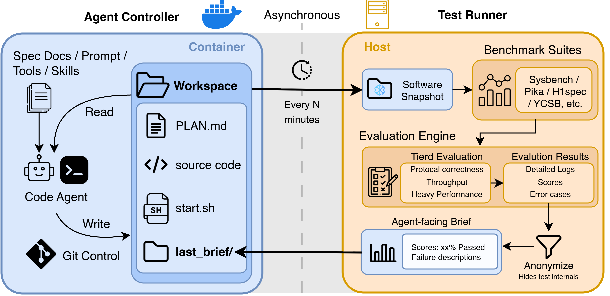
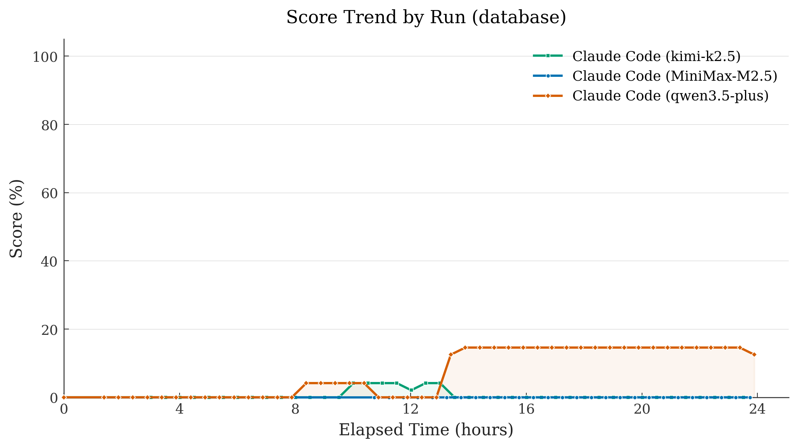
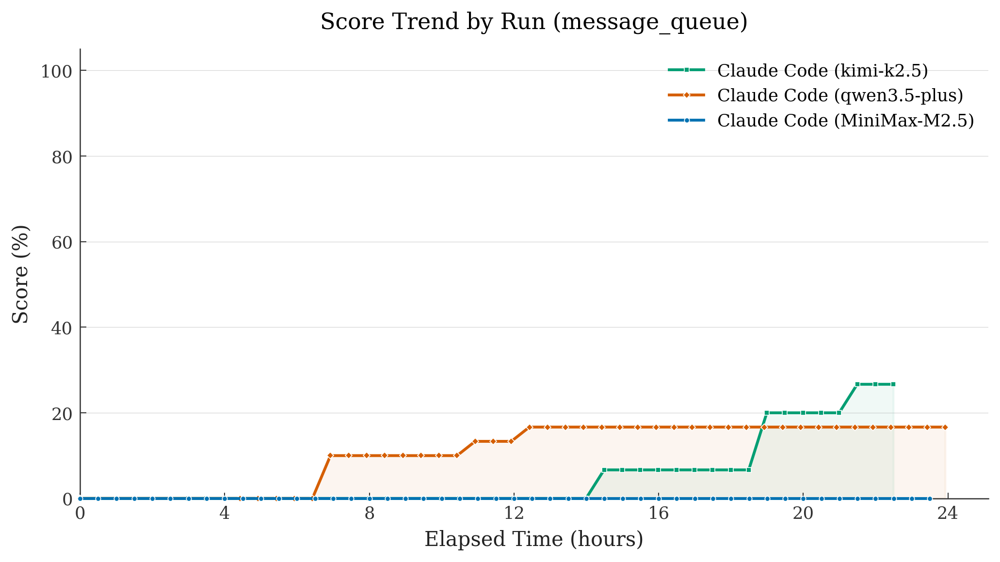
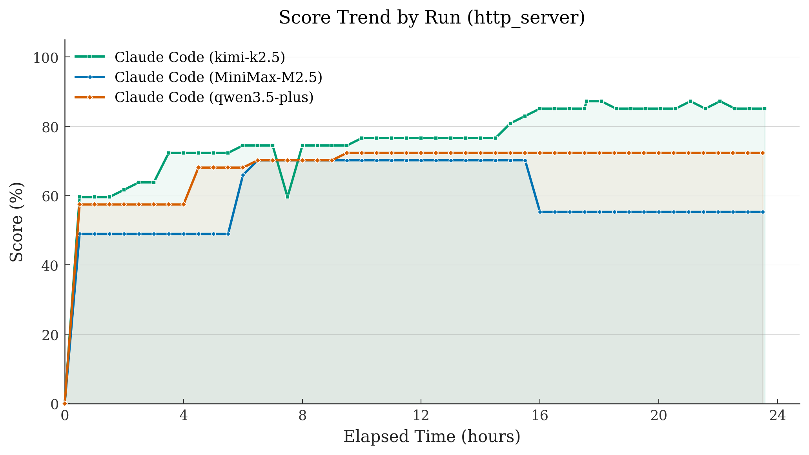
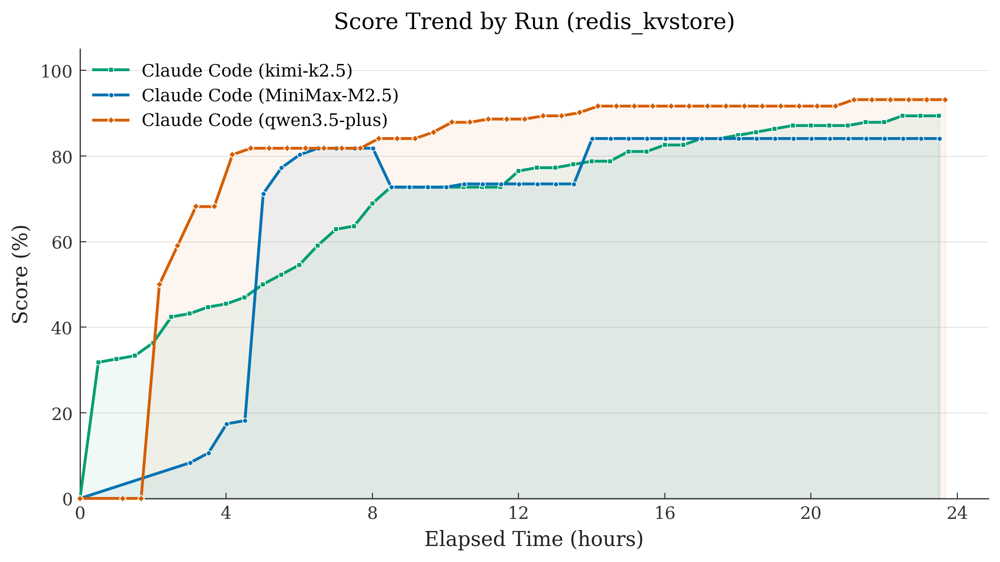
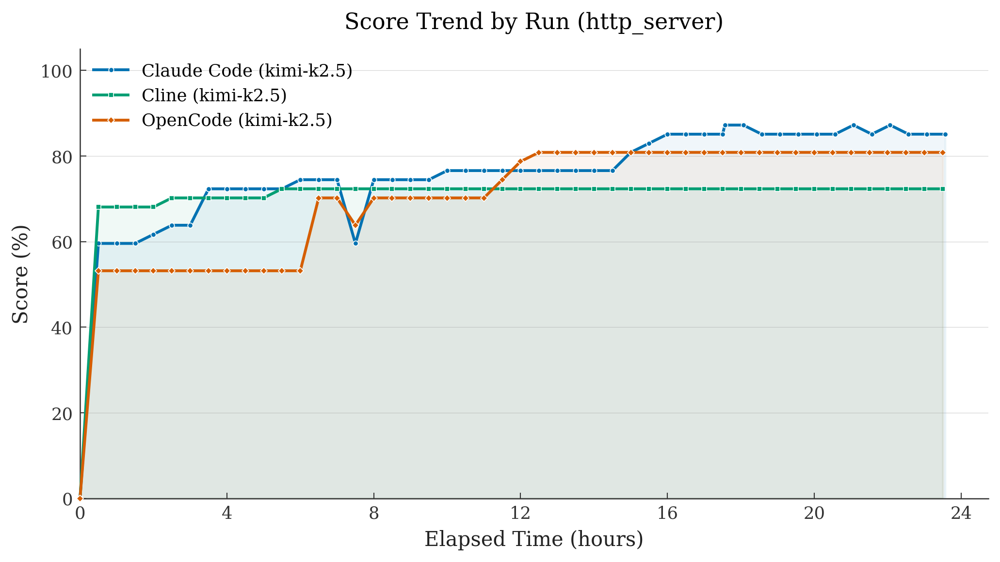

<div align="center">

# Hackathon-24h Bench

**Evaluación comparativa de agentes de larga duración en ingeniería de software a escala de proyecto**

[](LICENSE)
[](https://www.python.org/)
[](https://www.docker.com/)

[Inicio rápido](#inicio-rápido) · [Diseño de la evaluación comparativa](#diseño-de-la-evaluación-comparativa) · [Resultados](#resultados) · [Configuración](#configuración)

</div>

---

## Descripción general

Los benchmarks para agentes de codificación de IA, como SWE-Bench, se centran en tareas pequeñas y bien definidas, como la corrección de pull requests individuales. Aunque son útiles, no logran capturar la ingeniería de software del mundo real, donde los proyectos abarcan largos períodos de tiempo y requieren un desarrollo continuo y estructurado.

**Hackathon-24h** es un benchmark diseñado para evaluar a los agentes en entornos de ingeniería de software a escala de proyecto. En lugar de tareas cortas y aisladas, Hackathon-24h desafía a los agentes a operar continuamente durante **24 horas o más**, abordando objetivos complejos como construir un sistema de base de datos desde cero. Durante el proceso, se espera que los agentes no solo hagan progresos, sino que también entreguen versiones periódicas y utilizables, imitando los flujos de trabajo de desarrollo reales.

<p align="center">
  
</p>

## Clasificación

Puntuaciones máximas (%) alcanzadas en un plazo de 24 horas. Todas las ejecuciones utilizan Claude Code como framework de trabajo del agente. Número entre paréntesis = puntos totales por tarea.

| Modelo | Framework | Base de datos (48) | Cola de mensajes (30) | Servidor HTTP (47) | Redis KV (132) |
|-------|----------|---------------|---------------------|-------------------|----------------|
| Kimi-K2.5 | Claude Code | 4,2 % | **26,7 %** | **87,2 %** | 89,4 % |
| Qwen3.5-Plus | Claude Code | **14,6 %** | 16,7 % | 72,3 % | **93,2 %** |
| MiniMax-M2.5 | Claude Code | 0 % | 0 % | 70,2 % | 84,1 % |

## Características principales

| Característica | Descripción |
|---------|-------------|
| **Cuatro tipos de sistemas** | Base de datos, cola de mensajes, servidor HTTP y almacén de valores clave Redis, cada uno con complejidad a nivel de protocolo |
| **Frameworks de agentes plug-in** | Codex, Claude Code, OpenCode, Cline |
| **Soporte universal de proveedores** | APIs nativas, pasarelas y proxies con rotación automática de claves |
| **Evaluaciones comparativas escalonadas** | Niveles de dificultad progresivos (L0-L6) con suites de evaluación estándar de la industria |
| **Aislamiento Docker** | Ejecución de agentes en contenedores con privilegios mínimos |
| **Bucle de retroalimentación automatizado** | Resúmenes de evaluación comparativa anónimos que impulsan la mejora iterativa |
| **Diseño extensible** | Agregar nuevos tipos de sistemas, evaluaciones comparativas o agentes mediante un patrón de registro |

## Inicio rápido

### Requisitos previos

- Python 3.10+ (< 3.13)
- Docker

### 1. Instalación

```bash
git clone https://github.com/zzq2000/Hackathon-24h-Bench.git && cd Hackathon-24h-Bench && bash ./setup.sh
```

### 2. Configuración

```bash
cp .env.template .env     # completa con tus claves API
```

### 3. Ejecución

```bash
./start_system_docker.sh --agent claude --system-type database --model <tu-modelo>
```

La imagen Docker se construye automáticamente en la primera ejecución. Para monitorear o detener una ejecución:

```bash
./stop_system_docker.sh --list
```

## Diseño de la evaluación comparativa

Hackathon-24h actualmente comprende cuatro tareas. Hemos elegido estos sistemas deliberadamente: cada uno tiene una especificación precisa y públicamente documentada, cuenta con suites de pruebas industriales establecidas como jueces externos, soporta un progreso incremental en lugar de un resultado único de éxito o fracaso, y es lo suficientemente complejo como para que las regresiones sean fáciles de introducir pero difíciles de detectar.

### Evaluación multi-nivel

Cada tarea está organizada en una escalera de niveles de dificultad creciente, evaluada en función de benchmarks industriales establecidos. No escribimos ninguno de los casos de prueba nosotros mismos.

| Tarea | Niveles | Casos de prueba | Suites de evaluación | Parámetro |
|------|-------|-------------|-------------------|---------|
| Base de datos | L0-L3 | 48 | [Sysbench](https://github.com/akopytov/sysbench), [TPC-C](https://www.tpc.org/tpcc/), [TPC-H](https://www.tpc.org/tpch/) | `--system-type database` |
| Cola de mensajes | L0-L2 | 30 | [pika](https://github.com/pika/pika), [OMQ](https://github.com/rabbitmq/omq), [RabbitMQ PerfTest](https://github.com/rabbitmq/rabbitmq-perf-test) | `--system-type message_queue` |
| Servidor HTTP | L0-L4 | 47 | [h1spec](https://github.com/uNetworking/h1spec), [CISPA](https://github.com/cispa/http-conformance), [TFB](https://github.com/TechEmpower/FrameworkBenchmarks) | `--system-type http_server` |
| Almacén de valores clave Redis | L0-L6 | 132 | TCL de Redis, [YCSB](https://github.com/brianfrankcooper/YCSB), [memtier](https://github.com/RedisLabs/memtier_benchmark) | `--system-type redis_kvstore` |

### Arquitectura dual de bucle desacoplado

El **bucle del agente** se ejecuta dentro de un contenedor Docker: un agente de codificación recibe una especificación de referencia y un mensaje inicial (sin código de inicio), y luego construye continuamente el sistema sin límites de tiempo o tokens. El **bucle de pruebas** se ejecuta en el host: periódicamente toma instantáneas del espacio de trabajo, ejecuta benchmarks en aislamiento y proporciona un resumen anónimo. Los dos bucles solo se comunican a través del espacio de trabajo compartido y el resumen; nunca se ejecutan en el mismo entorno.

El agente aprende qué áreas aprobaron o fallaron, pero nunca ve los casos de prueba específicos. Esto evita que se manipulen pruebas específicas y, en su lugar, impulsa al agente a desarrollar una capacidad real. La retroalimentación está intencionalmente algo desactualizada, por lo que el agente no puede confiar en ella ciegamente: debe reconciliar esta señal retrasada con sus propias observaciones y razonamientos locales.

## Agentes compatibles

| Agente | Herramienta CLI | Proveedores |
|-------|----------|-----------|
| Codex | `codex` | OpenAI, LiteLLM, OpenRouter |
| Claude Code | `claude` | Anthropic, Z.AI Gateway, Bailian Gateway, Moonshot Gateway, MiniMax Gateway, LiteLLM, OpenRouter |
| OpenCode | `opencode` | OpenAI, Anthropic, Google, X.AI, OpenRouter, DashScope, Bailian Gateway, LiteLLM, Azure OpenAI, vLLM, SGLang |
| Cline | `cline` | Anthropic, OpenAI, Bailian OpenAI Gateway, LiteLLM, OpenRouter, vLLM, SGLang |

## Resultados

Evaluamos tres modelos (Kimi-K2.5, Qwen3.5-Plus, MiniMax-M2.5) en las cuatro tareas utilizando Claude Code como framework de trabajo del agente. Cada ejecución tuvo un plazo de 24 horas. También comparamos tres frameworks de agentes en la tarea HTTP con el mismo modelo subyacente (Kimi-K2.5). En las figuras a continuación, las entradas de la leyenda siguen el formato `framework_modelo` (por ejemplo, `claude_kimi-k2.5` significa Claude Code + Kimi-K2.5).

### Base de datos (48 pruebas)

Desarrollar un sistema de base de datos es la tarea más difícil. Qwen3.5-Plus alcanzó un máximo del 14,6 %; Kimi-K2.5 llegó al 4,2 % y luego decayó al 0 %.

<p align="center">
  
</p>

### Cola de mensajes (30 pruebas)

Kimi-K2.5 pasó 14,5 horas en 0 % antes de subir al 26,7 %. MiniMax-M2.5 completó 85 iteraciones y marcó 28 tareas de plan como "DONE", pero obtuvo 0 % en todos los 47 ciclos de prueba.

<p align="center">
  
</p>

### Servidor HTTP (47 pruebas)

Kimi-K2.5 alcanzó el 87,2 % y se recuperó de las regresiones. MiniMax-M2.5 alcanzó un máximo del 70,2 % y luego decayó al 55,3 % sin notarlo.

<p align="center">
  
</p>

### Almacén de valores clave Redis (132 pruebas)

La tarea más fácil. Qwen3.5-Plus alcanzó el 93,2 % en solo 29 iteraciones. Los tres modelos obtuvieron puntuaciones superiores al 84 %.

<p align="center">
  
</p>

### Comparación entre agentes (Servidor HTTP, Kimi-K2.5)

Para aislar el impacto del framework de trabajo del agente en sí, ejecutamos el mismo modelo subyacente en múltiples frameworks bajo condiciones idénticas. A pesar de compartir el mismo modelo, observamos una diferencia de ~13 puntos en las puntuaciones finales de 24 horas: Claude Code alcanza el 85,1 %, OpenCode el 80,9 % y Cline el 72,3 %.

| Agente | Iteraciones (24h) | Puntuación máxima | Puntuación final |
|-------|-------------------|------------|-------------|
| Claude Code | 188 | 87,2 % (41/47) | 85,1 % (40/47) |
| OpenCode | 180 | 80,9 % (38/47) | 80,9 % (38/47) |
| Cline | 40 | 72,3 % (34/47) | 72,3 % (34/47) |

<p align="center">
  
</p>

## Llamado a contribuciones

Hackathon-24h es de código abierto y está creciendo activamente. Agradecemos contribuciones en varias áreas:

- **Patrocinio de API LLM**: Ayuda a expandir la cobertura patrocinando el acceso a API para evaluar más modelos
- **Integraciones de frameworks**: Agregar soporte para nuevos frameworks de agentes y entornos de ejecución
- **Evaluaciones de modelos**: Ejecuta tus propios modelos y contribuye con resultados a la clasificación
- **Mejoras del benchmark**: Extender el benchmark con nuevas tareas o mejorar el sistema de evaluación y puntuación

Por favor, contacta a [Ziqin](mailto:ziqin.zhu@auckland.ac.nz) o [Zewen](https://zewen-chi.github.io/) para más detalles sobre contribuciones.

## Configuración

### Variables de entorno

Crea un archivo `.env` (nunca lo comitas) con tus claves API. El archivo `.env.template` generado por `setup.sh` contiene todas las variables compatibles. A continuación se muestra un resumen por categoría:

#### Claves API de agentes nativos

| Variable | Agente | Descripción |
|----------|-------|-------------|
| `OPENAI_API_KEY` | Codex, OpenCode, Cline | Clave API nativa de OpenAI |
| `ANTHROPIC_API_KEY` | Claude, OpenCode, Cline | Clave API nativa de Anthropic |
| `OPENCODE_API_KEY` | OpenCode | Clave API de OpenCode (para Bailian, OpenRouter, Moonshot, MiniMax) |
| `KIMI_API_KEY` | Claude, Cline | Clave API de Moonshot / Kimi |
| `MINIMAX_API_KEY` | Claude, Cline | Clave API de MiniMax |

#### Claves de gateway y plataforma

| Variable | Gateway / Plataforma | Usado por |
|----------|--------------------|-----------|
| `ANTHROPIC_AUTH_TOKEN` | Bailian / Z.AI / Moonshot / MiniMax Claude Gateway | Claude |
| `ANTHROPIC_BASE_URL` | Anulación del punto de conexión del gateway | Claude |
| `DASHSCOPE_API_KEY` | DashScope / Bailian | Claude, Cline, OpenCode |
| `CLINE_API_KEY` | Anulación de clave genérica de Cline | Cline |
| `CLINE_BASE_URL` | Anulación de URL base de Cline | Cline |
| `CLINE_PROVIDER` | Selector de proveedor de Cline (`anthropic`, `openai`, `bailian`) | Cline |

#### Proxy / Autoalojados

| Variable | Proveedor |
|----------|----------|
| `OPENROUTER_API_KEY` | OpenRouter |
| `LITELLM_API_KEY` / `LITELLM_BASE_URL` | Proxy LiteLLM |
| `VLLM_API_KEY` / `VLLM_BASE_URL` | vLLM |
| `SGLANG_API_KEY` / `SGLANG_BASE_URL` | SGLang |

### Archivos de configuración clave

| Archivo | Propósito |
|------|---------|
| `config/global.yaml` | Configuración del programador, parámetros del agente y del sistema de pruebas |
| `config/providers.yaml` | Definiciones de proveedores/modelos, enrutamiento de API |
| `config/system.<type>.yaml` | Valores predeterminados y escaleras de niveles para cada sistema de benchmark |

### Ajustes del controlador

| Variable | Descripción | Valor predeterminado |
|----------|-------------|---------|
| `CODE_AGENT_WAIT_TIME` | Segundos entre iteraciones de mejora | 60 |
| `CODE_AGENT_MAX_RETRIES` | Número de reintentos para comandos del agente | desde la configuración |
| `CODE_AGENT_COMMAND_TIMEOUT` | Tiempo de espera por comando del agente (segundos) | desde la configuración |
| `TEST_INTERVAL` | Intervalo del ejecutor de pruebas (segundos, inicio a inicio) | 900 |
| `BENCHMARK_TIMEOUT` | Tiempo de espera por benchmark (segundos) | 900 |

## Estructura del proyecto

```
Hackathon-24h-Bench/
├── sut/                          # Capa de abstracción del sistema bajo prueba
├── benchmarks/                   # Implementaciones del ejecutor de benchmarks
├── feedback/                     # Formato de comentarios anónimos
├── test_runner/                  # Orquestación y programación de pruebas
├── code_agent_controller/        # Controlador de agentes de código e implementaciones de agentes
│   ├── agents/                   # Adaptadores de agentes (claude, codex, opencode, cline, ...)
│   └── providers/                # Registro de proveedores y rotación de claves
├── metrics/                      # Agregación y reporte de métricas
├── config/                       # Archivos de configuración YAML
├── workspace/                    # Directorios de trabajo del agente (por sistema/ejecución)
├── start_system_docker.sh        # Inicio en modo Docker
└── stop_system_docker.sh        # Detención en modo Docker
```

## Notas de seguridad

1. Nunca cometas claves API al control de versiones: usa .env (gitignored) para todos los secretos.
2. Las ejecuciones de Hackathon-24h son intensivas en recursos y consumen una gran cantidad de tokens: monitorea tu uso de API y establece límites de gasto antes de iniciar una ejecución de 24 horas.
3. Los agentes deben ejecutarse solo dentro de contenedores Docker: nunca ejecutes agentes de código fuera de Docker para evitar modificaciones no deseadas en tu sistema host.

## Cita

Si utilizas Hackathon-24h en tu investigación, por favor cita:

```bibtex
@misc{zhu2026hackathon24hbench,
  title     = {Hackathon-24h Bench: Benchmarking Long-Running Agents
               on Project-Scale Software Engineering},
  author    = {Zhu, Ziqin and Chi, Zewen and Witbrock, Michael and Dong, Li and Wei, Furu
               and Liu, Qian},
  year      = {2026},
  howpublished = {\url{https://zhuziqin-blogs.notion.site/hackathon-24h-bench}}
}
```

## Licencia

Este proyecto está licenciado bajo la [Licencia Apache 2.0](LICENSE).
