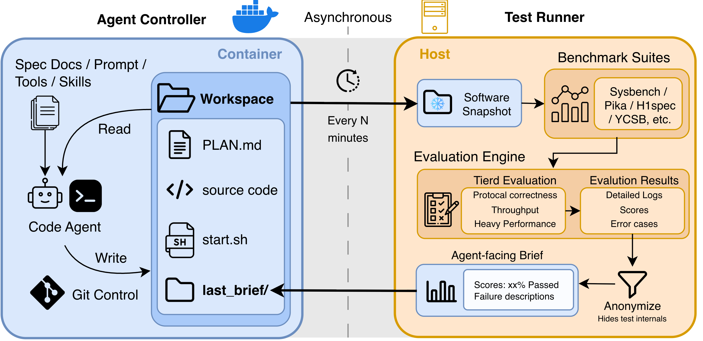
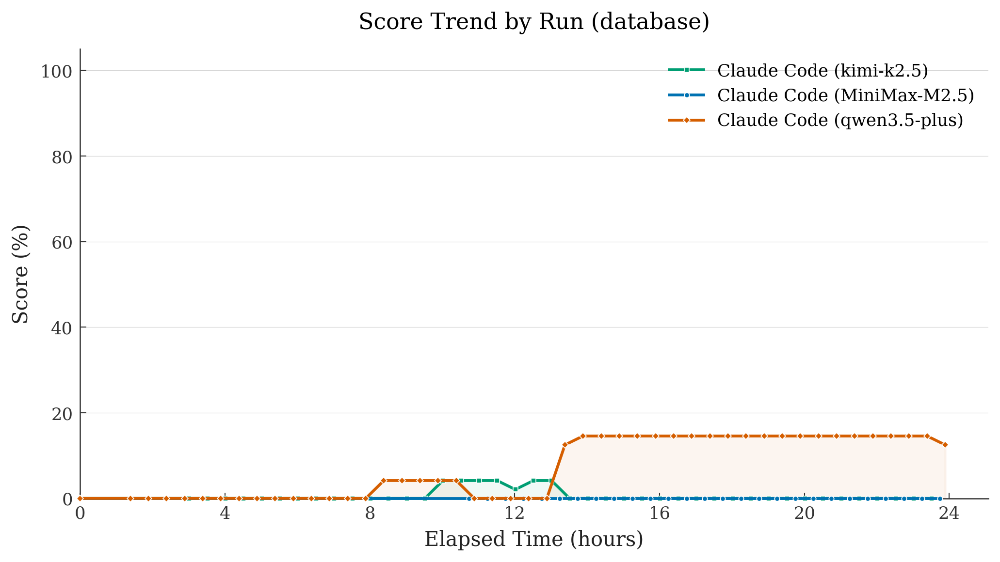
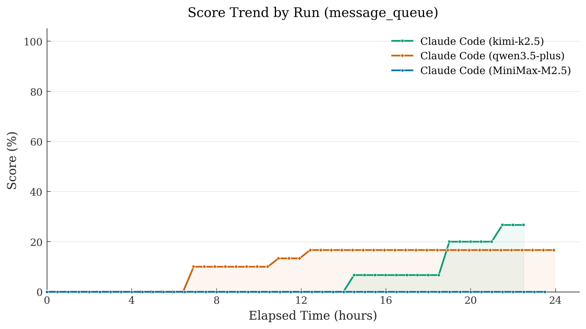
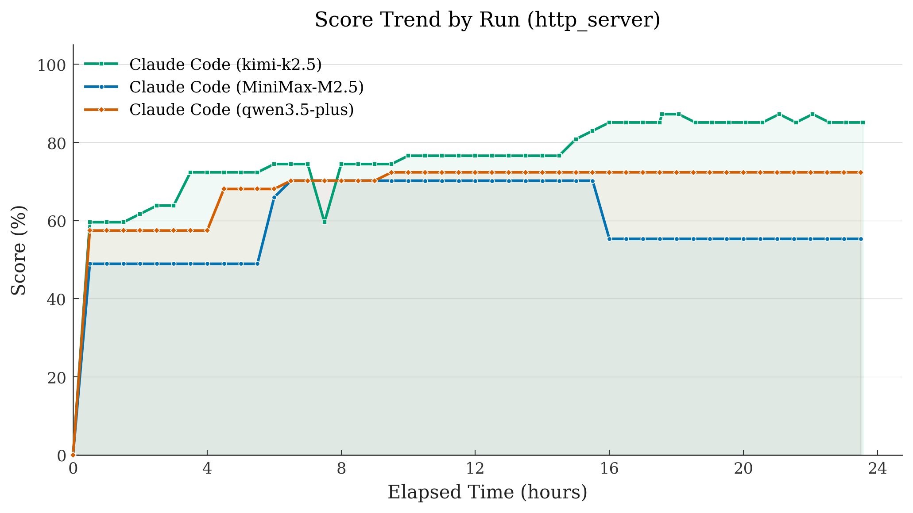
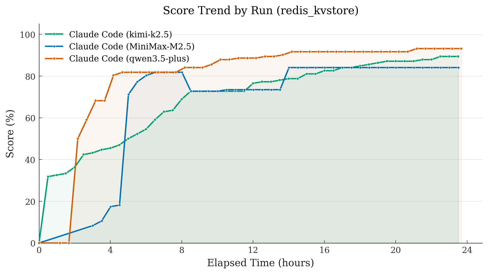
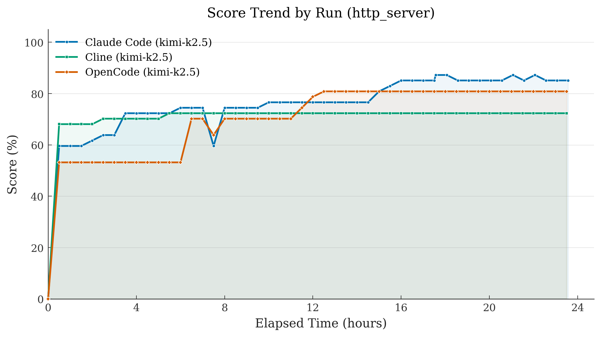

<div align="center">

# Hackathon-24h Bench

**Benchmarking Long-Running Agents on Project-Scale Software Engineering**

[](LICENSE)
[](https://www.python.org/)
[](https://www.docker.com/)

[Quick Start](#quick-start) · [Benchmark Design](#benchmark-design) · [Results](#results) · [Configuration](#configuration) 

</div>

---

## Overview

Benchmarks for AI coding agents, such as SWE-Bench, focus on relatively small, well-scoped tasks like fixing individual pull requests. While useful, they fall short of capturing real-world software engineering, where projects span long time horizons and require continuous, structured development.

**Hackathon-24h** is a benchmark designed to evaluate agents in project-scale software engineering settings. Instead of short, isolated tasks, Hackathon-24h challenges agents to operate continuously for **24 hours** or more, tackling complex objectives such as building a database system from scratch. Along the way, agents are expected not only to make progress, but also to deliver periodic, usable releases, mirroring real development workflows.

<p align="center">
  
</p>

## Leaderboard

Peak scores (%) achieved within a 24-hour window. All runs use Claude Code as the harness framework. Number in parentheses = total test points per task.

| Model | Harness | Database (48) | Message Queue (30) | HTTP Server (47) | Redis KV (132) |
|-------|---------|---------------|---------------------|-------------------|----------------|
| Kimi-K2.5 | Claude Code | 4.2% | **26.7%** | **87.2%** | 89.4% |
| Qwen3.5-Plus | Claude Code | **14.6%** | 16.7% | 72.3% | **93.2%** |
| MiniMax-M2.5 | Claude Code | 0% | 0% | 70.2% | 84.1% |

## Key Features

| Feature | Description |
|---------|-------------|
| **Four System Types** | Database, message queue, HTTP server, Redis KV store -- each with protocol-level complexity |
| **Pluggable Agent Harnesses** | Codex, Claude Code, OpenCode, Cline |
| **Universal Provider Support** | Native APIs, gateways, and proxy providers with automatic key rotation |
| **Tiered Benchmarks** | Progressive difficulty tiers (L0--L6) with industry-standard evaluation suites |
| **Docker Isolation** | Sandboxed agent execution with minimal privileges |
| **Automated Feedback Loop** | Anonymized benchmark briefs drive iterative improvement |
| **Extensible Design** | Add new system types, benchmarks, or agents via registry pattern |

## Quick Start

### Prerequisites

- Python 3.10+ (< 3.13)
- Docker

### 1. Install

```bash
git clone https://github.com/zzq2000/Hackathon-24h-Bench.git && cd Hackathon-24h-Bench && bash ./setup.sh
```

### 2. Configure

```bash
cp .env.template .env     # fill in your API key(s)
```

### 3. Run

```bash
./start_system_docker.sh --agent claude --system-type database --model <your-model>
```

The Docker image builds automatically on first run. To monitor or stop a run:

```bash
./stop_system_docker.sh --list
```

## Benchmark Design

Hackathon-24h currently comprises four tasks. We chose these systems deliberately: each comes with a precise, publicly documented specification, has established industrial test suites as external judges, supports incremental progress rather than a single pass-or-fail outcome, and is complex enough that regressions are easy to introduce but hard to detect.

### Multi-Tier Evaluation

Each task is organised into a tier ladder of increasing difficulty, scored against established industrial benchmarks. We wrote none of the test cases ourselves.

| Task | Tiers | Test Cases | Evaluation Suites |
|------|-------|------------|-------------------|
| Database | L0--L3 | 48 | [Sysbench](https://github.com/akopytov/sysbench), [TPC-C](https://www.tpc.org/tpcc/), [TPC-H](https://www.tpc.org/tpch/) |
| Message Queue | L0--L2 | 30 | [pika](https://github.com/pika/pika), [OMQ](https://github.com/rabbitmq/omq), [RabbitMQ PerfTest](https://github.com/rabbitmq/rabbitmq-perf-test) |
| HTTP Server | L0--L4 | 47 | [h1spec](https://github.com/uNetworking/h1spec), [CISPA](https://github.com/cispa/http-conformance), [TFB](https://github.com/TechEmpower/FrameworkBenchmarks) |
| Redis KV Store | L0--L6 | 132 | Redis TCL, [YCSB](https://github.com/brianfrankcooper/YCSB), [memtier](https://github.com/RedisLabs/memtier_benchmark) |

### Decoupled Dual-Loop Architecture

The **agent loop** runs inside a Docker container: a coding agent receives a reference specification and an initial prompt (without starter code), then continuously builds the system with no time or token limits. The **test loop** runs on the host: it periodically snapshots the workspace, runs benchmarks in isolation, and feeds back an anonymised brief. The two loops communicate only through the shared workspace and the brief; they never run in the same environment.

The agent learns which areas passed or failed, but never sees specific test cases. This prevents hacking specific tests and instead pushes the agent to develop real capability. The feedback is intentionally slightly stale, so the agent cannot rely on it blindly -- it must reconcile this delayed signal with its own local observations and reasoning.

## Supported Agents

| Agent | CLI Tool | Providers |
|-------|----------|-----------|
| Codex | `codex` | OpenAI, LiteLLM, OpenRouter |
| Claude Code | `claude` | Anthropic, Z.AI Gateway, Bailian Gateway, Moonshot Gateway, MiniMax Gateway, LiteLLM, OpenRouter |
| OpenCode | `opencode` | OpenAI, Anthropic, Google, X.AI, OpenRouter, DashScope, Bailian Gateway, LiteLLM, Azure OpenAI, vLLM, SGLang |
| Cline | `cline` | Anthropic, OpenAI, Bailian OpenAI Gateway, LiteLLM, OpenRouter, vLLM, SGLang |

## Results

We evaluated three models (**Kimi-K2.5**, **Qwen3.5-Plus**, **MiniMax-M2.5**) across all four tasks using Claude Code as the agent framework. Each run had a **24-hour window**. We also compared three harness frameworks on the HTTP task with the same underlying model (Kimi-K2.5). In the figures below, legend entries follow the format `harness_model` (e.g. `claude_kimi-k2.5` means Claude Code + Kimi-K2.5).

### Database (48 tests)

Developing a database system is the hardest task. Qwen3.5-Plus peaked at 14.6%; Kimi-K2.5 reached 4.2% but regressed to 0%.

<p align="center">
  
</p>

### Message Queue (30 tests)

Kimi-K2.5 spent 14.5 hours at 0% before climbing to 26.7%. MiniMax-M2.5 completed 85 iterations and marked 28 plan tasks "DONE" while scoring 0% on all 47 test cycles.

<p align="center">
  
</p>

### HTTP Server (47 tests)

Kimi-K2.5 reached 87.2% and recovered from regressions. MiniMax-M2.5 peaked at 70.2% then regressed to 55.3% without noticing.

<p align="center">
  
</p>

### Redis KV Store (132 tests)

The easiest task. Qwen3.5-Plus reached 93.2% in only 29 iterations. All three models scored above 84%.

<p align="center">
  
</p>

### Cross-Agent Comparison (HTTP Server, Kimi-K2.5)

To isolate the impact of the agent framework itself, we run the same underlying model across multiple harnesses under identical conditions. Despite sharing the exact same model, we observe a ~13-point gap in final 24-hour scores: Claude Code reaches 85.1%, OpenCode 80.9%, and Cline 72.3%.

| Agent | Iterations (24h) | Peak Score | Final Score |
|-------|-------------------|------------|-------------|
| Claude Code | 188 | 87.2% (41/47) | 85.1% (40/47) |
| OpenCode | 180 | 80.9% (38/47) | 80.9% (38/47) |
| Cline | 40 | 72.3% (34/47) | 72.3% (34/47) |

<p align="center">
  
</p>

## Call for Contributions

Hackathon-24h is open source and actively growing. We welcome contributions in several areas:

- **LLM API sponsorship**: Help expand coverage by sponsoring API access for evaluating more models
- **Harness integrations**: Add support for new agent frameworks and execution environments
- **Model evaluations**: Run your own models and contribute results to the leaderboard
- **Benchmark improvements**: Extend the benchmark with new tasks or improve the evaluation and scoring system

Please contact [Ziqin](mailto:ziqin.zhu@auckland.ac.nz) or [Zewen](https://zewen-chi.github.io/) for further contribution details.

## Configuration

### Environment Variables

Create a `.env` file (never commit this) with your API keys. The `.env.template` generated by `setup.sh` contains all supported variables. Below is a summary by category:

#### Agent API Keys (Native)

| Variable | Agent | Description |
|----------|-------|-------------|
| `OPENAI_API_KEY` | Codex, OpenCode, Cline | OpenAI native API key |
| `ANTHROPIC_API_KEY` | Claude, OpenCode, Cline | Anthropic native API key |
| `OPENCODE_API_KEY` | OpenCode | OpenCode API key (for Bailian, OpenRouter, Moonshot, MiniMax) |
| `KIMI_API_KEY` | Claude, Cline | Moonshot / Kimi API key |
| `MINIMAX_API_KEY` | Claude, Cline | MiniMax API key |

#### Gateway & Platform Keys

| Variable | Gateway / Platform | Used By |
|----------|--------------------|---------|
| `ANTHROPIC_AUTH_TOKEN` | Bailian / Z.AI / Moonshot / MiniMax Claude Gateway | Claude |
| `ANTHROPIC_BASE_URL` | Gateway endpoint override | Claude |
| `DASHSCOPE_API_KEY` | DashScope / Bailian | Claude, Cline, OpenCode |
| `CLINE_API_KEY` | Cline generic key override | Cline |
| `CLINE_BASE_URL` | Cline base URL override | Cline |
| `CLINE_PROVIDER` | Cline provider selector (`anthropic`, `openai`, `bailian`) | Cline |

#### Proxy / Self-Hosted

| Variable | Provider |
|----------|----------|
| `OPENROUTER_API_KEY` | OpenRouter |
| `LITELLM_API_KEY` / `LITELLM_BASE_URL` | LiteLLM Proxy |
| `VLLM_API_KEY` / `VLLM_BASE_URL` | vLLM |
| `SGLANG_API_KEY` / `SGLANG_BASE_URL` | SGLang |

### Key Configuration Files

| File | Purpose |
|------|---------|
| `config/global.yaml` | Scheduler timing, agent settings, test parameters |
| `config/providers.yaml` | Provider/model definitions, API routing |
| `config/system.<type>.yaml` | Per-system benchmark defaults and tier ladders |

### Controller Tuning

| Variable | Description | Default |
|----------|-------------|---------|
| `CODE_AGENT_WAIT_TIME` | Seconds between improvement iterations | 60 |
| `CODE_AGENT_MAX_RETRIES` | Retry count for agent commands | from config |
| `CODE_AGENT_COMMAND_TIMEOUT` | Timeout per agent command (seconds) | from config |
| `TEST_INTERVAL` | Test runner interval (seconds, start-to-start) | 900 |
| `BENCHMARK_TIMEOUT` | Per-benchmark timeout (seconds) | 900 |

## Project Structure

```
Hackathon-24h-Bench/
├── sut/                          # System Under Test abstraction layer
├── benchmarks/                   # Benchmark runner implementations
├── feedback/                     # Anonymized feedback formatting
├── test_runner/                  # Test orchestration and scheduling
├── code_agent_controller/        # AI agent controller and agent implementations
│   ├── agents/                   # Agent adapters (claude, codex, opencode, cline, ...)
│   └── providers/                # Provider registry and key rotation
├── metrics/                      # Metrics aggregation and reporting
├── config/                       # YAML configuration files
├── workspace/                    # Agent working directories (per system/run)
├── start_system_docker.sh        # Docker-mode startup
└── stop_system_docker.sh         # Docker-mode shutdown
```

## Safety Notes

1. Never commit API keys to version control -- use .env (gitignored) for all secrets
2. Hackathon-24h runs are resource-intensive and consume a large number of tokens -- monitor your API usage and set spending limits before starting a 24-hour run
3. Agents should only execute inside Docker containers -- never run code agents outside of Docker to avoid unintended modifications to your host system

## Citation

If you use Hackathon-24h in your research, please cite:

```bibtex
@misc{zhu2026hackathon24hbench,
  title     = {Hackathon-24h Bench: Benchmarking Long-Running Agents
               on Project-Scale Software Engineering},
  author    = {Zhu, Ziqin and Chi, Zewen and Witbrock, Michael and Dong, Li and Wei, Furu
               and Liu, Qian},
  year      = {2026},
  howpublished = {\url{https://zhuziqin-blogs.notion.site/hackathon-24h-bench}}
}
```

## License

This project is licensed under the [Apache License 2.0](LICENSE).
