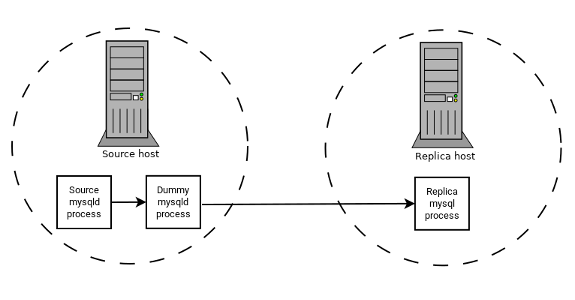

## 18.6 The BLACKHOLE Storage Engine

The `BLACKHOLE` storage engine acts as a
“black hole” that accepts data but throws it away and
does not store it. Retrievals always return an empty result:

```sql
mysql> CREATE TABLE test(i INT, c CHAR(10)) ENGINE = BLACKHOLE;
Query OK, 0 rows affected (0.03 sec)

mysql> INSERT INTO test VALUES(1,'record one'),(2,'record two');
Query OK, 2 rows affected (0.00 sec)
Records: 2  Duplicates: 0  Warnings: 0

mysql> SELECT * FROM test;
Empty set (0.00 sec)
```

To enable the `BLACKHOLE` storage engine if you
build MySQL from source, invoke **CMake** with the
[`-DWITH_BLACKHOLE_STORAGE_ENGINE`](source-configuration-options.md#option_cmake_storage_engine_options "Storage Engine Options")
option.

To examine the source for the `BLACKHOLE` engine,
look in the `sql` directory of a MySQL source
distribution.

When you create a `BLACKHOLE` table, the server
creates the table definition in the global data dictionary. There
are no files associated with the table.

The `BLACKHOLE` storage engine supports all kinds
of indexes. That is, you can include index declarations in the table
definition.

The maximum key length is 3072 bytes as of MySQL 8.0.27. Prior to
8.0.27, the maximum key length is 1000 bytes.

The `BLACKHOLE` storage engine does not support
partitioning.

You can check whether the `BLACKHOLE` storage
engine is available with the [`SHOW
ENGINES`](show-engines.md "15.7.7.16 SHOW ENGINES Statement") statement.

Inserts into a `BLACKHOLE` table do not store any
data, but if statement based binary logging is enabled, the SQL
statements are logged and replicated to replica servers. This can be
useful as a repeater or filter mechanism.

Suppose that your application requires replica-side filtering rules,
but transferring all binary log data to the replica first results in
too much traffic. In such a case, it is possible to set up on the
replication source server a “dummy” replica process
whose default storage engine is `BLACKHOLE`,
depicted as follows:

**Figure 18.1 Replication using BLACKHOLE for Filtering**



The source writes to its binary log. The “dummy”
[**mysqld**](mysqld.md "6.3.1 mysqld — The MySQL Server") process acts as a replica, applying the
desired combination of `replicate-do-*` and
`replicate-ignore-*` rules, and writes a new,
filtered binary log of its own. (See
[Section 19.1.6, “Replication and Binary Logging Options and Variables”](replication-options.md "19.1.6 Replication and Binary Logging Options and Variables").) This filtered log is
provided to the replica.

The dummy process does not actually store any data, so there is
little processing overhead incurred by running the additional
[**mysqld**](mysqld.md "6.3.1 mysqld — The MySQL Server") process on the replication source server.
This type of setup can be repeated with additional replicas.

[`INSERT`](insert.md "15.2.7 INSERT Statement") triggers for
`BLACKHOLE` tables work as expected. However,
because the `BLACKHOLE` table does not actually
store any data, [`UPDATE`](update.md "15.2.17 UPDATE Statement") and
[`DELETE`](delete.md "15.2.2 DELETE Statement") triggers are not activated:
The `FOR EACH ROW` clause in the trigger definition
does not apply because there are no rows.

Other possible uses for the `BLACKHOLE` storage
engine include:

- Verification of dump file syntax.
- Measurement of the overhead from binary logging, by comparing
  performance using `BLACKHOLE` with and without
  binary logging enabled.
- `BLACKHOLE` is essentially a
  “no-op” storage engine, so it could be used for
  finding performance bottlenecks not related to the storage
  engine itself.

The `BLACKHOLE` engine is transaction-aware, in the
sense that committed transactions are written to the binary log and
rolled-back transactions are not.

**Blackhole Engine and Auto Increment
Columns**

The `BLACKHOLE` engine is a no-op engine. Any
operations performed on a table using `BLACKHOLE`
have no effect. This should be borne in mind when considering the
behavior of primary key columns that auto increment. The engine does
not automatically increment field values, and does not retain auto
increment field state. This has important implications in
replication.

Consider the following replication scenario where all three of the
following conditions apply:

1. On a source server there is a blackhole table with an auto
   increment field that is a primary key.
2. On a replica the same table exists but using the MyISAM engine.
3. Inserts are performed into the source's table without explicitly
   setting the auto increment value in the
   `INSERT` statement itself or through using a
   `SET INSERT_ID` statement.

In this scenario replication fails with a duplicate entry error on
the primary key column.

In statement based replication, the value of
`INSERT_ID` in the context event is always the
same. Replication therefore fails due to trying insert a row with a
duplicate value for a primary key column.

In row based replication, the value that the engine returns for the
row always be the same for each insert. This results in the replica
attempting to replay two insert log entries using the same value for
the primary key column, and so replication fails.

**Column Filtering**

When using row-based replication,
([`binlog_format=ROW`](replication-options-binary-log.md#sysvar_binlog_format)), a replica
where the last columns are missing from a table is supported, as
described in the section
[Section 19.5.1.9, “Replication with Differing Table Definitions on Source and Replica”](replication-features-differing-tables.md "19.5.1.9 Replication with Differing Table Definitions on Source and Replica").

This filtering works on the replica side, that is, the columns are
copied to the replica before they are filtered out. There are at
least two cases where it is not desirable to copy the columns to the
replica:

1. If the data is confidential, so the replica server should not
   have access to it.
2. If the source has many replicas, filtering before sending to the
   replicas may reduce network traffic.

Source column filtering can be achieved using the
`BLACKHOLE` engine. This is carried out in a way
similar to how source table filtering is achieved - by using the
`BLACKHOLE` engine and the
[`--replicate-do-table`](replication-options-replica.md#option_mysqld_replicate-do-table) or
[`--replicate-ignore-table`](replication-options-replica.md#option_mysqld_replicate-ignore-table) option.

The setup for the source is:

```sql
CREATE TABLE t1 (public_col_1, ..., public_col_N,
                 secret_col_1, ..., secret_col_M) ENGINE=MyISAM;
```

The setup for the trusted replica is:

```sql
CREATE TABLE t1 (public_col_1, ..., public_col_N) ENGINE=BLACKHOLE;
```

The setup for the untrusted replica is:

```sql
CREATE TABLE t1 (public_col_1, ..., public_col_N) ENGINE=MyISAM;
```
