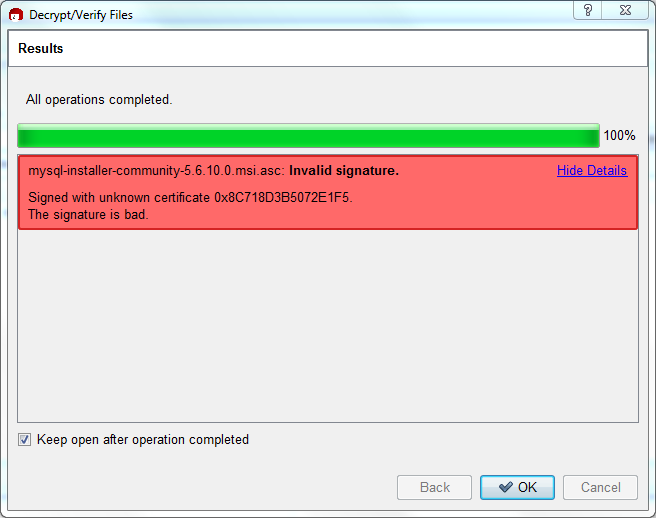

#### 2.1.4.3 Signature Checking Using Gpg4win for Windows

The [Section 2.1.4.2, “Signature Checking Using GnuPG”](checking-gpg-signature.md "2.1.4.2 Signature Checking Using GnuPG") section describes
how to verify MySQL downloads using GPG. That guide also applies
to Microsoft Windows, but another option is to use a GUI tool
like [Gpg4win](http://www.gpg4win.org/). You
may use a different tool but our examples are based on Gpg4win,
and utilize its bundled `Kleopatra` GUI.

Download and install Gpg4win, and then load Kleopatra. The
dialog should look similar to:

**Figure 2.1 Kleopatra: Initial Screen**

![Shows the default Kleopatra screen. The top menu includes "File", "View", "Certificates", "Tools", "Settings", "Window", and "Help.". Underneath the top menu is a horizontal action bar with available buttons to "Import Certificates", "Redisplay", and "Lookup Certificates on Server". Greyed out buttons are "Export Certificates" and "Stop Operation". Underneath is a search box titled "Find". Underneath that are three tabs: "My Certificates", "Trusted Certificates", and "Other Certificates" with the "My Certificates" tab selected. "My Certificates" contains six columns: "Name", "E-Mail", "Valid From", "Valid Until", "Details", and "Key-ID". There are no example values.](images/gnupg-kleopatra-home.png)

Next, add the MySQL Release Engineering certificate. Do this by
clicking File, Lookup Certificates
on Server. Type "Mysql Release Engineering" into the
search box and press Search.

**Figure 2.2 Kleopatra: Lookup Certificates on Server Wizard: Finding a Certificate**

Select the "MySQL Release Engineering" certificate. The
Fingerprint and Key-ID must be "3A79BD29" for MySQL 8.0.28 and
higher or "5072E1F5" for MySQL 8.0.27 and earlier, or choose
Details... to confirm the certificate is
valid. Now, import it by clicking Import.
When the import dialog is displayed, choose
Okay, and this certificate should now be
listed under the Imported Certificates tab.

Next, configure the trust level for our certificate. Select our
certificate, then from the main menu select
Certificates, Change Owner
Trust.... We suggest choosing I believe
checks are very accurate for our certificate, as
otherwise you might not be able to verify our signature. Select
I believe checks are very accurate to
enable "full trust" and then press OK.

**Figure 2.3 Kleopatra: Change Trust level for MySQL Release Engineering**

Next, verify the downloaded MySQL package file. This requires
files for both the packaged file, and the signature. The
signature file must have the same name as the packaged file but
with an appended `.asc` extension, as shown
by the example in the following table. The signature is linked
to on the downloads page for each MySQL product. You must create
the `.asc` file with this signature.

**Table 2.2 MySQL Package and Signature Files for MySQL Installer for Microsoft
Windows**

| File Type | File Name |
| --- | --- |
| Distribution file | `mysql-installer-community-8.0.45.msi` |
| Signature file | `mysql-installer-community-8.0.45.msi.asc` |

Make sure that both files are stored in the same directory and
then run the following command to verify the signature for the
distribution file. Either drag and drop the signature
(`.asc`) file into Kleopatra, or load the
dialog from File, Decrypt/Verify
Files..., and then choose either the
`.msi` or `.asc` file.

**Figure 2.4 Kleopatra: The Decrypt and Verify Files Dialog**

![Shows available decrypt and verify options to perform. A MySQL Installer MSI file is used in the example where the .asc file is listed as "Input file" and the .msi file is listed under "Signed Data". The "Input file is detached signature" option's check box is checked. A "Input file is an archive; unpack with:" option is shown but greyed out. Below is the "Create all output files in a single folder" option check box that is checked, and an "Output folder" input field with "C:/docs" entered as an example. The available buttons are "Back" (greyed out), "Decrypt/Verify", and "Cancel."](images/gnupg-kleopatra-decrypt-load.png)

Click Decrypt/Verify to check the file.
The two most common results look like the following figure;
although the yellow warning may look problematic, the following
means that the file check passed with success. You may now run
this installer.

**Figure 2.5 Kleopatra: the Decrypt and Verify Results Dialog: All operations
completed**

Seeing a red The signature is bad error
means the file is invalid. Do not execute the MSI file if you
see this error.

**Figure 2.6 Kleopatra: the Decrypt and Verify Results Dialog: Bad**

The [Section 2.1.4.2, “Signature Checking Using GnuPG”](checking-gpg-signature.md "2.1.4.2 Signature Checking Using GnuPG"), section explains
why you do not see a green `Good signature`
result.
