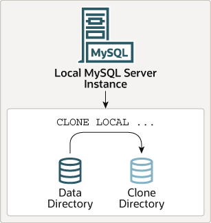
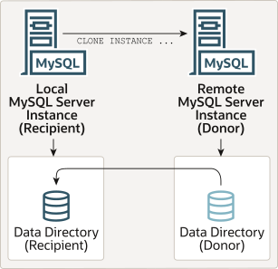

### 7.6.7 The Clone Plugin

[7.6.7.1 Installing the Clone Plugin](clone-plugin-installation.md)

[7.6.7.2 Cloning Data Locally](clone-plugin-local.md)

[7.6.7.3 Cloning Remote Data](clone-plugin-remote.md)

[7.6.7.4 Cloning and Concurrent DDL](clone-plugin-concurrent-ddl.md)

[7.6.7.5 Cloning Encrypted Data](clone-plugin-encrypted-data.md)

[7.6.7.6 Cloning Compressed Data](clone-plugin-compressed-data.md)

[7.6.7.7 Cloning for Replication](clone-plugin-replication.md)

[7.6.7.8 Directories and Files Created During a Cloning Operation](clone-plugin-directories.md)

[7.6.7.9 Remote Cloning Operation Failure Handling](clone-plugin-failure-handling.md)

[7.6.7.10 Monitoring Cloning Operations](clone-plugin-monitoring.md)

[7.6.7.11 Stopping a Cloning Operation](clone-plugin-stop.md)

[7.6.7.12 Clone System Variable Reference](clone-plugin-option-variable-reference.md)

[7.6.7.13 Clone System Variables](clone-plugin-options-variables.md)

[7.6.7.14 Clone Plugin Limitations](clone-plugin-limitations.md)

The clone plugin, introduced in MySQL 8.0.17, permits cloning data
locally or from a remote MySQL server instance. Cloned data is a
physical snapshot of data stored in `InnoDB` that
includes schemas, tables, tablespaces, and data dictionary
metadata. The cloned data comprises a fully functional data
directory, which permits using the clone plugin for MySQL server
provisioning.

**Figure 7.1 Local Cloning Operation**

A local cloning operation clones data from the MySQL server
instance where the cloning operation is initiated to a directory
on the same server or node where MySQL server instance runs.

**Figure 7.2 Remote Cloning Operation**

A remote cloning operation involves a local MySQL server instance
(the “recipient”) where the cloning operation is
initiated, and a remote MySQL server instance (the
“donor”) where the source data is located. When a
remote cloning operation is initiated on the recipient, cloned
data is transferred over the network from the donor to the
recipient. By default, a remote cloning operation removes existing
user-created data (schemas, tables, tablespaces) and binary logs
from the recipient data directory before cloning data from the
donor. Optionally, you can clone data to a different directory on
the recipient to avoid removing data from the current recipient
data directory.

There is no difference with respect to data that is cloned by a
local cloning operation as compared to a remote cloning operation.
Both operations clone the same set of data.

The clone plugin supports replication. In addition to cloning
data, a cloning operation extracts and transfers replication
coordinates from the donor and applies them on the recipient,
which enables using the clone plugin for provisioning Group
Replication members and replicas. Using the clone plugin for
provisioning is considerably faster and more efficient than
replicating a large number of transactions (see
[Section 7.6.7.7, “Cloning for Replication”](clone-plugin-replication.md "7.6.7.7 Cloning for Replication")). Group Replication
members can also be configured to use the clone plugin as an
alternative method of recovery, so that members automatically
choose the most efficient way to retrieve group data from seed
members. For more information, see
[Section 20.5.4.2, “Cloning for Distributed Recovery”](group-replication-cloning.md "20.5.4.2 Cloning for Distributed Recovery").

The clone plugin supports cloning of encrypted and page-compressed
data. See [Section 7.6.7.5, “Cloning Encrypted Data”](clone-plugin-encrypted-data.md "7.6.7.5 Cloning Encrypted Data"), and
[Section 7.6.7.6, “Cloning Compressed Data”](clone-plugin-compressed-data.md "7.6.7.6 Cloning Compressed Data").

The clone plugin must be installed before you can use it. For
installation instructions, see
[Section 7.6.7.1, “Installing the Clone Plugin”](clone-plugin-installation.md "7.6.7.1 Installing the Clone Plugin"). For cloning
instructions, see [Section 7.6.7.2, “Cloning Data Locally”](clone-plugin-local.md "7.6.7.2 Cloning Data Locally"), and
[Section 7.6.7.3, “Cloning Remote Data”](clone-plugin-remote.md "7.6.7.3 Cloning Remote Data").

Performance Schema tables and instrumentation are provided for
monitoring cloning operations. See
[Section 7.6.7.10, “Monitoring Cloning Operations”](clone-plugin-monitoring.md "7.6.7.10 Monitoring Cloning Operations").
