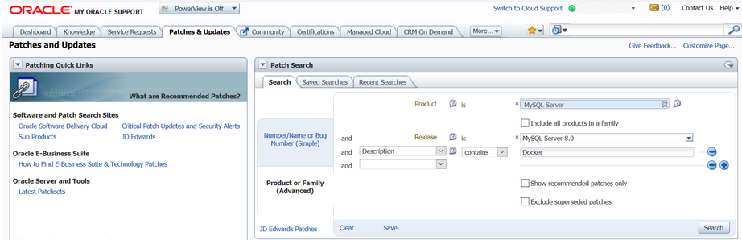

#### 2.5.6.1 Basic Steps for MySQL Server Deployment with Docker

Warning

The MySQL Docker images maintained by the MySQL team are built
specifically for Linux platforms. Other platforms are not
supported, and users using these MySQL Docker images on them
are doing so at their own risk. See
[the discussion
here](deploy-mysql-nonlinux-docker.md "2.5.6.3 Deploying MySQL on Windows and Other Non-Linux Platforms with Docker") for some known limitations for running these
containers on non-Linux operating systems.

- [Downloading a MySQL Server Docker Image](docker-mysql-getting-started.md#docker-download-image "Downloading a MySQL Server Docker Image")
- [Starting a MySQL Server Instance](docker-mysql-getting-started.md#docker-starting-mysql-server "Starting a MySQL Server Instance")
- [Connecting to MySQL Server from within the Container](docker-mysql-getting-started.md#docker-connecting-within-container "Connecting to MySQL Server from within the Container")
- [Container Shell Access](docker-mysql-getting-started.md#docker-shell-access "Container Shell Access")
- [Stopping and Deleting a MySQL Container](docker-mysql-getting-started.md#docker-stopping-deleting "Stopping and Deleting a MySQL Container")
- [Upgrading a MySQL Server Container](docker-mysql-getting-started.md#docker-upgrading "Upgrading a MySQL Server Container")
- [More Topics on Deploying MySQL Server with Docker](docker-mysql-getting-started.md#docker-more-topics "More Topics on Deploying MySQL Server with Docker")

##### Downloading a MySQL Server Docker Image

Important

*For users of MySQL Enterprise Edition*: A subscription is
required to use the Docker images for MySQL Enterprise Edition. Subscriptions
work by a Bring Your Own License model; see
[How to Buy MySQL
Products and Services](https://www.mysql.com/buy-mysql/) for details.

Downloading the server image in a separate step is not strictly
necessary; however, performing this step before you create your
Docker container ensures your local image is up to date. To
download the MySQL Community Edition image from the
[Oracle
Container Registry (OCR)](https://container-registry.oracle.com/), run this command:

```terminal
docker pull container-registry.oracle.com/mysql/community-server:tag
```

The *`tag`* is the label for the image
version you want to pull (for example, `5.7`,
`8.0`, or `latest`). If
**`:tag`** is
omitted, the `latest` label is used, and the
image for the latest GA version of MySQL Community Server is
downloaded.

To download the MySQL Enterprise Edition image from the OCR, you need to first
accept the license agreement on the OCR and log in to the
container repository with your Docker client. Follow these
steps:

- Visit the OCR at
  <https://container-registry.oracle.com/> and
  choose MySQL.
- Under the list of MySQL repositories, choose
  `enterprise-server`.
- If you have not signed in to the OCR yet, click the
  Sign in button on the right of the
  page, and then enter your Oracle account credentials when
  prompted to.
- Follow the instructions on the right of the page to accept
  the license agreement.
- Log in to the OCR with your container client using, for
  example, the `docker login` command:

  ```terminal
  # docker login container-registry.oracle.com
  Username: Oracle-Account-ID
  Password: password
  Login successful.
  ```

Download the Docker image for MySQL Enterprise Edition from the OCR with this
command:

```terminal
docker pull  container-registry.oracle.com/mysql/enterprise-server:tag
```

To download the MySQL Enterprise Edition image from
[My Oracle
Support](https://support.oracle.com/) website, go onto the website, sign in to your
Oracle account, and perform these steps once you are on the
landing page:

- Select the Patches and Updates tab.
- Go to the Patch Search region and, on
  the Search tab, switch to the
  Product or Family (Advanced) subtab.
- Enter “MySQL Server” for the
  Product field, and the desired
  version number in the Release
  field.
- Use the dropdowns for additional filters to select
  Description—contains,
  and enter “Docker” in the text field.

  The following figure shows the search settings for the
  MySQL Enterprise Edition image for MySQL Server 8.0:

  
- Click the Search button and, from
  the result list, select the version you want, and click
  the Download button.
- In the File Download dialogue box
  that appears, click and download the
  `.zip` file for the Docker image.

Unzip the downloaded `.zip` archive to obtain
the tarball inside
(`mysql-enterprise-server-version.tar`),
and then load the image by running this command:

```simple
docker load -i mysql-enterprise-server-version.tar
```

You can list downloaded Docker images with this command:

```terminal
$> docker images
REPOSITORY                                             TAG       IMAGE ID       CREATED        SIZE
container-registry.oracle.com/mysql/community-server   latest    1d9c2219ff69   2 months ago   496MB
```

##### Starting a MySQL Server Instance

To start a new Docker container for a MySQL Server, use the
following command:

```terminal
docker run --name=container_name  --restart on-failure -d image_name:tag
```

*`image_name`* is the name of the image
to be used to start the container; see
[Downloading a MySQL Server Docker Image](docker-mysql-getting-started.md#docker-download-image "Downloading a MySQL Server Docker Image") for more information.

The `--name` option, for supplying a custom name
for your server container, is optional; if no container name is
supplied, a random one is generated.

The `--restart` option is for configuring the
[restart
policy](https://docs.docker.com/config/containers/start-containers-automatically/) for your container; it should be set to the value
`on-failure`, to enable support for server
restart within a client session (which happens, for example,
when the [RESTART](restart.md "15.7.8.8 RESTART Statement") statement is
executed by a client or during the
[configuration
of an InnoDB cluster instance](https://dev.mysql.com/doc/mysql-shell/8.0/en/configuring-production-instances.html#configuring-local-instances)). With the support for
restart enabled, issuing a restart within a client session
causes the server and the container to stop and then restart.
*Support for server restart is available for MySQL
8.0.21 and later.*

For example, to start a new Docker container for the MySQL
Community Server, use this command:

```terminal
docker run --name=mysql1 --restart on-failure -d container-registry.oracle.com/mysql/community-server:latest
```

To start a new Docker container for the MySQL Enterprise Server
with a Docker image downloaded from the OCR, use this command:

```terminal
docker run --name=mysql1 --restart on-failure -d container-registry.oracle.com/mysql/enterprise-server:latest
```

To start a new Docker container for the MySQL Enterprise Server
with a Docker image downloaded from My Oracle Support, use this
command:

```terminal
docker run --name=mysql1 --restart on-failure -d mysql/enterprise-server:latest
```

If the Docker image of the specified name and tag has not been
downloaded by an earlier **docker pull** or
**docker run** command, the image is now
downloaded. Initialization for the container begins, and the
container appears in the list of running containers when you run
the **docker ps** command. For example:

```terminal
$> docker ps
CONTAINER ID   IMAGE                                                         COMMAND                  CREATED          STATUS                    PORTS                       NAMES
4cd4129b3211   container-registry.oracle.com/mysql/community-server:latest   "/entrypoint.sh mysq…"   8 seconds ago    Up 7 seconds (health: starting)   3306/tcp, 33060-33061/tcp   mysql1
```

The container initialization might take some time. When the
server is ready for use, the `STATUS` of the
container in the output of the **docker ps**
command changes from `(health: starting)` to
`(healthy)`.

The `-d` option used in the **docker
run** command above makes the container run in the
background. Use this command to monitor the output from the
container:

```terminal
docker logs mysql1
```

Once initialization is finished, the command's output is going
to contain the random password generated for the root user;
check the password with, for example, this command:

```terminal
$> docker logs mysql1 2>&1 | grep GENERATED
GENERATED ROOT PASSWORD: Axegh3kAJyDLaRuBemecis&EShOs
```

##### Connecting to MySQL Server from within the Container

Once the server is ready, you can run the
[**mysql**](mysql.md "6.5.1 mysql — The MySQL Command-Line Client") client within the MySQL Server
container you just started, and connect it to the MySQL Server.
Use the **docker exec -it** command to start a
[**mysql**](mysql.md "6.5.1 mysql — The MySQL Command-Line Client") client inside the Docker container you
have started, like the following:

```terminal
docker exec -it mysql1 mysql -uroot -p
```

When asked, enter the generated root password (see the last step
in [Starting a MySQL Server Instance](docker-mysql-getting-started.md#docker-starting-mysql-server "Starting a MySQL Server Instance") above on how
to find the password). Because the
[`MYSQL_ONETIME_PASSWORD`](docker-mysql-more-topics.md#docker_var_mysql_onetime_password)
option is true by default, after you have connected a
[**mysql**](mysql.md "6.5.1 mysql — The MySQL Command-Line Client") client to the server, you must reset
the server root password by issuing this statement:

```terminal
mysql> ALTER USER 'root'@'localhost' IDENTIFIED BY 'password';
```

Substitute *`password`* with the password
of your choice. Once the password is reset, the server is ready
for use.

##### Container Shell Access

To have shell access to your MySQL Server container, use the
**docker exec -it** command to start a bash shell
inside the container:

```terminal
$> docker exec -it mysql1 bash
bash-4.2#
```

You can then run Linux commands inside the container. For
example, to view contents in the server's data directory inside
the container, use this command:

```terminal
bash-4.2# ls /var/lib/mysql
auto.cnf    ca.pem	     client-key.pem  ib_logfile0  ibdata1  mysql       mysql.sock.lock	   private_key.pem  server-cert.pem  sys
ca-key.pem  client-cert.pem  ib_buffer_pool  ib_logfile1  ibtmp1   mysql.sock  performance_schema  public_key.pem   server-key.pem
```

##### Stopping and Deleting a MySQL Container

To stop the MySQL Server container we have created, use this
command:

```terminal
docker stop mysql1
```

**docker stop** sends a SIGTERM signal to the
[**mysqld**](mysqld.md "6.3.1 mysqld — The MySQL Server") process, so that the server is shut
down gracefully.

Also notice that when the main process of a container
([**mysqld**](mysqld.md "6.3.1 mysqld — The MySQL Server") in the case of a MySQL Server
container) is stopped, the Docker container stops automatically.

To start the MySQL Server container again:

```terminal
docker start mysql1
```

To stop and start again the MySQL Server container with a single
command:

```terminal
docker restart mysql1
```

To delete the MySQL container, stop it first, and then use the
**docker rm** command:

```terminal
docker stop mysql1
```

```terminal
docker rm mysql1
```

If you want the
[Docker
volume for the server's data directory](docker-mysql-more-topics.md#docker-persisting-data-configuration "Persisting Data and Configuration Changes") to be deleted at
the same time, add the `-v` option to the
**docker rm** command.

##### Upgrading a MySQL Server Container

Important

- Before performing any upgrade to MySQL, follow carefully
  the instructions in [Chapter 3, *Upgrading MySQL*](upgrading.md "Chapter 3 Upgrading MySQL"). Among
  other instructions discussed there, it is especially
  important to back up your database before the upgrade.
- The instructions in this section require that the server's
  data and configuration have been persisted on the host.
  See [Persisting Data and Configuration Changes](docker-mysql-more-topics.md#docker-persisting-data-configuration "Persisting Data and Configuration Changes")
  for details.

Follow these steps to upgrade a Docker installation of MySQL 5.7
to 8.0:

- Stop the MySQL 5.7 server (container name is
  `mysql57` in this example):

  ```terminal
  docker stop mysql57
  ```
- Download the MySQL 8.0 Server Docker image. See instructions
  in [Downloading a MySQL Server Docker Image](docker-mysql-getting-started.md#docker-download-image "Downloading a MySQL Server Docker Image"). Make sure you
  use the right tag for MySQL 8.0.
- Start a new MySQL 8.0 Docker container (named
  `mysql80` in this example) with the old
  server data and configuration (with proper modifications if
  needed—see [Chapter 3, *Upgrading MySQL*](upgrading.md "Chapter 3 Upgrading MySQL")) that have been
  persisted on the host (by
  [bind-mounting](https://docs.docker.com/engine/reference/commandline/service_create/#add-bind-mounts-or-volumes)
  in this example). For the MySQL Community Server, run this
  command:

  ```terminal
  docker run --name=mysql80 \
     --mount type=bind,src=/path-on-host-machine/my.cnf,dst=/etc/my.cnf \
     --mount type=bind,src=/path-on-host-machine/datadir,dst=/var/lib/mysql \
     -d container-registry.oracle.com/mysql/community-server:8.0
  ```

  If needed, adjust
  `container-registry.oracle.com/mysql/community-server`
  to the correct image name—for example, replace it with
  `container-registry.oracle.com/mysql/enterprise-server`
  for MySQL Enterprise Edition images downloaded from the OCR, or
  `mysql/enterprise-server` for MySQL Enterprise Edition images
  downloaded from My Oracle Support.
- Wait for the server to finish startup. You can check the
  status of the server using the **docker ps**
  command (see [Starting a MySQL Server Instance](docker-mysql-getting-started.md#docker-starting-mysql-server "Starting a MySQL Server Instance")
  for how to do that).

Follow the same steps for upgrading within the 8.0 series (that
is, from release 8.0.*`x`* to
8.0.*`y`*): stop the original container,
and start a new one with a newer image on the old server data
and configuration. If you used the `8.0` or the
`latest` tag when starting your original
container and there is now a new MySQL 8.0 release you want to
upgrade to it, you must first pull the image for the new release
with the command:

```simple
docker pull container-registry.oracle.com/mysql/community-server:8.0
```

You can then upgrade by starting a *new*
container with the same tag on the old data and configuration
(adjust the image name if you are using the MySQL Enterprise Edition; see
[Downloading a MySQL Server Docker Image](docker-mysql-getting-started.md#docker-download-image "Downloading a MySQL Server Docker Image")):

```terminal
docker run --name=mysql80new \
   --mount type=bind,src=/path-on-host-machine/my.cnf,dst=/etc/my.cnf \
   --mount type=bind,src=/path-on-host-machine/datadir,dst=/var/lib/mysql \
-d container-registry.oracle.com/mysql/community-server:8.0
```

Note

*For MySQL 8.0.15 and earlier:* You need to
complete the upgrade process by running the
[mysql\_upgrade](mysql-upgrade.md "6.4.5 mysql_upgrade — Check and Upgrade MySQL Tables") utility in
the MySQL 8.0 Server container (the step is
*not* required for MySQL 8.0.16 and later):

- ```terminal
  docker exec -it mysql80 mysql_upgrade -uroot -p
  ```

  When prompted, enter the root password for your old
  server.
- Finish the upgrade by restarting the new container:

  ```terminal
  docker restart mysql80
  ```

##### More Topics on Deploying MySQL Server with Docker

For more topics on deploying MySQL Server with Docker like
server configuration, persisting data and configuration, server
error log, and container environment variables, see
[Section 2.5.6.2, “More Topics on Deploying MySQL Server with Docker”](docker-mysql-more-topics.md "2.5.6.2 More Topics on Deploying MySQL Server with Docker").
