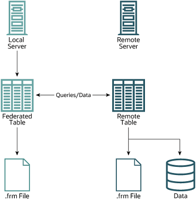

### 18.8.1 FEDERATED Storage Engine Overview

When you create a table using one of the standard storage engines
(such as `MyISAM`, `CSV` or
`InnoDB`), the table consists of the table
definition and the associated data. When you create a
`FEDERATED` table, the table definition is the
same, but the physical storage of the data is handled on a remote
server.

A `FEDERATED` table consists of two elements:

- A *remote server* with a database table,
  which in turn consists of the table definition (stored in the
  MySQL data dictionary) and the associated table. The table
  type of the remote table may be any type supported by the
  remote `mysqld` server, including
  `MyISAM` or `InnoDB`.
- A *local server* with a database table,
  where the table definition matches that of the corresponding
  table on the remote server. The table definition is stored in
  the data dictionary. There is no data file on the local
  server. Instead, the table definition includes a connection
  string that points to the remote table.

When executing queries and statements on a
`FEDERATED` table on the local server, the
operations that would normally insert, update or delete
information from a local data file are instead sent to the remote
server for execution, where they update the data file on the
remote server or return matching rows from the remote server.

The basic structure of a `FEDERATED` table setup
is shown in [Figure 18.2, “FEDERATED Table Structure”](federated-description.md#figure-se-federated-structure "Figure 18.2 FEDERATED Table Structure").

**Figure 18.2 FEDERATED Table Structure**

When a client issues an SQL statement that refers to a
`FEDERATED` table, the flow of information
between the local server (where the SQL statement is executed) and
the remote server (where the data is physically stored) is as
follows:

1. The storage engine looks through each column that the
   `FEDERATED` table has and constructs an
   appropriate SQL statement that refers to the remote table.
2. The statement is sent to the remote server using the MySQL
   client API.
3. The remote server processes the statement and the local server
   retrieves any result that the statement produces (an
   affected-rows count or a result set).
4. If the statement produces a result set, each column is
   converted to internal storage engine format that the
   `FEDERATED` engine expects and can use to
   display the result to the client that issued the original
   statement.

The local server communicates with the remote server using MySQL
client C API functions. It invokes
[`mysql_real_query()`](https://dev.mysql.com/doc/c-api/8.0/en/mysql-real-query.html) to send the
statement. To read a result set, it uses
[`mysql_store_result()`](https://dev.mysql.com/doc/c-api/8.0/en/mysql-store-result.html) and fetches
rows one at a time using
[`mysql_fetch_row()`](https://dev.mysql.com/doc/c-api/8.0/en/mysql-fetch-row.html).
