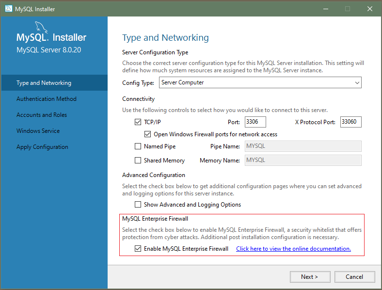

#### 8.4.7.2 Installing or Uninstalling MySQL Enterprise Firewall

MySQL Enterprise Firewall installation is a one-time operation that installs the
elements described in [Section 8.4.7.1, “Elements of MySQL Enterprise Firewall”](firewall-elements.md "8.4.7.1 Elements of MySQL Enterprise Firewall").
Installation can be performed using a graphical interface or
manually:

- On Windows, MySQL Installer includes an option to enable MySQL Enterprise Firewall for
  you.
- MySQL Workbench 6.3.4 or higher can install MySQL Enterprise Firewall, enable or
  disable an installed firewall, or uninstall the firewall.
- Manual MySQL Enterprise Firewall installation involves running a script located
  in the `share` directory of your MySQL
  installation.

Important

Read this entire section before following its instructions.
Parts of the procedure differ depending on your environment.

Note

If installed, MySQL Enterprise Firewall involves some minimal overhead even when
disabled. To avoid this overhead, do not install the firewall
unless you plan to use it.

For usage instructions, see [Section 8.4.7.3, “Using MySQL Enterprise Firewall”](firewall-usage.md "8.4.7.3 Using MySQL Enterprise Firewall").
For reference information, see
[Section 8.4.7.4, “MySQL Enterprise Firewall Reference”](firewall-reference.md "8.4.7.4 MySQL Enterprise Firewall Reference").

- [Installing MySQL Enterprise Firewall](firewall-installation.md#firewall-install "Installing MySQL Enterprise Firewall")
- [Uninstalling MySQL Enterprise Firewall](firewall-installation.md#firewall-uninstall "Uninstalling MySQL Enterprise Firewall")

##### Installing MySQL Enterprise Firewall

If MySQL Enterprise Firewall is already installed from an older version of MySQL,
uninstall it using the instructions given later in this
section and then restart your server before installing the
current version. In this case, it is also necessary to
register your configuration again.

On Windows, you can use MySQL Installer to install MySQL Enterprise Firewall, as shown in
[Figure 8.2, “MySQL Enterprise Firewall Installation on Windows”](firewall-installation.md#firewall-installation-windows-installer "Figure 8.2 MySQL Enterprise Firewall Installation on Windows").
Check the Enable MySQL Enterprise
Firewall check box. (Open Firewall port
for network access has a different purpose. It
refers to Windows Firewall and controls whether Windows blocks
the TCP/IP port on which the MySQL server listens for client
connections.)

Important

There is an issue for MySQL 8.0.19 installed using MySQL Installer that
prevents the server from starting if MySQL Enterprise Firewall is selected
during the server configuration steps. If the server startup
operation fails, click Cancel to end
the configuration process and return to the dashboard. You
must uninstall the server.

The workaround is to run MySQL Installer without MySQL Enterprise Firewall selected. (That
is, do not select the Enable MySQL Enterprise
Firewall check box.) Then install MySQL Enterprise Firewall
afterward using the instructions for manual installation
later in this section. This problem is corrected in MySQL
8.0.20.

**Figure 8.2 MySQL Enterprise Firewall Installation on Windows**



To install MySQL Enterprise Firewall using MySQL Workbench 6.3.4 or higher, see
[MySQL Enterprise Firewall Interface](https://dev.mysql.com/doc/workbench/en/wb-mysql-firewall.html).

To install MySQL Enterprise Firewall manually, look in the
`share` directory of your MySQL
installation and choose the script that is appropriate for
your platform. The available scripts differ in the file name
used to refer to the script:

- `win_install_firewall.sql`
- `linux_install_firewall.sql`

The installation script creates stored procedures in the
default database, `mysql`. Run the script as
follows on the command line. The example here uses the Linux
installation script. Make the appropriate substitutions for
your system.

```terminal
$> mysql -u root -p < linux_install_firewall.sql
Enter password: (enter root password here)
```

Note

To use MySQL Enterprise Firewall in the context of source/replica replication,
Group Replication, or InnoDB Cluster, you must prepare the
replica nodes prior to running the installation script on
the source node. This is necessary because the
[`INSTALL PLUGIN`](install-plugin.md "15.7.4.4 INSTALL PLUGIN Statement") statements in
the script are not replicated.

1. On each replica node, extract the
   [`INSTALL PLUGIN`](install-plugin.md "15.7.4.4 INSTALL PLUGIN Statement") statements
   from the installation script and execute them manually.
2. On the source node, run the installation script as
   described previously.

Installing MySQL Enterprise Firewall either using a graphical interface or
manually should enable the firewall. To verify that, connect
to the server and execute this statement:

```sql
mysql> SHOW GLOBAL VARIABLES LIKE 'mysql_firewall_mode';
+---------------------+-------+
| Variable_name       | Value |
+---------------------+-------+
| mysql_firewall_mode | ON    |
+---------------------+-------+
```

If the plugin fails to initialize, check the server error log
for diagnostic messages.

##### Uninstalling MySQL Enterprise Firewall

MySQL Enterprise Firewall can be uninstalled using MySQL Workbench or manually.

To uninstall MySQL Enterprise Firewall using MySQL Workbench 6.3.4 or higher, see
[MySQL Enterprise Firewall Interface](https://dev.mysql.com/doc/workbench/en/wb-mysql-firewall.html), in
[Chapter 33, *MySQL Workbench*](workbench.md "Chapter 33 MySQL Workbench").

To uninstall MySQL Enterprise Firewall manually, execute the following
statements. Statements use `IF EXISTS`
because, depending on the previously installed firewall
version, some objects might not exist or might be dropped
implicitly by uninstalling the plugin that installed them.

```sql
DROP TABLE IF EXISTS mysql.firewall_group_allowlist;
DROP TABLE IF EXISTS mysql.firewall_groups;
DROP TABLE IF EXISTS mysql.firewall_membership;
DROP TABLE IF EXISTS mysql.firewall_users;
DROP TABLE IF EXISTS mysql.firewall_whitelist;

UNINSTALL PLUGIN MYSQL_FIREWALL;
UNINSTALL PLUGIN MYSQL_FIREWALL_USERS;
UNINSTALL PLUGIN MYSQL_FIREWALL_WHITELIST;

DROP FUNCTION IF EXISTS firewall_group_delist;
DROP FUNCTION IF EXISTS firewall_group_enlist;
DROP FUNCTION IF EXISTS mysql_firewall_flush_status;
DROP FUNCTION IF EXISTS normalize_statement;
DROP FUNCTION IF EXISTS read_firewall_group_allowlist;
DROP FUNCTION IF EXISTS read_firewall_groups;
DROP FUNCTION IF EXISTS read_firewall_users;
DROP FUNCTION IF EXISTS read_firewall_whitelist;
DROP FUNCTION IF EXISTS set_firewall_group_mode;
DROP FUNCTION IF EXISTS set_firewall_mode;

DROP PROCEDURE IF EXISTS mysql.sp_firewall_group_delist;
DROP PROCEDURE IF EXISTS mysql.sp_firewall_group_enlist;
DROP PROCEDURE IF EXISTS mysql.sp_reload_firewall_group_rules;
DROP PROCEDURE IF EXISTS mysql.sp_reload_firewall_rules;
DROP PROCEDURE IF EXISTS mysql.sp_set_firewall_group_mode;
DROP PROCEDURE IF EXISTS mysql.sp_set_firewall_group_mode_and_user;
DROP PROCEDURE IF EXISTS mysql.sp_set_firewall_mode;
DROP PROCEDURE IF EXISTS mysql.sp_migrate_firewall_user_to_group;
```
