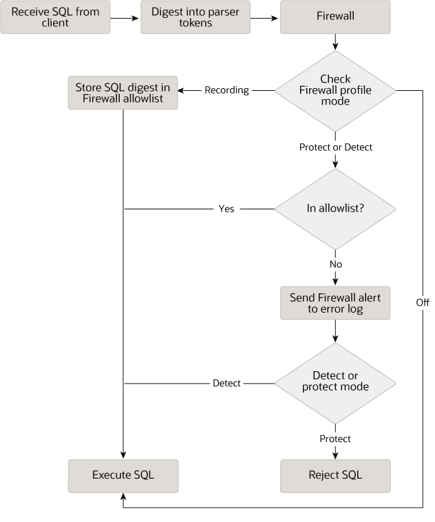

### 8.4.7 MySQL Enterprise Firewall

[8.4.7.1 Elements of MySQL Enterprise Firewall](firewall-elements.md)

[8.4.7.2 Installing or Uninstalling MySQL Enterprise Firewall](firewall-installation.md)

[8.4.7.3 Using MySQL Enterprise Firewall](firewall-usage.md)

[8.4.7.4 MySQL Enterprise Firewall Reference](firewall-reference.md)

Note

MySQL Enterprise Firewall is an extension included in MySQL Enterprise Edition, a commercial product.
To learn more about commercial products, see
<https://www.mysql.com/products/>.

MySQL Enterprise Edition includes MySQL Enterprise Firewall, an application-level firewall that enables
database administrators to permit or deny SQL statement execution
based on matching against lists of accepted statement patterns.
This helps harden MySQL Server against attacks such as SQL
injection or attempts to exploit applications by using them
outside of their legitimate query workload characteristics.

Each MySQL account registered with the firewall has its own
statement allowlist, enabling protection to be tailored per
account. For a given account, the firewall can operate in
recording, protecting, or detecting mode, for training in the
accepted statement patterns, active protection against
unacceptable statements, or passive detection of unacceptable
statements. The diagram illustrates how the firewall processes
incoming statements in each mode.

**Figure 8.1 MySQL Enterprise Firewall Operation**

The following sections describe the elements of MySQL Enterprise Firewall, discuss
how to install and use it, and provide reference information for
its elements.
