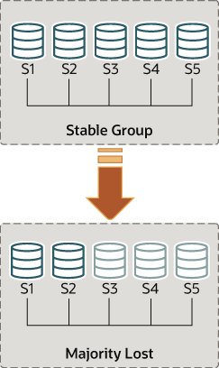
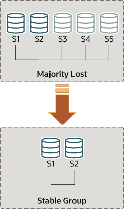

### 20.7.8 Handling a Network Partition and Loss of Quorum

The group needs to achieve consensus whenever a change that needs
to be replicated happens. This is the case for regular
transactions but is also required for group membership changes and
some internal messaging that keeps the group consistent. Consensus
requires a majority of group members to agree on a given decision.
When a majority of group members is lost, the group is unable to
progress and blocks because it cannot secure majority or quorum.

Quorum may be lost when there are multiple involuntary failures,
causing a majority of servers to be removed abruptly from the
group. For example, in a group of 5 servers, if 3 of them become
silent at once, the majority is compromised and thus no quorum can
be achieved. In fact, the remaining two are not able to tell if
the other 3 servers have crashed or whether a network partition
has isolated these 2 alone and therefore the group cannot be
reconfigured automatically.

On the other hand, if servers exit the group voluntarily, they
instruct the group that it should reconfigure itself. In practice,
this means that a server that is leaving tells others that it is
going away. This means that other members can reconfigure the
group properly, the consistency of the membership is maintained
and the majority is recalculated. For example, in the above
scenario of 5 servers where 3 leave at once, if the 3 leaving
servers warn the group that they are leaving, one by one, then the
membership is able to adjust itself from 5 to 2, and at the same
time, securing quorum while that happens.

Note

Loss of quorum is by itself a side-effect of bad planning. Plan
the group size for the number of expected failures (regardless
whether they are consecutive, happen all at once or are
sporadic).

For a group in single-primary mode, the primary might have
transactions that are not yet present on other members at the time
of the network partition. If you are considering excluding the
primary from the new group, be aware that such transactions might
be lost. A member with extra transactions cannot rejoin the group,
and the attempt results in an error with the message
This member has more executed transactions than those
present in the group. Set the
[`group_replication_unreachable_majority_timeout`](group-replication-system-variables.md#sysvar_group_replication_unreachable_majority_timeout)
system variable for the group members to avoid this situation.

The following sections explain what to do if the system partitions
in such a way that no quorum is automatically achieved by the
servers in the group.

#### Detecting Partitions

The [`replication_group_members`](performance-schema-replication-group-members-table.md "29.12.11.16 The replication_group_members Table")
performance schema table presents the status of each server in
the current view from the perspective of this server. The
majority of the time the system does not run into partitioning,
and therefore the table shows information that is consistent
across all servers in the group. In other words, the status of
each server on this table is agreed by all in the current view.
However, if there is network partitioning, and quorum is lost,
then the table shows the status `UNREACHABLE`
for those servers that it cannot contact. This information is
exported by the local failure detector built into Group
Replication.

**Figure 20.14 Losing Quorum**



To understand this type of network partition the following
section describes a scenario where there are initially 5 servers
working together correctly, and the changes that then happen to
the group once only 2 servers are online. The scenario is
depicted in the
figure.

As such, lets assume that there is a group with these 5 servers
in it:

- Server s1 with member identifier
  `199b2df7-4aaf-11e6-bb16-28b2bd168d07`
- Server s2 with member identifier
  `199bb88e-4aaf-11e6-babe-28b2bd168d07`
- Server s3 with member identifier
  `1999b9fb-4aaf-11e6-bb54-28b2bd168d07`
- Server s4 with member identifier
  `19ab72fc-4aaf-11e6-bb51-28b2bd168d07`
- Server s5 with member identifier
  `19b33846-4aaf-11e6-ba81-28b2bd168d07`

Initially the group is running fine and the servers are happily
communicating with each other. You can verify this by logging
into s1 and looking at its
[`replication_group_members`](performance-schema-replication-group-members-table.md "29.12.11.16 The replication_group_members Table")
performance schema table. For example:

```sql
mysql> SELECT MEMBER_ID,MEMBER_STATE, MEMBER_ROLE FROM performance_schema.replication_group_members;
+--------------------------------------+--------------+-------------+
| MEMBER_ID                            | MEMBER_STATE | MEMBER_ROLE |
+--------------------------------------+--------------+-------------+
| 1999b9fb-4aaf-11e6-bb54-28b2bd168d07 | ONLINE       | SECONDARY   |
| 199b2df7-4aaf-11e6-bb16-28b2bd168d07 | ONLINE       | PRIMARY     |
| 199bb88e-4aaf-11e6-babe-28b2bd168d07 | ONLINE       | SECONDARY   |
| 19ab72fc-4aaf-11e6-bb51-28b2bd168d07 | ONLINE       | SECONDARY   |
| 19b33846-4aaf-11e6-ba81-28b2bd168d07 | ONLINE       | SECONDARY   |
+--------------------------------------+--------------+-------------+
```

However, moments later there is a catastrophic failure and
servers s3, s4 and s5 stop unexpectedly. A few seconds after
this, looking again at the
[`replication_group_members`](performance-schema-replication-group-members-table.md "29.12.11.16 The replication_group_members Table") table on
s1 shows that it is still online, but several others members are
not. In fact, as seen below they are marked as
`UNREACHABLE`. Moreover, the system could not
reconfigure itself to change the membership, because the
majority has been lost.

```sql
mysql> SELECT MEMBER_ID,MEMBER_STATE FROM performance_schema.replication_group_members;
+--------------------------------------+--------------+
| MEMBER_ID                            | MEMBER_STATE |
+--------------------------------------+--------------+
| 1999b9fb-4aaf-11e6-bb54-28b2bd168d07 | UNREACHABLE  |
| 199b2df7-4aaf-11e6-bb16-28b2bd168d07 | ONLINE       |
| 199bb88e-4aaf-11e6-babe-28b2bd168d07 | ONLINE       |
| 19ab72fc-4aaf-11e6-bb51-28b2bd168d07 | UNREACHABLE  |
| 19b33846-4aaf-11e6-ba81-28b2bd168d07 | UNREACHABLE  |
+--------------------------------------+--------------+
```

The table shows that s1 is now in a group that has no means of
progressing without external intervention, because a majority of
the servers are unreachable. In this particular case, the group
membership list needs to be reset to allow the system to
proceed, which is explained in this section. Alternatively, you
could also choose to stop Group Replication on s1 and s2 (or
stop completely s1 and s2), figure out what happened with s3, s4
and s5 and then restart Group Replication (or the servers).

#### Unblocking a Partition

Group replication enables you to reset the group membership list
by forcing a specific configuration. For instance in the case
above, where s1 and s2 are the only servers online, you could
choose to force a membership configuration consisting of only s1
and s2. This requires checking some information about s1 and s2
and then using the
[`group_replication_force_members`](group-replication-system-variables.md#sysvar_group_replication_force_members)
variable.

**Figure 20.15 Forcing a New Membership**



Suppose that you are back in the situation where s1 and s2 are
the only servers left in the group. Servers s3, s4 and s5 have
left the group unexpectedly. To make servers s1 and s2 continue,
you want to force a membership configuration that contains only
s1 and s2.

Warning

This procedure uses
[`group_replication_force_members`](group-replication-system-variables.md#sysvar_group_replication_force_members)
and should be considered a last resort remedy. It
*must* be used with extreme care and only
for overriding loss of quorum. If misused, it could create an
artificial split-brain scenario or block the entire system
altogether.

When forcing a new membership configuration, make sure that any
servers are going to be forced out of the group are indeed
stopped. In the scenario depicted above, if s3, s4 and s5 are
not really unreachable but instead are online, they may have
formed their own functional partition (they are 3 out of 5,
hence they have the majority). In that case, forcing a group
membership list with s1 and s2 could create an artificial
split-brain situation. Therefore it is important before forcing
a new membership configuration to ensure that the servers to be
excluded are indeed shut down and if they are not, shut them
down before proceeding.

Warning

For a group in single-primary mode, the primary might have
transactions that are not yet present on other members at the
time of the network partition. If you are considering
excluding the primary from the new group, be aware that such
transactions might be lost. A member with extra transactions
cannot rejoin the group, and the attempt results in an error
with the message This member has more executed
transactions than those present in the group. Set
the
[`group_replication_unreachable_majority_timeout`](group-replication-system-variables.md#sysvar_group_replication_unreachable_majority_timeout)
system variable for the group members to avoid this situation.

Recall that the system is blocked and the current configuration
is the following (as perceived by the local failure detector on
s1):

```sql
mysql> SELECT MEMBER_ID,MEMBER_STATE FROM performance_schema.replication_group_members;
+--------------------------------------+--------------+
| MEMBER_ID                            | MEMBER_STATE |
+--------------------------------------+--------------+
| 1999b9fb-4aaf-11e6-bb54-28b2bd168d07 | UNREACHABLE  |
| 199b2df7-4aaf-11e6-bb16-28b2bd168d07 | ONLINE       |
| 199bb88e-4aaf-11e6-babe-28b2bd168d07 | ONLINE       |
| 19ab72fc-4aaf-11e6-bb51-28b2bd168d07 | UNREACHABLE  |
| 19b33846-4aaf-11e6-ba81-28b2bd168d07 | UNREACHABLE  |
+--------------------------------------+--------------+
```

The first thing to do is to check what is the local address
(group communication identifier) for s1 and s2. Log in to s1 and
s2 and get that information as follows.

```sql
mysql> SELECT @@group_replication_local_address;
```

Once you know the group communication addresses of s1
(`127.0.0.1:10000`) and s2
(`127.0.0.1:10001`), you can use that on one of
the two servers to inject a new membership configuration, thus
overriding the existing one that has lost quorum. To do that on
s1:

```sql
mysql> SET GLOBAL group_replication_force_members="127.0.0.1:10000,127.0.0.1:10001";
```

This unblocks the group by forcing a different configuration.
Check [`replication_group_members`](performance-schema-replication-group-members-table.md "29.12.11.16 The replication_group_members Table") on
both s1 and s2 to verify the group membership after this change.
First on s1.

```sql
mysql> SELECT MEMBER_ID,MEMBER_STATE FROM performance_schema.replication_group_members;
+--------------------------------------+--------------+
| MEMBER_ID                            | MEMBER_STATE |
+--------------------------------------+--------------+
| b5ffe505-4ab6-11e6-b04b-28b2bd168d07 | ONLINE       |
| b60907e7-4ab6-11e6-afb7-28b2bd168d07 | ONLINE       |
+--------------------------------------+--------------+
```

And then on s2.

```sql
mysql> SELECT * FROM performance_schema.replication_group_members;
+--------------------------------------+--------------+
| MEMBER_ID                            | MEMBER_STATE |
+--------------------------------------+--------------+
| b5ffe505-4ab6-11e6-b04b-28b2bd168d07 | ONLINE       |
| b60907e7-4ab6-11e6-afb7-28b2bd168d07 | ONLINE       |
+--------------------------------------+--------------+
```

After you have used the
[`group_replication_force_members`](group-replication-system-variables.md#sysvar_group_replication_force_members)
system variable to successfully force a new group membership and
unblock the group, ensure that you clear the system variable.
[`group_replication_force_members`](group-replication-system-variables.md#sysvar_group_replication_force_members)
must be empty in order to issue a [`START
GROUP_REPLICATION`](start-group-replication.md "15.4.3.1 START GROUP_REPLICATION Statement") statement.
