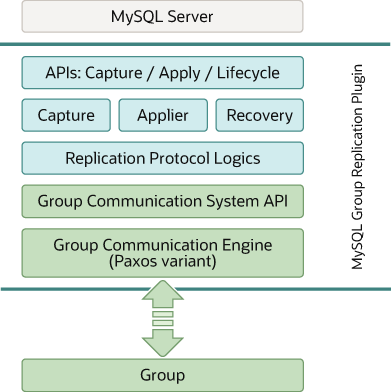

### 20.1.5 Group Replication Plugin Architecture

MySQL Group Replication is a MySQL plugin and it builds on the
existing MySQL replication infrastructure, taking advantage of
features such as the binary log, row-based logging, and global
transaction identifiers. It integrates with current MySQL
frameworks, such as the performance schema or plugin and service
infrastructures. The following figure presents a block diagram
depicting the overall architecture of MySQL Group Replication.

**Figure 20.6 Group Replication Plugin Block Diagram**

The MySQL Group Replication plugin includes a set of APIs for
capture, apply, and lifecycle, which control how the plugin
interacts with MySQL Server. There are interfaces to make
information flow from the server to the plugin and vice versa.
These interfaces isolate the MySQL Server core from the Group
Replication plugin, and are mostly hooks placed in the transaction
execution pipeline. In one direction, from server to the plugin,
there are notifications for events such as the server starting,
the server recovering, the server being ready to accept
connections, and the server being about to commit a transaction.
In the other direction, the plugin instructs the server to perform
actions such as committing or aborting ongoing transactions, or
queuing transactions in the relay log.

The next layer of the Group Replication plugin architecture is a
set of components that react when a notification is routed to
them. The capture component is responsible for keeping track of
context related to transactions that are executing. The applier
component is responsible for executing remote transactions on the
database. The recovery component manages distributed recovery, and
is responsible for getting a server that is joining the group up
to date by selecting the donor, managing the catch up procedure
and reacting to donor failures.

Continuing down the stack, the replication protocol module
contains the specific logic of the replication protocol. It
handles conflict detection, and receives and propagates
transactions to the group.

The final two layers of the Group Replication plugin architecture
are the Group Communication System (GCS) API, and an
implementation of a Paxos-based group communication engine (XCom).
The GCS API is a high level API that abstracts the properties
required to build a replicated state machine (see
[Section 20.1, “Group Replication Background”](group-replication-background.md "20.1 Group Replication Background")). It therefore
decouples the implementation of the messaging layer from the
remaining upper layers of the plugin. The group communication
engine handles communications with the members of the replication
group.
