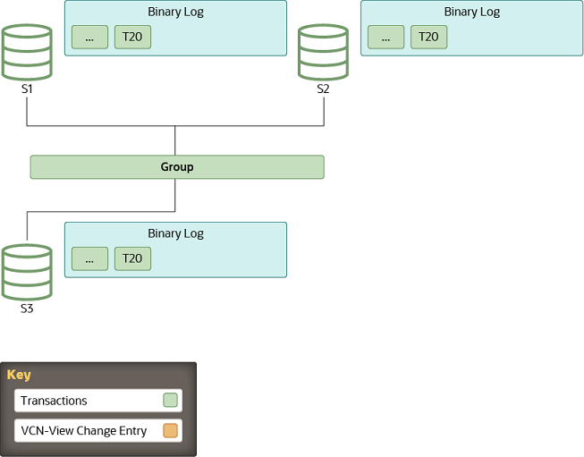
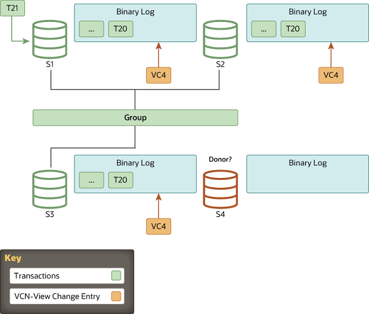
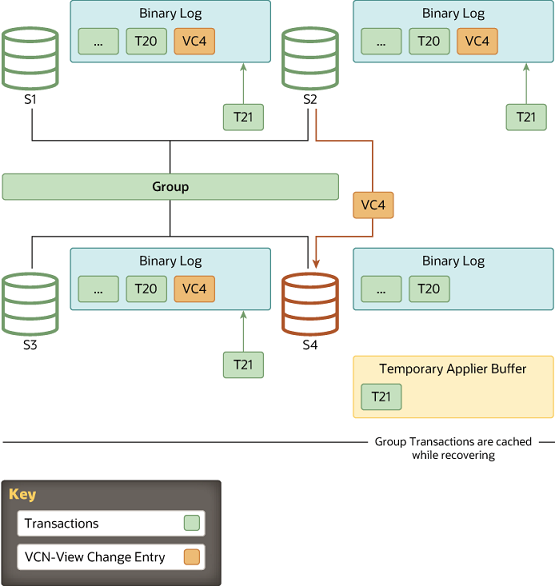

#### 20.5.4.5 How Distributed Recovery Works

When Group Replication's distributed recovery process is
carrying out state transfer from the binary log, to synchronize
the joining member with the donor up to a specific point in
time, the joining member and donor make use of GTIDs (see
[Section 19.1.3, “Replication with Global Transaction Identifiers”](replication-gtids.md "19.1.3 Replication with Global Transaction Identifiers")). However, GTIDs only
provide a means to realize which transactions the joining member
is missing. They do not help marking a specific point in time to
which the server joining the group must catch up, nor do they
convey certification information. This is the job of binary log
view markers, which mark view changes in the binary log stream,
and also contain additional metadata information, supplying the
joining member with missing certification-related data.

This topic explains the role of view changes and the view change
identifier, and the steps to carry out state transfer from the
binary log.

##### View and View Changes

A *view* corresponds to a group of members
participating actively in the current configuration, in other
words at a specific point in time. They are functioning
correctly and online in the group.

A *view change* occurs when a modification
to the group configuration happens, such as a member joining
or leaving. Any group membership change results in an
independent view change communicated to all members at the
same logical point in time.

A *view identifier* uniquely identifies a
view. It is generated whenever a view change happens.

At the group communication layer, view changes with their
associated view identifiers mark boundaries between the data
exchanged before and after a member joins. This concept is
implemented through a binary log event: the "view change
log event" (VCLE). The view identifier is recorded to
demarcate transactions transmitted before and after changes
happen in the group membership.

The view identifier itself is built from two parts: a randomly
generated part, and a monotonically increasing integer. The
randomly generated part is generated when the group is
created, and remains unchanged while there is at least one
member in the group. The integer is incremented every time a
view change happens. Using these two different parts enables
the view identifier to identify incremental group changes
caused by members joining or leaving, and also to identify the
situation where all members leave the group in a full group
shutdown, so no information remains of what view the group was
in. Randomly generating part of the identifier when the group
is started from the beginning ensures that the data markers in
the binary log remain unique, and an identical identifier is
not reused after a full group shutdown, as this would cause
issues with distributed recovery in the future.

##### Begin: Stable Group

All servers are online and processing incoming transactions
from the group. Some servers may be a little behind in terms
of transactions replicated, but eventually they converge. The
group acts as one distributed and replicated database.

**Figure 20.8 Stable Group**

##### View Change: a Member Joins

Whenever a new member joins the group and therefore a view
change is performed, every online server queues a view change
log event for execution. This is queued because before the
view change, several transactions can be queued on the server
to be applied and as such, these belong to the old view.
Queuing the view change event after them guarantees a correct
marking of when this happened.

Meanwhile, the joining member selects a suitable donor from
the list of online servers as stated by the membership service
through the view abstraction. A member joins on view 4 and the
online members write a view change event to the binary log.

**Figure 20.9 A Member Joins**

##### State Transfer: Catching Up

If group members and the joining member are set up with the
clone plugin (see
[Section 20.5.4.2, “Cloning for Distributed Recovery”](group-replication-cloning.md "20.5.4.2 Cloning for Distributed Recovery")), and the
difference in transactions between the joining member and the
group exceeds the threshold set for a remote cloning operation
([`group_replication_clone_threshold`](group-replication-system-variables.md#sysvar_group_replication_clone_threshold)),
Group Replication begins distributed recovery with a remote
cloning operation. A remote cloning operation is also carried
out if required transactions are no longer present in any
group member's binary log files. During a remote cloning
operation, the existing data on the joining member is removed,
and replaced with a copy of the donor's data. When the remote
cloning operation is complete and the joining member has
restarted, state transfer from a donor's binary log is carried
out to get the transactions that the group applied while the
remote cloning operation was in progress. If there is not a
large transaction gap, or if the clone plugin is not
installed, Group Replication proceeds directly to state
transfer from a donor's binary log.

For state transfer from a donor's binary log, a connection is
established between the joining member and the donor and state
transfer begins. This interaction with the donor continues
until the server joining the group's applier thread
processes the view change log event that corresponds to the
view change triggered when the server joining the group came
into the group. In other words, the server joining the group
replicates from the donor, until it gets to the marker with
the view identifier which matches the view marker it is
already in.

**Figure 20.10 State Transfer: Catching Up**

As view identifiers are transmitted to all members in the
group at the same logical time, the server joining the group
knows at which view identifier it should stop replicating.
This avoids complex GTID set calculations because the view
identifier clearly marks which data belongs to each group
view.

While the server joining the group is replicating from the
donor, it is also caching incoming transactions from the
group. Eventually, it stops replicating from the donor and
switches to applying those that are cached.

**Figure 20.11 Queued Transactions**

##### Finish: Caught Up

When the server joining the group recognizes a view change log
event with the expected view identifier, the connection to the
donor is terminated and it starts applying the cached
transactions. Although it acts as a marker in the binary log,
delimiting view changes, the view change log event also plays
another role. It conveys the certification information as
perceived by all servers when the server joining the group
entered the group, in other words the last view change.
Without it, the server joining the group would not have the
necessary information to be able to certify (detect conflicts)
subsequent transactions.

The duration of the catch up is not deterministic, because it
depends on the workload and the rate of incoming transactions
to the group. This process is completely online and the server
joining the group does not block any other server in the group
while it is catching up. Therefore the number of transactions
the server joining the group is behind when it moves to this
stage can, for this reason, vary and thus increase or decrease
according to the workload.

When the server joining the group reaches zero queued
transactions and its stored data is equal to the other
members, its public state changes to online.

**Figure 20.12 Instance Online**

