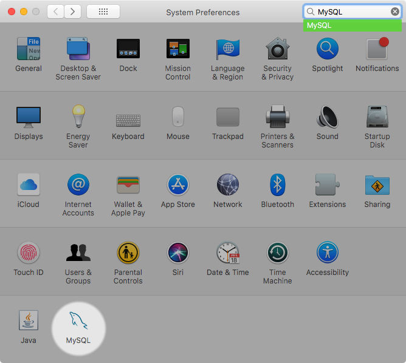

### 2.4.3 Installing and Using the MySQL Launch Daemon

macOS uses launch daemons to automatically start, stop, and manage
processes and applications such as MySQL.

By default, the installation package (DMG) on macOS installs a
launchd file named
`/Library/LaunchDaemons/com.oracle.oss.mysql.mysqld.plist`
that contains a plist definition similar to:

```terminal
<?xml version="1.0" encoding="UTF-8"?>
<!DOCTYPE plist PUBLIC "-//Apple Computer//DTD PLIST 1.0//EN" "http://www.apple.com/DTDs/PropertyList-1.0.dtd">
<plist version="1.0">
<dict>
    <key>Label</key>             <string>com.oracle.oss.mysql.mysqld</string>
    <key>ProcessType</key>       <string>Interactive</string>
    <key>Disabled</key>          <false/>
    <key>RunAtLoad</key>         <true/>
    <key>KeepAlive</key>         <true/>
    <key>SessionCreate</key>     <true/>
    <key>LaunchOnlyOnce</key>    <false/>
    <key>UserName</key>          <string>_mysql</string>
    <key>GroupName</key>         <string>_mysql</string>
    <key>ExitTimeOut</key>       <integer>600</integer>
    <key>Program</key>           <string>/usr/local/mysql/bin/mysqld</string>
    <key>ProgramArguments</key>
        <array>
            <string>/usr/local/mysql/bin/mysqld</string>
            <string>--user=_mysql</string>
            <string>--basedir=/usr/local/mysql</string>
            <string>--datadir=/usr/local/mysql/data</string>
            <string>--plugin-dir=/usr/local/mysql/lib/plugin</string>
            <string>--log-error=/usr/local/mysql/data/mysqld.local.err</string>
            <string>--pid-file=/usr/local/mysql/data/mysqld.local.pid</string>
            <string>--keyring-file-data=/usr/local/mysql/keyring/keyring</string>
            <string>--early-plugin-load=keyring_file=keyring_file.so</string>
        </array>
    <key>WorkingDirectory</key>  <string>/usr/local/mysql</string>
</dict>
</plist>
```

Note

Some users report that adding a plist DOCTYPE declaration causes
the launchd operation to fail, despite it passing the lint
check. We suspect it's a copy-n-paste error. The md5 checksum of
a file containing the above snippet is
*d925f05f6d1b6ee5ce5451b596d6baed*.

To enable the launchd service, you can either:

- Open macOS system preferences and select the MySQL preference
  panel, and then execute Start MySQL
  Server.

  **Figure 2.18 MySQL Preference Pane: Location**

  

  The Instances page includes an option to
  start or stop MySQL, and Initialize
  Database recreates the `data/`
  directory. Uninstall uninstalls MySQL
  Server and optionally the MySQL preference panel and launchd
  information.

  **Figure 2.19 MySQL Preference Pane: Instances**

  
- Or, manually load the launchd file.

  ```terminal
  $> cd /Library/LaunchDaemons
  $> sudo launchctl load -F com.oracle.oss.mysql.mysqld.plist
  ```
- To configure MySQL to automatically start at bootup, you can:

  ```terminal
  $> sudo launchctl load -w com.oracle.oss.mysql.mysqld.plist
  ```

Note

When upgrading MySQL server, the launchd installation process
removes the old startup items that were installed with MySQL
server 5.7.7 and below.

Upgrading also replaces your existing launchd file named
`com.oracle.oss.mysql.mysqld.plist`.

Additional launchd related information:

- The plist entries override `my.cnf`
  entries, because they are passed in as command line arguments.
  For additional information about passing in program options,
  see [Section 6.2.2, “Specifying Program Options”](program-options.md "6.2.2 Specifying Program Options").
- The **ProgramArguments** section
  defines the command line options that are passed into the
  program, which is the `mysqld` binary in
  this case.
- The default plist definition is written with less
  sophisticated use cases in mind. For more complicated setups,
  you may want to remove some of the arguments and instead rely
  on a MySQL configuration file, such as
  `my.cnf`.
- If you edit the plist file, then uncheck the installer option
  when reinstalling or upgrading MySQL. Otherwise, your edited
  plist file is overwritten, and all edits are lost.

Because the default plist definition defines several
**ProgramArguments**, you might
remove most of these arguments and instead rely upon your
`my.cnf` MySQL configuration file to define
them. For example:

```terminal
<?xml version="1.0" encoding="UTF-8"?>
<!DOCTYPE plist PUBLIC "-//Apple Computer//DTD PLIST 1.0//EN" "http://www.apple.com/DTDs/PropertyList-1.0.dtd">
<plist version="1.0">
<dict>
    <key>Label</key>             <string>com.oracle.oss.mysql.mysqld</string>
    <key>ProcessType</key>       <string>Interactive</string>
    <key>Disabled</key>          <false/>
    <key>RunAtLoad</key>         <true/>
    <key>KeepAlive</key>         <true/>
    <key>SessionCreate</key>     <true/>
    <key>LaunchOnlyOnce</key>    <false/>
    <key>UserName</key>          <string>_mysql</string>
    <key>GroupName</key>         <string>_mysql</string>
    <key>ExitTimeOut</key>       <integer>600</integer>
    <key>Program</key>           <string>/usr/local/mysql/bin/mysqld</string>
    <key>ProgramArguments</key>
        <array>
            <string>/usr/local/mysql/bin/mysqld</string>
            <string>--user=_mysql</string>
            <string>--basedir=/usr/local/mysql</string>
            <string>--datadir=/usr/local/mysql/data</string>
            <string>--plugin-dir=/usr/local/mysql/lib/plugin</string>
            <string>--log-error=/usr/local/mysql/data/mysqld.local.err</string>
            <string>--pid-file=/usr/local/mysql/data/mysqld.local.pid</string>
            <string>--keyring-file-data=/usr/local/mysql/keyring/keyring</string>
            <string>--early-plugin-load=keyring_file=keyring_file.so</string>
        </array>
    <key>WorkingDirectory</key>  <string>/usr/local/mysql</string>
</dict>
</plist>
```

In this case, the [`basedir`](server-system-variables.md#sysvar_basedir),
[`datadir`](server-system-variables.md#sysvar_datadir),
[`plugin_dir`](server-system-variables.md#sysvar_plugin_dir),
[`log_error`](server-system-variables.md#sysvar_log_error),
[`pid_file`](server-system-variables.md#sysvar_pid_file),
[`keyring_file_data`](keyring-system-variables.md#sysvar_keyring_file_data), and
[`--early-plugin-load`](server-options.md#option_mysqld_early-plugin-load) options were
removed from the default plist
*ProgramArguments* definition, which you might
have defined in `my.cnf` instead.
