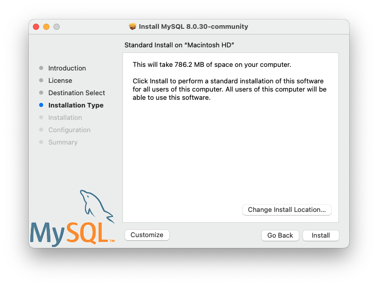
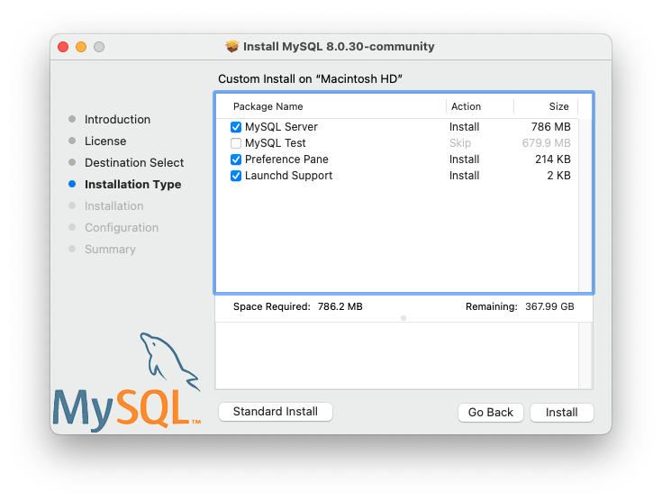
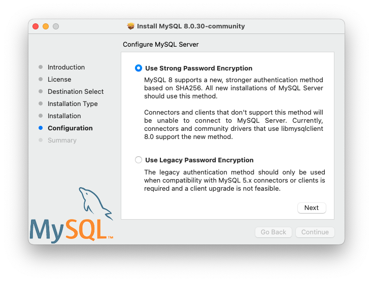
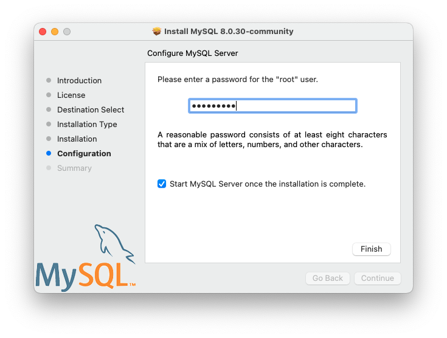
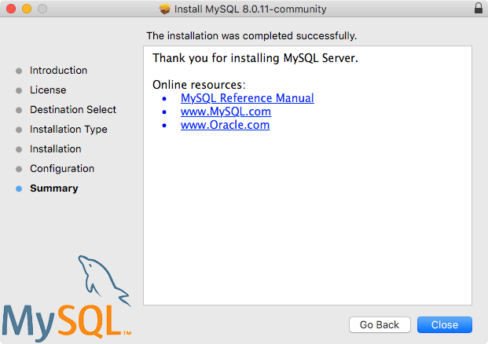

### 2.4.2 Installing MySQL on macOS Using Native Packages

The package is located inside a disk image
(`.dmg`) file that you first need to mount by
double-clicking its icon in the Finder. It should then mount the
image and display its contents.

Note

Before proceeding with the installation, be sure to stop all
running MySQL server instances by using either the MySQL Manager
Application (on macOS Server), the preference pane, or
[**mysqladmin shutdown**](mysqladmin.md "6.5.2 mysqladmin — A MySQL Server Administration Program") on the command line.

To install MySQL using the package installer:

1. Download the disk image (`.dmg`) file (the
   community version is available
   [here](https://dev.mysql.com/downloads/mysql/)) that
   contains the MySQL package installer. Double-click the file to
   mount the disk image and see its contents.

   Double-click the MySQL installer package from the disk. It is
   named according to the version of MySQL you have downloaded.
   For example, for MySQL server 8.0.45 it might be
   named
   `mysql-8.0.45-macos-10.13-x86_64.pkg`.
2. The initial wizard introduction screen references the MySQL
   server version to install. Click
   Continue to begin the installation.

   The MySQL community edition shows a copy of the relevant GNU
   General Public License. Click Continue
   and then Agree to continue.
3. From the Installation Type page you can
   either click Install to execute the
   installation wizard using all defaults, click
   Customize to alter which components to
   install (MySQL server, MySQL Test, Preference Pane, Launchd
   Support -- all but MySQL Test are enabled by default).

   Note

   Although the Change Install Location
   option is visible, the installation location cannot be
   changed.

   **Figure 2.13 MySQL Package Installer Wizard: Installation Type**

   

   **Figure 2.14 MySQL Package Installer Wizard: Customize**

   
4. Click Install to install MySQL Server.
   The installation process ends here if upgrading a current
   MySQL Server installation, otherwise follow the wizard's
   additional configuration steps for your new MySQL Server
   installation.
5. After a successful new MySQL Server installation, complete the
   configuration steps by choosing the default encryption type
   for passwords, define the root password, and also enable (or
   disable) MySQL server at startup.
6. The default MySQL 8.0 password mechanism is
   `caching_sha2_password` (Strong), and this
   step allows you to change it to
   `mysql_native_password` (Legacy).

   **Figure 2.15 MySQL Package Installer Wizard: Choose a Password Encryption Type**

   

   Choosing the legacy password mechanism alters the generated
   launchd file to set
   [`--default_authentication_plugin=mysql_native_password`](server-system-variables.md#sysvar_default_authentication_plugin)
   under `ProgramArguments`. Choosing strong
   password encryption does not set
   `--default_authentication_plugin` because the
   default MySQL Server value is used, which is
   `caching_sha2_password`.
7. Define a password for the root user, and also toggle whether
   MySQL Server should start after the configuration step is
   complete.

   **Figure 2.16 MySQL Package Installer Wizard: Define Root Password**

   
8. Summary is the final step and references
   a successful and complete MySQL Server installation.
   Close the wizard.

   **Figure 2.17 MySQL Package Installer Wizard: Summary**

   

MySQL server is now installed. If you chose to not start MySQL,
then use either launchctl from the command line or start MySQL by
clicking "Start" using the MySQL preference pane. For additional
information, see [Section 2.4.3, “Installing and Using the MySQL Launch Daemon”](macos-installation-launchd.md "2.4.3 Installing and Using the MySQL Launch Daemon"), and
[Section 2.4.4, “Installing and Using the MySQL Preference Pane”](macos-installation-prefpane.md "2.4.4 Installing and Using the MySQL Preference Pane"). Use the MySQL
Preference Pane or launchd to configure MySQL to automatically
start at bootup.

When installing using the package installer, the files are
installed into a directory within `/usr/local`
matching the name of the installation version and platform. For
example, the installer file
`mysql-8.0.45-macos10.15-x86_64.dmg`
installs MySQL into
`/usr/local/mysql-8.0.45-macos10.15-x86_64/` with a symlink to
`/usr/local/mysql`. The following table shows
the layout of this MySQL installation directory.

Note

The macOS installation process does not create nor install a
sample `my.cnf` MySQL configuration file.

**Table 2.7 MySQL Installation Layout on macOS**

| Directory | Contents of Directory |
| --- | --- |
| `bin` | [**mysqld**](mysqld.md "6.3.1 mysqld — The MySQL Server") server, client and utility programs |
| `data` | Log files, databases, where `/usr/local/mysql/data/mysqld.local.err` is the default error log |
| `docs` | Helper documents, like the Release Notes and build information |
| `include` | Include (header) files |
| `lib` | Libraries |
| `man` | Unix manual pages |
| `mysql-test` | MySQL test suite ('MySQL Test' is disabled by default during the installation process when using the installer package (DMG)) |
| `share` | Miscellaneous support files, including error messages, `dictionary.txt`, and rewriter SQL |
| `support-files` | Support scripts, such as `mysqld_multi.server`, `mysql.server`, and `mysql-log-rotate`. |
| `/tmp/mysql.sock` | Location of the MySQL Unix socket |
