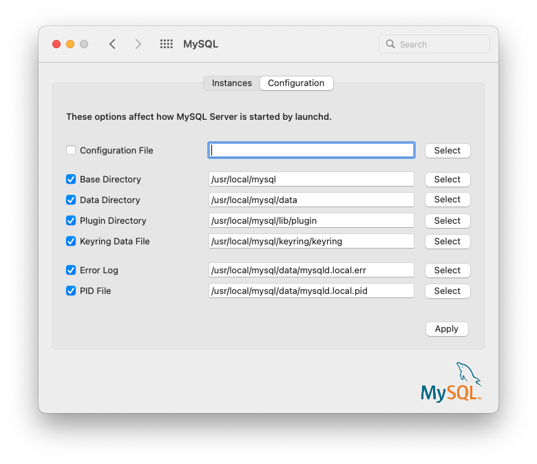

### 2.4.4 Installing and Using the MySQL Preference Pane

The MySQL Installation Package includes a MySQL preference pane
that enables you to start, stop, and control automated startup
during boot of your MySQL installation.

This preference pane is installed by default, and is listed under
your system's *System Preferences* window.

**Figure 2.20 MySQL Preference Pane: Location**

The MySQL preference pane is installed with the same DMG file that
installs MySQL Server. Typically it is installed with MySQL Server
but it can be installed by itself too.

To install the MySQL preference pane:

1. Go through the process of installing the MySQL server, as
   described in the documentation at
   [Section 2.4.2, “Installing MySQL on macOS Using Native Packages”](macos-installation-pkg.md "2.4.2 Installing MySQL on macOS Using Native Packages").
2. Click Customize at the
   Installation Type step. The "Preference
   Pane" option is listed there and enabled by default; make sure
   it is not deselected. The other options, such as MySQL Server,
   can be selected or deselected.

   **Figure 2.21 MySQL Package Installer Wizard: Customize**

   
3. Complete the installation process.

Note

The MySQL preference pane only starts and stops MySQL
installation installed from the MySQL package installation that
have been installed in the default location.

Once the MySQL preference pane has been installed, you can control
your MySQL server instance using this preference pane.

The Instances page includes an option to
start or stop MySQL, and Initialize
Database recreates the `data/`
directory. Uninstall uninstalls MySQL
Server and optionally the MySQL preference panel and launchd
information.

**Figure 2.22 MySQL Preference Pane: Instances**

**Figure 2.23 MySQL Preference Pane: Initialize Database**

The Configuration page shows MySQL Server
options including the path to the MySQL configuration file.

**Figure 2.24 MySQL Preference Pane: Configuration**

The MySQL Preference Pane shows the current status of the MySQL
server, showing stopped (in red) if the
server is not running and running (in green)
if the server has already been started. The preference pane also
shows the current setting for whether the MySQL server has been
set to start automatically.
