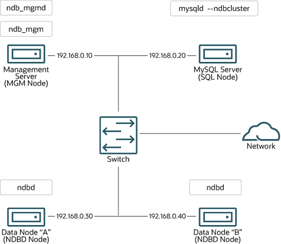

## 25.3 NDB Cluster Installation

[25.3.1 Installation of NDB Cluster on Linux](mysql-cluster-install-linux.md)

[25.3.2 Installing NDB Cluster on Windows](mysql-cluster-install-windows.md)

[25.3.3 Initial Configuration of NDB Cluster](mysql-cluster-install-configuration.md)

[25.3.4 Initial Startup of NDB Cluster](mysql-cluster-install-first-start.md)

[25.3.5 NDB Cluster Example with Tables and Data](mysql-cluster-install-example-data.md)

[25.3.6 Safe Shutdown and Restart of NDB Cluster](mysql-cluster-install-shutdown-restart.md)

[25.3.7 Upgrading and Downgrading NDB Cluster](mysql-cluster-upgrade-downgrade.md)

[25.3.8 The NDB Cluster Auto-Installer (NO LONGER SUPPORTED)](mysql-cluster-installer.md)

This section describes the basics for planning, installing,
configuring, and running an NDB Cluster. Whereas the examples in
[Section 25.4, “Configuration of NDB Cluster”](mysql-cluster-configuration.md "25.4 Configuration of NDB Cluster") provide more in-depth
information on a variety of clustering options and configuration,
the result of following the guidelines and procedures outlined here
should be a usable NDB Cluster which meets the
*minimum* requirements for availability and
safeguarding of data.

For information about upgrading or downgrading an NDB Cluster
between release versions, see
[Section 25.3.7, “Upgrading and Downgrading NDB Cluster”](mysql-cluster-upgrade-downgrade.md "25.3.7 Upgrading and Downgrading NDB Cluster").

This section covers hardware and software requirements; networking
issues; installation of NDB Cluster; basic configuration issues;
starting, stopping, and restarting the cluster; loading of a sample
database; and performing queries.

**Assumptions.**
The following sections make a number of assumptions regarding the
cluster's physical and network configuration. These
assumptions are discussed in the next few paragraphs.

**Cluster nodes and host computers.**
The cluster consists of four nodes, each on a separate host
computer, and each with a fixed network address on a typical
Ethernet network as shown here:

**Table 25.5 Network addresses of nodes in example cluster**

| Node | IP Address |
| --- | --- |
| Management node (**mgmd**) | 198.51.100.10 |
| SQL node ([**mysqld**](mysqld.md "6.3.1 mysqld — The MySQL Server")) | 198.51.100.20 |
| Data node "A" ([**ndbd**](mysql-cluster-programs-ndbd.md "25.5.1 ndbd — The NDB Cluster Data Node Daemon")) | 198.51.100.30 |
| Data node "B" ([**ndbd**](mysql-cluster-programs-ndbd.md "25.5.1 ndbd — The NDB Cluster Data Node Daemon")) | 198.51.100.40 |

This setup is also shown in the following diagram:

**Figure 25.4 NDB Cluster Multi-Computer Setup**



**Network addressing.**

In the interest of simplicity (and reliability), this
*How-To* uses only numeric IP addresses.
However, if DNS resolution is available on your network, it is
possible to use host names in lieu of IP addresses in configuring
Cluster. Alternatively, you can use the `hosts`
file (typically `/etc/hosts` for Linux and
other Unix-like operating systems,
`C:\WINDOWS\system32\drivers\etc\hosts` on
Windows, or your operating system's equivalent) for providing
a means to do host lookup if such is available.

As of NDB 8.0.22, `NDB` supports IPv6 for
connections between all NDB Cluster nodes.

A known issue on Linux platforms when running NDB 8.0.22 and later
was that the operating system kernel was required to provide IPv6
support, even when no IPv6 addresses were in use. This issue is
fixed in NDB 8.0.34 and later (Bug #33324817, Bug #33870642).

If you are using an affected version and wish to disable support for
IPv6 on the system (because you do not plan to use any IPv6
addresses for NDB Cluster nodes), do so after booting the system,
like this:

```terminal
$> sysctl -w net.ipv6.conf.all.disable_ipv6=1
$> sysctl -w net.ipv6.conf.default.disable_ipv6=1
```

(Alternatively, you can add the corresponding lines to
`/etc/sysctl.conf`.) In NDB Cluster 8.0.34 and
later, the preceding is not necessary, and you can simply disable
IPv6 support in the Linux kernel if you do not want or need it.

In NDB 8.0.21 and earlier releases, all network addresses used for
connections to or from data and management nodes must use or be
resolvable using IPv4, including addresses used by SQL nodes to
contact the other nodes.

**Potential hosts file issues.**
A common problem when trying to use host names for Cluster nodes
arises because of the way in which some operating systems
(including some Linux distributions) set up the system's own
host name in the `/etc/hosts` during
installation. Consider two machines with the host names
`ndb1` and `ndb2`, both in the
`cluster` network domain. Red Hat Linux
(including some derivatives such as CentOS and Fedora) places the
following entries in these machines'
`/etc/hosts` files:

```ini
#  ndb1 /etc/hosts:
127.0.0.1   ndb1.cluster ndb1 localhost.localdomain localhost
```

```ini
#  ndb2 /etc/hosts:
127.0.0.1   ndb2.cluster ndb2 localhost.localdomain localhost
```

SUSE Linux (including OpenSUSE) places these entries in the
machines' `/etc/hosts` files:

```ini
#  ndb1 /etc/hosts:
127.0.0.1       localhost
127.0.0.2       ndb1.cluster ndb1
```

```ini
#  ndb2 /etc/hosts:
127.0.0.1       localhost
127.0.0.2       ndb2.cluster ndb2
```

In both instances, `ndb1` routes
`ndb1.cluster` to a loopback IP address, but gets a
public IP address from DNS for `ndb2.cluster`,
while `ndb2` routes `ndb2.cluster`
to a loopback address and obtains a public address for
`ndb1.cluster`. The result is that each data node
connects to the management server, but cannot tell when any other
data nodes have connected, and so the data nodes appear to hang
while starting.

Caution

You cannot mix `localhost` and other host names
or IP addresses in `config.ini`. For these
reasons, the solution in such cases (other than to use IP
addresses for *all*
`config.ini` `HostName`
entries) is to remove the fully qualified host names from
`/etc/hosts` and use these in
`config.ini` for all cluster hosts.

**Host computer type.**
Each host computer in our installation scenario is an Intel-based
desktop PC running a supported operating system installed to disk
in a standard configuration, and running no unnecessary services.
The core operating system with standard TCP/IP networking
capabilities should be sufficient. Also for the sake of
simplicity, we also assume that the file systems on all hosts are
set up identically. In the event that they are not, you should
adapt these instructions accordingly.

**Network hardware.**
Standard 100 Mbps or 1 gigabit Ethernet cards are installed on
each machine, along with the proper drivers for the cards, and
that all four hosts are connected through a standard-issue
Ethernet networking appliance such as a switch. (All machines
should use network cards with the same throughput. That is, all
four machines in the cluster should have 100 Mbps cards
*or* all four machines should have 1 Gbps
cards.) NDB Cluster works in a 100 Mbps network; however, gigabit
Ethernet provides better performance.

Important

NDB Cluster is *not* intended for use in a
network for which throughput is less than 100 Mbps or which
experiences a high degree of latency. For this reason (among
others), attempting to run an NDB Cluster over a wide area network
such as the Internet is not likely to be successful, and is not
supported in production.

**Sample data.**
We use the `world` database which is available
for download from the MySQL website (see
<https://dev.mysql.com/doc/index-other.html>). We assume that each
machine has sufficient memory for running the operating system,
required NDB Cluster processes, and (on the data nodes) storing
the database.

For general information about installing MySQL, see
[Chapter 2, *Installing MySQL*](installing.md "Chapter 2 Installing MySQL"). For information about installation of
NDB Cluster on Linux and other Unix-like operating systems, see
[Section 25.3.1, “Installation of NDB Cluster on Linux”](mysql-cluster-install-linux.md "25.3.1 Installation of NDB Cluster on Linux"). For information about
installation of NDB Cluster on Windows operating systems, see
[Section 25.3.2, “Installing NDB Cluster on Windows”](mysql-cluster-install-windows.md "25.3.2 Installing NDB Cluster on Windows").

For general information about NDB Cluster hardware, software, and
networking requirements, see
[Section 25.2.3, “NDB Cluster Hardware, Software, and Networking Requirements”](mysql-cluster-overview-requirements.md "25.2.3 NDB Cluster Hardware, Software, and Networking Requirements").
