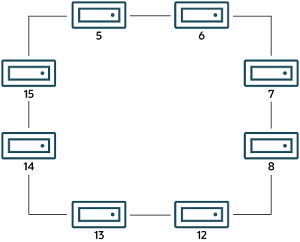

#### 25.6.16.44 The ndbinfo membership Table

The `membership` table describes the view that
each data node has of all the others in the cluster, including
node group membership, president node, arbitrator, arbitrator
successor, arbitrator connection states, and other information.

The `membership` table contains the following
columns:

- `node_id`

  This node's node ID
- `group_id`

  Node group to which this node belongs
- `left node`

  Node ID of the previous node
- `right_node`

  Node ID of the next node
- `president`

  President's node ID
- `successor`

  Node ID of successor to president
- `succession_order`

  Order in which this node succeeds to presidency
- `Conf_HB_order`

  -
- `arbitrator`

  Node ID of arbitrator
- `arb_ticket`

  Internal identifier used to track arbitration
- `arb_state`

  Arbitration state
- `arb_connected`

  Whether this node is connected to the arbitrator; either of
  `Yes` or `No`
- `connected_rank1_arbs`

  Connected arbitrators of rank 1
- `connected_rank2_arbs`

  Connected arbitrators of rank 1

##### Notes

The node ID and node group ID are the same as reported by
[**ndb\_mgm -e "SHOW"**](mysql-cluster-programs-ndb-mgm.md "25.5.5 ndb_mgm — The NDB Cluster Management Client").

`left_node` and `right_node`
are defined in terms of a model that connects all data nodes in
a circle, in order of their node IDs, similar to the ordering of
the numbers on a clock dial, as shown here:

**Figure 25.6 Circular Arrangement of NDB Cluster Nodes**



In this example, we have 8 data nodes, numbered 5, 6, 7, 8, 12,
13, 14, and 15, ordered clockwise in a circle. We determine
“left” and “right” from the interior
of the circle. The node to the left of node 5 is node 15, and
the node to the right of node 5 is node 6. You can see all these
relationships by running the following query and observing the
output:

```sql
mysql> SELECT node_id,left_node,right_node
    -> FROM ndbinfo.membership;
+---------+-----------+------------+
| node_id | left_node | right_node |
+---------+-----------+------------+
|       5 |        15 |          6 |
|       6 |         5 |          7 |
|       7 |         6 |          8 |
|       8 |         7 |         12 |
|      12 |         8 |         13 |
|      13 |        12 |         14 |
|      14 |        13 |         15 |
|      15 |        14 |          5 |
+---------+-----------+------------+
8 rows in set (0.00 sec)
```

The designations “left” and “right”
are used in the event log in the same way.

The `president` node is the node viewed by the
current node as responsible for setting an arbitrator (see
[NDB Cluster Start Phases](https://dev.mysql.com/doc/ndb-internals/en/ndb-internals-start-phases.html)). If the president
fails or becomes disconnected, the current node expects the node
whose ID is shown in the `successor` column to
become the new president. The
`succession_order` column shows the place in
the succession queue that the current node views itself as
having.

In a normal NDB Cluster, all data nodes should see the same node
as `president`, and the same node (other than
the president) as its `successor`. In addition,
the current president should see itself as `1`
in the order of succession, the `successor`
node should see itself as `2`, and so on.

All nodes should show the same `arb_ticket`
values as well as the same `arb_state` values.
Possible `arb_state` values are
`ARBIT_NULL`, `ARBIT_INIT`,
`ARBIT_FIND`, `ARBIT_PREP1`,
`ARBIT_PREP2`, `ARBIT_START`,
`ARBIT_RUN`, `ARBIT_CHOOSE`,
`ARBIT_CRASH`, and `UNKNOWN`.

`arb_connected` shows whether this node is
connected to the node shown as this node's
`arbitrator`.

The `connected_rank1_arbs` and
`connected_rank2_arbs` columns each display a
list of 0 or more arbitrators having an
[`ArbitrationRank`](mysql-cluster-mgm-definition.md#ndbparam-mgmd-arbitrationrank) equal to
1, or to 2, respectively.

Note

Both management nodes and API nodes are eligible to become
arbitrators.
