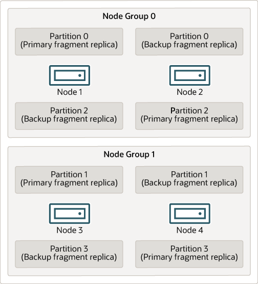
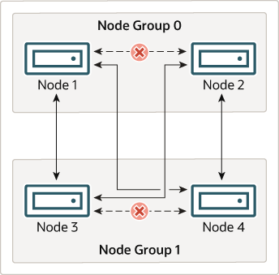

### 25.2.2 NDB Cluster Nodes, Node Groups, Fragment Replicas, and Partitions

This section discusses the manner in which NDB Cluster divides and
duplicates data for storage.

A number of concepts central to an understanding of this topic are
discussed in the next few paragraphs.

**Data node.**
An [**ndbd**](mysql-cluster-programs-ndbd.md "25.5.1 ndbd — The NDB Cluster Data Node Daemon") or [**ndbmtd**](mysql-cluster-programs-ndbmtd.md "25.5.3 ndbmtd — The NDB Cluster Data Node Daemon (Multi-Threaded)") process,
which stores one or more fragment
replicas—that is, copies of the
partitions (discussed
later in this section) assigned to the node group of which the
node is a member.

Each data node should be located on a separate computer. While it
is also possible to host multiple data node processes on a single
computer, such a configuration is not usually recommended.

It is common for the terms “node” and “data
node” to be used interchangeably when referring to an
[**ndbd**](mysql-cluster-programs-ndbd.md "25.5.1 ndbd — The NDB Cluster Data Node Daemon") or [**ndbmtd**](mysql-cluster-programs-ndbmtd.md "25.5.3 ndbmtd — The NDB Cluster Data Node Daemon (Multi-Threaded)") process;
where mentioned, management nodes ([**ndb\_mgmd**](mysql-cluster-programs-ndb-mgmd.md "25.5.4 ndb_mgmd — The NDB Cluster Management Server Daemon")
processes) and SQL nodes ([**mysqld**](mysqld.md "6.3.1 mysqld — The MySQL Server") processes) are
specified as such in this discussion.

**Node group.**
A node group consists of one or more nodes, and stores
partitions, or sets of fragment
replicas (see next item).

The number of node groups in an NDB Cluster is not directly
configurable; it is a function of the number of data nodes and of
the number of fragment replicas
([`NoOfReplicas`](mysql-cluster-ndbd-definition.md#ndbparam-ndbd-noofreplicas)
configuration parameter), as shown here:

```simple
[# of node groups] = [# of data nodes] / NoOfReplicas
```

Thus, an NDB Cluster with 4 data nodes has 4 node groups if
[`NoOfReplicas`](mysql-cluster-ndbd-definition.md#ndbparam-ndbd-noofreplicas) is set to 1
in the `config.ini` file, 2 node groups if
[`NoOfReplicas`](mysql-cluster-ndbd-definition.md#ndbparam-ndbd-noofreplicas) is set to 2,
and 1 node group if
[`NoOfReplicas`](mysql-cluster-ndbd-definition.md#ndbparam-ndbd-noofreplicas) is set to 4.
Fragment replicas are discussed later in this section; for more
information about
[`NoOfReplicas`](mysql-cluster-ndbd-definition.md#ndbparam-ndbd-noofreplicas), see
[Section 25.4.3.6, “Defining NDB Cluster Data Nodes”](mysql-cluster-ndbd-definition.md "25.4.3.6 Defining NDB Cluster Data Nodes").

Note

All node groups in an NDB Cluster must have the same number of
data nodes.

You can add new node groups (and thus new data nodes) online, to a
running NDB Cluster; see
[Section 25.6.7, “Adding NDB Cluster Data Nodes Online”](mysql-cluster-online-add-node.md "25.6.7 Adding NDB Cluster Data Nodes Online"), for more
information.

**Partition.**
This is a portion of the data stored by the cluster. Each node
is responsible for keeping at least one copy of any partitions
assigned to it (that is, at least one fragment replica)
available to the cluster.

The number of partitions used by default by NDB Cluster depends on
the number of data nodes and the number of LDM threads in use by
the data nodes, as shown here:

```simple
[# of partitions] = [# of data nodes] * [# of LDM threads]
```

When using data nodes running [**ndbmtd**](mysql-cluster-programs-ndbmtd.md "25.5.3 ndbmtd — The NDB Cluster Data Node Daemon (Multi-Threaded)"), the
number of LDM threads is controlled by the setting for
[`MaxNoOfExecutionThreads`](mysql-cluster-ndbd-definition.md#ndbparam-ndbmtd-maxnoofexecutionthreads).
When using [**ndbd**](mysql-cluster-programs-ndbd.md "25.5.1 ndbd — The NDB Cluster Data Node Daemon") there is a single LDM thread,
which means that there are as many cluster partitions as nodes
participating in the cluster. This is also the case when using
[**ndbmtd**](mysql-cluster-programs-ndbmtd.md "25.5.3 ndbmtd — The NDB Cluster Data Node Daemon (Multi-Threaded)") with
`MaxNoOfExecutionThreads` set to 3 or less. (You
should be aware that the number of LDM threads increases with the
value of this parameter, but not in a strictly linear fashion, and
that there are additional constraints on setting it; see the
description of
[`MaxNoOfExecutionThreads`](mysql-cluster-ndbd-definition.md#ndbparam-ndbmtd-maxnoofexecutionthreads)
for more information.)

**NDB and user-defined partitioning.**
NDB Cluster normally partitions
[`NDBCLUSTER`](mysql-cluster.md "Chapter 25 MySQL NDB Cluster 8.0") tables automatically.
However, it is also possible to employ user-defined partitioning
with [`NDBCLUSTER`](mysql-cluster.md "Chapter 25 MySQL NDB Cluster 8.0") tables. This is
subject to the following limitations:

1. Only the `KEY` and `LINEAR
   KEY` partitioning schemes are supported in production
   with [`NDB`](mysql-cluster.md "Chapter 25 MySQL NDB Cluster 8.0") tables.
2. The maximum number of partitions that may be defined
   explicitly for any [`NDB`](mysql-cluster.md "Chapter 25 MySQL NDB Cluster 8.0") table is
   `8 * [number of LDM
   threads] * [number of node
   groups]`, the number of node groups in
   an NDB Cluster being determined as discussed previously in
   this section. When running [**ndbd**](mysql-cluster-programs-ndbd.md "25.5.1 ndbd — The NDB Cluster Data Node Daemon") for data
   node processes, setting the number of LDM threads has no
   effect (since
   [`ThreadConfig`](mysql-cluster-ndbd-definition.md#ndbparam-ndbmtd-threadconfig) applies
   only to [**ndbmtd**](mysql-cluster-programs-ndbmtd.md "25.5.3 ndbmtd — The NDB Cluster Data Node Daemon (Multi-Threaded)")); in such cases, this value
   can be treated as though it were equal to 1 for purposes of
   performing this calculation.

   See [Section 25.5.3, “ndbmtd — The NDB Cluster Data Node Daemon (Multi-Threaded)”](mysql-cluster-programs-ndbmtd.md "25.5.3 ndbmtd — The NDB Cluster Data Node Daemon (Multi-Threaded)"), for more
   information.

For more information relating to NDB Cluster and user-defined
partitioning, see [Section 25.2.7, “Known Limitations of NDB Cluster”](mysql-cluster-limitations.md "25.2.7 Known Limitations of NDB Cluster"), and
[Section 26.6.2, “Partitioning Limitations Relating to Storage Engines”](partitioning-limitations-storage-engines.md "26.6.2 Partitioning Limitations Relating to Storage Engines").

**Fragment replica.**
This is a copy of a cluster partition. Each node in a node group
stores a fragment replica. Also sometimes known as a
partition replica. The
number of fragment replicas is equal to the number of nodes per
node group.

A fragment replica belongs entirely to a single node; a node can
(and usually does) store several fragment replicas.

The following diagram illustrates an NDB Cluster with four data
nodes running [**ndbd**](mysql-cluster-programs-ndbd.md "25.5.1 ndbd — The NDB Cluster Data Node Daemon"), arranged in two node groups
of two nodes each; nodes 1 and 2 belong to node group 0, and nodes
3 and 4 belong to node group 1.

Note

Only data nodes are shown here; although a working NDB Cluster
requires an [**ndb\_mgmd**](mysql-cluster-programs-ndb-mgmd.md "25.5.4 ndb_mgmd — The NDB Cluster Management Server Daemon") process for cluster
management and at least one SQL node to access the data stored
by the cluster, these have been omitted from the figure for
clarity.

**Figure 25.2 NDB Cluster with Two Node Groups**



The data stored by the cluster is divided into four partitions,
numbered 0, 1, 2, and 3. Each partition is stored—in
multiple copies—on the same node group. Partitions are
stored on alternate node groups as follows:

- Partition 0 is stored on node group 0; a
  primary fragment replica
  (primary copy) is stored on node 1, and a
  backup fragment replica
  (backup copy of the partition) is stored on node 2.
- Partition 1 is stored on the other node group (node group 1);
  this partition's primary fragment replica is on node 3,
  and its backup fragment replica is on node 4.
- Partition 2 is stored on node group 0. However, the placing of
  its two fragment replicas is reversed from that of Partition
  0; for Partition 2, the primary fragment replica is stored on
  node 2, and the backup on node 1.
- Partition 3 is stored on node group 1, and the placement of
  its two fragment replicas are reversed from those of partition
  1. That is, its primary fragment replica is located on node 4,
  with the backup on node 3.

What this means regarding the continued operation of an NDB
Cluster is this: so long as each node group participating in the
cluster has at least one node operating, the cluster has a
complete copy of all data and remains viable. This is illustrated
in the next diagram.

**Figure 25.3 Nodes Required for a 2x2 NDB Cluster**



In this example, the cluster consists of two node groups each
consisting of two data nodes. Each data node is running an
instance of [**ndbd**](mysql-cluster-programs-ndbd.md "25.5.1 ndbd — The NDB Cluster Data Node Daemon"). Any combination of at least
one node from node group 0 and at least one node from node group 1
is sufficient to keep the cluster “alive”. However,
if both nodes from a single node group fail, the combination
consisting of the remaining two nodes in the other node group is
not sufficient. In this situation, the cluster has lost an entire
partition and so can no longer provide access to a complete set of
all NDB Cluster data.

The maximum number of node groups supported for a single NDB
Cluster instance is 48.
