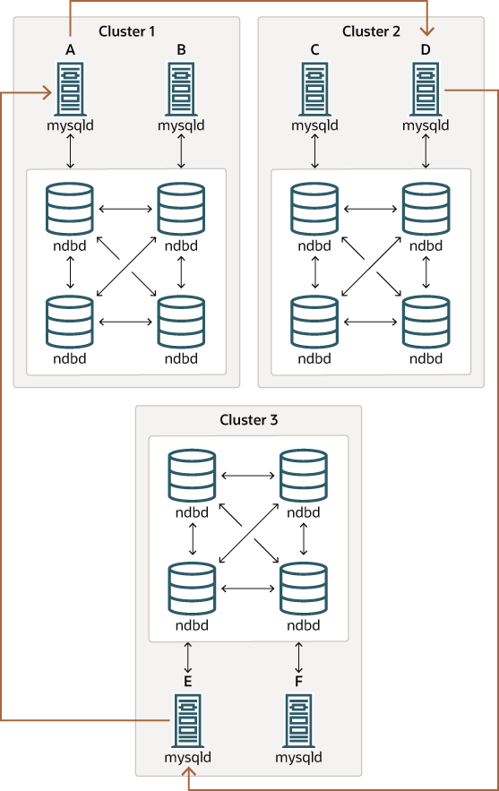
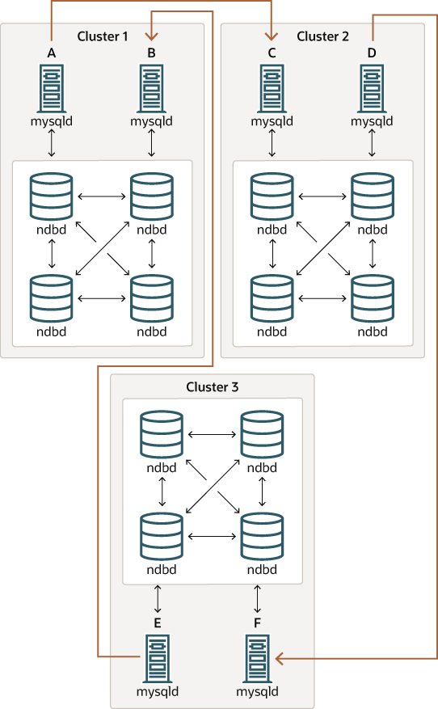

### 25.7.3 Known Issues in NDB Cluster Replication

This section discusses known problems or issues when using
replication with NDB Cluster.

**Loss of connection between source and replica.**

A loss of connection can occur either between the source cluster
SQL node and the replica cluster SQL node, or between the source
SQL node and the data nodes of the source cluster. In the latter
case, this can occur not only as a result of loss of physical
connection (for example, a broken network cable), but due to the
overflow of data node event buffers; if the SQL node is too slow
to respond, it may be dropped by the cluster (this is
controllable to some degree by adjusting the
[`MaxBufferedEpochs`](mysql-cluster-ndbd-definition.md#ndbparam-ndbd-maxbufferedepochs) and
[`TimeBetweenEpochs`](mysql-cluster-ndbd-definition.md#ndbparam-ndbd-timebetweenepochs)
configuration parameters). If this occurs, *it is
entirely possible for new data to be inserted into the source
cluster without being recorded in the source SQL node's
binary log*. For this reason, to guarantee high
availability, it is extremely important to maintain a backup
replication channel, to monitor the primary channel, and to fail
over to the secondary replication channel when necessary to keep
the replica cluster synchronized with the source. NDB Cluster is
not designed to perform such monitoring on its own; for this, an
external application is required.

The source SQL node issues a “gap” event when
connecting or reconnecting to the source cluster. (A gap event is
a type of “incident event,” which indicates an
incident that occurs that affects the contents of the database but
that cannot easily be represented as a set of changes. Examples of
incidents are server failures, database resynchronization, some
software updates, and some hardware changes.) When the replica
encounters a gap in the replication log, it stops with an error
message. This message is available in the output of
[`SHOW REPLICA STATUS`](show-replica-status.md "15.7.7.35 SHOW REPLICA STATUS Statement") (prior to NDB
8.0.22, use [`SHOW SLAVE STATUS`](show-slave-status.md "15.7.7.36 SHOW SLAVE | REPLICA STATUS Statement")), and
indicates that the SQL thread has stopped due to an incident
registered in the replication stream, and that manual intervention
is required. See
[Section 25.7.8, “Implementing Failover with NDB Cluster Replication”](mysql-cluster-replication-failover.md "25.7.8 Implementing Failover with NDB Cluster Replication"), for more
information about what to do in such circumstances.

Important

Because NDB Cluster is not designed on its own to monitor
replication status or provide failover, if high availability is
a requirement for the replica server or cluster, then you must
set up multiple replication lines, monitor the source
[**mysqld**](mysqld.md "6.3.1 mysqld — The MySQL Server") on the primary replication line, and
be prepared fail over to a secondary line if and as necessary.
This must be done manually, or possibly by means of a
third-party application. For information about implementing this
type of setup, see
[Section 25.7.7, “Using Two Replication Channels for NDB Cluster Replication”](mysql-cluster-replication-two-channels.md "25.7.7 Using Two Replication Channels for NDB Cluster Replication"), and
[Section 25.7.8, “Implementing Failover with NDB Cluster Replication”](mysql-cluster-replication-failover.md "25.7.8 Implementing Failover with NDB Cluster Replication").

If you are replicating from a standalone MySQL server to an NDB
Cluster, one channel is usually sufficient.

**Circular replication.**

NDB Cluster Replication supports circular replication, as shown
in the next example. The replication setup involves three NDB
Clusters numbered 1, 2, and 3, in which Cluster 1 acts as the
replication source for Cluster 2, Cluster 2 acts as the source
for Cluster 3, and Cluster 3 acts as the source for Cluster 1,
thus completing the circle. Each NDB Cluster has two SQL nodes,
with SQL nodes A and B belonging to Cluster 1, SQL nodes C and D
belonging to Cluster 2, and SQL nodes E and F belonging to
Cluster 3.

Circular replication using these clusters is supported as long as
the following conditions are met:

- The SQL nodes on all source and replica clusters are the same.
- All SQL nodes acting as sources and replicas are started with
  the system variable
  [`log_replica_updates`](replication-options-binary-log.md#sysvar_log_replica_updates) (NDB
  8.0.26 and later) or
  [`log_slave_updates`](replication-options-binary-log.md#sysvar_log_slave_updates) (prior to
  NDB 8.0.26) enabled.

This type of circular replication setup is shown in the following
diagram:

**Figure 25.11 NDB Cluster Circular Replication With All Sources As Replicas**



In this scenario, SQL node A in Cluster 1 replicates to SQL node C
in Cluster 2; SQL node C replicates to SQL node E in Cluster 3;
SQL node E replicates to SQL node A. In other words, the
replication line (indicated by the curved arrows in the diagram)
directly connects all SQL nodes used as sources and replicas.

It should also be possible to set up circular replication in which
not all source SQL nodes are also replicas, as shown here:

**Figure 25.12 NDB Cluster Circular Replication Where Not All Sources Are Replicas**



In this case, different SQL nodes in each cluster are used as
sources and replicas. However, you must *not*
start any of the SQL nodes with the
[`log_replica_updates`](replication-options-binary-log.md#sysvar_log_replica_updates) or
[`log_slave_updates`](replication-options-binary-log.md#sysvar_log_slave_updates) system variable
enabled. This type of circular replication scheme for NDB Cluster,
in which the line of replication (again indicated by the curved
arrows in the diagram) is discontinuous, should be possible, but
it should be noted that it has not yet been thoroughly tested and
must therefore still be considered experimental.

Note

The [`NDB`](mysql-cluster.md "Chapter 25 MySQL NDB Cluster 8.0") storage engine uses
idempotent execution mode,
which suppresses duplicate-key and other errors that otherwise
break circular replication of NDB Cluster. This is equivalent to
setting the global value of the system variable
[`replica_exec_mode`](replication-options-replica.md#sysvar_replica_exec_mode) or
[`slave_exec_mode`](replication-options-replica.md#sysvar_slave_exec_mode) to
`IDEMPOTENT`, although this is not necessary in
NDB Cluster replication, since NDB Cluster sets this variable
automatically and ignores any attempts to set it explicitly.

**NDB Cluster replication and primary keys.**

In the event of a node failure, errors in replication of
[`NDB`](mysql-cluster.md "Chapter 25 MySQL NDB Cluster 8.0") tables without primary keys can
still occur, due to the possibility of duplicate rows being
inserted in such cases. For this reason, it is highly
recommended that all [`NDB`](mysql-cluster.md "Chapter 25 MySQL NDB Cluster 8.0") tables
being replicated have explicit primary keys.

**NDB Cluster Replication and Unique Keys.**

In older versions of NDB Cluster, operations that updated values
of unique key columns of [`NDB`](mysql-cluster.md "Chapter 25 MySQL NDB Cluster 8.0") tables
could result in duplicate-key errors when replicated. This issue
is solved for replication between
[`NDB`](mysql-cluster.md "Chapter 25 MySQL NDB Cluster 8.0") tables by deferring unique key
checks until after all table row updates have been performed.

Deferring constraints in this way is currently supported only by
[`NDB`](mysql-cluster.md "Chapter 25 MySQL NDB Cluster 8.0"). Thus, updates of unique keys
when replicating from [`NDB`](mysql-cluster.md "Chapter 25 MySQL NDB Cluster 8.0") to a
different storage engine such as
[`InnoDB`](innodb-storage-engine.md "Chapter 17 The InnoDB Storage Engine") or
[`MyISAM`](myisam-storage-engine.md "18.2 The MyISAM Storage Engine") are still not supported.

The problem encountered when replicating without deferred checking
of unique key updates can be illustrated using
[`NDB`](mysql-cluster.md "Chapter 25 MySQL NDB Cluster 8.0") table such as
`t`, is created and populated on the source (and
transmitted to a replica that does not support deferred unique key
updates) as shown here:

```sql
CREATE TABLE t (
    p INT PRIMARY KEY,
    c INT,
    UNIQUE KEY u (c)
)   ENGINE NDB;

INSERT INTO t
    VALUES (1,1), (2,2), (3,3), (4,4), (5,5);
```

The following [`UPDATE`](update.md "15.2.17 UPDATE Statement") statement on
`t` succeeds on the source, since the rows
affected are processed in the order determined by the
`ORDER BY` option, performed over the entire
table:

```sql
UPDATE t SET c = c - 1 ORDER BY p;
```

The same statement fails with a duplicate key error or other
constraint violation on the replica, because the ordering of the
row updates is performed for one partition at a time, rather than
for the table as a whole.

Note

Every [`NDB`](mysql-cluster.md "Chapter 25 MySQL NDB Cluster 8.0") table is implicitly
partitioned by key when it is created. See
[Section 26.2.5, “KEY Partitioning”](partitioning-key.md "26.2.5 KEY Partitioning"), for more information.

**GTIDs not supported.**
Replication using global transaction IDs is not compatible with
the `NDB` storage engine, and is not supported.
Enabling GTIDs is likely to cause NDB Cluster Replication to
fail.

**Multithreaded replicas.**
Previously, NDB Cluster did not support multithreaded replicas.
This restriction was removed in NDB 8.0.33.

To enable multithreading on the replica in NDB 8.0.33 and later,
it is necessary to perform the following steps:

1. Set
   [`--ndb-log-transaction-dependency`](mysql-cluster-options-variables.md#option_mysqld_ndb-log-transaction-dependency)
   to `ON` when starting the source
   [**mysqld**](mysqld.md "6.3.1 mysqld — The MySQL Server").
2. Also on the source [**mysqld**](mysqld.md "6.3.1 mysqld — The MySQL Server"), set
   [`binlog_transaction_dependency_tracking`](replication-options-binary-log.md#sysvar_binlog_transaction_dependency_tracking)
   to `WRITESET`. This can be done at while the
   [**mysqld**](mysqld.md "6.3.1 mysqld — The MySQL Server") process is running.
3. To ensure that the replica uses multiple worker threads, set
   the value of the
   [`replica_parallel_workers`](replication-options-replica.md#sysvar_replica_parallel_workers)
   greater than 1. The default is 4, and can be changed on the
   replica at while it is running.

Prior to NDB 8.0.26, setting any system variables relating to
multithreaded replicas such as
[`replica_parallel_workers`](replication-options-replica.md#sysvar_replica_parallel_workers) or
[`slave_parallel_workers`](replication-options-replica.md#sysvar_slave_parallel_workers), and
[`replica_checkpoint_group`](replication-options-replica.md#sysvar_replica_checkpoint_group) or
[`slave_checkpoint_group`](replication-options-replica.md#sysvar_slave_checkpoint_group) (or the
equivalent [**mysqld**](mysqld.md "6.3.1 mysqld — The MySQL Server") startup options) was
completely ignored, and had no effect.

In NDB 8.0.27 through NDB 8.0.32,
`replica_parallel_workers` must be set to 0. In
these versions, if this is set to any other value on startup,
`NDB` changes it to 0, and writes a message to
the [**mysqld**](mysqld.md "6.3.1 mysqld — The MySQL Server") server log file. This restriction is
also lifted in NDB 8.0.33.

**Restarting with --initial.**

Restarting the cluster with the
[`--initial`](mysql-cluster-programs-ndbd.md#option_ndbd_initial) option causes the
sequence of GCI and epoch numbers to start over from
`0`. (This is generally true of NDB Cluster and
not limited to replication scenarios involving Cluster.) The
MySQL servers involved in replication should in this case be
restarted. After this, you should use the
[`RESET MASTER`](reset-master.md "15.4.1.2 RESET MASTER Statement") and
[`RESET REPLICA`](reset-replica.md "15.4.2.4 RESET REPLICA Statement") (prior to NDB
8.0.22, use [`RESET SLAVE`](reset-slave.md "15.4.2.5 RESET SLAVE Statement"))
statements to clear the invalid
`ndb_binlog_index` and
`ndb_apply_status` tables, respectively.

**Replication from NDB to other storage engines.**
It is possible to replicate an [`NDB`](mysql-cluster.md "Chapter 25 MySQL NDB Cluster 8.0")
table on the source to a table using a different storage engine
on the replica, taking into account the restrictions listed
here:

- Multi-source and circular replication are not supported
  (tables on both the source and the replica must use the
  [`NDB`](mysql-cluster.md "Chapter 25 MySQL NDB Cluster 8.0") storage engine for this to
  work).
- Using a storage engine which does not perform binary logging
  for tables on the replica requires special handling.
- Use of a nontransactional storage engine for tables on the
  replica also requires special handling.
- The source [**mysqld**](mysqld.md "6.3.1 mysqld — The MySQL Server") must be started with
  [`--ndb-log-update-as-write=0`](mysql-cluster-options-variables.md#option_mysqld_ndb-log-update-as-write) or
  `--ndb-log-update-as-write=OFF`.

The next few paragraphs provide additional information about each
of the issues just described.

**Multiple sources not supported when replicating NDB to other storage
engines.**
For replication from [`NDB`](mysql-cluster.md "Chapter 25 MySQL NDB Cluster 8.0") to a
different storage engine, the relationship between the two
databases must be one-to-one. This means that bidirectional or
circular replication is not supported between NDB Cluster and
other storage engines.

In addition, it is not possible to configure more than one
replication channel when replicating between
[`NDB`](mysql-cluster.md "Chapter 25 MySQL NDB Cluster 8.0") and a different storage engine.
(An NDB Cluster database *can* simultaneously
replicate to multiple NDB Cluster databases.) If the source uses
[`NDB`](mysql-cluster.md "Chapter 25 MySQL NDB Cluster 8.0") tables, it is still possible to
have more than one MySQL Server maintain a binary log of all
changes, but for the replica to change sources (fail over), the
new source-replica relationship must be explicitly defined on the
replica.

**Replicating NDB tables to a storage engine that does not perform binary
logging.**

If you attempt to replicate from an NDB Cluster to a replica
that uses a storage engine that does not handle its own binary
logging, the replication process aborts with the error
Binary logging not possible ... Statement cannot be
written atomically since more than one engine involved and at
least one engine is self-logging (Error
1595). It is possible to work around this
issue in one of the following ways:

- **Turn off binary logging on the replica.**
  This can be accomplished by setting
  [`sql_log_bin = 0`](replication-options-binary-log.md#sysvar_sql_log_bin).
- **Change the storage engine used for the mysql.ndb\_apply\_status table.**
  Causing this table to use an engine that does not handle its
  own binary logging can also eliminate the conflict. This can
  be done by issuing a statement such as
  [`ALTER TABLE
  mysql.ndb_apply_status ENGINE=MyISAM`](alter-table.md "15.1.9 ALTER TABLE Statement") on the
  replica. It is safe to do this when using a storage engine
  other than [`NDB`](mysql-cluster.md "Chapter 25 MySQL NDB Cluster 8.0") on the replica,
  since you do not need to worry about keeping multiple
  replicas synchronized.
- **Filter out changes to the mysql.ndb\_apply\_status table on the replica.**
  This can be done by starting the replica with
  [`--replicate-ignore-table=mysql.ndb_apply_status`](replication-options-replica.md#option_mysqld_replicate-ignore-table).
  If you need for other tables to be ignored by replication,
  you might wish to use an appropriate
  [`--replicate-wild-ignore-table`](replication-options-replica.md#option_mysqld_replicate-wild-ignore-table)
  option instead.

Important

You should *not* disable replication or
binary logging of `mysql.ndb_apply_status` or
change the storage engine used for this table when replicating
from one NDB Cluster to another. See
[Replication and binary log filtering rules with replication between NDB
Clusters](mysql-cluster-replication-issues.md#mysql-cluster-replication-issues-filtering "Replication and binary log filtering rules with replication between NDB Clusters"),
for details.

**Replication from NDB to a nontransactional storage engine.**
When replicating from [`NDB`](mysql-cluster.md "Chapter 25 MySQL NDB Cluster 8.0") to a
nontransactional storage engine such as
[`MyISAM`](myisam-storage-engine.md "18.2 The MyISAM Storage Engine"), you may encounter
unnecessary duplicate key errors when replicating
[`INSERT ...
ON DUPLICATE KEY UPDATE`](insert-on-duplicate.md "15.2.7.2 INSERT ... ON DUPLICATE KEY UPDATE Statement") statements. You can suppress
these by using
[`--ndb-log-update-as-write=0`](mysql-cluster-options-variables.md#option_mysqld_ndb-log-update-as-write),
which forces updates to be logged as writes, rather than as
updates.

**NDB Replication and File System Encryption (TDE).**
The use of an encrypted filesystem does not have any effect on
NDB Replication. All of the following scenarios are supported:

- Replication of an NDB Cluster having an encrypted file system
  to an NDB Cluster whose file system is not encrypted.
- Replication of an NDB Cluster whose file system is not
  encrypted to an NDB Cluster whose file system is encrypted.
- Replication of an NDB Cluster whose file system is encrypted
  to a standalone MySQL server using
  [`InnoDB`](innodb-storage-engine.md "Chapter 17 The InnoDB Storage Engine") tables which are not
  encrypted.
- Replication of an NDB Cluster with an unencrypted file system
  to a standalone MySQL server using `InnoDB`
  tables with file sytem encryption.

**Replication and binary log filtering rules with replication between NDB
Clusters.**
If you are using any of the options
`--replicate-do-*`,
`--replicate-ignore-*`,
[`--binlog-do-db`](replication-options-binary-log.md#option_mysqld_binlog-do-db), or
[`--binlog-ignore-db`](replication-options-binary-log.md#option_mysqld_binlog-ignore-db) to filter
databases or tables being replicated, you must take care not to
block replication or binary logging of the
`mysql.ndb_apply_status`, which is required for
replication between NDB Clusters to operate properly. In
particular, you must keep in mind the following:

1. Using
   [`--replicate-do-db=db_name`](replication-options-replica.md#option_mysqld_replicate-do-db)
   (and no other `--replicate-do-*` or
   `--replicate-ignore-*` options) means that
   *only* tables in database
   *`db_name`* are replicated. In this
   case, you should also use
   [`--replicate-do-db=mysql`](replication-options-replica.md#option_mysqld_replicate-do-db),
   [`--binlog-do-db=mysql`](replication-options-binary-log.md#option_mysqld_binlog-do-db), or
   [`--replicate-do-table=mysql.ndb_apply_status`](replication-options-replica.md#option_mysqld_replicate-do-table)
   to ensure that `mysql.ndb_apply_status` is
   populated on replicas.

   Using
   [`--binlog-do-db=db_name`](replication-options-binary-log.md#option_mysqld_binlog-do-db)
   (and no other [`--binlog-do-db`](replication-options-binary-log.md#option_mysqld_binlog-do-db)
   options) means that changes *only* to
   tables in database *`db_name`* are
   written to the binary log. In this case, you should also use
   [`--replicate-do-db=mysql`](replication-options-replica.md#option_mysqld_replicate-do-db),
   [`--binlog-do-db=mysql`](replication-options-binary-log.md#option_mysqld_binlog-do-db), or
   [`--replicate-do-table=mysql.ndb_apply_status`](replication-options-replica.md#option_mysqld_replicate-do-table)
   to ensure that `mysql.ndb_apply_status` is
   populated on replicas.
2. Using
   [`--replicate-ignore-db=mysql`](replication-options-replica.md#option_mysqld_replicate-ignore-db)
   means that no tables in the `mysql` database
   are replicated. In this case, you should also use
   [`--replicate-do-table=mysql.ndb_apply_status`](replication-options-replica.md#option_mysqld_replicate-do-table)
   to ensure that `mysql.ndb_apply_status` is
   replicated.

   Using [`--binlog-ignore-db=mysql`](replication-options-binary-log.md#option_mysqld_binlog-ignore-db)
   means that no changes to tables in the
   `mysql` database are written to the binary
   log. In this case, you should also use
   [`--replicate-do-table=mysql.ndb_apply_status`](replication-options-replica.md#option_mysqld_replicate-do-table)
   to ensure that `mysql.ndb_apply_status` is
   replicated.

You should also remember that each replication rule requires the
following:

1. Its own `--replicate-do-*` or
   `--replicate-ignore-*` option, and that
   multiple rules cannot be expressed in a single replication
   filtering option. For information about these rules, see
   [Section 19.1.6, “Replication and Binary Logging Options and Variables”](replication-options.md "19.1.6 Replication and Binary Logging Options and Variables").
2. Its own [`--binlog-do-db`](replication-options-binary-log.md#option_mysqld_binlog-do-db) or
   [`--binlog-ignore-db`](replication-options-binary-log.md#option_mysqld_binlog-ignore-db) option, and
   that multiple rules cannot be expressed in a single binary log
   filtering option. For information about these rules, see
   [Section 7.4.4, “The Binary Log”](binary-log.md "7.4.4 The Binary Log").

If you are replicating an NDB Cluster to a replica that uses a
storage engine other than [`NDB`](mysql-cluster.md "Chapter 25 MySQL NDB Cluster 8.0"), the
considerations just given previously may not apply, as discussed
elsewhere in this section.

**NDB Cluster Replication and IPv6.**
Beginning with NDB 8.0.22, all types of NDB Cluster nodes
support IPv6; this includes management nodes, data nodes, and
API or SQL nodes.

Prior to NDB 8.0.22, the NDB API and MGM API (and thus data nodes
and management nodes) do not support IPv6, although MySQL
Servers—including those acting as SQL nodes in an NDB
Cluster —can use IPv6 to contact other MySQL Servers. In
versions of NDB Cluster prior to 8.0.22, you can replicate between
clusters using IPv6 to connect the SQL nodes acting as source and
replica as shown by the dotted arrow in the following diagram:

**Figure 25.13 Replication Between SQL Nodes Connected Using IPv6**


Prior to NDB 8.0.22, all connections originating
*within* the NDB Cluster —represented in
the preceding diagram by solid arrows—must use IPv4. In
other words, all NDB Cluster data nodes, management servers, and
management clients must be accessible from one another using IPv4.
In addition, SQL nodes must use IPv4 to communicate with the
cluster. In NDB 8.0.22 and later, these restrictions no longer
apply; in addition, any applications written using the NDB and MGM
APIs can be written and deployed assuming an IPv6-only
environment.

Note

In versions 8.0.22 through 8.0.33 inclusive,
`NDB` required system support for IPv6 to run,
whether or not the cluster actually used any IPv6 addresses. In
NDB Cluster 8.0.34 and later, this is no longer an issue, and
you are free to disable IPv6 in the Linux kernel if IPv6
addressing is not in use by the cluster.

**Attribute promotion and demotion.**
NDB Cluster Replication includes support for attribute promotion
and demotion. The implementation of the latter distinguishes
between lossy and non-lossy type conversions, and their use on
the replica can be controlled by setting the global value of the
system variable
[`replica_type_conversions`](replication-options-replica.md#sysvar_replica_type_conversions) (NDB
8.0.26 and later) or
[`slave_type_conversions`](replication-options-replica.md#sysvar_slave_type_conversions) (prior
to NDB 8.0.26).

For more information about attribute promotion and demotion in NDB
Cluster, see
[Row-based replication: attribute promotion and demotion](replication-features-differing-tables.md#replication-features-attribute-promotion "Row-based replication: attribute promotion and demotion").

`NDB`, unlike [`InnoDB`](innodb-storage-engine.md "Chapter 17 The InnoDB Storage Engine")
or [`MyISAM`](myisam-storage-engine.md "18.2 The MyISAM Storage Engine"), does not write changes to
virtual columns to the binary log; however, this has no
detrimental effects on NDB Cluster Replication or replication
between `NDB` and other storage engines. Changes
to stored generated columns are logged.
