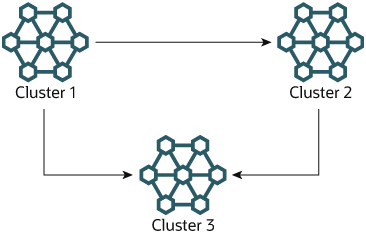

### 25.7.10 NDB Cluster Replication: Bidirectional and Circular Replication

It is possible to use NDB Cluster for bidirectional replication
between two clusters, as well as for circular replication between
any number of clusters.

**Circular replication example.**
In the next few paragraphs we consider the example of a
replication setup involving three NDB Clusters numbered 1, 2,
and 3, in which Cluster 1 acts as the replication source for
Cluster 2, Cluster 2 acts as the source for Cluster 3, and
Cluster 3 acts as the source for Cluster 1. Each cluster has two
SQL nodes, with SQL nodes A and B belonging to Cluster 1, SQL
nodes C and D belonging to Cluster 2, and SQL nodes E and F
belonging to Cluster 3.

Circular replication using these clusters is supported as long as
the following conditions are met:

- The SQL nodes on all sources and replicas are the same.
- All SQL nodes acting as sources and replicas are started with
  the system variable
  [`log_replica_updates`](replication-options-binary-log.md#sysvar_log_replica_updates)
  (beginning with NDB 8.0.26) or
  [`log_slave_updates`](replication-options-binary-log.md#sysvar_log_slave_updates) (NDB 8.0.26
  and earlier) enabled.

This type of circular replication setup is shown in the following
diagram:

**Figure 25.15 NDB Cluster Circular Replication with All Sources As Replicas**


In this scenario, SQL node A in Cluster 1 replicates to SQL node C
in Cluster 2; SQL node C replicates to SQL node E in Cluster 3;
SQL node E replicates to SQL node A. In other words, the
replication line (indicated by the curved arrows in the diagram)
directly connects all SQL nodes used as replication sources and
replicas.

It is also possible to set up circular replication in such a way
that not all source SQL nodes are also replicas, as shown here:

**Figure 25.16 NDB Cluster Circular Replication Where Not All Sources Are Replicas**


In this case, different SQL nodes in each cluster are used as
replication sources and replicas. You must
*not* start any of the SQL nodes with the
system variable
[`log_replica_updates`](replication-options-binary-log.md#sysvar_log_replica_updates) (NDB 8.0.26
and later) or [`log_slave_updates`](replication-options-binary-log.md#sysvar_log_slave_updates)
(prior to NDB 8.0.26) enabled. This type of circular replication
scheme for NDB Cluster, in which the line of replication (again
indicated by the curved arrows in the diagram) is discontinuous,
should be possible, but it should be noted that it has not yet
been thoroughly tested and must therefore still be considered
experimental.

**Using NDB-native backup and restore to initialize a replica cluster.**

When setting up circular replication, it is possible to
initialize the replica cluster by using the management client
[`START BACKUP`](mysql-cluster-backup-using-management-client.md "25.6.8.2 Using The NDB Cluster Management Client to Create a Backup") command on one
NDB Cluster to create a backup and then applying this backup on
another NDB Cluster using [**ndb\_restore**](mysql-cluster-programs-ndb-restore.md "25.5.23 ndb_restore — Restore an NDB Cluster Backup"). This
does not automatically create binary logs on the second NDB
Cluster's SQL node acting as the replica; in order to cause
the binary logs to be created, you must issue a
[`SHOW TABLES`](show-tables.md "15.7.7.39 SHOW TABLES Statement") statement on that SQL
node; this should be done prior to running
[`START REPLICA`](start-replica.md "15.4.2.6 START REPLICA Statement"). This is a known
issue.

**Multi-source failover example.**
In this section, we discuss failover in a multi-source NDB
Cluster replication setup with three NDB Clusters having server
IDs 1, 2, and 3. In this scenario, Cluster 1 replicates to
Clusters 2 and 3; Cluster 2 also replicates to Cluster 3. This
relationship is shown here:

**Figure 25.17 NDB Cluster Multi-Master Replication With 3 Sources**



In other words, data replicates from Cluster 1 to Cluster 3
through 2 different routes: directly, and by way of Cluster 2.

Not all MySQL servers taking part in multi-source replication must
act as both source and replica, and a given NDB Cluster might use
different SQL nodes for different replication channels. Such a
case is shown here:

**Figure 25.18 NDB Cluster Multi-Source Replication, With MySQL Servers**


MySQL servers acting as replicas must be run with the system
variable [`log_replica_updates`](replication-options-binary-log.md#sysvar_log_replica_updates)
(beginning with NDB 8.0.26) or
[`log_slave_updates`](replication-options-binary-log.md#sysvar_log_slave_updates) (NDB 8.0.26 and
earlier) enabled. Which [**mysqld**](mysqld.md "6.3.1 mysqld — The MySQL Server") processes
require this option is also shown in the preceding diagram.

Note

Using the [`log_replica_updates`](replication-options-binary-log.md#sysvar_log_replica_updates)
or [`log_slave_updates`](replication-options-binary-log.md#sysvar_log_slave_updates) system
variable has no effect on servers not being run as replicas.

The need for failover arises when one of the replicating clusters
goes down. In this example, we consider the case where Cluster 1
is lost to service, and so Cluster 3 loses 2 sources of updates
from Cluster 1. Because replication between NDB Clusters is
asynchronous, there is no guarantee that Cluster 3's updates
originating directly from Cluster 1 are more recent than those
received through Cluster 2. You can handle this by ensuring that
Cluster 3 catches up to Cluster 2 with regard to updates from
Cluster 1. In terms of MySQL servers, this means that you need to
replicate any outstanding updates from MySQL server C to server F.

On server C, perform the following queries:

```sql
mysqlC> SELECT @latest:=MAX(epoch)
     ->     FROM mysql.ndb_apply_status
     ->     WHERE server_id=1;

mysqlC> SELECT
     ->     @file:=SUBSTRING_INDEX(File, '/', -1),
     ->     @pos:=Position
     ->     FROM mysql.ndb_binlog_index
     ->     WHERE orig_epoch >= @latest
     ->     AND orig_server_id = 1
     ->     ORDER BY epoch ASC LIMIT 1;
```

Note

You can improve the performance of this query, and thus likely
speed up failover times significantly, by adding the appropriate
index to the `ndb_binlog_index` table. See
[Section 25.7.4, “NDB Cluster Replication Schema and Tables”](mysql-cluster-replication-schema.md "25.7.4 NDB Cluster Replication Schema and Tables"), for more
information.

Copy over the values for *`@file`* and
*`@pos`* manually from server C to server F
(or have your application perform the equivalent). Then, on server
F, execute the following [`CHANGE REPLICATION
SOURCE TO`](change-replication-source-to.md "15.4.2.3 CHANGE REPLICATION SOURCE TO Statement") statement (NDB 8.0.23 and later) or
[`CHANGE MASTER TO`](change-master-to.md "15.4.2.1 CHANGE MASTER TO Statement") statement (prior
to NDB 8.0.23):

```sql
mysqlF> CHANGE MASTER TO
     ->     MASTER_HOST = 'serverC'
     ->     MASTER_LOG_FILE='@file',
     ->     MASTER_LOG_POS=@pos;
```

Beginning with NDB 8.0.23, you can also use the following
statement:

```sql
mysqlF> CHANGE REPLICATION SOURCE TO
     ->     SOURCE_HOST = 'serverC'
     ->     SOURCE_LOG_FILE='@file',
     ->     SOURCE_LOG_POS=@pos;
```

Once this has been done, you can issue a
[`START REPLICA`](start-replica.md "15.4.2.6 START REPLICA Statement") statement on MySQL
server F; this causes any missing updates originating from server
B to be replicated to server F.

The [`CHANGE REPLICATION SOURCE TO`](change-replication-source-to.md "15.4.2.3 CHANGE REPLICATION SOURCE TO Statement") |
[`CHANGE MASTER TO`](change-master-to.md "15.4.2.1 CHANGE MASTER TO Statement") statement also
supports an `IGNORE_SERVER_IDS` option which
takes a comma-separated list of server IDs and causes events
originating from the corresponding servers to be ignored. For more
information, see [Section 15.4.2.1, “CHANGE MASTER TO Statement”](change-master-to.md "15.4.2.1 CHANGE MASTER TO Statement"), and
[Section 15.7.7.36, “SHOW SLAVE | REPLICA STATUS Statement”](show-slave-status.md "15.7.7.36 SHOW SLAVE | REPLICA STATUS Statement"). For information about how
this option interacts with the
[`ndb_log_apply_status`](mysql-cluster-options-variables.md#sysvar_ndb_log_apply_status) variable,
see [Section 25.7.8, “Implementing Failover with NDB Cluster Replication”](mysql-cluster-replication-failover.md "25.7.8 Implementing Failover with NDB Cluster Replication").
