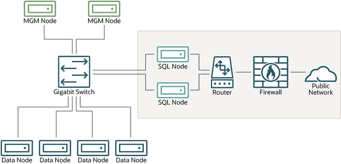
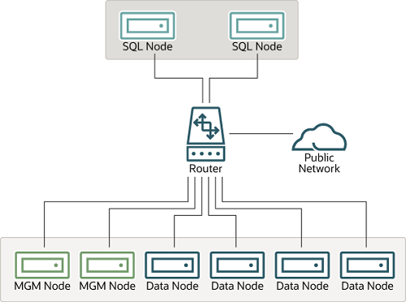
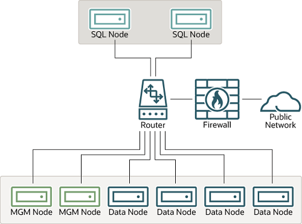

#### 25.6.20.1 NDB Cluster Security and Networking Issues

In this section, we discuss basic network security issues as
they relate to NDB Cluster. It is extremely important to
remember that NDB Cluster “out of the box” is not
secure; you or your network administrator must take the proper
steps to ensure that your cluster cannot be compromised over the
network.

Cluster communication protocols are inherently insecure, and no
encryption or similar security measures are used in
communications between nodes in the cluster. Because network
speed and latency have a direct impact on the cluster's
efficiency, it is also not advisable to employ SSL or other
encryption to network connections between nodes, as such schemes
cause slow communications.

It is also true that no authentication is used for controlling
API node access to an NDB Cluster. As with encryption, the
overhead of imposing authentication requirements would have an
adverse impact on Cluster performance.

In addition, there is no checking of the source IP address for
either of the following when accessing the cluster:

- SQL or API nodes using “free slots” created by
  empty `[mysqld]` or
  `[api]` sections in the
  `config.ini` file

  This means that, if there are any empty
  `[mysqld]` or `[api]`
  sections in the `config.ini` file, then
  any API nodes (including SQL nodes) that know the management
  server's host name (or IP address) and port can connect
  to the cluster and access its data without restriction. (See
  [Section 25.6.20.2, “NDB Cluster and MySQL Privileges”](mysql-cluster-security-mysql-privileges.md "25.6.20.2 NDB Cluster and MySQL Privileges"),
  for more information about this and related issues.)

  Note

  You can exercise some control over SQL and API node access
  to the cluster by specifying a `HostName`
  parameter for all `[mysqld]` and
  `[api]` sections in the
  `config.ini` file. However, this also
  means that, should you wish to connect an API node to the
  cluster from a previously unused host, you need to add an
  `[api]` section containing its host name
  to the `config.ini` file.

  More information is available
  [elsewhere in this
  chapter](mysql-cluster-api-definition.md#ndbparam-api-hostname) about the `HostName`
  parameter. Also see [Section 25.4.1, “Quick Test Setup of NDB Cluster”](mysql-cluster-quick.md "25.4.1 Quick Test Setup of NDB Cluster"),
  for configuration examples using
  `HostName` with API nodes.
- Any [**ndb\_mgm**](mysql-cluster-programs-ndb-mgm.md "25.5.5 ndb_mgm — The NDB Cluster Management Client") client

  This means that any cluster management client that is given
  the management server's host name (or IP address) and
  port (if not the standard port) can connect to the cluster
  and execute any management client command. This includes
  commands such as [`ALL
  STOP`](mysql-cluster-mgm-client-commands.md#ndbclient-stop) and
  [`SHUTDOWN`](mysql-cluster-mgm-client-commands.md#ndbclient-shutdown).

For these reasons, it is necessary to protect the cluster on the
network level. The safest network configuration for Cluster is
one which isolates connections between Cluster nodes from any
other network communications. This can be accomplished by any of
the following methods:

1. Keeping Cluster nodes on a network that is physically
   separate from any public networks. This option is the most
   dependable; however, it is the most expensive to implement.

   We show an example of an NDB Cluster setup using such a
   physically segregated network here:

   **Figure 25.7 NDB Cluster with Hardware Firewall**

   

   This setup has two networks, one private (solid box) for the
   Cluster management servers and data nodes, and one public
   (dotted box) where the SQL nodes reside. (We show the
   management and data nodes connected using a gigabit switch
   since this provides the best performance.) Both networks are
   protected from the outside by a hardware firewall, sometimes
   also known as a network-based
   firewall.

   This network setup is safest because no packets can reach
   the cluster's management or data nodes from outside the
   network—and none of the cluster's internal
   communications can reach the outside—without going
   through the SQL nodes, as long as the SQL nodes do not
   permit any packets to be forwarded. This means, of course,
   that all SQL nodes must be secured against hacking attempts.

   Important

   With regard to potential security vulnerabilities, an SQL
   node is no different from any other MySQL server. See
   [Section 8.1.3, “Making MySQL Secure Against Attackers”](security-against-attack.md "8.1.3 Making MySQL Secure Against Attackers"), for a
   description of techniques you can use to secure MySQL
   servers.
2. Using one or more software firewalls (also known as
   host-based firewalls)
   to control which packets pass through to the cluster from
   portions of the network that do not require access to it. In
   this type of setup, a software firewall must be installed on
   every host in the cluster which might otherwise be
   accessible from outside the local network.

   The host-based option is the least expensive to implement,
   but relies purely on software to provide protection and so
   is the most difficult to keep secure.

   This type of network setup for NDB Cluster is illustrated
   here:

   **Figure 25.8 NDB Cluster with Software Firewalls**

   

   Using this type of network setup means that there are two
   zones of NDB Cluster hosts. Each cluster host must be able
   to communicate with all of the other machines in the
   cluster, but only those hosting SQL nodes (dotted box) can
   be permitted to have any contact with the outside, while
   those in the zone containing the data nodes and management
   nodes (solid box) must be isolated from any machines that
   are not part of the cluster. Applications using the cluster
   and user of those applications must *not*
   be permitted to have direct access to the management and
   data node hosts.

   To accomplish this, you must set up software firewalls that
   limit the traffic to the type or types shown in the
   following table, according to the type of node that is
   running on each cluster host computer:

   **Table 25.68 Node types in a host-based firewall cluster configuration**

   | Node Type | Permitted Traffic |
   | --- | --- |
   | SQL or API node | - It originates from the IP address of a   management or data node (using any TCP or UDP   port). - It originates from within the network in which   the cluster resides and is on the port that your   application is using. |
   | Data node or Management node | - It originates from the IP address of a   management or data node (using any TCP or UDP   port). - It originates from the IP address of an SQL or   API node. |

   Any traffic other than that shown in the table for a given
   node type should be denied.

   The specifics of configuring a firewall vary from firewall
   application to firewall application, and are beyond the
   scope of this Manual. **iptables** is a very
   common and reliable firewall application, which is often
   used with **APF** as a front end to make
   configuration easier. You can (and should) consult the
   documentation for the software firewall that you employ,
   should you choose to implement an NDB Cluster network setup
   of this type, or of a “mixed” type as discussed
   under the next item.
3. It is also possible to employ a combination of the first two
   methods, using both hardware and software to secure the
   cluster—that is, using both network-based and
   host-based firewalls. This is between the first two schemes
   in terms of both security level and cost. This type of
   network setup keeps the cluster behind the hardware
   firewall, but permits incoming packets to travel beyond the
   router connecting all cluster hosts to reach the SQL nodes.

   One possible network deployment of an NDB Cluster using
   hardware and software firewalls in combination is shown
   here:

   **Figure 25.9 NDB Cluster with a Combination of Hardware and Software Firewalls**

   

   In this case, you can set the rules in the hardware firewall
   to deny any external traffic except to SQL nodes and API
   nodes, and then permit traffic to them only on the ports
   required by your application.

Whatever network configuration you use, remember that your
objective from the viewpoint of keeping the cluster secure
remains the same—to prevent any unessential traffic from
reaching the cluster while ensuring the most efficient
communication between the nodes in the cluster.

Because NDB Cluster requires large numbers of ports to be open
for communications between nodes, the recommended option is to
use a segregated network. This represents the simplest way to
prevent unwanted traffic from reaching the cluster.

Note

If you wish to administer an NDB Cluster remotely (that is,
from outside the local network), the recommended way to do
this is to use **ssh** or another secure login
shell to access an SQL node host. From this host, you can then
run the management client to access the management server
safely, from within the cluster's own local network.

Even though it is possible to do so in theory, it is
*not* recommended to use
[**ndb\_mgm**](mysql-cluster-programs-ndb-mgm.md "25.5.5 ndb_mgm — The NDB Cluster Management Client") to manage a Cluster directly from
outside the local network on which the Cluster is running.
Since neither authentication nor encryption takes place
between the management client and the management server, this
represents an extremely insecure means of managing the
cluster, and is almost certain to be compromised sooner or
later.
