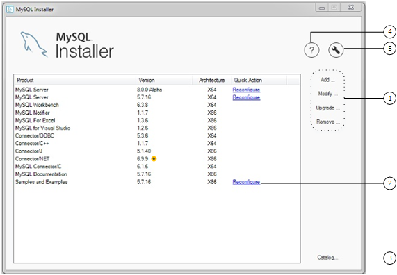
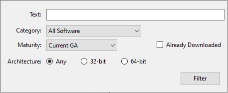

#### 2.3.3.4 MySQL Installer Product Catalog and Dashboard

This section describes the MySQL Installer product catalog, the dashboard,
and other actions related to product selection and upgrades.

- [Product Catalog](mysql-installer-catalog-dashboard.md#windows-product-catalog "Product Catalog")
- [MySQL Installer Dashboard](mysql-installer-catalog-dashboard.md#windows-product-dashboard "MySQL Installer Dashboard")
- [Locating Products to Install](mysql-installer-catalog-dashboard.md#locate-products "Locating Products to Install")
- [Upgrading MySQL Server](mysql-installer-catalog-dashboard.md#mysql-installer-upgrade-server "Upgrading MySQL Server")
- [Removing MySQL Server](mysql-installer-catalog-dashboard.md#mysql-installer-remove-server "Removing MySQL Server")
- [Upgrading MySQL Installer](mysql-installer-catalog-dashboard.md#upgrade-mysql-installer "Upgrading MySQL Installer")

##### Product Catalog

The product catalog stores the complete list of released MySQL
products for Microsoft Windows that are available to download
from [MySQL Downloads](https://dev.mysql.com/downloads/).
By default, and when an Internet connection is present, MySQL Installer
attempts to update the catalog at startup every seven days. You
can also update the catalog manually from the dashboard
(described later).

An up-to-date catalog performs the following actions:

- Populates the Available Products pane
  of the Select Products page. This step appears when you
  select:

  - The `Custom` setup type during the
    [initial
    setup](mysql-installer-setup.md "2.3.3.1 MySQL Installer Initial Setup").
  - The Add operation from the
    dashboard.
- Identifies when product updates are available for the
  installed products listed in the dashboard.

The catalog includes all development releases (Pre-Release),
general releases (Current GA), and minor releases (Other
Releases). Products in the catalog will vary somewhat, depending
on the MySQL Installer release that you download.

##### MySQL Installer Dashboard

The MySQL Installer dashboard is the default view that you see when you
start MySQL Installer after the
[initial setup](mysql-installer-setup.md "2.3.3.1 MySQL Installer Initial Setup")
finishes. If you closed MySQL Installer before the setup was finished, MySQL Installer
resumes the initial setup before it displays the dashboard.

Note

Products covered under Oracle Lifetime Sustaining Support, if
installed, may appear in the dashboard. These products, such
as MySQL for Excel and MySQL Notifier, can be modified or removed only.

**Figure 2.11 MySQL Installer Dashboard Elements**



###### Description of MySQL Installer Dashboard Elements

1. MySQL Installer dashboard operations provide a variety of actions that
   apply to installed products or products listed in the
   catalog. To initiate the following operations, first click
   the operation link and then select the product or products
   to manage:

   - Add: This operation opens the
     Select Products page. From there you can adjust the
     filter, select one or more products to download (as
     needed), and begin the installation. For hints about
     using the filter, see [Locating Products to Install](mysql-installer-catalog-dashboard.md#locate-products "Locating Products to Install").

     Use the directional arrows to move each product from the
     Available Products column to the
     Products To Be Installed column. To
     enable the Product Features page where you can customize
     features, click the related check box (disabled by
     default).
   - Modify: Use this operation to add
     or remove the features associated with installed
     products. Features that you can modify vary in
     complexity by product. When the Program
     Shortcut check box is selected, the product
     appears in the Start menu under the
     `MySQL` group.
   - Upgrade: This operation loads the
     Select Products to Upgrade page and populates it with
     all the upgrade candidates. An installed product can
     have more than one upgrade version and the operation
     requires a current product catalog. MySQL Installer upgrades all of
     the selected products in one action. Click
     Show Details to view the actions
     performed by MySQL Installer.
   - Remove: This operation opens the
     Remove Products page and populates it with the MySQL
     products installed on the host. Select the MySQL
     products you want to remove (uninstall) and then click
     Execute to begin the removal
     process. During the operation, an indicator shows the
     number of steps that are executed as a percentage of all
     steps.

     To select products to remove, do one of the following:

     - Select the check box for one or more products.
     - Select the Product check box to
       select all products.
2. The Reconfigure link in the Quick
   Action column next to each installed server loads the
   current configuration values for the server and then cycles
   through all configuration steps enabling you to change the
   options and values. You must provide credentials with root
   privileges to reconfigure these items. Click the
   Log tab to show the output of each
   configuration step performed by MySQL Installer.

   On completion, MySQL Installer stops the server, applies the
   configuration changes, and restarts the server for you. For
   a description of each configuration option, see
   [Section 2.3.3.3.1, “MySQL Server Configuration with MySQL Installer”](mysql-installer-workflow.md#mysql-installer-workflow-server "2.3.3.3.1 MySQL Server Configuration with MySQL Installer"). Installed
   `Samples and Examples` associated with a
   specific MySQL server version can be also be reconfigured to
   apply new feature settings, if any.
3. The Catalog link enables you to
   download the latest catalog of MySQL products manually and
   then to integrate those product changes with MySQL Installer. The
   catalog-download action does not perform an upgrade of the
   products already installed on the host. Instead, it returns
   to the dashboard and adds an arrow icon to the Version
   column for each installed product that has a newer version.
   Use the Upgrade operation to install
   the newer product version.

   You can also use the Catalog link to
   display the current change history of each product without
   downloading the new catalog. Select the Do not
   update at this time check box to view the change
   history only.
4. The MySQL Installer About icon () shows the current version of MySQL Installer and
   general information about MySQL. The version number is
   located above the Back button.

   Tip

   Always include this version number when reporting a
   problem with MySQL Installer.

   In addition to the About MySQL information
   (), you can also select the following
   icons from the side panel:

   - License icon () for MySQL Installer.

     This product may include third-party software, used
     under license. If you are using a Commercial release of
     MySQL Installer, the icon opens the MySQL Installer Commercial License Information User Manual for
     licensing information, including licensing information
     relating to third-party software that may be included in
     this Commercial release. If you are using a Community
     release of MySQL Installer, the icon opens the MySQL Installer Community
     License Information User Manual for licensing information, including licensing
     information relating to third-party software that may be
     included in this Community release.
   - Resource links icon () to the latest MySQL product
     documentation, blogs, webinars, and more.
5. The MySQL Installer Options icon () includes the following tabs:

   - General: Enables or disables the
     Offline mode option. If selected, this option configures
     MySQL Installer to run without depending on internet-connection
     capabilities. When running MySQL Installer in offline mode, you see
     a warning together with a Disable
     quick action on the dashboard. The warning serves to
     remind you that running MySQL Installer in offline mode prevents
     you from downloading the latest MySQL products and
     product catalog updates. Offline mode persists until you
     disable the option.

     At startup, MySQL Installer determines whether an internet
     connection is present, and, if not, prompts you to
     enable offline mode to resume working without a
     connection.
   - Product Catalog: Manages the
     automatic catalog updates. By default, MySQL Installer checks for
     catalog updates at startup every seven days. When new
     products or product versions are available, MySQL Installer adds
     them to the catalog and then inserts an arrow icon
     () next to the version number of
     installed products listed in the dashboard.

     Use the product catalog option to enable or disable
     automatic updates and to reset the number of days
     between automatic catalog downloads. At startup, MySQL Installer
     uses the number of days you set to determine whether a
     download should be attempted. This action is repeated
     during next startup if MySQL Installer encounters an error
     downloading the catalog.
   - Connectivity Settings: Several
     operations performed by MySQL Installer require internet access.
     This option enables you to use a default value to
     validate the connection or to use a different URL, one
     selected from a list or added by you manually. With the
     Manual option selected, new URLs
     can be added and all URLs in the list can be moved or
     deleted. When the Automatic option
     is selected, MySQL Installer attempts to connect to each default
     URL in the list (in order) until a connection is made.
     If no connection can be made, it raises an error.
   - Proxy: MySQL Installer provides multiple proxy
     modes that enable you to download MySQL products,
     updates, or even the product catalog in most network
     environments. The mode are:

     - No proxy

       Select this mode to prevent MySQL Installer from looking for
       system settings. This mode disables any proxy
       settings.
     - Automatic

       Select this mode to have MySQL Installer look for system
       settings and to use those settings if found, or to
       use no proxy if nothing is found. This mode is the
       default.
     - Manual

       Select this mode to have MySQL Installer use your
       authentication details to configuration proxy access
       to the internet. Specifically:

       - A proxy-server address
         (`http://`*`address-to-server`*)
         and port number
       - A user name and password for authentication

##### Locating Products to Install

MySQL products in the catalog are listed by category: MySQL
Servers, Applications, MySQL Connectors, and Documentation. Only
the latest GA versions appear in the Available
Products pane by default. If you are looking for a
pre-release or older version of a product, it may not be visible
in the default list.

Note

Keep the product catalog up-to-date. Click
Catalog on the MySQL Installer dashboard to download
the latest manifest.

To change the default product list, click
Add in the dashboard to open the Select
Products page, and then click Edit to
open the dialog box shown in the figure that follows. Modify the
settings and then click Filter.

**Figure 2.12 Filter Available Products**



Reset one or more of the following fields to modify the list of
available products:

- Text: Filter by text.
- Category: All Software (default), MySQL Servers,
  Applications, MySQL Connectors, or Documentation (for
  samples and documentation).
- Maturity: Current Bundle (appears initially with the full
  package only), Pre-Release, Current GA, or Other Releases.
  If you see a warning, confirm that you have the most recent
  product manifest by clicking Catalog on
  the MySQL Installer dashboard. If MySQL Installer is unable to download the
  manifest, the range of products you see is limited to
  bundled products, standalone product MSIs located in the
  `Product Cache` folder already, or both.

  Note

  The Commercial release of MySQL Installer does not display any MySQL
  products when you select the Pre-Release maturity filter.
  Products in development are available from the Community
  release of MySQL Installer only.
- Already Downloaded (the check box is deselected by default).
  Permits you to view and manage downloaded products only.
- Architecture: Any (default), 32-bit, or 64-bit.

##### Upgrading MySQL Server

Important server upgrade conditions:

- MySQL Installer does not permit server upgrades between major release
  versions or minor release versions, but does permit upgrades
  within a release series, such as an upgrade from 8.0.36 to
  8.0.37.
- Upgrades between milestone releases (or from a milestone
  release to a GA release) are not supported. Significant
  development changes take place in milestone releases and you
  may encounter compatibility issues or problems starting the
  server.
- For upgrades, a check box enables you to skip the upgrade
  check and process for system tables, while checking and
  processing data dictionary tables normally. MySQL Installer does not
  prompt you with the check box when the previous server
  upgrade was skipped or when the server was configured as a
  sandbox InnoDB Cluster. This behavior represents a change
  in how MySQL Server performs an upgrade (see
  [Section 3.4, “What the MySQL Upgrade Process Upgrades”](upgrading-what-is-upgraded.md "3.4 What the MySQL Upgrade Process Upgrades")) and it alters
  the sequence of steps that MySQL Installer applies to the configuration
  process.

  If you select Skip system tables upgrade check and
  process. (Not recommended), MySQL Installer starts the
  upgraded server with the
  [`--upgrade=MINIMAL`](server-options.md#option_mysqld_upgrade) server
  option, which upgrades the data dictionary only. If you stop
  and then restart the server without the
  [`--upgrade=MINIMAL`](server-options.md#option_mysqld_upgrade) option, the
  server upgrades the system tables automatically, if needed.

  The following information appears in the
  Log tab and log file after the upgrade
  configuration (with system tables skipped) is complete:

  ```none
  WARNING: The system tables upgrade was skipped after upgrading MySQL Server. The
  server will be started now with the --upgrade=MINIMAL option, but then each
  time the server is started it will attempt to upgrade the system tables, unless
  you modify the Windows service (command line) to add --upgrade=MINIMAL to bypass
  the upgrade.

  FOR THE BEST RESULTS: Run mysqld.exe --upgrade=FORCE on the command line to upgrade
  the system tables manually.
  ```

To choose a new server version:

1. Click Upgrade. Confirm that the check
   box next to product name in the Upgradeable
   Products pane has a check mark. Deselect the
   products that you do not intend to upgrade at this time.

   Note

   For server milestone releases in the same release series,
   MySQL Installer deselects the server upgrade and displays a warning
   to indicate that the upgrade is not supported, identifies
   the risks of continuing, and provides a summary of the
   steps to perform a logical upgrade manually. You can
   reselect server upgrade at your own risk. For instructions
   on how to perform a logical upgrade with a milestone
   release, see [Logical Upgrade](upgrade-binary-package.md#upgrade-procedure-logical "Logical Upgrade").
2. Click a product in the list to highlight it. This action
   populates the Upgradeable Versions pane
   with the details of each available version for the selected
   product: version number, published date, and a
   `Changes` link to open the release notes
   for that version.

##### Removing MySQL Server

To remove a local MySQL server:

1. Determine whether the local data directory should be
   removed. If you retain the data directory, another server
   installation can reuse the data. This option is enabled by
   default (removes the data directory).
2. Click Execute to begin uninstalling
   the local server. Note that all products that you selected
   to remove are also uninstalled at this time.
3. (Optional) Click the Log tab to display
   the current actions performed by MySQL Installer.

##### Upgrading MySQL Installer

MySQL Installer remains installed on your computer, and like other
software, MySQL Installer can be upgraded from the previous version. In
some cases, other MySQL software may require that you upgrade
MySQL Installer for compatibility. This section describes how to identify
the current version of MySQL Installer and how to upgrade MySQL Installer manually.

**To locate the installed version of
MySQL Installer:**

1. Start MySQL Installer from the search menu. The MySQL Installer dashboard opens.
2. Click the MySQL Installer About icon (). The version number is located above
   the Back button.

**To initiate an on-demand upgrade of
MySQL Installer:**

1. Connect the computer with MySQL Installer installed to the internet.
2. Start MySQL Installer from the search menu. The MySQL Installer dashboard opens.
3. Click Catalog on the bottom of the
   dashboard to open the Update Catalog window.
4. Click Execute to begin the process.
   If the installed version of MySQL Installer can be upgraded, you will
   be prompted to start the upgrade.
5. Click Next to review all changes to
   the catalog and then click Finish to
   return to the dashboard.
6. Verify the (new) installed version of MySQL Installer (see the previous
   procedure).
