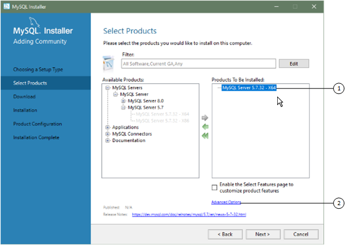

#### 2.3.3.2 Setting Alternative Server Paths with MySQL Installer

You can change the default installation path, the data path, or
both when you install MySQL server. After you have installed the
server, the paths cannot be altered without removing and
reinstalling the server instance.

Note

Starting with MySQL Installer 1.4.39, if you move the data directory of
an installed server manually, MySQL Installer identifies the change and
can process a reconfiguration operation without errors.

**To change paths for MySQL
server**

1. Identify the MySQL server to change and enable the
   Advanced Options link as follows:

   1. Navigate to the Select Products page
      by doing one of the following:

      1. If this is an
         [initial
         setup](mysql-installer-setup.md "2.3.3.1 MySQL Installer Initial Setup") of MySQL Installer, select the
         `Custom` setup type and click
         Next.
      2. If MySQL Installer is installed on your computer, click
         Add from the dashboard.
   2. Click Edit to apply a filter on the
      product list shown in Available
      Products (see
      [Locating Products to Install](mysql-installer-catalog-dashboard.md#locate-products "Locating Products to Install")).
   3. With the server instance selected, use the arrow to move
      the selected server to the Products To Be
      Installed list.
   4. Click the server to select it. When you select the server,
      the Advanced Options link is enabled
      below the list of products to be installed (see the
      following figure).
2. Click Advanced Options to open a dialog
   box where you can enter alternative path names. After the path
   names are validated, click Next to
   continue with the configuration steps.

   **Figure 2.9 Change MySQL Server Path**

   
