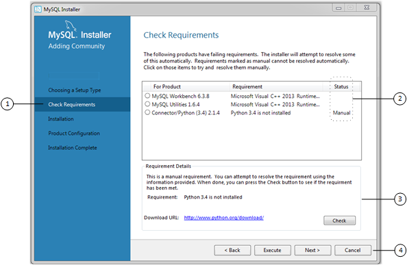

#### 2.3.3.1 MySQL Installer Initial Setup

- [Choosing a Setup Type](mysql-installer-setup.md#setup-type "Choosing a Setup Type")
- [Path Conflicts](mysql-installer-setup.md#setup-conflicts "Path Conflicts")
- [Check Requirements](mysql-installer-setup.md#setup-requirements "Check Requirements")
- [MySQL Installer Configuration Files](mysql-installer-setup.md#setup-layout "MySQL Installer Configuration Files")

When you download MySQL Installer for the first time, a setup wizard guides
you through the initial installation of MySQL products. As the
following figure shows, the initial setup is a one-time activity
in the overall process. MySQL Installer detects existing MySQL products
installed on the host during its initial setup and adds them to
the list of products to be managed.

**Figure 2.7 MySQL Installer Process Overview**

MySQL Installer extracts configuration files (described later) to the hard
drive of the host during the initial setup. Although MySQL Installer is a
32-bit application, it can install both 32-bit and 64-bit
binaries.

The initial setup adds a link to the Start menu under the
MySQL folder group. Click
Start, MySQL, and
MySQL Installer - [Community |
Commercial] to open the community or commercial
release of the graphical tool.

##### Choosing a Setup Type

During the initial setup, you are prompted to select the MySQL
products to be installed on the host. One alternative is to use
a predetermined setup type that matches your setup requirements.
By default, both GA and pre-release products are included in the
download and installation with the Client
only and Full setup types.
Select the Only install GA products option
to restrict the product set to include GA products only when
using these setup types.

Note

Commercial-only MySQL products, such as MySQL Enterprise Backup, are available
to select and install if you are using the Commercial version
of MySQL Installer (see
[MySQL Installer Commercial Release](mysql-installer.md#mysql-installer-commercial-edition "MySQL Installer Commercial Release")).

Choosing one of the following setup types determines the initial
installation only and does not limit your ability to install or
update MySQL products for Windows later:

- **Server only**: Only install
  the MySQL server. This setup type installs the general
  availability (GA) or development release server that you
  selected when you downloaded MySQL Installer. It uses the default
  installation and data paths.
- **Client only**: Only install
  the most recent MySQL applications (such as MySQL Shell,
  MySQL Router, and MySQL Workbench). This setup type excludes MySQL
  server or the client programs typically bundled with the
  server, such as [**mysql**](mysql.md "6.5.1 mysql — The MySQL Command-Line Client") or
  [**mysqladmin**](mysqladmin.md "6.5.2 mysqladmin — A MySQL Server Administration Program").
- **Full**: Install all available
  MySQL products, excluding MySQL connectors.
- **Custom**: The custom setup
  type enables you to filter and select individual MySQL
  products from the
  [MySQL Installer catalog](mysql-installer-catalog-dashboard.md#windows-product-catalog "Product Catalog").

  Use the `Custom` setup type to install:

  - A product or product version that is not available from
    the usual download locations. The catalog contains all
    product releases, including the other releases between
    pre-release (or development) and GA.
  - An instance of MySQL server using an alternative
    installation path, data path, or both. For instructions
    on how to adjust the paths, see
    [Section 2.3.3.2, “Setting Alternative Server Paths with MySQL Installer”](mysql-installer-change-path-proc.md "2.3.3.2 Setting Alternative Server Paths with MySQL Installer").
  - Two or more MySQL server versions on the same host at
    the same time (for example, 5.7 and 8.0).
  - A specific combination of products and features not
    offered as a predetermine setup type. For example, you
    can install a single product, such as MySQL Workbench,
    instead of installing all client applications for
    Windows.

##### Path Conflicts

When the default installation or data folder (required by MySQL
server) for a product to be installed already exists on the
host, the wizard displays the Path Conflict
step to identify each conflict and enable you to take action to
avoid having files in the existing folder overwritten by the new
installation. You see this step in the initial setup only when
MySQL Installer detects a conflict.

To resolve the path conflict, do one of the following:

- Select a product from the list to display the conflict
  options. A warning symbol indicates which path is in
  conflict. Use the browse button to choose a new path and
  then click Next.
- Click Back to choose a different
  setup type or product version, if applicable. The
  `Custom` setup type enables you to select
  individual product versions.
- Click Next to ignore the conflict and
  overwrite files in the existing folder.
- Delete the existing product. Click
  Cancel to stop the initial setup and
  close MySQL Installer. Open MySQL Installer again from the Start menu and delete
  the installed product from the host using the Delete
  operation from the
  [MySQL Installer
  dashboard](mysql-installer-catalog-dashboard.md#windows-product-dashboard "MySQL Installer Dashboard").

##### Check Requirements

MySQL Installer uses entries in the `package-rules.xml`
file to determine whether the prerequisite software for each
product is installed on the host. When the requirements check
fails, MySQL Installer displays the Check Requirements
step to help you update the host. Requirements are evaluated
each time you download a new product (or version) for
installation. The following figure identifies and describes the
key areas of this step.

**Figure 2.8 Check Requirements**

###### Description of Check Requirements Elements

1. Shows the current step in the initial setup. Steps in this
   list may change slightly depending on the products already
   installed on the host, the availability of prerequisite
   software, and the products to be installed on the host.
2. Lists all pending installation requirements by product and
   indicates the status as follows:

   - A blank space in the Status column
     means that MySQL Installer can attempt to download and install the
     required software for you.
   - The word *Manual* in the
     Status column means that you must
     satisfy the requirement manually. Select each product in
     the list to see its requirement details.
3. Describes the requirement in detail to assist you with each
   manual resolution. When possible, a download URL is
   provided. After you download and install the required
   software, click Check to verify that
   the requirement has been met.
4. Provides the following set operations to proceed:

   - Back – Return to the
     previous step. This action enables you to select a
     different the setup type.
   - Execute – Have MySQL Installer attempt
     to download and install the required software for all
     items without a manual status. Manual requirements are
     resolved by you and verified by clicking
     Check.
   - Next – Do not execute the
     request to apply the requirements automatically and
     proceed to the installation without including the
     products that fail the check requirements step.
   - Cancel – Stop the
     installation of MySQL products. Because MySQL Installer is already
     installed, the initial setup begins again when you open
     MySQL Installer from the Start menu and click
     Add from the dashboard. For a
     description of the available management operations, see
     [Product Catalog](mysql-installer-catalog-dashboard.md#windows-product-catalog "Product Catalog").

##### MySQL Installer Configuration Files

All MySQL Installer files are located within the `C:\Program Files
(x86)` and `C:\ProgramData`
folders. The following table describes the files and folders
that define MySQL Installer as a standalone application.

Note

Installed MySQL products are neither altered nor removed when
you update or uninstall MySQL Installer.

**Table 2.5 MySQL Installer Configuration Files**

| File or Folder | Description | Folder Hierarchy |
| --- | --- | --- |
| `MySQL Installer for Windows` | This folder contains all of the files needed to run MySQL Installer and [**MySQLInstallerConsole.exe**](MySQLInstallerConsole.md "2.3.3.5 MySQL Installer Console Reference"), a command-line program with similar functionality. | `C:\Program Files (x86)` |
| `Templates` | The `Templates` folder has one file for each version of MySQL server. Template files contain keys and formulas to calculate some values dynamically. | `C:\ProgramData\MySQL\MySQL Installer for Windows\Manifest` |
| `package-rules.xml` | This file contains the prerequisites for every product to be installed. | `C:\ProgramData\MySQL\MySQL Installer for Windows\Manifest` |
| `products.xml` | The `products` file (or product catalog) contains a list of all products available for download. | `C:\ProgramData\MySQL\MySQL Installer for Windows\Manifest` |
| `Product Cache` | The `Product Cache` folder contains all standalone `.msi` files bundled with the full package or downloaded afterward. | `C:\ProgramData\MySQL\MySQL Installer for Windows` |
