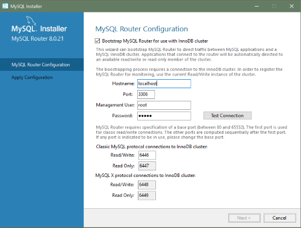

#### 2.3.3.3 Installation Workflows with MySQL Installer

MySQL Installer provides a wizard-like tool to install and configure new
MySQL products for Windows. Unlike the initial setup, which runs
only once, MySQL Installer invokes the wizard each time you download or
install a new product. For first-time installations, the steps of
the initial setup proceed directly into the steps of the
installation. For assistance with product selection, see
[Locating Products to Install](mysql-installer-catalog-dashboard.md#locate-products "Locating Products to Install").

Note

Full permissions are granted to the user executing MySQL Installer to all
generated files, such as `my.ini`. This does
not apply to files and directories for specific products, such
as the MySQL server data directory in
`%ProgramData%` that is owned by
`SYSTEM`.

Products installed and configured on a host follow a general
pattern that might require your input during the various steps. If
you attempt to install a product that is incompatible with the
existing MySQL server version (or a version selected for upgrade),
you are alerted about the possible mismatch.

MySQL Installer provides the following sequence of actions that apply to
different workflows:

- **Select Products.**
  If you selected the `Custom` setup type
  during the initial setup or clicked Add
  from the [MySQL Installer
  dashboard](mysql-installer-catalog-dashboard.md#windows-product-dashboard "MySQL Installer Dashboard"), MySQL Installer includes this action in the sidebar.
  From this page, you can apply a filter to modify the
  Available Products list and then select one or more products
  to move (using arrow keys) to the Products To Be Installed
  list.

  Select the check box on this page to activate the Select
  Features action where you can customize the products features
  after the product is downloaded.
- **Download.**
  If you installed the full (not web) MySQL Installer package, all
  `.msi` files were loaded to the
  `Product Cache` folder during the initial
  setup and are not downloaded again. Otherwise, click
  Execute to begin the download. The
  status of each product changes from `Ready to
  Download`, to `Downloading`, and
  then to `Downloaded`.

  To retry a single unsuccessful download, click the
  Try Again link.

  To retry all unsuccessful downloads, click Try
  All.
- **Select Features To Install (disabled by default).**
  After MySQL Installer downloads a product's `.msi`
  file, you can customize the features if you enabled the
  optional check box previously during the Select Products
  action.

  To customize product features after the installation, click
  Modify in the
  [MySQL Installer
  dashboard](mysql-installer-catalog-dashboard.md#windows-product-dashboard "MySQL Installer Dashboard").
- **Installation.**
  The status of each product in the list changes from
  `Ready to Install`, to
  `Installing`, and lastly to
  `Complete`. During the process, click
  Show Details to view the installation
  actions.

  If you cancel the installation at this point, the products are
  installed, but the server (if installed) is not yet
  configured. To restart the server configuration, open MySQL Installer
  from the Start menu and click Reconfigure
  next to the appropriate server in the dashboard.
- **Product configuration.**
  This step applies to MySQL Server, MySQL Router, and samples
  only. The status for each item in the list should indicate
  `Ready to Configure`. Click
  Next to start the configuration
  wizard for all items in the list. The configuration options
  presented during this step are specific to the version of
  database or router that you selected to install.

  Click Execute to begin applying the
  configuration options or click Back
  (repeatedly) to return to each configuration page.
- **Installation complete.**
  This step finalizes the installation for products that do
  not require configuration. It enables you to copy the log to
  a clipboard and to start certain applications, such as
  MySQL Workbench and MySQL Shell. Click
  Finish to open the
  [MySQL Installer
  dashboard](mysql-installer-catalog-dashboard.md#windows-product-dashboard "MySQL Installer Dashboard").

##### 2.3.3.3.1 MySQL Server Configuration with MySQL Installer

MySQL Installer performs the initial configuration of the MySQL server. For
example:

- It creates the configuration file
  (`my.ini`) that is used to configure the
  MySQL server. The values written to this file are influenced
  by choices you make during the installation process. Some
  definitions are host dependent.
- By default, a Windows service for the MySQL server is added.
- Provides default installation and data paths for MySQL
  server. For instructions on how to change the default paths,
  see [Section 2.3.3.2, “Setting Alternative Server Paths with MySQL Installer”](mysql-installer-change-path-proc.md "2.3.3.2 Setting Alternative Server Paths with MySQL Installer").
- It can optionally create MySQL server user accounts with
  configurable permissions based on general roles, such as DB
  Administrator, DB Designer, and Backup Admin. It optionally
  creates a Windows user named `MysqlSys`
  with limited privileges, which would then run the MySQL
  Server.

  User accounts may also be added and configured in
  MySQL Workbench.
- Checking Show Advanced Options enables
  additional Logging Options to be set.
  This includes defining custom file paths for the error log,
  general log, slow query log (including the configuration of
  seconds it requires to execute a query), and the binary log.

During the configuration process, click
Next to proceed to the next step or
Back to return to the previous step.
Click Execute at the final step to apply
the server configuration.

The sections that follow describe the server configuration
options that apply to MySQL server on Windows. The server
version you installed will determine which steps and options you
can configure. Configuring MySQL server may include some or all
of the steps.

###### 2.3.3.3.1.1 Type and Networking

- Server Configuration Type

  Choose the MySQL server configuration type that describes
  your setup. This setting defines the amount of system
  resources (memory) to assign to your MySQL server
  instance.

  - **Development**: A
    computer that hosts many other applications, and
    typically this is your personal workstation. This
    setting configures MySQL to use the least amount of
    memory.
  - **Server**: Several other
    applications are expected to run on this computer,
    such as a web server. The Server setting configures
    MySQL to use a medium amount of memory.
  - **Dedicated**: A computer
    that is dedicated to running the MySQL server. Because
    no other major applications run on this server, this
    setting configures MySQL to use the majority of
    available memory.
  - **Manual**

    Prevents MySQL Installer from attempting to optimize the server
    installation, and instead, sets the default values to
    the server variables included in the
    `my.ini` configuration file. With
    the `Manual` type selected, MySQL Installer uses
    the default value of 16M for the
    [`tmp_table_size`](server-system-variables.md#sysvar_tmp_table_size)
    variable assignment.
- Connectivity

  Connectivity options control how the connection to MySQL
  is made. Options include:

  - TCP/IP: This option is selected
    by default. You may disable TCP/IP Networking to
    permit local host connections only. With the TCP/IP
    connection option selected, you can modify the
    following items:

    - Port for classic MySQL protocol
      connections. The default value is
      `3306`.
    - X Protocol Port shown when
      configuring MySQL 8.0 server only. The default
      value is `33060`
    - Open Windows Firewall port for network
      access, which is selected by default
      for TCP/IP connections.

    If a port number is in use already, you will see the
    information icon () next to the default value and
    Next is disabled until you
    provide a new port number.
  - Named Pipe: Enable and define the
    pipe name, similar to setting the
    [`named_pipe`](server-system-variables.md#sysvar_named_pipe) system
    variable. The default name is
    `MySQL`.

    When you select Named Pipe
    connectivity, and then proceed to the next step, you
    are prompted to set the level of access control
    granted to client software on named-pipe connections.
    Some clients require only minimum access control for
    communication, while other clients require full access
    to the named pipe.

    You can set the level of access control based on the
    Windows user (or users) running the client as follows:

    - **Minimum access to all users (RECOMMENDED).**
      This level is enabled by default because it is
      the most secure.
    - **Full access to members of a local group.**
      If the minimum-access option is too restrictive
      for the client software, use this option to
      reduce the number of users who have full access
      on the named pipe. The group must be established
      on Windows before you can select it from the
      list. Membership in this group should be limited
      and managed. Windows requires a newly added
      member to first log out and then log in again to
      join a local group.
    - **Full access to all users (NOT RECOMMENDED).**
      This option is less secure and should be set
      only when other safeguards are implemented.
  - Shared Memory: Enable and define
    the memory name, similar to setting the
    [`shared_memory`](server-system-variables.md#sysvar_shared_memory) system
    variable. The default name is
    `MySQL`.
- Advanced Configuration

  Check Show Advanced and Logging
  Options to set custom logging and advanced
  options in later steps. The Logging Options step enables
  you to define custom file paths for the error log, general
  log, slow query log (including the configuration of
  seconds it requires to execute a query), and the binary
  log. The Advanced Options step enables you to set the
  unique server ID required when binary logging is enabled
  in a replication topology.
- MySQL Enterprise Firewall (Enterprise Edition only)

  The Enable MySQL Enterprise Firewall
  check box is deselected by default. Select this option to
  enable a security list that offers protection against
  certain types of attacks. Additional post-installation
  configuration is required (see
  [Section 8.4.7, “MySQL Enterprise Firewall”](firewall.md "8.4.7 MySQL Enterprise Firewall")).

###### 2.3.3.3.1.2 Authentication Method

The Authentication Method step is visible
only during the installation or upgrade of MySQL 8.0.4 or
higher. It introduces a choice between two server-side
authentication options. The MySQL user accounts that you
create in the next step will use the authentication method
that you select in this step.

MySQL 8.0 connectors and community drivers that use
`libmysqlclient` 8.0 now support the
`caching_sha2_password` default
authentication plugin. However, if you are unable to update
your clients and applications to support this new
authentication method, you can configure the MySQL server to
use `mysql_native_password` for legacy
authentication. For more information about the implications of
this change, see
[caching\_sha2\_password as the Preferred Authentication Plugin](upgrading-from-previous-series.md#upgrade-caching-sha2-password "caching_sha2_password as the Preferred Authentication Plugin").

If you are installing or upgrading to MySQL 8.0.4 or higher,
select one of the following authentication methods:

- Use Strong Password Encryption for Authentication
  (RECOMMENDED)

  MySQL 8.0 supports a new authentication based on improved,
  stronger SHA256-based password methods. It is recommended
  that all new MySQL server installations use this method
  going forward.

  Important

  The `caching_sha2_password`
  authentication plugin on the server requires new
  versions of connectors and clients, which add support
  for the new MySQL 8.0 default authentication.
- Use Legacy Authentication Method (Retain MySQL 5.x
  Compatibility)

  Using the old MySQL 5.x legacy authentication method
  should be considered only in the following cases:

  - Applications cannot be updated to use MySQL 8.0
    connectors and drivers.
  - Recompilation of an existing application is not
    feasible.
  - An updated, language-specific connector or driver is
    not available yet.

###### 2.3.3.3.1.3 Accounts and Roles

- Root Account Password

  Assigning a root password is required and you will be
  asked for it when performing other MySQL Installer operations.
  Password strength is evaluated when you repeat the
  password in the box provided. For descriptive information
  regarding password requirements or status, move your mouse
  pointer over the information icon () when it appears.
- MySQL User Accounts (Optional)

  Click Add User or Edit
  User to create or modify MySQL user accounts
  with predefined roles. Next, enter the required account
  credentials:

  - User Name: MySQL user names can
    be up to 32 characters long.
  - Host: Select
    `localhost` for local connections
    only or `<All Hosts (%)>` when
    remote connections to the server are required.
  - Role: Each predefined role, such
    as `DB Admin`, is configured with its
    own set of privileges. For example, the `DB
    Admin` role has more privileges than the
    `DB Designer` role. The
    Role drop-down list contains a
    description of each role.
  - Password: Password strength
    assessment is performed while you type the password.
    Passwords must be confirmed. MySQL permits a blank or
    empty password (considered to be insecure).

  **MySQL Installer Commercial Release Only:**
  MySQL Enterprise Edition for Windows, a commercial product, also supports
  an authentication method that performs external
  authentication on Windows. Accounts authenticated by the
  Windows operating system can access the MySQL server
  without providing an additional password.

  To create a new MySQL account that uses Windows
  authentication, enter the user name and then select a
  value for Host and
  Role. Click
  Windows authentication to enable the
  `authentication_windows` plugin. In the
  Windows Security Tokens area, enter a token for each
  Windows user (or group) who can authenticate with the
  MySQL user name. MySQL accounts can include security
  tokens for both local Windows users and Windows users that
  belong to a domain. Multiple security tokens are separated
  by the semicolon character (`;`) and use
  the following format for local and domain accounts:

  - Local account

    Enter the simple Windows user name as the security
    token for each local user or group; for example,
    **`finley;jeffrey;admin`**.
  - Domain account

    Use standard Windows syntax
    (*`domain`*`\`*`domainuser`*)
    or MySQL syntax
    (*`domain`*`\\`*`domainuser`*)
    to enter Windows domain users and groups.

    For domain accounts, you may need to use the
    credentials of an administrator within the domain if
    the account running MySQL Installer lacks the permissions to
    query the Active Directory. If this is the case,
    select Validate Active Directory users
    with to activate the domain administrator
    credentials.

  Windows authentication permits you to test all of the
  security tokens each time you add or modify a token. Click
  Test Security Tokens to validate
  (or revalidate) each token. Invalid tokens generate a
  descriptive error message along with a red
  `X` icon and red token text. When all
  tokens resolve as valid (green text without an
  `X` icon), you can click
  OK to save the changes.

###### 2.3.3.3.1.4 Windows Service

On the Windows platform, MySQL server can run as a named
service managed by the operating system and be configured to
start up automatically when Windows starts. Alternatively, you
can configure MySQL server to run as an executable program
that requires manual configuration.

- Configure MySQL server as a Windows
  service (Selected by default.)

  When the default configuration option is selected, you can
  also select the following:

  - Start the MySQL Server at System
    Startup

    When selected (default), the service startup type is
    set to Automatic; otherwise, the startup type is set
    to Manual.
  - Run Windows Service as

    When Standard System Account is
    selected (default), the service logs on as Network
    Service.

    The Custom User option must have
    privileges to log on to Microsoft Windows as a
    service. The Next button will
    be disabled until this user is configured with the
    required privileges.

    A custom user account is configured in Windows by
    searching for "local security policy" in the Start
    menu. In the Local Security Policy window, select
    Local Policies, User
    Rights Assignment, and then Log
    On As A Service to open the property
    dialog. Click Add User or Group
    to add the custom user and then click
    OK in each dialog to save the
    changes.
- Deselect the Windows Service option.

###### 2.3.3.3.1.5 Server File Permissions

Optionally, permissions set on the folders and files located
at `C:\ProgramData\MySQL\MySQL Server
8.0\Data` can be managed during the server
configuration operation. You have the following options:

- MySQL Installer can configure the folders and files with full control
  granted exclusively to the user running the Windows
  service, if applicable, and to the Administrators group.

  All other groups and users are denied access. This is the
  default option.
- Have MySQL Installer use a configuration option similar to the one
  just described, but also have MySQL Installer show which users could
  have full control.

  You are then able to decide if a group or user should be
  given full control. If not, you can move the qualified
  members from this list to a second list that restricts all
  access.
- Have MySQL Installer skip making file-permission changes during the
  configuration operation.

  If you select this option, you are responsible for
  securing the `Data` folder and its
  related files manually after the server configuration
  finishes.

###### 2.3.3.3.1.6 Logging Options

This step is available if the Show Advanced
Configuration check box was selected during the
Type and Networking step. To enable this
step now, click Back to return to the
Type and Networking step and select the
check box.

Advanced configuration options are related to the following
MySQL log files:

- [Error Log](error-log.md "7.4.2 The Error Log")
- [General Log](query-log.md "7.4.3 The General Query Log")
- [Slow Query Log](slow-query-log.md "7.4.5 The Slow Query Log")
- [Bin Log](binary-log.md "7.4.4 The Binary Log")

Note

The binary log is enabled by default.

###### 2.3.3.3.1.7 Advanced Options

This step is available if the Show Advanced
Configuration check box was selected during the
Type and Networking step. To enable this
step now, click Back to return to the
Type and Networking step and select the
check box.

The advanced-configuration options include:

- Server ID

  Set the unique identifier used in a replication topology.
  If binary logging is enabled, you must specify a server
  ID. The default ID value depends on the server version.
  For more information, see the description of the
  [`server_id`](replication-options.md#sysvar_server_id) system
  variable.
- Table Names Case

  You can set the following options during the initial and
  subsequent configuration the server. For the MySQL 8.0
  release series, these options apply only to the initial
  configuration of the server.

  - Lower Case

    Sets the
    [`lower_case_table_names`](server-system-variables.md#sysvar_lower_case_table_names)
    option value to 1 (default), in which table names are
    stored in lowercase on disk and comparisons are not
    case-sensitive.
  - Preserve Given Case

    Sets the
    [`lower_case_table_names`](server-system-variables.md#sysvar_lower_case_table_names)
    option value to 2, in which table names are stored as
    given but compared in lowercase.

###### 2.3.3.3.1.8 Apply Server Configuration

All configuration settings are applied to the MySQL server
when you click Execute. Use the
Configuration Steps tab to follow the
progress of each action; the icon for each toggles from white
to green (with a check mark) on success. Otherwise, the
process stops and displays an error message if an individual
action times out. Click the Log tab to
view the log.

When the installation completes successfully and you click
Finish, MySQL Installer and the installed MySQL
products are added to the Microsoft Windows Start menu under
the `MySQL` group. Opening MySQL Installer loads the
[dashboard](mysql-installer-catalog-dashboard.md#windows-product-dashboard "MySQL Installer Dashboard")
where installed MySQL products are listed and other MySQL Installer
operations are available.

##### 2.3.3.3.2 MySQL Router Configuration with MySQL Installer

During the [initial
setup](mysql-installer-setup.md "2.3.3.1 MySQL Installer Initial Setup"), choose any predetermined setup type, except
`Server only`, to install the latest GA version
of the tools. Use the `Custom` setup type to
install an individual tool or specific version. If MySQL Installer is
installed on the host already, use the Add
operation to select and install tools from the MySQL Installer dashboard.

###### MySQL Router Configuration

MySQL Installer provides a configuration wizard that can bootstrap an
installed instance of MySQL Router 8.0 to direct traffic between
MySQL applications and an InnoDB Cluster. When configured,
MySQL Router runs as a local Windows service.

Note

You are prompted to configure MySQL Router after the initial
installation and when you reconfigure an installed router
explicitly. In contrast, the upgrade operation does not
require or prompt you to configure the upgraded product.

To configure MySQL Router, do the following:

1. Set up InnoDB Cluster.
2. Using MySQL Installer, download and install the MySQL Router application.
   After the installation finishes, the configuration wizard
   prompts you for information. Select the
   Configure MySQL Router for
   InnoDB Cluster check box to begin the
   configuration and provide the following configuration
   values:

   - Hostname: Host name of the
     primary (seed) server in the InnoDB Cluster
     (`localhost` by default).
   - Port: The port number of the
     primary (seed) server in the InnoDB Cluster
     (`3306` by default).
   - Management User: An
     administrative user with root-level privileges.
   - Password: The password for the
     management user.
   - Classic MySQL protocol connections to
     InnoDB Cluster

     Read/Write: Set the first base
     port number to one that is unused (between 80 and
     65532) and the wizard will select the remaining ports
     for you.

     The figure that follows shows an example of the
     MySQL Router configuration page, with the first base port
     number specified as 6446 and the remaining ports set
     by the wizard to 6447, 6448, and 6449.

   **Figure 2.10 MySQL Router Configuration**

   
3. Click Next and then
   Execute to apply the configuration.
   Click Finish to close MySQL Installer or
   return to the
   [MySQL Installer
   dashboard](mysql-installer-catalog-dashboard.md#windows-product-dashboard "MySQL Installer Dashboard").

After configuring MySQL Router, the root account exists in the
user table as `root@localhost` (local) only,
instead of `root@%` (remote). Regardless of
where the router and client are located, even if both are
located on the same host as the seed server, any connection
that passes through the router is viewed by server as being
remote, not local. As a result, a connection made to the
server using the local host (see the example that follows),
does not authenticate.

```simple
$> \c root@localhost:6446
```
