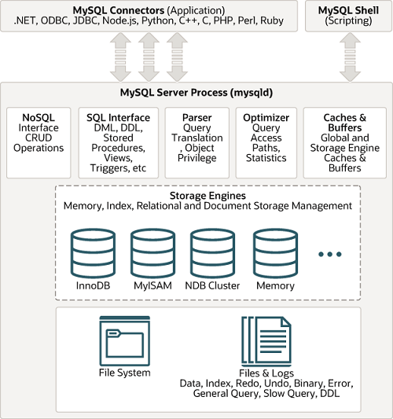

## 18.11 Overview of MySQL Storage Engine Architecture

[18.11.1 Pluggable Storage Engine Architecture](pluggable-storage.md)

[18.11.2 The Common Database Server Layer](pluggable-storage-common-layer.md)

The MySQL pluggable storage engine architecture enables a database
professional to select a specialized storage engine for a
particular application need while being completely shielded from
the need to manage any specific application coding requirements.
The MySQL server architecture isolates the application programmer
and DBA from all of the low-level implementation details at the
storage level, providing a consistent and easy application model
and API. Thus, although there are different capabilities across
different storage engines, the application is shielded from these
differences.

The MySQL pluggable storage engine architecture is shown in
[Figure 18.3, “MySQL Architecture with Pluggable Storage Engines”](pluggable-storage-overview.md#mysql-architecture-diagram "Figure 18.3 MySQL Architecture with Pluggable Storage Engines").

**Figure 18.3 MySQL Architecture with Pluggable Storage Engines**

The pluggable storage engine architecture provides a standard set
of management and support services that are common among all
underlying storage engines. The storage engines themselves are the
components of the database server that actually perform actions on
the underlying data that is maintained at the physical server
level.

This efficient and modular architecture provides huge benefits for
those wishing to specifically target a particular application
need—such as data warehousing, transaction processing, or
high availability situations—while enjoying the advantage of
utilizing a set of interfaces and services that are independent of
any one storage engine.

The application programmer and DBA interact with the MySQL
database through Connector APIs and service layers that are above
the storage engines. If application changes bring about
requirements that demand the underlying storage engine change, or
that one or more storage engines be added to support new needs, no
significant coding or process changes are required to make things
work. The MySQL server architecture shields the application from
the underlying complexity of the storage engine by presenting a
consistent and easy-to-use API that applies across storage
engines.
