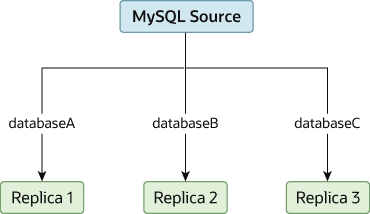

### 19.4.6 Replicating Different Databases to Different Replicas

There may be situations where you have a single source server and
want to replicate different databases to different replicas. For
example, you may want to distribute different sales data to
different departments to help spread the load during data
analysis. A sample of this layout is shown in
[Figure 19.2, “Replicating Databases to Separate Replicas”](replication-solutions-partitioning.md#figure_replication-multi-db "Figure 19.2 Replicating Databases to Separate Replicas").

**Figure 19.2 Replicating Databases to Separate Replicas**

You can achieve this separation by configuring the source and
replicas as normal, and then limiting the binary log statements
that each replica processes by using the
[`--replicate-wild-do-table`](replication-options-replica.md#option_mysqld_replicate-wild-do-table)
configuration option on each replica.

Important

You should *not* use
[`--replicate-do-db`](replication-options-replica.md#option_mysqld_replicate-do-db) for this
purpose when using statement-based replication, since
statement-based replication causes this option's effects to
vary according to the database that is currently selected. This
applies to mixed-format replication as well, since this enables
some updates to be replicated using the statement-based format.

However, it should be safe to use
[`--replicate-do-db`](replication-options-replica.md#option_mysqld_replicate-do-db) for this
purpose if you are using row-based replication only, since in
this case the currently selected database has no effect on the
option's operation.

For example, to support the separation as shown in
[Figure 19.2, “Replicating Databases to Separate Replicas”](replication-solutions-partitioning.md#figure_replication-multi-db "Figure 19.2 Replicating Databases to Separate Replicas"), you should
configure each replica as follows, before executing
[`START REPLICA`](start-replica.md "15.4.2.6 START REPLICA Statement"):

- Replica 1 should use
  `--replicate-wild-do-table=databaseA.%`.
- Replica 2 should use
  `--replicate-wild-do-table=databaseB.%`.
- Replica 3 should use
  `--replicate-wild-do-table=databaseC.%`.

Each replica in this configuration receives the entire binary log
from the source, but executes only those events from the binary
log that apply to the databases and tables included by the
[`--replicate-wild-do-table`](replication-options-replica.md#option_mysqld_replicate-wild-do-table) option in
effect on that replica.

If you have data that must be synchronized to the replicas before
replication starts, you have a number of choices:

- Synchronize all the data to each replica, and delete the
  databases, tables, or both that you do not want to keep.
- Use [**mysqldump**](mysqldump.md "6.5.4 mysqldump — A Database Backup Program") to create a separate dump
  file for each database and load the appropriate dump file on
  each replica.
- Use a raw data file dump and include only the specific files
  and databases that you need for each replica.

  Note

  This does not work with [`InnoDB`](innodb-storage-engine.md "Chapter 17 The InnoDB Storage Engine")
  databases unless you use
  [`innodb_file_per_table`](innodb-parameters.md#sysvar_innodb_file_per_table).
