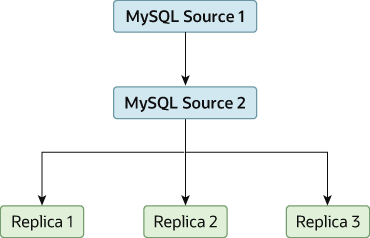

### 19.4.7 Improving Replication Performance

As the number of replicas connecting to a source increases, the
load, although minimal, also increases, as each replica uses a
client connection to the source. Also, as each replica must
receive a full copy of the source's binary log, the network load
on the source may also increase and create a bottleneck.

If you are using a large number of replicas connected to one
source, and that source is also busy processing requests (for
example, as part of a scale-out solution), then you may want to
improve the performance of the replication process.

One way to improve the performance of the replication process is
to create a deeper replication structure that enables the source
to replicate to only one replica, and for the remaining replicas
to connect to this primary replica for their individual
replication requirements. A sample of this structure is shown in
[Figure 19.3, “Using an Additional Replication Source to Improve Performance”](replication-solutions-performance.md#figure_replication-performance "Figure 19.3 Using an Additional Replication Source to Improve Performance").

**Figure 19.3 Using an Additional Replication Source to Improve Performance**

For this to work, you must configure the MySQL instances as
follows:

- Source 1 is the primary source where all changes and updates
  are written to the database. Binary logging is enabled on both
  source servers, which is the default.
- Source 2 is the replica to the server Source 1 that provides
  the replication functionality to the remainder of the replicas
  in the replication structure. Source 2 is the only machine
  permitted to connect to Source 1. Source 2 has the
  [`--log-slave-updates`](replication-options-binary-log.md#sysvar_log_slave_updates) option
  enabled (which is the default). With this option, replication
  instructions from Source 1 are also written to Source 2's
  binary log so that they can then be replicated to the true
  replicas.
- Replica 1, Replica 2, and Replica 3 act as replicas to Source
  2, and replicate the information from Source 2, which actually
  consists of the upgrades logged on Source 1.

The above solution reduces the client load and the network
interface load on the primary source, which should improve the
overall performance of the primary source when used as a direct
database solution.

If your replicas are having trouble keeping up with the
replication process on the source, there are a number of options
available:

- If possible, put the relay logs and the data files on
  different physical drives. To do this, set the
  [`relay_log`](replication-options-replica.md#sysvar_relay_log) system variable to
  specify the location of the relay log.
- If heavy disk I/O activity for reads of the binary log file
  and relay log files is an issue, consider increasing the value
  of the [`rpl_read_size`](replication-options-replica.md#sysvar_rpl_read_size) system
  variable. This system variable controls the minimum amount of
  data read from the log files, and increasing it might reduce
  file reads and I/O stalls when the file data is not currently
  cached by the operating system. Note that a buffer the size of
  this value is allocated for each thread that reads from the
  binary log and relay log files, including dump threads on
  sources and coordinator threads on replicas. Setting a large
  value might therefore have an impact on memory consumption for
  servers.
- If the replicas are significantly slower than the source, you
  may want to divide up the responsibility for replicating
  different databases to different replicas. See
  [Section 19.4.6, “Replicating Different Databases to Different Replicas”](replication-solutions-partitioning.md "19.4.6 Replicating Different Databases to Different Replicas").
- If your source makes use of transactions and you are not
  concerned about transaction support on your replicas, use
  `MyISAM` or another nontransactional engine
  on the replicas. See
  [Section 19.4.4, “Using Replication with Different Source and Replica Storage Engines”](replication-solutions-diffengines.md "19.4.4 Using Replication with Different Source and Replica Storage Engines").
- If your replicas are not acting as sources, and you have a
  potential solution in place to ensure that you can bring up a
  source in the event of failure, then you can disable the
  system variable
  [`log_replica_updates`](replication-options-binary-log.md#sysvar_log_replica_updates) (from
  MySQL 8.0.26) or
  [`log_slave_updates`](replication-options-binary-log.md#sysvar_log_slave_updates) (before
  MySQL 8.0.26) on the replicas. This prevents
  “dumb” replicas from also logging events they
  have executed into their own binary log.
