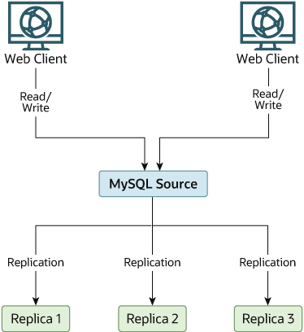
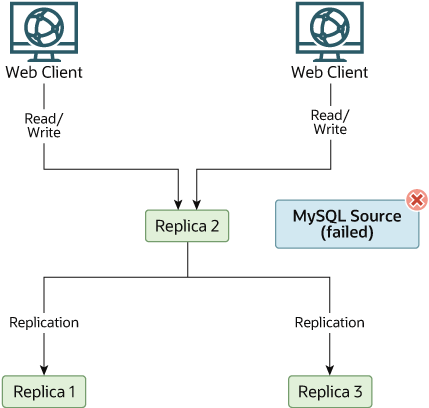

### 19.4.8 Switching Sources During Failover

You can tell a replica to change to a new source using the
[`CHANGE REPLICATION SOURCE TO`](change-replication-source-to.md "15.4.2.3 CHANGE REPLICATION SOURCE TO Statement")
statement (prior to MySQL 8.0.23: [`CHANGE
MASTER TO`](change-master-to.md "15.4.2.1 CHANGE MASTER TO Statement"). The replica does not check whether the
databases on the source are compatible with those on the replica;
it simply begins reading and executing events from the specified
coordinates in the new source's binary log. In a failover
situation, all the servers in the group are typically executing
the same events from the same binary log file, so changing the
source of the events should not affect the structure or integrity
of the database, provided that you exercise care in making the
change.

Replicas should be run with binary logging enabled (the
[`--log-bin`](replication-options-binary-log.md#option_mysqld_log-bin) option), which is the
default. If you are not using GTIDs for replication, then the
replicas should also be run with
[`--log-slave-updates=OFF`](replication-options-binary-log.md#sysvar_log_slave_updates) (logging
replica updates is the default). In this way, the replica is ready
to become a source without restarting the replica
[**mysqld**](mysqld.md "6.3.1 mysqld — The MySQL Server"). Assume that you have the structure
shown in [Figure 19.4, “Redundancy Using Replication, Initial Structure”](replication-solutions-switch.md#figure_replication-redundancy-before "Figure 19.4 Redundancy Using Replication, Initial Structure").

**Figure 19.4 Redundancy Using Replication, Initial Structure**

In this diagram, the `Source` holds the source
database, the `Replica*` hosts are replicas, and
the `Web Client` machines are issuing database
reads and writes. Web clients that issue only reads (and would
normally be connected to the replicas) are not shown, as they do
not need to switch to a new server in the event of failure. For a
more detailed example of a read/write scale-out replication
structure, see [Section 19.4.5, “Using Replication for Scale-Out”](replication-solutions-scaleout.md "19.4.5 Using Replication for Scale-Out").

Each MySQL replica (`Replica 1`, `Replica
2`, and `Replica 3`) is a replica
running with binary logging enabled, and with
[`--log-slave-updates=OFF`](replication-options-binary-log.md#sysvar_log_slave_updates). Because
updates received by a replica from the source are not written to
the binary log when
[`--log-slave-updates=OFF`](replication-options-binary-log.md#sysvar_log_slave_updates) is
specified, the binary log on each replica is initially empty. If
for some reason `Source` becomes unavailable, you
can pick one of the replicas to become the new source. For
example, if you pick `Replica 1`, all
`Web Clients` should be redirected to
`Replica 1`, which writes the updates to its
binary log. `Replica 2` and `Replica
3` should then replicate from `Replica
1`.

The reason for running the replica with
[`--log-slave-updates=OFF`](replication-options-binary-log.md#sysvar_log_slave_updates) is to
prevent replicas from receiving updates twice in case you cause
one of the replicas to become the new source. If `Replica
1` has [`--log-slave-updates`](replication-options-binary-log.md#sysvar_log_slave_updates)
enabled, which is the default, it writes any updates that it
receives from `Source` in its own binary log.
This means that, when `Replica 2` changes from
`Source` to `Replica 1` as its
source, it may receive updates from `Replica 1`
that it has already received from `Source`.

Make sure that all replicas have processed any statements in their
relay log. On each replica, issue `STOP REPLICA
IO_THREAD`, then check the output of
[`SHOW PROCESSLIST`](show-processlist.md "15.7.7.29 SHOW PROCESSLIST Statement") until you see
`Has read all relay log`. When this is true for
all replicas, they can be reconfigured to the new setup. On the
replica `Replica 1` being promoted to become the
source, issue [`STOP REPLICA`](stop-replica.md "15.4.2.8 STOP REPLICA Statement") and
[`RESET MASTER`](reset-master.md "15.4.1.2 RESET MASTER Statement").

On the other replicas `Replica 2` and
`Replica 3`, use [`STOP
REPLICA`](stop-replica.md "15.4.2.8 STOP REPLICA Statement") and `CHANGE REPLICATION SOURCE TO
SOURCE_HOST='Replica1'` or `CHANGE MASTER TO
MASTER_HOST='Replica1'` (where
`'Replica1'` represents the real host name of
`Replica 1`). To use [`CHANGE
REPLICATION SOURCE TO`](change-replication-source-to.md "15.4.2.3 CHANGE REPLICATION SOURCE TO Statement"), add all information about how to
connect to `Replica 1` from `Replica
2` or `Replica 3`
(*`user`*,
*`password`*,
*`port`*). When issuing the statement in
this scenario, there is no need to specify the name of the
`Replica 1` binary log file or log position to
read from, since the first binary log file and position 4 are the
defaults. Finally, execute [`START
REPLICA`](start-replica.md "15.4.2.6 START REPLICA Statement") on `Replica 2` and
`Replica 3`.

Once the new replication setup is in place, you need to tell each
`Web Client` to direct its statements to
`Replica 1`. From that point on, all updates sent
by `Web Client` to `Replica 1`
are written to the binary log of `Replica 1`,
which then contains every update sent to `Replica
1` since `Source` became unavailable.

The resulting server structure is shown in
[Figure 19.5, “Redundancy Using Replication, After Source Failure”](replication-solutions-switch.md#figure_replication-redundancy-after "Figure 19.5 Redundancy Using Replication, After Source Failure").

**Figure 19.5 Redundancy Using Replication, After Source Failure**

When `Source` becomes available again, you should
make it a replica of `Replica 1`. To do this,
issue on `Source` the same
[`CHANGE REPLICATION SOURCE TO`](change-replication-source-to.md "15.4.2.3 CHANGE REPLICATION SOURCE TO Statement") (or
[`CHANGE MASTER TO`](change-master-to.md "15.4.2.1 CHANGE MASTER TO Statement")) statement as that
issued on `Replica 2` and `Replica
3` previously. `Source` then becomes a
replica of `Replica 1` and picks up the
`Web Client` writes that it missed while it was
offline.

To make `Source` a source again, use the
preceding procedure as if `Replica 1` were
unavailable and `Source` were to be the new
source. During this procedure, do not forget to run
[`RESET MASTER`](reset-master.md "15.4.1.2 RESET MASTER Statement") on
`Source` before making `Replica
1`, `Replica 2`, and `Replica
3` replicas of `Source`. If you fail to
do this, the replicas may pick up stale writes from the
`Web Client` applications dating from before the
point at which `Source` became unavailable.

You should be aware that there is no synchronization between
replicas, even when they share the same source, and thus some
replicas might be considerably ahead of others. This means that in
some cases the procedure outlined in the previous example might
not work as expected. In practice, however, relay logs on all
replicas should be relatively close together.

One way to keep applications informed about the location of the
source is to have a dynamic DNS entry for the source host. With
`BIND`, you can use
**nsupdate** to update the DNS
dynamically.
