# **TPC BENCHMARK™ C**

**Standard Specification**

Revision 5.11

February 2010

Transaction Processing Performance Council (TPC) [www.tpc.org](http://www.tpc.org/) info@tpc.org © 2010 Transaction Processing Performance Council

# **Acknowledgments**

The TPC acknowledges the substantial contribution of François Raab, consultant to the TPC-C subcommittee and technical editor of the TPC-C benchmark standard. The TPC also acknowledges the work and contributions of the TPC-C subcommittee member companies: Amdahl, Bull, CDC, DEC, DG, Fujitsu/ ICL, HP, IBM, Informix, Mips, Oracle, Sequent, Sun, Sybase, Tandem, and Unisys.

# **TPC Membership**

(as of February 2010)

## **Full Members**


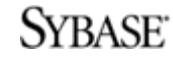


## **Associate Members**


# **Document History**

| Date              | Version         | Description                                                                                                                                                                                                     |
|-------------------|-----------------|-----------------------------------------------------------------------------------------------------------------------------------------------------------------------------------------------------------------|
| 22 June 1992      | Draft 6.6       | Mail ballot version (proposed standard)                                                                                                                                                                         |
| 13 August 1992    | Revision 1.0    | Standard specification released to the public                                                                                                                                                                   |
| 1 June 1993       | Revision 1.1    | First minor revision                                                                                                                                                                                            |
| 20 October 1993   | Revision 2.0    | First major revision                                                                                                                                                                                            |
| 15 February 1995  | Revision 3.0    | Second major revision                                                                                                                                                                                           |
| 4 June 1996       | Revision 3.1    | Minor changes to rev 3.1.                                                                                                                                                                                       |
| 27 August 1996    | Revision 3.2    | Changed mix back to 3.0 values.                                                                                                                                                                                 |
| 12 September 1996 | Revision 3.2.1  | Fixed Member list and added index                                                                                                                                                                               |
| 15 January 1997   | Revision 3.2.2  | Added wording for TAB Ids #197, 221 & 224                                                                                                                                                                       |
| 6 February 1997   | Revision 3.2.3  | Added wording for TAB Ids #205, 222 & 226                                                                                                                                                                       |
| 8 April 1997      | Revision 3.3    | New Clauses 2.3.6 & 9.2.2.3 (TAB Id #225)                                                                                                                                                                       |
| 9 April 1997      | Revision 3.3.1  | Wording added for availability date in Clause 8.1.8.3                                                                                                                                                           |
| 25 June 1997      | Revision 3.3.2  | Editorial changes in Clauses 8.1.6.7 and 9.1.4                                                                                                                                                                  |
| 16 April 1998     | Revision 3.3.3  | Editorial changes in Clauses 2.5.2.2 and 4.2.2                                                                                                                                                                  |
| 24 August 1998    | Revision 3.4    | New Clause 5.7 and changed wording in Clause 8.3                                                                                                                                                                |
| 25 August 1999    | Revision 3.5    | Modify wording in Clause 7.1.3                                                                                                                                                                                  |
| 18 October 2000   | Revision 5.0    | Change pricing, 2 Hour Measurement, 60 Day Space                                                                                                                                                                |
| 6 December 2000   | Revision 5.0    | 7x24 Maintenance, Mail Ballot Draft                                                                                                                                                                             |
| 26 February 2001  | Revision 5.0    | Official Version 5.0 Specification                                                                                                                                                                              |
| 11 December 2002  | Revision 5.1    | Clause 3.5.4, PDO Limitations, Cluster Durability, Checkpoint Interval, Typographical Errors                                                                                                                    |
| 11 December 2003  | Revision 5.2    | Modified Clause 7.1.3, Clause 8.3, Clause 7.1.6,<br>and Clause 8.1.8.8. Replaced Clause 8.1.1.2,<br>and Clause 8.1.8.2. Modified Clause 5.4.4 (truncated<br>reported MQTh)                                      |
| 22 April 2004     | Revision 5.3    | Clause 8.3 (9), Executive Summary, Modify 7.1.3 (5),<br>New Comment 4 and 5 to 7.1.3                                                                                                                            |
| 21 April 2005     | Revision 5.4    | Modified Clause 3.3.3.2, Modified Clause 5.3.3, Integrated<br>TPC Pricing Specification                                                                                                                         |
| 20 October 2005   | Revision 5.5    | Modified Clauses 8.1.1.7 and 8.1.9.1, Added Comment to<br>Clause 8.1.1.2 and added Clause 9.2.9.                                                                                                                |
| 8 December 2005   | Revision 5.6    | Modified Clauses 5.5.1.2, 8.1.1.2. Replaced 6.6.6                                                                                                                                                               |
| 21 April 2006     | Revision 5.7    | Modified Clauses 1.3.1 and 1.4.9. Added Clause 1.4.14                                                                                                                                                           |
| 14 December 2006  | Revision 5.8    | Modified Clauses 0.2, 1.3.1, 5.2.5.4, 8.1.8.1, 9.2.8.1, 7.1.3,<br>8.3, and 9.2.1. Added Clause 7.2.6                                                                                                            |
| 14 June 2007      | Revision 5.9    | Modified Clause 7.2.6.1, 7.2.6.2, 8.3.1, 8.3.2 to address<br>substitution rules                                                                                                                                 |
| 17 April 2008     | Revision 5.10   | Modified Clauses 1.3.1, 3.1.5, 3.3.2, 3.5, 3.5.1, 3.5.3, 3.5.3.4,<br>4.3.2.2, 5.2.3, 5.2.5.6, 8.1.1.2, Added Clause 9.2.9.2.                                                                                    |
| 5 February 2009   | Revision 5.10.1 | Editorial changes in Clauses 3.4.2.9, 3.5, 5.6.4, 7.2.6.1, 8.1.1.3                                                                                                                                              |
| 11 February 2010  | Revision 5.11   | Updated TPC Membership, Editorial change in Clause<br>1.3.1, Modified Clause 6.6.3.7, Modified Clause 7.2.3.1,<br>Modified/ Added Clauses 0.1, 5.7.1, 8.1.1.2, and 9.2.9 to<br>support TPC-Energy requirements. |

TPC Benchmark™, TPC-C, and tpmC are trademarks of the Transaction Processing Performance Council.

Permission to copy without fee all or part of this material is granted provided that the TPC copyright notice, the title of the publication, and its date appear, and notice is given that copying is by permission of the Transaction Processing Performance Council. To copy otherwise requires specific permission.

# TABLE OF CONTENTS

| Ackno                                                 | owledgments                                           | 2  |
|-------------------------------------------------------|-------------------------------------------------------|----|
|                                                       | Membership                                            |    |
| TABLE O                                               | F CONTENTS                                            | 5  |
| Clause 0: 1                                           | PREAMBLE                                              | 7  |
| 0.1                                                   | Introduction                                          | 7  |
| 0.2                                                   | General Implementation Guidelines                     | 8  |
| 0.3                                                   | General Measurement Guidelines                        | 9  |
| Clause 1: 1                                           | LOGICAL DATABASE DESIGN                               | 10 |
| 1.1                                                   | Business and Application Environment                  | 10 |
| 1.2                                                   | Database Entities, Relationships, and Characteristics | 11 |
| 1.3                                                   | Table Layouts                                         |    |
| 1.4                                                   | Implementation Rules                                  | 18 |
| 1.5                                                   | Integrity Rules                                       | 19 |
| 1.6                                                   | Data Access Transparency Requirements                 | 20 |
| Clause 2:                                             | TRANSACTION and TERMINAL PROFILES                     | 21 |
| 2.1                                                   | Definition of Terms                                   | 21 |
| 2.2                                                   | General Requirements for Terminal I/ O                | 23 |
| 2.3                                                   | General Requirements for Transaction Profiles         | 26 |
| 2.4                                                   | The New-Order Transaction                             | 28 |
| 2.5                                                   | The Payment Transaction                               | 33 |
| 2.6                                                   | The Order-Status Transaction                          | 37 |
| 2.7                                                   | The Delivery Transaction                              | 40 |
| 2.8                                                   | The Stock-Level Transaction                           | 44 |
| Clause 3:                                             | TRANSACTION and SYSTEM PROPERTIES                     | 47 |
| 3.1                                                   | The ACID Properties                                   |    |
| 3.2                                                   | Atomicity Requirements                                |    |
| 3.3                                                   | Consistency Requirements                              |    |
| 3.4                                                   | Isolation Requirements                                |    |
| 3.5                                                   | Durability Requirements                               |    |
| Clause 4: S                                           | SCALING and DATABASE POPULATION                       | 61 |
| 4.1                                                   | General Scaling Rules                                 | 61 |
| 4.2                                                   | Scaling Requirements                                  | 61 |
| 4.3                                                   | Database Population                                   | 64 |
| Clause 5: 1                                           | PERFORMANCE METRICS and RESPONSE TIME                 | 69 |
| 5.1                                                   | Definition of Terms                                   | 69 |
| 5.2                                                   | Pacing of Transactions by Emulated Users              | 69 |
| 5.3                                                   | Response Time Definition                              | 73 |
| 5.4                                                   | Computation of Throughput Rating                      | 73 |
| 5.5                                                   | Measurement Interval Requirements                     | 74 |
| 5.6                                                   | Required Reporting                                    | 76 |
| 5.7                                                   | Primary Metrics                                       | 78 |
| Clause 6: S                                           | SUT, DRIVER, and COMMUNICATIONS DEFINITION            | 79 |
| 6.1                                                   | Models of the Target System                           |    |
| 6.2                                                   | Test Configuration                                    |    |
| 6.3                                                   | System Under Test (SUT) Definition                    | 80 |
| 6.4                                                   | Driver Definition                                     | 80 |
| 6.5 Communications Interface Definitions              | 8                                                     |    |
| 6.6 Further Requirements on the SUT and Driver System | 8                                                     |    |
| Clause 7: PRICING                                     | 8                                                     |    |
| 7.1 Pricing Methodology                               | 8                                                     |    |
| 7.2 Priced System                                     | 8                                                     |    |
| 7.3 Required Reporting                                | 8                                                     |    |
| Clause 8: FULL DISCLOSURE                             | 8                                                     |    |
| 8.1 Full Disclosure Report Requirements               | 8                                                     |    |
| 8.3 Revisions to the Full Disclosure Report           | 9                                                     |    |
| Clause 9: AUDIT                                       | 10                                                    |    |
| 9.1 General Rules                                     | 10                                                    |    |
| 9.2 Auditor's check list                              | 10                                                    |    |
| Index                                                 | 105                                                   |    |
| Appendix A: SAMPLE PROGRAMS                           | 10                                                    |    |
| A.1 The New-Order Transaction                         | 10                                                    |    |
| A.2 The Payment Transaction                           | 11                                                    |    |
| A.3 The Order-Status Transaction                      | 11                                                    |    |
| A.4 The Delivery Transaction                          | 11                                                    |    |
| A.5 The Stock-Level Transaction                       | 11                                                    |    |
| A.6 Sample Load Program                               | 11                                                    |    |
| Appendix B: EXECUTIVE SUMMARY STATEMENT               | 13                                                    |    |
| Appendix C: NUMERICAL QUANTITIES SUMMARY              | 13                                                    |    |

# **Clause 0: PREAMBLE**

## **0.1 Introduction**

TPC Benchmark™ C (TPC-C) is an OLTP workload. It is a mixture of read -only and update intensive transactions that simulate the activities found in complex OLTP application environments. It does so by exercising a breadth of system components associated with such environments, which are characterized by:

- The simultaneous execution of multiple transaction types that span a breadth of complexity
- On-line and deferred transaction execution modes
- Multiple on-line terminal sessions
- Moderate system and application execution time
- Significant disk input/ output
- Transaction integrity (ACID properties)
- Non-uniform distribution of data access through primary and secondary keys
- Databases consisting of many tables with a wide variety of sizes, attributes, and relat ionships
- Contention on data access and update

The performance metric reported by TPC-C is a "business throughput" measuring the number of orders processed per minute. Multiple transactions are used to simulate the business activity of processing an order, and each transaction is subject to a response time constraint. The performance metric for this benchmark is expressed in transactions-per-minute-C (tpmC). To be compliant with the TPC-C standard, all references to TPC-C results must include the tpmC rate, the associated price-per-tpmC, and the availability date of the priced configuration.

To be compliant with the optional TPC-Energy standard, the additional primary metric, expressed as watts-pertpmC must be reported. The requirements of the TPC-Energy Specification can be found at www.tpc.org.

Although these specifications express implementation in terms of a relational data model with conventional locking scheme, the database may be implemented using any commercially available database management system (DBMS), database server, file system, or other data repository that provides a functionally equivalent implementation. The terms "table", "row", and "column" are used in this d ocument only as examples of logical data structures.

TPC-C uses terminology and metrics that are similar to other benchmarks, originated by the TPC or others. Such similarity in terminology d oes not in any way imply that TPC-C results are comparable to other benchmarks. The only benchmark results comparable to TPC-C are other TPC-C results conformant with the same revision.

Despite the fact that this benchmark offers a rich environment that emulates many OLTP application s, this benchmark does not reflect the entire range of OLTP requirements. In addition, the extent to which a customer can achieve the results reported by a vendor is highly dependent on how closely TPC-C approximates the customer application. The relative performance of systems derived from this benchmark does not necessarily hold for other workloads or environments. Extrapolations to any other environment are not recommended.

Benchmark results are highly dependent upon workload, specific application requirements, and systems design and implementation. Relative system performance will vary as a result of these and other factors. Therefore, TPC-C should not be used as a substitute for a specific customer application benchmarking when critical capacity plan ning and/ or product evaluation decisions are contemplated.

Benchmark sponsors are permitted several possible system designs, insofar as they adhere to the model described and pictorially illustrated in Clause 6. A Full Disclosure Report of the implementation details, as specified in Clause 8, must be made available along with the reported results.

**Comment:** While separated from the main text for readability, comments are a part of the standard and must be enforced. However, the sample programs, included as Appendix A, the summary statements, included as Appendix B, and the numerical quantities summary, included as Appendix C, are provided only as examples and are specifically not part of this standard.

## **0.2 General Implementation Guidelines**

The purpose of TPC benchmarks is to provide relevant, objective performance data to industry users. To achieve that purpose, TPC benchmark specifications require that benchmark tests be im p lemented with systems, products, technologies and pricing that:

- Are generally available to users.
- Are relevant to the market segment that the individual TPC benchmark models or represents (e.g. TPC-A models and represents high-volume, simple OLTP environments).
- A significant number of users in the market segment the benchmark models or represents would plausibly implement.

The use of new systems, products, technologies (hardware or software) and pricing is encouraged so long as they meet the requirements above. Specifically prohibited are benchmark systems, products, technologies, pricing (hereafter referred to as "implementations") whose primary purpose is perform ance optimization of TPC benchmark results without any corresponding ap plicability to real-world applications and environments. In other words, all "benchmark specials," implementations that improve benchmark results but not real-world performance or pricing, are prohibited.

The following characteristics should be used as a guide to judge whether a particular implementation is a benchmark special. It is not required that each point below be met, but that the cumulative weight of the evidence be considered to identify an unacceptable implementation. Absolute certainty or certainty beyond a reasonable doubt is not required to make a judgment on this complex issue. The question that must be answered is this: based on the available evidence, does the clear preponderance (the greater share or weight) of evide nce indicate that this implementation is a benchmark special?

The following characteristics should be used to jud ge whether a particular implementation is a benchmark special:

- Is the implementation generally available, documented, and supported?
- Does the implementation have significant restrictions on its use or applicability that limits its use beyond TPC benchmarks?
- Is the implementation or part of the implementation poorly integrated into the larger product?
- Does the implementation take special advantage of the limited nature of TPC benchmarks (e.g., transaction profile, transaction mix, transaction concurrency and/ or contention, transaction isolation) in a manner that would not be generally applicable to the en vironment the benchmark represents?

- Is the use of the implem entation discouraged by the vendor? (This includes failing to promote the implementation in a manner similar to other products and technologies.)
- Does the implementation require uncommon soph istication on the part of the end -user, programmer, or system administrator?
- Is the pricing unusual or non-customary for the vendor or unusual or non -customary to normal business practices? See the current revision of the TPC Pricing Specification for additional information.
- Is the implementation being used (including beta) or purchased by end -users in the market area the benchmark represents? How many? Multiple sites? If the implementation is not currently being used by end-users, is there any evid ence to indicate that it will be used by a significant number of users?

## **0.3 General Measurement Guidelines**

TPC benchmark results are expected to be accurate representations of system performance. Therefore, there are certain guidelines which are expected to be followed when measuring those results. The approach or methodology is explicitly outlined in or described in the specification.

- The approach is an accepted is an accepted engineering practice or standard.
- The approach does not enhance the result.
- Equipment used in measuring results is calibrated according to established quality standards.
- Fidelity and candor is maintained in reporting any anomalies in the results, even if not specified in the benchmark requirements.

The use of new methodologies and approaches is encouraged so long as they meet the requirements above.

# **Clause 1: LOGICAL DATABASE DESIGN**

## **1.1 Business and Application Environment**

TPC Benchmark™ C is comprised of a set of basic operations designed to exercise system functionalities in a manner representative of complex OLTP application environments. These basic operations have been given a life-like context, portraying the activity of a wholesale supplier, to help users relate intuitively to the components of the benchmark. The workload is centered on the activity of processing orders and provides a logical database design, which can be distributed without structural changes to transactions.

TPC-C does not represent the activity of any particular business segment, but rather any industry which must manage, sell, or distribute a product or service (e.g., car rental, food distribution, parts supplie r, etc.). TPC-C does not attempt to be a model of how to build an actual application .

The purpose of a benchmark is to reduce the diversity of operations found in a production application , while retaining the application's essential performance characteristics, namely: the level of system utilization and the complexity of operations. A large number of functions have to be performed to manage a production order entry system. Many of these functions are not of primary interest for performance analysis, since they are proportionally small in terms of system resource utilization or in terms of frequency of execution. Although these functions are vital for a production system, they merely create excessive diversity in the context of a standard benchmark and have been omitted in TPC-C.

The Company portrayed by the benchmark is a wholesale supplier with a number of geographically distributed sales districts and associated warehouses. As the Company's business expands, new warehouses and associated sales districts are created. Each regional warehouse covers 10 districts. Each district serves 3,000 customers. All warehouses maintain stocks for the 100,000 items sold by the Company. The following d iagram illustrat es the warehouse, district, and customer hierarchy of TPC-C's business environment.

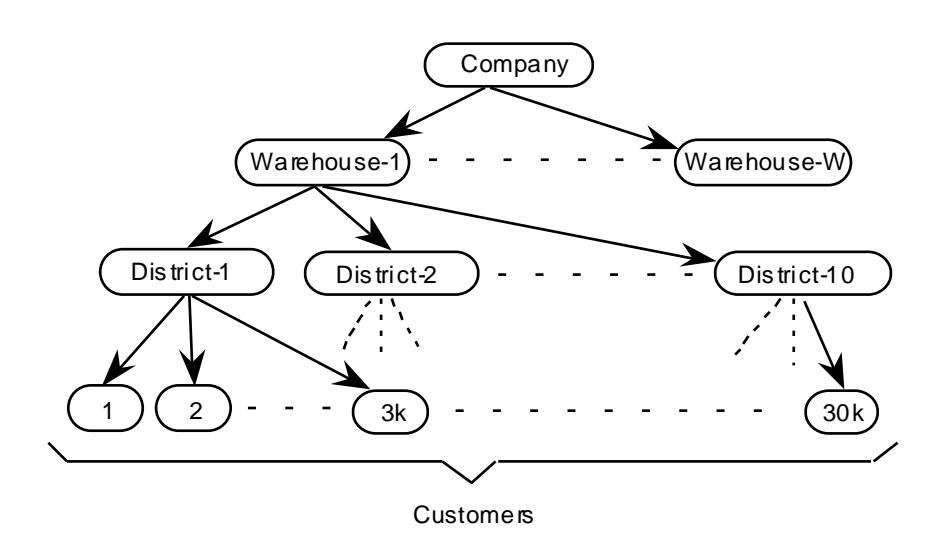

Customers call the Company to place a new order or request the status of an existing order. Orders are composed of an average of 10 order lines (i.e., line items). One percent of all order lines are for items not in-stock at the regional warehouse and must be supplied by another warehouse.

The Company's system is also used to enter payments from customers, process orders for delivery, and examine stock levels to identify potential supply shortages.

## 1.2 Database Entities, Relationships, and Characteristics

1.2.1 The components of the TPC-C database are defined to consist of nine separate and individual tables. The relationships among these tables are defined in the entity-relationship diagram shown below and are subject to the rules specified in Clause 1.4.

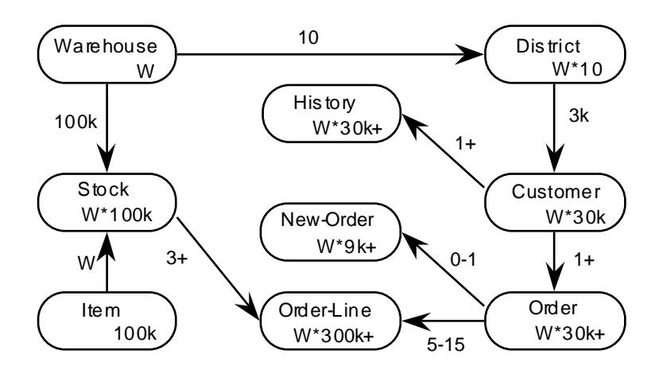

### Legend:

- All numbers shown illustrate the database population requirements (see Clause 4.3).
- The numbers in the entity blocks represent the cardinality of the tables (number of rows). These numbers are factored by W, the number of Warehouses, to illustrate the database scaling. (see Clause 4).
- The numbers next to the relationship arrows represent the cardinality of the relationships (average number of children per parent).
- The plus (+) symbol is used after the cardinality of a relationship or table to illustrate that this number is subject to small variations in the initial database population over the measurement interval (see Clause 5.5) as rows are added or deleted.

## 1.3 Table Layouts

- 1.3.1 The following list defines the minimal structure (list of attributes) of each table where:
  - N unique IDs means that the attribute must be able to hold any one ID within a minimum set of N unique IDs, regardless of the physical representation (e.g., binary, packed decimal, alphabetic, etc.) of the attribute.
  - variable text, size N means that the attribute must be able to hold any string of characters of a variable length with a maximum length of N. If the attribute is stored as a fixed length string and the string it holds is shorter than N characters, it must be padded with spaces.

- **fixed text, size N** means that the attribute must be able to hold any string of characters of a fixed length of N.
- **date and time** represents the data type for a date value th at includes a time component. The date component must be able to hold any date between 1st January 1900 and 31st December 2100. The time component must be capable of representing the range of time values from 00:00:00 to 23:59:59 with a resolution of at least one second. Date and Time must be implemented using data types that are defined by the DBMS for that use.
- **numeric(m [,n])** means an unsigned numeric value with at least m total decimal digits, of which n digits are to the right (after) the decimal point. The attribute must be able to hold all possible values which can be expressed as numeric(m,n). Omitting n, as in numeric(m), indicates the same as numeric(m,0). Numeric fields that contain monetary values (W\_YTD, D\_YTD, C\_CREDIT\_LIM, C\_BALANCE, C\_YTD\_PAYMENT, H\_AMOUNT, OL\_AMOUNT, I\_PRICE) must use data types that are defined by the DBMS as being an exact numeric data type or that satisfy the ANSI SQL Standard definition of being an exact numeric representation.
- **signed numeric(m [,n])** is identical to numeric(m [,n]) except that it can represent both positive and negative values.
- **null** means out of the range of valid values for a given attribute and always the same value for that attribute.

**Comment 1**: For each table, the following list of attributes can be implemented in any order, using any physical representation available from the tested system.

**Comment 2**: Table and attribute names are used for illustration purposes only; d ifferent names may be used by the implementation.

**Comment 3**: A **signed numeric** data type may be used (at the sponsor" s discretion) anywhere a **numeric** data type is defined.

### **WAREHOUSE Table Layout**

Primary Key: W\_ID

| Field Name | Field Definition       | Comments                   |
|------------|------------------------|----------------------------|
| W_ID       | 2*W unique IDs         | W Warehouses are populated |
| W_NAME     | variable text, size 10 |                            |
| W_STREET_1 | variable text, size 20 |                            |
| W_STREET_2 | variable text, size 20 |                            |
| W_CITY     | variable text, size 20 |                            |
| W_STATE    | fixed text, size 2     |                            |
| W_ZIP      | fixed text, size 9     |                            |
| W_TAX      | signed numeric(4,4)    | Sales tax                  |
| W_YTD      | signed numeric(12,2)   | Year to date balance       |

### **DISTRICT Table Layout**

| Field Name  | Field Definition       | Comments                       |
|-------------|------------------------|--------------------------------|
| D_ID        | 20 unique IDs          | 10 are populated per warehouse |
| D_W_ID      | 2*W unique IDs         |                                |
| D_NAME      | variable text, size 10 |                                |
| D_STREET_1  | variable text, size 20 |                                |
| D_STREET_2  | variable text, size 20 |                                |
| D_CITY      | variable text, size 20 |                                |
| D_STATE     | fixed text, size 2     |                                |
| D_ZIP       | fixed text, size 9     |                                |
| D_TAX       | signed numeric(4,4)    | Sales tax                      |
| D_YTD       | signed numeric(12,2)   | Year to date balance           |
| D_NEXT_O_ID | 10,000,000 unique IDs  | Next available Order number    |

Primary Key: (D\_W\_ID, D\_ID)

D\_W\_ID Foreign Key, references W\_ID

### **CUSTOMER Table Layout**

| Field Name     | Field Definition        | Comments                                |
|----------------|-------------------------|-----------------------------------------|
| C_ID           | 96,000 unique IDs       | <i>3,000 are populated per district</i> |
| C_D_ID         | 20 unique IDs           |                                         |
| C_W_ID         | 2*W unique IDs          |                                         |
| C_FIRST        | variable text, size 16  |                                         |
| C_MIDDLE       | fixed text, size 2      |                                         |
| C_LAST         | variable text, size 16  |                                         |
| C_STREET_1     | variable text, size 20  |                                         |
| C_STREET_2     | variable text, size 20  |                                         |
| C_CITY         | variable text, size 20  |                                         |
| C_STATE        | fixed text, size 2      |                                         |
| C_ZIP          | fixed text, size 9      |                                         |
| C_PHONE        | fixed text, size 16     |                                         |
| C_SINCE        | date and time           |                                         |
| C_CREDIT       | fixed text, size 2      | <i>"GC"=good, "BC"=bad</i>              |
| C_CREDIT_LIM   | signed numeric(12, 2)   |                                         |
| C_DISCOUNT     | signed numeric(4, 4)    |                                         |
| C_BALANCE      | signed numeric(12, 2)   |                                         |
| C_YTD_PAYMENT  | signed numeric(12, 2)   |                                         |
| C_PAYMENT_CNT  | numeric(4)              |                                         |
| C_DELIVERY_CNT | numeric(4)              |                                         |
| C_DATA         | variable text, size 500 | <i>Miscellaneous information</i>        |

Primary Key: (C\_W\_ID, C\_D\_ID, C\_ID)

(C\_W\_ID, C\_D\_ID) Foreign Key, references (D\_W\_ID, D\_ID)

### **HISTORY Table Layout**

| Field Name | Field Definition       | Comments                  |
|------------|------------------------|---------------------------|
| H_C_ID     | 96,000 unique IDs      |                           |
| H_C_D_ID   | 20 unique IDs          |                           |
| H_C_W_ID   | 2*W unique IDs         |                           |
| H_D_ID     | 20 unique IDs          |                           |
| H_W_ID     | 2*W unique IDs         |                           |
| H_DATE     | date and time          |                           |
| H_AMOUNT   | signed numeric(6, 2)   |                           |
| H_DATA     | variable text, size 24 | Miscellaneous information |

Primary Key: none

(H\_C\_W\_ID, H\_C\_D\_ID, H\_C\_ID) Foreign Key, references (C\_W\_ID, C\_D\_ID, C\_ID)

(H\_W\_ID, H\_D\_ID) Foreign Key, references (D\_W\_ID, D\_ID)

**Comment**: Rows in the History table do not have a primary key as, within the context of the benchmark, there is no need to uniquely identify a row within this table.

**Note:** The TPC-C application does not have to be capable of utilizing the increased range of C\_ID values beyond 6,000.

### **NEW-ORDER Table Layout**

| Field Name | Field Definition      | Comments |
|------------|-----------------------|----------|
| NO_O_ID    | 10,000,000 unique IDs |          |
| NO_D_ID    | 20 unique IDs         |          |
| NO_W_ID    | 2*W unique IDs        |          |

### **ORDER Table Layout**

| Field Name                                                              | Field Definition       | Comments             |
|-------------------------------------------------------------------------|------------------------|----------------------|
| O_ID                                                                    | 10,000,000 unique IDs  |                      |
| O_D_ID                                                                  | 20 unique IDs          |                      |
| O_W_ID                                                                  | 2*W unique IDs         |                      |
| O_C_ID                                                                  | 96,000 unique IDs      |                      |
| O_ENTRY_D                                                               | date and time          |                      |
| O_CARRIER_ID                                                            | 10 unique IDs, or null |                      |
| O_OL_CNT                                                                | numeric(2)             | Count of Order-Lines |
| O_ALL_LOCAL                                                             | numeric(1)             |                      |
| Primary Key: (O_W_ID, O_D_ID, O_ID)                                     |                        |                      |
| (O_W_ID, O_D_ID, O_C_ID) Foreign Key, references (C_W_ID, C_D_ID, C_ID) |                        |                      |

### **ORDER-LINE Table Layout**

| Field Name                                                                 | Field Definition       | Comments |
|----------------------------------------------------------------------------|------------------------|----------|
| OL_O_ID                                                                    | 10,000,000 unique IDs  |          |
| OL_D_ID                                                                    | 20 unique IDs          |          |
| OL_W_ID                                                                    | 2*W unique IDs         |          |
| OL_NUMBER                                                                  | 15 unique IDs          |          |
| OL_I_ID                                                                    | 200,000 unique IDs     |          |
| OL_SUPPLY_W_ID                                                             | 2*W unique IDs         |          |
| OL_DELIVERY_D                                                              | date and time, or null |          |
| OL_QUANTITY                                                                | numeric(2)             |          |
| OL_AMOUNT                                                                  | signed numeric(6, 2)   |          |
| OL_DIST_INFO                                                               | fixed text, size 24    |          |
| Primary Key: (OL_W_ID, OL_D_ID, OL_O_ID, OL_NUMBER)                        |                        |          |
| (OL_W_ID, OL_D_ID, OL_O_ID) Foreign Key, references (O_W_ID, O_D_ID, O_ID) |                        |          |
| (OL_SUPPLY_W_ID, OL_I_ID) Foreign Key, references (S_W_ID, S_I_ID)         |                        |          |

### **ITEM Table Layout**

| Field Name | Field Definition       | Comments                    |
|------------|------------------------|-----------------------------|
| I_ID       | 200,000 unique IDs     | 100,000 items are populated |
| I_IM_ID    | 200,000 unique IDs     | Image ID associated to Item |
| I_NAME     | variable text, size 24 |                             |
| I_PRICE    | numeric(5, 2)          |                             |
| I_DATA     | variable text, size 50 | Brand information           |

### **STOCK Table Layout**

| Field Name   | Field Definition       | Comments                        |
|--------------|------------------------|---------------------------------|
| S_I_ID       | 200,000 unique IDs     | 100,000 populated per warehouse |
| S_W_ID       | 2*W unique IDs         |                                 |
| S_QUANTITY   | signed numeric(4)      |                                 |
| S_DIST_01    | fixed text, size 24    |                                 |
| S_DIST_02    | fixed text, size 24    |                                 |
| S_DIST_03    | fixed text, size 24    |                                 |
| S_DIST_04    | fixed text, size 24    |                                 |
| S_DIST_05    | fixed text, size 24    |                                 |
| S_DIST_06    | fixed text, size 24    |                                 |
| S_DIST_07    | fixed text, size 24    |                                 |
| S_DIST_08    | fixed text, size 24    |                                 |
| S_DIST_09    | fixed text, size 24    |                                 |
| S_DIST_10    | fixed text, size 24    |                                 |
| S_YTD        | numeric(8)             |                                 |
| S_ORDER_CNT  | numeric(4)             |                                 |
| S_REMOTE_CNT | numeric(4)             |                                 |
| S_DATA       | variable text, size 50 | <i>Make information</i>         |

Primary Key: (S\_W\_ID, S\_I\_ID)

S\_W\_ID Foreign Key, references W\_ID

S\_I\_ID Foreign Key, references I\_ID

## **1.4 Implementation Rules**

- 1.4.1 The physical clustering of records within the database is allowed.
- 1.4.2 A view which represents the rows to avoid logical read/ writes is excluded.

**Comment**: The intent of this clause is to insure that the application implements the number of logical operations defined in the transaction profiles without combining several operations in one, via the use of a view.

- 1.4.3 All tables must have the properly scaled number of rows as defined by the database population requirements (see Clause 4.3).
- 1.4.4 Horizontal partitioning of tables is allowed. Groups of rows from a table may be assigned to different files, disks, or areas. If implemented, the details of such partitioning must be disclosed.
- 1.4.5 Vertical partitioning of tables is allowed. Groups of attributes (columns) of one table may be assigned to files, disks, or areas different from those storing the other attributes of that table. If implemented, the details of such partitioning must be d isclosed (see Clause 1.4.9 for limitations).

**Comment**: in the two clauses above (1.4.4 and 1.4.5) assignment of data to different files, disks, or areas not based on knowledge of the logical structure of the data (e.g., knowledge of row or attribute boundaries) is not considered partitioning. For example, distribution or stripping over multiple disks of a physical file which stores one or more logical tables is not consid ered partitioning as long as this distribution is done by the hardware or the operating system without knowledge of the logical structure stored in the physical file.

1.4.6 Replication is allowed for all tables. All copies of tables which a re replicated must meet all requirements for atomicity, consistency, and isolation as defined in Clause 3. If implemented, the details of such replication must be disclosed.

**Comment**: Only one copy of a replicated table needs to meet the durability requirements defined in Clause 3.

- 1.4.7 Attributes may be added and/ or duplicated from one table to another as long as these changes do not improve performance.
- 1.4.8 Each attribute, as described in Clause 1.3.1, must be logically discrete and independently accessible by the data manager. For example, W\_STREET\_1 and W\_STREET\_2 cannot be implemented as two sub -parts of a discrete attribute W\_STREET.
- 1.4.9 Each attribute, as described in Clause 1.3.1, must be accessible by the data manager as a single attribute. For example, S\_DATA cannot be implemented as two discrete attributes S\_DATA\_1 and S\_DATA\_2

1.4.10 The primary key of each table must not directly represent the physical disk ad dresses of the row or any offsets thereof. The application may not reference rows using relative addressing since they are simply offsets from the beginning of the storage space. This does not preclude hashing schemes or other file organizations which have provisions for adding, deleting, and modifying records in the ordinary course of processing. Exception: The History table can use relative addressing but all other requirements apply.

**Comment 1**: It is the intent of this clause that the application program (see Clause 2.1.7) executing the transaction, or submitting the transaction request, not use physical id entifiers, but logical identifiers for all accesses, and contain no user written code which translates or aids in the translation of a logical key to the location within the table of the associated row or rows. For example, it is not legitimate for the application to build a "translation t able" of logical-tophysical addresses and use it to enhance performance.

**Comment 2:** Internal record or row identifiers, for example, Tuple IDs or cursors, may be used under the following conditions:

- 1. For each transaction executed, initial access to any row must be via the key(s) specified in the transaction profile and no other attributes. Initial access includes insertion, deletion, retrieval, and update of any row.
- 2. Clause 1.4.10 may not be violated.
- 1.4.11 While inserts and deletes are not performed on all tables, the system must not be configured to take special advantage of this fact during the test. Although inserts are inherently limited by the storage space available on the configured system, there must be no restriction on inserting in any of the tables a minimum number of rows equal to 5% of the table cardinality and with a key value of at least double the range of key values present in that table.

**Comment:** It is required that the space for the additional 5% table cardinality be configured for the test run and priced (as static space per Clause 4.2.3) accordingly. For systems where space is configured and dynamically allocated at a later time, this space must be considered as allocated and included as static space when priced.

- 1.4.12 The minimum decimal precision for any computation performed as part of the application program must be the maximum decimal precision of all the individual items in that calculation.
- 1.4.13 Any other rules specified elsewhere in this document apply to the implementation (e.g., the consistency rules in Clause 3.3).
- 1.4.14 The table attributes variable text, fixed text, date and time, and numeric must be implemented using native data types of the data management system (i.e., not the application program) whose documented purpose is to store data of the type defined for the attribute. For example, date and time must be implemented with a native data type designed to store date and time information.

## **1.5 Integrity Rules**

- 1.5.1 In any committed state, the primary key values must be unique within each table. For example, in the case of a horizontally partitioned table, primary key values of rows across all partitions must be unique.
- 1.5.2 In any committed state, no ill-formed rows may exist in the database. An ill-formed row occurs when the value of any attributes cannot be determined. For example, in the case of a vertically partitioned table, a row must exist in all the partitions.

## **1.6 Data Access Transparency Requirements**

Data Access Transparency is the property of the system which removes from the application program any knowledge of the location and access mechanisms of partitioned data. An implementation which uses vertical and/ or horizontal partitioning must meet the requirements for transparent data access described here.

No finite series of test can prove that the system supports complete data access transparency. The requirements below describe the minimum capabilities needed to establish that the system provides transparent data access.

**Comment**: The intent of this clause is to require that access to physically and/ or logically partitioned data be provided directly and transparently by services implemented by commercially available layers below the application program such as the data/ file manager (DBMS), the operating system , the hardware, or any combination of these.

- 1.6.1 Each of the nine tables described in Clause 1.3 must be identifiable by names which have no relationship to the partitioning of tables. All data manipulation operations in the application program (see Clause 2.1.7) must use only these names.
- 1.6.2 The system must prevent any data manipulation operation performed using the names described in Clause 1.6.1 which would result in a violation of the integrity rules (see Clause 1.5). For example: the system must prevent a non-TPC-C application from committing the insertion of a row in a vertically partitioned table unless all partitions of that row have been inserted.
- 1.6.3 Using the names which satisfy Clause 1.6.1, any arbitrary non-TPC-C application must be able to manipulate any set of rows or columns:
  - Identifiable by any arbitrary condition supported by the underlying DBMS
  - Using the names described in Clause 1.6.1 and using the same data manipulation semantics and syntax for all tables.

For example, the semantics and syntax used to update an arbitrary set of rows in any one table must also be usable when updating another arbitrary set of rows in any other table.

**Comment**: The intent is that the TPC-C application program uses general purpose mechanisms to manipulate data in the database.

# **Clause 2: TRANSACTION and TERMINAL PROFILES**

## **2.1 Definition of Terms**

- 2.1.1 The term **select** as used in this specification refers to the action of identifying (e.g., referencing, pointing to) a row (or rows) in the database without requiring retrieval of the actual content of the identified row(s).
- 2.1.2 The term **retrieve** as used in this specification refers to the action of accessing (i.e., fetching) the value of an attribute from the database and passing this value to the application program.

**Note**: Field s that correspond to database attributes are in UPPERCASE. Other fields, such as fields used by the SUT, or the RTE, for computations, or communication with the terminal, but not stored in the database, are in *lowercase italics.*

- 2.1.3 The term **database transaction** as used is this specification refers to a unit of work on the database with full ACID properties as described in Clause 3. A **business transaction** is comprised of one or more database transactions. When used alone, the term transaction refers to a business transaction.
- 2.1.4 The term **[***x* **..** *y***]** represents a closed range of values starting with *x* and ending with *y*.
- 2.1.5 The term **randomly selected within [***x* **..** *y***]** means independently selected at random and uniformly distributed between *x* and *y*, inclusively, with a mean of (*x*+*y*)/ 2, and with the same number of digits of precision as shown. For example, [0.01 .. 100.00] has 10,000 unique values, whereas [1 ..100] has only 100 un ique values.
- 2.1.6 The term **non-uniform random**, used only for generating customer numbers, customer last names, and item numbers, means an independently selected and non -uniformly distributed random number over the specified range of values [*x* .. *y*]. This number must be generated by using the function **NURand** which produces positions within the range [*x* .. *y*]. The results of NURand might have to be converted to produce a name or a number valid for the implementation.

```
NURand(A, x, y) = (((random(0, A) | random(x, y)) + C) % (y - x + 1)) + x
```

where:

```
exp-1 | exp-2 stands for the bitwise logical OR operation between exp -1 and exp-2
exp-1 % exp-2 stands for exp-1 modulo exp-2
random(x, y) stands for randomly selected within [x .. y]
```

A is a constant chosen according to the size of the range [x .. y]

for C\_LAST, the range is [0 .. 999] and A = 255 for C\_ID, the range is [1 .. 3000] and A = 1023 for OL\_I\_ID, the range is [1 .. 100000] and A = 8191

C is a run-time constant randomly chosen within [0 .. A] that can be varied without altering performance. The same C value, per field (C\_LAST, C\_ID, and OL\_I\_ID), must be used by all emulated terminals.

2.1.6.1 In order that the value of C used for C\_LAST does not alter performance the following must be true:

Let C-Load be the value of C used to generate C\_LAST when populating the database. C-Load is a value in the range of [0..255] including 0 and 255.

Let C-Run be the value of C used to generate C\_LAST for the measurement run.

Let C-Delta be the absolute value of the difference between C-Load and C-Run. C-Delta must be a value in the range of [65..119] including the values of 65 and 119 and excluding the value of 96 and 112.

- 2.1.7 The term **application program** refers to code that is not part of the commercially available components of the system, but produced specifically to implement the transaction profiles (see Clauses 2.4.2, 2.5.2, 2.6.2, 2.7.4, and 2.8.2) of this benchmark. For example, stored procedures, triggers, and r eferential integrity constraints are considered part of the application program when used to implement any portion of the transaction profiles, but are not considered part of the application program when solely used to enforce integrity rules (see Clause 1.5) or transparency requirements (see Clause 1.6) independently of any transaction profile.
- 2.1.8 The term **terminal** as used in this specification refers to the interface device capable of entering and displaying characters from and to a u ser with a minimum display of 24x80. A terminal is defined as the components that facilitate end -user input and the display of the output as defined in Clause 2. The terminal may not contain any knowledge of the application except field format, type, and position.

## **2.2 General Requirements for Terminal I/O**

### **2.2.1 Input/Output Screen Definitions**

- 2.2.1.1 The layout (position on the screen and size of titles and fields) of the input/ output screens, as defined in Clauses 2.4.3.1, 2.5.3.1, 2.6.3.1, 2.7.3.1, and 2.8.3.1, must be reproduced by the test sponsor as closely as possible given the features and limitations of the implemented system. Any deviation from the input/ output screens must be explained.
- 2.2.1.2 Input/ output screens may be altered to circumvent limitations of the implementation providing that no performance advantage is gained. However, the following rules apply:
  - 1. Titles can be translated into any language.
  - 2. The semantic content cannot be altered.
  - 3. The number of individual fields cannot be altered.
  - 4. The number of characters within the fields (i.e., field width) cannot be decreased.
  - 5. Reordering or repositioning of fields is allowed.
  - 6. A copy of the new screen specifications and layout must be included in the Full Disclosure Report .
- 2.2.1.3 The amount and price fields defined in Clause 2 are formatted for U.S. currency. These formats can be modified to satisfy d ifferent currency representation (e.g., use another currency sign, move the decimal point retaining at least one digit on its right).
- 2.2.1.4 For input/ output screens with unused fields (or groups of fields), it is not required to enter or display these fields. For example, when an order has less than 15 items, the groups of fields corresponding to the remaining items on the input/ output screen are unused and need not be entered or displayed after being cleared. Similarly, when selecting a customer using its last name, the customer number field is unused and need not be entered or displayed after being cleared.
- 2.2.1.5 All input and output fields that may change must be cleared at the beginning of each transaction even when the same transaction type is consecutively selected by a given terminal. Fields should be cleared by displaying them as spaces or zeros.

**Comment:** In Clauses 2.2.1.4 and 2.2.1.5, if the test sponsor does not promote using space or zero as a clear character for its implementation, other clear characters can be used as long as a given field always uses the same clear character.

2.2.1.6 A **menu** is used to select the next transaction type. The menu, consisting of one or more lines, must be displayed at the very top or at the very bottom of the input/ output screen. If an input field is needed to enter the menu selection, it must be located on the line(s) reserved for the menu.

**Comment**: The menu is in addition to the screen formats defined in the terminal I/ O Clause for each transaction type.

2.2.1.7 The menu must display explicit text (i.e., it must contain the full name of each transaction and the action to be taken by the user to select each transaction). A minimum of 60 characters (excluding space s) must be displayed on the menu.

2.2.1.8 Any input and output field(s), other than the mandatory fields specified in the input/ output screens as defined in Clauses 2.4.3.1, 2.5.3.1, 2.6.3.1, 2.7.3.1, and 2.8.3.1, must be disclosed, and the purpose of such field(s) explained.

### **2.2.2 Entering and Displaying Fields**

- 2.2.2.1 A field is said to be entered once all the significant characters that compose the inpu t data for that field have been communicated to the SUT by the emulated terminal.
- 2.2.2.2 A field is said to be displayed once all significant characters that compose the d ata for that field have been communicated by the SUT to the emulated terminal for display.
- 2.2.2.3 Communicating input and output data does not require transferring any specific number of bytes. Methods for optimizing this communication, such as message compression and data caching , are allowed.
- 2.2.2.4 The following features must be provided to the emulated user:
  - 1. The input characters appear on the input/ output screen (i.e., are echoed) as they are keyed in. This requirement can be satisfied by visual inspection at full load whe re there are no perceivable delays. Otherwise, it is required that the character echoing be verified by actual measurements. For example, that can be done using a protocol analyzer, RTE measurement, etc. to show that the echo response time is less than 1 second. If local echo or block mode devices are used then verification is not required.

**Comment**: A web browser implementation, or a terminal or PC emulating a terminal in either local echo or block mode, will meet the echo response time requ irement of one second, so there is no need for an echo test.

- 2. Input is allowed only in the positions of an input field (i.e., output-only fields, labels, and blanks spaces on the input/ output screen are protected from input).
- 3. Input-capable fields are d esignated by some method of clearly identifying them (e.g., highlighted areas, underscores, reverse video, column dividers, etc.).
- 4. It must be possible to key in only significant characters into fields. For alphanumeric fields, non -keyed positions must be translated to blanks or nulls. For numeric fields, keyed input of less than the maximum allowable digits must be presented right justified on the output screen.
- 5. All fields for which a value is necessary to allow the application to complete are required to contain input prior to the start of the measurement of the transaction RT, or the application must contain a set of error handling routines to inform the user that required fields have not been entered.
- 6. Fields can be keyed and re-keyed in any order. Specifically:
  - The emulated user must be able to move the input cursor forward and backward directly to the input capable fields.
  - The application cannot rely on fields being entered in any particu lar order.
  - The user can return to a field that has been keyed in and change its value prior to the start of the measurement of the transaction RT.
- 7. Numeric fields must be protected from non -numeric input. If one or more non -numeric characters is entered in a numeric field, a data entry error must be signaled to the user.

**Comment**: Input validation may either be performed by the terminal, by the application, or a combination of both. Input validation required by Item 5 and Item 7 must occur prior to starting a database transaction . Specifically, invalid data entry may not result in a rolled back transaction.

| transaction<br>must display the "new" (i.e., committed<br>) values for those fields. |  |  |
|--------------------------------------------------------------------------------------|--|--|
|                                                                                      |  |  |
|                                                                                      |  |  |
|                                                                                      |  |  |
|                                                                                      |  |  |
|                                                                                      |  |  |
|                                                                                      |  |  |
|                                                                                      |  |  |
|                                                                                      |  |  |
|                                                                                      |  |  |
|                                                                                      |  |  |
|                                                                                      |  |  |
|                                                                                      |  |  |
|                                                                                      |  |  |
|                                                                                      |  |  |
|                                                                                      |  |  |
|                                                                                      |  |  |
|                                                                                      |  |  |
|                                                                                      |  |  |
|                                                                                      |  |  |
|                                                                                      |  |  |
|                                                                                      |  |  |
|                                                                                      |  |  |
|                                                                                      |  |  |
|                                                                                      |  |  |
|                                                                                      |  |  |
|                                                                                      |  |  |
|                                                                                      |  |  |
|                                                                                      |  |  |
|                                                                                      |  |  |
|                                                                                      |  |  |
|                                                                                      |  |  |
|                                                                                      |  |  |
|                                                                                      |  |  |
|                                                                                      |  |  |

2.2.2.5 All output fields that display values that are updated in the database by the current business

## **2.3 General Requirements for Transaction Profiles**

Each transaction must be implemented according to the specified transaction profiles. In addition:

- 2.3.1 The order of the data manipulation s within the transaction bounds is immaterial (unless otherwise specified, see Clause 2.4.2.3), and is left to the latitud e of the test sponsor, as long as the implemented transactions are functionally equivalent to those specified in the transaction profiles.
- 2.3.2 The transaction profiles specify minimal data retrieval and update requirements for the transactions. Additional navigational steps or data manipulation operations implemented within the database transactions must be disclosed, and the purpose of such addition(s) must be explained.
- 2.3.3 Each attribute must be obtained from the designated table in the transaction profiles.

**Comment**: The intent of this clause is to prevent reducing the number of logical database operations required to implement each transaction.

2.3.4 No data manipulation operation from the transaction profile can be performed before all input data have been communicated to the SUT, or after any output data have been communicated by the SUT to the emulated terminal.

**Comment**: The intent of this clause is to ensure that, for a given business transaction , no data manipulation operation from the transaction profile is performed prior to the timestamp taken at the beginning of the Transaction RT or after the timestamp taken at the end of the Transaction RT (see Clause 5.3). For example, in the New -Order transaction the SUT is not allowed to fetch the matching row from the CUSTOMER table until all input d ata have been communicated to the SUT, even if this row is fetched again later during the execution of that same transaction.

2.3.5 If transactions are routed or organized within the SUT, a commercially available transaction processing monitor or equivalent commercially available software (hereinafter referred to as TM ) is required with the following features/ functionality:

**Operation** - The TM must allow for:

- request/ service prioritization
- multiplexing/ de multiplexing of requests/ services
- automatic load balancing
- reception, queuing, and execution of multiple requests/ services concurrently

**Security** - The TM must allow for:

- the ability to validate and authorize execution of each service at the time the service is requested.
- the restriction of administrative functions to authorized users.

**Administration/Maintenance** - The TM must have the predefined capability to perform centralized, non programmatic (i.e., must be implemented in the standard product and not require programming) and dynamic configuration management of TM resources including hardware , network, services (single or group), queue management prioritization rules, etc.

**Recovery** - The TM must have the capability to:

- post error codes to an application
- detect and terminate long-running transactions based on predefined time-out intervals

**Application Transparency** - The message context(s) that exist between the client and server application programs must be managed solely by the TM. The client and server application programs must not ha ve any knowledge of the message context or the underlying communication mechanisms that support that context.

**Comment 1:** The following are examples of implementations that are non -compliant with the Application Transparency requirement.

- 1. Client and server application programs use the same identifier (e.g., handle or pointer) to maintain the message context for multiple transactions.
- 2. Change and/ or recompilation of the client and/ or server application programs is required when the number of queues or equivalent data structures used by the TM to maintain the message context between the client and server application programs is changed by TM administra tion.

**Comment 2:** The intent of this clause is to encourage the use of general purpose, commercially available transaction monitors, and to exclude special purpose software developed for benchmark ing or other limited use. It is recognized that implementations of features and functionality described above vary across vendors' architectures. Such differences do not preclude compliance with the requirements of this clause.

**Comment 3:** Functionality of TM or equivalent software is not required if the DBMS maintains an individual context for each emulated user.

2.3.6 Any error that would result in an invalid TPC-C transaction must be detected and reported. An invalid TPC-C transaction includes transactions that, if committed, would violate the level of database consistency defined in Clause 3.3. These transactions must be rolled back. The detection of these invalid transactions must be reported to the user as part of the ou tput screen or, in the case of the deferred portion of the delivery transaction, the delivery log.

**Comment 1:** Some examples of the types of errors which could result in an invalid transaction are:

- Select or update of a non-existent record
- Failure on insert of a new record
- Failure to delete an existing record
- Failure on select or update of an existing record

**Comment 2:** The exact information reported when an error occurs is implementation specific and not defined beyond the requirement that an error be reported.

## **2.4 The New-Order Transaction**

The New-Order business transaction consists of entering a complete order through a single database transaction . It represents a mid-weight, read -write transaction with a high frequency of execution and stringent response time requirements to satisfy on -line users. This transaction is the backbone of the workload. It is designed to place a variable load on the system to reflect on -line database activity as typically found in production environments.

### **2.4.1 Input Data Generation**

- 2.4.1.1 For any given terminal, the home warehouse number (W\_ID) is constant over the whole measurement interval (see Clause 5.5).
- 2.4.1.2 The district number (D\_ID) is randomly selected within [1 .. 10] from the home warehouse (D\_W\_ID = W\_ID). The non-uniform random customer number (C\_ID) is selected using the NURand (1023,1,3000) function from the selected district number (C\_D\_ID = D\_ID) and the home warehouse number (C\_W\_ID = W\_ID).
- 2.4.1.3 The number of items in the order (*ol\_cnt*) is randomly selected within [5 .. 15] (an average of 10). This field is not entered. It is generated by the terminal emulator to determine the size of the order. O\_OL\_CNT is later displayed after being computed by the SUT.
- 2.4.1.4 A fixed 1% of the New-Order transactions are chosen at random to simulate user data entry errors and exercise the performance of rolling back update transactions. This must be implemented by generating a random number *rbk* within [1 .. 100].

**Comment**: All New-Order transactions must have ind ependently generated input data. The input data from a rolled back transaction cannot be used for a subsequent transaction.

- 2.4.1.5 For each of the *ol\_cnt* items on the order:
  - 1. A non-uniform random item number (OL\_I\_ID) is selected using the NURand (8191,1,100000) function. If this is the last item on the order and *rbk* = 1 (see Clause 2.4.1.4), then the item number is set to an unused value.
    - **Comment**: An **unused** value for an item number is a value not found in the database such that its use will produce a "not-found" condition within the application program. This condition should result in rolling back the current database transaction.
  - 2. A supplying warehouse number (OL\_SUPPLY\_W\_ID) is selected as the home warehouse 99% of the time and as a remote warehouse 1% of the time. This can be implemented by generating a random number *x* within [1 .. 100];
    - If *x* > 1, the item is supplied from the home warehouse (OL\_SUPPLY\_W\_ID = W\_ID).
    - If *x* = 1, the item is supplied from a remote warehouse (OL\_SUPPLY\_W\_ID is random ly selected within the range of active warehouses (see Clause 4.2.2) other than W\_ID).
    - **Comment 1**: With an average of 10 items per order, approximately 90% of all orders can be supplied in full by stocks from the home warehouse.
    - **Comment 2**: If the system is configured for a single warehouse, then all items are supplied from that single home warehouse.
  - 3. A quantity (OL\_QUANTITY) is randomly selected within [1 .. 10].

- 2.4.1.6 The order entry date (O\_ENTRY\_D) is generated within the SUT by using the current system date and time.
- 2.4.1.7 An order-line is said to be **home** if it is supplied by the home warehouse (i.e., when OL\_SUPPLY\_W\_ID equals O\_W\_ID).
- 2.4.1.8 An order-line is said to be **remote** when it is supplied by a remote warehouse (i.e., when OL\_SUPPLY\_W\_ID does not equal O\_W\_ID).

### **2.4.2 Transaction Profile**

- 2.4.2.1 Entering a new order is done in a single database transaction with the following steps:
  - 1. Create an order header, comprised of:
    - 2 row selections with data retrieval,
    - 1 row selection with data retrieval and update,
    - 2 row insertions.
  - 2. Order a variable number of items (average *ol\_cnt* = 10), comprised of:
    - (1 \* *ol\_cnt*) row selections with data retrieval,
    - (1 \* *ol\_cnt*) row selections with data retrieval and update,
    - (1 \* *ol\_cnt*) row insertions.

**Note**: The above summary is provided for information only. The actual requirement is defined by the detailed transaction profile below.

- 2.4.2.2 For a given warehouse number (W\_ID), district number (D\_W\_ID , D\_ID), customer number (C\_W\_ID , C\_D\_ID , C\_ ID), count of items (*ol\_cnt*, not communicated to the SUT), and for a given set of items (OL\_I\_ID), supplying warehouses (OL\_SUPPLY\_W\_ID), and quantities (OL\_QUANTITY):
  - The input data (see Clause 2.4.3.2) are communicated to the SUT.
  - A database transaction is started.
  - The row in the WAREHOUSE table with matching W\_ID is selected and W\_TAX, the warehouse tax r ate, is retrieved.
  - The row in the DISTRICT table with matching D\_W\_ID and D\_ ID is selected, D\_TAX, the district tax rate, is retrieved, and D\_NEXT\_O\_ID, the next available order number for the district, is retrieved and incremented by one.
  - The row in the CUSTOMER table with matching C\_W\_ID, C\_D\_ID, and C\_ID is selected and C\_DISCOUNT, the customer's discount rate, C\_LAST, the customer's last name, and C\_CREDIT, the customer's credit status, are retrieved.
  - A new row is inserted into both the NEW-ORDER table and the ORDER table to reflect the creation of the new order. O\_CARRIER\_ID is set to a null value. If the order includes only home order-lines, then O\_ALL\_LOCAL is set to 1, otherwise O\_ALL\_LOCAL is set to 0.
  - The number of items, O\_OL\_CNT, is computed to match *ol\_cnt.*

- For each O\_OL\_CNT item on the order:
  - The row in the ITEM table with matching I\_ID (equals OL\_I\_ID) is selected and I\_PRICE, the pri ce of the item, I\_NAME, the name of the item, and I\_DATA are retrieved. If I\_ID has an unused value (see Clause 2.4.1.5), a "not-found" condition is signaled, resulting in a rollback of the database transaction (see Clause 2.4.2.3).
  - The row in the STOCK table with matching S\_I\_ID (equals OL\_I\_ID) and S\_W\_ID (equals OL\_SUPPLY\_W\_ID) is selected. S\_QUANTITY, the quantity in stock, S\_DIST\_xx, where xx represents the district number, and S\_DATA are retrieved. If the retrieved value for S\_QUANTITY exceeds OL\_QUANTITY by 10 or more, then S\_QUANTITY is decreased by OL\_QUANTITY; otherwise S\_QUANTITY is updated to (S\_QUANTITY - OL\_QUANTITY)+91. S\_YTD is increased by OL\_QUANTITY and S\_ORDER\_CNT is incremented by 1. If the ord er-line is remote, then S\_REMOTE\_CNT is incremented by 1.
  - The amount for the item in the order (OL\_AMOUNT) is computed as:

#### OL\_QUANTITY \* I\_PRICE

- The strings in I\_DATA and S\_DATA are examined. If they both include the string "ORIGINAL", the *brandgeneric* field for that item is set to "B", otherwise, the *brand-generic* field is set to "G".
- A new row is inserted into the ORDER-LINE table to reflect the item on the order. OL\_DELIVERY\_D is set to a null value, OL\_NUMBER is set to a unique value within all the ORDER-LINE rows that have the same OL\_O\_ID value, and OL\_DIST\_INFO is set to the content of S\_DIST\_xx, where xx represents the district number (OL\_D\_ID)
- The *total-amount* for the complete order is comp uted as:

$$sum(OL\_AMOUNT)*(1 - C\_DISCOUNT)*(1 + W\_TAX + D\_TAX)$$

- The database transaction is committed , unless it has been rolled back as a result of an *unused* value for the last item number (see Clause 2.4.1.5).
- The output data (see Clause 2.4.3.3) are communicated to the terminal.
- 2.4.2.3 For transactions that rollback as a result of an unused item number, the complete transaction profile must be executed with the exception that the following steps need not be done:
  - Selecting and retrieving the row in the STOCK table with S\_I\_ID matching the unused item number.
  - Examining the strings I\_DATA and S\_DATA for the unused item.
  - Inserting a new row into the ORDER-LINE table for the unused item.
  - Adding the amount for the unused item to the sum of all OL\_AMOUNT.

The transaction is not committed . Instead, the transaction is rolled back.

**Comment 1**: The intent of this clause is to ensure that within the New -Order transaction all valid items are processed prior to processing the unused item. Knowledge that an item is unused, resulting in rolling back the transaction, can only be used to skip execution of the above steps. No other op timization can result from this knowled ge (e.g., skipping other steps, changing the execution of other steps, using a different type of transaction, etc.).

**Comment 2**: This clause is an exception to Clause 2.3.1. The order of data manipulation s prior to signaling a "not found" condition is immaterial.

### 2.4.3 Terminal I/O

2.4.3.1 For each transaction the originating terminal must display the following input/ output screen with all input and output fields cleared (with either spaces or zeros) except for the Warehouse field which has not changed and must display the fixed W\_ID value associated with that terminal.

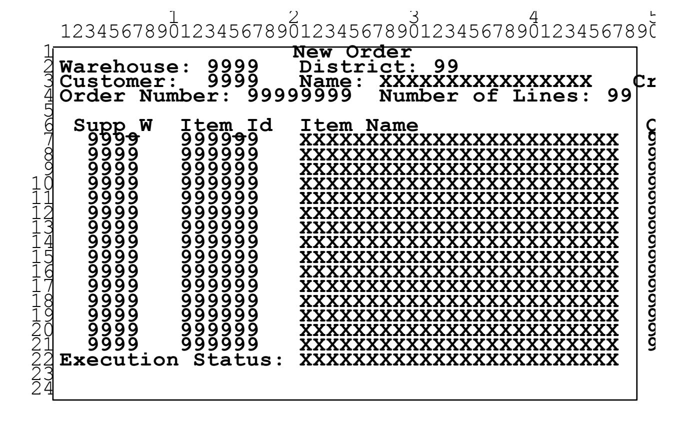

- 2.4.3.2 The emulated user must enter, in the appropriate fields of the input/ output screen, the required input data which is divided in two groups and organized as follows:
  - Two fields: D\_ID and C\_ID.

**Comment:** The value for *ol\_cnt* cannot be entered, but must be determined by the application upon processing of the input data.

• One repeating group of fields: OL\_I\_ID, OL\_SUPPLY\_W\_ID and OL\_QUANTITY. The group is repeated *ol\_cnt* times (once per item in the order). The values of these fields are chosen as per Clause 2.4.1.5.

**Comment**: In order to maintain a reasonable amount of keyed input, the supply warehouse fields must be filled in for each item, even when the supply warehouse is the home warehouse.

- 2.4.3.3 The emulated terminal must display, in the appropriate fields of the input/output screen, all input data and the output data resulting from the execution of the transaction. The display fields are divided in two groups as follows:
  - One non-repeating group of fields: W\_ID, D\_ID, C\_ID, O\_ID, O\_OL\_CNT, C\_LAST, C\_CREDIT, C\_DISCOUNT, W\_TAX, D\_TAX, O\_ENTRY\_D, total\_amount, and an optional execution status message other than "Item number is not valid".

- One repeating group of fields: OL\_SUPPLY\_W\_ID, OL\_I\_ID, I\_NAME, OL\_QUANTITY, S\_QUANTITY, *brand\_generic,* I\_PRICE, and OL\_AMOUNT. The group is repeated O\_OL\_CNT times (once per item in the order), equal to the computed value of *ol\_cnt.*
- 2.4.3.4 For transactions that are rolled back as a result of an unused item number (1% of all New -Order transactions), the emulated terminal must display in the appropriate fields of the input/ output screen the fields: W\_ID, D\_ID, C\_ID, C\_LAST, C\_CREDIT, O\_ID, and the execution status message "Item number is not valid". Note that no execution status message is required for successfully committed transactions. However, this field may not display "Item number is not valid" if the transaction is successful.

**Comment**: The number of the rolled back order, O\_ID, must be displayed to verify that part of t he transaction was processed.

2.4.3.5 The following table summarizes the terminal I/ O requirements for the New-Order transaction:

|                     | Enter          | Display<br>After rollback | Display<br>Row/ Column           | Coordinates |
|---------------------|----------------|---------------------------|----------------------------------|-------------|
| Non-repeating Group |                | W_ID                      | W_ID                             | 2/ 12       |
|                     | D_ID           | D_ID                      | D_ID                             | 2/ 29       |
|                     | C_ID           | C_ID                      | C_ID                             | 3/ 12       |
|                     |                | C_LAST                    | C_LAST                           | 3/ 25       |
|                     |                | C_CREDIT                  | C_CREDIT                         | 3/ 52       |
|                     |                | C_DISCOUNT                |                                  | 3/ 64       |
|                     |                | W_TAX                     |                                  | 4/ 51       |
|                     |                | D_TAX                     |                                  | 4/ 67       |
|                     |                | O_OL_CNT                  |                                  | 4/ 42       |
|                     |                | O_ID                      | O_ID                             | 4/ 15       |
|                     |                | O_ENTRY_D                 |                                  | 2/ 61       |
|                     |                | <i>total-amount</i>       |                                  | 22/ 71      |
|                     |                |                           | "Item<br>number<br>is not valid" | 22/ 19      |
| Repeating Group     | OL_SUPPLY_W_ID | OL_SUPPLY_W_ID            |                                  | 7-22/ 3     |
|                     | OL_I_ID        | OL_I_ID                   |                                  | 7-22/ 10    |
|                     |                | I_NAME                    |                                  | 7-22/ 20    |
|                     | OL_QUANTITY    | OL_QUANTITY               |                                  | 7-22/ 45    |
|                     |                | S_QUANTITY                |                                  | 7-22/ 51    |
|                     |                | <i>brand-generic</i>      |                                  | 7-22/ 58    |
|                     |                | I_PRICE                   |                                  | 7-22/ 63    |
|                     |                | OL_AMOUNT                 |                                  | 7-22/ 72    |

2.4.3.6 For general terminal I/ O requirements, see Clause 2.2.

## **2.5 The Payment Transaction**

The Payment business transaction updates the customer's balance and reflects the payment on the district and warehouse sales statistics. It represents a light-weight, read -write transaction with a high frequency of execution and stringent response time requirements to satisfy on -line users. In addition, this transaction includes non-primary key access to the CUSTOMER table.

### **2.5.1 Input Data Generation**

- 2.5.1.1 For any given terminal, the home warehouse number (W\_ID) is constant over the whole measurement interval.
- 2.5.1.2 The district number (D\_ID) is randomly selected within [1 ..10] from the home warehouse (D\_W\_ID) = W\_ID). The customer is randomly selected 60% of the time by last name (C\_W\_ID , C\_D\_ID, C\_LAST) and 40% of the time by number (C\_W\_ID , C\_D\_ID , C\_ID). Independent of the mode of selection, the customer resident warehouse is the home warehouse 85% of the time and is a randomly selected remote warehouse 15% of the time. This can be implemented by generating two random numbers *x* and *y* within [1 .. 100];
  - If *x* <= 85 a customer is selected from the selected district number (C\_D\_ID = D\_ID) and the home warehouse number (C\_W\_ID = W\_ID). The customer is paying through h is/ her own warehouse.
  - If *x* > 85 a customer is selected from a random district number (C\_D\_ID is randomly selected within [1 .. 10]), and a random remote warehouse number (C\_W\_ID is randomly selected within the range of act ive warehouses (see Clause 4.2.2), and C\_W\_ID ≠ W\_ID). The customer is paying through a warehouse and a district other than his/ her own.
  - If *y* <= 60 a customer last name (C\_LAST) is generated according to Clause 4.3.2.3 from a non-uniform random value using the NURand (255,0,999) function. The customer is using his/ her last name and is one of the possibly several customers with that last name.

**Comment**: This case illustrates the situation when a customer does not use his/ her unique customer number.

• If *y* > 60 a non-uniform random customer number (C\_ID) is selected using the NURand (1023,1,3000) function. The customer is using his/ her customer number.

**Comment**: If the system is configured for a single warehouse, then all customers are selected from that single home warehouse.

- 2.5.1.3 The payment amount (H\_AMOUNT) is random ly selected within [1.00 .. 5,000.00].
- 2.5.1.4 The payment date (H\_DATE) in generated within the SUT by using the current system date and time.
- 2.5.1.5 A Payment transaction is said to be **home** if the customer belongs to the warehouse from which the payment is entered (when C\_W\_ID = W\_ID).
- 2.5.1.6 A Payment transaction is said to be **remote** if the warehouse from which the payment is entered is not the one to which the customer belongs (when C\_W\_ID does not equal W\_ID).

### **2.5.2 Transaction Profile**

- 2.5.2.1 The Payment transaction enters a customer's paym ent with a single database transaction and is comprised of:
  - **Case 1**, the customer is selected based on customer number:

3 row selections with data retrieval and update,

1 row insertion.

**Case 2**, the customer is selected based on customer last name:

2 row selections (on average) with data retrieval,

3 row selections with data retrieval and update,

1 row insertion.

**Note**: The above summary is provided for information only. The actual requirement is defined by the detailed transaction profile below.

- 2.5.2.2 For a given warehouse number (W\_ID), district number (D\_W\_ID , D\_ID), customer numbe r (C\_W\_ID , C\_D\_ID , C\_ ID) or customer last name (C\_W\_ID , C\_D\_ID , C\_LAST), and payment amount (H\_AMOUNT):
  - The input data (see Clause 2.5.3.2) are communicated to the SUT.
  - A database transaction is started.
  - The row in the WAREHOUSE table with matching W\_ID is selected. W\_NAME, W\_STREET\_1, W\_STREET\_2, W\_CITY, W\_STATE, and W\_ZIP are retrieved and W\_YTD, the warehouse's year-to-date balance, is increased by H\_ AMOUNT.
  - The row in the DISTRICT table with matching D\_W\_ID and D\_ID is selected. D\_NAME, D\_STREET\_1, D\_STREET\_2, D\_CITY, D\_STATE, and D\_ZIP are retrieved and D\_YTD, the district's year-to-date balance, is increased by H\_AMOUNT.
  - **Case 1**, the customer is selected based on customer number: the row in the CUSTOMER table with matching C\_W\_ID, C\_D\_ID and C\_ID is selected. C\_FIRST, C\_MIDDLE, C\_LAST, C\_STREET\_1, C\_STREET\_2, C\_CITY, C\_STATE, C\_ZIP, C\_PHONE, C\_SINCE, C\_CREDIT, C\_CREDIT\_LIM, C\_DISCOUNT, and C\_BALAN CE are retrieved. C\_BALANCE is decreased by H\_AMOUNT. C\_YTD\_PAYMENT is increased by H\_AMOUNT. C\_PAYMENT\_CNT is incremented by 1.
    - **Case 2**, the customer is selected based on customer last name: all rows in the CUSTOMER table with matching C\_W\_ID, C\_D\_ID and C\_LAST are selected sorted by C\_FIRST in ascending order. Let *n* be the number of rows selected. C\_ID, C\_FIRST, C\_MIDDLE, C\_STREET\_1, C\_STREET\_2, C\_CITY, C\_STATE, C\_ZIP, C\_PHONE, C\_SINCE, C\_CREDIT, C\_CREDIT\_LIM, C\_DISCOUNT, and C\_BALAN CE are retrieved from the row at position (*n*/ 2 rounded up to the next integer) in the sorted set of selected rows from the CUSTOMER table. C\_BALANCE is decreased by H\_AMOUNT. C\_YTD\_PAYMENT is increased by H\_AMOUNT. C\_PAYMENT\_CNT is incremented by 1.
  - If the value of C\_CREDIT is equal to "BC", then C\_DATA is also retrieved from the selected customer and the following history information: C\_ID, C\_D\_ID, C\_W\_ID, D\_ID, W\_ID, and H\_AMOUNT, are inserted at the left of the C\_DATA field by shifting the existing content of C\_DATA to the right by an equal number of bytes and by discarding the bytes that are shifted out of the right side of the C\_DATA field. The content of the C\_DATA field never exceeds 500 characters. The selected customer is updated with the new C\_DATA field. If C\_DATA is implemented as two field s (see Clause 1.4.9), they must be treated and operated on as one single field.

**Comment**: The format used to store the history information must be such that its display on the input/output screen is in a readable format. (e.g. the W\_ID portion of C\_DATA must use the same display format as the output field W\_ID).

- H\_DATA is built by concatenating W\_NAME and D\_NAME separated by 4 spaces.
- A new row is inserted into the HISTORY table with H\_C\_ID = C\_ID, H\_C\_D\_ID = C\_D\_ID, H\_C\_W\_ID = C\_W\_ID, H\_D\_ID = D\_ID, and H\_W\_ID = W\_ID.
- The database transaction is committed.
- The output data (see Clause 2.5.3.3) are communicated to the terminal.

### 2.5.3 Terminal I/O

2.5.3.1 For each transaction the originating terminal must display the following input/ output screen with all input and output fields cleared (with either spaces or zeros) except for the Warehouse field which has not changed and must display the fixed W\_ID value associated with that terminal. In addition, all address fields (i.e., W\_STREET\_1, W\_STREET\_2, W\_CITY, W\_STATE, and W\_ZIP) of the warehouse may display the fixed values for these fields if these values were already retrieved in a previous transaction.

1234567890123456789012345678901234567890 Payment Date: DD-MM-YYYY hh:mm:ss 9999 Warehouse: XXXXXXXXXXXXXXXXXXX XXXXXXXXXXXXXXXXXXX XX XXXXX-XXXX 9999 Customer: Cust-Warehouse: Cust-XXXXXXXXXXXXXXX XX XXXXXXXXXXXXXX Name: XXXXXXXXXXXXXXXXX XXXXXXXXXXXXXXXXXXXXXX XXXXXXXXXXXXXXXXXXXXXXXXXXXXXXXXXXXXXX Amount Paid: Credit Limit: \$9999.99 \$999999999.99 New Cust-Cust-Data: XXXXXXXXXXXXXXXXXXXXXXXXXXXXXXXXXXXXXXX XXXXXXXXXXXXXXXXXXXXXXXXXXXXXXXXXXXXXX

2.5.3.2 The emulated user must enter, in the appropriate fields of the input/output screen, the required input data which is organized as the distinct fields: D\_ID, C\_ID or C\_LAST, C\_D\_ID, C\_W\_ID, and H\_AMOUNT.

**Comment**: In order to maintain a reasonable amount of keyed input, the customer warehouse field must be filled in even when it is the same as the home warehouse.

2.5.3.3 The emulated terminal must display, in the appropriate fields of the input/ output screen, all input data and the output data resulting from the execution of the transaction. The following fields are displayed: W\_ID, D\_ID, C\_ID, C\_D\_ID, C\_W\_ID, W\_STREET\_1, W\_STREET\_2, W\_CITY, W\_STATE, W\_ZIP, D\_STREET\_1, D\_STREET\_2, D\_CITY, D\_STATE, D\_ZIP, C\_FIRST, C\_MIDDLE, C\_LAST, C\_STREET\_1, C\_STREET\_2, C\_CITY, C\_STATE, C\_ZIP, C\_PHONE, C\_SINCE, C\_CREDIT, C\_CREDIT\_LIM, C\_DISCOUNT, C\_BALAN CE, the first 200 characters of C\_DATA (only if C\_CREDIT = "BC"), H\_AMOUNT, and H\_DATE.

2.5.3.4 The following table summarizes the terminal I/ O requirements for the Payment transaction :

|                                              | Enter       | Display<br>Row/ Column | Coordinates |   |
|----------------------------------------------|-------------|------------------------|-------------|---|
| Non-repeating Group                          |             | W_ID                   | 4/ 12       |   |
|                                              | D_ID        | D_ID                   | 4/ 52       |   |
|                                              | C_ID 1      | C_ID                   | 9/ 11       |   |
|                                              | C_D_ID      | C_D_ID                 | 9/ 54       |   |
|                                              | C_W_ID      | C_W_ID                 | 9/ 33       |   |
|                                              | H_AMOUNT    | H_AMOUNT               | 15/ 24      |   |
|                                              |             | H_DATE                 | 2/ 7        |   |
|                                              |             | W_STREET_1             | 5/ 1        |   |
|                                              |             | W_STREET_2             | 6/ 1        |   |
|                                              |             | W_CITY                 | 7/ 1        |   |
|                                              |             | W_STATE                | 7/ 22       |   |
|                                              |             | W_ZIP                  | 7/ 25       |   |
|                                              |             | D_STREET_1             | 5/ 42       |   |
|                                              |             | D_STREET_2             | 6/ 42       |   |
|                                              |             | D_CITY                 | 7/ 42       |   |
|                                              |             | D_STATE                | 7/ 63       |   |
|                                              |             | D_ZIP                  | 7/ 66       |   |
|                                              |             | C_FIRST                | 10/ 9       |   |
|                                              |             | C_MIDDLE               | 10/ 26      |   |
|                                              | 2<br>C_LAST | C_LAST                 | 10/ 29      |   |
|                                              |             | C_STREET_1             | 11/ 9       |   |
|                                              |             | C_STREET_2             | 12/ 9       |   |
|                                              |             | C_CITY                 | 13/ 9       |   |
|                                              |             | C_STATE                | 13/ 30      |   |
|                                              |             | C_ZIP                  | 13/ 33      |   |
|                                              |             | C_PHONE                | 13/ 58      |   |
|                                              |             | C_SINCE                | 10/ 58      |   |
|                                              |             | C_CREDIT               | 11/ 58      |   |
|                                              |             | C_CREDIT_LIM           | 16/ 18      |   |
|                                              |             | C_DISCOUNT             | 12/ 58      |   |
|                                              |             | C_BALANCE              | 15/ 56      |   |
|                                              |             | C_DATA 3               | 18-21/ 12   |   |
| 1 Enter only for payment by customer number  |             |                        |             | 2 |
| Enter only for payment by customer last name |             |                        |             |   |
|                                              |             |                        |             |   |

Enter only for payment by customer last name **3** Display the first 200 characters only if C\_CREDIT = "BC"

2.5.3.5 For general terminal I/ O requirements, see Clause 2.2.

## **2.6 The Order-Status Transaction**

The Order-Status business transaction queries the status of a customer's last order. It represents a mid -weight read only database transaction with a low frequency of execution and response time requirement to satisfy on -line users. In addition, this table includes non -primary key access to the CUSTOMER table.

### **2.6.1 Input Data Generation**

- 2.6.1.1 For any given terminal, the home warehouse number (W\_ID) is constant over the whole measurement interval.
- 2.6.1.2 The district number (D\_ID) is randomly selected within [1 ..10] from the home warehouse. The customer is randomly selected 60% of the time by last name (C\_W\_ID, C\_D\_ID, C\_LAST) and 40% of the time by number (C\_W\_ID, C\_D\_ID, C\_ID) from the selected district (C\_D\_ID = D\_ID) and the home warehouse number (C\_W\_ID = W\_ID). This can be implemented by generating a random number *y* within [1 .. 100];
  - If *y* <= 60 a customer last name (C\_LAST) is generated according to Clause 4.3.2.3 from a non -uniform random value using the NURand(255,0,999) function. The customer is using his/ her last name and is one of the, possibly several, customers with that last name.

**Comment**: This case illustrates the situation when a customer does not use his/ her unique customer number.

• If *y* > 60 a non-uniform random customer number (C\_ID) is selected using the NURand (1023,1,3000) function. The customer is using his/ her customer number.

### **2.6.2 Transaction Profile**

- 2.6.2.1 Querying for the status of an order is done in a single database transaction with the following steps:
  - 1. Find the customer and his/ her last order, comprised of:
    - **Case 1**, the customer is selected based on customer number:
      - 2 row selections with data retrieval.
    - **Case 2**, the customer is selected based on customer last name:
      - 4 row selections (on average) with data retrieval.
  - 2. Check status (delivery date) of each item on the order (average items-per-order = 10), comprised of:
    - (1 \* items-per-order) row selections with data retrieval.

**Note**: The above summary is provided for information only. The actual requirement is defined by the detailed transaction profile below.

- 2.6.2.2 For a given customer number (C\_W\_ID , C\_D\_ID , C\_ ID):
  - The input data (see Clause 2.6.3.2) are communicated to the SUT.
  - A database transaction is started.
  - **Case 1**, the customer is selected based on customer number: the row in the CUSTOMER table with matching C\_W\_ID, C\_D\_ID, and C\_ID is selected and C\_BALAN CE, C\_FIRST, C\_MIDDLE, and C\_LAST are retrieved.

- Case 2, the customer is selected based on customer last name: all rows in the CUSTOMER table with matching  $C_W_{ID}$ ,  $C_D_{ID}$  and  $C_L_{AST}$  are selected sorted by  $C_T_{IRST}$  in ascending order. Let n be the number of rows selected.  $C_D_{ID}$  and  $C_D_{IRST}$ ,  $C_D_{ID}$  and  $C_D_{IRST}$ , and  $C_D_{IRST}$  are retrieved from the row at position n/2 rounded up in the sorted set of selected rows from the CUSTOMER table.
- The row in the ORDER table with matching O\_W\_ID (equals C\_W\_ID), O\_D\_ID (equals C\_D\_ID), O\_C\_ID (equals C\_ID), and with the largest existing O\_ID, is selected. This is the most recent order placed by that customer. O\_ID, O\_ENTRY\_D, and O\_CARRIER\_ID are retrieved.
- All rows in the ORDER-LINE table with matching OL\_W\_ID (equals O\_W\_ID), OL\_D\_ID (equals O\_D\_ID), and OL\_O\_ID (equals O\_ID) are selected and the corresponding sets of OL\_I\_ID, OL\_SUPPLY\_W\_ID, OL\_QUANTITY, OL\_AMOUNT, and OL\_DELIVERY\_D are retrieved.
- The database transaction is committed.

**Comment:** a commit is not required as long as all ACID properties are satisfied (see Clause 3).

• The output data (see Clause 2.6.3.3) are communicated to the terminal.

### 2.6.3 Terminal I/O

2.6.3.1 For each transaction the originating terminal must display the following input/ output screen with all input and output fields cleared (with either spaces or zeros) except for the Warehouse field which has not changed and must display the fixed W\_ID value associated with that terminal.

123456789012345678901234567890123456789012345678901234567890123456789012345678901234567890123456789012345678901234567890123456789012345678901234567890123456789012345678901234567890123456789012345678901234567890123456789012345678901234567890123456789012345678901234567890123456789012345678901234567890123456789012345678901234567890123456789012345678901234567890123456789012345678901234567890123456789012345678901234567890123456789012345678901234567890123456789012345678901234567890123456789012345678901234567890123456789012345678901234567890123456789012345678901234567890123456789012345678901234567890123456789012345678901234567890123456789012345678901234567890123456789012345678901234567890123456789012345678901234567890123456789012345678901234567890123456789012345678901234567890123456789012345678901234567890123456789012345678901234567890123456789012345678901234567890123456789012345678901234567890123456789012345678901234567890123456789012345678901234567890123456789012345678901234567890123456789012345678901234567890123456789012345678901234567890123456789012345678901234567890123456789012345678901234567890123456789012345678901234567890123456789012345678901234567890123456789012345678901234567890123456789012345678901234567890123456789012345678901234567890123456789012345678901234567890123456789012345678901234567890123456789012345678901234567890123456789012345678901234567890123456789012345678901234567890123456789012345678901234567890123456789012345678901234567890123456789012345678901234567890123456789012345678901234567890123456789012345678901234567890123456789012345678901234567890123456789012345678901234567890123456789012345678901234567890123456789012345678901234567890123456789012345678901234567890123456789012345678901234567890123456789012345678901234567890123456789012345678901234567890123456789012345678901234567890123456789012345678901234567890123456789012345678901234567890123456789012345678901234567890123456789012345678901234567890123456789012345678901234567890123456789012345678901234567890123456789012345678901234567890123456

2.6.3.2 The emulated user must enter, in the appropriate field of the input/output screen, the required input data which is organized as the distinct fields: D ID and either C ID or C LAST.

- 2.6.3.3 The emulated terminal must display, in the approp riate fields of the input/ output screen, all input data and the output data resulting from the execution of the transaction. The display field s are divided in two groups as follows:
  - One non-repeating group of fields: W\_ID, D\_ID, C\_ID, C\_FIRST, C\_MIDDLE, C\_LAST, C\_BALANCE, O\_ID, O\_ENTRY\_D, and O\_CARRIER\_ID;
  - One repeating group of fields: OL\_SUPPLY\_W\_ID, OL\_I\_ID, OL\_QUANTITY, OL\_AMOUNT, and OL\_DELIVERY\_D. The group is repeated O\_OL\_CNT times (once per item in the order).

**Comment 1**: The order of items shown on the Order-Status screen does not need to match the order in which the items were entered in its corresponding New -Order screen.

**Comment 2**: If OL\_DELIVERY\_D is null (i.e., the order has not been delivered), the terminal must display an implementation specific null date representation (e.g., blanks, 99-99-9999, etc.). The chosen null date representation must not change during the test.

2.6.3.4 The following table summarizes the terminal I/ O requirements for the Order-Status transaction:

|                                            | Enter   | Display<br>Row/ Column | Coordinates |
|--------------------------------------------|---------|------------------------|-------------|
| Non-repeating Group                        |         | W_ID                   | 2/ 12       |
|                                            | D_ID    | D_ID                   | 2/ 29       |
|                                            | C_ID1   | C_ID                   | 3/ 11       |
|                                            |         | C_FIRST                | 3/ 24       |
|                                            |         | C_MIDDLE               | 3/ 41       |
|                                            | C_LAST2 | C_LAST                 | 3/ 44       |
|                                            |         | C_BALANCE              | 4/ 16       |
|                                            |         | O_ID                   | 6/ 15       |
|                                            |         | O_ENTRY_D              | 6/ 38       |
|                                            |         | O_CARRIER_ID           | 6/ 76       |
| Repeating Group                            |         | OL_SUPPLY_W_ID         | 8-22/ 3     |
|                                            |         | OL_I_ID                | 8-22/ 14    |
|                                            |         | OL_QUANTITY            | 8-22/ 25    |
|                                            |         | OL_AMOUNT              | 8-22/ 33    |
|                                            |         | OL_DELIVERY_D          | 8-22/ 47    |
| 1 Enter only for query by customer number. |         |                        |             |

<sup>2.6.3.5</sup> For general terminal I/ O requirements, see Clause 2.2.

## **2.7 The Delivery Transaction**

The Delivery business transaction consists of processing a batch of 10 new (not yet delivered) orders. Each order is processed (delivered) in full within the scope of a read -write database transaction. The number of orders delivered as a group (or batched) within the same database transaction is implementation specific. The business transaction, comprised of one or more (up to 10) database transactions, has a low frequency of execution and must complete within a relaxed response time requirement.

The Delivery transaction is intended to be executed in deferred mode through a queuing mechanism, rather than interactively, with terminal response indicating transaction completion. The result of the deferred execution is recorded into a result file.

### **2.7.1 Input Data Generation**

- 2.7.1.1 For any given terminal, the home warehouse number (W\_ID) is constant over the whole measurement interval.
- 2.7.1.2 The carrier number (O\_CARRIER\_ID) is random ly selected within [1 .. 10].
- 2.7.1.3 The delivery date (OL\_DELIVERY\_D) is generated within the SUT by using the current system date and time.

### **2.7.2 Deferred Execution**

- 2.7.2.1 Unlike the other transactions in this benchmark, the Delivery transaction must be executed in deferred mode. This mode of execution is primarily characterized by queuing the transaction for defe rred execution, returning control to the originating terminal independently from the completion of the transaction, and recording execution information into a result file.
- 2.7.2.2 Deferred execution of the Delivery transaction must adhere to the following rules:
  - 1. The business transaction is queued for deferred execution as a result of entering the last input character.
  - 2. The deferred execution of the business transaction must follow the profile defined in Clause 2.7.4 with the input data defined in Clause 2.7.1 as entered through the input/ output screen and communicated to the deferred execution queue.
  - 3. At least 90% of the business transaction s must complete within 80 seconds of their being queued for execution.
  - 4. Upon completion of the business transaction , the following information must have been recorded into a result file:
    - The time at which the business transaction was queued.
    - The warehouse number (W\_ID) and the carried number (O\_CARRIER\_ID) associated with the business transaction.
    - The district number (D\_ID) and the order number (O\_ID) of each order delivered by the business transaction.
    - The time at which the business transaction completed.

- 2.7.2.3 The **result file** associated with the deferred execution of the Delivery business transaction is only for the purpose of recording information about that transaction and is not relevant to the business function being performed. The result file must adhere to the following rules:
  - 1. All events must be completed before the related information is recorded (e.g., the recording of a district and order number must be done after the database transaction, within which this order was delivered, has been committed);
  - 2. No ACID property is required (e.g., the recording of a district and order number is not required to be atomic with the actual delivery of that order) as the result file is used for benchmarking purposes only.
  - 3. During the measurement interval the result file must be located either on a durable medium (see clause 3.5.1) or in the internal memory of the SUT. In this last case, the result file must be transferred onto a durable medium after the last measurement interval of the test run (see Clause 5.5).

### 2.7.3 Terminal I/O

2.7.3.1 For each transaction the originating terminal must display the following input/ output screen with all input and output fields cleared (with either spaces or zeros) except for the Warehouse field which has not changed and must display the fixed W\_ID value associated with that terminal.

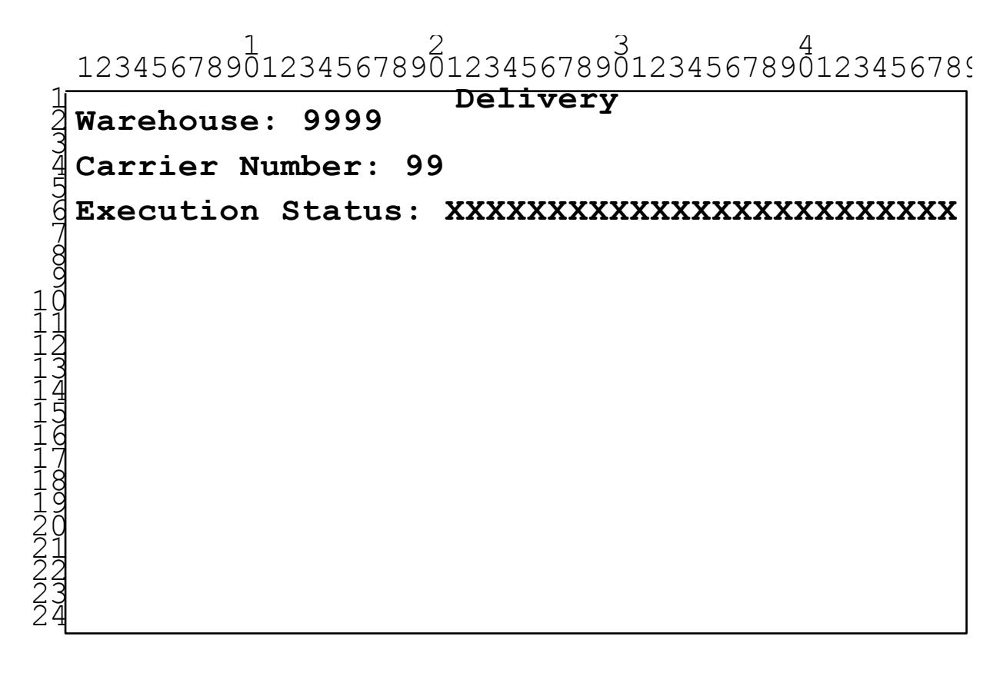

- 2.7.3.2 The emulated user must enter, in the appropriate input field of the input/ output screen, the required input data which is organized as one distinct field: O\_CARRIER\_ID.
- 2.7.3.3 The emulated terminal must display, in the appropriate output field of the input/output screen, all input data and the output data which results from the queuing of the transaction. The following fields are displayed: W\_ID, O\_CARRIER\_ID, and the status message "Delivery has been queued".

#### 2.7.3.4 The following table summarizes the terminal I/ O requirements for the Delivery transaction :

|                     | Enter        | Display<br>Row/ Column                             | Coordinates             |
|---------------------|--------------|----------------------------------------------------|-------------------------|
| Non-repeating Group | O_CARRIER_ID | W_ID<br>O_CARRIER_ID<br>"Delivery has been queued" | 2/ 12<br>4/ 17<br>6/ 19 |

2.7.3.5 For general terminal I/ O requirements, see Clause 2.2.

### **2.7.4 Transaction Profile**

- 2.7.4.1 The deferred execution of the Delivery transaction delivers one outstanding order (average items-perorder = 10) for each one of the 10 districts of the selected warehouse using one or more (up to 10) d atabase transactions. Delivering each order is done in the following steps:
  - 1. Process the order, comprised of:
    - 1 row selection with data retrieval,
    - (1 + items-per-order) row selections with data retrieval and update.
  - 2. Update the customer's balance, comprised of:
    - 1 row selections with data update.
  - 3. Remove the order from the new-order list, comprised of:

1 row deletion.

**Comment**: This business transaction can be done within a single database transaction or broken down into up to 10 database transactions to allow the test sponsor the flexibility to implement the business transaction with the most efficient number of database transactions.

**Note**: The above summary is provided for information only. The actual requirement is defined by the detailed transaction profile below.

- 2.7.4.2 For a given warehouse number (W\_ID), for each of the 10 districts (D\_W\_ID , D\_ID) within that warehouse, and for a given carrier number (O\_CARRIER\_ID):
  - The input data (see Clause 2.7.3.2) are retrieved from the deferred execution queue.
  - A database transaction is started unless a database transaction is already active from being started as part of the delivery of a previous order (i.e., more than one order is delivered within the same database transaction).
  - The row in the NEW-ORDER table with matching NO\_W\_ID (equals W\_ID) and NO\_D\_ID (equals D\_ID) and with the lowest NO\_O\_ID value is selected. This is the oldest undelivered order of that district. NO\_O\_ID, the order number, is retrieved. If no matching row is found, then the delivery of an order for this district is skipped. The condition in which no outstandin g order is present at a given district must be handled by skipping the delivery of an order for that district only and resuming the delivery of an order from all remaining districts of the selected warehouse. If this condition occurs in more than 1%, or in more than one, whichever is greater, of the business transaction s, it must be reported. The result file must be organized in such a way that the percentage of skipped deliveries and skipped districts can be determined.

- The selected row in the NEW-ORDER table is deleted.
- The row in the ORDER table with matching O\_W\_ID (equals W\_ ID), O\_D\_ID (equals D\_ID), and O\_ID (equals NO\_O\_ID) is selected, O\_C\_ID, the customer number, is retrieved, and O\_CARRIER\_ID is updated.
- All rows in the ORDER-LINE table with matching OL\_W\_ID (equals O\_W\_ID), OL\_D\_ID (equals O\_D\_ID), and OL\_O\_ID (equals O\_ID) are selected. All OL\_DELIVERY\_D, the delivery dates, are updated to the current system time as returned by the operating system and the sum of all OL\_AMOUNT is retrieved.
- The row in the CUSTOMER table with matching C\_W\_ID (equals W\_ID), C\_D\_ID (equals D\_ID), and C\_ID (equals O\_C\_ID) is selected and C\_BALANCE is increased by the sum of all order-line amounts (OL\_AMOUNT) previously retrieved. C\_DELIVERY\_CNT is incremented by 1.
- The database transaction is committed unless more ord ers will be delivered within this database transaction.
- Information about the delivered order (see Clause 2.7.2.2) is recorded into the result file (see Clause 2.7.2.3).

## **2.8 The Stock-Level Transaction**

The Stock-Level business transaction determines the number of recently sold items that have a stock level below a specified threshold. It represents a heavy read -only database transaction with a low frequency of execution, a relaxed response time requirement, and relaxed consistency requirements.

### **2.8.1 Input Data Generation**

- 2.8.1.1 Each terminal must use a unique value of (W\_ID, D\_ID) that is constant over the whole measurement, i.e., D\_IDs cannot be re-used within a warehouse.
- 2.8.1.2 The threshold of minimum quantity in stock (threshold ) is selected at random within [10 .. 20].

### **2.8.2 Transaction Profile**

- 2.8.2.1 Examining the level of stock for items on the last 20 orders is done in one or more database transactions with the following steps:
  - 1. Examine the next available order number, comprised of:
    - 1 row selection with data retrieval.
  - 2. Examine all items on the last 20 orders (average items-per-order = 10) for the district, comprised of:
    - (20 \* items-per-order) row selections with data retrieval.
  - 3. Examine, for each distinct item selected, if the level of stock available at the home warehouse is be low the threshold, comprised of:
    - At most (20 \* items-per-order) row selections with data retrieval.

**Note**: The above summary is provided for information only. The actual requirement is defined by the detailed transaction profile below.

- 2.8.2.2 For a given warehouse number (W\_ID), district num ber (D\_W\_ID , D\_ID), and stock level threshold (*threshold*):
  - The input data (see Clause 2.8.3.2) are communicated to the SUT.
  - A database transaction is started.
  - The row in the DISTRICT table with matching D\_W\_ID and D\_ID is selected and D\_NEXT\_O\_ID is retrieved.
  - All rows in the ORDER-LINE table with matching OL\_W\_ID (equals W\_ID), OL\_D\_ID (equals D\_ID), and OL\_O\_ID (lower than D\_NEXT\_O\_ID and greater than or equal to D\_NEXT\_O\_ID minus 20) are selected. They are the items for 20 recent orders of the district.
  - All rows in the STOCK table with matching S\_I\_ID (equals OL\_I\_ID) and S\_W\_ID (equals W\_ID) from the list of distinct item numbers and with S\_QUANTITY lower than *threshold* are counted (giving *low\_stock*).

**Comment**: Stocks must be counted only for distinct items. Thus, items that have been ordered more than once in the 20 selected orders must be aggregated into a single summary count for t hat item.

- The current database transaction is committed.
  - **Comment**: A commit is not needed as long as all the required ACID properties are satisfied (see Clause 2.8.2.3).
- The output data (see Clause 2.8.3.3) are communicated to the terminal.
- 2.8.2.3 Full serializability and repeatable reads are not required for the Stock-Level business transaction. All data read must be committed and no older than the most recently committed data prior to the time this business transaction was initiated. All other ACID properties must be maintained.

**Comment:** This clause allows the business transaction to be broken down into more than one database transaction.

### 2.8.3 Terminal I/O

2.8.3.1 For each transaction the originating terminal must display the following input/ output screen with all input and output fields cleared (with either spaces or zeros) except for the Warehouse and District fields which have not changed and must display the fixed W\_ID and D\_ID values associated with that terminal.

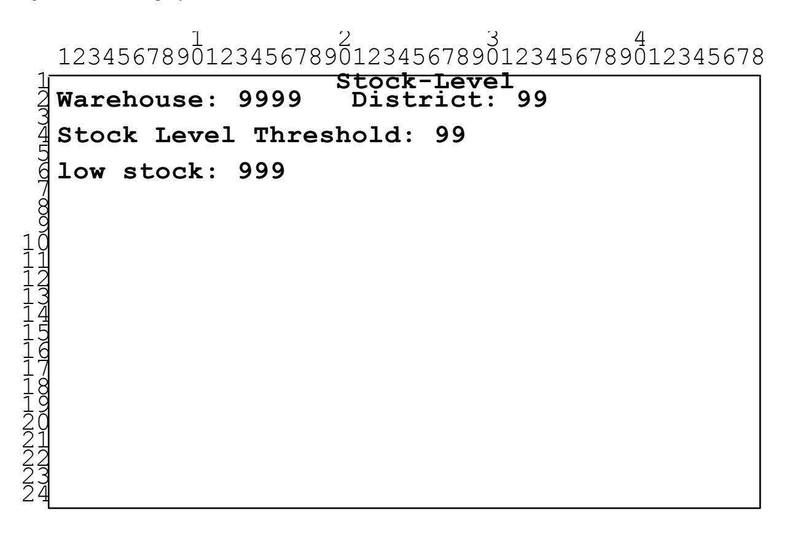

- 2.8.3.2 The emulated user must enter, in the appropriate field of the input/output screen, the required input data which is organized as the distinct field: *threshold*.
- 2.8.3.3 The emulated terminal must display, in the appropriate field of the input/output screen, all input data and the output data which results from the execution of the transaction. The following fields are displayed: W\_ID, D\_ID, threshold, and low\_stock.

#### 2.8.3.4 The following table summarizes the terminal I/ O requirements for the Stock-Level transaction:

| Enter               | Display<br>Row/ Column | Coordinates |
|---------------------|------------------------|-------------|
| Non-repeating Group | W_ID                   | 2/ 12       |
|                     | D_ID                   | 2/ 29       |
| <i>threshold</i>    | <i>threshold</i>       | 4/ 24       |
|                     | low_stock              | 6/ 12       |

2.8.3.5 For general terminal I/ O requirements, see Clause 2.2.

# **Clause 3: TRANSACTION and SYSTEM PROPERTIES**

## **3.1 The ACID Properties**

It is the intent of this section to informally define the ACID properties and to sp ecify a series of tests that must be performed to demonstrate that these properties are met.

- 3.1.1 The ACID (Atomicity, Consistency, Isolation, and Durability) properties of transaction processing systems must be supported by the system under test during the running of this benchmark. The only exception to this rule is to allow non-repeatable reads for the Stock-Level transaction (see Clause 2.8.2.3).
- 3.1.2 No finite series of tests can prove that the ACID properties are fully supported. Passing the specified tests is a necessary, but not sufficient, condition for meeting the ACID requirements. However, for fairness of reporting, only the tests specified here are required and must appear in the Full Disclosure Report for this benchmark.

**Comment**: These tests are intended to demonstrate that the ACID principles are supported by the SUT and enabled during the performance measurement interval. They are not intended to be an exhaustive quality assurance test.

- 3.1.3 All mechanisms needed to insure full ACID properties must be enabled during both the test period and the 8 hours of steady state. For example, if the system under test relies on undo logs, then logging must be enabled for all transactions including those which d o not include rollback in the transaction profile. When this benchmark is implemented on a distributed system , tests must be performed to verify that home and remote transactions, including remote transactions that are processed on two or more nodes, satisfy the ACID properties (See Clauses 2.4.1.7, 2.4.1.8, 2.5.1.5, and 2.5.1.6 for th e definition of home and remote transactions).
- 3.1.4 Although the ACID tests d o not exercise all transaction types of TPC-C, the ACID properties must be satisfied for all the TPC-C transactions.
- 3.1.5 Test sponsors reporting TPC results may perform ACID tests on any one system for which results have been disclosed, provided that they use the same software executables (e.g., operating system , data manager, transaction programs). For example, this clause would be applicable when results are reported for multiple systems in a product line. However, the durability tests described in Clauses 3.5.3.2 and 3.5.3.3 must be run on all the system s that are measured. All Full Disclosure Reports m ust identify the systems which were used to verify ACID requirements and full details of the ACID tests conducted and results obtained.

**Comment**: All required ACID tests must be performed on newly optimized binaries even if there have not been any source code changes.

## **3.2 Atomicity Requirements**

### **3.2.1 Atomicity Property Definition**

The system under test must guarantee that database transactions are atomic; the system will either perform all individual operations on the data, or will assure that no partially -completed operations leave any effects on the data.

### **3.2.2 Atomicity Tests**

- 3.2.2.1 Perform the Payment transaction for a randomly selected warehouse, district, and customer (by customer number as specified in Clause 2.5.1.2) and verify that the records in the CUSTOMER, DISTRICT, and WAREHOUSE tables have been changed appropriately.
- 3.2.2.2 Perform the Payment transaction for a randomly selected warehouse, district, and customer (by customer number as specified in Clause 2.5.1.2) and substitute a ROLLBACK of the transaction for the COMMIT of the transaction. Verify that the records in the CUSTOMER, DISTRICT, and WAREHOUSE tables have NOT been changed.

## **3.3 Consistency Requirements**

### **3.3.1 Consistency Property Definition**

Consistency is the property of the application that requires any execution of a database transaction to take the database from one consistent state to another, assuming that the database is initially in a consistent state .

### **3.3.2 Consistency Conditions**

Twelve consistency conditions are defined in the following clauses to specify the level of database consistency required across the mix of TPC-C transactions. A database, when populated as defined in Clause 4.3, must meet all of these conditions to be consistent. If data is replicated, each copy must meet these conditions. Of the twelve conditions, explicit demonstration that the conditions are satisfied is required for the first four only. Demonstration of the last eight consistency conditions is not required because of the lengthy tests which would be necessary.

**Comment 1**: The consistency conditions were chosen so that they would remain valid within the context of a larger order-entry application that includes the five TPC-C transactions (See Clause 1.1.). They are designed to be independent of the length of time for which such an application would be e xecuted. Thus, for example, a condition involving I\_PRICE was not included here since it is conceivable that within a larger application I\_PRICE is modified from time to time.

**Comment 2**: For Consistency Conditions 2 and 4 (Clauses 3.3.2.2 and 3.3.2.4), sam pling the first, last, and two random warehouses is sufficient.

#### 3.3.2.1 Consistency Condition 1

Entries in the WAREHOUSE and DISTRICT tables must satisfy the relationship:

$$W_{YTD} = sum(D_{YTD})$$

for each warehouse defined by (W\_ID = D\_W\_ID).

#### 3.3.2.2 Consistency Condition 2

Entries in the DISTRICT, ORDER, and NEW-ORDER tables must satisfy the relationship:

$$D_NEXT_O_ID - 1 = max(O_ID) = max(NO_O_ID)$$

for each district defined by (D\_W\_ID = O\_W\_ID = NO\_W\_ID) and (D\_ID = O\_D\_ID = NO\_D\_ID). This condition does not apply to the NEW-ORDER table for any districts which have no outstanding new orders (i.e., the numbe r of rows is zero).

#### 3.3.2.3 Consistency Condition 3

Entries in the NEW-ORDER table must satisfy the relationship:

$$max(NO\_O\_ID) - min(NO\_O\_ID) + 1 = [number of rows in the NEW-ORDER table for this district]$$

for each district defined by NO\_W\_ID and NO\_D\_ID. This condition does not apply to any districts which have no outstanding new orders (i.e., the number of rows is zero).

#### 3.3.2.4 Consistency Condition 4

Entries in the ORDER and ORDER-LINE tables must satisfy the relationship:

sum(O\_OL\_CNT) = [number of rows in the ORDER-LINE table for this district]

for each district defined by (O\_W\_ID = OL\_W\_ID) and (O\_D\_ID = OL\_D\_ID).

#### 3.3.2.5 Consistency Condition 5

For any row in the ORDER table, O\_CARRIER\_ID is set to a null value if and only if there is a corresponding row in the NEW-ORDER table defined by (O\_W\_ID, O\_D\_ID, O\_ID) = (NO\_W\_ID, NO\_D\_ID, NO\_O\_ID).

#### 3.3.2.6 Consistency Condition 6

For any row in the ORDER table, O\_OL\_CNT must equal the number of rows in the ORDER-LINE table for the corresponding order defined by (O\_W\_ID, O\_D\_ID, O\_ID) = (OL\_W\_ID, OL\_D\_ID, OL\_O\_ID).

#### 3.3.2.7 Consistency Condition 7

For any row in the ORDER-LINE table, OL\_DELIVERY\_D is set to a null date/ time if and only if the corresponding row in the ORDER table defined by (O\_W\_ID, O\_D\_ID, O\_ID) = (OL\_W\_ID, OL\_D\_ID, OL\_O\_ID) has O\_CARRIER\_ID set to a null value.

#### 3.3.2.8 Consistency Condition 8

Entries in the WAREHOUSE and HISTORY tables must satisfy the relationship:

$$W_{TD} = sum(H_{AMOUNT})$$

for each warehouse defined by (W\_ID = H\_W\_ID).

#### 3.3.2.9 Consistency Condition 9

Entries in the DISTRICT and HISTORY tables must satisfy the relationship:

$$D_{YTD} = sum(H_AMOUNT)$$

for each district defined by (D\_W\_ID, D\_ID) = (H\_W\_ID, H\_D\_ID).

3.3.2.10 Consistency Condition 10

Entries in the CUSTOMER, HISTORY, ORDER, and ORDER-LINE tables must satisfy the relationship:

$$C_BALANCE = sum(OL_AMOUNT) - sum(H_AMOUNT)$$

where:

H\_AMOUNT is selected by (C\_W\_ID, C\_D\_ID, C\_ID) = (H\_C\_W\_ID, H\_C\_D\_ID, H\_C\_ID)

and

OL\_AMOUNT is selected by:

(OL\_W\_ID, OL\_D\_ID, OL\_O\_ID) = (O\_W\_ID, O\_D\_ID, O\_ID) and (O\_W\_ID, O\_D\_ID, O\_C\_ID) = (C\_W\_ID, C\_D\_ID, C\_ID) and (OL\_DELIVERY\_D is not a null value)

3.3.2.11 Consistency Condition 11

Entries in the CUSTOMER, ORDER and NEW-ORDER tables must satisfy the relationship:

```
(count(*) from ORDER) - (count(*) from NEW-ORDER) = 2100
```

for each district defined by (O\_W\_ID, O\_D\_ID) = (NO\_W\_ID, NO\_D\_ID) = (C\_W\_ID, C\_D\_ID).

3.3.2.12 Consistency Condition 12

Entries in the CUSTOMER and ORDER-LINE tables must satisfy the relationship:

$$C_BALANCE + C_YTD_PAYMENT = sum(OL_AMOUNT)$$

for any randomly selected customers and where OL\_DELIVERY\_D is not set to a null date/ time.

### **3.3.3 Consistency Tests**

- 3.3.3.1 Verify that the database is initially consistent by verifying that it meets the consistency conditions defined in Clauses 3.3.2.1 to 3.3.2.4. Describe the steps used to do this in sufficient detail so that the steps ar e independently repeatable.
- 3.3.3.2 Immediately after performing the verification process described in Clause 3.3.3.1, do the following:
  - 1. Use the standard driving mechanism to submit transactions to the SUT. The transaction rate must be at least 90% of the reported tpmC rate and meet all other requirements of a reported measurement interval (see Clause 5.5). The test sponsor must include at least one check-point (as defined in Clause 5.5.2.2) within this interval. The SUT must be run at this rate for a t least 5 minutes.
  - 2. Stop submitting transactions to the SUT and then repeat the verification steps done for Clause 3.3.3.1. The database must still be consistent after applying transactions. Consistency Condition 4 need only be verified for rows added to the ORDER and ORDER-LINE tables since the previous verification.

## **3.4 Isolation Requirements**

### **3.4.1 Isolation Property Definition**

Isolation can be defined in terms of phenomena that can occur during the execution of concurrent d atabase transactions. The following phenomena are possible:

- P0 ("Dirty Write"): Database transaction T1 reads a data element and modifies it. Database transaction T2 then modifies or deletes that data element, and performs a COMMIT. If T1 were to attempt to re-read the data element, it may receive the modified value from T2 or discover that the data element has been deleted.
- P1 ("Dirty Read "): Database transaction T1 modifies a data element. Database transaction T2 then reads that data element before T1 performs a COMMIT. If T1 were to perform a ROLLBACK, T2 will have read a value that was never committed and that may thus be considered to have never existed.
- P2 ("Non-repeatable Read "): Database transaction T1 reads a data element. Database transaction T2 then modifies or deletes that data element, and performs a COMMIT. If T1 were to attempt to re-read the data element, it may receive the modified value or discover that the data element has been deleted.
- P3 ("Phantom"): Database transaction T1 reads a set of values N that satisfy some <search condition>. Database transaction T2 then executes statements that generate one or more data elements that sa tisfy the <search condition> used by database transaction T1. If database transaction T1 were to repeat the initial read with the same <search condition>, it obtains a different set of values.

Each database transaction T1 and T2 above must be executed completely or not at all.

The following table defines four isolation levels with respect to the phenomena P0, P1, P2, and P3.

| Isolation<br>Level | P0           | P1           | P2           | P3           |
|--------------------|--------------|--------------|--------------|--------------|
| 0                  | Not Possible | Possible     | Possible     | Possible     |
| 1                  | Not Possible | Not Possible | Possible     | Possible     |
| 2                  | Not Possible | Not Possible | Not Possible | Possible     |
| 3                  | Not Possible | Not Possible | Not Possible | Not Possible |

The following terms are defined:

T1 = New-Order transaction

T2 = Payment transaction

T3 = Delivery transaction

T4 = Order-Status transaction

T5 = Stock-Level transaction

Tn = Any arbitrary transaction

Although arbitrary, the transaction Tn may not do dirty writes.

The following table defines the isolation requirements which must be met by the TPC-C transactions.

| Req.<br># | For transactions<br>in this set:       | these<br>phenomena: | must NOT be seen<br>by this transaction: | Textual Description:                                                                                                               |
|-----------|----------------------------------------|---------------------|------------------------------------------|------------------------------------------------------------------------------------------------------------------------------------|
| 1.        | { $T_i$ , $T_j$ }<br>$1 \le i,j \le 4$ | P0, P1, P2, P3      | $T_i$                                    | Level 3 isolation between New-<br>Order, Payment, Delivery, and<br>Order-Status transactions.                                      |
| 2.        | { $T_i$ , $T_n$ }<br>$1 \le i \le 4$   | P0, P1, P2          | $T_i$                                    | Level 2 isolation for New-Order,<br>Payment, Delivery, and Order-<br>Status transactions relative to any<br>arbitrary transaction. |
| 3.        | { $T_i$ , $T_5$ }<br>$1 \le i \le n$   | P0, P1              | $T_5$                                    | Level 1 isolation for Stock-Level<br>transaction relative to TPC-C<br>transactions and any arbitrary<br>transaction.               |

Sufficient conditions must be enabled at either the system or application level to ensure the required isolation defined above is obtained.

### **3.4.2 Isolation Tests**

For conventional locking schemes, isolation should be tested as described below. Systems that implement other isolation schemes may require different validation techniques. It is the responsibility of the test sponsor to disclose those techniques and the tests for them. If isolation schemes other than conventional locking are used, it is permissible to implement these tests differently provided full details are disclosed. (Examples of different validation techniques are shown in Isolation Test 7, Clause 3.4.2.7).

#### 3.4.2.1 Isolation Test 1

This test demonstrates isolation for read -write conflicts of Order-Status and New-Order transactions. Perform the following steps:

- 1. Start a New-Order transaction T1.
- 2. Stop transaction T1 immediately prior to COMMIT.
- 3. Start an Order-Status transaction T2 for the same customer used in T1. Transaction T2 attempts to read the data for the order T1 has created.
- 4. Verify that transaction T2 waits.
- 5. Allow transaction T1 to complete. T2 should now complete.
- 6. Verify that the results from T2 match the data entered in T1.

#### 3.4.2.2 Isolation Test 2

This test demonstrates isolation for read -write conflicts of Order-Status and New-Order transactions when the New-Order transaction is ROLLED BACK. Perform the following steps:

- 1. Perform an Ord er-Status transaction T0 for some customer. Let T0 complete.
- 2. Start a New-Order transaction T1 for the same customer used in T0.
- 3. Stop transaction T1 immediately prior to COMMIT.
- 4. Start an Order-Status transaction T2 for the same customer used in T0. Transaction T2 attempts to read the data for the order T1 has created.
- 5. Verify that transaction T2 waits.
- 6. ROLLBACK transaction T1. T2 should now complete.
- 7. Verify that the data returned from T2 match the data returned by T0.

#### 3.4.2.3 Isolation Test 3

This test demonstrates isolation for write-write conflicts of two New-Order transactions. Perform the following steps:

- 1. Start a New-Order transaction T1.
- 2. Stop transaction T1 immediately prior to COMMIT.
- 3. Start another New-Order transaction T2 for the same customer as T1.
- 4. Verify that transaction T2 waits.
- 5. Allow transaction T1 to complete. T2 should now complete.
- 6. Verify that the order number returned for T2 is one greater than the order number for T1. Verify that the value of D\_NEXT\_O\_ID reflects the results of both T1 and T2, i.e., it has been incremented by two and is one greater than the order number for T2.

#### 3.4.2.4 Isolation Test 4

This test demonstrates isolation for write-write conflicts of two New-Order transactions when one transaction is ROLLED BACK. Perform the following steps:

- 1. Start a New-Order transaction T1 which contains an invalid item number.
- 2. Stop transaction T1 immediately prior to ROLLBACK.
- 3. Start another New-Order transaction T2 for the same customer as T1.
- 4. Verify that transaction T2 waits.
- 5. Allow transaction T1 to complete. T2 should now complete.
- 6. Verify that the order number returned for T2 is one greater than the p revious order number. Verify that the value of D\_NEXT\_O\_ID reflects the result of only T2, i.e., it has been incremented by one and is one greater than the order number for T2.

#### 3.4.2.5 Isolation Test 5

This test demonstrates isolation for write-write conflicts of Payment and Delivery transaction s. Perform the following steps:

- 1. Start a Delivery transaction T1.
- 2. Stop transaction T1 immediately prior to COMMIT.
- 3. Start a Payment transaction T2 for the same customer as one of the new orders being delivered by T1.
- 4. Verify that transaction T2 waits.
- 5. Allow transaction T1 to complete. T2 should now complete.
- 6. Verify that C\_BALANCE reflects the results of both T1 and T2.

**Comment**: If the Delivery business transaction is executed as multiple database transaction s, then the transaction T1, in bullet 6 above, can be chosen to be one of these database transactions.

#### 3.4.2.6 Isolation Test 6

This test demonstrates isolation for write-write conflicts of Payment and Delivery transaction s when the Delivery transaction is ROLLED BACK. Perform the following steps:

- 1. Start a Delivery transaction T1.
- 2. Stop transaction T1 immediately prior to COMMIT.
- 3. Start a Payment transaction T2 for the same customer as one of the new orders being delivered by T1.
- 4. Verify that transaction T2 waits.
- 5. ROLLBACK transaction T1. T2 should now complete.
- 6. Verify that C\_BALANCE reflects the results of only transaction T2.

#### 3.4.2.7 Isolation Test 7

This test demonstrates repeatable reads for the New -Order transaction while an interactive transaction updates the price of an item. Given two random item number *x* and *y*, perform the following steps:

- 1. Start a transaction T1. Query I\_PRICE from items *x* and *y*. COMMIT transaction T1.
- 2. Start a New-Order transaction T2 for a group of items including item *x* twice and item *y*.
- 3. Stop transaction T2 after querying the price of item *x* a first time and immediately before querying the prices of item *y* and of item *x* a second time.
- 4. Start a transaction T3. Increase the price of items *x* and *y* by 10 percent.

##### **Case A**, if transaction T3 stalls:

- 5A. Continue transaction T2 and verify that the price of items *x* (the second time) and *y* match the values read by transaction T1. COMMIT transaction T2.
- 6A. Transaction T3 should now complete and be COMMITTED.
- 7A. Start a transaction T4. Query I\_PRICE from items *x* and *y*. COMMIT transaction T4.

8A. Verify that the prices read by transaction T4 match the values set by transaction T3.

**Case B**, if transaction T3 does not stall and transaction T2 ROLLS BACK:

- 5B. Transaction T3 has completed and has been COMMITTED.
- 6B. Continue transaction T2 and verify that it is instructed to ROLL BACK by the data manager.
- 7B. Start a transaction T4. Query I\_PRICE from items *x* and *y*. COMMIT transaction T4
- 8B. Verify that the prices read by transaction T4 match the values set by transaction T3.

##### **Case C**, if transaction T3 ROLLS BACK:

- 5C. Verify that transaction T3 is instructed to ROLL BACK by the data manager.
- 6C. Continue transaction T2 and verify that the price of items *x* (the second time) and *y* match the values read by transaction T1. COMMIT transaction T2.
- 7C. Start a transaction T4. Query I\_PRICE from items *x* and *y*. COMMIT transaction T4
- 8C. Verify that the prices read by transaction T4 match the values read by transactions T1 and T2.

**Case D**, if transaction T3 does not stall and no transaction is ROLLED BACK:

- 5D. Transaction T3 has completed and has been COMMITTED.
- 6D. Continue transaction T2 and verify that the price of items *x* (the second time) and *y* match the values read by transaction T1. COMMIT transaction T2.
- 7D. Start a transaction T4. Query I\_PRICE from items *x* and *y*. COMMIT transaction T4
- 8D. Verify that the prices read by transaction T4 match the values set by transaction T3.

**Comment 1**: This test is successfully executed if either case A, B, C or D of the above steps are followed. The test sponsor must disclose the case followed during the execution of this test.

**Comment 2**: If the implementation uses replication on the ITEM table and all transactions in Isolation Test 7 use the same copy of the ITEM table, updates to the ITEM table are not required to be propagated to other copies of the ITEM table. This relaxation of ACID properties on a replicated table is only valid under the above conditions and in the context of Isolation Test 7.

**Comment 3**: Transactions T1, T2, and T4 are not used to measure throughput and are only used in the context of Isolation Test 7.

#### 3.4.2.8 Isolation Test 8

This test demonstrates isolation for Level 3 (phantom) protection between a Delivery and a New -Order transaction. Perform the following steps:

- 1. Remove all rows for a randomly selected district and warehouse from the NEW-ORDER table.
- 2. Start a Delivery transaction T1 for the selected warehouse.
- 3. Stop T1 immediately after reading the NEW-ORDER table for the selected district. No qualifying row should be found.
- 4. Start a New-Order transaction T2 for the same warehouse and district.

Case A, if transaction T2 stalls:

- 5A. Continue transaction T1 by repeating the read of the NEW-ORDER table for the selected district.
- 6A. Verify that there is still no qualifying row found.
- 7A. Complete and COMMIT transaction T1.
- 8A. Transaction T2 should now complete.

Case B, if transaction T2 does not stall:

- 5B. Complete and COMMIT transaction T2.
- 6B. Continue transaction T1 by repeating th e read of the NEW-ORDER table for the selected district.
- 7B. Verify that there is still no qualifying row found.
- 8B. Complete and COMMIT transaction T1.

**Comment:** Note that other cases, besides A and B, are possible. The intent of this test is to demonstrate that in all cases when T1 repeats the read of the NEW-ORDER table for the selected district, there is still no qualifying row found.

#### 3.4.2.9 Isolation Test 9

This test demonstrates isolation for Level 3 (phantom) protection between an Order-Status and a New-Order transaction. Perform the following steps:

- 1. Start an Order-Status transaction T1 for a selected customer.
- 2. Stop T1 immediately after reading the ORDER table for the selected customer. The most recent order for that customer is found.
- 3. Start a New-Order transaction T2 for the same customer.

Case A, if transaction T2 stalls:

- 5A. Continue transaction T1 by repeating the read of the ORDER table for the selected customer.
- 6A. Verify that the order found is the same as in step 2.
- 7A. Complete and COMMIT transaction T1.
- 8A. Transaction T2 should now complete.

Case B, if transaction T2 does not stall.

- 5B. Complete and COMMIT transaction T2.
- 6B. Continue transaction T1 by repeating the read of the ORDER table for the selected district.
- 7B. Verify that the order found is the same as in step 2.
- 8B. Complete and COMMIT transaction T1.

**Comment:** Note that other cases, besides A and B, are possible. The intent of this test is to demonstrate that in all cases when T1 repeats the read of the ORDER table for the selected customer, the order found is the same as in step 3.

## **3.5 Durability Requirements**

The tested system must guarantee durability: the ability to preserve the effects of committed transactions and ensure database consistency after recovery from any one of the failures listed in Clause 3.5.3.

**Comment 1**: No system provides complete durability (i.e., durability under all possible types of failures). The specific set of single failures addressed in Clause 3.5.3 is deemed sufficiently significant to justify demonstration of durability across such failures. However, the limited nature of the tests listed must not be interpreted to allow othe r unrecoverable single points of failure.

**Comment 2**: The durability requirement does not include the ability to protect against the effect of multiple failures as described in Clause 3.5.3 even if those multiple failures are the result of a single incident.

- 3.5.1 Durable Medium is a Field Replaceable Unit (FRU) data storage medium that is either:
  - 1. An inherently non-volatile medium (e.g., magnetic disk, magnetic tape, optical disk, etc.) or
  - 2. A volatile medium that will ensure the transfer of data automatically, before any data is lost, to an inherently non-volatile medium after the failure of external power independently of reapplication of external power.

A configured and priced Uninterruptible Power Supply (UPS) is not considered external power.

**Comment**: A durable medium can fail; this is usually protected against by replication on a second durable medium (e.g., mirroring) or logging to another durable medium. Memory can be considered a durable medium if it can preserve data long enough to satisfy the requirement stated in item 2 above, for example, if it is accompanied by an Uninterruptible Power Supply, and the contents of memory can be transferred to an inherently non -volatile medium during the failure. Note that no distinction is made between main memory and memory performing similar permanent or temporary data storage in other parts of the system (e.g., disk controller caches).

### **3.5.2 Committed Property Definition**

A transaction is considered committed when the transaction manager component of the system h as either written the log or written the data for the committed updates associated with the transaction to a durable medium.

**Comment 1**: Transactions can be committed without the user subsequently receiving notification of that fact, since message integrity is not required for TPC-C.

**Comment 2:** Although the order of operations in the transaction profiles (Clause 2) is immaterial, the actual communication of the output data cannot begin until the commit operation has successfully completed.

### **3.5.3 List of single failures**

The Single Points of Failure apply to components of the SUT that contribute to the durability requirement. In configurations where more than one instance of an operating system performs an identica l benchmark function, the tests for the failures listed here must be completed on at least one such instance. In addition, if multiple instances of an operating system manage data that is maintained as a single image for the benchmark application (e.g., a database cluster), then the Power Failure test must also be performed simultaneously on all such instances.

**Comment 1**: An example of multiple systems performing an identical function is a single database image on a clustered system in TPC-C.

**Comment 2**: A single test can adequately satisfy the requirements of multiple single points of failure (e.g., A single "system crash test" could be used for clauses 3.5.3.2, 3.5.3.3, and 3.5.3.4.)

**Comment 3**: The term "simultaneously" as applied to a power failure of multiple instances within the SUT is interpreted to mean within 3 seconds to allow for variances in a manual procedure that may be used to accomplish the test.

3.5.3.1 Permanent irrecoverable failure of any single durable medium during the Measurement Interval containing TPC-C database tables or recovery log data.

**Comment**: If main memory is used as a durable medium, then it must be considered as a potential single point of failure. Sample mechanisms to survive single durable medium failures are database archiving in conjunction with a redo (after image) log, and mirrored durable media. If memory is the durable medium and mirroring is the mechanism used to ensure durability, then the mirrored memories must be independently powere d.

3.5.3.2 Instantaneous interruption (system or subsystem crash/ system hang) in processing which causes all or part of the processing of atomic transactions to halt.

**Comment 1**: This may imply abnormal system shutdown which requires loading of a fresh copy of the operating system from the boot device. It does not necessarily imply loss of volatile memory . When the recovery mechanism relies on the pre-failure contents of volatile memory, the means used to avoid the loss of volatile memory (e.g., an Uninterruptible Power Supply) must be included in the system cost calculation. A sample mechanism to survive an instantaneous interruption in processing is an undo/ redo log.

**Comment 2**: In configurations where more than one instance of an operating system can participate in an atomic transaction and are connected via a physical medium other than an integrated bus (e.g., bus extender cable, high speed LAN, or other connection methods between the multiple instances of the operating system that could be vulnerable to a loss from physical disruption), the instantaneous interruption of this communication is included in this definition as an item that needs to be tested. Interruption of one instance of redundant connections is required.

**Comment 3**: It is not the intention of this clause to require interruption of communication to disk towers or a disk subsystem where redundancy exists. For example, log disks can be assumed to provide redundancy for d ata disks.

3.5.3.3 Failure of all or parts of memory (loss of contents).

**Comment**: This implies that all or part of memory has failed. This may be caused by a loss of external power or the permanent failure of a memory board.

3.5.3.4 Power Failure

**Comment 1:** Loss of all external power to the SUT for an indefinite time period. This must include at least all portions of the SUT that participate in the database portions of transactions.

**Comment 2**: The power failure requirement can be satisfied by pricing sufficient UPS" s to guarantee system availability of all components that fall under the power failure requirement for a period of at least 30 minutes. Use of a UPS protected configuration must not introduce new single points of failure that are not protected by other parts of the configuration. The 30-minute requirement may be proven either through a measurement or through a calculation of the 30-minute power requirements (in watts) for the portion of the SUT that is protected mu ltiplied by 1.4.

**Comment 3**: The contribution of the UPS in satisfying this durability requirement does not need to be tested.

### **3.5.4 Durability Tests**

The intent of these tests is to demonstrate that all transactions whose output messages have been received at the terminal or RTE have in fact been committed in spite of any single failure from the list in Clause 3.5.3 and that all consistency conditions are still met after the database is recov ered.

It is required that the system crash test(s) and the loss of memory test(s) described in Clauses 3.5.3.2 and 3.5.3.3 be performed under full terminal load and a fully scaled database. The tpmC of the test run(s) for Clauses 3.5.3.2 and 3.5.3.3 must be at least 90% of the tpmC reported for the benchmark.

The durable media failure test(s) described in Clause 3.5.3.1 may be performed on a subset of the SUT configuration and database. The tpmC of the test run for Clause 3.5.3.1 must be at least 10% of the tomC reported for the benchmark.

For the SUT subset, all multiple hardware components, such as processors and disk/ controllers in the full SUT configuration, must be represented by the greater of 10% of the configuration or two of each of the multiple hardware components. The database must be scaled to at least 10% of the fully scaled database, with a minimum of two warehouses. An exception to the configuration requirements stated above may be allowed by the TPC Auditor in order to reduce benchmark complexity. Any such exception must be documented in the attestation letter from the Auditor. Furthermore, the standard driving mechanism must be used in this test. The test spon sor must state that to the best of their knowledge, a fully scaled test would also pass all durability tests.

For each of the failure types defined in Clause 3.5.3, perform the following steps:

- 1. Compute the sum of D\_NEXT\_O\_ID for all rows in the DISTRICT table to determine the current count of the total number of orders (count1).
- 2. Start submitting TPC-C transactions. The transaction rate must be that described above and meet all other requirements of a reported measurement interval (see Clause 5.5), excluding the requirement that the interval contain at least four checkpoint (see Clause 5.5.2.2). The SUT must be run at this rate for at least 5 minutes. On the Driver System, record committed and rolled back New-Order transactions in a "success" file.
- 3. Cause the failure selected from the list in Clause 3.5.3.
- 4. Restart the system under test using normal recovery procedures.
- 5. Compare the contents of the "success" file and the ORDER table to verify that every record in the "success" file for a committed New-Order transaction has a corresponding record in the ORDER table and that no entries exist for rolled back transactions.

Repeat step 1 to determine the total number of orders (count2). Verify that count2-count1 is greater or equal to the number of records in the "success" file for committed New-Order transactions. If there is an inequality, the ORDER table must contain additional records and the difference must be less than or equal to the number of terminals simulated.

**Comment**: This difference should be d ue only to transactions which were committed on the system under test, but for which the output data was not displayed on the input/ output screen before the failure.

6. Verify Consistency Condition 3 as specified in Clause 3.3.2.3.

### **3.5.5 Additional Requirements**

- 3.5.5.1 The recovery mechanism cannot use the contents of the HISTORY table to support the durability property.
- 3.5.5.2 Roll-forward recovery from an archive database copy (e.g., a copy taken prior to the run) using redo log data is not acceptable as the recovery mechanism in the case of failures listed in Clause 3.5.3.2 and 3.5.3.3. Note that "checkpoints", "control points", "consistency points", etc. of the database taken during a run are not considered to be archives.

# **Clause 4: SCALING and DATABASE POPULATION**

## **4.1 General Scaling Rules**

The throughput of the TPC-C benchmark is driven by the activity of the terminals connected to each warehouse. To increase the throughput, more warehouses and their associated terminals must be configured. Each warehouse requires a number of rows to populate the database along with some storage space to maintain the data generated during a defined period of activity called **60-day period**. These requirements define how storage space and database population scale with throughput.

- 4.1.1 The intent of the scaling requirements is to maintain the ratio between the transaction load presented to the system under test, the cardinality of the tables accessed by the transactions, the required space for storage, and the number of terminals generating the transaction load.
- 4.1.2 Should any scaling value in Clause 4.2 be exceeded, the others must be increased proportionally to maintain the same ratios among them as in Clause 4.2.
- 4.1.3 The reported throughput m ay not exceed the maximum allowed by the scaling requirements in Clause 4.2 and the pacing requirements in Clause 5.2. While the reported throughput may fall short of the maximum allowed by the configured system, the price/ performance computation (see Clause 7.1) must report the price for the system as actually configured. To prevent over-scaling of systems, the reported throughput cannot fall short of 9 tpmC per configured warehouse.

**Comment**: The maximum throughput is achieved with infinitely fast transactions resulting in a null response time and minimum required wait times. The intent of this clause is to prevent reporting a throughput that exceeds this maximum, which is computed to be 12.86 tpmC per warehouse. The above 9 tpmC represents 70% of the computed maximum throughput.

## **4.2 Scaling Requirements**

- 4.2.1 The WAREHOUSE table is used as the base unit of scaling. The cardinality of all other tables (except for ITEM) is a function of the number of configured warehou ses (i.e., cardinality of the WAREHOUSE table). This number, in turn, determines the load applied to the system under test which results in a reported throughput (see Clause 5.4).
- **Comment 1**: The cardinality of the HISTORY, NEW-ORDER, ORDER, and ORDER-LINE tables will naturally vary as a result of repeated test executions. The initial database population and the transaction profiles are designed to minimize the impact of this variation on performance and maintain repeatability between subsequent test results.

**Comment 2**: The cardinality of the ITEM table is constant regardless of the number of configured warehouses, as all warehouses maintain stocks for the same catalog of items.

### **4.2.2 Configuration**

The following scaling requirements represent the initial configuration for the test described in Clause 5:

- 1. For each active warehouse in the database, the SUT must accept requests for transactions from a population of 10 terminals.
- 2. For each table that composes the database, the cardinality of the initial population per warehouse is specified as follows:

| Table Name  | Cardinality<br>(in rows) | Typical3 Row<br>Length (in bytes) | Typical3 Table<br>Size (in 1,000 bytes) |
|-------------|--------------------------|-----------------------------------|-----------------------------------------|
| WAREHOUSE   | 1                        | 89                                | 0.089                                   |
| DISTRICT    | 10                       | 95                                | 0.950                                   |
| CUSTOMER    | 30k                      | 655                               | 19,650                                  |
| HISTORY1    | 30k                      | 46                                | 1,380                                   |
| ORDER4      | 30k                      | 24                                | 720                                     |
| NEW-ORDER4  | 9k                       | 8                                 | 72                                      |
| ORDER-LINE4 | 300k                     | 54                                | 16,200                                  |
| STOCK       | 100k                     | 306                               | 30,600                                  |
| ITEM2       | 100k                     | 82                                | 8,200                                   |

- **1** Small variations: subject to test execution as rows may be inserted and deleted by transaction activity from test executions.
- **2** Fixed cardinality: does not scale with number of warehouses.
- **3** Typical lengths and sizes given here are examples, not requirements, of what could result from an implementation (sizes do not include storage/ access overheads).
- **4** One percent (1%) variation in row cardinality is allowed to account for the random variation encountered during the initial data loading of the database.

**Note**: The symbol "k" used in the cardinality column means one thousand

- 3. Storage must be priced for sufficient space to store and maintain the data generated during a period of 60 days of activity with an average of 8 hours per day at the reported th roughput called the **60-day period)**. This space must be computed according to Clause 4.2.3 and must be usable by the data manager to store and maintain the rows that would be added to the HISTORY, ORDER, and ORDER-LINE tables during the 60-day period.
- 4. The increment (granularity) for scaling the database and the terminal population is one warehouse, comprised of one WAREHOUSE row, 10 DISTRICT rows, their associated CUSTOMER, HISTORY, ORDER, NEW-ORDER, and ORDER-LINE rows, 100,000 STOCK rows, 10 terminals, and priced storage for the 60-day period.

**Comment**: Over-scaling the database, i.e., configuring a larger number of warehouses and associated tables (Wc ) than what is actually accessed during the measurement (Wa) is permitted, provided the following conditions are met:

- Let, Wc = number of warehouses configured at database generation,
  - Wa = number of warehouses accessed during the measurement (active warehouses),
  - Wi = number of warehouses not accessed during the measurement (inactive warehouses).
- It can be demonstrated that inactive warehouses are not a ccessed during the measurement. This fact must be demonstrated in one of the following ways:

- 1. rows in the WAREHOUSE table that pertain to the inactive warehouses (Wi) must be deleted prior to the measurement,
- 2. show that the sum of D\_NEXT\_O\_ID for each of the inactive warehouses does not change during the measurement, and that W\_YTD for each of the inactive warehouses does not change during the measurement.
  - the reported throughput cannot fall short of 9 tpmC per configured warehouse (Wc -see Clause 4.1.3),
  - the 60-day space computations must be computed based on Wc, the number of warehouses configured at database generation.

### **4.2.3 60-Day Space Computation**

The storage space required for the 60-day period must be determined as follows:

- 1. The test database must be built includ ing the initial database population (see Clause 4.3) and all indices present during the test.
- 2. The test database must be built to sustain th e reported throughput during an eight hour period. This excludes performing on the database any operation that does not occur during the measurement interval (see Clause 5.5).
- 3. The total storage space allocated for the test database must be decomposed into the following:
  - **Free-Space**: any space allocated to the test database and which is available for future use. It is comprised of all database storage space not used to store a database entity (e.g., a row, an index, a metadatum) or not used as formatting overhead by the data manager.
  - **Dynamic-Space**: any space used to store existing rows from th e dynamic tables (i.e., the HISTORY, ORDER, and ORDER-LINE tables). It is comprised of all database storage space used to store rows and row storage overhead for the dynamic tables. It includes any data that is added to the database as a result of inserting a new row independently of all indices. It does not include index data or other overheads such as index overhead, page overhead, block overhead, and table overhead.
  - **Static-Space**: any space used to store static information and indices. It is comprised of all space allocated to the test database and which does not qualify as either Free -Space or Dynamic-Space.
- 4. Given that the system must be configured to sustain the reported throughput during an eight hour period, the database must allow the dynamic tables to grow accordingly for at least eight hours without impacting performance. Free-Space used to allow growth of the d ynamic tables for an eight hour day at the reported throughput is called the **Daily-Growth**. Given W, the number of configured warehouses on the test system, the Daily-Growth must be computed as:

```
Daily-Growth = (dynamic-Space / (W * 62.5)) * tpmC
```

**Note**: In the formula above, 62.5 is used as a normalizing factor since the initial database population for each warehouse holds the Dynamic-Space required for an eight hour day of activity at 62.5 tpmC.

5. Any Free-Space beyond 150% of the Daily-Growth is called **Daily-Spread**, and must be added to the Dynamic-Space when computing the storage requirement for the 60-day period. The Daily-Spread must be computed as:

```
Daily-Spread = Free-Space - 1.5 * Daily-Growth
```

If the computed Daily-Spread is negative, then a null value must be used for Daily-Spread.

6. The **60-Day-Space** must be computed as:

```
60-Day-Space = Static-Space + 60 * (Daily-Growth + Daily-Spread)
```

7. The Dynamic-Space present in the test database is considered as part of the 60-Day-Space.

## **4.3 Database Population**

4.3.1 The test described in Clause 5 requires that the properly scaled population be present in the test database. Each table must contain the number of rows defined in Clause 4.2.2 prior to test execution (e.g., the New - Order table must contain 2,000 rows per warehouse).

### **4.3.2 Definition of Terms**

4.3.2.1 The term **random** means independently selected and uniformly distributed over the specified range of values.

**Comment**: For the purpose of populating the initial d atabase only, random numbers can be generated by selecting entries in sequence from a set of at least 10,000 pregenerated random numbers. This technique cannot be used for the field O\_OL\_CNT.

4.3.2.2 The notation **random a-string [***x* **..** *y***]** (respectively, **n-string [***x* **..** *y***]**) represents a string of random alphanumeric (respectively, numeric) characters of a random length of minimum *x*, maximum *y*, and mean (*y*+*x*)/ 2.

**Comment**: The character set used must be able to represent a minimum of 128 different characters. The character set used must include at least 26 lower case letters, 26 upper case letters, and the digits "0" to "9" .

4.3.2.3 The customer last name (**C\_LAST**) must be generated by the concatenation of three variable length syllables selected from the following list:

0 1 2 3 4 5 6 7 8 9 BAR OUGHT ABLE PRI PRES ESE ANTI CALLY ATION EING

Given a number between 0 and 999, each of the three syllables is determined by the corresponding digit in the three digit representation of the number. For example, the number 371 generates the name PRICALLYOUGHT, and the number 40 generates the name BARPRESBAR.

- 4.3.2.4 The notation **unique within [***x***]** represents any one value within a set of *x* contiguous values, unique within the group of rows being populated. When several groups of rows of the same type are populat ed (e.g., there is one group of customer type rows for each district type row), each group must use the same set of *x* contiguous values.
- 4.3.2.5 The notation **random within [***x* **..** *y***]** represents a random value independently selected and uniform ly distributed between *x* and *y*, inclusively, with a mean of (*x*+*y*)/ 2, and with the same number of digits of precision as shown. For example, [0.01 .. 100.00] has 10,000 unique values, whereas [1 ..100] has only 100 unique va lues.
- 4.3.2.6 The notation **random permutation of [***x* **..** *y***]** represents a sequence of numbers from *x* to *y* arranged into a random order. This is commonly known as a permutation (or selection) without replacement.
- 4.3.2.7 The warehouse zip code (W\_ZIP), the district zip code (D\_ZIP) and the customer zip code (C\_ZIP) must be generated by the concatenation of:

- 1. A random n-string of 4 numbers, and
- 2. The constant string '11111'.

Given a random n-string between 0 and 9999, the zip codes are determined by concatenating the n -string and the constant '11111'. This will create 10,000 unique zip codes. For example, the n-string 0503 concatenated with 11111, will make the zip code 050311111.

**Comment:** With 30,000 customers per warehouse and 10,000 zip codes available, there will be an average of 3 customers per warehouse with the same zip code.

### **4.3.3 Table Population Requirements**

- 4.3.3.1 The initial database population must be comprised of:
  - 100,000 rows in the ITEM table with:

```
I_ID unique within [100,000]
```

I\_IM\_ID random within [1 .. 10,000]

I\_NAME random a-string [14 .. 24]

I\_PRICE random within [1.00 .. 100.00]

I\_DATA random a-string [26 .. 50]. For 10% of the rows, selected at random, the string "ORIGINAL" must be held by 8 consecutive characters starting at a random position within I\_DATA

• 1 row in the WAREHOUSE table for each configured warehouse with:

```
W_ID unique within [number_of_configured_warehouses]
```

W\_NAME random a-string [6 .. 10]

W\_STREET\_1 random a-string [10 .. 20]

W\_STREET\_2 random a-string [10 .. 20]

W\_CITY random a-string [10 .. 20]

W\_STATE random a-string of 2 letters

W\_ZIP generated according to Clause 4.3.2.7

W\_TAX random within [0.0000 .. 0.2000]

W\_YTD = 300,000.00

#### For each row in the WAREHOUSE table:

- o 100,000 rows in the STOCK table with:
  - S\_I\_ID unique within [100,000]
  - S\_W\_ID = W\_ID
  - S\_QUANTITY random within [10 .. 100]
  - S\_DIST\_01 random a-string of 24 letters
  - S\_DIST\_02 random a-string of 24 letters
  - S\_DIST\_03 random a-string of 24 letters
  - S\_DIST\_04 random a-string of 24 letters
  - S\_DIST\_05 random a-string of 24 letters
  - S\_DIST\_06 random a-string of 24 letters
  - S\_DIST\_07 random a-string of 24 letters
  - S\_DIST\_08 random a-string of 24 letters
  - S\_DIST\_09 random a-string of 24 letters
  - S\_DIST\_10 random a-string of 24 letters
  - S\_YTD = 0
  - S\_ORDER\_CNT = 0
  - S\_REMOTE\_CNT = 0
  - S\_DATA random a-string [26 .. 50]. For 10% of the rows, selected at random, the string "ORIGINAL" must be held by 8 consecutive characters starting at a rand om position within S\_DATA
- o 10 rows in the DISTRICT table with:
  - D\_ID unique within [10]
  - D\_W\_ID = W\_ID
  - D\_NAME random a-string [6 .. 10]
  - D\_STREET\_1 random a-string [10 .. 20]
  - D\_STREET\_2 random a-string [10 .. 20]
  - D\_CITY random a-string [10 .. 20]
  - D\_STATE random a-string of 2 letters
  - D\_ZIP generated according to Clause 4.3.2.7
  - D\_TAX random within [0.0000 .. 0.2000]
  - D\_YTD = 30,000.00
  - D\_NEXT\_O\_ID = 3,001

For each row in the DISTRICT table:

- **\*** 3,000 rows in the CUSTOMER table with:
  - C\_ID unique within [3,000]

$$C_D_ID = D_ID$$

$$C_W_ID = D_W_ID$$

C\_LAST generated according to Clause 4.3.2.3, iterating through the range of [0 .. 999] for the first 1,000 customers, and generating a non -uniform random number using the function NURand(255,0,999) for each of the remaining 2,000 customers. The run -time constant C (see Clause 2.1.6) used for the database population must be randomly chosen independently from the test run(s).

- C\_MIDDLE = "OE"
- C\_FIRST random a-string [8 .. 16]
- C\_STREET\_1 random a-string [10 .. 20]
- C\_STREET\_2 random a-string [10 .. 20]
- C\_CITY random a-string [10 .. 20]
- C\_STATE random a-string of 2 letters
- C\_ZIP generated according to Clause 4.3.2.7
- C\_PHONE random n-string of 16 numbers
- C\_SINCE date/ time given by the operating system when the CUSTOMER table was populated.
- C\_CREDIT = "GC". For 10% of the rows, selected at random , C\_CREDIT = "BC"
- C\_CREDIT\_LIM = 50,000.00
- C\_DISCOUNT random within [0.0000 .. 0.5000]
- C\_BALANCE = **-**10.00
- C\_YTD\_PAYMENT = 10.00
- C\_PAYMENT\_CNT = 1
- C\_DELIVERY\_CNT = 0
- C\_DATA random a-string [300 .. 500]

For each row in the CUSTOMER table:

**-** 1 row in the HISTORY table with:

$$H_C_{ID} = C_{ID}$$

$$H_C_D_ID = H_D_ID = D_ID$$

$$H_C_W_ID = H_W_ID = W_ID$$

H\_DATE current date and time

$$H_AMOUNT = 10.00$$

H\_DATA random a-string [12 .. 24]

- **\*** 3,000 rows in the ORDER table with:
  - O\_ID unique within [3,000]
  - O\_C\_ID selected sequentially from a random permutation of [1 .. 3,000]

$$O_D_ID = D_ID$$

$$O_W_ID = W_ID$$

O\_ENTRY\_D current date/ time given by the operating system

O\_CARRIER\_ID random within [1 .. 10] if O\_ID < 2,101, null otherwise

O\_OL\_CNT random within [5 .. 15]

$$O_ALL_LOCAL = 1$$

For each row in the ORDER table:

**-** A number of rows in the ORDER-LINE table equal to O\_OL\_CNT, generated according to the rules for input data generation of the New -Order transaction (see Clause 2.4.1) with:

$$OL_O_ID = O_ID$$

$$OL_D_ID = D_ID$$

$$OL_W_ID = W_ID$$

OL\_NUMBER unique within [O\_OL\_CNT]

OL\_I\_ID random within [1 .. 100,000]

$$OL_SUPPLY_W_ID = W_ID$$

OL\_DELIVERY\_D = O\_ENTRY\_D if OL\_O\_ID < 2,101, null otherwise

OL\_QUANTITY = 5

OL\_AMOUNT = 0.00 if OL\_O\_ID < 2,101, random within [0.01 .. 9,999.99] otherwise

OL\_DIST\_INFO random a-string of 24 letters

**\*** 900 rows in the NEW-ORDER table corresponding to the last 900 rows in the ORDER table for that district (i.e., with NO\_O\_ID between 2,101 and 3,000), with:

$$NO_O_ID = O_ID$$

$$NO_D_ID = D_ID$$

$$NO_W_ID = W_ID$$

**Comment:** Five percent (5%) variation from the target cardinality of S\_DATA with " ORGINAL" , I\_DATA with " ORIGINAL" , and C\_CREDIT with " BC" is allowed to account for the random variation encountered d uring the initial data loading of the database.

4.3.3.2 The implementation may not take advantage of the fact that some fields are initially populated with a fixed value. For example, storage space cannot be saved by defining a default value for the field C\_CREDIT\_LIM and storing this value only once in the database.

# Clause 5: PERFORMANCE METRICS and RESPONSE TIME

## 5.1 Definition of Terms

- 5.1.1 The term **measurement interval** refers to a steady state period during the execution of the benchmark for which the test sponsor is reporting a throughput rating (see Clause 5.5 for detailed requirements).
- 5.1.2 The term **completed transactions** refers to any business transaction (see Clause 2.1.3) that has been successfully committed at the SUT and whose output data has been displayed by the Remote Terminal Emulator (in case of a New-Order, Payment, Order-Status, or Stock-Level transaction) or for which a complete entry has been written into a result file (in case of a Delivery transaction). New-Order transactions that are rolled back, as required by Clause 2.4.1.4, are considered as completed transactions.

## 5.2 Pacing of Transactions by Emulated Users

5.2.1 The figure below illustrates the cycle executed by each emulated user (see Clause 5.2.2). The active portion of the screen is represented with bold face text:

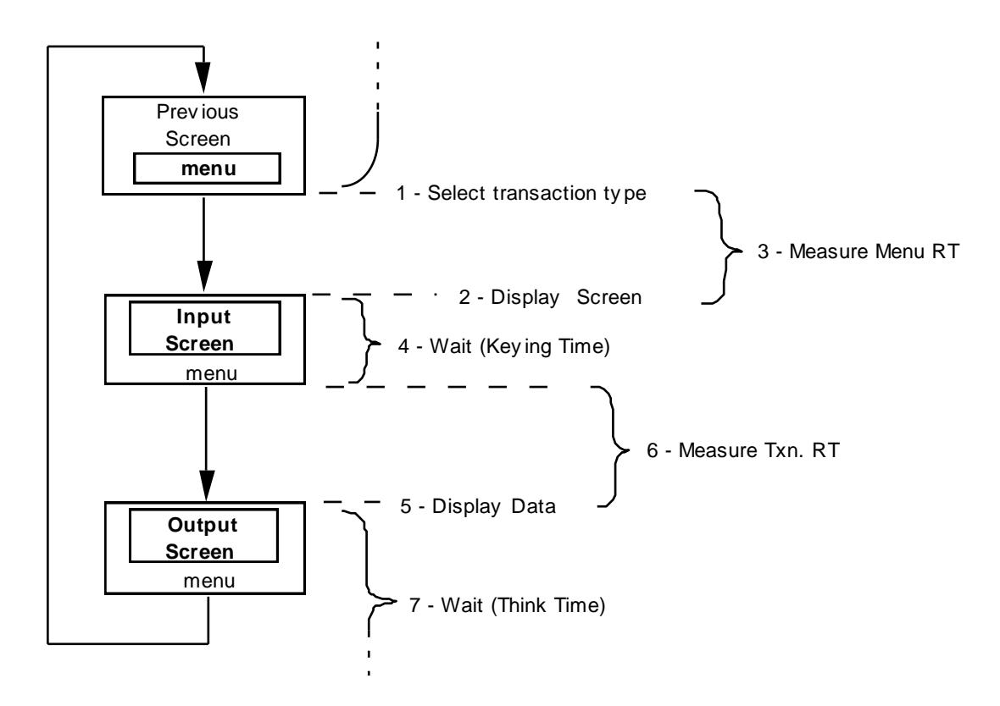

- 5.2.2 Each emulated user executes a cycle comprised of screens, wait times, and response times (RTs) as follows:
  - 1. Selects a transaction type from the menu according to a weighted distribution (see Clause 5.2.3).

- 2. Waits for the Input/ Output Screen to be displayed.
- 3. Measures the Menu RT (see Clause 5.3.3).
- 4. Enters the required number of input fields (see Clause 2) over the defined minimum Keying Time (see Clause 5.2.5.2).
- 5. Waits for the required number of output field s (see Clause 2) to be displayed on the Input/ Output Screen.
- 6. Measures the Transaction RT (see Clause 5.3.4).
- 7. Waits for the defined minimum Think Time (see Clause 5.2.5.4) while the input/ output screen remains displayed.

At the end of the Think Time (Step 7) the emulated user loops back to select a transaction type from the menu (Step 1).

**Comment**: No action is required on the part of the SUT to cycle from Step 7 back to Step 1.

5.2.3 Each transaction type (i.e., business transaction ) is available to each terminal through the Menu. Over the measurement interval, the terminal population must maintain a minimum percentage of mix for each transaction type as follows:

| Transaction Type | Minimum % of mix |
|------------------|------------------|
| New-Order 1      | n/a              |
| Payment          | 43.0             |
| Order-Status     | 4.0              |
| Delivery         | 4.0              |
| Stock-Level      | 4.0              |

**<sup>1</sup>** There is no minimum for the New-Order transaction as its measured rate is the reported throughput.

**Comment 1**: The intent of the minimum percentage of mix for each transaction type is to execute approximately one Payment transaction for each New-Order transaction and approximately one Order-Status transaction, one Delivery transaction, and one Stock-Level transaction for every 10 New-Order transactions. This mix results in the complete business processing of each order.

**Comment 2**: The total number of transactions, from which the minimum percentages of mix are derived, may be calculated in either of two ways:

- Based on all transactions that were selected from the Menu and completed (see Clause 5.1.2) within the measurement interval.
- Based on all transactions whose Transaction RT (see Clause 5.3.4) was completely measured at the RTE during the measurement interval.

**Comment 3**: As an ease of benchmarking issue, the approach in Clause 5.4.2 may be used to compute the transaction mix percentage and throughput data.

### **5.2.4 Regulation of Transaction Mix**

Transaction types must be selected uniformly at random while maintaining the required minimum percentage of mix for each transaction type over the measurement interval. This must be done using one of the techniques described in Clauses 5.2.4.1 and 5.2.4.2.

- 5.2.4.1 A weight is associated to each transaction type on the menu . The required mix is achieved by selecting each new transaction uniformly at random from a weighted distribution. The following requirements must be satisfied when using this technique:
  - 1. The actual weights are chosen by the test sponsor and must result in meeting the required minimum percentages of mix in Clause 5.2.3.
  - 2. For the purpose of achieving the required transaction mix, the RTE can dynamically adjust the weight associated to each transaction type during the measurement interval. These adjustments must be limited so as to keep the weights within 5% on either side of their respective initial value.
- 5.2.4.2 One or more cards in a deck are associated to each transaction type on the Menu. The required mix is achieved by selecting each new transaction uniformly at random from a deck whose content guarantees the required transaction mix. The following requirements must be satisfied when using this technique:
  - 1. Any number of terminals can share the same deck (including but not limited to one deck per terminal or one deck for all terminals).
  - 2. A deck must be comprised of one or more sets of 23 cards (i.e., 10 New -Order cards, 10 Payment cards, and one card each for Order-Status, Delivery, and Stock-level). The minimum size of a deck is one set per terminal sharing this deck. If more than one deck is used, then all decks must be of equal sizes.
    - **Comment**: Generating the maximum percentage of New -Order transactions while achieving the required mix can be done for example by sharing a deck of 230 cards between 10 terminals.
  - 3. Each pass through a deck must be made in a different uniformly random order. If a deck is accessed sequentially, it must be randomly shuffled each time it is exhau sted. If a deck is accessed at random, cards that are selected cannot be placed back in the deck until it is exhausted.

**Comment**: All terminals must select transactions using the same technique. Gaining a performance or a price/ performance advantage by driving one or more terminals differently than the rest of the terminal population is not allowed.

### **5.2.5 Wait Times and Response Time Constraints**

- 5.2.5.1 The Menu step is transaction independent. At least 90% of all Menu selections must have a Menu RT (see Clause 5.3.3) of less than 2 seconds.
- 5.2.5.2 For each transaction type, the Keying Time is constant and must be a minimum of 18 seconds for New Order, 3 seconds for Payment, and 2 second s each for Order-Status, Delivery, and Stock-Level.
- 5.2.5.3 At least 90% of all transactions of each type must have a Transaction RT (see Clause 5.3.4) of less than 5 seconds each for New-Order, Payment, Order-Status, and Delivery, and 20 seconds for Stock-Level.

**Comment**: The total number of transactions, from which the Transaction RT of New-Order is computed, includes New-Order transactions that rollback as required by Clause 2.4.1.4.

5.2.5.4 For each transaction type, think time is taken independently from a negative exponential distribution. Think time, T*t* , is computed from the following equation:

$$T_t = -\log(r) * \mu$$
where:  $\log = \text{natural log (base e)}$   
 $T_t = \text{think time}$   
 $r = \text{random number uniformly distributed between 0 and 1}$   
 $\mu = \text{mean think time}$ 

Each distribution may be truncated at 10 times its mean value

- 5.2.5.5 The beginning of all wait times (Keying Times and Think Times) are to be taken after the last character of output has been displayed (see Clause 2.2.2) by the emulated terminal.
- 5.2.5.6 The 90th percentile response time for the New-Order, Payment, Order-Status, Stock-Level and the interactive portion of the Delivery transactions must be greater than or equal to the average response time of that transaction. If the 90th and the average response times are different by less that 100ms (.1 seconds), then they are considered equal. This requirement is for the terminal response times only and does not apply to the deferred portion of the Delivery transaction or to the menu step.
- 5.2.5.7 The following table summarizes the tran saction mix, wait times, and response time constraints:

| Transaction<br>Type | Minimum<br>% of mix | Minimum<br>Keying Time | 90th Percentile<br>Response Time<br>Constraint | Minimum Mean<br>of Think Time<br>Distribution |
|---------------------|---------------------|------------------------|------------------------------------------------|-----------------------------------------------|
| New-Order           | n/ a                | 18 sec.                | 5 sec.                                         | 12 sec.                                       |
| Payment             | 43.0                | 3 sec.                 | 5 sec.                                         | 12 sec.                                       |
| Order-Status        | 4.0                 | 2 sec.                 | 5 sec.                                         | 10 sec.                                       |
| Delivery 1          | 4.0                 | 2 sec.                 | 5 sec.                                         | 5 sec.                                        |
| Stock-Level         | 4.0                 | 2 sec.                 | 20 sec.                                        | 5 sec.                                        |

**<sup>1</sup>** The response time is for the terminal response (acknowledging that the transaction has been queued), not for the execution of the transaction itself. At least 90% of the transactions must complete within 80 seconds of their being queued (see Clause 2.7.2.2).

**Comment 1**: The response time constraints are set such that the throughput of the system is expected to be constrained by the response time requirement for the New -Order transaction. Response time constraints for other transactions are relaxed for that purpose.

**Comment 2**: The keying times for the transactions are chosen to be approximately proportional to the number of characters input, and the think times are chosen to be approximately proportional to the number of charact ers output.

5.2.5.8 For each transaction type, all configured terminals of the tested systems must use the same target Keying Time and the same target mean of Think Time. These times must comply with the requirements summarized in Clause 5.2.5.7.

## **5.3 Response Time Definition**

- 5.3.1 Each completed transaction submitted to the SUT must be individually timed.
- 5.3.2 Response Times must be measured at the RTE. A **Response Time** (or **RT**) is defined by:

RT = T2 - T1

where:

T1 and T2 are measured at the RTE and defined as:

T1 = timestamp taken before the last character of input data is entered by the emulated us er.

T2 = timestamp taken after the last character of output is received by the emulated terminal.

The resolution of the timestamp s must be at least 0.1 seconds.

**Comment**: The intent of the benchmark is to measure response time as experienced by the emulated user.

5.3.3 The Menu Response Time (**Menu RT**) is the time between the timestamp taken before the last character of the Menu selection has been entered and the timestamp taken after th e last character of the Input/ Output Screen has been received (including clearing all input and output fields and displaying fixed fields, see Clause 2).

**Comment**: Systems that do not require SUT/ RTE interaction for the Menu selection and the screen display can assume a null Menu RT and the components that provide the response for the Menu request (e.g. screen caching terminals) must be included in the SUT and therefore must be priced.

5.3.4 The Transaction Response Time (**Transaction RT**) is the time between the timestamp taken before the last character of the required input data has been sent from the RTE (see Clause 2) and the timestamp taken after the last character of the required output data has been received by the RTE (see Clause 2) resulting from a transaction execution.

**Comment:** If the emulated terminal must process the data being entered or displayed, the time for this processing must be disclosed and taken into account when calculating the Transaction RT.

## **5.4 Computation of Throughput Rating**

The TPC-C transaction mix represents a complete business cycle. It consists of multiple business transaction s which enter new orders, query the status of existing orders, deliver outstanding orders, enter payments from customers, and monitor warehouse stock levels.

5.4.1 The metric used to report Maximum Qualified Throughput (**MQTh**) is a number of orders processed per minute. It is a measure of "business throughput " rather than a transaction execution rate. It implicitly takes into account all transactions in the mix as their individual throughput is controlled by the weighted Menu selection and the minimum percentages of mix defined in Clause 5.2.3.

- 5.4.2 The reported MQTh is the total number of completed New -Order transactions (see Clause 5.1.2), where the Transaction RT (see Clause 5.3.4) was completely measured at the RTE during the measurement interval, divided by the elapsed tim e of the interval. New -Order transactions that rollback, as required by Clause 2.4.1.4, must be included in the reported MQTh.
- 5.4.3 The name of the metric used to report the MQTh of the SUT is **tpmC**.
- 5.4.4 All reported MQTh must be measured, rather than interpola ted or extrapolated, and truncated to exactly zero decimal places. For example, suppose 105.548 tpmC is measured on a 100 terminal test for which 90% of the New-Order transactions completed in less than 4.8 seconds and 117.572 tpmC is measured on a 110 terminal test for which 90% of the transactions completed in less than 5.2 seconds. Then the reported tpmC is 105.
- 5.4.5 To be valid, the measurement interval must contain no more than 1% or no more than one (1), whichever is greater, of the Delivery transaction s skipped because there were fewer than necessary orders present in the New-Order table.

## **5.5 Measurement Interval Requirements**

### **5.5.1 Steady State**

- 5.5.1.1 The test must be conducted in a **steady state** condition that represents the true sustainable throughput of the SUT.
- 5.5.1.2 Although the measurement interval may be as short as 120 minutes, the system under test must be configured to run the test at the reported tpmC for a continuous period of at least eight hours without operator intervention, maintaining full ACID properties. For example, the media used to store at least 8 hours of log data must be configured if required to recover from any single point of failure (see Clause 3.5.3.1).
- **Comment 1**: An example of a configuration that would not comply is one where a log file is allocated such that better performance is achieved during the measured portion of the test than during the remaining portion of an eight hour test, perhaps because a dedicated device was used initially but space on a shared device is used later in the full eight hour test.
- **Comment 2**: Steady state is easy to define (e.g., sustainable throughput) but difficult to prove. The test sponsor (and/ or the auditor) is requ ired to report the method used to verify steady state sustainable throughput. The auditor is encouraged to use available monitoring tools to help determine the steady state.
- **Comment 3:** Some aspects of an implementation can result in systematic but small va riations in sustained throughput over an 8 hour period. The cumulative effect of such variations may be up to 2% of the reported throughput. There is no requirement for an 8 hour run.
- 5.5.1.3 In the case where a ramp-up period is used to reach steady state, the properly scaled initial database population is required at the beginning of the ramp up period. The transaction mix and the requirements summarized in Clause 5.2.5.7 must be followed during the ramp-up as well as steady state period.

**Comment**: The intent of this clause is to prevent significant alteration to the properly scaled initial database population during the ramp -up period.

5.5.1.4 A separate measurement to demonstrate reproducibility is not required.

- 5.5.1.5 While variability is allowed, the RTE cannot be artificially weighted to generate input data different from the requirements described in Clauses 2.4.1, 2.5.1, 2.6.1, 2.7.1, and 2.8.1. To be valid, the input data generat ed during a reported measurement interval must not exceed the following variability:
  - 1. At least 0.9% and at most 1.1% of the New -Order transactions must roll back as a result of an unused item number.
  - 2. The average number of order-lines per order must be in the range of 9.5 to 10.5 and the number of orderlines per order must be uniformly distributed from 5 to 15 for the New -Order transactions that are submitted to the SUT during the measurement interval.
  - 3. The number of remote order-lines must be at least 0.95% and at most 1.05% of the number of order-lines that are filled in by the New -Order transactions that are submitted to the SUT during the measurement interval.
  - 4. The number of remote Payment transaction s must be at least 14% and at most 16% of the number of Payment transactions that are submitted to the SUT during the measurement interval.
  - 5. The number of customer selections by customer last name in the Payment transaction must be at least 57% and at most 63% of the number of Payment transactions that are submitted to the SUT during the measurement interval.
  - 6. The number of customer selections by customer last name in the Order-Status transaction must be at least 57% and at most 63% of the number of Order-Status transactions that are submitted to the SUT during the measurement interval.
- 5.5.1.6 To be valid, the measurement interval must contain no more than 1% or no more than one (1), whichever is greater, of the Delivery transaction s skipped because there were fewer than necessary orders present in the New-Order table.

### **5.5.2 Duration**

- 5.5.2.1 The measurement interval must:
  - 1. Begin after the system reaches steady state.
  - 2. Be long enough to generate reproducible th roughput results which are representative of the performance which would be achieved during a sustained eight hour period.
  - 3. Extend uninterrupted for a minimum of 120 minutes.
- 5.5.2.2 Some systems do not write modified database records/ pages to durable media at the time of modification, but instead defer these writes. At some subsequent time, the modified records/ pages are written to make the durable copy current. This process is defined as a checkpoint in this document.

For systems which defer database write to durable media, it is a requirement that:

1. The time between check points (known as the Checkpoint Interval (CI)), must be less than or equal to 30 minutes. The Checkpoint Duration, time required by the DBMS to write modified database records/ pages to durable media, must be less than or equal to the Checkpoint Interval.

**Comment**: For systems which recover from instantaneous interruptions by applying recovery data to the database stored on durable media (database systems that do not perform checkpoints), it is a requirement that no recovery data older than 30 minutes prior to the interruption be used. The consequence of this requirement is that the database contents stored on durable media cannot at any time during the Measurement Interval (MI) be more than 30 minutes older than the most current state of the database (±5%).

2. All work required to perform a checkpoint must occur at least once before, during steady state, and at least four times during the Measurement Interval. The start time and duration in seconds of at least the four longest checkpoints during the Measurement Interval must be disclosed..

## **5.6 Required Reporting**

5.6.1 The frequency distribution of response times of all transactions, started and completed during the measurement interval, must be reported independently for each of the five transaction types (i.e., New -Order, Payment, Order-Status, Delivery, and Stock-Level). The x-axis represents the transaction RT and must range from 0 to four times the measured 90th percentile RT (N) for that transaction. The y -axis represents the frequency of the transactions at a given RT. At least 20 different intervals, of equal length, must be reported. The maximum, average, and 90th percentile response times must also be reported. An example of such a graph is shown below.

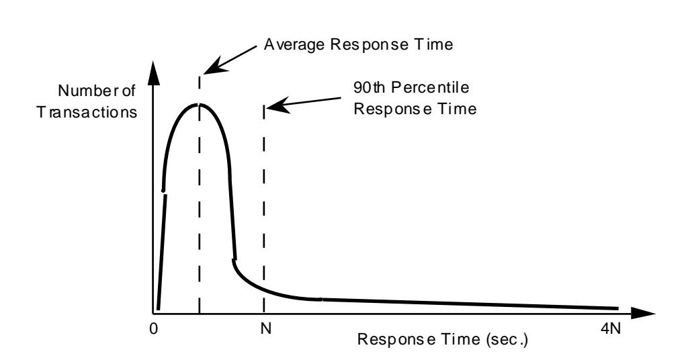

A graph of response times versus throughput for the New-Order transaction, run within the mix required in Clause 5.2.3, must be reported. The x-axis represents the measured New-Order throughput. The y-axis represents the eorresponding 90th percentile of response times. A graph must be plotted at approximately 50%, 80%, and 100% of reported throughput rate (additional data points are optional). The 50% and 80% data points are to be measured on the same configuration as the 100% run, for a minimum interval of 20 minutes, varying either the Think Time of one or more transaction types or the number of active terminals. Interpolation of the graph between these data points is permitted. Deviations from the required transaction mix are permitted for the 50% and 80% data points. An example of such a graph is shown below.

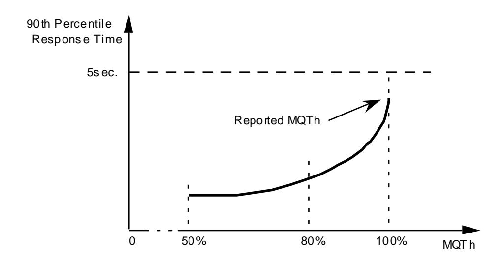

5.6.3 The frequency distribution of Think Times for the New-Order transaction, started and completed during the measurement interval, must be reported. The x-axis represents the Think Time and must range from 0 to four times the actual mean of Think Time for that transaction. The y-axis represents the frequency of the transactions with a given Think Time. At least 20 different intervals, of equal length, must be reported. The mean Think Time must also be reported. An example of such a graph is shown below.

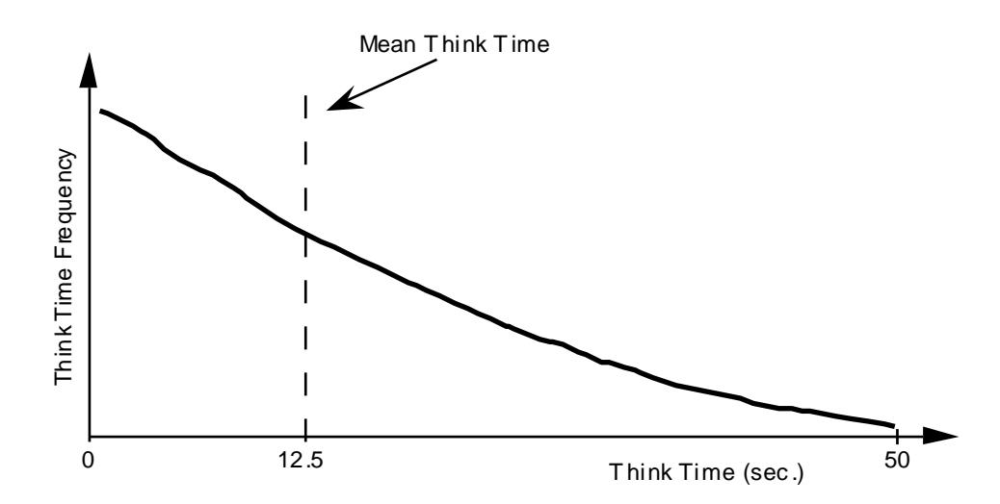

5.6.4 A graph of the throughput of the New-Order transaction versus elapsed time (i.e., wall clock) must be reported for both ramp -up time and measurement interval. The x-axis represents the elapsed time from the start of the run. The y-axis represents the throughput in tpmC. At least 240 different intervals should be used with a maximum interval size of 30 seconds. The opening and the closing of the measurement interval must also be reported and shown on the graph. The start time for each of the checkpoints must be indicated on the graph. An example of such a graph is shown below.

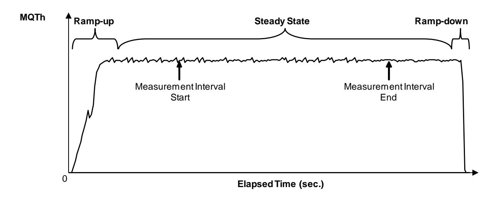

## **5.7 Primary Metrics**

- 5.7.1 To be compliant with the TPC-C standard and the TPC" s Fair Use Policies and Guidelines, all public references to TPC-C results for a configuration must include the following components which will be known as the Primary Metrics.
  - The TPC-C Maximum Qualified Throughput (MQTh) rating expressed in tpmC. This is known as the Performance Metric. (See Clause 5.4.)
  - The TPC-C total 3-year pricing divided by the MQTh and expressed as price/ tpmC. This is also known as the Price/ Performance metric. (See Clause 7.3.)
  - The date when all products necessary to achieve the stated performance will be available (stated as a single date on the executive summary). This is known as the availability date. (See Clause 8.1.8.3.)
  - When the optional TPC-Energy standard is used, the additional primary metric expressed as watts/ KtpmC must be reported. In addition, the requirements of the TPC-Energy Specification, located at www.tpc.org, must be met.

# Clause 6: SUT, DRIVER, and COMMUNICATIONS DEFINITION

## 6.1 Models of the Target System

Some examples of a system which represents the target (object) of this benchmark are shown pictorially below. By way of illustration, the figures also depict the RTE/ SUT boundary (see Clauses 6.3 and 6.4) where the response time is measured.

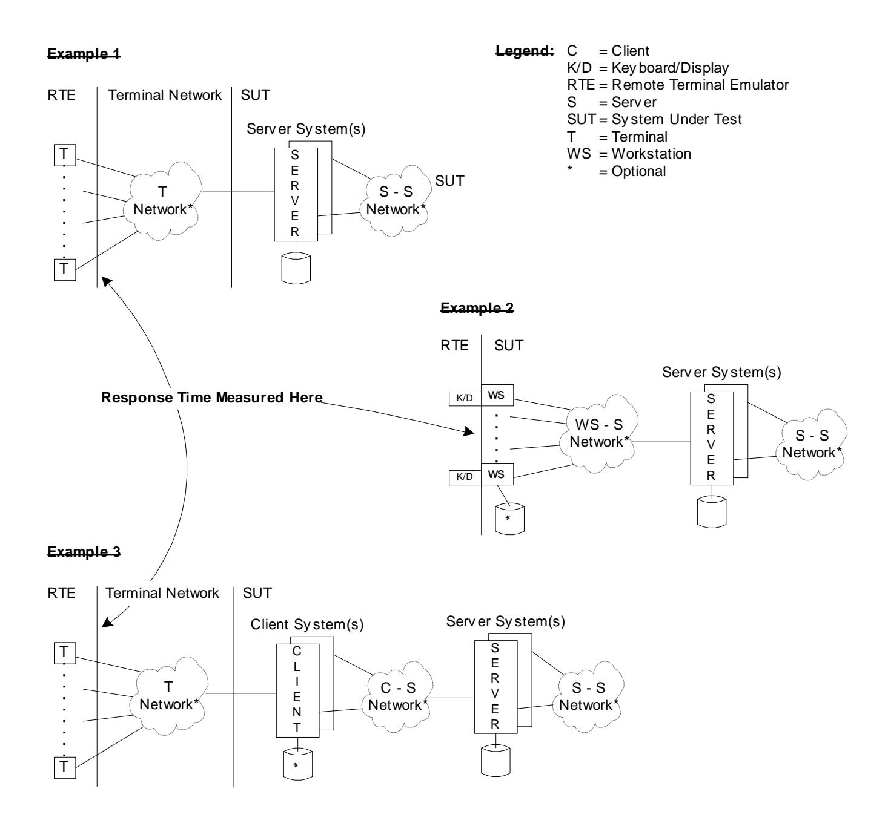

## **6.2 Test Configuration**

The test configuration consists of the following elements:

- System Under Test (SUT)
- Driver System(s)
- Driver/ SUT Communications Interface(s)

If one of the networks is a WAN, the tested configurations need not include the WAN long -haul communications lines.

## **6.3 System Under Test (SUT) Definition**

### 6.3.1 The SUT consists of:

- One or more processing units (e.g., host, front-ends, workstations, etc.) which will run the transaction mix described in Clause 5.2.3, and whose aggregate performance (total Maximum Qualified Throughput) will be described by the metric tpmC.
- Any front-end systems are considered to be part of the SUT. Examples of front-end systems are front-end data communication processors, cluster controllers, database clients (as in the client/ server model), and workstations.
- The host system(s), including hardware and software, supporting the database employed in the benchmark.
- The hardware and software components of all networks required to connect and support the SUT components.
- Data storage media sufficient to satisfy both the scaling requirements in Clause 4.2 and the ACID properties of Clause 3.
- 6.3.2 A single benchmark result may be used for multiple SUTs provided the following conditions are met:
  - Each SUT must have the same hardware and software architecture and configuration.
  - The only exception allowed are for elements not involved in the processing logic of the SUT (e.g., number of peripheral slots, power supply, cabinetry, fans, etc.)
  - Each SUT must support the priced configuration.

## **6.4 Driver Definition**

- 6.4.1 An external Driver System(s), which provides Remote Terminal Emulator (RTE) functionality, must be used to emulate the target terminal population and their emulated users during the benchmark run.
- 6.4.2 The RTE performs the following functions:
  - Emulates a user entering input data on the input/ output screen of an emulated terminal by generating and sending transactional messages to the SUT;
  - Emulates a terminal displaying output messages on an input/ output scr een by receiving response messages from the SUT;

- Records response times;
- Performs conversion and/ or multiplexing into the communications protocol used by the communications interface between the driver and the SUT ;
- Performs statistical accounting (e.g., 90th percentile response time measurement, throughput calculation, etc.) is also considered an RTE function.
- 6.4.3 Normally, the Driver System is expected to perform RTE functions only. Work done on the Driver System in addition to the RTE as specified in Clause 6.4.2 must be thoroughly justified as specified in Clause 6.6.3.
- 6.4.4 The intent is that the Driver System must reflect the proposed terminal configuration and cannot add functionality or performance above the priced network components in the SUT. It must be demonstrated that performance results are not enhanced by using a Driver System.
- 6.4.5 Software or hardware which resides on the Driver which is not the RTE is to be considered as part of the SUT. For example, in a "client/ server" model, the client softw are may be run or be simulated on the Driver System (see Clause 6.6.3).

## **6.5 Communications Interface Definitions**

### **6.5.1 I/O Channel Connections**

6.5.1.1 All protocols used must be commercially available.

**Comment**: It is the intention of this definition to exclude non -standard I/ O channel connections. The following situations are examples of acceptable channel connections:

- Configurations or architectures where terminals or terminal controllers are normally and routinely connected to an I/ O channel of a processor.
- Where the processor(s) in the SUT is/ are connected to the local communications network via a front-end processor, which is channel connected. The front-end processor is priced as part of the SUT.

### **6.5.2 Driver/SUT Communications Interface**

6.5.2.1 The communications interface between the Driver System(s) and the SUT must be the mechanism by which the system would be connected with the terminal (see Clause 2.1.8) in the proposed configuration.

## **6.6 Further Requirements on the SUT and Driver System**

### **6.6.1 Restrictions on Driver System**

Copies of any part of the tested database or file system or its data structures, indices, etc. may not be present on the Driver System during the test.

**Comment:** Synchronization between RTE and SUT is disallowed.

### **6.6.2 Individual Contexts for Emulated Terminals**

The SUT must contain context for each terminal emulated, and must maintain that context for the duration of that test. That context must be identical to the one which would support a real terminal. A terminal which sends a transaction cannot send another until the completion of that transaction, with the exception of the deferred execution of the Delivery transaction.

**Comment**: The **context** referred to in this clause should consist of information such as terminal identification, network identification, and other information necessary for a real terminal to be known to (i.e., configured on) the SUT. The intention is to allow pseudo-conversational transactions. The intent of this clause is simply to prevent a test sponsor from multiplexing messages from a very large number of emulated terminals into a few input lines and claiming or implying that the tested system supports that number of users regardless of whether the system actually supports that number of real terminals. It is allowable for a terminal to lose its connection to the SUT during the Measurement Interval as long as its context is not lost and it is reconnected within 90 seconds using the same context. The loss and re-entry of a user must be logged and the total number reported.

### **6.6.3 Driver System Doing More Than RTE Function**

In the event that a Driver System must be used to emulate additional functionality other than that described in Clause 6.4, then this must be justified as follows:

- 6.6.3.1 It must be demonstrated that the architecture of the proposed solution makes it uneconomical to perform the benchmark without performing the work in question on the driver (e.g., in a "client/ server" d atabase implementation, where the client software would run on a large number of workstations).
- 6.6.3.2 Rule 6.6.1 must not be violated.
- 6.6.3.3 It must be demonstrated that executables placed on the Driver System are functionally equivalent to those on the proposed (target) system.
- 6.6.3.4 It must be demonstrated that performance results are not enhanced by performing the work in question on the Driver System. The intent is that a test should be run to d emonstrate that the functionality, performance, and connectivity of the emulated solution is the same as that for the priced system. These test data must be included in the Full Disclosure Report.

For example, if the Driver System emulates the function of a terminal concentrator, there must be test data to demonstrate that a real concentrator configured with the claimed number of attached devices would deliver the same (or better) response time as is measured with the Driver System. The t erminal concentrator must be configured as it would be in the priced system and loaded to the maximum number of lines used in the priced configuration. The demonstration test must be run as part of the SUT configuration that is running a full load on a properly scaled database. The following diagram illustrates the configuration of a possible demonstration test:

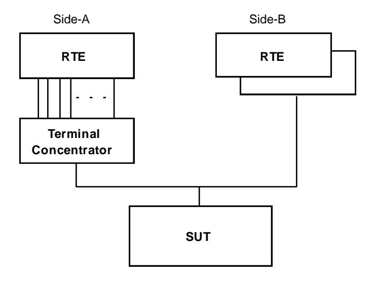

In the above example, the difference in the measured response time between Side -A and Side-B should be less than or equal to any adjustments to the response time reported in the Full Disclosure Report.

If the response time delay generated from a demonstration test is to be used in multiple benchmark tests, the demonstration must be performed on a SUT generating the highest tpmC rate on the terminal concentrator.

- 6.6.3.5 Individual contexts must continue to be maintained from the RTE through to the SUT.
- 6.6.3.6 A complete functional diagram of both the benchmark configuration and the configuration of the proposed (target) system must be disclosed. A detailed list of all software and hardware functionality being performed on the Driver System, and its interface to the SUT, must be disclosed.
- 6.6.3.7 When emulating end -user devices utilizing a web browser, the implementor shall include a 0.1 second response time delay in the emulation to compensate for the delay encountered in the propo sed end-to-end configuration for the browser delay.

**Comment:** The use of a measured delay is not allowed on this non -priced component.

### **6.6.4 Disclosure of Network Configuration and Emulated Portions**

The test sponsor shall describe completely the network configurations of both the tested services and the proposed real (target) services which are being represented. A thorough explanation of exactly which parts of the proposed configuration are being replaced by the Driver System must be given.

### **6.6.5 Limits on Concentration**

The level of concentration of messages between the Driver System(s) and the SUT in the benchmark configuration must not exceed that which would occur in the proposed (target) configuration. In particular, the number of communications packets which can be concentrated must not exceed the number of terminals which would be directly connected to that concentrator in the proposed configuration.

**Comment**: The intent is to allow only first level concentration on the RTE, but does not preclude additional levels of concentration on the SUT.

### **6.6.6 Limits on Operator Intervention**

Systems must be able to run for at least 8 hours without operator intervention.

### **6.6.7 Limits on Profile-Directed Software Optimizations**

Special rules apply to the use of so-called profile-directed optimization (PDO), in which binary executables are reordered or otherwise optimized to best suit the needs of a particular workload. These rules do not apply to the routine use of PDO by a d atabase vendor in the course of building commercially available and supported database products; such use is not restricted . Rather, the rules apply to the use of PDO by a test sponsor to optimize executables of a database product for a particular workload. Such optimization is permissible if all of the following conditions are satisfied:

- 1. The use of PDO or similar procedures by the test sponsor must be disclosed.
- 2. The procedure and any scripts used to perform the optimization must be disclosed.
- 3. The procedure used by the test sponsor could reasonably be used by a customer on a shipped database executable.
- 4. The optimized database executables resulting form the application of the procedure must be supported by the database software vendor.
- 5. The same set of DBMS executables must be used for all audited phases of the benchmark.

# **Clause 7: PRICING**

Rules for pricing the **Priced Configuration** and associated software and maintenance are included in the current revision of the TPC Pricing Specification, located at [www.tpc.org.](http://www.tpc.org/)

## **7.1 Pricing Methodology**

- 7.1.1 The intent of this section is to define the methodology to be used in calculating the 3-year pricing and the price/ performance (price/ tpmC). The fundamental premise is that what is tested and/ or emulated is priced and what is priced is tested and/ or emulated. Exceptions to this premise are noted below.
- 7.1.2 The proposed system to be priced is the aggregation of the SUT and network com ponents that would be offered to achieve the reported performance level. Calculation of the priced system consists of:
  - Price of the SUT as tested and defined in Clause 6. This excludes terminals and the terminal network (see Clause 6.1).
  - Price of all emulated components excluding terminals and the terminal network (see Clause 6.1).
  - Price of on-line storage for the database population, 8 hours of processing at the reported tpmC, data generated by 60 8-hour days of processing at the reported tpmC, and the system software necessary to create, operate, administer, and maintain the application .
  - Price of additional products that are required for the op eration, administration or maintenance of the priced system.
  - Price of additional products required for application development.

**Comment**: Any component, for example a Network Interface Card (NIC), must be included in the price of the SUT if it draws resources for its own operation from the SUT. This includes, but is not limited to, power and cooling resources. In addition, if the component performs any of the function defined in the TPC-C specification it must be priced regardless of where is draws its resources.

7.1.3 In addition to the pricing methodology required by the current revision of the TPC Pricing Specification, terminals and the terminal network (see diagram in Clause 6.1) are excluded from the priced system. For end -user devices providing more function, monitors, and keyboards need not be priced if capable of being priced separately.

## **7.2 Priced System**

**7.2.1** The number of users for TPC-C is defined to be equal to the number of terminals emulated in the tested configuration. Any usage pricing for the above number of users should be based on the pricing policy of the company supplying the priced component.

### **7.2.2 Terminals and Network Pricing**

7.2.2.1 The price of the Driver System is not included in the calculation. In the case where the Driver System provide functionality in addition to the RTE described in Clause 6, then the price of the emulated hardware/ software components are to be included, except terminals and the terminal network.

- 7.2.2.2 The terminals must be commercially available products capable of entering via a keyboard all alphabetic and numeric characters and capable of displaying simu ltaneously the data and the fields described in Clause 2.
- 7.2.2.3 For WAN configurations, the number of devices to be connected to a single line must be no greater than that emulated per Clause 6.

### **7.2.3 Database Storage and Recovery Log Pricing**

7.2.3.1 Within the priced system, there must be sufficient on -line storage to support any expanding system files and the durable database population resulting from executing the TPC-C transaction mix for 60 eight-hour days at the reported tpmC (see Clause 4.2.3). Storage is considered on -line, if any record can be accessed random ly and updated within 1 second. On-line storage may include magnetic disks, optical disks, solid-state storage or any combination of these, provided that the above mentioned access criteria is met.

**Comment 1**: The intent of this clause is to consider as on -line any storage device capable of providing an access time to data, for random read or update, of one second or less, even if this access time requires the creation of a logical access path not present in the tested database. For example, a disk based sequential file might require the creation of an index to satisfy the access time requirement.

**Comment 2**: During the execution of the TPC-C transaction mix, the ORDER, NEW-ORDER, ORDER-LINE, and HISTORY tables grow beyond the initial database population requirements of the benchmark as specified in Clause 4. Because these tables grow naturally, it is intended that 60 days of growth beyond the specified initial database population also be taken into account when pricing the system.

- 7.2.3.2 Recovery data must be maintained in such a way that the published tpmC transaction rate could be sustained for an 8-hour period. Roll-back recovery data must be either in memory or in on-line storage at least until transactions are committed . Roll-forward recovery data may be stored on an off-line device, providing the following:
  - The process which stores the roll-forward data is active during the measurement interval.
  - The roll-forward data which is stored off-line during the measurement interval (see Clause 5.5) must be at least as great as the roll-forward recovery data that is generated during the period (i.e., the data may be first created in on-line storage and then moved to off-line storage, but the creation and the movement of the data must be in steady state).
  - All ACID properties must be retained.
- 7.2.3.3 It is permissible to not have the storage required for the 60-day space on the tested system. However, any additional storage device included in the priced system but not configured on the tested system must be of the type(s) actually used during the test and must satisfy normal system configuration rules.

**Comment**: Storage devices are considered to be of the same type if they are identical in all aspects of their product description and technical specifications.

7.2.3.4 The requirement to support eight hours of recovery log data can be met with storage on any durable media (see Clause 3.5.1) if all data required for recovery from failures listed in Clauses 3.5.3.2 and 3.5.3.3 are on-line.

### **7.2.4 Additional Operational Components**

- 7.2.4.1 Additional products that might be included on a customer installed configuration, such as operator consoles and magnetic tape drives, are also to be included in the priced system if explicitly required for the operation, administration, or maintenance, of the priced system.
- 7.2.4.2 Copies of the software, on appropriate media, and a software load device, if required for initial load or maintenance updates, must be included.
- 7.2.4.3 The price of an Uninterruptible Power Supply, specifically contributing to a durability solution, must be included (see Clause 3.5.1).
- 7.2.4.4 The price of all components, including cables, used to interconnect com ponents of the SUT must be included.

### **7.2.5 Additional Software**

- 7.2.5.1 The price must include the software licenses necessary to create, compile, link, and execute this benchmark application as well as all run-time licenses required to execute on host system(s), client system(s) and connected workstation(s) if used.
- 7.2.5.2 In the event the application program is developed on a system other than the SUT, the price of that system and any compilers and other software used must also be included as part of the priced system.

### **7.2.6 Component Substitution**

- 7.2.6.1 As per the current revision of the TPC Pricing Specification, the following components in the measured configuration may be substituted if they are no longer orderable by the publication date:
  - front-end systems
  - disks, disk enclosures, external storage controllers
  - terminal servers
  - network adapters
  - routers, bridges, repeaters, switches
  - cables

7.2.6.2 Substitution of the Server or the Host system, OS, DBMS or TP Monitor is not allowed under any circumstances.

## **7.3 Required Reporting**

- 7.3.1 Two metrics will be reported with regard to pricing. The first is the total 3-year pricing as described in the previous clauses. The second is the total 3-year pricing divided by the reported Maximum Qualified Throughput (tpmC), as defined in Clause 5.4.
- 7.3.2 The 3-year pricing metric must be fully reported in the basic monetary unit of the local currency rounded up and the price/ performance metric must be reported to a minimum precision of three significant digits rounded up. Neither metric may be interpolated or extrapolated. For example, if the total price is \$ 5,734,417.89USD and the reported throughput is 105 tpmC, then the 3-year pricing is \$ 5,734,418USD and the price/ performance is \$ 54,700USD/ tpmC (5,734,418/ 105).

# **Clause 8: FULL DISCLOSURE**

Requirements for pricing-related items in the Full Disclosure Report are included in the current revision of the TPC Pricing Specification, located at [www.tpc.org.](http://www.tpc.org/)

## **8.1 Full Disclosure Report Requirements**

A Full Disclosure report is required in order for results to be considered com pliant with the TPC-C benchmark specification.

**Comment**: The intent of this disclosure is for a customer to be able to replicate the results of this benchmark given the appropriate documentation and products.

This section includes a list of requirements for the Full Disclosure report.

### **8.1.1 General Items**

- 8.1.1.1 The order and titles of sections in the Test Sponsor" s Full Disclosure report must correspond with the order and titles of sections from the TPC-C standard specification (i.e., this document). The intent is to make it as easy as possible for readers to compare and contrast material in different Full Disclosure reports.
- 8.1.1.2 The TPC Executive Summ ary Statement must be included near the beginning of the Full Disclosure report describing the components of the priced configuration that are required to achieve the performance result. An example of the Executive Summary Statement is presented in Appendix B. The latest version of the required format is available from the TPC Administrator. When the optional TPC-Energy standard is u sed, the additional requirements and formatting of TPC-Energy related items in the executive summary must be reported and used. In addition, the requirements of the TPC-Energy Specification, located at www.tpc.org, must be met.

**Comment 1:** The processor information to be included is as follows:

- Node count if applicable
- For each processor type, total enabled processor count, total enabled processor core count, total enabled processor thread count and processor model and speed in Hz. If more than one processor type is used, they must be described on separate lines
- The number reported in the "Database Processors" box in the Executive Summary must specify the total processor/ core/ thread information for all the enabled processors in the database server(s). Processor information for all servers in the SUT is reported in the "System Components" box and not in the " Processors" box

**Comment 2:** If a package is priced but all of its components are not used in the priced benchmark configuration, the package must be listed in the pricing spreadsheet, including any purchased components not used in running the benchmark. However, only the components actually needed to produce the reported performance metric should appear in the Executive Summary configuration information.

- 8.1.1.3 The numerical quantities listed below must be summarized near the beginning of the Full Disclosure report:
  - computed Maximum Qualified Throughput in tpmC,
  - ninetieth percentile, average and maximum response times for the New -Order, Payment, Order-Status, Stock-Level, Delivery (deferred and interactive) and Menu transactions,
  - time in seconds added to response time to compensate for delays associated with emulated components,
  - percentage of transaction mix for each transaction type,
  - minimum, average, and maximum key and think times for the New -Order, Payment, Order-Status, Stock-Level, and Delivery (interactive),
  - ramp-up time in minutes,
  - measurement interval in minutes,
  - number of checkpoints in the measurement interval,
  - checkpoint interval in minutes,
  - number of transactions (all types) completed within the measurement interval,

**Comment**: Appendix C contains an example of such a summary. The intent is for data to be conveniently and easily accessible in a familiar arrangement and style. It is not required to precisely mimic the layout shown in Appendix C.

- 8.1.1.4 The application program (as defined in Clause 2.1.7) must be disclosed. This includes, but is not limited to, the code implementing the five transactions and the terminal input and output functions.
- 8.1.1.5 A statement identifying the benchmark sponsor(s) and other participating companies must be provided.
- 8.1.1.6 Settings must be provided for all customer-tunable parameters and options which have been changed from the defaults found in actual products, including but not limited to:
  - Database tuning options.
  - Recovery/ commit options.
  - Consistency/ locking options.
  - Operating system and application configuration parameters.
  - Compilation and linkage options and run -time optimizations used to create/ install application s, OS, and/ or databases.

**Comment 1**: This requirement can be satisfied by providing a full list of all parameters and options.

**Comment 2**: The intent of the above clause is that anyone attempting to recreate the benchmark environment has sufficient information to compile, link, optimize, and execute all software used to produce the disclosed benchmark result.

8.1.1.7 Diagrams of both measured and priced configurations must be provided, accompanied by a description of the differences. This includes, but is not limited to:

- Number and type of processors/ cores/ threads.
- Size of allocated memory, and any specific mapping/partitioning of memory unique to the test.
- Number and type of disk units (and controllers, if applicable).
- Number of channels or bus connections to disk units, including their protocol type.
- Number of LAN (e.g., Ethernet) connections, including routers, workstations, terminals, etc., that were physically used in the test or are incorporated into the pricing structure (see Clause 8.1.8).
- Type and the run-time execution location of software components (e.g., DBMS, client processes, transaction monitors, software drivers, etc.).

**Comment**: Detailed diagrams for system configurations and architectures can widely vary, and it is impossible to provide exact guidelines suitable for all implementations. The intent here is to describe the system components and connections in sufficient detail to allow independent reconstruction of the measurement environment.

The following sample diagram illustrates a workstation/router/server benchmark (measured) configuration using Ethernet and a single processor. Note that this diagram does not depict or imply any optimal configuration for the TPC-C benchmark measurement.

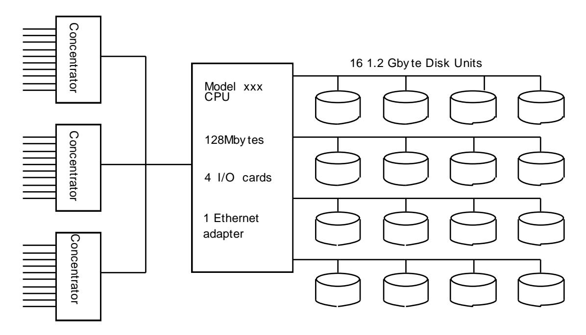

Concentrators: System\_WW with 10 diskless workstations each

LAN: Ethernet using NET\_XX routers

CPU: Model\_YY with 128 Mbytes of main memory, 4 I/ O cards with SCSI II protocol support

Disk: Vendor\_ZZ 1.2 Gbyte drives

### **8.1.2 Logical Database Design Related Items:**

- 8.1.2.1 Listings must be provided for all table definition statements and all other statements used to set-up the database.
- 8.1.2.2 The physical organization of tables and indices, within the database, must be disclosed.

**Comment**: The concept of physical organization includes, but is not limited to: record clustering (i.e., rows from different logical tables are co-located on the same physical data page), index clustering (i.e., rows and leaf nodes of an index to these rows are co-located on the same physical data page), and partial fill-factors (i.e., physical data pages are left partially empty even though additional rows are available to fill them).

- 8.1.2.3 It must be ascertained that insert and/ or delete operations to any of the tables can occur concurrently with the TPC-C transaction mix. Furthermore, any restriction in the SUT database implementation that precludes inserts beyond the limits defined in Clause 1.4.11 must be disclosed. This includes the maximum number of rows that can be inserted and the maximum key value for these new rows.
- 8.1.2.4 While there are a few restrictions placed upon horizontal or vertical partitioning of tables and rows in the TPC-C benchmark (see Clause 1.6), any such partitioning must be disclosed. Using the CUSTOMER table as an example, such partitioning could be denoted as:

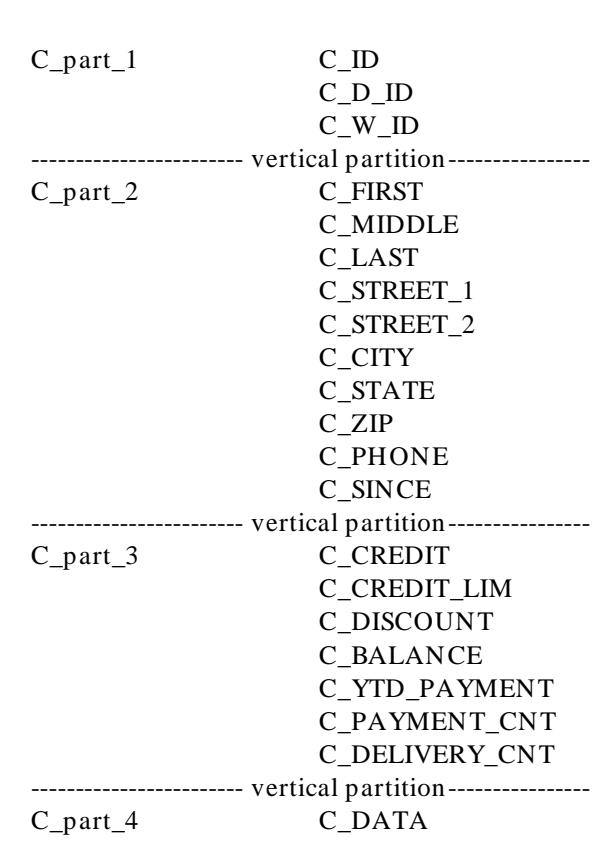

Once the partitioned database elements have been so identified, they can be referred to by, for example, their **T\_part\_N** notation when describing the physical allocation of database files (see Clause 8.1.5), where T indicates the table name and N indicates the partition segment number.

8.1.2.5 Replication of tables, if used, must be disclosed (see Clause 1.4.6).

8.1.2.6 Additional and/ or duplicated attributes in any table must be disclosed along with a statement on the impact on performance (see Clause 1.4.7).

### **8.1.3 Transaction and Terminal Profiles Related Items**

- 8.1.3.1 The method of verification for the random number generation must be described.
- 8.1.3.2 The actual layouts of the terminal input/ output screens must be disclosed.
- 8.1.3.3 The method used to verify that the emulated terminals provide all the features described in Clause 2.2.2.4 must be explained. Although not specifically priced, the type and model of the terminals used for the demonstration in 8.1.3.3 must be disclosed and commercially available (including supporting software and maintenance).
- 8.1.3.4 Any usage of presentation managers or intelligent terminals must be explained.
- **Comment 1**: The intent of this clause is to describe any special manipulations performed by a local terminal or workstation to off-load work from the SUT. This includes, but is not limited to: screen presentations, message bundling, and local storage of TPC-C rows.
- **Comment 2**: This disclosure also requires that all data manipulation functions performed by the local terminal to provide navigational aids for transaction(s) must also be described. Within this disclosure, the purpose of such additional function(s) must be explained.
- 8.1.3.5 The percentage of home and remote order-lines in the New-Order transactions must be disclosed.
- 8.1.3.6 The percentage of New-Order transactions that were rolled back as a result of an unused item number must be disclosed.
- 8.1.3.7 The number of items per orders entered by New -Order transactions must be disclosed.
- 8.1.3.8 The percentage of home and remote Payment transaction s must be disclosed.
- 8.1.3.9 The percentage of Payment and Order-Status transactions that used non-primary key (C\_LAST) access to the database must be disclosed.
- 8.1.3.10 The percentage of Delivery transaction s that were skipped as a result of an insufficient number of rows in the NEW-ORDER table must be disclosed.
- 8.1.3.11 The mix (i.e., percentages) of transaction types seen by the SUT must be disclosed.
- 8.1.3.12 The queuing mechanism used to defer the execution of the Delivery transaction must be disclosed.

### **8.1.4 Transaction and System Properties Related Items**

8.1.4.1 The results of the ACID tests must be disclosed along with a description of how the ACID requirements were met. This includes disclosing which case was followed for the execution of Isolation Test 7.

### 8.1.5 Scaling and Database Population Related Items

- 8.1.5.1 The cardinality (e.g., the number of rows) of each table, as it existed at the start of the benchmark run (see Clause 4.2), must be disclosed. If the database was over-scaled and inactive rows of the WAREHOUSE table were deleted (see Clause 4.2.2), the cardinality of the WAREHOUSE table as initially configured and the number of rows deleted must be disclosed.
- 8.1.5.2 The distribution of tables and logs across all media must be explicitly depicted for the tested and priced systems.

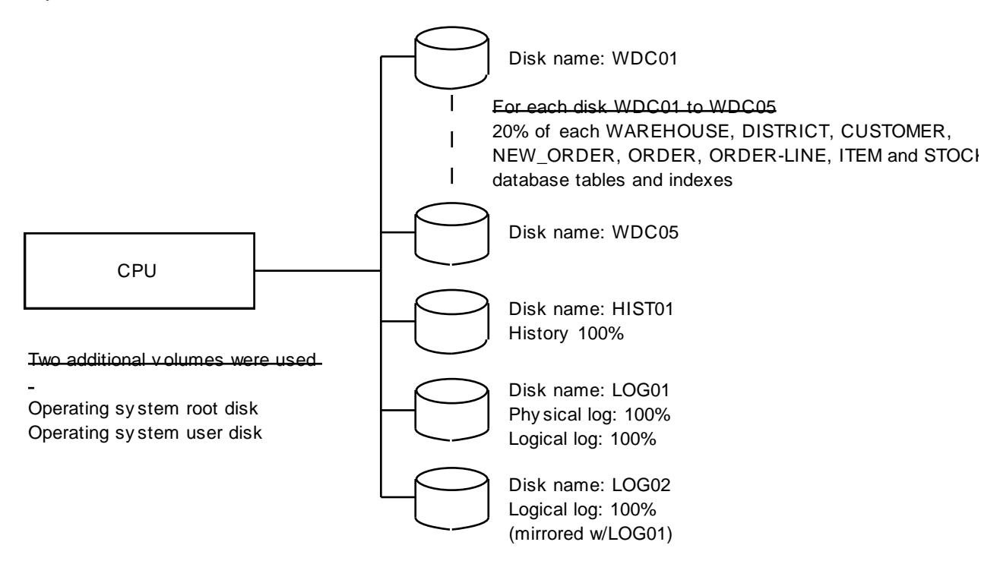

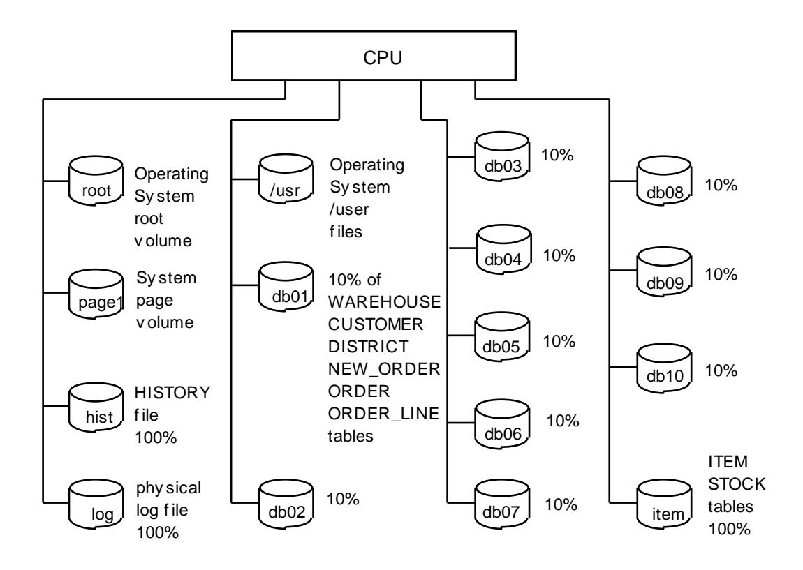

**Comment**: Detailed diagrams for layout of database files on disks can widely vary, and it is difficult to provide exact guideline suitable for all implementations. The intent is to provide sufficient detail to allow independent reconstruction of the test database. The two figures below are examples of database layout descriptions and are not intended to depict or imply any optimal layout for the TPC-C database.

#### 8.1.5.3 A statement must be provided that describes:

- 1. The data model implemented by the DBMS used (e.g., relational, network, hierarchical)
- 2. The database interface (e.g., embedded, call level) and access language (e.g., SQL, DL/1, COBOL read/write) used to implement the TPC-C transactions. If more than one interface/ access language is used to implement TPC-C, each interface/ access language must be described and a list of which interface/ access language is used with which transaction type must be disclosed.

#### 8.1.5.4 The mapping of database partitions/ replications must be explicitly described.

**Comment**: The intent is to provide sufficient detail about partitioning and replication to allow independent reconstruction of the test database.

An description of a database partitioning scheme is presented below as an example. The nomenclature of this example was outlined using the CUSTOMER table (in Clause 8.1.2.1), and has been extended to use the ORDER and ORDER\_LINE tables as well.

| C_part_1<br>C_ID<br>C_D_ID<br>C_W_ID<br>------- partition-------<br>C_part_2<br>C_FIRST | O_part_1<br>O_ID<br>O_D_ID<br>O_W_ID<br>O_C_ID<br>------- partition------- | OL_part_1<br>OL_O_ID<br>OL_D_ID<br>OL_W_ID<br>OL_NUMBER<br>OL_I_ID |
|-----------------------------------------------------------------------------------------|----------------------------------------------------------------------------|--------------------------------------------------------------------|
|-----------------------------------------------------------------------------------------|----------------------------------------------------------------------------|--------------------------------------------------------------------|

```
C MIDDLE
                           O_part_2
                                      O_ENTRY_D
                                                         ----- partition-----
                                                                     OL_SUPPLY_W_ID
          C_LAST
                                      O_OL_CNT
                                                         OL_part_2
                            ----- partition-----
          C_STREET_1
                                                                     OL_DELIVERY_D
          C STREET 2
                           O part 3
                                      O_CARRIER_ID
                                                                     OL QUANTITY
          C CITY
                                      O ALL LOCAL
                                                                     OL AMOUNT
          C_STATE
                                                         ----- partition-----
          C_ZIP
                                                                     OL_DIST_INFO
                                                         OL_part_3
          C PHONE
          C SINCE
-----partition-----
C_part_3
          C_CREDIT
          C CREDIT LIM
          C_DISCOUNT
          C_BALANCE
          C_YTD_PAYMENT
          C_PAYMENT_CNT
          C_DELIVERY_CNT
-----partition-----
C_part_4
          C_DATA
```

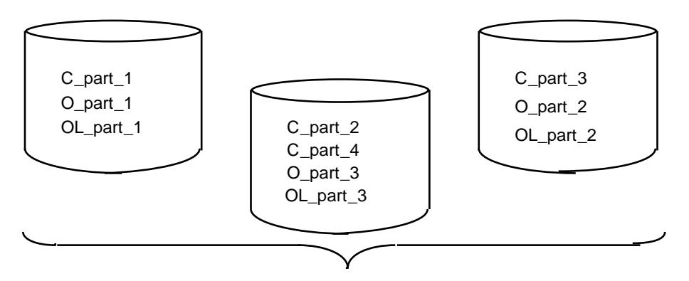

One WAREHOUSE Customer/Order/Order\_line "cell"

8.1.5.5 Details of the 60-day space computations along with proof that the database is configured to sustain 8 hours of growth for the dynamic tables (Order, Order-Line, and History) must be disclosed (see Clause 4.2.3).

### 8.1.6 Performance Metrics and Response Time Related Items

- 8.1.6.1 Measured tpmC must be reported.
- 8.1.6.2 Ninetieth percentile, maximum and average response times must be reported for all transaction types as well as for the Menu response time.
- 8.1.6.3 The minimum, the average, and the maximum keying and think times must be reported for each transaction type.
- 8.1.6.4 Response Time frequency distribution curves (see Clause 5.6.1) must be reported for each transaction type.

- 8.1.6.5 The performance curve for response times versus throughput (see Clause 5.6.2) must be reported for the New-Order transaction.
- 8.1.6.6 Think Time frequency distribution curves (see Clause 5.6.3) must be reported for the New -Order transaction.
- 8.1.6.7 There is no requirement to report Keying Time distribution curves.
- 8.1.6.8 A graph of throughput versus elapsed time (see Clause 5.6.4) must be reported for the New -Order transaction.
- 8.1.6.9 The method used to determine that the SUT had reached a steady state prior to commencing the measurement interval (see Clause 5.5) must be described.
- 8.1.6.10 A description of how the work normally performed during a sustained test (for example checkpointing, writing red o/ undo log records, etc.), actually occurred during the measurement interval must be reported.
- 8.1.6.11 The start time and duration in seconds of at least the four (4) longest checkpoints during the Measurement Interval must be disclosed (see Clause 5.5.2.2 (2)).
- 8.1.6.12 A statement of the duration of the measurement interval for the reported Maximum Qualified Throughput (tpmC) must be included.
- 8.1.6.13 The method of regulation of the transaction mix (e.g., card decks or weighted random distribution) must be described. If weighted distribution is used and the RTE adjusts the weights associated with each transaction type, the maximum adjustments to the weight from the initial value must be disclosed.
- 8.1.6.14 The percentage of the total mix for each transaction type must be disclosed.
- 8.1.6.15 The percentage of New-Order transactions rolled back as a result of invalid item number must be disclosed.
- 8.1.6.16 The average number of order-lines entered per New-Order transaction must be disclosed.
- 8.1.6.17 The percentage of remote order-lines entered per New-Order transaction must be disclosed.
- 8.1.6.18 The percentage of remote Payment transaction s must be disclosed.
- 8.1.6.19 The percentage of custom er selections by customer last name in the Payment and Order-Status transactions must be disclosed.
- 8.1.6.20 The percentage of Delivery transaction s skipped due to there being fewer than necessary orders in the New-Order table must be disclosed.
- 8.1.6.21 The number of checkpoints in the Measurement Interval, the time in seconds from the start of the Measurement Interval to the first checkpoint and the Checkpoint Interval must be disclosed.

### **8.1.7 SUT, Driver, and Communication Definition Related Items**

8.1.7.1 The RTE input parameters, code fragments, functions, etc. used to generate each transaction input field must be disclosed.

**Comment:** The intent is to demonstrate the RTE was configured to generate transaction input data as specified in Clause 2.

- 8.1.7.2 The number of terminal connections lost du ring the Measurement Interval must be disclosed (see Clause 6.6.2).
- 8.1.7.3 It must be demonstrated that the functionality and performance of the components being emulated in the Driver System are equivalent to that of the priced system. Th e results of the test described in Clause 6.6.3.4 must be disclosed.
- 8.1.7.4 A complete functional diagram of both the benchmark configuration and the configuration of the proposed (target) system must be disclosed. A detailed list of all software and har dware functionality being performed on the Driver System, and its interface to the SUT must be disclosed (see Clause 6.6.3.6).
- 8.1.7.5 The network configurations of both the tested services and the proposed (targ et) services which are being represented and a thorough explanation of exactly which parts of the proposed configuration are being replaced with the Driver System must be disclosed (see Clause 6.6.4).
- 8.1.7.6 The bandwidth of the network(s) used in the tested/ priced configuration must be disclosed.
- 8.1.7.7 If the configuration requires operator intervention (see Clause 6.6.6), the mechanism and the frequency of this intervention must be disclosed.

### **8.1.8 Pricing Related Items**

8.1.8.1 Rules for reporting pricing information are included in the current revision of the TPC Pricing Specification, located at [www.tpc.org.](http://www.tpc.org/)

### **8.1.9 Audit Related Items**

8.1.9.1 The auditor" s name, address, phone number, and a copy of the auditor's attestation letter indicating the auditor" s opinion of compliance must be included in the Full Disclosure Report.

## **8.2 Availability of the Full Disclosure Report**

The Full Disclosure Report must be readily available to the public at a reasonable charge, similar to charges for similar documents by that test sponsor. The report must be made available when results are made public. In order to use the phrase "TPC Benchmark™ C", the Full Disclosure Report must have been submitted to the TPC Administrator as well as written permission obtained to distribute same.

## **8.3 Revisions to the Full Disclosure Report**

8.3.1 In addition to the requirements for revising the Full Disclosure Report found in the current revision of the TPC Pricing Specification, the following components in the priced configuration may be substituted if they are no longer orderable:

- front-end systems
- disks, disk enclosures, external storage controllers
- terminal servers
- network adapters
- routers, bridges, repeaters, switches
- cables
- 8.3.2 Substitution of the Server or the Host system, OS, DBMS or TP Monitor is not allowed u nder any circumstances.

# **Clause 9: AUDIT**

## **9.1 General Rules**

9.1.1 An independent audit of the benchmark results by an auditor certified by the TPC is required. An audit checklist is provided as part of this specification. Please obtain the current audit checklist from one of the auditors. The term "independent" is defined as: "the outcome of the benchmark carries no financial benefit to the auditing agency other than fees earned directly related to the audit." In addition, the auditing agency cannot have supplied any performance consulting under contract for the benchmark under audit. The term "certified" is defined as: "the TPC has reviewed the qualification of the auditor and certified t hat the auditor is capable of verifying compliance of the benchmark result." Please see the TPC Audit Policy for a d etailed description of the auditor certification process.

In addition, the following conditions must be met:

- 1. The auditing agency cannot be financially related to the sponsor. For example, the auditing agency is financially related if it is a dependent division, the majority of its stock is owned by the sponsor, etc.
- 2. The auditing agency cannot be financially related to any one of the sup pliers of the measured/ priced components, e.g., the DBMS supplier, the terminal or terminal concentrator supplier, etc.
- 9.1.2 The auditor's attestation letter must be made readily available to the public as part of the Full Disclosure Report, but a detailed report from the auditor is not required.
- 9.1.3 For the purpose of the audit, only transactions that are generated by the Driver System and the data associated with those transactions should be used for the audit tests, with the exception of the initial database population verification.
- 9.1.4 In the case of audited TPC-C results which are used as a basis for new TPC-C results, the sponsor of the new benchmark can claim that the results were aud ited if, and only if:
  - 1. The auditor ensures that the hardware and software products are the same.
  - 2. The auditor reviews the Full Disclosure Report (FDR) of the new results and ensures that they match what is contained in the original sponsor's FDR.
  - 3. The auditor can attest to Clauses 9.2.8.

The auditor is not required to follow any of the remaining auditor's check list item s from Clause 9.2.

## **9.2 Auditor's check list**

### **9.2.1 Clause 1 Logical Database Design Related Items**

- 9.2.1.1 Verify that specified attributes (i.e., columns) and rows exist, and that they conform to the specifications.
- 9.2.1.2 Verify that the row identifiers are not disk or file offsets.

- 9.2.1.3 Verify that all tables support retrievals, inserts and deletes.
- 9.2.1.4 Verify the randomness of the input data to the system under test for all transactions. Include verification that the values generated are uniform across the entire set of rows in the configured database necessary to support the claimed tpmC rating per Clause 5.4.
- 9.2.1.5 Verify whether any horizontal and/ or vertical partitioning has been used, and, if so, whether it was implemented in accordance with the TPC-C requirements.
- 9.2.1.6 Verify whether any replication of tables has been used, and, if so, whether it was implemented in accordance with the TPC-C requirements.
- 9.2.1.7 Verify that no more than 1%, or no more than one (1), whichever is greater, of the Delivery transactions skipped because there were fewer than necessary orders present in the New -Order table.

### **9.2.2 Clause 2 Transaction and Terminal Profiles Related Items**

- 9.2.2.1 Verify that the application programs match the respective transaction profiles.
- 9.2.2.2 Verify that the input data satisfy the requirements and that input/ output scree n layouts are preserved.
- 9.2.2.3 Verify compliance with the error detection and reporting requirement as specified in clause 2.3.6.

**Comment**: This may be verified by code inspection at the discretion of the auditor.

- 9.2.2.4 Verify that each New-Order transaction uses independently generated input data and not data from rolled back transactions.
- 9.2.2.5 Verify that the randomly generated input data satisfies the following constraints:
  - 1. At least 0.9% and at most 1.1% of the New-Order transactions roll back as a result of an unused item number. For these transactions the required profile is executed, and the correct screen is displayed. Furthermore, verify that the application makes only permitted use of the fact that the input data contains an unused item number.
  - 2. The average number of order-lines per order is in the range of 9.5 to 10.5 and the number of order-lines is uniformly distributed from 5 to 15 for the New-Order transactions that are submitted to the SUT during the measurement interval.
  - 3. The number of remote order-lines is at least 0.95% and at most 1.05% of the number of order-lines that are filled in by the New-Order transactions that are submitted to the SUT during the measurement interval, and the remote warehouse numbers are uniformly distributed within the range of active warehouses (see Clause 4.2.2).
  - 4. The number of remote Payment transaction s is at least 14% and at most 16% of the number of Payment transactions that are submitted to the SUT during the measurement interval, and the remote warehouse numbers are uniformly distributed within the range of active warehouses (see Clause 4.2.2).
  - 5. The number of customer selections by customer last name in the Payment transaction is at least 57% and at most 63% of the number of Payment transactions that are submitted to the SUT d uring the measurement interval.

- 6. The number of customer selections by customer last name in the Order-Status transaction is at least 57% and at most 63% of the number of Order-Status transactions that are submitted to the SUT during the measurement interval.
- 9.2.2.6 Verify that results from executing the Delivery transaction in deferred mode are recorded into a result file. Verify that the result file is maintained on the proper type of durable medium. Furthermore, verify that no action is recorded into the result file until after the action has been completed.
- 9.2.2.7 Verify that all input and output fields that may change on screens are clear ed at the beginning of each transaction.
- 9.2.2.8 Using one of the configured terminals, verify that the input/ output screen for each transaction types provides all the features described in Clause 2.2.2.4.
- 9.2.2.9 The auditor can further verify the compliance of the input data by querying the following attributes:
  - O\_ALL\_LOCAL can be used to verify that approximately 10% of all orders contain at least one remote order line.
  - C\_PAYMENT\_CNT can be used to verify that within the Payment tran saction customers were selected according to the required non-uniform random distribution.
  - S\_YTD can be used to verify that within the New -Order transaction the quantity ordered for each item was within the required range.
  - S\_ORDER\_CNT can be used to verify that within the New -Order transaction items were selected according to the required non-uniform random distribution.
  - S\_REMOTE\_CNT can be used to verify that within the New -Order transaction remote order-lines were selected according to the required uniform random distribution.

### **9.2.3 Clause 3 Transactions and System Properties Related Items**

9.2.3.1 Verify that the requirements of each of the ACID tests were met.

### **9.2.4 Clause 4 Scaling and Database Population Related Items**

- 9.2.4.1 Verify that the database is initially populated with the properly scaled required population.
- 9.2.4.2 Verify the correct cardinalities of the nine database tables, at the start of the benchmark run as well as at the end of it, and that the growth in the New -Order table, in particular, is consistent with the number and type of executed transactions.

### **9.2.6 Clause 5 Performance Metrics and Response Time Related Items**

- 9.2.6.1 Verify that the mix of transactions as seen by the SUT satisfies the required minimum percentage of mix.
- 9.2.6.2 Verify the validity of the method used to measure the response time at the RTE.
- 9.2.6.3 If part of the SUT is emulated, verify that the reported response tim e is no less than the response time that would be seen by a real terminal user.

- 9.2.6.4 Verify the method used to determine that the SUT had reached a steady state prior to commencing the measurement interval (see Clause 5.5).
- 9.2.6.5 Verify that all work normally done in a steady state environment actually occurred during the measurement interval, for example checkpointing, writing redo/ undo log record s to disk, etc.
- 9.2.6.6 Verify the duration of the measurement interval for the reported tpmC.
- 9.2.6.7 Verify that the response times have been measured in the same time interval as the test.
- 9.2.6.8 Verify that the required Keying and Think Times for the emulated users occur in accordance with the requirements.
- 9.2.6.9 Verify that the 90th percentile response time for each transaction type is greater than or equal to the average response time of that transaction type.
- 9.2.6.10 If the RTE adjusts the weights associated to each transaction type, verify that these adjustments have been limited to keep the weights within 5% on either side of their resp ective initial value.
- 9.2.6.11 If the RTE uses card decks (see Clause 5.2.4.2) verify that they meet the requirements.
- 9.2.6.12 If periodic checkpoints are used, verify that they are properly scheduled and execut ed during the measurement interval.
- 9.2.6.13 Verify that the average think time for each transaction type is equal to or greater than the minimum specified in Clause 5.2.5.7

### **9.2.7 Clause 6 SUT, Driver, and Communications Definition Related Items**

- 9.2.7.1 Describe the method used to verify the accurate emulation of the tested terminal population by the Driver System if one was used.
- 9.2.7.2 Verify terminal connectivity and context maintenance as required in Clause 6.6.2.
- 9.2.7.3 Verify that the restrictions on operator intervention are met.

### **9.2.8 Clause 7 Pricing Related Items**

9.2.8.1 Rules for verification of pricing related items are included in the curr ent revision of the TPC Pricing Specification, located at [www.tpc.org.](http://www.tpc.org/)

### **9.2.9 TPC-Energy Related Items**

9.2.9.1 When the optional TPC-Energy standard is used, the additional audit requirements must be followed. In addition, the requirements of the TPC-Energy Specification, located at [www.tpc.org,](http://www.tpc.org/) must be met.

### **9.2.10 Full Disclosure Related Items**

- 9.2.10.1 Verify that the enabled numbers of processors, cor es and threads reported by the test sponsor are consistent with those reported by the operating system and that any processors, cores or threads that existed on the SUT, but are claimed as disabled, do not contribute to the performance of the benchmark.
- 9.2.10.2 Any DBMS artifact, utilized in a TPC-C application, requires public documentation or a letter from the DBMS vendor to the auditor, describing the behavior and ongoing support of the same behavior.

**Comment**: For example, a DBMS artifact is the selection of rows in the order of the primary index even though there is no ORDER BY clause in the cursor definition.

# **Index**

*5* 5-year pricing 83, 85 *9* 90th percentile response time 70, 74, 79, 99 *A* ACID 6, 20, 37, 40, 44, 46, 54, 72, 78, 84, 90, 98 Adding 18 Application 6, 7, 9, 17, 18, 19, 20, 21, 23, 25, 26, 27, 30, 47, 51, 82, 83, 85, 86, 87, 97 Arbitrary 19, 50, 51 Atomicity 46 Attributes 17 Auditor's check list 96 *B* Boundaries 17 Business transaction 20, 24, 25, 27, 32, 36, 39, 40, 41, 43, 44, 53, 67, 68, 71 *C* C\_LAST 13, 20, 28, 30, 31, 32, 33, 34, 35, 36, 37, 38, 62, 65, 89, 90, 92 Cardinality 10, 18, 59, 60, 66, 90 Checkpoint 58, 73, 86, 93, 94, 99, 127 Checkpoint interval 73, 94 Commercially available 6, 19, 21, 25, 26, 79, 82, 84, 90 Commit 47, 50, 51, 52, 53, 54, 55, 104, 106, 108, 109, 111, 114, 115, 116, 118, 119, 120, 122 Committed 18, 24, 29, 31, 34, 37, 40, 42, 44, 50, 56, 57, 58, 67, 84 Concentration 81 Consistency 46, 47, 48, 49, 58, 87 Context 9, 14, 26, 47, 54, 80, 81 Customer 13, 25, 28, 33, 36, 37, 42, 46, 47, 49, 60, 65, 89, 92 *D* Data manipulation 19, 25, 29, 90 Database transaction 20, 23, 25, 27, 28, 29, 33, 34, 36, 37, 39, 40, 41, 42, 43, 44, 46, 47, 50, 53 Deck 69, 94, 99 Deletes 18, 50, 96 Deleting 18 Delivery transaction 39, 41, 50, 53, 54, 67, 68, 70, 71, 73, 80, 90, 94, 97, 98, 109 Dirty read 50 Dirty write 50 District 12, 28, 33, 43, 46, 47, 48, 58, 60, 64, 65 Driver 58, 78, 79, 80, 81, 83, 94, 96, 99 Durability 46, 56, 57 Durable 56 Dynamic-space 61 *E* Emulated users 67 Executive summary 125 *F* Free-space 61 Front-end systems 78, 95 Full Disclosure Report ∑ 7, 22, 46, 80, 81, 82, 86, 95, 96, 127 *H* Hardware 7, 17, 19, 25, 58, 78, 79, 81, 82, 94, 96 Hashing 18 Horizontal partitioning 17 *I* Inserts 18, 88, 96, 119 Integrity 18 Isolation 46, 50, 51, 52, 53, 54, 55, 90 *K* Keying time 68, 69, 70 *L*

LAN 11, 13, 33, 35, 36, 37, 38, 42, 49, 53, 65, 87, 88, 89, 92 Last name 20, 22, 28, 32, 33, 35, 36, 37, 38, 62, 73, 94, 97, 123

Daily-growth 61 Daily-spread 61

Load balancing 25 Locking 6, 51, 87 Logical database design 88, 96

## *M*

Measurement interval 10, 27, 32, 36, 39, 40, 46, 49, 58, 61, 67, 68, 69, 71, 72, 73, 74, 75, 84, 86, 93, 94, 97, 98, 99, 127 Memory 40, 56, 57, 84, 87, 88, 95 Menu 22, 67, 68 Mirroring 56, 57 Mix I, 3, 6, 7, 47, 68, 69, 70, 71, 72, 74, 78, 84, 86, 88, 90, 94, 98 Modifying 18 Multiplexing 25, 79, 80

## *N*

Network configuration 81 New-Order 14, 28, 41, 47, 48, 49, 54, 55, 59, 60, 66, 84, 90 New-Order transaction 25, 27, 29, 31, 50, 51, 52, 53, 54, 55, 58, 66, 67, 68, 69, 70, 71, 72, 74, 75, 90, 93, 94, 97, 98, 103 Ninetieth percentile 93 Non-repeatable read 50 Non-uniform 20, 27, 32, 36, 65, 98, 123 Non-volatile 56 NURand 20, 27, 32, 36, 65, 112, 120

## *O*

Operating system 17, 19, 42, 46, 57, 65, 66 Order 14, 15, 16, 28, 29, 37, 41, 42, 43, 47, 48, 49, 54, 55, 58, 59, 60, 61, 64, 66, 84, 90, 92, 98, 103, 105, 107, 109 Order-Line 29, 48, 49, 59, 60, 61, 84 Order-Status transaction 36, 38, 50, 51, 52, 55, 68, 73, 90, 94, 97, 107 Over-scaling 60

## *P*

Pacing 67 Partitioned data 18, 19, 89 Payment transaction 32, 33, 35, 46, 47, 50, 53, 68, 72, 73, 90, 94, 97, 98, 105 Performance metrics 67, 93, 98 Phantom 50 Power supply 78 Precision 11, 18, 20, 62, 85 Priced configuration 83 Pricing 83, 84, 99 Primary key 14, 18, 32, 36, 90

## *R*

Random 20, 27, 32, 36, 39, 43, 46, 47, 49, 53, 54, 60, 62, 63, 64, 65, 66, 68, 69, 84, 90, 94, 97, 98, 123 Randomly 20, 27, 32, 36, 39, 46, 47, 49, 54, 65, 69, 84, 97 Recovery 25, 84, 87 Remote order-lines 72, 90, 94, 97, 98 Remote payment transaction 72, 90, 94, 97 Replicated table 17, 54 Replication 17, 89 Response time 67 Response time constraints 69 Rollback 47, 50, 104, 123 Roll-forward 58, 84 Routers 87, 88, 95 RTE 20, 23, 57, 69, 70, 71, 72, 77, 78, 79, 80, 81, 94, 98, 99

## *S*

Scaling 59, 90, 98 Space 10, 18, 22, 23, 30, 34, 37, 40, 44, 59, 60, 61, 66, 72, 84, 93 Static-space 61 Stock-Level transaction 43, 45, 46, 50, 51, 67, 68, 111 Storage 18, 56, 59, 60, 61, 66, 78, 83, 84, 90 SUT 20, 23, 25, 27, 28, 32, 33, 36, 39, 40, 43, 46, 49, 58, 59, 67, 68, 70, 71, 72, 73, 77, 78, 79, 80, 81, 82, 83, 85, 88, 90, 93, 94, 95, 97, 98, 99

Terminal 6, 20, 21, 22, 23, 25, 27, 29, 30, 31, 32, 34, 35, 36, 37, 38, 39, 40, 41, 43, 44, 45, 57, 58, 59, 60, 68, 69, 70, 71, 74, 78,

79, 80, 81, 83, 84, 86, 87, 90, 95, 96, 98, 99, 103

## *T*

Test sponsor 22, 25, 41, 46, 51, 54, 58, 67, 68, 72, 80, 81, 95 Think time 68, 70, 74, 75, 93, 99, 127 Throughput 6, 54, 59, 60, 61, 67, 68, 70, 71, 72, 73, 74, 75, 79, 82, 85, 93 Timestamp 25, 70, 71, 103, 105, 109, 112, 113, 120, 121, 122 TPC Auditor 58 TPC-C transactions 46, 47, 51, 58, 92, 103 tpmC 3, 6, 49, 58, 59, 61, 71, 72, 75, 78, 81, 83, 84, 85, 86, 93, 94, 97, 99, 127 Transaction mix 7, 68, 69, 70, 71, 72, 74, 78, 84, 86, 88, 94, 127 Transaction monitors 25, 26, 87 Transaction profiles 17, 21, 25, 56, 59, 97 Transaction RT 25, 68, 69, 71 Transparency 18, 26

## *U*

Uninterruptible Power Supply 56, 57, 85 Unique 10, 11, 12, 13, 14, 15, 16, 18, 20, 29, 32, 36, 43, 62, 63, 64, 65, 66, 87

| <table><tr><td>V</td><td>Vertical partitioning 17</td></tr></table> | V                                                    | Vertical partitioning 17 | <table><tr><td>W</td><td>Warehouse 11, 28, 33, 46, 47, 48, 59, 60, 63, 64, 90</td></tr></table> | W | Warehouse 11, 28, 33, 46, 47, 48, 59, 60, 63, 64, 90 |
|---------------------------------------------------------------------|------------------------------------------------------|--------------------------|-------------------------------------------------------------------------------------------------|---|------------------------------------------------------|
| V                                                                   | Vertical partitioning 17                             |                          |                                                                                                 |   |                                                      |
| W                                                                   | Warehouse 11, 28, 33, 46, 47, 48, 59, 60, 63, 64, 90 |                          |                                                                                                 |   |                                                      |

Workstations 78, 80, 87, 88

# **Appendix A: SAMPLE PROGRAMS**

The following are examples of the TPC-C transactions and database load program in SQL embedded in C. Only the basic functionality of the TPC-C transactions is supplied. All terminal I/ O Ooperations, and miscellaneous functions have been left out of these examples. The code presented here is for demonstration purposes only, and is not meant to be an optimal implementation.

**Note:** The examples in this appendix, in some areas, may not follow all the requirements of the benchmark. In case of discrepancy between the specifications and the programming examples, the specifications prevail.

## **A.1 The New-Order Transaction**

```
int neword()
{
 EXEC SQL WHENEVER NOT FOUND GOTO sqlerr;
 EXEC SQL WHENEVER SQLERROR GOTO sqlerr;
 gettimestamp(datetime);
 EXEC SQL SELECT c_discount, c_last, c_credit, w_tax 
 INTO :c_discount, :c_last, :c_credit, :w_tax
 FROM customer, warehouse
 WHERE w_id = :w_id AND c_w_id = w_id AND
 c_d_id = :d_id AND c_id = :c_id;
 EXEC SQL SELECT d_next_o_id, d_tax INTO :d_next_o_id, :d_tax
 FROM district
 WHERE d_id = :d_id AND d_w_id = :w_id;
 EXEC SQL UPDATE district SET d_next_o_id = :d_next_o_id + 1
 WHERE d_id = :d_id AND d_w_id = :w_id;
 o_id=d_next_o_id;
 EXEC SQL INSERT INTO ORDERS (o_id, o_d_id, o_w_id, o_c_id,
 o_entry_d, o_ol_cnt, o_all_local)
 VALUES (:o_id, :d_id, :w_id, :c_id,
 :datetime, :o_ol_cnt, :o_all_local);
 EXEC SQL INSERT INTO NEW_ORDER (no_o_id, no_d_id, no_w_id)
 VALUES (:o_id, :d_id, :w_id);
 for (ol_number=1; ol_number<=o_ol_cnt; ol_number++) 
 {
 ol_supply_w_id=atol(supware[ol_number-1]);
 if (ol_supply_w_id != w_id) o_all_local=0;
 ol_i_id=atol(itemid[ol_number-1]);
 ol_quantity=atol(qty[ol_number-1]);
 EXEC SQL WHENEVER NOT FOUND GOTO invaliditem;
 EXEC SQL SELECT i_price, i_name , i_data 
 INTO :i_price, :i_name, :i_data
 FROM item
```

```
 WHERE i_id = :ol_i_id;
 price[ol_number-1] = i_price;
 strncpy(iname[ol_number-1],i_name,24);
 EXEC SQL WHENEVER NOT FOUND GOTO sqlerr;
 EXEC SQL SELECT s_quantity, s_data, 
 s_dist_01, s_dist_02, s_dist_03, s_dist_04, s_dist_05
 s_dist_06, s_dist_07, s_dist_08, s_dist_09, s_dist_10
 INTO :s_quantity, :s_data, 
 :s_dist_01, :s_dist_02, :s_dist_03, :s_dist_04, :s_dist_05
 :s_dist_06, :s_dist_07, :s_dist_08, :s_dist_09, :s_dist_10
 FROM stock
 WHERE s_i_id = :ol_i_id AND s_w_id = :ol_supply_w_id;
 pick_dist_info(ol_dist_info, ol_w_id); / / pick correct s_dist_xx
 stock[ol_number-1] = s_quantity;
 if ( (strstr(i_data,"original") != NULL) &&
 (strstr(s_data,"original") != NULL) ) 
 bg[ol_number-1] = 'B';
 else
 bg[ol_number-1] = 'G';
 if (s_quantity > ol_quantity)
 s_quantity = s_quantity - ol_quantity;
 else
 s_quantity = s_quantity - ol_quantity + 91;
 EXEC SQL UPDATE stock SET s_quantity = :s_quantity
 WHERE s_i_id = :ol_i_id
 AND s_w_id = :ol_supply_w_id;
 ol_amount = ol_quantity * i_price * (1+w_tax+d_tax) * (1-c_discount);
 amt[ol_number-1]=ol_amount;
 total += ol_amount;
 EXEC SQL INSERT 
 INTO order_line (ol_o_id, ol_d_id, ol_w_id, ol_number,
 ol_i_id, ol_supply_w_id,
 ol_quantity, ol_amount, ol_dist_info) 
 VALUES (:o_id, :d_id, :w_id, :ol_number,
 :ol_i_id, :ol_supply_w_id, 
 :ol_quantity, :ol_amount, :ol_dist_info);
 } / *End Order Lines*/
 EXEC SQL COMMIT WORK;
 return(0);
invaliditem:
 EXEC SQL ROLLBACK WORK;
 printf("Item number is not valid");
 return(0);
sqlerr:
 error();
```

}

## **A.2 The Payment Transaction**

{

```
int payment()
 EXEC SQL WHENEVER NOT FOUND GOTO sqlerr;
 EXEC SQL WHENEVER SQLERROR GOTO sqlerr;
 gettimestamp(datetime);
 EXEC SQL UPDATE warehouse SET w_ytd = w_ytd + :h_amount 
 WHERE w_id=:w_id;
 EXEC SQL SELECT w_street_1, w_street_2, w_city, w_state, w_zip, w_name
 INTO :w_street_1, :w_street_2, :w_city, :w_state, :w_zip, :w_name
 FROM warehouse
 WHERE w_id=:w_id;
 EXEC SQL UPDATE district SET d_ytd = d_ytd + :h_amount 
 WHERE d_w_id=:w_id AND d_id=:d_id;
 EXEC SQL SELECT d_street_1, d_street_2, d_city, d_state, d_zip, d_name
 INTO :d_street_1, :d_street_2, :d_city, :d_state, :d_zip, :d_name
 FROM district
 WHERE d_w_id=:w_id AND d_id=:d_id;
 if (byname)
 {
 EXEC SQL SELECT count(c_id) INTO :namecnt 
 FROM customer
 WHERE c_last=:c_last AND c_d_id=:c_d_id AND c_w_id=:c_w_id;
 EXEC SQL DECLARE c_byname CURSOR FOR 
 SELECT c_first, c_middle, c_id,
 c_street_1, c_street_2, c_city, c_state, c_zip, 
 c_phone, c_credit, c_credit_lim,
 c_discount, c_balance, c_since
 FROM customer
 WHERE c_w_id=:c_w_id AND c_d_id=:c_d_id AND c_last=:c_last
 ORDER BY c_first;
 EXEC SQL OPEN c_byname;
 if (namecnt%2) namecnt++; / / Locate midpoint customer;
 for (n=0; n<namecnt/ 2; n++)
 {
 EXEC SQL FETCH c_byname 
 INTO :c_first, :c_middle, :c_id,
 :c_street_1, :c_street_2, :c_city, :c_state, :c_zip,
 :c_phone, :c_credit, :c_credit_lim,
 :c_discount, :c_balance, :c_since;
 }
 EXEC SQL CLOSE c_byname;
 }
 else
 {
 EXEC SQL SELECT c_first, c_middle, c_last,
```

```
 c_street_1, c_street_2, c_city, c_state, c_zip, 
 c_phone, c_credit, c_credit_lim,
 c_discount, c_balance, c_since
 INTO :c_first, :c_middle, :c_last,
 :c_street_1, :c_street_2, :c_city, :c_state, :c_zip,
 :c_phone, :c_credit, :c_credit_lim,
 :c_discount, :c_balance, :c_since
 FROM customer
 WHERE c_w_id=:c_w_id AND c_d_id=:c_d_id AND c_id=:c_id;
 } 
 c_balance += h_amount;
 c_credit[2]='\ 0';
 if (strstr(c_credit, "BC") )
 {
 EXEC SQL SELECT c_data INTO :c_data 
 FROM customer
 WHERE c_w_id=:c_w_id AND c_d_id=:c_d_id AND c_id=:c_id;
 sprintf(c_new_data,"| %4d %2d %4d %2d %4d $%7.2f %12c %24c",
 c_id,c_d_id,c_w_id,d_id,w_id,h_amount
 h_date, h_data);
 strncat(c_new_data,c_data,500-strlen(c_new_data)); 
 EXEC SQL UPDATE customer 
 SET c_balance = :c_balance, c_data = :c_new_data
 WHERE c_w_id = :c_w_id AND c_d_id = :c_d_id AND
 c_id = :c_id;
 }
 else
 {
 EXEC SQL UPDATE customer SET c_balance = :c_balance 
 WHERE c_w_id = :c_w_id AND c_d_id = :c_d_id AND
 c_id = :c_id;
 }
 strncpy(h_data,w_name,10);
 h_data[10]='\ 0';
 strncat(h_data,d_name,10);
 h_data[20]=' ';
 h_data[21]=' ';
 h_data[22]=' ';
 h_data[23]=' ';
 EXEC SQL INSERT INTO history (h_c_d_id, h_c_w_id, h_c_id, h_d_id,
 h_w_id, h_date, h_amount, h_data) 
 VALUES (:c_d_id, :c_w_id, :c_id, :d_id,
 :w_id, :datetime, :h_amount, :h_data); 
 EXEC SQL COMMIT WORK;
 return(0);
sqlerr:
 error();
```

}

## **A.3 The Order-Status Transaction**

{

```
int ostat()
 EXEC SQL WHENEVER NOT FOUND GOTO sqlerr;
 EXEC SQL WHENEVER SQLERROR GOTO sqlerr;
 if (byname)
 {
 EXEC SQL SELECT count(c_id) INTO :namecnt 
 FROM customer
 WHERE c_last=:c_last AND c_d_id=:d_id AND c_w_id=:w_id;
 EXEC SQL DECLARE c_name CURSOR FOR
 SELECT c_balance, c_first, c_middle, c_id
 FROM customer
 WHERE c_last=:c_last AND c_d_id=:d_id AND c_w_id=:w_id
 ORDER BY c_first;
 EXEC SQL OPEN c_name;
 if (namecnt%2) namecnt++; / / Locate midpoint customer
 for (n=0; n<namecnt/ 2; n++)
 {
 EXEC SQL FETCH c_name
 INTO :c_balance, :c_first, :c_middle, :c_id; 
 }
 EXEC SQL CLOSE c_name;
 }
 else {
 EXEC SQL SELECT c_balance, c_first, c_middle, c_last
 INTO :c_balance, :c_first, :c_middle, :c_last 
 FROM customer
 WHERE c_id=:c_id AND c_d_id=:d_id AND c_w_id=:w_id;
 }
 EXEC SQL SELECT o_id, o_carrier_id, o_entry_d
 INTO :o_id, :o_carrier_id, :entdate
 FROM orders
 ORDER BY o_id DESC;
 EXEC SQL DECLARE c_line CURSOR FOR
 SELECT ol_i_id, ol_supply_w_id, ol_quantity,
 ol_amount, ol_delivery_d
 FROM order_line
 WHERE ol_o_id=:o_id AND ol_d_id=:d_id AND ol_w_id=:w_id;
 EXEC SQL OPEN c_line;
 EXEC SQL WHENEVER NOT FOUND CONTINUE;
 i=0;
 while (sql_notfound(FALSE))
 {
 i++;
 EXEC SQL FETCH c_line
 INTO :ol_i_id[i], :ol_supply_w_id[i], :ol_quantity[i], 
 :ol_amount[i], :ol_delivery_d[i];
 }
```

```
 EXEC SQL CLOSE c_line;
 EXEC SQL COMMIT WORK;
 return(0);
sqlerr:
 error();
}
```

## **A.4 The Delivery Transaction**

```
int delivery()
{
 EXEC SQL WHENEVER SQLERROR GOTO sqlerr;
 gettimestamp(datetime);
 / * For each district in warehouse */
 printf("W: %d\ n", w_id);
 for (d_id=1; d_id<=DIST_PER_WARE; d_id++) 
 {
 EXEC SQL WHENEVER NOT FOUND GOTO sqlerr;
 EXEC SQL DECLARE c_no CURSOR FOR
 SELECT no_o_id 
 FROM new_order
 WHERE no_d_id = :d_id AND no_w_id = :w_id 
 ORDER BY no_o_id ASC;
 EXEC SQL OPEN c_no; 
 EXEC SQL WHENEVER NOT FOUND continue;
 EXEC SQL FETCH c_no INTO :no_o_id;
 EXEC SQL DELETE FROM new_order WHERE CURRENT OF c_no;
 EXEC SQL CLOSE c_no;
 EXEC SQL SELECT o_c_id INTO :c_id FROM orders
 WHERE o_id = :no_o_id AND o_d_id = :d_id AND
 o_w_id = :w_id; 
 EXEC SQL UPDATE orders SET o_carrier_id = :o_carrier_id
 WHERE o_id = :no_o_id AND o_d_id = :d_id AND
 o_w_id = :w_id; 
 EXEC SQL UPDATE order_line SET ol_delivery_d = :datetime
 WHERE ol_o_id = :no_o_id AND ol_d_id = :d_id AND
 ol_w_id = :w_id;
 EXEC SQL SELECT SUM(ol_amount) INTO :ol_total
 FROM order_line
 WHERE ol_o_id = :no_o_id AND ol_d_id = :d_id
 AND ol_w_id = :w_id;
 EXEC SQL UPDATE customer SET c_balance = c_balance + :ol_total
 WHERE c_id = :c_id AND c_d_id = :d_id AND
 c_w_id = :w_id;
 EXEC SQL COMMIT WORK;
 printf("D: %d, O: %d, time: %d \ n", d_id, o_id, tad);
 }
 EXEC SQL COMMIT WORK;
 return(0);
sqlerr:
```

 error(); }

## **A.5 The Stock-Level Transaction**

```
int slev()
{
 EXEC SQL WHENEVER NOT FOUND GOTO sqlerr;
 EXEC SQL WHENEVER SQLERROR GOTO sqlerr;
 EXEC SQL SELECT d_next_o_id INTO :o_id
 FROM district
 WHERE d_w_id=:w_id AND d_id=:d_id; 
 EXEC SQL SELECT COUNT(DISTINCT (s_i_id)) INTO :stock_count
 FROM order_line, stock
 WHERE ol_w_id=:w_id AND
 ol_d_id=:d_id AND ol_o_id<:o_id AND
 ol_o_id>=:o_id-20 AND s_w_id=:w_id AND
 s_i_id=ol_i_id AND s_quantity < :threshold;
 EXEC SQL COMMIT WORK;
 return(0);
sqlerr:
 error();
}
```

## **A.6 Sample Load Program**

```
/ *==================================================================+
| Load TPCC tables
+==================================================================*/
#define MAXITEMS 100000
#define CUST_PER_DIST 3000
#define DIST_PER_WARE 10
#define ORD_PER_DIST 3000
extern long count_ware;
/ * Functions */
long NURand ();
void LoadItems();
void LoadWare();
void LoadCust();
void LoadOrd();
void LoadNewOrd();
void Stock();
void District();
void Customer();
void Orders();
void New_Orders();
void MakeAddress();
void Error();
void Lastname();
/ * Global SQL Variables */
EXEC SQL BEGIN DECLARE SECTION;
 char timestamp[20];
 long count_ware;
EXEC SQL END DECLARE SECTION;
/ * Global Variables */
 int i;
 int option_debug = 0; / * 1 if generating debug output */
/ *==================================================================+
| main()
| ARGUMENTS
| Warehouses n [Debug] [Help]
+==================================================================*/
void main( argc, argv )
 int argc;
 char * argv[];
{
 char arg[2];
EXEC SQL WHENEVER SQLERROR GOTO Error_SqlCall;
 count_ware=0;
 for (i=1; i<argc; i++)
 {
```

```
 strncpy(arg,argv[i],2);
 arg[0] = toupper(arg[0]);
 switch (arg[0]) {
 case 'W': / * Warehouses */
 if (count_ware)
 {
 printf("Error - Warehouses specified more than once.\ n");
 exit(-1);
 }
 if (argc-1>i)
 {
 i++;
 count_ware=atoi(argv[i]);
 if (count_ware<=0)
 {
 printf("Invalid Warehouse Count.\ n");
 exit(-1);
 }
 }
 else
 {
 printf("Error - Warehouse count must follow Warehouse keyword \ n");
 exit(-1);
 }
 break;
/ ******* Generic Args *********************/
 case 'D': / * Debug Option */
 if (option_debug)
 {
 printf("Error - Debug option specified more than once\ n");
 exit(-1);
 }
 option_debug=1;
 break;
 case 'H': / * List Args */
 printf("Usage - Warehouses n [Debug] [Help]\ n");
 exit(0);
 break;
 default : printf("Error - Unknown Argument (%s)\ n",arg);
 printf("Usage - Warehouses n [Debug] [Help]\ n");
 exit(-1);
 }
 }
 if (!(count_ware)) {
 printf("Not enough arguments.\ n");
 printf("Usage - Warehouses n ");
 printf(" [Debug] [Help]\ n");
 exit(-1);
 } 
 SetSeed( time( 0 ) );
 / * Initialize timestamp (for date columns) */
 gettimestamp(timestamp);
 printf( "TPCC Data Load Started...\ n" );
```

```
 LoadItems(); 
 LoadWare();
 LoadCust();
 LoadOrd();
 EXEC SQL COMMIT WORK RELEASE;
 printf( "\ n...DATA LOADING COMPLETED SUCCESSFULLY.\ n" );
 exit( 0 );
Error_SqlCall:
 Error();
}
/ *==================================================================+
| ROUTINE NAME
| LoadItems
| DESCRIPTION
| Loads the Item table
| ARGUMENTS
| none
+==================================================================*/
void LoadItems()
{
 EXEC SQL BEGIN DECLARE SECTION;
 long i_id;
 char i_name[24];
 float i_price;
 char i_data[50];
 EXEC SQL END DECLARE SECTION;
 int idatasiz;
 int orig[MAXITEMS];
 long pos;
 int i;
 EXEC SQL WHENEVER SQLERROR GOTO sqlerr;
 printf("Loading Item \ n");
 for (i=0; i<MAXITEMS/ 10; i++) orig[i]=0;
 for (i=0; i<MAXITEMS/ 10; i++) 
 {
 do
 {
 pos = RandomNumber(0L,MAXITEMS);
 } while (orig[pos]);
 orig[pos] = 1;
 }
 for (i_id=1; i_id<=MAXITEMS; i_id++) {
 / * Generate Item Data */
 MakeAlphaString( 14, 24, i_name);
 i_price=((float) RandomNumber(100L,10000L))/ 100.0;
 idatasiz=MakeAlphaString(26,50,i_data);
 if (orig[i_id])
 {
 pos = RandomNumber(0L,idatasiz-8);
 i_data[pos]='o'; 
 i_data[pos+1]='r'; 
 i_data[pos+2]='i'; 
 i_data[pos+3]='g'; 
 i_data[pos+4]='i'; 
 i_data[pos+5]='n'; 
 i_data[pos+6]='a'; 
 i_data[pos+7]='l';
```

```
 }
 if ( option_debug )
 printf( "IID = %ld, Name= %16s, Price = %5.2f\ n",
 i_id, i_name, i_price );
 EXEC SQL INSERT INTO
 item (i_id, i_name, i_price, i_data)
 values (:i_id, :i_name, :i_price, :i_data);
 if ( !(i_id % 100) ) {
 printf(".");
 EXEC SQL COMMIT WORK;
 if ( !(i_id % 5000) ) printf(" %ld \ n",i_id);
 }
 }
 EXEC SQL COMMIT WORK;
 printf("Item Done. \ n");
 return;
sqlerr:
 Error();
}
/ *==================================================================+
| ROUTINE NAME
| LoadWare
| DESCRIPTION
| Loads the Warehouse table
| Loads Stock, District as Warehouses are created
| ARGUMENTS
| none
+==================================================================*/
void LoadWare()
{
 EXEC SQL BEGIN DECLARE SECTION;
 long w_id;
 char w_name[10];
 char w_street_1[20];
 char w_street_2[20];
 char w_city[20];
 char w_state[2];
 char w_zip[9];
 float w_tax;
 float w_ytd;
 EXEC SQL END DECLARE SECTION;
 EXEC SQL WHENEVER SQLERROR GOTO sqlerr;
 printf("Loading Warehouse \ n");
 for (w_id=1L; w_id<=count_ware; w_id++) {
 / * Generate Warehouse Data */
 MakeAlphaString( 6, 10, w_name);
 MakeAddress( w_street_1, w_street_2, w_city, w_state, w_zip );
 w_tax=((float)RandomNumber(10L,20L))/ 100.0; 
 w_ytd=3000000.00;
 if ( option_debug )
 printf( "WID = %ld, Name= %16s, Tax = %5.2f\ n",
 w_id, w_name, w_tax );
 EXEC SQL INSERT INTO
 warehouse (w_id, w_name,
 w_street_1, w_street_2, w_city, w_state, w_zip,
 w_tax, w_ytd)
```

```
 values (:w_id, :w_name,
 :w_street_1, :w_street_2, :w_city, :w_state,
 :w_zip, :w_tax, :w_ytd);
 / ** Make Rows associated with Warehouse **/
 Stock(w_id); 
 District(w_id);
 EXEC SQL COMMIT WORK;
 }
 return;
sqlerr:
 Error();
}
/ *==================================================================+
| ROUTINE NAME
| LoadCust
| DESCRIPTION
| Loads the Customer Table
| ARGUMENTS
| none
+==================================================================*/
void LoadCust()
{
 EXEC SQL BEGIN DECLARE SECTION;
 EXEC SQL END DECLARE SECTION;
 long w_id;
 long d_id;
 EXEC SQL WHENEVER SQLERROR GOTO sqlerr;
 for (w_id=1L; w_id<=count_ware; w_id++) 
 for (d_id=1L; d_id<=DIST_PER_WARE; d_id++) 
 Customer(d_id,w_id); 
 EXEC SQL COMMIT WORK; / * Just in case */
 return;
sqlerr:
 Error();
}
/ *==================================================================+
| ROUTINE NAME
| LoadOrd
| DESCRIPTION
| Loads the Orders and Order_Line Tables
| ARGUMENTS
| none
+==================================================================*/
void LoadOrd()
{
 EXEC SQL BEGIN DECLARE SECTION;
 long w_id;
 float w_tax;
 long d_id;
 float d_tax;
 EXEC SQL END DECLARE SECTION;
 EXEC SQL WHENEVER SQLERROR GOTO sqlerr;
 for (w_id=1L; w_id<=count_ware; w_id++) 
 for (d_id=1L; d_id<=DIST_PER_WARE; d_id++) 
 Orders(d_id, w_id);
 EXEC SQL COMMIT WORK; / * Just in case */
 return;
```

```
sqlerr:
 Error();
}
/ *==================================================================+
| ROUTINE NAME
| Stock 
| DESCRIPTION
| Loads the Stock table
| ARGUMENTS
| w_id - warehouse id 
+==================================================================*/
void Stock(w_id)
 long w_id;
{
 EXEC SQL BEGIN DECLARE SECTION;
 long s_i_id;
 long s_w_id;
 long s_quantity;
 char s_dist_01[24];
 char s_dist_02[24];
 char s_dist_03[24];
 char s_dist_04[24];
 char s_dist_05[24];
 char s_dist_06[24];
 char s_dist_07[24];
 char s_dist_08[24];
 char s_dist_09[24];
 char s_dist_10[24];
 char s_data[50];
 EXEC SQL END DECLARE SECTION;
 int sdatasiz;
 long orig[MAXITEMS];
 long pos;
 int i;
 EXEC SQL WHENEVER SQLERROR GOTO sqlerr;
 printf("Loading Stock Wid=%ld \ n",w_id);
 s_w_id=w_id;
 for (i=0; i<MAXITEMS/ 10; i++) orig[i]=0;
 for (i=0; i<MAXITEMS/ 10; i++) 
 {
 do
 {
 pos=RandomNumber(0L,MAXITEMS);
 } while (orig[pos]);
 orig[pos] = 1;
 }
 for (s_i_id=1; s_i_id<=MAXITEMS; s_i_id++) {
 / * Generate Stock Data */
 s_quantity=RandomNumber(10L,100L);
 MakeAlphaString(24,24,s_dist_01);
 MakeAlphaString(24,24,s_dist_02);
 MakeAlphaString(24,24,s_dist_03);
 MakeAlphaString(24,24,s_dist_04);
 MakeAlphaString(24,24,s_dist_05);
 MakeAlphaString(24,24,s_dist_06);
 MakeAlphaString(24,24,s_dist_07);
```

```
 MakeAlphaString(24,24,s_dist_08);
 MakeAlphaString(24,24,s_dist_09);
 MakeAlphaString(24,24,s_dist_10);
 sdatasiz=MakeAlphaString(26,50,s_data);
 if (orig[s_i_id])
 {
 pos=RandomNumber(0L,sdatasiz-8);
 s_data[pos]='o'; 
 s_data[pos+1]='r'; 
 s_data[pos+2]='i'; 
 s_data[pos+3]='g'; 
 s_data[pos+4]='i'; 
 s_data[pos+5]='n'; 
 s_data[pos+6]='a';
 s_data[pos+7]='l'; 
 }
 EXEC SQL INSERT INTO
 stock (s_i_id, s_w_id, s_quantity,
 s_dist_01, s_dist_02, s_dist_03, s_dist_04, s_dist_05,
 s_dist_06, s_dist_07, s_dist_08, s_dist_09, s_dist_10,
 s_data, s_ytd, s_cnt_order, s_cnt_remote)
 values (:s_i_id, :s_w_id, :s_quantity,
 :s_dist_01, :s_dist_02, :s_dist_03, :s_dist_04, :s_dist_05,
 :s_dist_06, :s_dist_07, :s_dist_08, :s_dist_09, :s_dist_10,
 :s_data, 0, 0, 0);
 if ( option_debug )
 printf( "SID = %ld, WID = %ld, Quan = %ld \ n",
 s_i_id, s_w_id, s_quantity );
 if ( !(s_i_id % 100) ) {
 EXEC SQL COMMIT WORK;
 printf(".");
 if ( !(s_i_id % 5000) ) printf(" %ld \ n",s_i_id);
 }
 }
 EXEC SQL COMMIT WORK;
 printf(" Stock Done.\ n");
 return;
sqlerr:
 Error();
/ *==================================================================+
| ROUTINE NAME
| District 
| DESCRIPTION
| Loads the District table 
| ARGUMENTS
| w_id - warehouse id 
+==================================================================*/
void District(w_id)
 long w_id;
 EXEC SQL BEGIN DECLARE SECTION;
 long d_id;
 long d_w_id;
 char d_name[10];
 char d_street_1[20];
```

}

{

```
 char d_street_2[20];
 char d_city[20];
 char d_state[2];
 char d_zip[9];
 float d_tax;
 float d_ytd;
 long d_next_o_id;
 EXEC SQL END DECLARE SECTION;
 EXEC SQL WHENEVER SQLERROR GOTO sqlerr;
 printf("Loading District\ n");
 d_w_id=w_id;
 d_ytd=30000.0;
 d_next_o_id=3001L;
 for (d_id=1; d_id<=DIST_PER_WARE; d_id++) {
 / * Generate District Data */
 MakeAlphaString(6L,10L,d_name);
 MakeAddress( d_street_1, d_street_2, d_city, d_state, d_zip );
 d_tax=((float)RandomNumber(10L,20L))/ 100.0; 
 EXEC SQL INSERT INTO
 district (d_id, d_w_id, d_name, 
 d_street_1, d_street_2, d_city, d_state, d_zip,
 d_tax, d_ytd, d_next_o_id)
 values (:d_id, :d_w_id, :d_name, 
 :d_street_1, :d_street_2, :d_city, :d_state, :d_zip,
 :d_tax, :d_ytd, :d_next_o_id);
 if ( option_debug )
 printf( "DID = %ld, WID = %ld, Name = %10s, Tax = %5.2f\ n",
 d_id, d_w_id, d_name, d_tax );
 }
 EXEC SQL COMMIT WORK;
 return;
sqlerr:
 Error();
/ *==================================================================+
| ROUTINE NAME
| Customer
| DESCRIPTION
| Loads Customer Table
| Also inserts corresponding history record
| ARGUMENTS
| id - customer id
| d_id - district id
| w_id - warehouse id
+==================================================================*/
void Customer( d_id, w_id )
 long d_id;
 long w_id;
 EXEC SQL BEGIN DECLARE SECTION;
 long c_id;
```

}

{

```
 long c_d_id;
 long c_w_id;
 char c_first[16];
 char c_middle[2];
 char c_last[16];
 char c_street_1[20];
 char c_street_2[20];
 char c_city[20];
 char c_state[2];
 char c_zip[9];
 char c_phone[16];
 char c_since[11];
 char c_credit[2];
 long c_credit_lim;
 float c_discount;
 float c_balance;
 char c_data[500];
 float h_amount;
 char h_data[24];
 EXEC SQL END DECLARE SECTION;
 EXEC SQL WHENEVER SQLERROR GOTO sqlerr;
 printf("Loading Customer for DID=%ld, WID=%ld \ n",d_id,w_id);
 for (c_id=1; c_id<=CUST_PER_DIST; c_id++) {
 / * Generate Customer Data */
 c_d_id=d_id;
 c_w_id=w_id;
 MakeAlphaString( 8, 16, c_first );
 c_middle[0]='O'; c_middle[1]='E';
 if (c_id <= 1000)
 Lastname(c_id-1,c_last);
 else
 Lastname(NURand(255,0,999),c_last);
 MakeAddress( c_street_1, c_street_2, c_city, c_state, c_zip );
 MakeNumberString( 16, 16, c_phone );
 if (RandomNumber(0L,1L)) 
 c_credit[0]='G';
 else 
 c_credit[0]='B';
 c_credit[1]='C';
 c_credit_lim=50000;
 c_discount=((float)RandomNumber(0L,50L))/ 100.0; 
 c_balance= -10.0;
 MakeAlphaString(300,500,c_data);
 EXEC SQL INSERT INTO
 customer (c_id, c_d_id, c_w_id,
 c_first, c_middle, c_last, 
 c_street_1, c_street_2, c_city, c_state, c_zip,
 c_phone, c_since, c_credit, 
 c_credit_lim, c_discount, c_balance, c_data,
 c_ytd_payment, c_cnt_payment, c_cnt_delivery) 
 values (:c_id, :c_d_id, :c_w_id,
 :c_first, :c_middle, :c_last, 
 :c_street_1, :c_street_2, :c_city, :c_state, :c_zip,
 :c_phone, :timestamp, :c_credit,
```

```
 :c_credit_lim, :c_discount, :c_balance, :c_data,
 10.0, 1, 0) ;
 h_amount=10.0;
 MakeAlphaString(12,24,h_data);
 EXEC SQL INSERT INTO
 history (h_c_id, h_c_d_id, h_c_w_id, 
 h_w_id, h_d_id, h_date, h_amount, h_data)
 values (:c_id, :c_d_id, :c_w_id, 
 :c_w_id, :c_d_id, :timestamp, :h_amount, :h_data);
 if ( option_debug )
 printf( "CID = %ld, LST = %s, P# = %s\ n",
 c_id, c_last, c_phone );
 if ( !(c_id % 100) ) {
 EXEC SQL COMMIT WORK;
 printf(".");
 if ( !(c_id % 1000) ) printf(" %ld \ n",c_id);
 }
 } 
 printf("Customer Done.\ n");
 return;
sqlerr:
 Error();
}
/ *==================================================================+
| ROUTINE NAME
| Orders
| DESCRIPTION
| Loads the Orders table 
| Also loads the Order_Line table on the fly 
| ARGUMENTS
| w_id - warehouse id 
+==================================================================*/
void Orders(d_id, w_id)
 long d_id, w_id;
{
 EXEC SQL BEGIN DECLARE SECTION;
 long o_id;
 long o_c_id;
 long o_d_id;
 long o_w_id;
 long o_carrier_id;
 long o_ol_cnt;
 long ol;
 long ol_i_id;
 long ol_supply_w_id;
 long ol_quantity;
 long ol_amount;
 char ol_dist_info[24];
 float i_price;
 float c_discount;
 EXEC SQL END DECLARE SECTION;
```

EXEC SQL WHENEVER SQLERROR GOTO sqlerr;

```
 printf("Loading Orders for D=%ld, W= %ld \ n", d_id, w_id);
 o_d_id=d_id;
 o_w_id=w_id;
 InitPermutation(); / * initialize permutation of customer numbers */
 for (o_id=1; o_id<=ORD_PER_DIST; o_id++) {
 / * Generate Order Data */
 o_c_id=GetPermutation();
 o_carrier_id=RandomNumber(1L,10L); 
 o_ol_cnt=RandomNumber(5L,15L); 
 if (o_id > 2100) / * the last 900 orders have not been delivered) */
 {
 EXEC SQL INSERT INTO
 orders (o_id, o_c_id, o_d_id, o_w_id, 
 o_entry_d, o_carrier_id, o_ol_cnt, o_all_local)
 values (:o_id, :o_c_id, :o_d_id, :o_w_id, 
 :timestamp, NULL, :o_ol_cnt, 1);
 EXEC SQL INSERT INTO
 new_order (no_o_id, no_d_id, no_w_id)
 values (:o_id, :o_d_id, :o_w_id);
 }
 else
 EXEC SQL INSERT INTO
 orders (o_id, o_c_id, o_d_id, o_w_id, 
 o_entry_d, o_carrier_id, o_ol_cnt, o_all_local)
 values (:o_id, :o_c_id, :o_d_id, :o_w_id, 
 :timestamp, :o_carrier_id, :o_ol_cnt, 1);
 if ( option_debug )
 printf( "OID = %ld, CID = %ld, DID = %ld, WID = %ld \ n",
 o_id, o_c_id, o_d_id, o_w_id);
 for (ol=1; ol<=o_ol_cnt; ol++) {
 / * Generate Order Line Data */
 ol_i_id=RandomNumber(1L,MAXITEMS); 
 ol_supply_w_id=o_w_id; 
 ol_quantity=5; 
 ol_amount=0.0;
 MakeAlphaString(24,24,ol_dist_info);
 if (o_id > 2100)
 EXEC SQL INSERT INTO
 order_line (ol_o_id, ol_d_id, ol_w_id, ol_number,
 ol_i_id, ol_supply_w_id, ol_quantity, ol_amount,
 ol_dist_info, ol_delivery_d)
 values (:o_id, :o_d_id, :o_w_id, :ol,
 :ol_i_id, :ol_supply_w_id, :ol_quantity, :ol_amount,
 :ol_dist_info, NULL);
 else
 EXEC SQL INSERT INTO
 order_line (ol_o_id, ol_d_id, ol_w_id, ol_number,
 ol_i_id, ol_supply_w_id, ol_quantity, 
 ((float)(RandomNumber(10L, 10000L))/ 100.0,
 ol_dist_info, ol_delivery_d)
 values (:o_id, :o_d_id, :o_w_id, :ol,
```

```
 :ol_i_id, :ol_supply_w_id, :ol_quantity,
 :ol_amount,
 :ol_dist_info, datetime);
 if ( option_debug )
 printf( "OL = %ld, IID = %ld, QUAN = %ld, AMT = %8.2f\ n",
 ol, ol_i_id, ol_quantity, ol_amount);
 }
 if ( !(o_id % 100) ) {
 printf(".");
 EXEC SQL COMMIT WORK;
 if ( !(o_id % 1000) ) printf(" %ld \ n",o_id);
 }
 }
 EXEC SQL COMMIT WORK;
 printf("Orders Done.\ n");
 return;
sqlerr:
 Error();
}
/ *==================================================================+
| ROUTINE NAME
| MakeAddress()
| DESCRIPTION
| Build an Address
| ARGUMENTS
+==================================================================*/
void MakeAddress(str1,str2,city,state,zip)
 char *str1;
 char *str2;
 char *city;
 char *state;
 char *zip;
{
 MakeAlphaString(10,20,str1); / * Street 1*/
 MakeAlphaString(10,20,str2); / * Street 2*/
 MakeAlphaString(10,20,city); / * City */
 MakeAlphaString(2,2,state); / * State */
 MakeNumberString(9,9,zip); / * Zip */
}
/ *==================================================================+
| ROUTINE NAME
| Error()
| DESCRIPTION
| Handles an error from a SQL call.
| ARGUMENTS
+==================================================================*/
void Error()
{
 printf( "SQL Error %d \ n", sqlca.sqlcode);
 EXEC SQL WHENEVER SQLERROR CONTINUE;
 EXEC SQL ROLLBACK WORK RELEASE;
 exit( -1 );
```

```
}
/ *==================================================================+
| ROUTINE NAME
| Lastname
| DESCRIPTION
| TPC-C Lastname Function.
| ARGUMENTS 
| num - non-uniform random number
| name - last name string
+==================================================================*/
void Lastname(num, name)
 int num;
 char *name;
{
 int i;
 static char *n[] = 
 {"BAR", "OUGHT", "ABLE", "PRI", "PRES", 
 "ESE", "ANTI", "CALLY", "ATION", "EING"};
 strcpy(name,n[num/ 100]);
 strcat(name,n[(num/ 10)%10]);
 strcat(name,n[num%10]);
return;
}
```

# **Appendix B: EXECUTIVE SUMMARY STATEMENT**

The tables on the following page illustrate the format of the TPC Executive Summary Statement that must be used to report the summary benchmark results. The latest version of the required format is available upon request from the TPC administrator (see cover page).

| Sponsor<br>(1)                        | System Configuration<br>(1) |                         |                     | TPC-C xx.y.z<br>TPC Pricing xx.y.z<br>Report Date<br>January XX, XXXX<br>Revised Date<br>May XX, XXXX |
|---------------------------------------|-----------------------------|-------------------------|---------------------|-------------------------------------------------------------------------------------------------------|
| Total System Cost                     | TPC-C Throughput            | Price/Performance       | Availability Date   |                                                                                                       |
| \$ XX,XXX USD<br>(1)                  | XX,XXX tpmC<br>(1)          | \$ X.XX USD/tpsE<br>(1) | May XX, XXXX<br>(1) |                                                                                                       |
| Database Processors/<br>Cores/Threads | Database<br>Manager         | Operating<br>System     | Other<br>Software   | Number of<br>Users                                                                                    |
| (2)                                   | (2)                         | (2)                     | (2)                 | (2)                                                                                                   |

# < Place Priced Component Configuration Diagram Here >

# Style Legend:

- (1) Arial or Times Font Bold 20, 18, or 16 point type
- (2) Arial or Times Font Bold 12, 10, or 9 point type

Otherwise use Arial or Times Font at 12 or 10 point type

Outside box is 2 points wide Interior lines are 1 point wide

| System Component                      | Server                                                 |                                              | Each Client                                  |
|---------------------------------------|--------------------------------------------------------|----------------------------------------------|----------------------------------------------|
| Processors/Cores/Threads<br>and Cache | 1                                                      | Some processor/cores/threads with some cache | Some processor/cores/threads with some cache |
| Memory                                | XXXX MB                                                |                                              | XXXX MB                                      |
| Disk Controller(s)                    | High-Speed SCSI Controller<br>On-board SCSI Controller |                                              | On-board SCSI Controller                     |
| Disk Drives                           | 18 GB SCSI<br>36 GB SCSI                               |                                              | 18 GB SCSI                                   |
| Total Storage                         | XXXX GB                                                |                                              | XXXX GB                                      |
| Other                                 | 2 GB NIC<br>CD-ROM<br>DAT                              |                                              | 10/100MB NIC                                 |

# **Appendix C: NUMERICAL QUANTITIES SUMMARY**

The following table partially illustrates how to summarize all the numerical quantities re quired in the Full Disclosure Report:

| MQTh, computed Maximum Qualified Throughput                               | 105 tpmC          |                |             |
|---------------------------------------------------------------------------|-------------------|----------------|-------------|
| <b>Response Times (90th percentile/ Average/ maximum) in seconds</b>      |                   |                |             |
| - New-Order                                                               | 4.9 / 2.8 / 28.0  |                |             |
| - Payment                                                                 | 2.1 / 1.0 / 12.8  |                |             |
| - Order-Status                                                            | 3.5 / 1.7 / 9.4   |                |             |
| - Delivery (interactive portion)                                          | 0.5 / 0.2 / 0.9   |                |             |
| - Delivery (deferred portion)                                             | 15.2 / 8.1 / 45.5 |                |             |
| - Stock-Level                                                             | 17.8 / 9.5 / 29.4 |                |             |
| - Menu                                                                    | 0.2 / 0.1 / 0.9   |                |             |
| - Response time delay added for emulated components                       | 0.35 seconds      |                |             |
| <b>Transaction Mix, in percent of total transactions</b>                  |                   |                |             |
| - New-Order                                                               | 44.5 %            |                |             |
| - Payment                                                                 | 43.1 %            |                |             |
| - Order-Status                                                            | 4.1 %             |                |             |
| - Delivery                                                                | 4.2 %             |                |             |
| - Stock-Level                                                             | 4.1 %             |                |             |
| <b>Keying/Think Times (in seconds),</b>                                   |                   |                |             |
|                                                                           | <b>Min.</b>       | <b>Average</b> | <b>Max.</b> |
| - New-Order                                                               | 9.2 / 6.1         | 18.5 / 12.2    | 37.1 / 25.2 |
| - Payment                                                                 | 1.6 / 6.1         | 3.1 / 12.2     | 6.2 / 24.7  |
| - Order-Status                                                            | 1.1 / 5.1         | 2.1 / 10.2     | 4.2 / 21.2  |
| - Delivery                                                                | 1.1 / 2.8         | 2.1 / 5.1      | 4.3 / 10.3  |
| - Stock-Level                                                             | 1.0 / 2.7         | 2.1 / 5.1      | 4.3 / 10.2  |
| <b>Test Duration</b>                                                      |                   |                |             |
| - Ramp-up time                                                            | 20 minutes        |                |             |
| - Measurement interval                                                    | 120 minutes       |                |             |
| - Number of checkpoints                                                   | 4                 |                |             |
| - Checkpoint interval                                                     | 30 minutes        |                |             |
| - Number of transactions (all types)<br>completed in measurement interval | 28,463            |                |             |