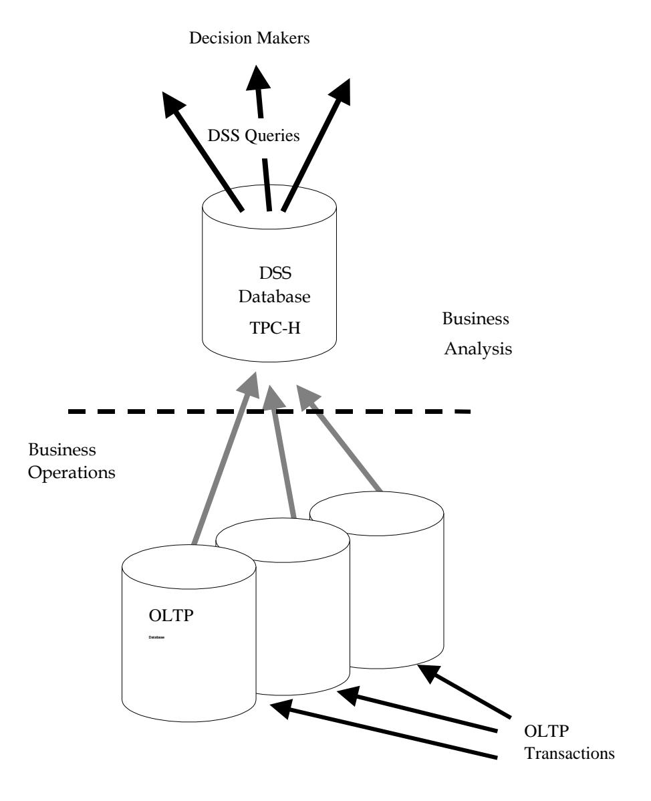
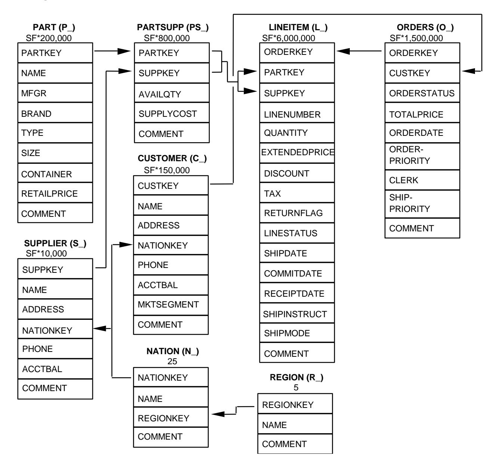
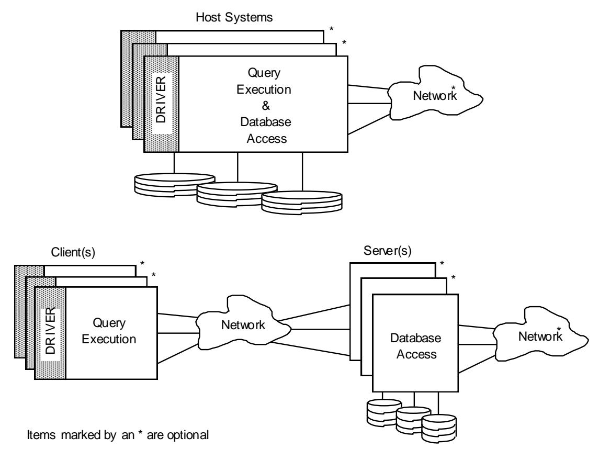
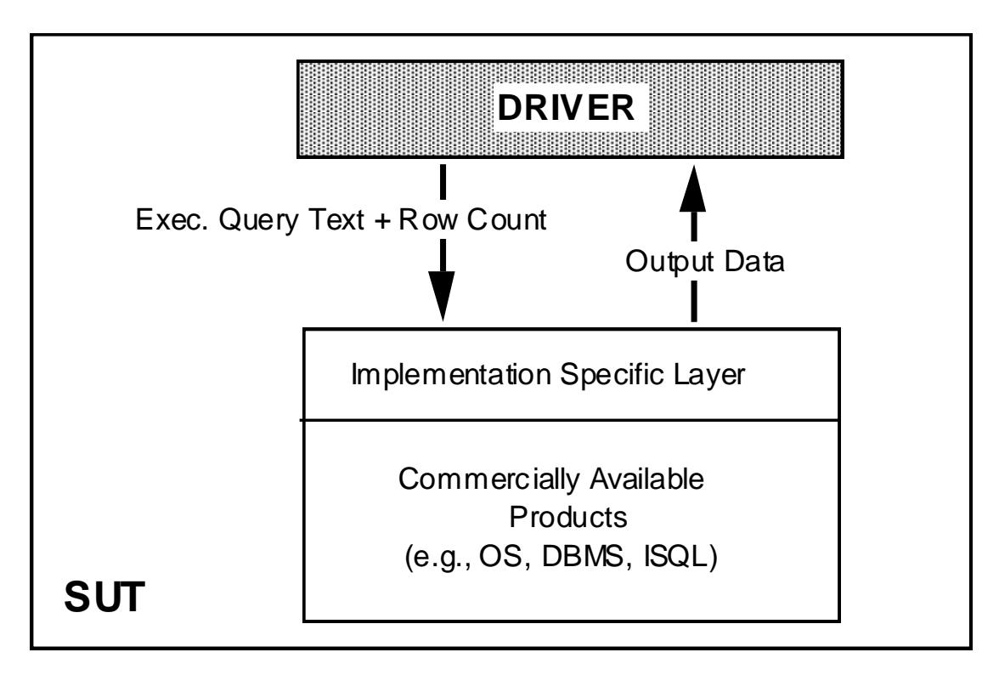
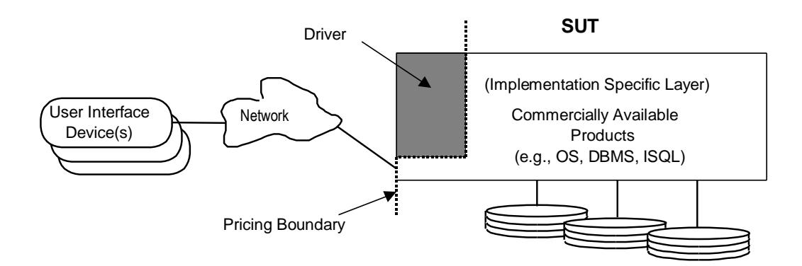
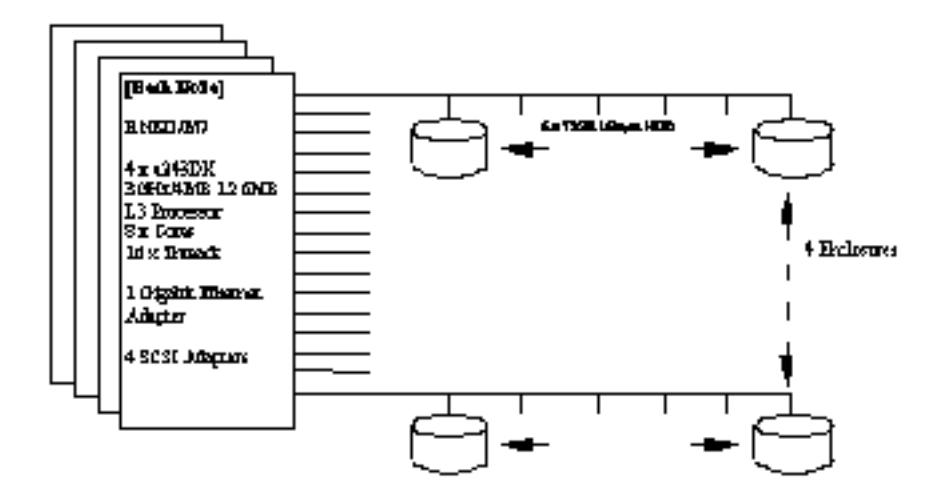

# **TPC BENCHMARKTM H**

(Decision Support) Standard Specification Revision 2.17.1

Transaction Processing Performance Council (TPC) Presidio of San Francisco Building 572B Ruger St. (surface) P.O. Box 29920 (mail) San Francisco, CA 94129-0920 Voice:415-561-6272 Fax:415-561-6120 Email: webmaster@tpc.org

© 1993 - 2014 Transaction Processing Performance Council

## **Acknowledgments**

The TPC acknowledges the work and contributions of the TPC-D subcommittee member companies in developing Version 2 of the TPC-D specification which formed the basis for TPC-H Version 1. The subcommittee included representatives from Compaq, Data General, Dell, EMC, HP, IBM, Informix, Microsoft, NCR, Oracle, Sequent, SGI, Sun, Sybase, and Unisys. The TPC also acknowledges the contribution of Jack Stephens, consultant to the TPC-D subcommittee, for his work on the benchmark specification and DBGEN development.

## **TPC Membership**

(as of June 2013)

### **Full Members**

| CISCO. | DELL    | FUJITSU                  | hp<br>invent                     | HITACHI |
|--------|---------|--------------------------|----------------------------------|---------|
| HUAWEI | IBM     | intel                    | Microsoft                        | NEC     |
| ORACLE | redhat. | SYBASE<br>An SAP Company | TERADATA<br>Raising Intelligence | UNISYS  |
| vmware |         |                          |                                  |         |

### **Associate Members**


## **Document History**

| Date                 | Version         | Description                                                                                                                                                                                                                                                                                                                                                                                                                                                                                                                                                                                                                                                                                                                                                                |
|----------------------|-----------------|----------------------------------------------------------------------------------------------------------------------------------------------------------------------------------------------------------------------------------------------------------------------------------------------------------------------------------------------------------------------------------------------------------------------------------------------------------------------------------------------------------------------------------------------------------------------------------------------------------------------------------------------------------------------------------------------------------------------------------------------------------------------------|
| 26 February 1999     | Draft 1.0.0     | Mail ballot draft for Standard Specification                                                                                                                                                                                                                                                                                                                                                                                                                                                                                                                                                                                                                                                                                                                               |
| 24 June 1999         | Revision 1.1.0  | First minor revision of the Specification                                                                                                                                                                                                                                                                                                                                                                                                                                                                                                                                                                                                                                                                                                                                  |
| 25 April 2002        | Revision 1.4.0  | Clarification about Primary Keys                                                                                                                                                                                                                                                                                                                                                                                                                                                                                                                                                                                                                                                                                                                                           |
| 12 July 2002         | Revision 1.5.0  | Additions for EOL of hardware in 8.6                                                                                                                                                                                                                                                                                                                                                                                                                                                                                                                                                                                                                                                                                                                                       |
| 15 July 2002         | Revision 2.0.0  | Mail ballot draft 3 year maintenance pricing                                                                                                                                                                                                                                                                                                                                                                                                                                                                                                                                                                                                                                                                                                                               |
| 14 August 2003       | Revision 2.1.0  | Adding scale factors 30TB and 100TB                                                                                                                                                                                                                                                                                                                                                                                                                                                                                                                                                                                                                                                                                                                                        |
| 29 June 2005         | Revision 2.2.0  | Adding Pricing Specification 1.0.0                                                                                                                                                                                                                                                                                                                                                                                                                                                                                                                                                                                                                                                                                                                                         |
| 11 August 2005       | Revision 2.3.0  | Changing pricing precision to cents and processor definition                                                                                                                                                                                                                                                                                                                                                                                                                                                                                                                                                                                                                                                                                                               |
| 23 June 2006         | Revision 2.4.0  | Adding reference data set and audit requirements to verify populated<br>database, effect of update data and qgen substitution parameters.<br>Scale factors larger than 10,000 are required to use this version.                                                                                                                                                                                                                                                                                                                                                                                                                                                                                                                                                            |
| 10 July 2006         | Revision 2.5.0  | dbgen bug fixes in parallel data generation, updates to reference data<br>set/qualification output, modified audit rules and updated executive<br>summary example.                                                                                                                                                                                                                                                                                                                                                                                                                                                                                                                                                                                                         |
| 26 October 2006      | Revision 2.6.0  | Added Clause 7.2.3.1 about software license pricing, removed Clause<br>7.1.3.3 about 8 hour log requirement and updated executive summary<br>example in Appendix E                                                                                                                                                                                                                                                                                                                                                                                                                                                                                                                                                                                                         |
| 14 June 2006         | Revision 2.6.1  | Editorial correction in Clause 2.1.3.3. Clarification of Clause 9.2.4.5                                                                                                                                                                                                                                                                                                                                                                                                                                                                                                                                                                                                                                                                                                    |
| 28 February 2008     | Revision 2.6.2  | Change substr into substring in Clause 2.25.2, update of membership<br>list, TPC address and copyright statement                                                                                                                                                                                                                                                                                                                                                                                                                                                                                                                                                                                                                                                           |
| 17 April 2008        | Revision 2.7.0  | Incorporate BUG fix 595 of qgen                                                                                                                                                                                                                                                                                                                                                                                                                                                                                                                                                                                                                                                                                                                                            |
| 11 September<br>2008 | Revision 2.8.0  | Add wording to allow substitutions in Clause 7.2. Modify clauses 5.4,<br>5.4.6, 8.4.2.2 and 9.2.6.1 to refer to pricing specification. Update TPC<br>member companies.                                                                                                                                                                                                                                                                                                                                                                                                                                                                                                                                                                                                     |
| 17 September<br>2009 | Revision 2.9.0  | Add Clause 8.3.5.10 to require wording for memory-to-scale factor<br>ratio in ES. Removed references to RAID and added data redundancy<br>to Clauses 3.1.4, 4.3.2, 4.3.6, 8.3.5.4, and 8.4.2.4. Editorial<br>corrections. Update TPC member companies.                                                                                                                                                                                                                                                                                                                                                                                                                                                                                                                     |
| 11 February 2010     | Revision 2.10.0 | Adapted necessary modifications required by Energy Specification.<br>Modified Clause 8 to require electronic version of FDR. Added vendor<br>specific INCLDUES into dbgen/qgen. Modified Clause 1.5.4 and<br>2.13.3. Updated TPC member companies. Included editorial changes<br>from FogBugz 217, 218, 219.                                                                                                                                                                                                                                                                                                                                                                                                                                                               |
| Date                 | Revision        | Description                                                                                                                                                                                                                                                                                                                                                                                                                                                                                                                                                                                                                                                                                                                                                                |
| 29 April 2010        | Revision 2.11.0 | Added clause 9.2.3.3 to the auditor check list (power off SUT as part<br>of durability testing). Added comment after clause 2.1.3.5 (precision).<br>Modified clause 3.5.4 points 2 and 3 to clarify ACID testing.<br>Clarification of rounding with a new definitions section 10:<br>Clarification of partitioning by date (clause 1.5.4). Require query<br>output to be put into the supporting file archive (clause 8.3.4.3 ).                                                                                                                                                                                                                                                                                                                                           |
| 25 June 2010         | Revision 2.12.0 | Fixed numerous bad cross references and editorial edits (fogbugz 243<br>& 245). Clarify primary and foreign keys as constraints and add them<br>to the global definitions section. Fix bugs 252 by simplifying the<br>description of string lengths generated by dbgen. Clarify references to<br>the refresh stream for bug 254. Added requirement to split electronic<br>Supporting Files Archive into 3 separate zip files for ease of<br>download.                                                                                                                                                                                                                                                                                                                      |
| 11 November 2010     | Revision 2.13.0 | Clarified the procedure to follow if problems with <b>DBGen</b> or <b>QGen</b><br>are found (Fogbugz 259). Reorganized the query definitions to show<br>only a sample output row and reorganized the clause numbering.<br>Regenerated the answer set files for easier comparison and to correct<br>errors (fogbugz 293). Added an auditor checklist item to validate the<br>qualification results (fogbugz 302). Fixed a distribution issue in<br><b>DBGen</b> (software only) (fogbugz 301), which necessitated new<br>references data and answer set files. Restored column L_TAX to the<br>description for table Lineitem in Clause 1.4.1 (fogbugz 358). Fixed a<br>bad clause reference in clause 9.1.4 that was targeting 1.5.7 and should<br>be 1.5.6 (Fogbugz 360). |
| 11 February 2011     | Revision 2.14.0 | Editorial fix of clause references (Fogbugz 370). Update membership<br>list and table of icons (Fogbugz 391). Augment Clause 2.1.3.5 about<br>precision of query output (Fogbugz 359). Editorial clarification in<br>Clause 1.4.2 (Fogbugz 421). Replace/update Executive Summary<br>examples in Appendix E (Fogbugz 253). Clarify/update requirements<br>relating to data generation and loading phases in Clause 4.3 (Fogbugz<br>419).                                                                                                                                                                                                                                                                                                                                   |
| 7 April 2011         | Revision 2.14.1 | Increment point-version number to align with DBGEN release. No<br>editorial change.                                                                                                                                                                                                                                                                                                                                                                                                                                                                                                                                                                                                                                                                                        |
| 16 June 2011         | Revision 2.14.2 | Align definition of database population (for S_NAME, P_MFGR,<br>P_BRAND, C_NAME and O_CLERK) with DBGen (Fogbugz 463,<br>464 and 465)                                                                                                                                                                                                                                                                                                                                                                                                                                                                                                                                                                                                                                      |
| 18 November 2011     | Revision 2.14.3 | Correct description of Q19 to match SQL. Revise sample Executive<br>Summary.                                                                                                                                                                                                                                                                                                                                                                                                                                                                                                                                                                                                                                                                                               |
| 13 April 2012        | Revision 2.14.4 | Correction for FogBugz entry 536: change bullet 5 in Clause 4.2.3<br>from L_RECEIPTDATE = O_ORDERDATE + random value [1 ..<br>30] to L_RECEIPTDATE = L_SHIPDATE + random value [1 .. 30].                                                                                                                                                                                                                                                                                                                                                                                                                                                                                                                                                                                  |
| 7 February 2013      | Revision 2.15.0 | FogBugz 279: Mandate disclosure of user documentation<br>FogBugz 512: Define GUI and requirements around disclosure in<br>Clause 8.3<br>FogBugz 604: Reference wrong in 2.5.3.1<br>FogBugz 606: DBgen bug - removing separators                                                                                                                                                                                                                                                                                                                                                                                                                                                                                                                                            |
| 20 June 2013         | Revision 2.16.0 | FogBugz 613: Code fix for Q4 wrong substitution parameter<br>generation.<br>FogBugz 614: Code fix for Q22 wrong substitution parameter<br>generation.                                                                                                                                                                                                                                                                                                                                                                                                                                                                                                                                                                                                                      |
| 24 April 2014        | Revision 2.17.0 | Replaced incorrect answer set with verified correct answer set.<br>Allowed truncation of specific query answers to reduce supporting file<br>size.                                                                                                                                                                                                                                                                                                                                                                                                                                                                                                                                                                                                                         |
| 13 November 2014     | Revision 2.17.1 | Corrected bad references in clauses 2.6.2 and 2.7.2, as noted in<br>FogBugz items 669 and 855.                                                                                                                                                                                                                                                                                                                                                                                                                                                                                                                                                                                                                                                                             |

TPC Benchmark™, TPC-H, QppH, QthH, and QphH are trademarks of the Transaction Processing Performance Council.

All parties are granted permission to copy and distribute to any party without fee all or part of this material provided that: 1) copying and distribution is done for the primary purpose of disseminating TPC material; 2) the TPC copyright notice, the title of the publication, and its date appear, and notice is given that copying is by permission of the Transaction Processing Performance Council.

Parties wishing to copy and distribute TPC materials other than for the purposes outlined above (including incorporating TPC material in a non-TPC document, specification or report), must secure the TPC's written permission.

## **Table of Contents**

| 0: INTRODUCTION                                                  | 1                                                                       |    |
|------------------------------------------------------------------|-------------------------------------------------------------------------|----|
| 0.1 Preamble                                                     | 1                                                                       |    |
| 0.2 GENERAL IMPLEMENTATION GUIDELINES                            | 1                                                                       |    |
| 0.3 GENERAL MEASUREMENT GUIDELINES                               | 1                                                                       |    |
| 1: LOGICAL DATABASE DESIGN                                       | 1                                                                       |    |
| 1.1 BUSINESS AND APPLICATION ENVIRONMENT                         | 1                                                                       |    |
| 1.2 DATABASE ENTITIES, RELATIONSHIPS, AND CHARACTERISTICS        | 1                                                                       |    |
| 1.3 DATATYPE DEFINITIONS                                         | 1                                                                       |    |
| 1.4 TABLE LAYOUTS                                                | 1                                                                       |    |
| 1.5 IMPLEMENTATION RULES                                         | 1                                                                       |    |
| 1.6 DATA ACCESS TRANSPARENCY REQUIREMENTS                        | 2                                                                       |    |
| 2: QUERIES AND REFRESH FUNCTIONS                                 | 2                                                                       |    |
| 2.1 GENERAL REQUIREMENTS AND DEFINITIONS FOR QUERIES             | 2                                                                       |    |
| 2.2 QUERY COMPLIANCE                                             | 2                                                                       |    |
| 2.3 QUERY VALIDATION                                             | 2                                                                       |    |
| 2.4 QUERY DEFINITIONS                                            | 2                                                                       |    |
| 2.5 GENERAL REQUIREMENTS FOR REFRESH FUNCTIONS                   | 6                                                                       |    |
| 2.6 NEW SALES REFRESH FUNCTION (RF1)                             | 6                                                                       |    |
| 2.71 OLD SALES REFRESH FUNCTION (RF2)                            | 6                                                                       |    |
| 2.8 DATABASE EVOLUTION PROCESS                                   | 6                                                                       |    |
| 3: THE ACID PROPERTIES                                           | 7                                                                       |    |
| 3.2 ATOMICITY REQUIREMENTS                                       | 7                                                                       |    |
| 3.3 CONSISTENCY REQUIREMENTS                                     | 7                                                                       |    |
| 3.4 ISOLATION REQUIREMENTS                                       | 7                                                                       |    |
| 3.5 DURABILITY REQUIREMENTS                                      | 7                                                                       |    |
| 4: SCALING AND DATABASE POPULATION                               | 7                                                                       |    |
| 4.1 DATABASE DEFINITION AND SCALING                              | 7                                                                       |    |
| 4.2 DBGEN AND DATABASE POPULATION                                | 8                                                                       |    |
| 4.3 DATABASE LOAD TIME                                           | 8                                                                       |    |
| 5: PERFORMANCE METRICS AND EXECUTION RULES                       | 9                                                                       |    |
| 5.1 DEFINITION OF TERMS                                          | 9                                                                       |    |
| 5.2 CONFIGURATION RULES                                          | 9                                                                       |    |
| 5.3 EXECUTION RULES                                              | 9                                                                       |    |
| 5.4 METRICS                                                      | 9                                                                       |    |
| 6: SUT AND DRIVER IMPLEMENTATION                                 | 10                                                                      |    |
| 6.1 MODELS OF TESTED CONFIGURATIONS                              | 10                                                                      |    |
| 6.2 SYSTEM UNDER TEST (SUT) DEFINITION                           | 10                                                                      |    |
| 6.3 DRIVER DEFINITION                                            | 10                                                                      |    |
| 7: PRICING                                                       | 10                                                                      |    |
| 7.1 PRICED SYSTEM                                                | 10                                                                      |    |
| 7.2 ALLOWABLE SUBSTITUTIONS                                      | 10                                                                      |    |
| 8: FULL DISCLOSURE                                               | 10                                                                      |    |
| 8.1 REPORTING REQUIREMENTS                                       | 10                                                                      |    |
| 8.2 FORMAT GUIDELINES                                            | 10                                                                      |    |
| 8.3 FULL DISCLOSURE REPORT CONTENTS AND SUPPORTING FILES ARCHIVE | 10                                                                      |    |
| 8.4 EXECUTIVE SUMMARY                                            | 11                                                                      |    |
| 8.5                                                              | AVAILABILITY OF THE FULL DISCLOSURE REPORT AND SUPPORTING FILES ARCHIVE | 11 |
| 8.6                                                              | REVISIONS TO THE FULL DISCLOSURE REPORT AND SUPPORTING FILES ARCHIVE    | 11 |
| <b>9: AUDIT</b>                                                  |                                                                         | 11 |
| 9.1                                                              | GENERAL RULES                                                           | 11 |
| 9.2                                                              | AUDITOR'S CHECK LIST                                                    | 11 |
| <b>10: GLOBAL DEFINITIONS</b>                                    |                                                                         | 12 |
| <b>APPENDIX A: ORDERED SETS</b>                                  |                                                                         | 12 |
| <b>APPENDIX B: APPROVED QUERY VARIANTS</b>                       |                                                                         | 12 |
| <b>APPENDIX C: QUERY VALIDATION</b>                              |                                                                         | 12 |
| <b>APPENDIX D: DATA AND QUERY GENERATION PROGRAMS</b>            |                                                                         | 13 |
| <b>APPENDIX E: SAMPLE EXECUTIVE SUMMARY</b>                      |                                                                         | 13 |
| <b>APPENDIX F: REFERENCE DATA SET</b>                            |                                                                         | 13 |

# **0: INTRODUCTION**

## **0.1 Preamble**

The TPC Benchmark™H (TPC-H) is a decision support benchmark. It consists of a suite of business oriented ad-hoc queries and concurrent data modifications. The queries and the data populating the database have been chosen to have broad industry-wide relevance while maintaining a sufficient degree of ease of implementation. This benchmark illustrates decision support systems that

- Examine large volumes of data;
- Execute queries with a high degree of complexity;
- Give answers to critical business questions.

TPC-H evaluates the performance of various decision support systems by the execution of sets of queries against a standard database under controlled conditions. The TPC-H queries:

- Give answers to real-world business questions;
- Simulate generated ad-hoc queries (e.g., via a point and click GUI interface);
- Are far more complex than most OLTP transactions;
- Include a rich breadth of operators and selectivity constraints;
- Generate intensive activity on the part of the database server component of the system under test;
- Are executed against a database complying to specific population and scaling requirements;
- Are implemented with constraints derived from staying closely synchronized with an on-line production database.

The TPC-H operations are modeled as follows:

- The database is continuously available 24 hours a day, 7 days a week, for ad-hoc queries from multiple end users and data modifications against all tables, except possibly during infrequent (e.g., once a month) maintenance sessions;
- The TPC-H database tracks, possibly with some delay, the state of the OLTP database through on-going refresh functions which batch together a number of modifications impacting some part of the decision support database;
- Due to the world-wide nature of the business data stored in the TPC-H database, the queries and the refresh functions may be executed against the database at any time, especially in relation to each other. In addition, this mix of queries and refresh functions is subject to specific ACIDity requirements, since queries and refresh functions may execute concurrently;
- To achieve the optimal compromise between performance and operational requirements, the database administrator can set, once and for all, the locking levels and the concurrent scheduling rules for queries and refresh functions.

The minimum database required to run the benchmark holds business data from 10,000 suppliers. It contains almost ten million rows representing a raw storage capacity of about 1 gigabyte. Compliant benchmark implementations may also use one of the larger permissible database populations (e.g., 100 gigabytes), as defined in Clause [4.1.3.](#page-78-0)

The performance metric reported by TPC-H is called the TPC-H Composite Query-per-Hour Performance Metric (QphH@Size), and reflects multiple aspects of the capability of the system to process queries. These aspects include the selected database size against which the queries are executed, the query processing power when queries are submitted by a single stream and the query throughput when queries are submitted by multiple concurrent users. The TPC-H Price/Performance metric is expressed as \$/QphH@Size. To be compliant with the TPC-H standard, all references to TPC-H results for a given configuration must include all required reporting components (see Clause [5.4.6\)](#page-99-0). The TPC believes that comparisons of TPC-H results measured against different database sizes are misleading and discourages such comparisons.

The TPC-H database must be implemented using a commercially available database management system (DBMS) and the queries executed via an interface using dynamic SQL. The specification provides for variants of SQL, as implementers are not required to have implemented a specific SQL standard in full.

TPC-H uses terminology and metrics that are similar to other benchmarks, originated by the TPC and others. Such similarity in terminology does not in any way imply that TPC-H results are comparable to other benchmarks. The only benchmark results comparable to TPC-H are other TPC-H results compliant with the same revision.

Despite the fact that this benchmark offers a rich environment representative of many decision support systems, this benchmark does not reflect the entire range of decision support requirements. In addition, the extent to which a customer can achieve the results reported by a vendor is highly dependent on how closely TPC-H approximates the customer application. The relative performance of systems derived from this benchmark does not necessarily hold for other workloads or environments. Extrapolations to any other environment are not recommended.

Benchmark results are highly dependent upon workload, specific application requirements, and systems design and implementation. Relative system performance will vary as a result of these and other factors. Therefore, TPC-H should not be used as a substitute for a specific customer application benchmarking when critical capacity planning and/or product evaluation decisions are contemplated.

Benchmark sponsors are permitted several possible system designs, provided that they adhere to the model described in Clause [6: .](#page-100-0) A full disclosure report (FDR) of the implementation details, as specified in Clause 8, must be made available along with the reported results.

**Comment 1:** While separated from the main text for readability, comments and appendices are a part of the standard and their provisions must be complied with.

**Comment 2:** The contents of some appendices are provided in a machine readable format and are not included in the printed copy of this document.

## <span id="page-8-0"></span>**0.2 General Implementation Guidelines**

The rules for pricing are included in the TPC Pricing Specification located at www.tpc.org.

The purpose of TPC benchmarks is to provide relevant, objective performance data to industry users. To achieve that purpose, TPC benchmark specifications require that benchmark tests be implemented with systems, products, technologies and pricing that:

- Are generally available to users;
- Are relevant to the market segment that the individual TPC benchmark models or represents (e.g., TPC-H models and represents complex, high data volume, decision support environments);
- Would plausibly be implemented by a significant number of users in the market segment the benchmark models or represents.

The use of new systems, products, technologies (hardware or software) and pricing is encouraged so long as they meet the requirements above. Specifically prohibited are benchmark systems, products, technologies or pricing (hereafter referred to as "implementations") whose primary purpose is performance optimization of TPC benchmark results without any corresponding applicability to real-world applications and environments. In other words, all "benchmark special" implementations that improve benchmark results but not real-world performance or pricing, are prohibited.

The following characteristics shall be used as a guide to judge whether a particular implementation is a benchmark special. It is not required that each point below be met, but that the cumulative weight of the evidence be considered to identify an unacceptable implementation. Absolute certainty or certainty beyond a reasonable doubt is not required to make a judgment on this complex issue. The question that must be answered is: "Based on the available evidence, does the clear preponderance (the greater share or weight) of evidence indicate that this implementation is a benchmark special?"

The following characteristics shall be used to judge whether a particular implementation is a benchmark special:

- a) Is the implementation generally available, **externally documented**, and supported?
- b) Does the implementation have significant restrictions on its use or applicability that limits its use beyond TPC benchmarks?
- c) Is the implementation or part of the implementation poorly integrated into the larger product?
- d) Does the implementation take special advantage of the limited nature of TPC benchmarks (e.g., query profiles, query mix, concurrency and/or contention, isolation requirements, etc.) in a manner that would not be generally applicable to the environment the benchmark represents?
- e) Is the use of the implementation discouraged by the vendor? (This includes failing to promote the implementation in a manner similar to other products and technologies.)
- f) Does the implementation require uncommon sophistication on the part of the end-user, programmer, or system administrator?
- g) Is the implementation (including beta) being purchased or used for applications in the market area the benchmark represents? How many sites implemented it? How many end-users benefit from it? If the implementation is not currently being purchased or used, is there any evidence to indicate that it will be purchased or used by a significant number of end-user sites?

**Comment**: The characteristics listed in this clause are not intended to include the driver or implementation specific layer, which are not necessarily commercial software, and have their own specific requirements and limitation enumerated in Clause [6: .](#page-100-0) The listed characteristics and prohibitions of Clause 6 should be used to determine if the driver or implementation specific layer is a benchmark special.

## **0.3 General Measurement Guidelines**

TPC benchmark results are expected to be accurate representations of system performance. Therefore, there are certain guidelines that are expected to be followed when measuring those results. The approach or methodology to be used in the measurements are either explicitly described in the specification or left to the discretion of the test sponsor. When not described in the specification, the methodologies and approaches used must meet the following requirements:

- The approach is an accepted engineering practice or standard;
- The approach does not enhance the result;
- Equipment used in measuring the results is calibrated according to established quality standards;
- Fidelity and candor is maintained in reporting any anomalies in the results, even if not specified in the TPC benchmark requirements.

**Comment:** The use of new methodologies and approaches is encouraged so long as they meet the requirements above.

# **1: LOGICAL DATABASE DESIGN**

## **1.1 Business and Application Environment**

TPC Benchmark™ H is comprised of a set of business queries designed to exercise system functionalities in a manner representative of complex business analysis applications. These queries have been given a realistic context, portraying the activity of a wholesale supplier to help the reader relate intuitively to the components of the benchmark.

TPC-H does not represent the activity of any particular business segment, but rather any industry which must manage sell, or distribute a product worldwide (e.g., car rental, food distribution, parts, suppliers, etc.). TPC-H does not attempt to be a model of how to build an actual information analysis application.

The purpose of this benchmark is to reduce the diversity of operations found in an information analysis application, while retaining the application's essential performance characteristics, namely: the level of system utilization and the complexity of operations. A large number of queries of various types and complexities needs to be executed to completely manage a business analysis environment. Many of the queries are not of primary interest for performance analysis because of the length of time the queries run, the system resources they use and the frequency of their execution. The queries that have been selected exhibit the following characteristics:

- They have a high degree of complexity;
- They use a variety of access
- They are of an ad hoc nature;
- They examine a large percentage of the available data;
- They all differ from each other;
- They contain query parameters that change across query executions.

These selected queries provide answers to the following classes of business analysis:

- Pricing and promotions;
- Supply and demand management;
- Profit and revenue management;
- Customer satisfaction study;
- Market share study;
- Shipping management.

Although the emphasis is on information analysis, the benchmark recognizes the need to periodically refresh the database. The database is not a one-time snapshot of a business operations database nor is it a database where OLTP applications are running concurrently. The database must, however, be able to support queries and refresh functions against all tables on a 7 day by 24 hour (7 x 24) basis.

While the benchmark models a business environment in which refresh functions are an integral part of data maintenance, the refresh functions actually required in the benchmark do not attempt to model this aspect of the business environment. Their purpose is rather to demonstrate the update functionality for the DBMS, while simultaneously assessing an appropriate performance cost to the maintenance of auxiliary data structures, such as secondary indices.

**Comment**: The benchmark does not include any test or measure to verify continuous database availability or particular system features which would make the benchmarked configuration appropriate for 7x24 operation. References to continuous availability and 7x24 operation are included in the benchmark specification to provide a more complete picture of the anticipated decision support environment. A configuration offering less that 7x24 availability can produce compliant benchmark results as long as it meets all the requirements described in this specification.



Figure 1: The TPC-H Business Environment illustrates the TPC-H business environment and highlights the basic differences between TPC-H and other TPC benchmarks.

#### **Figure 1: The TPC-H Business Environment**

Other TPC benchmarks model the operational end of the business environment where transactions are executed on a real time basis. The TPC-H benchmark, however, models the analysis end of the business environment where trends are computed and refined data are produced to support the making of sound business decisions. In OLTP benchmarks the raw data flow into the OLTP database from various sources where it is maintained for some period of time. In TPC-H, periodic refresh functions are performed against a DSS database whose content is queried on behalf of or by various decision makers.

## <span id="page-12-0"></span>**1.2 Database Entities, Relationships, and Characteristics**

The components of the TPC-H database are defined to consist of eight separate and individual tables (the Base Tables). The relationships between columns of these tables are illustrated in Figure 2: The TPC-H Schema.

**Figure 2: The TPC-H Schema**



### **Legend:**

- The parentheses following each table name contain the prefix of the column names for that table;
- The arrows point in the direction of the one-to-many relationships between tables;
- The number/formula below each table name represents the cardinality (number of rows) of the table. Some are factored by SF, the Scale Factor, to obtain the chosen database size. The cardinality for the LINEITEM table is approximate (see Clause [4.2.5\)](#page-87-0).

## <span id="page-13-2"></span>**1.3 Datatype Definitions**

- <span id="page-13-3"></span>1.3.1 The following datatype definitions apply to the list of columns of each table:
  - **Identifier** means that the column must be able to hold any key value generated for that column and be able to support at least 2,147,483,647 unique values;

**Comment**: A common implementation of this datatype will be an integer. However, for SF greater than 300 some column values will exceed the range of integer values supported by a 4-byte integer. A test sponsor may use some other datatype such as 8-byte integer, decimal or character string to implement the identifier datatype;

- **Integer** means that the column must be able to exactly represent integer values (i.e., values in increments of 1) in the range of at least -2,147,483,646 to 2,147,483,647.
- **Decimal** means that the column must be able to represent values in the range -9,999,999,999.99 to +9,999,999,999.99 in increments of 0.01; the values can be either represented exactly or interpreted to be in this range;
- **Big Decimal** is of the Decimal datatype as defined above, with the additional property that it must be large enough to represent the aggregated values stored in temporary tables created within query variants;
- **Fixed text, size N** means that the column must be able to hold any string of characters of a fixed length of N.

**Comment:** If the string it holds is shorter than N characters, then trailing spaces must be stored in the database or the database must automatically pad with spaces upon retrieval such that a CHAR\_LENGTH() function will return N.

- **Variable text, size N** means that the column must be able to hold any string of characters of a variable length with a maximum length of N. Columns defined as "variable text, size N" may optionally be implemented as "fixed text, size N";
- **Date** is a value whose external representation can be expressed as YYYY-MM-DD, where all characters are numeric. A date must be able to express any day within at least 14 consecutive years. There is no requirement specific to the internal representation of a date.

**Comment:** The implementation datatype chosen by the test sponsor for a particular datatype definition must be applied consistently to all the instances of that datatype definition in the schema, except for identifier columns, whose datatype may be selected to satisfy database scaling requirements.

<span id="page-13-1"></span>1.3.2 The symbol SF is used in this document to represent the scale factor for the database (see Clause [4: \)](#page-78-1).

## **1.4 Table Layouts**

<span id="page-13-0"></span>

### **1.4.1 Required Tables**

The following list defines the required structure (list of columns) of each table.

The annotations 'Primary Key' and 'Foreign Key', as used in this Clause, are for information only and do not imply additional requirements to implement **primary key** and **foreign key** constraints (see Clause 1.4.2).

#### **PART Table Layout**

| Column Name | Datatype Requirements | Comment |
|-------------|-----------------------|---------|
|-------------|-----------------------|---------|

P\_PARTKEY identifier SF\*200,000 are populated

P\_NAME variable text, size 55

P\_MFGR fixed text, size 25

P\_BRAND fixed text, size 10

P\_TYPE variable text, size 25

P\_SIZE integer

P\_CONTAINER fixed text, size 10

P\_RETAILPRICE decimal

P\_COMMENT variable text, size 23

Primary Key**:** P\_PARTKEY

#### **SUPPLIER Table Layout**

Column Name Datatype Requirements Comment

S\_SUPPKEY identifier SF\*10,000 are populated

S\_NAME fixed text, size 25

S\_ADDRESS variable text, size 40

S\_NATIONKEY Identifier Foreign Key to N\_NATIONKEY

S\_PHONE fixed text, size 15

S\_ACCTBAL decimal

S\_COMMENT variable text, size 101

Primary Key**:** S\_SUPPKEY

#### **PARTSUPP Table Layout**

Column Name Datatype Requirements Comment

PS\_PARTKEY Identifier Foreign Key to P\_PARTKEY

PS\_SUPPKEY Identifier Foreign Key to S\_SUPPKEY

PS\_AVAILQTY integer

PS\_SUPPLYCOST Decimal

PS\_COMMENT variable text, size 199

Primary Key**:** PS\_PARTKEY, PS\_SUPPKEY

#### **CUSTOMER Table Layout**

Column Name Datatype Requirements Comment

C\_CUSTKEY Identifier SF\*150,000 are populated

C\_NAME variable text, size 25

C\_ADDRESS variable text, size 40

C\_NATIONKEY Identifier Foreign Key to N\_NATIONKEY

C\_PHONE fixed text, size 15

C\_ACCTBAL Decimal

C\_MKTSEGMENT fixed text, size 10

C\_COMMENT variable text, size 117

Primary Key**:** C\_CUSTKEY

#### **ORDERS Table Layout**

Column Name Datatype Requirements Comment

O\_ORDERKEY Identifier SF\*1,500,000 are sparsely populated

O\_CUSTKEY Identifier Foreign Key to C\_CUSTKEY

O\_ORDERSTATUS fixed text, size 1

O\_TOTALPRICE Decimal

O\_ORDERDATE Date

O\_ORDERPRIORITY fixed text, size 15

O\_CLERK fixed text, size 15

O\_SHIPPRIORITY Integer

O\_COMMENT variable text, size 79

Primary Key**:** O\_ORDERKEY

**Comment:** Orders are not present for all customers. In fact, one-third of the customers do not have any order in the database. The orders are assigned at random to two-thirds of the customers (see Clause [4: \)](#page-78-1). The purpose of this is to exercise the capabilities of the DBMS to handle "dead data" when joining two or more tables.

#### **LINEITEM Table Layout**

| Column Name | Datatype Requirements | Comment                                                                                                            |
|-------------|-----------------------|--------------------------------------------------------------------------------------------------------------------|
| L_ORDERKEY  | identifier            | Foreign Key to O_ORDERKEY                                                                                          |
| L_PARTKEY   | identifier            | Foreign key to P_PARTKEY, first part of the<br>compound Foreign Key to (PS_PARTKEY,<br>PS_SUPPKEY) with L_SUPPKEY  |
| L_SUPPKEY   | Identifier            | Foreign key to S_SUPPKEY, second part of the<br>compound Foreign Key to (PS_PARTKEY,<br>PS_SUPPKEY) with L_PARTKEY |

#### PS\_SUPPKEY) with L\_PARTKEY

L\_LINENUMBER integer

L\_QUANTITY decimal

L\_EXTENDEDPRICE decimal

L\_DISCOUNT decimal

L\_TAX decimal

L\_RETURNFLAG fixed text, size 1

L\_LINESTATUS fixed text, size 1

L\_SHIPDATE date

L\_COMMITDATE date

L\_RECEIPTDATE date

L\_SHIPINSTRUCT fixed text, size 25

L\_SHIPMODE fixed text, size 10

L\_COMMENT variable text size 44

Primary Key**:** L\_ORDERKEY, L\_LINENUMBER

#### **NATION Table Layout**

Column Name Datatype Requirements Comment

N\_NATIONKEY identifier 25 nations are populated

N\_NAME fixed text, size 25

N\_REGIONKEY identifier Foreign Key to R\_REGIONKEY

N\_COMMENT variable text, size 152

Primary Key**:** N\_NATIONKEY

#### **REGION Table Layout**

Column Name Datatype Requirements Comment

R\_REGIONKEY identifier 5 regions are populated

R\_NAME fixed text, size 25

R\_COMMENT variable text, size 152

Primary Key**:** R\_REGIONKEY

### **1.4.2 Constraints**

The use of constraints is optional and limited to **primary key**, **foreign key**, check, and not null constraints. If constraints are used, they must satisfy the following requirements:

- They must be specified using SQL. There is no specific implementation requirement. For example, CREATE TABLE, ALTER TABLE, CREATE UNIQUE INDEX, and CREATE TRIGGER are all valid statements;
- Constraints must be enforced either at the statement level or at the transaction level;
- All defined constraints must be enforced and validated before the load test is complete (see Clause [5.1.1.2\)](#page-91-0);
- 1.4.2.1 The NOT NULL attribute may be used for any column.
- 1.4.2.2 The following columns or set of columns listed in Clause [1.4.1](#page-13-0) as 'Primary Key' may be defined as **primary key** constraints (using the PRIMARY KEY clause or other equivalent syntax):
  - P\_PARTKEY;
  - S\_SUPPKEY;
  - PS\_PARTKEY, PS\_SUPPKEY;
  - C\_CUSTKEY;
  - O\_ORDERKEY;
  - L\_ORDERKEY, L\_LINENUMBER;
  - N\_NATIONKEY;
  - R\_REGIONKEY.

Defining a **primary key** constraint can only be done for the columns listed above.

- 1.4.2.3 Columns listed in the comments of Clause [1.4.1](#page-13-0) as 'Foreign Key' may be defined as **foreign key** constraints. There is no specific requirement to use referential actions (e.g., RESTRICT, CASCADE, NO ACTION, etc.). If any **foreign key** constraint is defined by an implementation, then all the **foreign key** constraints listed below must be defined by the implementation (using the FOREIGN KEY clause or other equivalent syntax):S\_NATIONKEY (referencing N\_NATIONKEY);
  - PS\_PARTKEY (referencing P\_PARTKEY);
  - PS\_SUPPKEY (referencing S\_SUPPKEY);
  - C\_NATIONKEY (referencing N\_NATIONKEY);
  - O\_CUSTKEY (referencing C\_CUSTKEY);
  - L\_ORDERKEY (referencing O\_ORDERKEY);
  - L\_PARTKEY (referencing P\_PARTKEY);
  - L\_SUPPKEY (referencing S\_SUPPKEY);
  - L\_PARTKEY, L\_SUPPKEY (referencing PS\_PARTKEY, PS\_SUPPKEY);
  - N\_REGIONKEY (referencing R\_REGIONKEY);

Defining a **foreign key** constraint can only be done for the columns listed above.

- 1.4.2.4 Check Constraints: Check constraints may be defined to restrict the database contents. In order to support evolutionary change, the check constraints must not rely on knowledge of the enumerated domains of each column. The following list of expressions defines permissible check constraints:
  - 1. Positive Keys

```
P_PARTKEY >= 0
S_SUPPKEY >= 0
C_CUSTKEY >= 0
```

```
PS_PARTKEY >= 0
R_REGIONKEY >= 0
N_NATIONKEY >= 0
```

2. Open-interval constraints

```
P_SIZE >= 0
P_RETAILPRICE >= 0
PS_AVAILQTY >= 0
PS_SUPPLYCOST >= 0
O_TOTALPRICE >= 0
L_QUANTITY >= 0
L_EXTENDEDPRICE >= 0
L_TAX >= 0
```

3. Closed-interval constraints

L\_DISCOUNT between 0.00 and 1.00

4. Multi-column constraints

```
L_SHIPDATE <= L_RECEIPTDATE
```

**Comment:** The constraints rely solely on the diagram provided in Clause [1.2a](#page-12-0)nd the description in Clause [1.4.](#page-13-1) They are not derived from explicit knowledge of the data population specified in Clause [4.2.](#page-79-0)

## <span id="page-18-1"></span>**1.5 Implementation Rules**

- 1.5.1 The database shall be implemented using a commercially available database management system (DBMS).
- 1.5.2 The physical clustering of records within the database is allowed as long as this clustering does not alter the logical independence of each table.

**Comment**: The intent of this clause is to permit flexibility in the physical design of a database while preserving a strict logical view of all the tables.

- 1.5.3 At the end of the Load Test, all tables must have exactly the number of rows defined for the scale factor, SF, and the database population, both specified in Clause [4: .](#page-78-1)
- <span id="page-18-0"></span>1.5.4 Horizontal partitioning of base tables or auxiliary structures created by database directives (see Clause [1.5.7\)](#page-19-0) is allowed. Groups of rows from a table or auxiliary structure may be assigned to different files, disks, or areas. If this assignment is a function of data in the table or auxiliary structure, the assignment must be based on the value of a partitioning field. A partitioning field must be one and only one of the following:
  - A column or set of columns listed in Clause 1.4.2.2, whether or not it is defined as a **primary key** constraint;
  - A column or set of columns listed in Clause 1.4.2.3, whether or not it is defined as a **foreign key** constraint;
  - A column having a date datatype as defined in Clause [1.3.](#page-13-2)

Some partitioning schemes require the use of directives that specify explicit values for the partitioning field. If such directives are used they must satisfy the following conditions:

- They may not rely on any knowledge of the data stored in the table except the minimum and maximum values of columns used for the partitioning field. The minimum and maximum values of columns are specified in Clause [4.2.3](#page-84-0)
- Within the limitations of integer division, they must define each partition to accept an equal portion of the range between the minimum and maximum values of the partitioning column(s). For date-based partitions, it is permissible to partition into equally sized domains based upon an integer granularity of days, weeks, months, or years (e.g., 30 days, 4 weeks, 1 month, 1 year, etc.). For date-based partition granularities other

than days, a partition boundary may extend beyond the minimum or maximum boundaries as established in that table's data characteristics as defined in Clause [4.2.3.](#page-84-0)

 The directives must allow the insertion of values of the partitioning column(s) outside the range covered by the minimum and maximum values, as required by Clause [1.5.13.](#page-20-0)

Multiple-level partitioning of base tables or auxiliary structures is allowed only if each level of partitioning satisfies the conditions stated above and each level references only one partitioning field as defined above. If implemented, the details of such partitioning must be disclosed.

1.5.5 Physical placement of data on durable media is not auditable. SQL DDL that explicitly partitions data vertically is prohibited. The row must be logically presented as an atomic set of columns.

**Comment:** This implies that vertical partitioning which does not rely upon explicit partitioning directives is allowed. Explicit partitioning directives are those that assign groups of columns of one row to files, disks or areas different from those storing the other columns in that row.

- <span id="page-19-1"></span>1.5.6 Except as provided in Clause [1.5.7,](#page-19-0) logical replication of database objects (i.e., tables, rows, or columns) is not allowed. The physical implementation of auxiliary data structures to the tables may involve data replication of selected data from the tables provided that:
  - All replicated data are managed by the DBMS, the operating system, or the hardware;
  - All replications are transparent to all data manipulation operations;
  - Data modifications are reflected in all logical copies of the replicated data by the time the updating transaction is committed;
  - All copies of replicated data maintain full ACID properties (see Clause [3: \)](#page-69-0) at all times.
- <span id="page-19-0"></span>1.5.7 Auxiliary data structures that constitute logical replications of data from one or more columns of a base table (e.g., indexes, materialized views, summary tables, structures used to enforce relational integrity constraints) must conform to the provisions of Clause [1.5.6.](#page-19-1) The directives defining and creating these structures are subject to the following limitations:
  - Each directive may reference no more than one base table, and may not reference other auxiliary structures.
  - Each directive may reference one and only one of the following:
    - o A column or set of columns listed in Clause 1.4.2.2, whether or not it is defined as a **primary key** constraint;
    - o A column or set of columns listed in Clause 1.4.2.3, whether or not it is defined as a **foreign key** constraint;
    - o A column having a date datatype as defined in Claus[e 1.3.](#page-13-2)
  - Each directive may contain functions or expressions on explicitly permitted columns

No directives (e.g. DDL, session options, global configuration parameters) are permitted in TPC-H scripts whose effect is to cause the materialization of columns (or functions on columns) in auxiliary data structures other than those columns explicitly permitted by the above limitations. Further, no directives are permitted whose effect is to cause the materialization of columns in auxiliary data structures derived from more than one table.

**Comment:** Database implementations of auxiliary structures generated as a result of compliant directives usually contain embedded pointers or references to corresponding base table rows. Database implementations that transparently employ either 'row IDs' or embedded base table 'Primary Key' values for this purpose are equally acceptable.

In particular, the generation of transparently embedded 'Primary Key' values required by auxiliary structures is a permitted materialization of the 'Primary Key' column(s). 'Primary Key' and 'Foreign Key' columns are listed in Claus[e 1.4.1.](#page-13-0)

- 1.5.8 Table names should match those provided in Clause [1.4.1.](#page-13-0) In cases where a table name conflicts with a reserved word in a given implementation, delimited identifiers or an alternate meaningful name may be chosen.
- 1.5.9 For each table, the set of columns must include all those defined in Clause [1.4.](#page-13-1) No column can be added to any of the tables. However, the order of the columns is not constrained.
- 1.5.10 Column names must match those provided in Clause [1.4](#page-13-1)
- 1.5.11 Each column, as described in Clause [1.4,](#page-13-1) must be logically discrete and independently accessible by the data manager. For example, C\_ADDRESS and C\_PHONE cannot be implemented as two sub-parts of a single discrete column C\_DATA.
- 1.5.12 Each column, as described in Clause [1.4,](#page-13-1) must be accessible by the data manager as a single column. For example, P\_TYPE cannot be implemented as two discrete columns P\_TYPE1 and P\_TYPE2.
- <span id="page-20-0"></span>1.5.13 The database must allow for insertion of arbitrary data values that conform to the datatype and optional constraint definitions from Clause [1.3](#page-13-2) and Clause [1.4.](#page-13-1)
  - **Comment 1**: Although the refresh functions (see Clause [2.5\)](#page-67-0) do not insert arbitrary values and do not modify all tables, all tables must be modifiable throughout the performance test.
  - **Comment 2**: The intent of this Clause is to prevent the database schema definition from taking undue advantage of the limited data population of the database (see also Clause [0.2](#page-8-0) and Clause [5.2.7\)](#page-92-0).

## **1.6 Data Access Transparency Requirements**

1.6.1 Data Access Transparency is the property of the system that removes from the query text any knowledge of the location and access mechanisms of partitioned data. No finite series of tests can prove that the system supports complete data access transparency. The requirements below describe the minimum capabilities needed to establish that the system provides transparent data access. An implementation that uses horizontal partitioning must meet the requirements for transparent data access described in Clause [1.6.2](#page-20-1) and Clause [1.6.3.](#page-20-2)

**Comment**: The intent of this Clause is to require that access to physically and/or logically partitioned data be provided directly and transparently by services implemented by commercially available layers such as the interactive SQL interface, the database management system (DBMS), the operating system (OS), the hardware, or any combination of these.

- <span id="page-20-1"></span>1.6.2 Each of the tables described in Clause [1.4](#page-13-1) must be identifiable by names that have no relationship to the partitioning of tables. All data manipulation operations in the executable query text (see Clause [2.1.1.2\)](#page-21-0) must use only these names.
- <span id="page-20-2"></span>1.6.3 Using the names which satisfy Clause [1.6.2,](#page-20-1) any arbitrary non-TPC-H query must be able to reference any set of rows or columns:
  - Identifiable by any arbitrary condition supported by the underlying DBMS;
  - Using the names described in Clause [1.6.2](#page-20-1) and using the same data manipulation semantics and syntax for all tables.

For example, the semantics and syntax used to query an arbitrary set of rows in any one table must also be usable when querying another arbitrary set of rows in any other table.

**Comment**: The intent of this clause is that each TPC-H query uses general purpose mechanisms to access data in the database.

# **2: QUERIES AND REFRESH FUNCTIONS**

<span id="page-21-3"></span>This Clause describes the twenty-two decision support queries and the two database refresh functions that must be executed as part of the TPC-H benchmark.

## **2.1 General Requirements and Definitions for Queries**

### **2.1.1 Query Overview**

- 2.1.1.1 Each query is defined by the following components:
  - The **business question**, which illustrates the business context in which the query could be used;
  - The **functional query definition,** which defines, using the SQL-92 language, the function to be performed by the query;
  - The **substitution parameters,** which describe how to generate the values needed to complete the query syntax;
  - The **query validation,** which describes how to validate the query against the qualification database.
- <span id="page-21-0"></span>2.1.1.2 For each query, the test sponsor must create an implementation of the functional query definition, referred to as the **executable query text**.

<span id="page-21-2"></span>

### **2.1.2 Functional Query Definitions**

- 2.1.2.1 The functional query definitions are written in the **SQL-92** language (ISO/IEC 9075:1992), annotated where necessary to specify the number of rows to be returned. They define the function that each executable query text must perform against the test database (see Clause 4.1.1).
- 2.1.2.2 If an executable query text, with the exception of its substitution parameters, is not identical to the specified functional query definition it must satisfy the compliance requirements of Clause [2.2.](#page-24-0)
- <span id="page-21-1"></span>2.1.2.3 When a functional query definition includes the creation of a new entity (e.g., cursor, view, or table) some mechanism must be used to ensure that newly created entities do not interfere with other execution streams and are not shared between multiple execution streams (see Clause [5.1.2.3\)](#page-91-1).

Functional query definitions in this document (as well as QGEN, see Clause [2.1.4\)](#page-23-1) achieve this separation by appending a **text-token** to the new entity name. This text-token is expressed in upper case letters and enclosed in square brackets (i.e., [STREAM\_ID]). This text-token, whenever found in the functional query definition, must be replaced by a unique stream identification number (starting with 0) to complete the executable query text.

**Comment**: Once an identification number has been generated and assigned to a given query stream, the same identification number must be used for that query stream for the duration of the test.

- 2.1.2.4 When a functional query definition includes the creation of a table, the datatype specification of the columns uses the <datatype> notation. The definition of <datatype> is obtained from Clause [1.3.1.](#page-13-3)
- 2.1.2.5 Any entity created within the scope of an executable query text must also be deleted within the scope of that same executable query text.
- <span id="page-21-4"></span>2.1.2.6 A logical tablespace is a named collection of physical storage devices referenced as a single, logically contiguous, non-divisible entity.
- 2.1.2.7 If CREATE TABLE statements are used during the execution of the queries, these CREATE TABLE statements may be extended only with a tablespace reference (e.g., IN <tablespacename>). A single tablespace must be used for all these tables.

**Comment:** The allowance for tablespace syntax applies only to variants containing CREATE TABLE statements.

- 2.1.2.8 All tables created during the execution of a query must meet the ACID properties defined in Clause [3: .](#page-69-0)
- <span id="page-22-1"></span>2.1.2.9 Queries 2, 3, 10, 18 and 21 require that a given number of rows are to be returned (e.g., "Return the first 10 selected rows"). If N is the number of rows to be returned, the query must return exactly the first N rows unless fewer than N rows qualify, in which case all rows must be returned. There are three permissible ways of satisfying this requirement. A test sponsor must select any one of them and use it consistently for all the queries that require that a specified number of rows be returned.
  - 1. Vendor-specific control statements supported by a test sponsor's interactive SQL interface may be used (e.g., SET ROWCOUNT n) to limit the number of rows returned.
  - 2. Control statements recognized by the implementation specific layer (see Clause [6.2.4\)](#page-101-0) and used to control a loop which fetches the rows may be used to limit the number of rows returned (e.g., while rowcount <= n).
  - 3. Vendor-specific SQL syntax may be added to the SELECT statement to limit the number of rows returned (e.g., SELECT FIRST n). This syntax is not classified as a minor query modification since it completes the functional requirements of the functional query definition and there is no standardized syntax defined. In all other respects, the query must satisfy the requirements of Clause [2.2.](#page-24-0) The syntax must deal solely with the answer set, and must not make any additional explicit reference, for example to tables, indices, or access paths.

<span id="page-22-0"></span>

### **2.1.3 Substitution Parameters and Output Data**

- 2.1.3.1 Each query has one or more **substitution parameters**. When generating executable query text a value must be supplied for each substitution parameter of that query. These values must be used to complete the executable query text. These substitution parameters are expressed as names in uppercase and enclosed in square brackets. For example, in the Pricing Summary Report Query (see Clause [2.4\)](#page-28-0) the substitution parameter [DELTA], whenever found in the functional query definition, must be replaced by the value generated for DELTA to complete the executable query text.
  - **Comment 1**: When dates are part of the substitution parameters, they must be expressed in a format that includes the year, month and day in integer form, in that order (e.g., YYYY-MM-DD). The delimiter between the year, month and day is not specified. Other date representations, for example the number of days since 1970-01-01, are specifically not allowed.
  - **Comment 2**: When a substitution parameter appears more than once in a query, a single value is generated for that substitution parameter and each of its occurrences in the query must be replaced by that same value.
  - **Comment 3**: Generating executable query text may also involve additional text substitution (see Clause [2.1.2.3\)](#page-21-1).
- 2.1.3.2 The term **randomly selected** when used in the definitions of substitution parameters means selected at random from a uniform distribution over the range or list of values specified.
- 2.1.3.3 Seeds to the random number generator used to generate substitution parameters must be selected using the following method:

An initial seed (seed0) is first selected as the time stamp of the end of the database load time expressed in the format mmddhhmmss where mm is the month, dd the day, hh the hour, mm the minutes and ss the seconds. This seed is used to seed the Power test of Run 1. Further seeds (for the Throughput test) are chosen as seed0 + 1, seed0 + 2,...,seed0 + n where s is the number of throughput streams selected by the vendor. This process leads to s + 1 seeds required for Run 1 of a benchmark with s streams. The seeds for Run 2 can be the same as those for Run 1 (see 5.3.2). However, should the test sponsor decide to use different seeds for Run 2 from those used for Run 1, the sponsor must use a selection process similar to that of Run 1. The seeds must again be of the form seed0, seed0 + 1, seed0 + 2,...., seed0 + s, where and seed0 is be the time stamp of the end of Run 1, expressed in the format defined above.

**Comment 1**: The intent of this Clause is to prevent performance advantage that could result from multiple streams beginning work with identical seeds or using seeds known in advance while providing a well-defined and unified method for seed selection.

- **Comment 2**: QGEN is a utility provided by the TPC (see Clause [2.1.4\)](#page-23-1) to generate executable query text. If a sponsor- created tool is used instead of QGEN, the behavior of its seeds must satisfy this Clause and its code must be disclosed. After execution, the query returns one or more rows. The rows returned are either rows from the database or rows built from data in the database and are called the **output data**.
- 2.1.3.4 Output data for each query should be expressed in a format easily readable by a non-sophisticated computer user. In particular, in order to be comparable with known output data for the purpose of query validation (see Clause [2.3\)](#page-27-0), the format of the output data for each query must adhere to the following guidelines:
  - a) Columns appear in the order specified by the SELECT list of either the functional query definition or an approved variant. Column headings are optional.
  - b) Non-integer expressions including prices are expressed in decimal notation with at least two digits behind the decimal point.
  - c) Integer quantities contain no leading zeros.
  - d) Dates are expressed in a format that includes the year, month and day in integer form, in that order (e.g., YYYY-MM-DD). The delimiter between the year, month and day is not specified. Other date representations, for example the number of days since 1970-01-01, are specifically not allowed.
  - e) Strings are case-sensitive and must be displayed as such. Leading or trailing blanks are acceptable.
  - f) The amount of white space between columns is not specified.
- <span id="page-23-0"></span>2.1.3.5 The **precision** of all values contained in the query validation output data must adhere to the following rules:
  - a) For singleton column values and results from COUNT aggregates, the values must exactly match the query validation output data.
  - b) For ratios, results r must be within 1% of the query validation output data v when rounded to the nearest 1/100th. That is, 0.99\*v<=round(r,2)<=1.01\*v.
  - c) For results from SUM aggregates, the resulting values must be within \$100 of the query validation output data.
  - d) For results from AVG aggregates, the resulting values r must be within 1% of the query validation output data when rounded to the nearest 1/100th. That is, 0.99\*v<=round(r,2)<=1.01\*v.
  - **Comment 1**: In cases where validation output data is computed using a combination of SUM aggregate and ratios (e.g. queries 8,14 and 17), the precision for this validation output data must adhere to bullets b) and c) above.
  - **Comment 2**: In cases where validation output data resembles a row count operation by summing up 0 and 1 using a SUM aggregate (e.g. query 12), the precision for this validation output data must adhere to bullet a) above.
  - **Comment 3**: In cases were validation output data is selected from views without any further computation (e.g. total revenue in Query 15), the precision for this validation output data must adhere to bullet c) above.
  - **Comment 4**: In cases where validation output data is from the aggregate SUM(l\_quantity) (e.g. queries 1 and 18), the precision for this validation output data must exactly match the query validation data.

<span id="page-23-1"></span>

### **2.1.4 The QGEN Program**

- 2.1.4.1 Executable query text must be generated according to the requirements of Clause [2.1.2](#page-21-2) and Clause [2.1.3.](#page-22-0) . **QGen** is a TPC provided software package that must be used to generate the query text.
- 2.1.4.2 The data generated by **QGen** are meant to be compliant with the specification as per Clause [2.1.2](#page-21-2) and Clause [2.1.3.](#page-22-0) In case of differences between the content of these two clauses and the text generated by **QGen**, the specification prevails.
- 2.1.4.3 The TPC Policies Clause 5.3.1 requires that the version of the specification and **QGen** must match. It is the test sponsor's responsibility to ensure the correct version of **QGen** is used.
- 2.1.4.4 **QGen** has been tested on a variety of platforms. Nonetheless, it is impossible to guarantee that **QGen** is functionally

correct in all aspects or will run correctly on all platforms. It is the **Test Sponsor's** responsibility to ensure the TPC provided software runs in compliance with the specification in their environment(s).

- 2.1.4.5 If a **Test Sponsor** must correct an error in **QGen** in order to publish a **Result**, the following steps must be performed:
  - a. The error must be reported to the TPC administrator no later than the time when the **Result** is submitted.
  - b. The error and the modification (i.e. diff of source files) used to correct the error must be reported in the FDR as described in clause 8.3.5.5.
  - c. The modification used to correct the error must be reviewed by a TPC-Certified Auditor as part of the audit process.

Furthermore any consequences of the modification may be used as the basis for a non-compliance challenge.

## <span id="page-24-0"></span>**2.2 Query Compliance**

- 2.2.1 The queries must be expressed in a commercially available implementation of the SQL language. Since the latest ISO SQL standard (currently ISO/IEC 9075:1992) has not yet been fully implemented by most vendors, and since the ISO SQL language is continually evolving, the TPC-H benchmark specification includes a number of permissible deviations from the formal functional query definitions found in Clause [2: .](#page-21-3) An on-going process is also defined to approve additional deviations that meet specific criteria.
- 2.2.2 There are two types of permissible deviations from the functional query definitions, as follows:
  - a) Minor query modifications;
  - b) Approved query variants.

<span id="page-24-2"></span>

### **2.2.3 Minor Query Modifications**

- 2.2.3.1 It is recognized that implementations require specific adjustments for their operating environment and the syntactic variations of its dialect of the SQL language. Therefore, minor query modifications are allowed. Minor query modifications are those that fall within the bounds of what is described in Clause [2.2.3.3.](#page-24-1) They do not require approval. Modifications that do not fall within the bounds of what is described in Clause [2.2.3.3a](#page-24-1)re not minor and are not compliant unless they are an integral part of an approved query variant (see Clause [2.2.4\)](#page-26-0).
  - **Comment 1**: The intent of this Clause is to allow the use of any number of minor query modifications. These query modifications are labeled minor based on the assumption that they do not significantly impact the performance of the queries.
  - **Comment 2:** The only exception is for the queries that require a given number of rows to be returned. The requirements governing this exception are given in Clause [2.1.2.9.](#page-22-1)
- 2.2.3.2 Minor query modifications can be used to produce executable query text by modifying either a functional query definition or an approved variant of that definition.
- <span id="page-24-1"></span>2.2.3.3 The following query modifications are minor:
  - a) Table names The table and view names found in the CREATE TABLE, CREATE VIEW, DROP VIEW and in the FROM clause of each query may be modified to reflect the customary naming conventions of the system under test.
  - b) Select-list expression aliases For queries that include the definition of an alias for a SELECT-list item (e.g., AS CLAUSE), vendor-specific syntax may be used instead of the specified SQL-92 syntax. Replacement syntax must have equivalent semantic behavior. Examples of acceptable implementations include "TITLE <string>", or "WITH HEADING <string>". Use of a select-list expression alias is optional.
  - c) Date expressions For queries that include an expression involving manipulation of dates (e.g., adding/subtracting days/months/years, or extracting years from dates), vendor-specific syntax may be used

- instead of the specified SQL-92 syntax. Replacement syntax must have equivalent semantic behavior. Examples of acceptable implementations include "YEAR(<column>)" to extract the year from a date column or "DATE(<date>) + 3 MONTHS" to add 3 months to a date.
- d) GROUP BY and ORDER BY For queries that utilize a view, nested table-expression, or select-list alias solely for the purposes of grouping or ordering on an expression, vendors may replace the view, nested tableexpression or select-list alias with a vendor-specific SQL extension to the GROUP BY or ORDER BY clause. Examples of acceptable implementations include "GROUP BY <ordinal>", "GROUP BY <expression>", "ORDER BY <ordinal>", and "ORDER BY <expression>".
- e) Command delimiters Additional syntax may be inserted at the end of the executable query text for the purpose of signaling the end of the query and requesting its execution. Examples of such command delimiters are a semicolon or the word "GO".
- f) Output formatting functions Scalar functions whose sole purpose is to affect output formatting or intermediate arithmetic result precision (such as CASTs) may be applied to items in the outermost SELECT list of the query.
- g) Transaction control statements A CREATE/DROP TABLE or CREATE/DROP VIEW statement may be followed by a COMMIT WORK statement or an equivalent vendor-specific transaction control statement.
- h) Correlation names Table-name aliases may be added to the executable query text. The keyword "AS" before the table-name alias may be omitted.
- i) Explicit ASC ASC may be explicitly appended to columns in the ORDER BY.
- j) CREATE TABLE statements may be augmented with a tablespace reference conforming to the requirements of Clause [2.1.2.6.](#page-21-4)
- k) In cases where identifier names conflict with SQL-92 reserved words in a given implementation, delimited identifiers may be used.
- l) Relational operators Relational operators used in queries such as "<", ">", "<>", "<=", and "=", may be replaced by equivalent vendor-specific operators, for example ".LT.", ".GT.", "!=" or "^=", ".LE.", and "==", respectively.
- m) Nested table-expression aliasing For queries involving nested table-expressions, the nested keyword "AS" before the table alias may be omitted.
- n) If an implementation is using variants involving views and the implementation only supports "DROP RESTRICT" semantics (i.e., all dependent objects must be dropped first), then additional DROP statements for the dependent views may be added.
- o) At large scale factors, the aggregates may exceed the range of the values supported by an integer. The aggregate functions AVG and COUNT may be replaced with equivalent vendor-specific functions to handle the expanded range of values (e.g., AVG\_BIG and COUNT\_BIG).
- p) Substring Scalar Functions For queries which use the SUBSTRING() scalar function, vendor-specific syntax may be used instead of the specified SQL 92 syntax. Replacement syntax must have equivalent semantic behavior. For example, "SUBSTRING(C\_PHONE, 1, 2)".
- q) Outer Join For outer join queries, vendor specific syntax may be used instead of the specified SQL 92 syntax. Replacement syntax must have equivalent semantic behavior. For example, the join expression "CUSTOMER LEFT OUTER JOIN ORDERS ON C\_CUSTKEY = O\_CUSTKEY" may be replaced by adding CUSTOMER and ORDERS to the from clause and adding a specially-marked join predicate (e.g., C\_CUSTKEY \*= O\_CUSTKEY).
- 2.2.3.4 The application of minor query modifications to functional query definitions or approved variants must be consistent over the query set. For example, if a particular vendor-specific date expression or table name syntax is used in one query, it must be used in all other queries involving date expressions or table names.
- 2.2.3.5 The use of minor modifications to obtain executable query text must be disclosed and justified (see Clause [8.3.4.3\)](#page-110-1).

### <span id="page-26-0"></span>**2.2.4 Approved Query Variants**

- 2.2.4.1 Approval of any new query variant is required prior to using such variant to produce compliant TPC-H results. The approval process is based on criteria defined in Clause [2.2.4.3.](#page-26-1)
- 2.2.4.2 Query variants that have already been approved are listed in Appendix B of this specification.

**Comment**: Since Appendix B is updated each time a new variant is approved, test sponsors should obtain the latest version of this appendix prior to implementing the benchmark.

- <span id="page-26-1"></span>2.2.4.3 The executable query text for each query in a compliant implementation must be taken from either the functional query definition (see Clause [2: \)](#page-21-3) or an approved query variant (see Appendix B). Except as specifically allowed in Clause [2.2.3.3,](#page-24-1) executable query text must be used in full exactly as written in the TPC-H specification. New query variants will be considered for approval if they meet one of the following criteria:
  - a) The vendor cannot successfully run the executable query text against the qualification database using the functional query definition or an approved variant even after applying appropriate minor query modifications as per Clause [2.2.3.](#page-24-2)
  - b) The variant contains new or enhanced SQL syntax, relevant to the benchmark, which is defined in an Approved Committee Draft of a new ISO SQL standard.
  - c) The variant contains syntax that brings the proposed variant closer to adherence to an ISO SQL standard.
  - d) The variant contains minor syntax differences that have a straightforward mapping to ISO SQL syntax used in the functional query definition and offers functionality substantially similar to the ISO SQL standard.
- <span id="page-26-2"></span>2.2.4.4 To be approved, a proposed variant should have the following properties. Not all of the following properties are specifically required. Rather, the cumulative weight of each property satisfied by the proposed variant will be the determining factor in approving it.
  - a) Variant is syntactical only, seeking functional compatibility and not performance gain.
  - b) Variant is minimal and restricted to correcting a missing functionality.
  - c) Variant is based on knowledge of the business question rather than on knowledge of the system under test (SUT) or knowledge of specific data values in the test database.
  - d) Variant has broad applicability among different vendors.
  - e) Variant is non procedural.
  - f) Variant is an SQL-92 standard [ISO/IEC 9075:1992] implementation of the functional query definition.
  - g) Variant is sponsored by a vendor who can implement it and who intends on using it in an upcoming implementation of the benchmark.
- 2.2.4.5 Query variants that are submitted for approval will be recorded, along with a rationale describing why they were or were not approved.
- 2.2.4.6 Query variants listed in Appendix B are defined using the conventions defined for functional query definitions (see Claus[e 2.1.2.3](#page-21-1) through Clause [2.1.2.6\)](#page-21-4).

### **2.2.5 Coding Style**

Implementers may code the executable query text in any desired coding style, including:

- a) additional line breaks, tabs or white space
- b) choice of upper or lower case text

The coding style used must have no impact on the performance of the system under test, and must be consistently applied across the entire query set. Any coding style that differs from the functional query definitions in Clause [2:](#page-21-3)  must be disclosed.

**Comment:** This does not preclude the auditor from verifying that the coding style does not affect performance.

## <span id="page-27-0"></span>**2.3 Query Validation**

- <span id="page-27-1"></span>2.3.1 To validate the compliance of the executable query text, the following validation test must be executed by the test sponsor and the results reported in the full disclosure report:
  - 1. A qualification database must be built in a manner substantially the same as the test database (see Clause [4.1.2\)](#page-78-2).
  - 2. The query validation test must be run using a qualification database that has not been modified by any update activity (e.g., RF1, RF2, or ACID Transaction executions).
  - 3. The query text used (see Clause [2.1.3\)](#page-22-0) must be the same as that used in the performance test. The default substitution parameters provided for each query must be used. The refresh functions, RF1 and RF2, are not executed.
  - 4. The same driver and implementation specific layer used to execute the queries against the test database must be used for the validation of the qualification database.
  - 5. The resulting output must match the output data specified for the query validation (see Appendix C).
  - 6. Any difference between the output obtained and the query validation output must satisfy the requirements of Claus[e 2.1.3.5.](#page-23-0)

Any query whose output differs from the query validation output to a greater degree than allowed by Clause [2.1.3.5](#page-23-0) when run against the qualification database as specified above is not compliant.

**Comment**: The validation test, above, provides a minimum level of assurance of compliance. The auditor may request additional assurance that the query texts execute in accordance with the benchmark requirements.

2.3.2 No aspect of the System Under Test (e.g., system parameters and conditional software features such as those listed in Clause [5.2.7,](#page-92-0) hardware configuration, software releases, etc.), may differ between this demonstration of compliance and the performance test.

**Comment**: While the intent of this validation test is that it be executed without any change to the hardware configuration, building the qualification database on additional disks (i.e., disks not included in the priced system) is allowed as long as this change has no impact on the results of the demonstration of compliance.

## <span id="page-28-0"></span>**2.4 Query Definitions**

For each query a single example output row is shown (even though queries often produce multiple rows) along with the column headers. This is for illustration only. See [Appendix F: f](#page-135-0)or the precise validation output for each query.

### **2.4.1 Pricing Summary Report Query (Q1)**

This query reports the amount of business that was billed, shipped, and returned.

#### 2.4.1.1 Business Question

The Pricing Summary Report Query provides a summary pricing report for all lineitems shipped as of a given date. The date is within 60 - 120 days of the greatest ship date contained in the database. The query lists totals for extended price, discounted extended price, discounted extended price plus tax, average quantity, average extended price, and average discount. These aggregates are grouped by RETURNFLAG and LINESTATUS, and listed in ascending order of RETURNFLAG and LINESTATUS. A count of the number of lineitems in each group is included.

#### 2.4.1.2 Functional Query Definition

```
select
         l_returnflag, 
         l_linestatus, 
         sum(l_quantity) as sum_qty,
         sum(l_extendedprice) as sum_base_price,
         sum(l_extendedprice*(1-l_discount)) as sum_disc_price,
         sum(l_extendedprice*(1-l_discount)*(1+l_tax)) as sum_charge,
         avg(l_quantity) as avg_qty, 
         avg(l_extendedprice) as avg_price,
         avg(l_discount) as avg_disc, 
         count(*) as count_order
from 
         lineitem
where 
         l_shipdate <= date '1998-12-01' - interval '[DELTA]' day (3)
group by 
         l_returnflag, 
         l_linestatus
order by 
         l_returnflag, 
         l_linestatus;
```

#### 2.4.1.3 Substitution Parameters

Values for the following substitution parameter must be generated and used to build the executable query text:

1. DELTA is randomly selected within [60. 120].

**Comment**: 1998-12-01 is the highest possible ship date as defined in the database population. (This is ENDDATE - 30). The query will include all lineitems shipped before this date minus DELTA days. The intent is to choose DELTA so that between 95% and 97% of the rows in the table are scanned.

#### 2.4.1.4 Query Validation

For validation against the qualification database the query must be executed using the following values for substitution parameters and must produce the following output data:

Values for substitution parameters:

```
1. DELTA = 90.
```

#### 2.4.1.5 Sample Output

| L_RETURNFLAG | L_LINESTATUS | SUM_QTY     | SUM_BASE_PRICE | SUM_DISC_PRICE |
|--------------|--------------|-------------|----------------|----------------|
| A            | F            | 37734107.00 | 56586554400.73 | 53758257134.87 |

| SUM_CHARGE     | AVG_QTY | AVG_PRICE | AVG_DISC | COUNT_ORDER |
|----------------|---------|-----------|----------|-------------|
| 55909065222.83 | 25.52   | 38273.13  | .05      | 1478493     |

### **2.4.2 Minimum Cost Supplier Query (Q2)**

This query finds which supplier should be selected to place an order for a given part in a given region.

#### 2.4.2.1 Business Question

The Minimum Cost Supplier Query finds, in a given region, for each part of a certain type and size, the supplier who can supply it at minimum cost. If several suppliers in that region offer the desired part type and size at the same (minimum) cost, the query lists the parts from suppliers with the 100 highest account balances. For each supplier, the query lists the supplier's account balance, name and nation; the part's number and manufacturer; the supplier's address, phone number and comment information.

#### 2.4.2.2 Functional Query Definition

Return the first 100 selected rows

```
select
         s_acctbal, 
         s_name, 
         n_name, 
         p_partkey, 
         p_mfgr, 
         s_address, 
         s_phone, 
         s_comment
from 
         part, 
         supplier, 
         partsupp, 
         nation, 
         region
where 
         p_partkey = ps_partkey
         and s_suppkey = ps_suppkey
         and p_size = [SIZE]
         and p_type like '%[TYPE]'
         and s_nationkey = n_nationkey
         and n_regionkey = r_regionkey
         and r_name = '[REGION]'
         and ps_supplycost = (
                  select
```

```
min(ps_supplycost)
                 from 
                          partsupp, supplier, 
                          nation, region
                 where 
                          p_partkey = ps_partkey
                          and s_suppkey = ps_suppkey
                          and s_nationkey = n_nationkey
                          and n_regionkey = r_regionkey
                          and r_name = '[REGION]'
                 )
order by 
        s_acctbal desc, 
        n_name, 
        s_name, 
        p_partkey;
```

#### 2.4.2.3 Substitution Parameters

Values for the following substitution parameter must be generated and used to build the executable query text:

- 1. SIZE is randomly selected within [1. 50];
- 2. TYPE is randomly selected within the list Syllable 3 defined for Types in Clause [4.2.2.13;](#page-80-0)
- 3. REGION is randomly selected within the list of values defined for R\_NAME in [4.2.3.](#page-84-0)

#### 2.4.2.4 Query Validation

For validation against the qualification database the query must be executed using the following values for substitution parameters and must produce the following output data:

Values for substitution parameters:

- 1. SIZE = 15;
- 2. TYPE = BRASS;
- 3. REGION = EUROPE.

#### 2.4.2.5 Sample Output

| S_ACCTBAL                     | S_NAME             | N_NAME                        | P_PARTKEY | P_MFGR         |
|-------------------------------|--------------------|-------------------------------|-----------|----------------|
| 9938.53                       | Supplier#000005359 | UNITED KINGDOM                | 185358    | Manufacturer#4 |
| S_ADDRESS                     | S_PHONE            | S_COMMENT                     |           |                |
| QKuHYh, vZGiwu2FW<br>EJoLDx04 | 33-429-790-6131    | uriously regular requests hag |           |                |

### **2.4.3 Shipping Priority Query (Q3)**

This query retrieves the 10 unshipped orders with the highest value.

#### 2.4.3.1 Business Question

The Shipping Priority Query retrieves the shipping priority and potential revenue, defined as the sum of l\_extendedprice \* (1-l\_discount), of the orders having the largest revenue among those that had not been shipped as of a given date. Orders are listed in decreasing order of revenue. If more than 10 unshipped orders exist, only the 10 orders with the largest revenue are listed.

#### 2.4.3.2 Functional Query Definition

Return the first 10 selected rows

```
select
         l_orderkey, 
         sum(l_extendedprice*(1-l_discount)) as revenue,
         o_orderdate, 
         o_shippriority
from 
         customer, 
         orders, 
         lineitem
where 
         c_mktsegment = '[SEGMENT]'
         and c_custkey = o_custkey
         and l_orderkey = o_orderkey
         and o_orderdate < date '[DATE]'
         and l_shipdate > date '[DATE]'
group by 
         l_orderkey, 
         o_orderdate, 
         o_shippriority
order by 
         revenue desc, 
         o_orderdate;
```

#### 2.4.3.3 Substitution Parameters

Values for the following substitution parameters must be generated and used to build the executable query text:

- 1. SEGMENT is randomly selected within the list of values defined for Segments in Clause [4.2.2.13;](#page-80-0)
- 2. DATE is a randomly selected day within [1995-03-01 .. 1995-03-31].

#### 2.4.3.4 Query Validation

For validation against the qualification database the query must be executed using the following values for substitution parameters and must produce the following output data:

Values for substitution parameters:

- 1. SEGMENT = BUILDING;
- 2. DATE = 1995-03-15.

#### 2.4.3.5 Sample Output

| L_ORDERKEY | REVENUE   | O_ORDERDATE | O_SHIPPRIORITY |
|------------|-----------|-------------|----------------|
| 2456423    | 406181.01 | 1995-03-05  | 0              |

### **2.4.4 Order Priority Checking Query (Q4)**

This query determines how well the order priority system is working and gives an assessment of customer satisfaction.

#### 2.4.4.1 Business Question

The Order Priority Checking Query counts the number of orders ordered in a given quarter of a given year in which at least one lineitem was received by the customer later than its committed date. The query lists the count of such orders for each order priority sorted in ascending priority order.

#### 2.4.4.2 Functional Query Definition

```
select
         o_orderpriority, 
         count(*) as order_count
from 
         orders
where 
         o_orderdate >= date '[DATE]'
         and o_orderdate < date '[DATE]' + interval '3' month
         and exists (
                  select 
                            *
                  from 
                            lineitem
                  where 
                            l_orderkey = o_orderkey
                            and l_commitdate < l_receiptdate
         )
group by 
         o_orderpriority
order by 
         o_orderpriority;
```

#### 2.4.4.3 Substitution Parameters

Values for the following substitution parameter must be generated and used to build the executable query text:

1. DATE is the first day of a randomly selected month between the first month of 1993 and the 10th month of 1997.

#### 2.4.4.4 Query Validation

For validation against the qualification database the query must be executed using the following values for substitution parameters and must produce the following output data:

Values for substitution parameters:

1. DATE = 1993-07-01.

#### 2.4.4.5 Sample Output

| O_ORDERPRIORITY | ORDER_COUNT |
|-----------------|-------------|
| 1-URGENT        | 10594       |

### **2.4.5 Local Supplier Volume Query (Q5)**

This query lists the revenue volume done through local suppliers.

#### 2.4.5.1 Business Question

The Local Supplier Volume Query lists for each nation in a region the revenue volume that resulted from lineitem transactions in which the customer ordering parts and the supplier filling them were both within that nation. The query is run in order to determine whether to institute local distribution centers in a given region. The query considers only parts ordered in a given year. The query displays the nations and revenue volume in descending order by revenue. Revenue volume for all qualifying lineitems in a particular nation is defined as sum(l\_extendedprice \* (1 l\_discount)).

#### 2.4.5.2 Functional Query Definition

```
select
         n_name, 
         sum(l_extendedprice * (1 - l_discount)) as revenue
from 
         customer, 
         orders, 
         lineitem, 
         supplier, 
         nation, 
         region
where 
         c_custkey = o_custkey
         and l_orderkey = o_orderkey
         and l_suppkey = s_suppkey
         and c_nationkey = s_nationkey
         and s_nationkey = n_nationkey
         and n_regionkey = r_regionkey
         and r_name = '[REGION]'
         and o_orderdate >= date '[DATE]'
         and o_orderdate < date '[DATE]' + interval '1' year
group by 
         n_name
order by 
         revenue desc;
```

#### 2.4.5.3 Substitution Parameters

Values for the following substitution parameters must be generated and used to build the executable query text:

- 1. REGION is randomly selected within the list of values defined for R\_NAME in C;aise [4.2.3;](#page-84-0)
- 2. DATE is the first of January of a randomly selected year within [1993 .. 1997].

#### 2.4.5.4 Query Validation

For validation against the qualification database the query must be executed using the following values for substitution parameters and must produce the following output data:

Values for substitution parameters:

- 1. REGION = ASIA;
- 2. DATE = 1994-01-01.

#### 2.4.5.5 Sample Output

| N_NAME    | REVENUE     |
|-----------|-------------|
| INDONESIA | 55502041.17 |

### **2.4.6 Forecasting Revenue Change Query (Q6)**

This query quantifies the amount of revenue increase that would have resulted from eliminating certain companywide discounts in a given percentage range in a given year. Asking this type of "what if" query can be used to look for ways to increase revenues.

#### 2.4.6.1 Business Question

The Forecasting Revenue Change Query considers all the lineitems shipped in a given year with discounts between DISCOUNT-0.01 and DISCOUNT+0.01. The query lists the amount by which the total revenue would have increased if these discounts had been eliminated for lineitems with l\_quantity less than quantity. Note that the potential revenue increase is equal to the sum of [l\_extendedprice \* l\_discount] for all lineitems with discounts and quantities in the qualifying range.

#### 2.4.6.2 Functional Query Definition

```
select
        sum(l_extendedprice*l_discount) as revenue
from 
        lineitem
where 
        l_shipdate >= date '[DATE]'
        and l_shipdate < date '[DATE]' + interval '1' year
        and l_discount between [DISCOUNT] - 0.01 and [DISCOUNT] + 0.01
        and l_quantity < [QUANTITY];
```

#### 2.4.6.3 Substitution Parameters

Values for the following substitution parameters must be generated and used to build the executable query text:

- 1. DATE is the first of January of a randomly selected year within [1993 .. 1997];
- 2. DISCOUNT is randomly selected within [0.02 .. 0.09];
- 3. QUANTITY is randomly selected within [24 .. 25].

#### 2.4.6.4 Query Validation

For validation against the qualification database the query must be executed using the following values for substitution parameters and must produce the following output data:

Values for substitution parameters:

- 1. DATE = 1994-01-01;
- 2. DISCOUNT = 0.06;
- 3. QUANTITY = 24.

#### 2.4.6.5 Sample Output

REVENUE 123141078.23

### **2.4.7 Volume Shipping Query (Q7)**

This query determines the value of goods shipped between certain nations to help in the re-negotiation of shipping contracts.

#### 2.4.7.1 Business Question

The Volume Shipping Query finds, for two given nations, the gross discounted revenues derived from lineitems in which parts were shipped from a supplier in either nation to a customer in the other nation during 1995 and 1996. The query lists the supplier nation, the customer nation, the year, and the revenue from shipments that took place in that year. The query orders the answer by Supplier nation, Customer nation, and year (all ascending).

#### 2.4.7.2 Functional Query Definition

```
select
         supp_nation, 
         cust_nation, 
         l_year, sum(volume) as revenue
from (
         select 
                  n1.n_name as supp_nation, 
                  n2.n_name as cust_nation, 
                  extract(year from l_shipdate) as l_year,
                  l_extendedprice * (1 - l_discount) as volume
         from 
                  supplier, 
                  lineitem, 
                  orders, 
                  customer, 
                  nation n1, 
                  nation n2
         where 
                  s_suppkey = l_suppkey
                  and o_orderkey = l_orderkey
                  and c_custkey = o_custkey
                  and s_nationkey = n1.n_nationkey
                  and c_nationkey = n2.n_nationkey
                  and (
                           (n1.n_name = '[NATION1]' and n2.n_name = '[NATION2]')
                           or (n1.n_name = '[NATION2]' and n2.n_name = '[NATION1]')
                  )
                  and l_shipdate between date '1995-01-01' and date '1996-12-31'
         ) as shipping
group by 
         supp_nation, 
         cust_nation, 
         l_year
order by 
         supp_nation, 
         cust_nation, 
         l_year;
```

#### 2.4.7.3 Substitution Parameters

Values for the following substitution parameters must be generated and used to build the executable query text:

- 1. NATION1 is randomly selected within the list of values defined for N\_NAME in Claus[e 4.2.3;](#page-84-0)
- 2. NATION2 is randomly selected within the list of values defined for N\_NAME in Clause [4.2.3](#page-84-0) and must be different from the value selected for NATION1 in item 1 above.

#### 2.4.7.4 Query Validation

For validation against the qualification database the query must be executed using the following values for substitution parameters and must produce the following output data:

Values for substitution parameters:

- 1. NATION1 = FRANCE;
- 2. NATION2 = GERMANY.

#### 2.4.7.5 Sample Output

| SUPP_NATION | CUST_NATION | YEAR | REVENUE     |
|-------------|-------------|------|-------------|
| FRANCE      | GERMANY     | 1995 | 54639732.73 |

### **2.4.8 National Market Share Query (Q8)**

This query determines how the market share of a given nation within a given region has changed over two years for a given part type.

#### 2.4.8.1 Business Question

The market share for a given nation within a given region is defined as the fraction of the revenue, the sum of [l\_extendedprice \* (1-l\_discount)], from the products of a specified type in that region that was supplied by suppliers from the given nation. The query determines this for the years 1995 and 1996 presented in this order.

#### 2.4.8.2 Functional Query Definition

```
select
         o_year, 
         sum(case 
                  when nation = '[NATION]' 
                  then volume
                  else 0
         end) / sum(volume) as mkt_share
from (
         select 
                  extract(year from o_orderdate) as o_year,
                  l_extendedprice * (1-l_discount) as volume, 
                  n2.n_name as nation
         from 
                  part, 
                  supplier, 
                  lineitem, 
                  orders, 
                  customer, 
                  nation n1, 
                  nation n2, 
                  region
         where 
                  p_partkey = l_partkey
                  and s_suppkey = l_suppkey
                  and l_orderkey = o_orderkey
                  and o_custkey = c_custkey
                  and c_nationkey = n1.n_nationkey
                  and n1.n_regionkey = r_regionkey
                  and r_name = '[REGION]'
                  and s_nationkey = n2.n_nationkey
                  and o_orderdate between date '1995-01-01' and date '1996-12-31'
                  and p_type = '[TYPE]' 
         ) as all_nations
group by 
         o_year
order by 
         o_year;
```

#### 2.4.8.3 Substitution Parameters

Values for the following substitution parameters must be generated and used to build the executable query text:

- 1. NATION is randomly selected within the list of values defined for N\_NAME in Clause [4.2.3;](#page-84-0)
- 2. REGION is the value defined in Clause 4.2.3 for R\_NAME where R\_REGIONKEY corresponds to N\_REGIONKEY for the selected NATION in item 1 above;
- 3. TYPE is randomly selected within the list of 3-syllable strings defined for Types in Clause [4.2.2.13.](#page-80-0)

#### 2.4.8.4 Query Validation

For validation against the qualification database the query must be executed using the following values for substitution parameters and must produce the following output data:

Values for substitution parameters:

- 1. NATION = BRAZIL;
- 2. REGION = AMERICA;
- 3. TYPE = ECONOMY ANODIZED STEEL.

#### 2.4.8.5 Sample Output

| YEAR | MKT_SHARE |
|------|-----------|
| 1995 | .03       |

### **2.4.9 Product Type Profit Measure Query (Q9)**

This query determines how much profit is made on a given line of parts, broken out by supplier nation and year.

#### 2.4.9.1 Business Question

The Product Type Profit Measure Query finds, for each nation and each year, the profit for all parts ordered in that year that contain a specified substring in their names and that were filled by a supplier in that nation. The profit is defined as the sum of [(l\_extendedprice\*(1-l\_discount)) - (ps\_supplycost \* l\_quantity)] for all lineitems describing parts in the specified line. The query lists the nations in ascending alphabetical order and, for each nation, the year and profit in descending order by year (most recent first).

#### 2.4.9.2 Functional Query Definition

```
select 
         nation, 
         o_year, 
         sum(amount) as sum_profit
from (
         select 
                  n_name as nation, 
                  extract(year from o_orderdate) as o_year,
                  l_extendedprice * (1 - l_discount) - ps_supplycost * l_quantity as amount
         from 
                  part, 
                  supplier, 
                  lineitem, 
                  partsupp, 
                  orders, 
                  nation
         where 
                  s_suppkey = l_suppkey
                  and ps_suppkey = l_suppkey
                  and ps_partkey = l_partkey
                  and p_partkey = l_partkey
                  and o_orderkey = l_orderkey
                  and s_nationkey = n_nationkey
                  and p_name like '%[COLOR]%'
         ) as profit
group by 
         nation, 
         o_year
order by 
         nation, 
         o_year desc;
```

#### 2.4.9.3 Substitution Parameters

Values for the following substitution parameter must be generated and used to build the executable query text:

1. COLOR is randomly selected within the list of values defined for the generation of P\_NAME in Clause [4.2.3.](#page-84-0)

#### 2.4.9.4 Query Validation

For validation against the qualification database the query must be executed using the following values for substitution parameters and must produce the following output data:

Values for substitution parameters:

```
1. COLOR = green.
```

#### 2.4.9.5 Sample Output

| NATION  | YEAR | SUM_PROFIT  |
|---------|------|-------------|
| ALGERIA | 1998 | 31342867.24 |

### **2.4.10 Returned Item Reporting Query (Q10)**

The query identifies customers who might be having problems with the parts that are shipped to them.

#### 2.4.10.1 Business question

The Returned Item Reporting Query finds the top 20 customers, in terms of their effect on lost revenue for a given quarter, who have returned parts. The query considers only parts that were ordered in the specified quarter. The query lists the customer's name, address, nation, phone number, account balance, comment information and revenue lost. The customers are listed in descending order of lost revenue. Revenue lost is defined as sum(l\_extendedprice\*(1-l\_discount)) for all qualifying lineitems.

#### 2.4.10.2 Functional Query Definition

Return the first 20 selected rows

```
select
         c_custkey, 
         c_name, 
         sum(l_extendedprice * (1 - l_discount)) as revenue,
         c_acctbal, 
         n_name, 
         c_address, 
         c_phone, 
         c_comment
from 
         customer, 
         orders, 
         lineitem, 
         nation
where 
         c_custkey = o_custkey
         and l_orderkey = o_orderkey
         and o_orderdate >= date '[DATE]'
         and o_orderdate < date '[DATE]' + interval '3' month
         and l_returnflag = 'R'
         and c_nationkey = n_nationkey
group by 
         c_custkey, 
         c_name, 
         c_acctbal, 
         c_phone, 
         n_name, 
         c_address, 
         c_comment
order by 
         revenue desc;
```

#### 2.4.10.3 Substitution Parameters

Values for the following substitution parameter must be generated and used to build the executable query text:

1. DATE is the first day of a randomly selected month from the second month of 1993 to the first month of 1995.

#### 2.4.10.4 Query Validation

For validation against the qualification database the query must be executed using the following values for substitution parameters and must produce the following output data:

Values for substitution parameters:

```
1. DATE = 1993-10-01.
```

#### 2.4.10.5 Sample Output

| C_CUSTKEY  | C_NAME             | REVENUE                                                             | C_ACCTBAL | N_NAME |
|------------|--------------------|---------------------------------------------------------------------|-----------|--------|
| 57040      | Customer#000057040 | 734235.24                                                           | 632.87    | JAPAN  |
| C_ADDRESS  | C_PHONE            | C_COMMENT                                                           |           |        |
| Eioyzjf4pp | 22-895-641-3466    | sits. slyly regular requests sleep alongside<br>of the regular inst |           |        |

### **2.4.11 Important Stock Identification Query (Q11)**

This query finds the most important subset of suppliers' stock in a given nation.

#### 2.4.11.1 Business Question

The Important Stock Identification Query finds, from scanning the available stock of suppliers in a given nation, all the parts that represent a significant percentage of the total value of all available parts. The query displays the part number and the value of those parts in descending order of value.

#### 2.4.11.2 Functional Query Definition

```
select
        ps_partkey, 
        sum(ps_supplycost * ps_availqty) as value
from 
        partsupp, 
        supplier, 
        nation
where 
        ps_suppkey = s_suppkey
        and s_nationkey = n_nationkey
        and n_name = '[NATION]'
group by 
        ps_partkey having 
                 sum(ps_supplycost * ps_availqty) > (
                          select 
                                   sum(ps_supplycost * ps_availqty) * [FRACTION]
                          from 
                                   partsupp, 
                                   supplier, 
                                   nation
                          where 
                                   ps_suppkey = s_suppkey
                                   and s_nationkey = n_nationkey
                                   and n_name = '[NATION]'
                 )
order by
        value desc;
```

#### 2.4.11.3 Substitution Parameters

Values for the following substitution parameter must be generated and used to build the executable query text:

- 1. NATION is randomly selected within the list of values defined for N\_NAME in Claus[e 4.2.3;](#page-84-0)
- 2. FRACTION is chosen as 0.0001 / SF.

#### 2.4.11.4 Query Validation

For validation against the qualification database the query must be executed using the following values for substitution parameters and must produce the following output data:

Values for substitution parameters:

- 1. NATION = GERMANY;
- 2. FRACTION = 0.0001.

#### 2.4.11.5 Sample Output

| PS_PARTKEY | VALUE       |
|------------|-------------|
| 129760     | 17538456.86 |

### **2.4.12 Shipping Modes and Order Priority Query (Q12)**

This query determines whether selecting less expensive modes of shipping is negatively affecting the critical-priority orders by causing more parts to be received by customers after the committed date.

#### 2.4.12.1 Business Question

The Shipping Modes and Order Priority Query counts, by ship mode, for lineitems actually received by customers in a given year, the number of lineitems belonging to orders for which the l\_receiptdate exceeds the l\_commitdate for two different specified ship modes. Only lineitems that were actually shipped before the l\_commitdate are considered. The late lineitems are partitioned into two groups, those with priority URGENT or HIGH, and those with a priority other than URGENT or HIGH.

#### 2.4.12.2 Functional Query Definition

```
select
        l_shipmode, 
        sum(case 
                 when o_orderpriority ='1-URGENT'
                          or o_orderpriority ='2-HIGH'
                 then 1
                 else 0
        end) as high_line_count,
        sum(case 
                 when o_orderpriority <> '1-URGENT'
                          and o_orderpriority <> '2-HIGH'
                 then 1
                 else 0
        end) as low_line_count
from 
        orders, 
        lineitem
where 
        o_orderkey = l_orderkey
        and l_shipmode in ('[SHIPMODE1]', '[SHIPMODE2]')
        and l_commitdate < l_receiptdate
        and l_shipdate < l_commitdate
        and l_receiptdate >= date '[DATE]'
        and l_receiptdate < date '[DATE]' + interval '1' year
group by 
        l_shipmode
order by 
        l_shipmode;
```

#### 2.4.12.3 Substitution Parameters

Values for the following substitution parameters must be generated and used to build the executable query text:

- 1. SHIPMODE1 is randomly selected within the list of values defined for Modes in Clause [4.2.2.13;](#page-80-0)
- 2. SHIPMODE2 is randomly selected within the list of values defined for Modes in Clause [4.2.2.13](#page-80-0) and must be different from the value selected for SHIPMODE1 in item 1;
- 3. DATE is the first of January of a randomly selected year within [1993 .. 1997].

#### 2.4.12.4 Query Validation

For validation against the qualification database the query must be executed using the following values for substitution parameters and must produce the following output data:

Values for substitution parameters:

```
1. SHIPMODE1 = MAIL;
```

- 2. SHIPMODE2 = SHIP;
- 3. DATE = 1994-01-01.

#### 2.4.12.5 Sample Output

| L_SHIPMODE | HIGH_LINE_COUNT | LOW_LINE_COUNT |
|------------|-----------------|----------------|
| MAIL       | 6202            | 9324           |

### **2.4.13 Customer Distribution Query (Q13)**

This query seeks relationships between customers and the size of their orders.

#### 2.4.13.1 Business Question

This query determines the distribution of customers by the number of orders they have made, including customers who have no record of orders, past or present. It counts and reports how many customers have no orders, how many have 1, 2, 3, etc. A check is made to ensure that the orders counted do not fall into one of several special categories of orders. Special categories are identified in the order comment column by looking for a particular pattern.

#### 2.4.13.2 Functional Query Definition

```
select 
         c_count, count(*) as custdist 
from (
         select 
                  c_custkey,
                  count(o_orderkey) 
         from 
                  customer left outer join orders on 
                           c_custkey = o_custkey
                           and o_comment not like '%[WORD1]%[WORD2]%'
         group by 
                  c_custkey
         )as c_orders (c_custkey, c_count)
group by 
         c_count
order by 
         custdist desc, 
         c_count desc;
```

#### 2.4.13.3 Substitution Parameters

- 1. WORD1 is randomly selected from 4 possible values: special, pending, unusual, express.
- 2. WORD2 is randomly selected from 4 possible values: packages, requests, accounts, deposits.

#### 2.4.13.4 Query Validation

For validation against the qualification database the query must be executed using the following substitution parameters and must produce the following output data:

Values for substitution parameters:

- 1. WORD1 = special.
- 2. WORD2 = requests.

#### 2.4.13.5 Sample Output

| C_COUNT | CUSTDIST |
|---------|----------|
| 9       | 6641     |

### **2.4.14 Promotion Effect Query (Q14)**

This query monitors the market response to a promotion such as TV advertisements or a special campaign.

#### 2.4.14.1 Business Question

The Promotion Effect Query determines what percentage of the revenue in a given year and month was derived from promotional parts. The query considers only parts actually shipped in that month and gives the percentage. Revenue is defined as (l\_extendedprice \* (1-l\_discount)).

#### 2.4.14.2 Functional Query Definition

```
select
         100.00 * sum(case 
                  when p_type like 'PROMO%'
                  then l_extendedprice*(1-l_discount)
                  else 0
         end) / sum(l_extendedprice * (1 - l_discount)) as promo_revenue
from 
         lineitem, 
         part
where 
         l_partkey = p_partkey
         and l_shipdate >= date '[DATE]'
         and l_shipdate < date '[DATE]' + interval '1' month;
```

#### 2.4.14.3 Substitution Parameters

Values for the following substitution parameter must be generated and used to build the executable query text:

1. DATE is the first day of a month randomly selected from a random year within [1993 .. 1997].

#### 2.4.14.4 Query Validation

For validation against the qualification database the query must be executed using the following values for substitution parameters and must produce the following output data:

Values for substitution parameters:

```
1. DATE = 1995-09-01.
```

#### 2.4.14.5 Sample Output

| PROMO_REVENUE |
|---------------|
| 16.38         |

### **2.4.15 Top Supplier Query (Q15)**

This query determines the top supplier so it can be rewarded, given more business, or identified for special recognition.

#### 2.4.15.1 Business Question

The Top Supplier Query finds the supplier who contributed the most to the overall revenue for parts shipped during a given quarter of a given year. In case of a tie, the query lists all suppliers whose contribution was equal to the maximum, presented in supplier number order.

#### 2.4.15.2 Functional Query Definition

```
create view revenue[STREAM_ID] (supplier_no, total_revenue) as
        select 
                 l_suppkey, 
                 sum(l_extendedprice * (1 - l_discount))
        from 
                 lineitem
        where 
                 l_shipdate >= date '[DATE]'
                 and l_shipdate < date '[DATE]' + interval '3' month
        group by 
                 l_suppkey;
select
        s_suppkey, 
        s_name, 
        s_address, 
        s_phone, 
        total_revenue
from 
        supplier, 
        revenue[STREAM_ID]
where 
        s_suppkey = supplier_no
        and total_revenue = (
                 select 
                          max(total_revenue)
                 from 
                          revenue[STREAM_ID]
        )
order by 
        s_suppkey;
drop view revenue[STREAM_ID];
```

#### 2.4.15.3 Substitution Parameters

Values for the following substitution parameter must be generated and used to build the executable query text:

1. DATE is the first day of a randomly selected month between the first month of 1993 and the 10th month of 1997.

#### 2.4.15.4 Query Validation

For validation against the qualification database the query must be executed using the following values for substitution parameters and must produce the following output data:

Values for substitution parameters:

```
1. DATE = 1996-01-01.
```

#### 2.4.15.5 Sample Output

| S_SUPPKEY | S_NAME             | S_ADDRESS         | S_PHONE         | TOTAL_REVENUE |
|-----------|--------------------|-------------------|-----------------|---------------|
| 8449      | Supplier#000008449 | Wp34zim9qYFbVctdW | 20-469-856-8873 | 1772627.21    |

### **2.4.16 Parts/Supplier Relationship Query (Q16)**

This query finds out how many suppliers can supply parts with given attributes. It might be used, for example, to determine whether there is a sufficient number of suppliers for heavily ordered parts.

#### 2.4.16.1 Business Question

The Parts/Supplier Relationship Query counts the number of suppliers who can supply parts that satisfy a particular customer's requirements. The customer is interested in parts of eight different sizes as long as they are not of a given type, not of a given brand, and not from a supplier who has had complaints registered at the Better Business Bureau. Results must be presented in descending count and ascending brand, type, and size.

#### 2.4.16.2 Functional Query Definition

```
select
         p_brand, 
         p_type, 
         p_size, 
         count(distinct ps_suppkey) as supplier_cnt
from 
         partsupp, 
         part
where 
         p_partkey = ps_partkey
         and p_brand <> '[BRAND]'
         and p_type not like '[TYPE]%'
         and p_size in ([SIZE1], [SIZE2], [SIZE3], [SIZE4], [SIZE5], [SIZE6], [SIZE7], [SIZE8])
         and ps_suppkey not in (
                  select 
                           s_suppkey
                  from 
                           supplier
                  where 
                           s_comment like '%Customer%Complaints%'
         )
group by 
         p_brand, 
         p_type, 
         p_size
order by 
         supplier_cnt desc,
         p_brand, 
         p_type, 
         p_size;
```

#### 2.4.16.3 Substitution Parameters

Values for the following substitution parameters must be generated and used to build the executable query text:

- 1. BRAND = Brand#MN where M and N are two single character strings representing two numbers randomly and independently selected within [1 .. 5];
- 2. TYPE is made of the first 2 syllables of a string randomly selected within the list of 3-syllable strings defined for Types in Clause [4.2.2.13;](#page-80-0)
- 3. SIZE1 is randomly selected as a set of eight different values within [1 .. 50];
- 4. SIZE2 is randomly selected as a set of eight different values within [1 .. 50];
- 5. SIZE3 is randomly selected as a set of eight different values within [1 .. 50];
- 6. SIZE4 is randomly selected as a set of eight different values within [1 .. 50];

- 7. SIZE5 is randomly selected as a set of eight different values within [1 .. 50];
- 8. SIZE6 is randomly selected as a set of eight different values within [1 .. 50];
- 9. SIZE7 is randomly selected as a set of eight different values within [1 .. 50];
- 10. SIZE8 is randomly selected as a set of eight different values within [1 .. 50].

#### 2.4.16.4 Query Validation

For validation against the qualification database the query must be executed using the following values for substitution parameters and must produce the following output data:

Values for substitution parameters:

- 1. BRAND = Brand#45.
- 2. TYPE = MEDIUM POLISHED .
- 3. SIZE1 = 49
- 4. SIZE2 = 14
- 5. SIZE3 = 23
- 6. SIZE4 = 45
- 7. SIZE5 = 19
- 8. SIZE6 = 3
- 9. SIZE7 = 36
- 10. SIZE8 = 9.

#### 2.4.16.5 Sample Output

| P_BRAND  | P_TYPE             | P_SIZE | SUPPLIER_CNT |
|----------|--------------------|--------|--------------|
| Brand#41 | MEDIUM BRUSHED TIN | 3      | 28           |

### **2.4.17 Small-Quantity-Order Revenue Query (Q17)**

This query determines how much average yearly revenue would be lost if orders were no longer filled for small quantities of certain parts. This may reduce overhead expenses by concentrating sales on larger shipments.

#### 2.4.17.1 Business Question

The Small-Quantity-Order Revenue Query considers parts of a given brand and with a given container type and determines the average lineitem quantity of such parts ordered for all orders (past and pending) in the 7-year database. What would be the average yearly gross (undiscounted) loss in revenue if orders for these parts with a quantity of less than 20% of this average were no longer taken?

#### 2.4.17.2 Functional Query Definition

```
select
         sum(l_extendedprice) / 7.0 as avg_yearly
from 
         lineitem, 
         part
where 
         p_partkey = l_partkey
         and p_brand = '[BRAND]'
         and p_container = '[CONTAINER]'
         and l_quantity < (
                  select
                           0.2 * avg(l_quantity)
                  from 
                           lineitem
                  where 
                           l_partkey = p_partkey
         );
```

#### 2.4.17.3 Substitution Parameters

Values for the following substitution parameter must be generated and used to build the executable query text:

- 1. BRAND = 'Brand#MN' where MN is a two character string representing two numbers randomly and independently selected within [1 .. 5];
- 2. CONTAINER is randomly selected within the list of 2-syllable strings defined for Containers in Clause [4.2.2.13.](#page-80-0)

#### 2.4.17.4 Query Validation

For validation against the qualification database the query must be executed using the following values for substitution parameters and must produce the following output data:

Values for substitution parameters:

- 1. BRAND = Brand#23;
- 2. CONTAINER = MED BOX.

#### 2.4.17.5 Sample Output

```
AVG_YEARLY
348406.05
```

**2.4.18**

### **2.4.18 Large Volume Customer Query (Q18)**

The Large Volume Customer Query ranks customers based on their having placed a large quantity order. Large quantity orders are defined as those orders whose total quantity is above a certain level.

#### 2.4.18.1 Business Question

The Large Volume Customer Query finds a list of the top 100 customers who have ever placed large quantity orders. The query lists the customer name, customer key, the order key, date and total price and the quantity for the order.

#### 2.4.18.2 Functional Query Definition

Return the first 100 selected rows

```
select 
         c_name,
         c_custkey, 
         o_orderkey,
         o_orderdate,
         o_totalprice,
         sum(l_quantity)
from 
         customer,
         orders,
         lineitem
where 
         o_orderkey in (
                  select
                           l_orderkey
                  from
                           lineitem
                  group by 
                           l_orderkey having 
                                     sum(l_quantity) > [QUANTITY]
         )
         and c_custkey = o_custkey
         and o_orderkey = l_orderkey
group by 
         c_name, 
         c_custkey, 
         o_orderkey, 
         o_orderdate, 
         o_totalprice
order by 
         o_totalprice desc,
         o_orderdate;
```

#### 2.4.18.3 Substitution Parameters

Values for the following substitution parameter must be generated and used to build the executable query text:

1. QUANTITY is randomly selected within [312..315].

#### 2.4.18.4 Query Validation

For validation against the qualification database the query must be executed using the following values for substitution parameters and must produce the following output data: Values for substitution parameters:

```
1. QUANTITY = 300
```

#### 2.4.18.5 Sample Output

| C_NAME             | C_CUSTKEY | O_ORDERKE<br>Y | O_ORDERDATE | O_TOTALPRICE | Sum(L_QUANTITY) |
|--------------------|-----------|----------------|-------------|--------------|-----------------|
| Customer#000128120 | 128120    | 4722021        | 1994-04-07  | 544089.09    | 323.00          |

### **2.4.19 Discounted Revenue Query (Q19)**

The Discounted Revenue Query reports the gross discounted revenue attributed to the sale of selected parts handled in a particular manner. This query is an example of code such as might be produced programmatically by a data mining tool.

#### 2.4.19.1 Business Question

The Discounted Revenue query finds the gross discounted revenue for all orders for three different types of parts that were shipped by air and delivered in person. Parts are selected based on the combination of specific brands, a list of containers, and a range of sizes.

#### 2.4.19.2 Functional Query Definition

```
select
        sum(l_extendedprice * (1 - l_discount) ) as revenue
from 
        lineitem, 
        part
where 
        (
                p_partkey = l_partkey
                and p_brand = '[BRAND1]'
                and p_container in ( 'SM CASE', 'SM BOX', 'SM PACK', 'SM PKG') 
                and l_quantity >= [QUANTITY1] and l_quantity <= [QUANTITY1] + 10 
                and p_size between 1 and 5 
                and l_shipmode in ('AIR', 'AIR REG')
                and l_shipinstruct = 'DELIVER IN PERSON' 
        )
        or 
        (
                p_partkey = l_partkey
                and p_brand = '[BRAND2]'
                and p_container in ('MED BAG', 'MED BOX', 'MED PKG', 'MED PACK')
                and l_quantity >= [QUANTITY2] and l_quantity <= [QUANTITY2] + 10
                and p_size between 1 and 10
                and l_shipmode in ('AIR', 'AIR REG')
                and l_shipinstruct = 'DELIVER IN PERSON'
        )
        or 
                (
                p_partkey = l_partkey
                and p_brand = '[BRAND3]'
                and p_container in ( 'LG CASE', 'LG BOX', 'LG PACK', 'LG PKG')
                and l_quantity >= [QUANTITY3] and l_quantity <= [QUANTITY3] + 10
                and p_size between 1 and 15
                and l_shipmode in ('AIR', 'AIR REG')
                and l_shipinstruct = 'DELIVER IN PERSON'
        );
```

#### 2.4.19.3 Substitution Parameters

- 1. QUANTITY1 is randomly selected within [1..10].
- 2. QUANTITY2 is randomly selected within [10..20].
- 3. QUANTITY3 is randomly selected within [20..30].
- 4. BRAND1, BRAND2, BRAND3 = 'Brand#MN' where each MN is a two character string representing two numbers randomly and independently selected within [1 .. 5]

#### 2.4.19.4 Query Validation

For validation against the qualification database the query must be executed using the following values for substitution parameters and must produce the following output data:

Values for substitution parameters:

- 1. QUANTITY1 = 1.
- 2. QUANTITY2 = 10.
- 3. QUANTITY3 = 20.
- 4. BRAND1 = Brand#12.
- 5. BRAND2 = Brand#23.
- 6. BRAND3 = Brand#34.

#### 2.4.19.5 Sample Output

REVENUE 3083843.05

### **2.4.20 Potential Part Promotion Query (Q20)**

The Potential Part Promotion Query identifies suppliers in a particular nation having selected parts that may be candidates for a promotional offer.

#### 2.4.20.1 Business Question

The Potential Part Promotion query identifies suppliers who have an excess of a given part available; an excess is defined to be more than 50% of the parts like the given part that the supplier shipped in a given year for a given nation. Only parts whose names share a certain naming convention are considered.

#### 2.4.20.2 Functional Query Definition

```
select 
         s_name, 
         s_address
from 
         supplier, nation
where 
         s_suppkey in (
                  select 
                           ps_suppkey
                  from 
                           partsupp
                  where 
                           ps_partkey in (
                                    select 
                                              p_partkey
                                    from 
                                              part
                                    where 
                                              p_name like '[COLOR]%'
                           )
                  and ps_availqty > (
                           select 
                                    0.5 * sum(l_quantity)
                           from 
                                    lineitem
                           where 
                                    l_partkey = ps_partkey
                                    and l_suppkey = ps_suppkey
                                    and l_shipdate >= date('[DATE]')
                                    and l_shipdate < date('[DATE]') + interval '1' year 
                  )
         )
         and s_nationkey = n_nationkey
         and n_name = '[NATION]'
order by 
         s_name;
```

#### 2.4.20.3 Substitution Parameters

- 1. COLOR is randomly selected within the list of values defined for the generation of P\_NAME.
- 2. DATE is the first of January of a randomly selected year within 1993..1997.
- 3. NATION is randomly selected within the list of values defined for N\_NAME in Clause [4.2.3.](#page-84-0)

#### 2.4.20.4 Query Validation

For validation against the qualification database the query must be executed using the following values for substitution parameters and must produce the following output data:

Values for substitution parameters:

- 1. COLOR = forest.
- 2. DATE = 1994-01-01.
- 3. NATION = CANADA.

#### 2.4.20.5 Sample Output

| S_NAME             | S_ADDRESS                 |
|--------------------|---------------------------|
| Supplier#000000020 | iybAE,RmTymrZVYaFZva2SH,j |

### **2.4.21 Suppliers Who Kept Orders Waiting Query (Q21)**

This query identifies certain suppliers who were not able to ship required parts in a timely manner.

#### 2.4.21.1 Business Question

The Suppliers Who Kept Orders Waiting query identifies suppliers, for a given nation, whose product was part of a multi-supplier order (with current status of 'F') where they were the only supplier who failed to meet the committed delivery date.

#### 2.4.21.2 Functional Query Definition

Return the first 100 selected rows.

```
select 
         s_name, 
         count(*) as numwait
from 
         supplier, 
         lineitem l1, 
         orders, 
         nation
where 
         s_suppkey = l1.l_suppkey
         and o_orderkey = l1.l_orderkey
         and o_orderstatus = 'F'
         and l1.l_receiptdate > l1.l_commitdate
         and exists ( 
                  select 
                           *
                  from 
                           lineitem l2
                  where 
                           l2.l_orderkey = l1.l_orderkey
                           and l2.l_suppkey <> l1.l_suppkey
         )
         and not exists ( 
                  select 
                           *
                  from 
                           lineitem l3
                  where 
                           l3.l_orderkey = l1.l_orderkey
                           and l3.l_suppkey <> l1.l_suppkey
                           and l3.l_receiptdate > l3.l_commitdate
         )
         and s_nationkey = n_nationkey
         and n_name = '[NATION]'
group by 
         s_name
order by 
         numwait desc, 
         s_name;
```

#### 2.4.21.3 Substitution Parameters

1. NATION is randomly selected within the list of values defined for N\_NAME in Clause [4.2.3.](#page-84-0)

#### 2.4.21.4 Query Validation

For validation against the qualification database the query must be executed using the following values for substitution parameters and must produce the following output data:

Values for substitution parameters:

#### 1. NATION = SAUDI ARABIA.

#### 2.4.21.5 Sample Output

| S_NAME             | NUMWAIT |
|--------------------|---------|
| Supplier#000002829 | 20      |

### **2.4.22 Global Sales Opportunity Query (Q22)**

The Global Sales Opportunity Query identifies geographies where there are customers who may be likely to make a purchase.

#### 2.4.22.1 Business Question

This query counts how many customers within a specific range of country codes have not placed orders for 7 years but who have a greater than average "positive" account balance. It also reflects the magnitude of that balance. Country code is defined as the first two characters of c\_phone.

#### 2.4.22.2 Functional Query Definition

```
select 
         cntrycode, 
         count(*) as numcust, 
         sum(c_acctbal) as totacctbal
from (
         select 
                   substring(c_phone from 1 for 2) as cntrycode, 
                   c_acctbal
         from 
                   customer
         where 
                   substring(c_phone from 1 for 2) in 
                             ('[I1]','[I2]','[I3]','[I4]','[I5]','[I6]','[I7]')
                   and c_acctbal > (
                             select 
                                       avg(c_acctbal)
                             from 
                                       customer
                             where 
                                       c_acctbal > 0.00
                                       and substring (c_phone from 1 for 2) in
                                                 ('[I1]','[I2]','[I3]','[I4]','[I5]','[I6]','[I7]')
                   )
                   and not exists (
                             select 
                                       * 
                             from
                                       orders
                             where 
                                       o_custkey = c_custkey
                   )
         ) as custsale
group by 
         cntrycode 
order by 
         cntrycode;
```

#### 2.4.22.3 Substitution Parameters

1. I1 … I7 are randomly selected without repetition from the possible values for Country code as defined in Clause [4.2.2.9.](#page-80-1)

#### 2.4.22.4 Query Validation

For validation against the qualification database the query must be executed using the following substitution parameters and must produce the following output data:

- 1. I1 = 13.
- 2. I2 = 31.
- 3. I3 = 23.
- 4. I4 = 29.
- 5. I5 = 30.
- 6. I6 = 18.
- 7. I7 = 17.

#### 2.4.22.5 Sample Output

| CNTRYCODE | NUMCUST | TOTACCTBAL |
|-----------|---------|------------|
| 13        | 888     | 6737713.99 |

## <span id="page-67-0"></span>**2.5 General Requirements for Refresh functions**

### **2.5.1 Refresh Function Overview**

Each refresh function is defined by the following components:

- The business rationale, which illustrates the business context in which the refresh functions could be used;
- The refresh function definition, which defines in pseudo-code the function to be performed by the refresh function;
- The refresh data set, which defines the set of rows to be inserted or deleted by each execution of the refresh function into or from the ORDERS and LINEITEM tables. This set of rows represents 0.1% of the initial population of these two tables (see Table 4: LINEITEM Cardinality).

<span id="page-67-1"></span>

### **2.5.2 Transaction Requirements for Refresh functions**

The execution of each refresh function (RF1 or RF2) can be decomposed into any number of database transactions as long as the following conditions are met:

- All ACID properties are met;
- Each atomic transaction includes a sufficient number of data modifications to maintain the logical database consistency. For example, when adding or deleting a new order, the LINEITEM and the ORDERS tables are both modified within the same transaction;
- An output message is sent when the last transaction of the refresh function has completed successfully.

<span id="page-67-2"></span>

### **2.5.3 Refresh Function Compliance**

- 2.5.3.1 The benchmark specification does not place any requirements on the implementation of the refresh functions other than their functional equivalence to the refresh function definition and compliance with [Clause 2.5.2.](#page-67-1) For RF1 and RF2 only, the implementation is permitted to:
  - Use any language to write the code for the refresh functions;
  - Pre-process, compile and link the executable code on the SUT at any time prior to or during the measurement interval;
  - Provide the SUT with the data to be inserted by RF1 or the set of keys for the rows to be deleted by RF2 prior to the execution of the benchmark (this specifically does not allow pre-execution of the refresh functions).

**Comment**: The intent is to separate the resources required to generate the data to be inserted (or the set of key for the rows to be deleted) from the resources required to execute insert and delete operations against the database.

- Group the individual refresh functions into transactions and organize their execution serially or in parallel. This grouping may be different in the power test and in the throughput test.
- 2.5.3.2 The refresh functions do not produce any output other than a message of successful completion.
- 2.5.3.3 The proper implementation of the refresh functions must be validated by the independent auditor who may request additional tests to ascertain that the refresh functions execute in accordance with the benchmark requirements.

## **2.6 New Sales Refresh Function (RF1)**

This refresh function adds new sales information to the database.

### **2.6.1 Business Rationale**

The New Sales refresh function inserts new rows into the ORDERS and LINEITEM tables in the database following the scaling and data generation methods used to populate the database.

#### **2.6.2 Refresh Function Definition**

LOOP (SF \* 1500) TIMES

INSERT a new row into the ORDERS table LOOP RANDOM(1, 7) TIMES

INSERT a new row into the LINEITEM table

END LOOP

END LOOP

**Comment:** The refresh functions can be implemented with much greater flexibility than the queries (see Clause [2.5.3\)](#page-67-2). The definition provided here is an example only. Test sponsors may wish to explore other implementations.

#### **2.6.3 Refresh Data Set**

The set of rows to be inserted must be produced by **DBGen** using the -U option. This option will produce as many sets of rows as required for use in multi-stream tests.

## **2.7 Old Sales Refresh Function (RF2)**

This refresh function removes old sales information from the database.

### **2.7.1 Business Rationale**

The Old Sales refresh function removes rows from the ORDERS and LINEITEM tables in the database to emulate the removal of stale or obsolete information.

### **2.7.2 Refresh Function Definition**

LOOP (SF \* 1500) TIMES

DELETE FROM ORDERS WHERE O\_ORDERKEY = [value]

DELETE FROM LINEITEM WHERE L\_ORDERKEY = [value]

END LOOP

**Comment:** The refresh functions can be implemented with much greater flexibility than the queries (see Clause [2.5.3\)](#page-67-2). The definition provided here is an example only. Test sponsors may wish to explore other implementation

### **2.7.3 Refresh Data Set**

The 'Primary Key' values for the set of rows to be deleted must be produced by **DBGen** using the -U option. This option will produce as many sets of 'Primary Keys' as required for use in multi-stream throughput tests. The rows being deleted begin with the first row of each of the two targeted tables.

## **2.8 Database Evolution Process**

The test sponsor must assure the correctness of the database for each run within the performance test. This is accomplished by "evolving" the test database, keeping track of which set of inserted and deleted rows should be used by RF1 and RF2 for each run (see Clause [5.1.1.4\)](#page-91-2).

**Comment**: It is explicitly not permitted to rebuild or reload the test database during the performance test (see Clause [5.1.1.3\)](#page-91-3).

2.8.1 The test database may be endlessly reused if the test sponsor keeps careful track of how many pairs of refresh functions RF1/RF2 have been executed and completed successfully. For example, a test sponsor running five streams would execute one RF1/RF2 pair during the power test using the first set of insert/delete rows produced by DBGEN (see Clause [4.2.1\)](#page-79-1). The throughput test would then execute the next five RF1/RF2 pairs using the second through the sixth sets of inset/delete rows produced by DBGEN. The next run would use the sets of insert/delete rows produced by DBGEN for the seventh RF1/RF2 pair, and continue from there.

# **3: THE ACID PROPERTIES**

- <span id="page-69-0"></span>3.1.1 The ACID (Atomicity, Consistency, Isolation, and Durability) properties of transaction processing systems must be supported by the system under test during the timed portion of this benchmark. Since TPC-H is not a transaction processing benchmark, the ACID properties must be evaluated outside the timed portion of the test. It is the intent of this section to informally define the ACID properties and to specify a series of tests that can be performed to demonstrate that these properties are met.
- 3.1.2 While it is required for the system under test (SUT) to support the ACID properties defined in this Clause, the execution of the corresponding ACID tests is only required in lieu of supplying other sufficient evidence of the SUT's support for these ACID properties. The existence of another published TPC-H benchmark for which support for the ACID properties have been demonstrated using the tests defined in this Clause may be sufficient evidence that the new SUT supports some or all of the required ACID properties. The determination of whether previously published TPC-H test results are sufficient evidence of the above is left to the discretion of the auditor.
  - **Comment 1**: No finite series of tests can prove that the ACID properties are fully supported. Being able to pass the specified tests is a necessary, but not sufficient, condition for meeting the ACID requirements.
  - **Comment 2**: The ACID tests are intended to demonstrate that the ACID properties are supported by the SUT and enabled during the performance measurements. They are not intended to be an exhaustive quality assurance test.
- 3.1.3 The ACID tests must be performed against the qualification database. The same set of mechanisms used to ensure full ACID properties of the qualification database during the ACID tests must be used/enabled for the test database during the performance test. This applies both to attributes of the database and to attributes of the database session(s) used to execute the ACID and performance tests. The attributes of the session executing the ACID Query (see [Clause 3.1.6.3\)](#page-71-0) must be the same as those used in the performance test query stream(s) (see Clause [5.1.2.3\)](#page-91-1), and the attributes of the session executing the ACID transaction (see Clause 3.1.6.2) must be the same as those used in the performance test refresh stream (see Clause [5.1.2.4\)](#page-91-4).
- 3.1.4 The mechanisms used to ensure durability of the qualification database must be enabled for the test database. For example:
  - a) If the qualification database relies on undo logs to ensure atomicity, then such logging must also be enabled for the test database during the performance test, even though no transactions are aborted.
  - b) If the qualification database relies on a database backup to meet the durability requirement (see [Clause 3.5\)](#page-75-0), a backup must be taken of the test database.
  - c) If the qualification database relies on data redundancy mechanisms to meet the durability requirement (see [Clause 3.5\)](#page-75-0), these mechanisms must be active during the execution of the performance test.
- <span id="page-69-1"></span>3.1.5 The test sponsor must attest that the reported configuration would also pass the ACID tests with the test database.
- **3.1.6 The ACID Transaction and The ACID Query**

Since this benchmark does not contain any OLTP transaction, a special **ACID Transaction** is defined for use in some of the ACID tests. In addition, to simplify the demonstration that ACID properties are enabled while read-only queries are executing concurrently with other activities, a special **ACID Query** is defined.

3.1.6.1 Both the ACID transaction and the ACID Query utilize a **truncation function** to guarantee arithmetic function portability and consistency of results. Define trunc(n,p) as

$$Trunk(n, p) = \lfloor n * 10^p \rfloor / 10^p$$

which truncates n to the pth decimal place (e.g., trunc(1.357,2) = 1.35).

**Comment:** The intent of this clause is to specify the required functionality without dictating a particular implementation.

<span id="page-69-2"></span>3.1.6.2 The ACID Transaction must be implemented to conform to the following transaction profile:

Given the set of input data (O\_KEY, L\_KEY, [delta]), with

- O\_KEY selected at random from the same distribution as that used to populate L\_ORDERKEY in the qualification database (see Clause [4.2.3\)](#page-84-0),
- L\_KEY selected at random from [1 .. M] where

```
M = SELECT MAX(L_LINENUMBER) FROM LINEITEM WHERE L_ORDERKEY = O_KEY
```

using the qualification database, and [delta] selected at random within [1 .. 100]:

#### BEGIN TRANSACTION

Read O\_TOTALPRICE from ORDERS into [ototal] where O\_ORDERKEY = [o\_key]

Read L\_QUANTITY, L\_EXTENDEDPRICE, L\_PARTKEY, L\_SUPPKEY, L\_TAX, L\_DISCOUNT into [quantity], [extprice], [pkey], [skey], [tax], [disc] where L\_ORDERKEY = [o\_key] and L\_LINENUMBER = [l\_key]

Set [ototal] = [ototal] trunc( trunc([extprice] \* (1 - [disc]), 2) \* (1 + [tax]), 2)

Set [rprice] = trunc([extprice]/[quantity], 2)

Set [cost] = trunc([rprice] \* [delta], 2)

Set [new\_extprice] = [extprice] + [cost]

Set [new\_ototal] = trunc([new\_extprice] \* (1.0 - [disc]), 2)

Set [new\_ototal] = trunc([new\_ototal] \* (1.0 + [tax]), 2)

Set [new\_ototal] = [ototal] + [new\_ototal]

#### Update LINEITEM

where L\_ORDERKEY = [o\_key] and L\_LINENUMBER = [l\_key]

Set L\_EXTENDEDPRICE = [new\_extprice]

Set L\_QUANTITY = [quantity] + [delta]

Write L\_EXTENDEDPRICE, L\_QUANTITY to LINEITEM

Update ORDERS where O\_ORDERKEY = [o\_key]

Set O\_TOTALPRICE = [new\_ototal]

Write O\_TOTALPRICE to ORDERS

Insert Into HISTORY

Values ([pkey], [skey], [o\_key], [l\_key], [delta], [current\_date\_time])

COMMIT TRANSACTION

Return [rprice], [quantity], [tax], [disc], [extprice], [ototal] to driver

Where HISTORY is a table required only for the ACID tests and defined as follows:

| Column Name | Datatype Requirements   |                                    |
|-------------|-------------------------|------------------------------------|
| H_P_KEY     | identifier              | Foreign reference to P_PARTKEY     |
| H_S_KEY     | identifier              | Foreign reference to S_SU          |
| H_O_KEY     | identifier              | Foreign reference to<br>O_ORDERKEY |
| H_L_KEY     | integer                 |                                    |
| H_DELTA     | integer                 |                                    |
| H_DATE_T    | date and time to second |                                    |

**Comment**: The values returned by the ACID Transaction are the old values, as read before the updates.

<span id="page-71-0"></span>3.1.6.3 The ACID Query must be implemented to conform to the following functional query definition: Given the input data:

 O\_KEY, selected within the same distributions as those used for the population of L\_ORDERKEY in the qualification database:

```
SELECT SUM(trunc(
    trunc(L_EXTENDEDPRICE * (1 - L_DISCOUNT),2) * (1 + L_TAX),2))
    FROM LINEITEM
    WHERE L_ORDERKEY = [o_key]
```

- 3.1.6.4 The ACID Transaction and the ACID Query must be used to demonstrate that the ACID properties are fully supported by the system under test.
- 3.1.6.5 Although the ACID Transaction and the ACID Query do not involve all the tables of the TPC-H database, the ACID properties must be supported for all tables of the TPC-H database.

## **3.2 Atomicity Requirements**

### **3.2.1 Atomicity Property Definition**

The system under test must guarantee that transactions are atomic; the system will either perform all individual operations on the data, or will assure that no partially-completed operations leave any effects on the data.

### **3.2.2 Atomicity Tests**

- 3.2.2.1 Perform the ACID Transaction (see [Clause 3.1.5\)](#page-69-1) for a randomly selected set of input data and verify that the appropriate rows have been changed in the ORDERS, LINEITEM, and HISTORY tables.
- 3.2.2.2 Perform the ACID Transaction for a randomly selected set of input data, substituting a ROLLBACK of the transaction for the COMMIT of the transaction. Verify that the appropriate rows have not been changed in the ORDERS, LINEITEM, and HISTORY tables.

## **3.3 Consistency Requirements**

### **3.3.1 Consistency Property Definition**

Consistency is the property of the application that requires any execution of transactions to take the database from one consistent state to another.

<span id="page-71-1"></span>

### **3.3.2 Consistency Condition**

3.3.2.1 A consistent state for the TPC-H database is defined to exist when:

#### O\_TOTALPRICE =

SUM(trunc(trunc(L\_EXTENDEDPRICE \*(1 - L\_DISCOUNT),2) \* (1+L\_TAX),2))

for each ORDERS and LINEITEM defined by (O\_ORDERKEY = L\_ORDERKEY)

- 3.3.2.2 A TPC-H database, when populated as defined in Clause [4.2,](#page-79-0) must meet the consistency condition defined in Clause [3.3.2.1.](#page-71-1)
- 3.3.2.3 If data is replicated, as permitted under Clause [1.5.7,](#page-19-0) each copy must meet the consistency condition defined in Claus[e 3.3.2.1.](#page-71-1)

### **3.3.3 Consistency Tests**

To verify the consistency between the ORDERS, and LINEITEM tables, perform the following steps:

- 1. Verify that the ORDERS, and LINEITEM tables are initially consistent as defined in [Clause 3.3.2.1,](#page-71-1) based on a random sample of at least 10 distinct values of O\_ORDERKEY.
- 2. Submit at least 100 ACID Transactions from each of at least the number of execution streams ( # query streams + 1 refresh stream) used in the reported throughput test (see Clause [5.3.4\)](#page-94-0). Each transaction must use values of (O\_KEY, L\_KEY, DELTA) randomly generated within the ranges defined in Clause [3.1.6.2.](#page-69-2) Ensure that all the values of O\_ORDERKEY chosen in Step 1 are used by some transaction in Step 2.
- 3. Re-verify the consistency of the ORDERS, and LINEITEM tables as defined in [Clause 3.3.2.1](#page-71-1) based on the same sample values of O\_ORDERKEY selected in Step 1.

## <span id="page-72-1"></span>**3.4 Isolation Requirements**

<span id="page-72-0"></span>

### **3.4.1 Isolation Property Definition**

Isolation can be defined in terms of the following phenomena that may occur during the execution of concurrent database transactions (i.e., read-write transactions or read-only queries):

- P0 ("Dirty Write"): Database transaction T1 reads a data element and modifies it. Database transaction T2 then modifies or deletes that data element, and performs a COMMIT. If T1 were to attempt to reread the data element, it may receive the modified value from T2 or discover that the data element has been deleted.
- P1 ("Dirty Read"): Database transaction T1 modifies a data element. Database transaction T2 then reads that data element before T1 performs a COMMIT. If T1 were to perform a ROLLBACK, T2 will have read a value that was never committed and that may thus be considered to have never existed.
- P2 ("Non-repeatable Read"): Database transaction T1 reads a data element. Database transaction T2 then modifies or deletes that data element, and performs a COMMIT. If T1 were to attempt to re-read the data element, it may receive the modified value or discover that the data element has been deleted.
- P3 ("Phantom"): Database transaction T1 reads a set of values N that satisfy some <search condition>. Database transaction T2 then executes statements that generate one or more data elements that satisfy the <search condition> used by database transaction T1. If database transaction T1 were to repeat the initial read with the same <search condition>, it obtains a different set of values.

Each database transaction T1 and T2 above must be executed completely or not at all.

The following table defines four isolation levels with respect to the phenomena P0, P1, P2, and P3.

|         | Phenomena P0 | Phenomena P1 | Phenomena P2 | Phenomena P3 |
|---------|--------------|--------------|--------------|--------------|
| Level 0 | Not Possible | Possible     | Possible     | Possible     |
| Level 1 | Not Possible | Not Possible | Possible     | Possible     |
| Level 2 | Not Possible | Not Possible | Not Possible | Possible     |

| Level 3 | Not Possible | Not Possible | Not Possible | Not Possible |
|---------|--------------|--------------|--------------|--------------|
|---------|--------------|--------------|--------------|--------------|

#### **Table 1: Isolation Levels**

The following terms are defined:

T<sup>1</sup> = An instance of the ACID Transaction;

T<sup>2</sup> = An instance of the ACID Transaction;

T<sup>3</sup> = Any of the TPC-H queries 1 to 22 or an instance of the ACID query;

T<sup>n</sup> = Any arbitrary transaction.

Although arbitrary, the transaction T<sup>n</sup> shall not do dirty writes.

The following table defines the isolation requirements that must be met by TPC-H implementations.

| Req. # | For transactions in this set:    | these phenomena: | must NOT be seen by this transaction: | Textual Description:                                                                                               |
|--------|----------------------------------|------------------|---------------------------------------|--------------------------------------------------------------------------------------------------------------------|
| 1.     | ${ T_i, T_j }$ $1 \le i,j \le 2$ | P0, P1, P2, P3   | $T_i$                                 | Level 3 isolation between any two ACID Transactions.                                                               |
| 2.     | ${ T_i, T_n }$ $1 \le i \le 2$   | P0, P1, P2       | $T_i$                                 | Level 2 isolation for any ACID Transaction relative to any arbitrary transaction.                                  |
| 3.     | ${ T_i, T_3 }$ $1 \le i \le n$   | P0, P1           | $T_i$                                 | Level 1 isolation for any of TPC-H queries 1 to 22 relative to any ACID Transaction and any arbitrary transaction. |

#### **Table 2: Isolation Requirements**

Sufficient conditions must be enabled at either the system or application level to ensure the required isolation defined above is obtained.

However, the required isolation levels must not be obtained by the use of configurations or explicit session-level options that give a particular session or transaction *a priori* exclusive access to the database.

The intent is not to preclude automatic mechanisms such as lock escalation, but to disallow configurations and options that would a priori preclude queries and update transactions against the same database from making progress concurrently.

In addition, the configuration of the database or session-level options must be such that the continuous submission of arbitrary (read-only) queries against one or more tables could not indefinitely delay update transactions affecting those tables from making progress.

<span id="page-73-0"></span>

### **3.4.2 Isolation Tests**

For conventional locking schemes, isolation shall be tested as described below. Systems that implement other isolation schemes may require different validation techniques. It is the responsibility of the test sponsor to disclose those techniques and the tests for them. If isolation schemes other than conventional locking are used, it is permissible to implement these tests differently provided full details are disclosed.

The six tests described here are designed to verify that the system under test is configured to support the required isolation levels, as defined in [Clause 3.4.1.](#page-72-0) All Isolation Tests are performed using a randomly selected set of values (P\_KEY, S\_KEY, O\_KEY, L\_KEY, DELTA).

**Comment**: In the isolation tests, the values returned by the ACID Transaction are the old values, as read before the updates.

#### **3.4.2.1 Isolation Test 1**

This test demonstrates isolation for the read-write conflict of a read-write transaction and a read-only transaction when the read-write transaction is committed. Perform the following steps:

- 1. Start an ACID Transaction Txn1 for a randomly selected O\_KEY, L\_KEY, and DELTA.
- 2. Suspend Txn1 immediately prior to COMMIT.
- 3. Start an ACID Query Txn2 for the same O\_KEY as in Step 1. (Txn2 attempts to read the data that has just been updated by Txn1.)
- 4. Verify that Txn2 does not see Txn1's updates.
- 5. Allow Txn1 to complete.
- 6. Txn2 should now have completed.

#### **3.4.2.2 Isolation Test 2**

This test demonstrates isolation for the read-write conflict of a read-write transaction and a read-only transaction when the read-write transaction is rolled back. Perform the following steps:

- 1. Start an ACID Transaction Txn1 for a randomly selected O\_KEY, L\_KEY, and DELTA.
- 2. Suspend Txn1 immediately prior to COMMIT.
- 3. Start an ACID Query Txn2 for the same O\_KEY as in Step 1. (Txn2 attempts to read the data that has just been updated by Txn1.)
- 4. Verify that Txn2 does not see Txn1's updates.
- 5. Force Txn1 to rollback.
- 6. Txn2 should now have completed.

#### **3.4.2.3 Isolation Test 3**

This test demonstrates isolation for the write-write conflict of two update transactions when the first transaction is committed. Perform the following steps:

- 1. Start an ACID Transaction Txn1 for a randomly selected O\_KEY, L\_KEY, and DELTA1.
- 2. Stop Txn1 immediately prior to COMMIT.
- 3. Start another ACID Transaction Txn2 for the same O\_KEY, L\_KEY and for a randomly selected DELTA2. (Txn2 attempts to read and update the data that has just been updated by Txn1.)
- 4. Verify that Txn2 waits.
- 5. Allow Txn1 to complete. Txn2 should now complete.
- 6. Verify that

```
Txn2.L_EXTENDEDPRICE = Txn1.L_EXTENDEDPRICE+
```

(DELTA1 \* (Txn1.L\_EXTENDEDPRICE / Txn1.L\_QUANTITY))

#### **3.4.2.4 Isolation Test 4**

This test demonstrates isolation for the write-write conflict of two update transactions when the first transaction is rolled back. Perform the following steps:

- 1. Start an ACID Transaction Txn1 for a randomly selected O\_KEY, L\_KEY, and DELTA1.
- 2. Stop Txn1 immediately prior to COMMIT.
- 3. Start another ACID Transaction Txn2 for the same O\_KEY, L\_KEY and for a randomly selected DELTA2. (Txn2 attempts to read and update the data that has just been updated by Txn1.)
- 4. Verify that Txn2 waits.
- 5. Force Txn1 to rollback. Txn2 should now complete.
- 6. Verify that

#### Txn2.L\_EXTENDEDPRICE = Txn1.L\_EXTENDEDPRICE

#### **3.4.2.5 Isolation Test 5**

This test demonstrates the ability of read and write transactions affecting different database tables to make progress concurrently.

- 1. Start an ACID Transaction Txn1 with randomly selected values of O\_KEY, L\_KEY and DELTA.
- 2. Suspend Txn1 immediately prior to COMMIT.
- 3. Start a transaction Txn2 that does the following:
- 4. Select random values of PS\_PARTKEY and PS\_SUPPKEY. Return all columns of the PARTSUPP table for which PS\_PARTKEY and PS\_SUPPKEY are equal to the selected values.
- 5. Verify that Txn2 completes.
- 6. Allow Txn1 to complete. Verify that the appropriate rows in the ORDERS, LINEITEM and HISTORY tables have been changed.

#### **3.4.2.6 Isolation Test 6**

This test demonstrates that the continuous submission of arbitrary (read-only) queries against one or more tables of the database does not indefinitely delay update transactions affecting those tables from making progress.

1. Start a transaction Txn1. Txn1 executes Q1 (from Clause [2.4\)](#page-28-0) against the qualification database where the substitution parameter [delta] is chosen from the interval [0 .. 2159] so that the query runs for a sufficient length of time.

**Comment**: Choosing [delta] = 0 will maximize the run time of Txn1.

2. Before Txn1 completes, submit an ACID Transaction Txn2 with randomly selected values of O\_KEY, L\_KEY and DELTA.

If Txn2 completes before Txn1 completes, verify that the appropriate rows in the ORDERS, LINEITEM and HIS-TORY tables have been changed. In this case, the test is complete with only Steps 1 and 2. If Txn2 will not complete before Txn1 completes, perform Steps 3 and 4:

- 3. Ensure that Txn1 is still active. Submit a third transaction Txn3, which executes Q1 against the qualification database with a test-sponsor selected value of the substitution parameter [delta] that is not equal to the one used in Step 1.
- 4. Verify that Txn2 completes before Txn3, and that the appropriate rows in the ORDERS, LINEITEM and HIS-TORY tables have been changed.

**Comment**: In some implementations Txn2 will not queue behind Txn1. If Txn2 completes prior to Txn1 completion, it is not necessary to run Txn3 in order to demonstrate that updates will be processed in a timely manner as required by [Isolation Tests.](#page-73-0)

## <span id="page-75-0"></span>**3.5 Durability Requirements**

The SUT must guarantee durability: the ability to preserve the effects of committed transactions and ensure database consistency after recovery from any one of the failures listed i[n Clause 3.5.3.](#page-76-0)

**Comment**: No system provides complete durability (i.e., durability under all possible types of failures). The specific set of single failures addressed in [Clause 3.5.3](#page-76-0) is deemed sufficiently significant to justify demonstration of durability across such failures.

<span id="page-75-1"></span>

### **3.5.1 Durable Medium Definition**

A durable medium is a data storage medium that is either:

- a) An inherently non-volatile medium (e.g., magnetic disk, magnetic tape, optical disk, etc.) or;
- b) A volatile medium with its own self-contained power supply that will retain and permit the transfer of data, before any data is lost, to an inherently non-volatile medium after the failure of external power.

A configured and priced Uninterruptible Power Supply (UPS) is not considered external power.

**Comment**: A durable medium can fail; this is usually protected against by replication on a second durable medium (e.g., mirroring) or logging to another durable medium. Memory can be considered a durable medium if it can preserve data long enough to satisfy the requirement (b) above, for example, if it is accompanied by an Uninterruptible Power Supply, and the contents of memory can be transferred to an inherently non-volatile medium during the failure. Note that no distinction is made between main memory and memory performing similar permanent or temporary data storage in other parts of the system (e.g., disk controller caches).

### **3.5.2 Committed Property Definition**

3.5.2.1 A transaction is considered committed when the transaction manager component of the system has either written the log or written the data for the committed updates associated with the transaction to a durable medium.

**Comment 1**: Transactions can be committed without the user subsequently receiving notification of that fact, since message integrity is not required for TPC-H.

**Comment 2:** Although the order of operations in the ACID Transaction is immaterial, the actual return of data cannot begin until the commit operation has successfully completed.

3.5.2.2 To facilitate the execution of the durability tests the driver must maintain a durable success file that records the details of each transaction which has successfully completed and whose message has been returned to the driver. At the time of an induced failure this success file must contain a record of all transactions which have been committed, except for transactions whose commit notification message to the driver was interrupted by the failure.

The durability success file is required only for the durability tests and must contain the following fields:

| Fields | Datatype Definition                    |
|--------|----------------------------------------|
| P_KEY  | Identifier 'Foreign Key' to P_PARTKEY  |
| S_KEY  | Identifier 'Foreign Key' to S_SUPPKEY  |
| O_KEY  | Identifier 'Foreign Key' to O_ORDERKEY |
| L_KEY  | integer                                |
| DELTA  | Integer                                |
| DATE_T | date and time to second                |

**Comment**: If the driver resides on the SUT, the success file must be isolated from the TPC-H database. For example, the success file must be written outside of the ACID Transaction, and if the durability of the success file is provided by the same data manager as the TPC-H database, it must use a different log file.

<span id="page-76-0"></span>

### **3.5.3 Durability Across Single Failures**

The test sponsor is required to guarantee that the test system will preserve the database and the effects of committed updates after recovery from any of the failures listed below:

 Permanent irrecoverable failure of any single durable medium containing TPC-H database tables or recovery log data. The media to be failed is to be chosen at random by the auditor, and cannot be specially prepared.

**Comment**: If main memory is used as a durable medium, then it must be considered as a potential single point of failure. Sample mechanisms to survive single durable medium failures are database archiving in conjunction with a redo (after image) log, and mirrored durable media. If memory is the durable medium and mirroring is the mechanism used to ensure durability, then the mirrored memories must be independently powered.

 Instantaneous interruption (system crash/system hang) in processing which requires system re-boot to recover.

**Comment**: This implies abnormal system shutdown, which requires loading of a fresh copy of the operating system from the boot device. It does not necessarily imply loss of volatile memory. When the recovery mechanism relies on the pre-failure contents of volatile memory, the means used to avoid the loss of volatile memory (e.g., an Uninterruptible Power Supply) must be included in the system cost calculation. A sample mechanism to survive an instantaneous interruption in processing is an undo/redo log.

Failure of all or part of memory (loss of contents).

**Comment**: This implies that all or part of memory has failed. This may be caused by a loss of external power or the permanent failure of a memory board.

SUT Power Failure: Loss of all external power to the SUT for an indefinite time period.

**Comment:** To demonstrate durability in a cluster during a power failure, the largest subset of the SUT maintained by a single UPS must be failed. For example, if a system has one UPS per node or set of nodes, it is sufficient to fail one node or that set of nodes. If there is only one UPS for the entire system, then the entire system must be failed. In either case, all UPSs must be priced.

Regardless of UPS configuration, at least one node of each subset of the nodes in the cluster providing a distinct function must be failed.

<span id="page-77-0"></span>

### **3.5.4 Durability Tests**

The intent of these tests is to demonstrate that all transactions whose output messages have been received by the driver have in fact been committed in spite of any single failure from the list in [Clause 3.5.3](#page-76-0) and that all consistency conditions are still met after the database is recovered.

For each of the failure types defined i[n Clause 3.5.3](#page-76-0) perform the following steps:

- 1. Verify that the ORDERS, and LINEITEM tables are initially consistent as defined in [Clause 3.3.2.1,](#page-71-1) based on a random sample of at least 10 distinct values of O\_ORDERKEY.
- 2. Submit ACID transactions from a number of concurrent streams. The number of streams must be at least the number of the execution streams (# query streams + 1 refresh stream) used in the reported throughput test. Each stream must submit ACID transactions continuously, i.e. without delay between the completion of one transaction and the submission of the next. The submission of transactions may not be synchronized to any actions outside of the stream on which they are submitted. Each transaction must use values of (O\_KEY, L\_KEY, DELTA) randomly generated within the ranges defined in [Clause 3.1.6.2.](#page-69-2) Ensure that all the values of O\_ORDERKEY chosen in Step 1 are used by some transaction in Step 2. It must be demonstrated that transactions are in progress at the time of the failure.
- 3. Wait until at least 100 of the ACID transactions from each stream submitted in Step 2 have completed. Cause the failure selected from the list in [Clause 3.5.3.](#page-76-0) At the time of the failure, it must be demonstrated that:
- At least one transaction is in flight.
- All streams are submitting ACID transactions as defined in Step 2.

**Comment**: The intent is that the failure is induced while all streams are continuously submitting and executing transactions. If the number of in-flight transactions at the point of failure is less than the number of streams, this is assumed to be a random consequence of interrupting some streams during the very small interval between committing one transaction and submitting the next.

- 4. Restart the system under test using normal recovery procedures.
- 5. Compare the contents of the durability success file and the HISTORY table to verify that records in the success file for a committed ACID Transaction have a corresponding record in the HISTORY table and that no success record exists for uncommitted transactions. Count the number of entries in the success file and in the HISTORY table and report any difference.

**Comment**: This difference can only be due to transactions that were committed on the system under test, but for which the data was not written in the success file before the failure.

6. Re-verify the consistency of the ORDERS, and LINEITEM tables as defined i[n Clause 3.3.2.1.](#page-71-1)

# **4: SCALING AND DATABASE POPULATION**

## <span id="page-78-4"></span><span id="page-78-1"></span>**4.1 Database Definition and Scaling**

### **4.1.1 Test Database**

- 4.1.1.1 The test database is the database used to execute the load test and the performance test (see Clause [5.1.1.4\)](#page-91-2).
- 4.1.1.2 The test database must be scaled as defined in Clause [4.1.3](#page-78-0)
- 4.1.1.3 The test database must be populated according to Clause [4.2.](#page-79-0)

<span id="page-78-2"></span>

### **4.1.2 Qualification Database**

- 4.1.2.1 A qualification database must be created and populated for use in the query validation test described in Clause [2.3.](#page-27-0) The intent is that the functionality exercised by running the validation queries against the qualification database be the same as that exercised against the test database during the performance test. To this end, the qualification database must be identical to the test database in virtually every regard except size, including but not limited to:
  - Column definitions;
  - Method of data generation and loading;
  - Statistics gathering method;
  - ACID property implementation;
  - Type of partitioning (but not degree of partitioning);
  - Replication
  - Table type (if there is a choice);
  - Auxiliary data structures (e.g., indices).

The qualification database may differ from the test database only if the difference is directly related to the difference in sizes. For example, if the test database employs horizontal partitioning (see Clause [1.5.4\)](#page-18-0), then the qualification database must also employ horizontal partitioning, though the number of partitions may differ in each case. As another example, the qualification database could be configured such that it uses a representative sub-set of the processors/cores/threads, memory and disks used by the test database configuration. If the qualification database configuration differs from the test database configuration in any way, the differences must be disclosed (see Clause [8.3.6.8\)](#page-111-0).

4.1.2.2 The population of the qualification database must be exactly equal to a scale factor, SF, of 1 (see [Clause](#page-78-0) 4.1.3 for a definition of SF).

<span id="page-78-3"></span><span id="page-78-0"></span>

### **4.1.3 Database Scaling Requirements**

4.1.3.1 Scale factors used for the test database must be chosen from the set of fixed scale factors defined as follows:

1, 10, 30, 100, 300, 1000, 3000, 10000, 30000, 100000

The database size is defined with reference to scale factor 1 (i.e., SF = 1; approximately 1GB as per [Clause](#page-87-0) 4.2.5), the minimum required size for a test database. Therefore, the following series of database sizes corresponds to the series of scale factors and must be used in the metric names QphH@Size and Price-per-QphH@Size (see Clause 5.4), as well as in the executive summary statement (see Appendix E):

1GB, 10GB, 30GB, 100GB, 300GB, 1000GB, 3000GB, 10000GB, 30000GB, 100000GB

Where GB stands for gigabyte, defined to be 2<sup>30</sup> bytes.

**Comment 1**: Although the minimum size of the test database for a valid performance test is 1GB (i.e., SF = 1), a test database of 3GB (i.e., SF = 3) is not permitted. This requirement is intended to encourage comparability of results at the low end and to ensure a substantial actual difference in test database sizes.

- **Comment 2**: The maximum size of the test database for a valid performance test is currently set at 100000 (i.e., SF = 100,000). The TPC recognizes that additional benchmark development work is necessary to allow TPC-H to scale beyond that limit.
- 4.1.3.2 Test sponsors must choose the database size they want to execute against by selecting a size and corresponding scale factor from the defined series.
- 4.1.3.3 The ratio of total data storage to database size r must be computed by dividing the total durable data storage of the priced configuration (expressed in GB) by the size chosen for the test database as defined in the scale factor used for the test database. The reported value for the ratio v must be rounded to the nearest 0.01. That is, v=round(r,2). The ratio must be included in both the Full Disclosure report and the Executive Summary.

## <span id="page-79-0"></span>**4.2 DBGEN and Database Population**

<span id="page-79-1"></span>

### **4.2.1 The DBGEN Program**

- 4.2.1.1 The test database and the qualification database must be populated with data that meets the requirements of Clause 4.2.2 and [Clause 4.2.3.](#page-84-0) **DBGen** is a TPC provided software package that must be used to produce the data used to populate the database..
- 4.2.1.2 The data generated by **DBGen** are meant to be compliant with the specification as per Clause [4.2.2](#page-79-2) and Claus[e 4.2.3.](#page-84-0) In case of differences between the content of these two clauses and the data generated by **DBGen**, the specification prevails.
- 4.2.1.3 The TPC Policies Clause 5.3.1 requires that the version of the specification and **DBGen** must match. It is the test sponsor's responsibility to ensure the correct version of **DBGen** is used.
- 4.2.1.4 **DBGen** has been tested on a variety of platforms. Nonetheless, it is impossible to guarantee that **DBGen** is functionally correct in all aspects or will run correctly on all platforms. It is the **Test Sponsor's** responsibility to ensure the TPC provided software runs in compliance with the specification in their environment(s).
- 4.2.1.5 If a **Test Sponsor** must correct an error in **DBGen** in order to publish a **Result**, the following steps must be performed:
  - a. The error must be reported to the TPC administrator, following the method described in clause 4.2.1.7, no later than the time when the **Result** is submitted.
  - b. The error and the modification (i.e. diff of source files) used to correct the error must be reported in the FDR as described in clause 8.3.5.5.
  - c. The modification used to correct the error must be reviewed by a TPC-Certified Auditor as part of the audit process.

Furthermore any consequences of the modification may be used as the basis for a non-compliance challenge.

<span id="page-79-2"></span>

### **4.2.2 Definition Of Terms**

- 4.2.2.1 The term **random** means independently selected and uniformly distributed over the specified range of values.
- 4.2.2.2 The term **unique within [x]** represents any one value within a set of x values between 1 and x, unique within the scope of rows being populated.
- 4.2.2.3 The notation **random value [x .. y]** represents a random value between x and y inclusively, with a mean of (x+y)/2, and with the same number of digits of precision as shown. For example, [0.01 .. 100.00] has 10,000 unique values, whereas [1..100] has only 100 unique values.
- 4.2.2.4 The notation **random string [list\_name]** represents a string selected at random within the list of strings list\_name as defined in [Clause 4.2.2.13.](#page-80-0) Each string must be selected with equal probability.
- 4.2.2.5 The notation **text appended with digit [text, x]** represents a string generated by concatenating the sub-string text, the character "# ", and the sub-string representation of the number x.

- 4.2.2.6 This clause intentionally left blank.
- 4.2.2.7 The notation random v-string [min, max] represents a string comprised of randomly generated alphanumeric characters within a character set of at least 64 symbols. The length of the string is a random value between min and max inclusive.
- 4.2.2.8 The term **date** represents a string of numeric characters separated by hyphens and comprised of a 4 digit year, 2 digit month and 2 digit day of the month.
- <span id="page-80-1"></span>4.2.2.9 The term **phone number** represents a string of numeric characters separated by hyphens and generated as follows:

Let i be an index into the list of strings Nations (i.e., ALGERIA is 0, ARGENTINA is 1, etc., see [Clause 4.2.3\)](#page-84-0),

Let country\_code be the sub-string representation of the number (i + 10),

Let local\_number1 be random [100 .. 999],

Let local\_number2 be random [100 .. 999],

Let local\_number3 be random [1000 .. 9999],

The phone number string is obtained by concatenating the following sub-strings: country\_code, "-", local\_number1, "-", local\_number2, "-", local\_number3

- 4.2.2.10 The term text string[min, max] represents a substring of a 300 MB string populated according to the pseudo text grammar defined in Clause [4.2.2.14.](#page-83-0) The length of the substring is a random number between min and max inclusive. The substring offset is randomly chosen.
- <span id="page-80-2"></span>4.2.2.11 This clause intentionally left blank.
- 4.2.2.12 All dates must be computed using the following values:

STARTDATE = 1992-01-01 CURRENTDATE = 1995-06-17 ENDDATE = 1998-12-31

<span id="page-80-0"></span>4.2.2.13 The following list of strings must be used to populate the database:

List name:**Types**

Each string is generated by the concatenation of a variable length syllable selected at random from each of the three following lists and separated by a single space (for a total of 150 combinations).

| Syllable 1 | Syllable 2 | Syllable 3 |
|------------|------------|------------|
| STANDARD   | ANODIZED   | TIN        |
| SMALL      | BURNISHED  | NICKEL     |
| MEDIUM     | PLATED     | BRASS      |
| LARGE      | POLISHED   | STEEL      |
| ECONOMY    | BRUSHED    | COPPER     |
| PROMO      |            |            |

List name: **Containers**

Each string is generated by the concatenation of a variable length syllable selected at random from each of the two following lists and separated by a single space (for a total of 40 combinations).

| Syllable 1 | Syllable 2 |
|------------|------------|
| SM         | CASE       |

| LG                             | BOX           |                |                  |
|--------------------------------|---------------|----------------|------------------|
| MED                            | BAG           |                |                  |
| JUMBO                          | JAR           |                |                  |
| WRAP                           | PKG           |                |                  |
| PACK                           |               |                |                  |
| CAN                            |               |                |                  |
| DRUM                           |               |                |                  |
| <b>List name:</b> Segments     |               |                |                  |
| AUTOMOBILE                     | BUILDING      | FURNITURE      | MACHINERY        |
| HOUSEHOLD                      |               |                |                  |
| <b>List name:</b> Priorities   |               |                |                  |
| 1-URGENT                       | 2-HIGH        | 3-MEDIUM       | 4-NOT SPECIFIED  |
| 5-LOW                          |               |                |                  |
| <b>List name:</b> Instructions |               |                |                  |
| DELIVER IN PERSON              | COLLECT COD   | NONE           | TAKE BACK RETURN |
| <b>List name:</b> Modes        |               |                |                  |
| REG AIR                        | AIR           | RAIL           | SHIP             |
| TRUCK                          | MAIL          | FOB            |                  |
| <b>List name:Nouns</b>         |               |                |                  |
| foxes                          | ideas         | theodolites    | pinto beans      |
| pearls                         | tithes        | waters         | orbits           |
| gifts                          | sheaves       | depths         | sentiments       |
| decoys                         | realms        | pains          | grouches         |
| escapades                      |               |                |                  |
| List name: <b>Verbs</b>        |               |                |                  |
| sleep                          | wake          | are            | cajole           |
| haggle                         | nag           | use            | boost            |
| affix                          | detect        | integrate      | maintain         |
| nod                            | was           | lose           | sublate          |
| solve                          | thrash        | promise        | engage           |
| hinder                         | print         | x-ray          | breach           |
| eat                            | grow          | impress        | mold             |
| poach                          | serve         | run            | dazzle           |
| snooze                         | doze          | unwind         | kindle           |
| play                           | hang          | believe        | doubt            |
| List name: <b>Adjectives</b>   |               |                |                  |
| furious                        | sly           | careful        | blithe           |
| quick                          | fluffy        | slow           | quiet            |
| ruthless                       | thin          | close          | dogged           |
| daring                         | brave         | stealthy       | permanent        |
| enticing                       | idle          | busy           | regular          |
| final                          | ironic        | even           | bold             |
| silent                         |               |                |                  |
| List name: <b>Adverbs</b>      |               |                |                  |
| sometimes                      | always        | never          | furiously        |
| slyly                          | carefully     | blithely       | quickly          |
| fluffily                       | slowly        | quietly        | ruthlessly       |
| thinly                         | closely       | doggedly       | daringly         |
| bravely                        | stealthily    | permanently    | enticingly       |
| idly                           | busily        | regularly      | finally          |
| ironically                     | evenly        | boldly         | silently         |
| List name: Prepositions        |               |                |                  |
| about                          | above         | according to   | across           |
| after                          | against       | along          | alongside of     |
| among                          | around        | at             | atop             |
| before                         | behind        | beneath        | beside           |
| besides                        | between       | beyond         | by               |
| despite                        | during        | except         | for              |
| from                           | in place of   | inside         | instead of       |
| into                           | near          | of             | on               |
| outside                        | over          | past           | since            |
| through                        | throughout    | to             | toward           |
| under                          | until         | up             | upon             |
| without                        | with          | within         |                  |
| List name: Auxiliaries         |               |                |                  |
| do                             | may           | might          | shall            |
| will                           | would         | can            | could            |
| should                         | ought to      | must           | will have to     |
| shall have to                  | could have to | should have to | must have to     |
| need to                        | try to        |                |                  |
| List name: Terminators         |               |                |                  |
| .                              | ;             | :              | ?                |
| !                              | --            |                |                  |

instructions dependencies excuses platelets

sauternes warthogs frets dinos

forges braids hockey players frays

attainments somas Tiresias' patterns

warhorses dugouts notornis epitaphs

asymptotes courts dolphins multipliers

<span id="page-83-0"></span>4.2.2.14 Pseudo text used in the data population (se[e Clause 4.2.2.10\)](#page-80-2) must conform to the following grammar:

```
text:<sentence>
     |<text> <sentence>
     ;
```

```
sentence:<noun phrase> <verb phrase> <terminator>
     |<noun phrase> <verb phrase> <prepositional phrase> <terminator>
     |<noun phrase> <verb phrase> <noun phrase> <terminator>
     |<noun phrase> <prepositional phrase> <verb phrase> 
     <noun phrase> <terminator>
     |<noun phrase> <prepositional phrase> <verb phrase> 
     <prepositional phrase> <terminator>
     ;
noun phrase:<noun>
     |<adjective> <noun>
     |<adjective>, <adjective> <noun>
     |<adverb> <adjective> <noun>
     ;
verb phrase:<verb>
     |<auxiliary> <verb>
     |<verb> <adverb>
     |<auxiliary> <verb> <adverb>
     ;
prepositional phrase: <preposition> the <noun phrase>
     ;
noun:selected from Nouns (as defined in Clause 4.2.2.13)
verb: selected from Verbs (as defined in Clause 4.2.2.13)
adjective: selected from Adjectives (as defined in Clause 4.2.2.13)
adverb: selected from Adverbs (as defined in Clause 4.2.2.13)
preposition: selected from Prepositions (as defined in Clause 4.2.2.13)
terminator: selected from Terminators (as defined in Clause 4.2.2.13)
auxiliary: selected from Auxiliary (as defined in Clause 4.2.2.13)
```

4.2.2.15 The grammar defined in [Clause 4.2.2.14](#page-83-0) relies on the weighted, non-uniform distribution of its constituent distributions (nouns, verbs, auxiliaries, etc.).

<span id="page-84-0"></span>

### **4.2.3 Test Database Data Generation**

The data generated by DBGEN (see [Clause 4.2.1\)](#page-79-1) must be used to populate the database as follows (where SF is the scale factor, see [Clause 4.1.3.1\)](#page-78-3):

- SF \* 10,000 rows in the SUPPLIER table with:
  - S\_SUPPKEY unique within [SF \* 10,000].
  - S\_NAME text appended with minimum 9 digits with leading zeros ["Supplie#r", S\_SUPPKEY].
  - S\_ADDRESS random v-string[10,40].
  - S\_NATIONKEY random value [0 .. 24].
  - S\_PHONE generated according to [Clause 4.2.2.9.](#page-80-1)
  - S\_ACCTBAL random value [-999.99 .. 9,999.99].
  - S\_COMMENT text string [25,100].
    - SF \* 5 rows are randomly selected to hold at a random position a string matching "Customer%Complaints". Another SF \* 5 rows are randomly selected to hold at a random position a string matching "Customer%Recommends", where % is a wildcard that denotes zero or more characters.
- SF \* 200,000 rows in the PART table with:

P\_PARTKEY unique within [SF \* 200,000].

P\_NAME generated by concatenating five unique randomly selected strings from the following list, separated by a single space:

{"almond", "antique", "aquamarine", "azure", "beige", "bisque", "black", "blanched", "blue", "blush", "brown", "burlywood", "burnished", "chartreuse", "chiffon", "chocolate", "coral", "cornflower", "cornsilk", "cream", "cyan", "dark", "deep", "dim", "dodger", "drab", "firebrick", "floral", "forest", "frosted", "gainsboro", "ghost", "goldenrod", "green", "grey", "honeydew", "hot", "indian", "ivory", "khaki", "lace", "lavender", "lawn", "lemon", "light", "lime", "linen", "magenta", "maroon", "medium", "metallic", "midnight", "mint", "misty", "moccasin", "navajo", "navy", "olive", "orange", "orchid", "pale", "papaya", "peach", "peru", "pink", "plum", "powder", "puff", "purple", "red", "rose", "rosy", "royal", "saddle", "salmon", "sandy", "seashell", "sienna", "sky", "slate", "smoke", "snow", "spring", "steel", "tan", "thistle", "tomato", "turquoise", "violet", "wheat", "white", "yellow"}.

P\_MFGR text appended with digit ["Manufacturer#",M], where M = random value [1,5].

P\_BRAND text appended with digits ["Brand#",MN], where N = random value [1,5] and M is defined while generating P\_MFGR.

P\_TYPE random string [Types].

P\_SIZE random value [1 .. 50].

P\_CONTAINER random string [Containers].

P\_RETAILPRICE = (90000 + ((P\_PARTKEY/10) modulo 20001 ) + 100 \* (P\_PARTKEY modulo 1000))/100

P\_COMMENT text string [5,22].

For each row in the PART table, four rows in PartSupp table with:

PS\_PARTKEY = P\_PARTKEY.

PS\_SUPPKEY = (ps\_partkey + (i \* (( S/4 ) + (int)(ps\_partkey-1 )/S)))) modulo S + 1 where i is the ith supplier within [0 .. 3] and S = SF \* 10,000.

PS\_AVAILQTY random value [1 .. 9,999].

PS\_SUPPLYCOST random value [1.00 .. 1,000.00].

PS\_COMMENT text string [49,198].

- SF \* 150,000 rows in CUSTOMER table with:
  - C\_CUSTKEY unique within [SF \* 150,000].
  - C\_NAME text appended with minimum 9 digits with leading zeros ["Customer#", C\_CUSTKEY].
  - C\_ADDRESS random v-string [10,40].
  - C\_NATIONKEY random value [0 .. 24].
  - C\_PHONE generated according to [Clause 4.2.2.9.](#page-80-1)
  - C\_ACCTBAL random value [-999.99 .. 9,999.99].
  - C\_MKTSEGMENT random string [Segments].
  - C\_COMMENT text string [29,116].
- For each row in the CUSTOMER table, ten rows in the ORDERS table with:
  - O\_ORDERKEY unique within [SF \* 1,500,000 \* 4].

**Comment**: The ORDERS and LINEITEM tables are sparsely populated by generating a key value that causes the first 8 keys of each 32 to be populated, yielding a 25% use of the key range. Test sponsors must not take advantage of this aspect of the benchmark. For example, horizontally partitioning the test database onto different devices in order to place unused areas onto separate peripherals is prohibited.

```
O_CUSTKEY = random value [1 .. (SF * 150,000)].
```

The generation of this random value must be such that O\_CUSTKEY modulo 3 is not zero.

**Comment:** Orders are not present for all customers. Every third customer (in C\_CUSTKEY order) is not assigned any order.

O\_ORDERSTATUS set to the following value:

"F" if all lineitems of this order have L\_LINESTATUS set to "F".

"O" if all lineitems of this order have L\_LINESTATUS set to "O".

"P" otherwise.

```
O_TOTALPRICE computed as:
```

sum (L\_EXTENDEDPRICE \* (1+L\_TAX) \* (1-L\_DISCOUNT)) for all LINEITEM of this order.

- O\_ORDERDATE uniformly distributed between STARTDATE and (ENDDATE 151 days).
- O\_ORDERPRIORITY random string [Priorities].
- O\_CLERK text appended with minimum 9 digits with leading zeros ["Clerk#", C] where C = random value [000000001 .. (SF \* 1000)].
- O\_SHIPPRIORITY set to 0.
- O\_COMMENT text string [19,78].
- For each row in the ORDERS table, a random number of rows within [1 .. 7] in the LINEITEM table with:
  - L\_ORDERKEY = O\_ORDERKEY.
  - L\_PARTKEY random value [1 .. (SF \* 200,000)].
  - L\_SUPPKEY = (L\_PARTKEY + (i \* (( S/4 ) + (int)(L\_partkey-1 )/S)))) modulo S + 1 where i is the corresponding supplier within [0 .. 3] and S = SF \* 10,000.
  - L\_LINENUMBER unique within [7].
  - L\_QUANTITY random value [1 .. 50].
  - L\_EXTENDEDPRICE = L\_QUANTITY \* P\_RETAILPRICE

Where P\_RETAILPRICE is from the part with P\_PARTKEY = L\_PARTKEY.

- L\_DISCOUNT random value [0.00 .. 0.10].
- L\_TAX random value [0.00 .. 0.08].
- L\_RETURNFLAG set to a value selected as follows:

If L\_RECEIPTDATE <= CURRENTDATE

then either "R" or "A" is selected at random

else "N" is selected.

L\_LINESTATUS set the following value:

"O" if L\_SHIPDATE > CURRENTDATE

"F" otherwise. L\_SHIPDATE = O\_ORDERDATE + random value [1 .. 121].

L\_COMMITDATE = O\_ORDERDATE + random value [30 .. 90].

- L\_RECEIPTDATE = L\_SHIPDATE + random value [1 .. 30].
- L\_SHIPINSTRUCT random string [Instructions].
- L\_SHIPMODE random string [Modes].
- L\_COMMENT text string [10,43].
- 25 rows in the NATION table with:
  - N\_NATIONKEY unique value between 0 and 24.
  - N\_NAME string from the following series of (N\_NATIONKEY, N\_NAME, N\_REGIONKEY).
    - (0, ALGERIA, 0);(1, ARGENTINA, 1);(2, BRAZIL, 1);
    - (3, CANADA, 1);(4, EGYPT, 4);(5, ETHIOPIA, 0);
    - (6, FRANCE, 3);(7, GERMANY, 3);(8, INDIA, 2);
    - (9, INDONESIA, 2);(10, IRAN, 4);(11, IRAQ, 4);
    - (12, JAPAN, 2);(13, JORDAN, 4);(14, KENYA, 0);
    - (15, MOROCCO, 0);(16, MOZAMBIQUE, 0);(17, PERU, 1);
    - (18, CHINA, 2);(19, ROMANIA, 3);(20, SAUDI ARABIA, 4);
    - (21, VIETNAM, 2);(22, RUSSIA, 3);(23, UNITED KINGDOM, 3);
    - (24, UNITED STATES, 1)
  - N\_REGIONKEY is taken from the series above.
  - N\_COMMENT text string [31,114].
- 5 rows in the REGION table with:
  - R\_REGIONKEY unique value between 0 and 4.
  - R\_NAME string from the following series of (R\_REGIONKEY, R\_NAME).
    - (0, AFRICA);(1, AMERICA); (2, ASIA);
    - (3, EUROPE);(4, MIDDLE EAST)
  - R\_COMMENT text string [31,115].

### **4.2.4 Refresh Function Data Generation**

- 4.2.4.1 The test database is initially populated with 75% sparse 'Primary Keys' for the ORDERS and LINEITEM tables (see [Clause](#page-84-0) 4.2.3) where only the first eight key values of each group of 32 keys are used. Subsequently, the refresh function RF1 uses the 'holes' in the key ranges for inserting new rows.
- 4.2.4.2 DBGEN generates refresh data sets for the refresh functions such that:
  - For the first through the 1,000th execution of RF1 data sets are generated for inserting 0.1% new rows with a 'Primary Keys' within the second 8 key values of each group of 32 keys;
  - For the first through the 1,000th execution of RF2 data sets are generated for deleting 0.1% existing rows with a 'Primary Keys' within the original first 8 key values of each group of 32 keys.

**Comment**: As a result, after 1,000 executions of RF1/RF2 pairs the test database is still populated with 75% sparse 'Primary Keys' , but the second 8 key values of each group of 32 keys are now used.

4.2.4.3 The refresh function data set generation scheme can be repeated until 4000 RF1/RF2 pairs have been executed, at which point the population of the test database is once again in its initial state.

<span id="page-87-0"></span>

### **4.2.5 Database Size**

<span id="page-87-1"></span>4.2.5.1 [Table 3: Estimated Database Size](#page-87-1) shows the test database size for a scale factor, SF, of 1.

**Table 3: Estimated Database Size**

| Table Name   | Cardinality (in rows) | Length (in bytes)<br>of Typical $2$ Row | Typical $2$ Table<br>Size (in MB) |
|--------------|-----------------------|-----------------------------------------|-----------------------------------|
| SUPPLIER     | 10,000                | 159                                     | 2                                 |
| PART         | 200,000               | 155                                     | 30                                |
| PARTSUPP     | 800,000               | 144                                     | 110                               |
| CUSTOMER     | 150,000               | 179                                     | 26                                |
| ORDERS       | 1,500,000             | 104                                     | 149                               |
| LINEITEM $3$ | 6,001,215             | 112                                     | 641                               |
| NATION $1$   | 25                    | 128                                     | < 1                               |
| REGION $1$   | 5                     | 124                                     | < 1                               |
| Total        | 8,661,245             |                                         | 956                               |

<sup>1</sup> Fixed cardinality: does not scale with SF.

<sup>2</sup> Typical lengths and sizes given here are examples, not requirements, of what could result from an implementation (sizes do not include storage/access overheads).

<sup>3</sup> The cardinality of the LINEITEM table is not a strict multiple of SF since the number of lineitems in an order is chosen at random with an average of four (see [Clause 4.2.5.2\)](#page-88-0).

**Comment** : 1 MB is defined to be 2<sup>20</sup> bytes. Data types are sized as follows: 4-byte integers, 8-byte decimals, 4-byte dates.

<span id="page-88-1"></span><span id="page-88-0"></span>4.2.5.2 [Table 4: LINEITEM Cardinality](#page-88-1) shows the cardinality of the LINEITEM table at all authorized scale factors.

**Table 4: LINEITEM Cardinality**

| Scale Factor (SF) | Cardinality of LINEITEM Table |
|-------------------|-------------------------------|
| 1                 | 6001215                       |
| 10                | 59986052                      |
| 30                | 179998372                     |
| 100               | 600037902                     |
| 300               | 1799989091                    |
| 1000              | 5999989709                    |
| 3000              | 18000048306                   |
| 10000             | 59999994267                   |
| 30000             | 179999978268                  |
| 100000            | 599999969200                  |

## <span id="page-88-2"></span>**4.3 Database Load Time**

- 4.3.1 The process of building the test database is known as database load. Database load consists of timed and untimed components. However, all components must be fully disclosed (see Claus[e 8.3.4.6\)](#page-110-2).
- 4.3.2 The total elapsed time to prepare the test database for the execution of the performance test is called the database load time, and must be reported. This includes all of the elapsed time to create the tables defined in Clause 1.4, load data, create indices, define and validate constraints, gather statistics for the test database, configure the system under test as it will be during the performance test, and ensure that the test database meets the ACID requirements including syncing loaded data on devices used to implement data redundancy mechanisms and the taking of a backup of the database, when necessary.
- 4.3.3 The population of the test database, as defined in [Clause](#page-78-4) 4.2, consists of two logical phases:
  - 1. **Generation Phase**: the process of using **DBGen** to generate records in a format for use by the DBMS load facility. The generated records may be passed through a communication channel, stored in memory, or stored in files on storage media.
  - 2. **Loading Phase**: the process of loading the generated records into the database tables.

Generation and loading of the records can be accomplished in one of two ways:

- 1. **Load from stored records**: The records generated by **DBGen** are first stored (in memory or on storage media). The stored records may optionally be sorted, partitioned or relocated to the SUT. After table creation on the SUT, the stored records are loaded into the database tables. In this case only the **loading phase** contributes to the database load time.
- 2. **In-line load**: The records generated by **DBGen** are passed through a communication channel and directly loaded into the database tables. In this case **generation phase** and **loading phase** occur concurrently and both contribute to the database load time.

- 4.3.4 The database load time must be measured on the system under test (SUT).
- 4.3.5 The timing of the database load time begins with the creation of the tables defined in Clause [1.4.](#page-13-1)
- <span id="page-89-1"></span>4.3.6 There are five classes of operations which may be excluded from database load time:
  - Any operation that does not affect the state of the DBMS (e.g., generation of records by **DBGen**, storage of generated records, relocation of stored records to the SUT, sorting or partitioning of stored records, operating-system-level disk partitioning or configuration);
  - Any modification to the state of the DBMS that is not specific to the TPC-H workload (e.g. logical tablespace creation or database block formatting);
  - The time required to install or remove physical resources (e.g. processors/cores/threads, memory or disk drives) on the SUT that are not priced (see [Clause 4.3.9\)](#page-89-0);
  - An optional backup of the test database performed at the test sponsor's discretion. However, if a backup is required to ensure that the ACID properties can be met it must be included in the load time;
  - Operations that create devices used to implement data redundancy mechanisms.

**Comment**: The time required to perform any necessary software reconfiguration (such as DBMS or operating system parameters) must be included in the database load time.

4.3.7 The timing of the database load ends when the database is fully populated and the SUT is configured as it will be during the performance test.

**Comment 1**: The intent of this Clause is that when the timing ends the system under test be capable of executing the performance test without any further change. The database load may be decomposed into several phases. Database load time is the sum of the elapsed times of all phases during which activity other than that detailed in [Clause 4.3.6](#page-89-1) occurred on the SUT. The timing of a load phase completes only when any change to the test database has been written to durable media (see Clause [3.5.1\)](#page-75-1).

**Comment 2:** Since the time of the end of the database load is used to seed the random number generator for the substitution parameter, that time cannot be delayed in any way that would make it predictable to the test sponsor.

- 4.3.8 The resources used to generate **DBGen** records, sort or partition the records, store the records or relocate the records to the SUT may optionally be distinct from those used to run the actual benchmark. For example:
  - For **load from stored records**, a separate system or a distinct storage subsystem may be used to generate, store, sort, partition or relocate the **DBGen** records to be delivered to the DBMS load facility.
  - Fo r**in-line load**, separate and distinct processing elements may be used to generate the **DBGen** records passed to the DBMS load facility.
- <span id="page-89-0"></span>4.3.9 Resources used only in the generation phase of the population of the test database must be treated as follows:

#### For **load from stored records**,

- Any processing element (e.g., processor/core/thread or memory) used exclusively to generate and store, sort, or partition **DBGen** records or relocate the records to the SUT prior to the **loading phase** shall not be included in the total priced system (see Clause [7.1\)](#page-103-0) and must be physically removed from or made inaccessible to the SUT prior to the start of the **loading phase**;
- Any storage facility (e.g., disk drive, tape drive or peripheral controller) used exclusively to generate and deliver **DBGen** records to the SUT during the **loading phase** shall not be included in the total priced system. The test sponsor must demonstrate to the satisfaction of the auditor that this facility is not being used in the **performance test**.

#### For **in-line load**,

 Any processing element (e.g., processor/core/thread or memory) or storage facility (e.g., disk drive, tape drive or peripheral controller) used exclusively to generate and deliver **DBGen** records to the SUT during the **loading phase** shall not be included in the total priced system and must be physically removed from or made inaccessible to the SUT prior to the start of the **performance test**.

**Comment**: The intent is to isolate the cost of resources required to generate records from those required to load records into the database tables.

- 4.3.10 An implementation may require additional programs to transfer **DBGen** records into the database tables (for either **load from stored records** or **in-line load**). If non-commercial programs are used for this purpose, their source code must be disclosed. If commercially available programs are used for this purpose, their invocation and configuration must be disclosed. Whether or not the software is commercially available, use of the software's functionality's must be limited to:
  - 1. Storing, sorting, or partitioning of the records generated by **DBGen** ;
  - 2. Delivery of the records generated by **DBGen** to the DBMS load facility.
- 4.3.11 The database load must be implemented using commercially available utilities (invoked at the command level or through an API) or an SQL programming interface (such as embedded SQL or ODBC).

# **5: PERFORMANCE METRICS AND EXECUTION RULES**

## <span id="page-91-7"></span>**5.1 Definition of Terms**

### **5.1.1 Components of the Benchmark**

- 5.1.1.1 The **benchmark** is defined as the execution of the load test followed by the performance test.
- <span id="page-91-0"></span>5.1.1.2 The **load test** begins with the creation of the database tables and includes all activity required to bring the system under test to the configuration that immediately precedes the beginning of the performance test (see Clause [5.1.1.3\)](#page-91-3). The load test may not include the execution of any of the queries in the performance test (see Clause [5.1.2.1\)](#page-91-5) or any similar query.
- <span id="page-91-3"></span>5.1.1.3 The **performance test** consists of two runs.
- <span id="page-91-2"></span>5.1.1.4 A **run** consists of one execution of the Power test described in Clause [5.3.3](#page-94-1) followed by one execution of the Throughput test described in Clause [5.3.4.](#page-94-0)
- 5.1.1.5 Run 1 is the first run following the load test (see Clause [5.3.1.4\)](#page-94-2). Run 2 is the run following Run 1.
- <span id="page-91-6"></span>5.1.1.6 A failed run is defined as a run that did not complete successfully due to unforeseen system failures.

<span id="page-91-5"></span>

### **5.1.2 Components of a Run**

- 5.1.2.1 A **query** is defined as any one of the 22 TPC-H queries specified in [Clause 2: .](file:///C:/Documents%20and%20Settings/mpoess/My%20Documents/work/TPC/Subcommittees/TPC-H/meetings_H_Maintenance_Subcommittee/AppData/Local/Microsoft/Windows/Temporary%20Internet%20Files/Users/ROthayoth/Documents/anakha/TPC-PR/tpch_c2.rtf%23_blank)
  - The symbol "Q<sup>i</sup> ", with i in lowercase and from 1 to 22, represents a given query.
- 5.1.2.2 A **query set** is defined as the sequential execution of each and every one of the queries.
- <span id="page-91-1"></span>5.1.2.3 A **query stream** is defined as the sequential execution of a single query set submitted by a single emulated user.
  - The symbol "S", in uppercase, is used to represent the number of query streams used during the throughput test;
  - The symbol "s", in lowercase and from 1 to S, is used to represent a given query stream.
- <span id="page-91-4"></span>5.1.2.4 A **refresh stream** is defined as the sequential execution of an integral number of pairs of refresh functions submitted from within a batch program.
- 5.1.2.5 A **pair of refresh functions** is defined as one of each of the two TPC-H refresh functions specified in [Clause 2: .](file:///C:/Documents%20and%20Settings/mpoess/My%20Documents/work/TPC/Subcommittees/TPC-H/meetings_H_Maintenance_Subcommittee/AppData/Local/Microsoft/Windows/Temporary%20Internet%20Files/Users/ROthayoth/Documents/anakha/TPC-PR/tpch_c2.rtf%23_blank)
  - The symbol "RF<sup>j</sup> ", with j in lowercase and from 1 to 2, represents a given refresh function.

A **session** is defined as the process context capable of supporting the execution of either a query stream or a refresh stream.

## **5.2 Configuration Rules**

- 5.2.1 The mechanism used to submit queries and refresh functions to the system under test (SUT) and measure their execution time is called a driver. The driver is a logical entity that can be implemented using one or more physical programs, processes, or systems (see Clause [6.3\)](#page-101-1).
- 5.2.2 The communication between the driver and the SUT must be limited to one session per query stream or per refresh stream. These sessions are prohibited from communicating with one another except for the purpose of scheduling refresh functions (see Clause [5.3.7.8\)](#page-97-0).
- 5.2.3 All sessions supporting the execution of a query stream must be initialized in exactly the same way. The initialization of the session supporting the execution of the refresh stream may be different than that of the query streams. All session initialization parameters, settings and commands must be disclosed.

**Comment 1**: The attributes of the session used in the query stream(s) (see Clause [5.1.2.3\)](#page-91-1) must be the same as the attributes of the session used by the ACID Query (see Clause [3.1.6.3\)](#page-71-0). Similarly, the attributes of the session used in the refresh stream (see Clause [5.1.2.4\)](#page-91-4) must be the same as the attributes of the session used by the ACID Transaction (see Clause [3.1.6.3\)](#page-71-0)

**Comment 2**: The intent of this Clause is to provide the information needed to precisely recreate the execution environment of any given stream prior to the submission of the first query or refresh function.

- 5.2.4 The driver submits each TPC-H query for execution by the SUT via the session associated with the corresponding query stream.
- 5.2.5 In the case of the two refresh functions (RF1 and RF2), the driver is only required to submit the commands necessary to cause the execution of each refresh function.
- 5.2.6 The driver's submittal to the SUT of the queries in the performance test (see Clause [5.1.2.1\)](#page-91-5) is constrained by the following restrictions:
  - It must comply with the query compliance requirements of Clause [2.2;](#page-24-0)
  - No part of the interaction between the driver and the SUT can have the purpose of indicating to the DBMS or operating system an execution strategy or priority that is time dependent or query specific;

**Comment**: Automatic priority adjustment performed by the operating system is not prohibited, but specifying a varying priority to the operating system on a query by query basis is prohibited.

- The settings of the SUT's components, such as DBMS (including tables and tablespaces) and operating system, are not to be modified on a query by query basis. These parameters have to be set once before any query or refresh function is run and left in that setting for the duration of the performance test.
- <span id="page-92-0"></span>5.2.7 The configuration and initialization of the SUT, the database, or the session, including any relevant parameter, switch or option settings, must be based only on **externally documented** capabilities of the system that can be reasonably interpreted as useful for an ad-hoc decision support workload. This workload is characterized by:
  - Sequential scans of large amounts of data;
  - Aggregation of large amounts of data;
  - Multi-table joins;
  - Possibly extensive sorting.

While the configuration and initialization can reflect the general nature of this expected workload, it shall not take special advantage of the limited functions actually exercised by the benchmark. The queries actually chosen in the benchmark are merely examples of the types of queries that might be used in such an environment, not necessarily the actual user queries. Due to this limit in the number and scope of the queries and test environment, TPC-H has chosen to restrict the use of some database technologies (see Clause [1.5](#page-18-1) ). In general, the effect of the configuration on benchmark performance should be representative of its expected effect on the performance of the class of applications modeled by the benchmark.

Furthermore, the features, switches or parameter settings that comprise the configuration of the operating system, the DBMS or the session must be such that it would be reasonable to expect a database administrator with the following characteristics be able to decide to use them:

- Knowledge of the general characteristics of the workload as defined above;
- Knowledge of the logical and physical database layout;
- Access to operating system and database documentation;
- No knowledge of product internals beyond what is **externally documented** externally.

Each feature, switch or parameter setting used in the configuration and initialization of the operating system, the DBMS or the session must meet the following criteria:

- It shall remain in effect without change throughout the performance test;
- It shall not make reference to specific tables, indices or queries for the purpose of providing hints to the query optimizer.

- 5.2.8 The gathering of statistics is part of the database load (see [Clause 4.3\)](file:///C:/Documents%20and%20Settings/mpoess/My%20Documents/work/TPC/Subcommittees/TPC-H/meetings_H_Maintenance_Subcommittee/AppData/Local/Microsoft/Windows/Temporary%20Internet%20Files/Users/ROthayoth/Documents/anakha/TPC-PR/tpch_c4.rtf%23_blank) but it also serves as an important configuration vehicle, particularly for the query optimizer. In order to satisfy the requirements of [Clause 5.2.7,](file:///C:/Documents%20and%20Settings/mpoess/My%20Documents/work/TPC/Subcommittees/TPC-H/meetings_H_Maintenance_Subcommittee/AppData/Local/Microsoft/Windows/Temporary%20Internet%20Files/Users/ROthayoth/Documents/anakha/TPC-PR/tpch_c4.rtf%23_blank) it is desirable to collect the same quality of statistics for every column of every table. However, in order to reduce processing requirements, it is permissible to segment columns into distinct classes and base the level of statistics collection for a particular column on class membership. Class definitions must rely solely on schema-related attributes of a column and must be applied consistently across all tables. For example:
  - Membership in an index;
  - Leading or other position in an index;
  - Use in a constraint (including a **primary key** or **foreign key** constraints).

Statistics that operate in sets, such as distribution statistics, should employ a fixed set appropriate to the scale factor used. Knowledge of the cardinality, values or distribution of a non-key column as specified in [Clause 4:](file:///C:/Documents%20and%20Settings/mpoess/My%20Documents/work/TPC/Subcommittees/TPC-H/meetings_H_Maintenance_Subcommittee/AppData/Local/Microsoft/Windows/Temporary%20Internet%20Files/Users/ROthayoth/Documents/anakha/TPC-PR/tpch_c4.rtf%23_blank) cannot be used to tailor statistics gathering.

- <span id="page-93-1"></span>5.2.9 Special rules apply to the use of so-called profile-directed optimization (PDO), in which binary executables are reordered or otherwise optimized to best suit the needs of a particular workload. These rules do not apply to the routine use of PDO by a database vendor in the course of building commercially available and supported database products; such use is not restricted. Rather, the rules apply to the use of PDO by a test sponsor to optimize executables of a database product for a particular workload. Such optimization is permissible if all of the following conditions are satisfied:
  - 1. The use of PDO or similar procedures by the test sponsor must be disclosed.
  - 2. The procedure and any scripts used to perform the optimization must be disclosed.
  - 3. The procedure used by the test sponsor could reasonably be used by a customer on a shipped database executable.
  - 4. The optimized database executables resulting from the application of the procedure must be supported by the database software vendor.
  - 5. The workload used to drive the optimization is as described in [Clause 5.2.10.](#page-93-0)
  - 6. The same set of DBMS executables must be used for all phases of the benchmark.
- <span id="page-93-0"></span>5.2.10 If profile-directed optimization is used under the circumstances described in [Clause 5.2.9,](#page-93-1) the workload used to drive it must be the (possibly repeated) execution of Queries 1,2,4 and 5 in any order, against a TPC-H database of any desired Scale Factor with default substitution parameters applied.

## **5.3 Execution Rules**

### **5.3.1 General Rules**

- 5.3.1.1 The driver must submit queries through one or more sessions on the SUT. Each session corresponds to one, and only one, query stream on the SUT.
- 5.3.1.2 Parallel activity within the SUT directed toward the execution of a single query (i.e., intra-query parallelism) is not restricted.
- 5.3.1.3 To measure the performance of a system using the TPC Benchmark™ H, the test sponsor will execute runs composed of:
  - A **power test**, to measure the raw query execution power of the system when connected with a single active user. In this test, a single pair of refresh functions are executed exclusively by a separate refresh stream and scheduled before and after the execution of the queries (see [Clause 5.3.3\)](#page-94-1);
  - A **throughput test**, to measure the ability of the system to process the most queries in the least amount of time. In this test, several pairs of refresh functions are executed exclusively by a separate refresh stream and scheduled as defined by the test sponsor.

**Comment**: The throughput test is where test sponsors can demonstrate the performance of their systems against a multi-user workload.

- <span id="page-94-2"></span>5.3.1.4 The performance test follows the load test. However, any system activity that takes place between the completion of the load test (see [Clause 5.1.1.2\)](#page-91-0) and the beginning of the performance test is limited to that which is not likely to improve the results of the subsequent performance test. All such activity must be disclosed (see Clause [8.3.7.1\)](#page-112-0). Examples of acceptable activity include but are not limited to:
  - Execution of scripts or queries requested by the auditor;
  - Processing or archiving of files or timing data gathered during the load test;
  - Configuration of performance monitoring tools;
  - Execution of simple queries to verify that the database is correctly loaded;
  - Taking database backups (if not needed to meet the ACID requirements);
  - Rebooting the SUT or restarting the RDBMS.
- 5.3.1.5 The power test and the throughput test must both be executed under the same conditions, using the same hardware and software configuration and the same data manager and operating system parameters. All such parameters must be reported.

**Comment**: The intent of this Clause is to require that both tests (i.e., the power and throughput tests) be run in identical conditions except for the number of query streams and the scheduling of the refresh functions within the refresh stream.

5.3.1.6 For each query, at least one atomic transaction must be started and completed.

**Comment**: The intent of this Clause is to specifically prohibit the execution of an entire query stream as a single transaction.

5.3.1.7 Each refresh function must consist of at least one atomic transaction. However, logically consistent portions of the refresh functions may be implemented as separate transactions as defined in [Clause 2.5.](file:///C:/Documents%20and%20Settings/mpoess/My%20Documents/work/TPC/Subcommittees/TPC-H/meetings_H_Maintenance_Subcommittee/AppData/Local/Microsoft/Windows/Temporary%20Internet%20Files/Users/ROthayoth/Documents/anakha/TPC-PR/tpch_c2.rtf%23_blank)

**Comment**: This intent of this Clause is to specifically prohibit the execution of multiple refresh functions as a single transaction. The splitting of each refresh function into multiple transactions is permitted to encourage "trickle" updates performed concurrently with one or more query streams in the throughput test.

### **5.3.2 Run Sequencing**

The performance test consists of two runs. If Run 1 is a failed run (see [Clause 5.1.1.6\)](#page-91-6) the benchmark must be restarted with a new load test. If Run 2 is a failed run, it may be restarted without a reload. The reported performance metric must be for the run with the lower TPC-H Composite Query-Per-Hour Performance Metric. The same set of seed values may be used in the consecutive runs.

The TPC-H metrics reported for a given system must represent a conservative evaluation of the system's level of performance. Therefore, the reported performance metrics must be for the run with the lower Composite Query-per-Hour metric

<span id="page-94-1"></span>

### **5.3.3 Power Test**

- 5.3.3.1 The power test must be driven by queries submitted by the driver through a single session on the SUT. The session executes queries one after another. This test is used to measure the raw query execution power of the SUT with a single query stream. The power test must be executed in parallel with a single refresh stream (see [Clause 5.1.2.4\)](#page-91-4).
- 5.3.3.2 The power test must follow these steps in order:
  - 1. The refresh function RF1 is executed by the refresh stream.
  - 2. The full query set is executed once by the query stream.
  - 3. The refresh function RF2 is executed by the refresh stream.
- 5.3.3.3 The timing intervals (see [Clause 5.3.7\)](#page-96-0) for each query and for both refresh functions are collected and reported.

<span id="page-94-0"></span>

### **5.3.4 Throughput Test**

#### **Table 11: Minimum Required Stream Count**

| SF     | S(Streams) |
|--------|------------|
| 1      | 2          |
| 10     | 3          |
| 30     | 4          |
| 100    | 5          |
| 300    | 6          |
| 1000   | 7          |
| 3000   | 8          |
| 10000  | 9          |
| 30000  | 10         |
| 100000 | 11         |

5.3.4.1 The throughput test must be driven by queries submitted by the driver through two or more sessions on the SUT. There must be one session per query stream on the SUT and each stream must execute queries serially (i.e., one after another). The value of S, the minimum number of query streams, is given in Table 11. The throughput test must be executed in parallel with a single refresh stream (see [Clause 5.1.2.4\)](#page-91-4).

The throughput test must immediately follow one, and only one, power test. No changes to the configuration of the SUT can be made between the power test and the throughput test (see 5.2.7). Any operations performed on the SUT between the power and throughput tests must have the following characteristics:

- They are related to data collection required for the benchmark or requested by the auditor
- They are not likely to improve the performance of the throughput test
- 5.3.4.2 When measuring and reporting a throughput test, the number, S, of query streams must remain constant during the whole measurement interval. When results are reported with S query streams, these S streams must be the only ones executing during the measurement interval (i.e., it is not allowed to execute more than S query streams and report only the S best ones).
- 5.3.4.3 For query sequencing purposes (see [Clause 5.3.5\)](#page-95-0), each query stream within the throughput test must be assigned a unique stream identification number ranging from 1 to S, the number of query streams in the test.
- 5.3.4.4 When measuring and reporting a throughput test, a single refresh stream (see [Clause 5.1.2.4\)](#page-91-4) must be executed in parallel with the S query streams.

<span id="page-95-0"></span>

### **5.3.5 Query Sequencing Rules**

- 5.3.5.1 The query sequencing rules apply to each and every query stream, whether part of the power test or part of the throughput test.
- 5.3.5.2 Each query set has an ordering number, O(s), based on the identification number, s, of the query stream executing the set. For example:
  - The query set within the unique query stream of the power test has the ordering number O(00);
  - The query set within the first query stream of the throughput test has the ordering number O(01);
  - The query set within the last of s query streams of the throughput test has the ordering number O(s).

- 5.3.5.3 The sequencing of query executions is done within a query set. The ordering number, O(s), of a query set determines the order in which queries must be submitted (i.e., sequenced for execution) within that set and is independent of any other query set.
- 5.3.5.4 The query submission order of an ordering number, O(s), is given in Appendix A by the ordered set with reference s. **Comment**: For tests where the list of ordered sets in Appendix A is exhausted, the last reference in the list must be followed by the first reference in the list (i.e., wrapping around to s = 00).

#### <span id="page-96-2"></span>**5.3.6 Measurement Interval**

The measurement interval, **T<sup>s</sup>** , for the throughput test is measured in seconds as follows:

 It starts either when the first character of the executable query text of the first query of the first query stream is submitted to the SUT by the driver, or when the first character requesting the execution of the first refresh function is submitted to the SUT by the driver, whichever happens first;

**Comment**: In this clause a query stream is said to be first if it starts submitting queries before any other query streams.

 It ends either when the last character of output data from the last query of the last query stream is received by the driver from the SUT, or when the last transaction of the last refresh function has been completely and successfully committed at the SUT and a success message has been received by the driver from the SUT, whichever happens last.

**Comment**: In this clause the last query stream is defined to be that query stream whose output data are received last by the driver.

#### <span id="page-96-0"></span>**5.3.7 Timing Intervals**

- 5.3.7.1 Each of the TPC-H queries and refresh functions must be executed in an atomic fashion and timed in seconds.
- <span id="page-96-3"></span>5.3.7.2 The timing interval, **QI(i,s)**, for the execution of the query, Qi, within the query stream, s, must be measured between:
  - The time when the first character of the executable query text is submitted to the SUT by the driver;
  - The time when the first character of the next executable query text is submitted to the SUT by the driver, except for the last query of the set for which it is the time when the last character of the query's output data is received by the driver from the SUT.

**Comment**: All the operations that are part of the execution of a query (e.g., creation and deletion of a temporary table or a view) must be included in the timing interval of that query.

- 5.3.7.3 The timing interval, **RI(j,s)**, for the execution of the refresh function, RFj, within the refresh stream for the power test and the throughput test where s is 0 for the power test and s is the position of the pair of refresh functions for the throughput test, must be measured between:
  - The time when the first character requesting the execution of the refresh function is submitted to the SUT by the driver;
  - The last transaction of the refresh function has been completely and successfully committed at the SUT and a success message has been received by the driver from the SUT.
- 5.3.7.4 The real-time clock used by the driver to compute the timing intervals must be capable of a resolution of at least 0.01 second.
- <span id="page-96-1"></span>5.3.7.5 The timing interval of each query and refresh function executed during both tests (i.e., during the power test and the throughput test) must be individually reported, rounded to the nearest 0.1 second. For example, 23.74 is rounded to 23.7, and 23.75 is rounded to 23.8. Values of less than 0.05 second must be rounded up to 0.1 second to avoid zero values.
- 5.3.7.6 The throughput test must include the execution of a single refresh stream. This refresh stream must be used exclusively for the execution of the New Sales refresh function (RF1) and the Old Sales refresh function (RF2).

**Comment**: The purpose of the refresh stream is to simulate a sequence of batched data modifications executing against the database to bring it up to date with its operational data source.

5.3.7.7 The refresh stream must execute a number of pairs of refresh functions serially (i.e., one RF1 followed by one RF2) equal to the number of query streams used for the throughput test.

**Comment**: The purpose of this requirement is to maintain a consistent read/write ratio across a wide range of number of query streams.

<span id="page-97-0"></span>5.3.7.8 The scheduling of each refresh function within the refresh stream is left to the test sponsor with the only requirement that a given pair must complete before the next pair can be initiated and that within a pair RF1 must complete before RF2 can be initiated

**Comment**: The intent of this Clause is to allow implementations that execute the refresh functions in parallel with the ad-hoc queries as well as systems that segregate query executions from database refreshes.

5.3.7.9 The scheduling of individual refresh functions within an instance of RF1 or RF2 is left to the test sponsor as long as they meet the requirements of Clause 2.5.2 and Clause 2.5.3.

**Comment**: The intent of this Clause is to allow test sponsors to "trickle" the scheduling of refresh functions to maintain a more even refresh load throughout the throughput test.

5.3.7.10 Prior to the execution of the refresh stream the DBGEN data used for RF1 and RF2 may only be generated, permuted and relocated to the SUT. Any other operations on these data, such as data formatting or database activity, must be included in the execution and the timing of the refresh functions.

<span id="page-97-2"></span>

## 5.4 Metrics

TPC-H defines the following primary metrics:

- The TPC-H Composite Query-per-Hour Metric (QphH@Size) is the performance metric, defined in Clause 5.4.3;
- The price-performance metric is the TPC-H Price/Performance (\$\QphH/@Size) and is defined in Clause 5.4.4;
- The Availability Date of the system, defined in Clause 0 of the TPC Pricing Specification .

When TPC\_Energy option is chosen for reporting, the TPC-H energy metric reports the power per performance and is expressed as Watts/KQphH@Size. (see TPC-Energy specification for additional requirements)

No other TPC-H primary metric exists. However, secondary metrics and numerical quantities such as TPC-H Power and TPC-H Throughput (defined in Clause 5.4.1 and Clause 5.4.2 respectively) and S, the number of query streams in the throughput test, must be disclosed in the numerical quantities summary (see Clause 8.4.4).

### <span id="page-97-1"></span>5.4.1 TPC-H Power

5.4.1.1 The results of the power test are used to compute the TPC-H query processing **power** at the chosen database size. It is defined as the inverse of the geometric mean of the timing intervals, and must be computed as:

TPC-H Power@Size = 
$$\frac{3600 \cdot SF}{\sqrt[24]{\prod_{i=1}^{22} QI(i,0) \cdot \prod_{j=1}^{2} RI(j,0)}}$$

Where:

- QI(i,0) is the timing interval, in seconds, of query  $Q_i$  within the single query stream of the power test (see Clause 5.3.7)
- RI(j,0) is the timing interval, in seconds, of refresh function  $RF_j$  within the single query stream of the power test (see Clause 5.3.7)
- Size is the database size chosen for the measurement and SF the corresponding scale factor, as defined in Clause 4.1.3.

**Comment:** the power numerical quantity is based on a query per hour rate (i.e., factored by 3600).

- 5.4.1.2 The units of TPC-H Power@Size are Queries per hour \* Scale-Factor, reported to one digit after the decimal point, rounded to the nearest 0.1.
- 5.4.1.3 The TPC-H Power can also be computed as:

TPC-H Power@Size = 
$$\frac{3600 * \exp \left\{ -\frac{1}{24} \left[ \sum_{i=1}^{i=22} \ln(QI(i,0)) + \sum_{j=1}^{j=2} \ln(RI(j,0)) \right] \right\} * SF$$

Where:

ln(x) is the natural logarithm of x

<span id="page-98-2"></span>5.4.1.4 If the ratio between the longest query timing interval and the shortest query timing interval in the power test is greater than 1000 (i.e.,  $\max[QI(i,0)]/\min[QI(i,0)] > 1000$ ), then all query timing intervals which are smaller than  $\max[QI(i,0)]/1000$  must be increased to  $\max[QI(i,0)]/1000$ . The quantity  $\max[QI(i,0)]/1000$  must be treated as a timing interval as specified in Clause 5.3.7.5 for the purposes of computing the TPC-H Power@Size.

**Comment:** The adjusted query timings affect only TPC-H Power@Size and no other component of the FDR.

<span id="page-98-1"></span>

### 5.4.2 TPC-H Throughput Numerical Quantity

5.4.2.1 The results of the throughput test are used to compute TPC-H **Throughput** at the chosen database size. It is defined as the ratio of the total number of queries executed over the length of the measurement interval, and must be computed as:

TPC-H Throughput@Size =  $(S*22*3600)/T_s *SF$ 

Where:

 $T_s$  is the measurement interval defined in Clause 5.3.6

S is the number of query streams used in the throughput test.

Size is the database size chosen for the measurement and SF the corresponding scale factor, as defined in Clause 4.1.3.

- 5.4.2.2 The units of TPC-H Throughput@Size are Queries per hour \* Scale-Factor, reported to one digit after the decimal point, rounded to the nearest 0.1.
- <span id="page-98-0"></span>5.4.3 The TPC-H Composite Query-Per-Hour Performance Metric
- 5.4.3.1 The numerical quantities TPC-H Power and TPC-H Throughput are combined to form the TPC-H **composite query-per-hour** performance metric which must be computed as:

$$QphH@Size = \sqrt{Power @ Size * Throughput @ Size}$$

5.4.3.2 The units of QphH@Size are Queries per hour \* Scale-Factor, reported to one digit after the decimal point, rounded to the nearest 0.1.

<span id="page-99-1"></span>

### **5.4.4 The TPC-H Price/Performance Metric**

5.4.4.1 The TPC-H Price/Performance metric at the chosen database size, TPC-H **Price-per-QphH@Size** , must be computed using the performance metric QphH@Size as follows:

TPC-H Price-per-QphH@Size = \$/QphH@Size

#### Where:

\$ is the total system price in the reported currency. The list of components to be priced is described in Clause [7.1](#page-103-0) of this specification. How to price the components and how to express the total system price are defined in Clause 7 of the TPC Pricing Specification.

QphH@Size is the composite query-per-hour performance metric defined i[n Clause 5.4.3.](#page-98-0)

Size is the database size chosen for the measurement, as defined i[n Clause 4.1.3.](file:///C:/Documents%20and%20Settings/mpoess/My%20Documents/work/TPC/Subcommittees/TPC-H/meetings_H_Maintenance_Subcommittee/AppData/Local/Microsoft/Windows/Temporary%20Internet%20Files/Users/ROthayoth/Documents/anakha/TPC-PR/tpch_c4.rtf%23_blank)

5.4.4.2 The units of Price-per-QphH@Size are expressed as in Clause 7 of TPC Pricing Specification. In the United States the price performance is expressed as USD per QphH@Size rounded to the highest cent (e.g., \$12.123 must be shown as \$12.13USD for price/performance).

### **5.4.5 Fair Metric Comparison**

5.4.5.1 Comparisons of TPC-H benchmark results measured against databases of different sizes are believed to be misleading because database performance and capabilities may not scale up proportionally with an increase in database size and, similarly, the system price/performance ratio may not scale down with a decrease in database size.

If results measured against different database sizes (i.e., with different scale factors) appear in a printed or electronic communication, then each reference to a result or metric must clearly indicate the database size against which it was obtained. In particular, all textual references to TPC-H metrics (performance or price/performance) appearing must be expressed in the form that includes the size of the test database as an integral part of the metric's name; i.e. including the "@size" suffix. This applies to metrics quoted in text or tables as well as those used to annotate charts or graphs. If metrics are presented in graphical form, then the test database size on which metric is based must be immediately discernible either by appropriate axis labeling or data point labeling.

In addition, the results must be accompanied by a disclaimer stating:

"The TPC believes that comparisons of TPC-H results measured against different database sizes are misleading and discourages such comparisons".

5.4.5.2 Any TPC-H result is comparable to other TPC-H results regardless of the number of query streams used during the test (as long as the scale factors chosen for their respective test databases were the same).

<span id="page-99-0"></span>

### **5.4.6 Required Reporting Components**

To be compliant with the TPC-H standard and the TPC's fair use policies, all public references to TPC-H results for a given configuration must include the following components:

- The size of the test database, expressed separately or as part of the metric's names (e.g., QphH@10GB);
- The TPC-H Performance Metric, QphH@Size;
- The TPC-H Price/Performance metric, \$/QphH@Size;
- The availability date of the priced configuration (see Clause 7 of the TPC Pricing Specification).

Following are two examples of compliant reporting of TPC-H results:

**Example 1**: At 10GB the RALF/3000 Server has a TPC-H Composite Query-per-Hour metric of 3010 when run against a 10GB database yielding a TPC-H Price/Performance of \$1,202 per query-per-hour and will be available 1- Apr-99.

**Example 2**: The RALF/3000 Server, which will start shipping on 1-Apr-99, is rated 3,010 QphH@10GB and 1202 \$/QphH@10GB.

# **6: SUT AND DRIVER IMPLEMENTATION**

## <span id="page-100-0"></span>**6.1** Models of Tested Configurations

- 6.1.1 The tested and reported configuration(s) is composed of a driver that submits queries to a system under test (SUT). The SUT executes these queries and replies to the driver. The driver resides on the SUT hardware and software.
- 6.1.2 Figure 3: Two driver/SUT configurations, a "host-based" and a "client/server" configuration illustrates examples of driver/SUT configurations. The driver is the shaded area. The diagram also depicts the driver/SUT boundary (see Clause 5.2 and Clause 5.3) where timing intervals are measured.

<span id="page-100-1"></span>Figure 3: Two driver/SUT configurations, a "host-based" and a "client/server" configuration



## 6.2 System Under Test (SUT) Definition

<span id="page-100-2"></span>

### **6.2.1** The SUT consists of:

- The host system(s) or server(s) including hardware and software supporting access to the database employed in the performance test and whose cost and performance are described by the benchmark metrics;
- One or more client processing units (e.g., front-end processors/cores/threads, workstations, etc.) that will execute the queries (if used);
- The hardware and software components needed to communicate with user interface devices;
- The hardware and software components of all networks required to connect and support the SUT components;
- Data storage media sufficient to satisfy both the scaling rules in Clause 4: and the ACID properties of Clause 3: . The data storage media must hold all the data described in Clause 4: and be attached to the processing units(s).

- 6.2.2 All SUT components, as described in [Clause 6.2.1,](#page-100-2) must be commercially available software or hardware products.
- <span id="page-101-2"></span>6.2.3 An implementation specific layer can be implemented on the SUT. This layer must be logically located between the driver and the SUT, as depicted b[y Figure 4: Implementation Specific Layer.](#page-101-2)

**Figure 4: Implementation Specific Layer**



- <span id="page-101-0"></span>6.2.4 An implementation specific layer, if present on the SUT, must be minimal, general purpose (i.e., not limited to the TPC-H queries) and its source code must be disclosed. Furthermore, the functions performed by an implementation specific layer must be strictly limited to the following:
  - Database transaction control operations before and after each query execution;
  - Cursor control and manipulation operations around the executable query text;
  - Definition of procedures and data structures required to process dynamic SQL, including the communication of the executable query text to the commercially available layers of the SUT and the reception of the query output data;
  - Communication with the commercially available layers of the SUT;
  - Buffering of the query output data;
  - Communication with the driver.

The following are examples of functions that the implementation specific layer shall not perform:

- Any modification of the executable query text;
- Any use of stored procedures to execute the queries;
- Any sorting or translation of the query output data;
- Any function prohibited by the requirements of [Clause 5.2.7.](file:///C:/Documents%20and%20Settings/mpoess/My%20Documents/work/TPC/Subcommittees/TPC-H/meetings_H_Maintenance_Subcommittee/AppData/Local/Microsoft/Windows/Temporary%20Internet%20Files/Users/ROthayoth/Documents/anakha/TPC-PR/tpch_c5.rtf%23_blank)

## <span id="page-101-1"></span>**6.3 Driver Definition**

- 6.3.1 The driver presents the workload to the SUT.
- 6.3.2 The driver is a logical entity that can be implemented using one or more programs, processes, or systems and per-

forms the functions defined in [Clause 6.3.3.](#page-102-0)

- <span id="page-102-0"></span>6.3.3 The driver can perform only the following functions:
  - Generate a unique stream ID, starting with 1 (or 0 for the power test), for each query stream;
  - Sequence queries for execution by the query streams (see Clause [5.3.5\)](#page-95-0);
  - Activate, schedule, and/or synchronize the execution of refresh functions in the refresh stream (see [Clause](file:///C:/Documents%20and%20Settings/mpoess/My%20Documents/work/TPC/Subcommittees/TPC-H/meetings_H_Maintenance_Subcommittee/AppData/Local/Microsoft/Windows/Temporary%20Internet%20Files/Users/ROthayoth/Documents/anakha/TPC-PR/tpch_c5.rtf%23_blank)  [5.3.7.8\)](file:///C:/Documents%20and%20Settings/mpoess/My%20Documents/work/TPC/Subcommittees/TPC-H/meetings_H_Maintenance_Subcommittee/AppData/Local/Microsoft/Windows/Temporary%20Internet%20Files/Users/ROthayoth/Documents/anakha/TPC-PR/tpch_c5.rtf%23_blank);
  - Generate the executable query text for each query;
  - Generate values for the substitution parameters of each query;
  - Complete the executable query text by replacing the substitution parameters by the values generated for them and, if needed, replacing the text-tokens by the query stream ID;
  - Submit each complete executable query text to the SUT for execution, including the number of rows to be returned when specified by the functional query definition;
  - Submit each executable refresh function to the SUT for execution;
  - Receive the output data resulting from each query execution from the SUT;
  - Measure the execution times of the queries and the refresh functions and compute measurement statistics;
  - Maintain an audit log of query text and query execution output.
- 6.3.4 The generation of executable query text used by the driver to submit queries to the SUT does not need to occur on the SUT and does not have to be included in any timing interval.
- 6.3.5 The driver shall not perform any function other than those described in [Clause 6.3.3.](#page-102-0) Specifically, the driver shall not perform any of the following functions:
  - Performing, activating, or synchronizing any operation other than those mentioned in [Clause 6.3.3;](#page-102-0)
  - Delaying the execution of any query after the execution of the previous query other than for delays necessary to process the functions described in [Clause 6.3.3.](#page-102-0) This delay must be reported and cannot exceed half a second between any two consecutive queries of the same query stream;
  - Modifying the compliant executable query text prior to its submission to the SUT;
  - Embedding the executable query text within a stored procedure definition or an application program;
  - Submitting to the SUT the values generated for the substitution parameters of a query other than as part of the executable query text submitted;
  - Submitting to the SUT any data other than the instructions to execute the refresh functions, the compliant executable query text and, when specified by the functional query definition, the number of rows to be returned;
  - Artificially extending the execution time of any query.
- 6.3.6 The driver is not required to be priced.

# **7: PRICING**

<span id="page-103-3"></span>This section defines the components, functional requirements of what is priced, and what substitutions are allowed. Rules for pricing the **Priced Configuration** and associated software and maintenance are included in the TPC Pricing Specification located at www.tpc.org.

## <span id="page-103-0"></span>**7.1 Priced System**

The system to be priced shall include the hardware and software components present in the System Under Test (SUT), a communication interface that can support user interface devices, additional operational components configured on the test system, and maintenance on all of the above

### **7.1.1 System Under Test**

Calculation of the priced system consists of:

- Price of the SUT as tested and defined in [Clause 6: ;](file:///C:/Documents%20and%20Settings/mpoess/My%20Documents/work/TPC/Subcommittees/TPC-H/meetings_H_Maintenance_Subcommittee/AppData/Local/Microsoft/Windows/Temporary%20Internet%20Files/Users/ROthayoth/Documents/anakha/TPC-PR/tpch_c6.rtf%23_blank)
- Price of a communication interface capable of supporting the required number of user interface devices defined in [Clause 7.1.2.1;](#page-103-1)
- Price of on-line storage for the database as described in [Clause 7.1.3](#page-104-0) and storage for all software included in the priced configuration;
- Price of additional products (software or hardware) required for customary operation, administration and maintenance of the SUT for a period of 3 years
- Price of all products required to create, execute, administer, and maintain the executable query texts or necessary to create and populate the test database.

Specifically excluded from the priced system calculation are:

- End-user communication devices and related cables, connectors, and concentrators;
- Equipment and tools used exclusively in the production of the full disclosure report;
- Equipment and tools used exclusively for the execution of the DBGEN or QGEN (see [Clause 4.2.1](file:///C:/Documents%20and%20Settings/mpoess/My%20Documents/work/TPC/Subcommittees/TPC-H/meetings_H_Maintenance_Subcommittee/AppData/Local/Microsoft/Windows/Temporary%20Internet%20Files/Users/ROthayoth/Documents/anakha/TPC-PR/tpch_c2.rtf%23_blank) and [Clause 2.1.4\)](file:///C:/Documents%20and%20Settings/mpoess/My%20Documents/work/TPC/Subcommittees/TPC-H/meetings_H_Maintenance_Subcommittee/AppData/Local/Microsoft/Windows/Temporary%20Internet%20Files/Users/ROthayoth/Documents/anakha/TPC-PR/tpch_c4.rtf%23_blank) programs.

<span id="page-103-1"></span>

### **7.1.2 User Interface Devices and Communications**

7.1.2.1 The priced system must include the hardware and software components of a communication interface capable of supporting a number of user interface devices (e.g., terminals, workstations, PCs, etc.) at least equal to 10 times the number of query streams used for the throughput test (see [5.3.4.](#page-94-0)

**Comment**: Test sponsors are encouraged to configure the SUT with a general-purpose communication interface capable of supporting a large number of user interface devices.

<span id="page-103-2"></span>7.1.2.2 Only the interface is to be priced. Not to be included in the priced system are the user interface devices themselves and the cables, connectors and concentrators used to connect the user interface devices to the SUT. For example, in a configuration that includes an Ethernet interface to communicate with PCs, the Ethernet card and supporting software must be priced, but not the Ethernet cables and the PCs.

**Comment**: Active components (e.g., workstations, PCs, concentrators, etc.) can only be excluded from the priced system under the assumption that their role is strictly limited to submitting executable query text and receiving output data and that they do not participate in the query execution. All query processing performed by the tested configuration is considered part of the performance test and can only be done by components that are included in the priced system.

- 7.1.2.3 The communication interface used must be an industry standard interface, such as Ethernet, Token Ring, or RS232.
- 7.1.2.4 The following diagram illustrates the boundary between what is priced (on the right) and what is not (on the left):

**Figure 5: The Pricing Boundary**



<span id="page-104-1"></span><span id="page-104-0"></span>

### **7.1.3 Database Storage and Recovery Log**

7.1.3.1 Recovery data must be maintained for at least the duration of the run used to compute the published performance metrics (see [Clause 5.1.1.3\)](file:///C:/Documents%20and%20Settings/mpoess/My%20Documents/work/TPC/Subcommittees/TPC-H/meetings_H_Maintenance_Subcommittee/AppData/Local/Microsoft/Windows/Temporary%20Internet%20Files/Users/ROthayoth/Documents/anakha/TPC-PR/tpch_c5.rtf%23_blank).

Roll-back recovery data must be either in memory or in on-line storage at least until all transactions dependent on it are committed. Roll-forward recovery data may be stored on an off-line device provided that:

- The process that stores the roll-forward data is active during the measurement interval;
- The roll-forward data that is stored off-line during the measurement interval must be at least as great as the roll-forward recovery data that is generated during the period (i.e., the data may be first created in on-line storage and then moved to off-line storage, but the creation and the movement of the data must be in steady state);
- All ACID properties must be retained.

**Comment**: Storage is considered on-line if any record can be accessed randomly and updated within 1 second even if this access time requires the creation of a logical access path not present in the tested database. For example, a disk-based sequential file might require the creation of an index to satisfy the access time requirement. On-line storage may include magnetic disks, optical disks, or any combination of these, provided that the above mentioned access criteria are met.

- 7.1.3.2 While the benchmark requires the configuration of storage sufficient to hold the requisite recovery data as specified in [Clause 7.1.3.1,](#page-104-1) it does not explicitly require the demonstration of rollforward recovery except as required by the ACID tests (See [Clause 3.5\)](file:///C:/Documents%20and%20Settings/mpoess/My%20Documents/work/TPC/Subcommittees/TPC-H/meetings_H_Maintenance_Subcommittee/AppData/Local/Microsoft/Windows/Temporary%20Internet%20Files/Users/ROthayoth/Documents/anakha/TPC-PR/tpch_c3.rtf%23_blank).
- 7.1.3.3 This clause has been left intentionally blank.
- 7.1.3.4 The storage that is required to be priced includes:
  - storage required to execute the benchmark;
  - storage to hold recovery data (see [Clause 7.1.3\)](#page-104-0);
  - storage and media needed to assure that the test database meets the ACID requirements defined in Clause [3:](#page-69-0)  .
- 7.1.3.5 All storage required for the priced system must be present on the tested system.

### **7.1.4 Additional Operational Components**

- 7.1.4.1 Additional products that might be included on a customer installed configuration, such as operator consoles and magnetic tape drives, are also to be included in the priced system if explicitly required for the operation, administration, or maintenance, of the priced system.
- 7.1.4.2 Copies of the software, on appropriate media, and a software load device, if required for initial load or maintenance

- updates, must be included.
- 7.1.4.3 The price of an Uninterruptible Power Supply, if specifically contributing to a durability solution, must be included (see Clause [3.5.](#page-75-0)
- 7.1.4.4 The price of all cables used to connect components of the system (except as noted in [Clause 7.1.2.2\)](#page-103-2) must be included.

### **7.1.5 Software**

7.1.5.1 All software licenses must be priced for a number of users at least equal to 10 times the number of query streams used for the multi-stream throughput test (see Clause [5.3.4\)](#page-94-0). Any usage pricing for this number of users must be based on the pricing policy of the company supplying the priced component.

## **7.2 Allowable Substitutions**

7.2.1 Substitution is defined as a deliberate act to replace components of the Priced Configuration by the test sponsor as a result of failing the availability requirements of the TPC Pricing Specification or when the part number for a component changes.

**Comment 1:** Corrections or "fixes" to components of the Priced Configuration are often required during the life of products. These changes are not considered Substitutions so long as the part number of the priced component does not change. Suppliers of hardware and software may update the components of the Priced Configuration, but these updates must not impact the reported performance metric or numerical quantities. The following are not considered substitutions:

- software patches to resolve a security vulnerability
- silicon revision to correct errors
- new supplier of functionally equivalent components (i.e. memory chips, disk drives, ...)

Durable Medium is defined as a data storage medium that is inherently non-volatile such as a magnetic disk or tape.

- 7.2.2 Some hardware components of the Priced Configuration may be substituted after the test sponsor has demonstrated to the auditor's satisfaction that the substituting components do not negatively impact the reported performance metric or numerical quantities. All substitutions must be reported in the FDR and noted in the auditor's attestation letter. The following hardware components may be substituted:
  - Durable Medium, Disk Enclosure, external storage controllers
  - Network interface cards
  - Routers, Bridges, Repeaters, Switches
  - Cables

# **8: FULL DISCLOSURE**

Rules for reporting **Pricing** information are included in the TPC Pricing Specification located at www.tpc.org.

## **8.1 Reporting Requirements**

- 8.1.1 A Full Disclosure Report (FDR) in pdf format, Executive Summary and a Supporting Files Archive (zip format) consisting of various source files, scripts, and listing files are required.
- 8.1.2 The intent of this disclosure is to simplify comparison between results and for a customer to be able to replicate the results of this benchmark given appropriate documentation and products.

## **8.2 Format Guidelines**

- 8.2.1 While established practice or practical limitations may cause a particular benchmark disclosure to differ from the examples provided in various small ways, every effort should be made to conform to the format guidelines. The intent is to make it as easy as possible for a reviewer to read, compare and evaluate material in different benchmark disclosures.
- 8.2.2 All sections of the report, including appendices, must be printed using font sizes of a minimum of 8 points.
- 8.2.3 The Executive Summary must be included near the beginning of the full disclosure report.

## **8.3 Full Disclosure Report Contents and Supporting Files Archive**

The FDR should be sufficient to allow an interested reader to evaluate and, if necessary, recreate an implementation of TPC-H. If any sections in the FDR refer to another section of the report (e.g., an appendix), the names of the referenced scripts/programs must be clearly labeled in each section. Unless explicitly stated otherwise "disclosed" refers to disclosed in the FDR.

The "Supporting Files Archive" are compressed files containing a directory tree of all the files required to be disclosed electronically as part of the FDR. All files must be compressed using the Zip 2.0 standard file format without password protection or encryption. These archives will contain a mix of human readable and machine executable code or scripts (i.e., able to be performed by the appropriate program without modification) that are required to recreate the benchmark result. Any machine executable code or scripts requiring compilation must be included as source code including any build or compilation flags (e.g., a make file). If there is a choice of using a GUI (Graphical User Interface) or a script, then the machine executable script must be provided in the Supporting Files Archive. If no corresponding script is available for a GUI, then the Supporting Files Archive must contain a detailed step-by-step description of how to manipulate the GUI (e.g. a PDF document containing screen shots of each completed dialog just prior to clicking "ok" with clear instructions on how to bring up each dialog or window). These archives will also contain all the output required to validate the result's compliance with the specification.

The Supporting Files Archive should be split into three separate compressed files. For the query output data of Q11, Q16, and Q20, the sponsor must report the first and last 1000 rows, 1000 random non-consecutive rows between the first and last 1000 rows, and the row number from the respective query output. All output from other queries must be provided in their entirety. The sponsor must provide the full query output for the duration of the review period upon request.

- All query output data from the 1 st run of both the power and throughput tests must be contained in the first file named "run1result.zip"
- All query output data from the 2 nd successful run of both the power and throughput tests must be contained in the second file named "run2result.zip".
- All other data that is required to be disclosed in the Supporting Files Archive must be contained in the third file named "benchmark\_scripts.zip".

If any one compressed file will be greater than 2GB, it must be broken into multiple files, each of which is no greater than 2GB. In this case, a sequence number must be appended to the appropriate filename above (e.g. run1result\_1.zip, run1result\_2.zip).

**Comment**: Since the building of a database may consist of a set of scripts and corresponding input files, it is important to disclose and clearly identify, by name, scripts and input files in the FDR.

The order and titles of sections in the test sponsor's full disclosure report must correspond with the order and titles of sections from the TPC-H standard specification (i.e., this document).

Comment: The purpose of disclosing Supporting Files is to show how the hardware and software is changed from their defaults to reproduce the benchmark result.

### **8.3.1 General Items**

- 8.3.1.1 A statement identifying the benchmark sponsor(s) and other participating companies must be provided.
- 8.3.1.2 Settings must be provided for all customer-tunable parameters and options that have been changed from the defaults found in actual products, including but not limited to:
  - Database tuning options;
  - Optimizer/Query execution options;
  - Query processing tool/language configuration parameters;
  - Recovery/commit options;
  - Consistency/locking options;
  - Operating system and configuration parameters;
  - Configuration parameters and options for any other software component incorporated into the pricing structure;
  - Compiler optimization options.

**Comment 1**: In the event that some parameters and options are set multiple times, it must be easily discernible by an interested reader when the parameter or option was modified and what new value it received each time.

**Comment 2**: This requirement can be satisfied by providing a full list of all parameters and options, as long as all those that have been modified from their default values have been clearly identified and these parameters and options are only set once.

- 8.3.1.3 Explicit response to individual disclosure requirements specified in the body of earlier sections of this document must be provided.
- 8.3.1.4 Diagrams of both measured and priced configurations must be provided, accompanied by a description of the differences. This includes, but is not limited to:
  - Total number of nodes used, total number and type of processors used/total number of cores used/total number of threads used (including sizes of L2 and L3 caches);
  - Size of allocated memory, and any specific mapping/partitioning of memory unique to the test;
  - Number and type of disk units (and controllers, if applicable);
  - Number of channels or bus connections to disk units, including their protocol type;
  - Number of LAN (e.g., Ethernet) connections, including routers, workstations, terminals, etc., that were physically used in the test or are incorporated into the pricing structure;
  - Type and the run-time execution location of software components (e.g., DBMS, query processing tools/languages, middleware components, software drivers, etc.).

The following sample diagram illustrates a measured benchmark configuration using Ethernet, an external driver, and four processors each with two cores and four threads per node in the SUT. Note that this diagram does not depict or imply any optimal configuration for the TPC-H benchmark measurement.

**Figure 1: Sample Configuration Diagram (the front system box describes one node)**



LAN: Ethernet using NETplus routers

Total number of nodes used/total number of processors used/total number of cores used/total number of threads used:

4/16/32/64 x a243DX 3GHz with 4 MByte Second Level Cache

4 gigabyte of main memory

16 x SCSI-2 Fast Controllers Disk: 96 x 2.1 gigabyte SCSI-2 drives

**Comment**: Detailed diagrams for system configurations and architectures can vary widely, and it is impossible to provide exact guidelines suitable for all implementations. The intent here is to describe the system components and connections in sufficient detail to allow independent reconstruction of the measurement environment. This example diagram shows homogeneous nodes. This does not preclude tests sponsors from using heterogeneous nodes as long as the system diagram reflects the correct system configuration.

### **8.3.2 Supporting Files Index Table**

- 8.3.2.1 An index for all files and/or directories included in the Supporting Files Archive as required by Clauses 8.3.2 through 8.3.8 must be provided in the report. The "Supporting Files Index Table" is presented in a tabular format where the columns specify the following:
  - The first column denotes the clause in the TPC-H Specification
  - The second column provides a short description of the file(s) and/or directory(s) contents.
  - The third column contains the zip filename(s) containing this file(s) or directory(s).
  - The fourth column contains the pathname for the file(s) or directory(s) starting at the root of the archive.

Patterns and/or wildcards may be used to specify multiple files or directories.

If there are no supporting files or directories provided then the description column must indicate that there is no supporting file and the pathname column must be left blank

8.3.2.2 The following table is an example of the *Supporting Files* Index Table that must be *reported* in the *Report*.

| Clause   | Description                  | Archive File          | Pathname                               |
|----------|------------------------------|-----------------------|----------------------------------------|
| Clause 1 | Partitioning scripts         | benchmark_scripts.zip | SupportingFiles/Clause1/Partitioning/  |
|          | OS Tunable Parameters        | benchmark_scripts.zip | SupportingFiles/Clause1/OStune.txt     |
| Clause 2 | QGEN Modifications           | benchmark_scripts.zip | SupportingFiles/Clause2/QGEN.txt       |
|          | Minor query<br>modifications | benchmark_scripts.zip | SupportingFiles/Clause2/MinorQuery.txt |

|                        | Code Style Usage                                                           | benchmark_scripts.zip              | SupportingFiles/Clause2/CodeStyle.txt                                                  |
|------------------------|----------------------------------------------------------------------------|------------------------------------|----------------------------------------------------------------------------------------|
| Clause 3               | ACID Test scripts                                                          | benchmark_scripts.zip              | SupportingFiles/Clause3/ACIDScripts/                                                   |
|                        | ACID Test Results                                                          | benchmark_scripts.zip              | SupportingFiles/Clause3/ACIDResults/                                                   |
|                        | Clause 4                                                                   | Qualification db<br>differences    | benchmark_scripts.zip                                                                  |
| DBGEN Modifications    |                                                                            | benchmark_scripts.zip              | SupportingFiles/Clause4/DBGEN.txt                                                      |
| Database Load Scripts  |                                                                            | benchmark_scripts.zip              | SupportingFiles/Clause4/Load.txt                                                       |
| Data Transfer Programs |                                                                            | benchmark_scripts.zip              | SupportingFiles/Clause4/DataTransfer/                                                  |
| Clause 5               | Query Output Results                                                       | run1results.zip<br>run2results.zip | SupportingFiles/Clause5/QueryOutput/Run1/<br>SupportingFiles/Clause5/QueryOutput/Run2/ |
|                        | Session Implementation<br>Configuration                                    | benchmark_scripts.zip              | SupportingFiles/Clause5/Session.txt                                                    |
|                        | PDO Procedures                                                             | benchmark_scripts.zip              | SupportingFiles/Clause5/PDO.txt                                                        |
|                        | Steps performed<br>between end of Load<br>and start of Performance<br>Run. | benchmark_scripts.zip              | SupportingFiles/Clause5/EOLStart.txt                                                   |
| Clause 6               | Implementation Specific<br>layer source code                               | benchmark_scripts.zip              | SupportingFiles/Clause6/ImplementationSource/                                          |
| Clause 7               | There are no files<br>required to be included<br>for Clause 7.             | n/a                                | n/a                                                                                    |
| Clause 8               | Horizontal Partitioning<br>scripts                                         | benchmark_scripts.zip              | SupportingFiles/Clause8/HorizontalPart.txt                                             |
|                        | Executable query test                                                      | benchmark_scripts.zip              | SupportingFiles/Clause8/QueryText.txt                                                  |
|                        | Query substitution<br>parameters and seeds                                 | benchmark_scripts.zip              | SupportingFiles/Clause8/QueryParmsSeeds.txt                                            |
|                        | RF function source code                                                    | benchmark_scripts.zip              | SupportingFiles/Clause8/RFfunctionsource/                                              |

### **8.3.3 Clause 1 - Logical Database Design Related Items**

- 8.3.3.1 Listings must be provided for all table definition statements and all other statements used to set-up the test and qualification databases. All listings must be reported in the supporting files archive.
- 8.3.3.2 The physical organization of tables and indices within the test and qualification databases must be disclosed. If the column ordering of any table is different from that specified in Clause [1.4,](#page-13-1) it must be noted. The physical organization of tables must be reported in the supporting files archive.

**Comment**: The concept of physical organization includes, but is not limited to: record clustering (i.e., rows from different logical tables are co-located on the same physical data page), index clustering (i.e., rows and leaf nodes of an index to these rows are co-located on the same physical data page), and partial fill-factors (i.e., physical data pages are left partially empty even though additional rows are available to fill them).

- 8.3.3.3 Horizontal partitioning of tables and rows in the test and qualification databases (see Clause [1.5.4\)](#page-18-0) must be disclosed. Scripts to perform horizontal partitioning must be reported in the supporting files archive.
- 8.3.3.4 Any replication of physical objects must be disclosed and must conform to the requirements of Clause [1.5.7.](#page-19-0) Scripts to perform any replication must be reported in the supporting files archive.

8.3.3.5 Script or text for all hardware and software tunable parameters must be reported in the supporting files archive.

### **8.3.4 Clause 2 - Query and Refresh function-Related Items**

- 8.3.4.1 The query language used to implement the queries must be identified (e.g., "RALF/SQL-Plus").
- 8.3.4.2 The version number, release number, modification number, and patch level of **QGen** must be disclosed. Any modifications to the **QGen** (see Clause [2.1.4\)](#page-23-1) source code (see Appendix D) must be reported in the supporting files archive
- <span id="page-110-1"></span>8.3.4.3 The executable query text used for query validation must be reported in the supporting files archive along with the corresponding output data generated during the execution of the query text against the qualification database. If minor modifications (see Clause [2.2.3\)](#page-24-2) have been applied to any functional query definitions or approved variants in order to obtain executable query text, these modifications must be disclosed and justified. The justification for a particular minor query modification can apply collectively to all queries for which it has been used.
- <span id="page-110-0"></span>8.3.4.4 All the query substitution parameters used during the performance test must be disclosed in tabular format, along with the seeds used to generate these parameters.
- 8.3.4.5 The isolation level used to run the queries must be disclosed. If the isolation level does not map closely to one of the isolation levels defined in Clause [3.4,](#page-72-1) additional descriptive detail must be provided.
- <span id="page-110-2"></span>8.3.4.6 The details of how the refresh functions were implemented must be reported in the supporting files archive(including source code of any non-commercial program used).

### **8.3.5 Clause 3 - Database System Properties Related Items**

8.3.5.1 The results of the ACID tests must be disclosed along with a description of how the ACID requirements were met. All code (including queries, stored procedures etc.) used to test the ACID requirements and their entire output must be reported in the **supporting files archive**.

### **8.3.6 Clause 4 - Scaling and Database Population Related Items**

- 8.3.6.1 The cardinality (e.g., the number of rows) of each table of the test database, as it existed at the completion of the database load (see Clause [4.2.5\)](#page-87-0), must be disclosed.
- 8.3.6.2 The distribution of tables and logs across all media must be explicitly described using a format similar to that shown in the following example for both the tested and priced systems.

**Comment**: Detailed diagrams for layout of database tables on disks can widely vary, and it is difficult to provide exact guidelines suitable for all implementations. The intent is to provide sufficient detail to allow independent reconstruction of the test database. The table below is an example of database layout descriptions and is not intended to describe any optimal layout for the TPC-H database.

**Table 12: Sample Database Layout Description**

| Controller | Disk Drive | Description of Content                      |
|------------|------------|---------------------------------------------|
| 40A        | 0          | Operating system, root                      |
|            | 1          | System page and swap                        |
|            | 2          | Physical log                                |
|            | 3          | 100% of PART and SUPPLIER tables            |
| 40B        | 0          | 33% of CUSTOMER, ORDERS and LINEITEM tables |

| 1 | 33% of CUSTOMER, ORDERS and LINEITEM tables |
|---|---------------------------------------------|
| 2 | 34% of CUSTOMER, ORDERS and LINEITEM tables |
| 3 | 100% of PARTSUPP, NATION and REGION tables  |

8.3.6.3 The mapping of database partitions/replications must be explicitly described.

**Comment**: The intent is to provide sufficient detail about partitioning and replication to allow independent reconstruction of the test database.

- <span id="page-111-3"></span>8.3.6.4 Implementations may use data redundancy mechanism(s). The type of data redundancy mechanism(s) and any configuration parameters (e.g., RAID level used must be disclosed for each device). If data redundancy mechanism(s) are used in an implementation, the logical intent of their use must be disclosed. Four levels of usage are defined in clause 8.3.5.4.1:
  - Base Tables
  - Auxiliary Data Structures
  - DBMS Temporary Space
  - OS and DBMS Software (binaries and configuration files)

#### 8.3.6.4.1Storage Redundancy

- − Storage Redundancy Level Zero (No Redundancy): Does not guarantee access to any data on Durable Media when a single Durable Media failure occurs.
- − Storage Redundancy Level One (Durable Media Redundancy): Guarantees access to the data on Durable Media when a single Durable Media failure occurs.
- − Storage Redundancy Level Two (Durable Media Controller Redundancy): Includes Redundancy Level One and guarantees access to the data on Durable Media when a single failure occurs in the storage controller used to satisfy the redundancy level or in the communication media between the storage controller and the Durable Media.

Storage Redundancy Level Three (Full Redundancy): Includes Redundancy Level Two and guarantees access to the data on Durable Media when a single failure occurs within the Durable Media system, including communications between database host system(s)/server(s) and the Durable Media system

- 8.3.6.5 The version number, release number, modification number, and patch level of **DBGen** must be disclosed. Any modifications to the **DBGen** (see Clause [4.2.1\)](#page-79-1) source code (see Appendix D) must be reported in the supporting files archive.
- 8.3.6.6 The database load time for the test database (see Clause [4.3\)](#page-88-2) must be disclosed.
- <span id="page-111-1"></span>8.3.6.7 The data storage ratio must be disclosed. It is computed by dividing the total data storage of the priced configuration (expressed in GB) by the size chosen for the test database as defined in Clause [4.1.3.1.](#page-78-3) Let r be the ratio. The reported value for r must be rounded to the nearest 0.01. That is, reported value=round(r,2). For example, a system configured with 96 disks of 2.1 GB capacity for a 100GB test database has a data storage ratio of 2.02.

**Comment**: For the reporting of configured disk capacity, gigabyte (GB) is defined to be 2^30 bytes. Since disk manufacturers typically report disk size using base ten (i.e., GB = 10^9), it may be necessary to convert the advertised size from base ten to base two.

- <span id="page-111-0"></span>8.3.6.8 The details of the database load must be reported in the supporting files archive . Disclosure of the load procedure includes all steps, scripts, input and configuration files required to completely reproduce the test and qualification databases. A block diagram illustrating the overall process must be disclosed.
- 8.3.6.9 Any differences between the configuration of the qualification database and the test database must be disclosed.
- <span id="page-111-2"></span>8.3.6.10 The memory to database size percentage must be disclosed. It is computed by multiplying by 100 the total memory size priced on the SUT (see clause [6.2.1](#page-100-2) ) and dividing this number by the size chosen for the test database as

defined in Clause [4.1.3.1.](#page-78-3) Let r be this ratio. The reported ratio must be rounded to the nearest 0.1. That is, reported value=round(r,1). For example, a system configured with 256GB of memory for a 1000GB test database has a memory/database size percentage of 25.6.

<span id="page-112-0"></span>

### **8.3.7 Clause 5 - Performance Metrics and Execution Rules Related Items**

- 8.3.7.1 Any system activity on the SUT that takes place between the conclusion of the load test and the beginning of the performance test must be fully reported in the **supporting files archive** including listings of scripts, command logs and system activity.
- 8.3.7.2 The details of the steps followed to implement the power test (e.g., system boot, database restart, etc.) must be reported in the **supporting files archive**.
- 8.3.7.3 The timing intervals (see Clause [5.3.7\)](#page-96-0) for each query and for both refresh functions must be reportedfor the power test. The output for each query and for both refresh functions must be reported in the **supporting files archive**.
- 8.3.7.4 The number of query streams used for the throughput test must be disclosed.
- 8.3.7.5 The start time and finish time for each query stream for the throughput test must be disclosed. The output for each query stream for the throughput test must be reported in the **supporting files archive**.
- 8.3.7.6 The total elapsed time of the measurement interval (see Clause [5.3.6\)](#page-96-2) must be disclosed for the throughput test.
- 8.3.7.7 The start time and, finish time for each refresh function in the refresh stream for the throughput test must be disclosed. The output of each refresh function in the refresh stream for the throughput test must be reported in the **supporting files archive**.
- 8.3.7.8 This clause is left blank.
- 8.3.7.9 The computed performance metric, related numerical quantities and the price/performance metric must be disclosed.
- 8.3.7.10 The performance metric (QphH@Size) and the numerical quantities (TPC-H Power@Size and TPC-H Throughput@Size) from both of the runs must be disclosed (see Clause [5.4\)](#page-97-2).
- 8.3.7.11 Any activity on the SUT that takes place between the conclusion of Run1 and the beginning of Run2 must be fully disclosed including system activity, listings of scripts or command logs along with any system reboots or database restarts.
- 8.3.7.12 All documentation necessary to satisfy Clause [5.2.7](#page-92-0) must be made available upon request.
- 8.3.7.13 The output of the Query Output Validation Test must reported in the **supporting files archive**.

### **8.3.8 Clause 6 - SUT and Driver Implementation Related Items**

- 8.3.8.1 A detailed textual description of how the driver performs its functions, how its various components interact and any product functionalities or environmental settings on which it relies and all related source code, scripts and configuration files must be reported in the supporting files archive. The information provided should be sufficient for an independent reconstruction of the driver.
- 8.3.8.2 If an implementation specific layer is used, then a detailed description of how it performs its functions, how its various components interact and any product functionalities or environmental setting on which it relies must be disclosed. All related source code, scripts and configuration files must be reported in the supporting files archive. The information provided should be sufficient for an independent reconstruction of the implementation specific layer.
- 8.3.8.3 If profile-directed optimization as described in Clause [5.2.9](#page-93-1) is used, such use must be disclosed. In particular, the procedure and any scripts used to perform the optimization must be reported in the supporting files archive.

### **8.3.9 Clause 9 - Audit Related Items**

8.3.9.1 The auditor's agency name, address, phone number, and attestation letter with a brief audit summary report indicating compliance must be included in the full disclosure report. A statement should be included specifying whom to contact in order to obtain further information regarding the audit process.

## **8.4 Executive Summary**

The executive summary is meant to be a high level overview of a TPC-H implementation. It should provide the salient characteristics of a benchmark execution (metrics, configuration, pricing, etc.) without the exhaustive detail found in the FDR. When the TPC-Energy optional reporting is selected by the test sponsor, the additional requirements and format of TPC-Energy related items in the executive summary are included in the TPC Energy Specification, located at [www.tpc.org.](http://www.tpc.org/)

The executive summary has three components:

- Implementation Overview
- Pricing Spreadsheet
- Numerical Quantities

### **8.4.1 Page Layout**

Each component of the executive summary should appear on a page by itself. Each page should use a standard header and format, including

- 1/2 inch margins, top and bottom;
- 3/4 inch left margin, 1/2 inch right margin;
- 2 pt. frame around the body of the page. All interior lines should be 1 pt.;
- Sponsor identification and System identification, each set apart by a 1 pt. rule, in 16-20 pt. Times Bold font;
- TPC-H, TPC-Pricing, TPC-Energy (if reported) with three tier versioning (e.g., 1.2.3), and report date, separated from other header items and each other by a 1 pt. Rule, in 9-12 pt. Times font.

**Comment 1:** It is permissible to use or include company logos when identifying the sponsor.

**Comment 2:** The report date must be disclosed with a precision of 1 day. The precise format is left to the test sponsor.

**Comment :** Appendix E contains a sample executive summary. It is meant to help clarify the requirements in section 8.4 and is provided solely as an example.

### **8.4.2 Implementation Overview**

The implementation overview page contains six sets of data, each laid out across the page as a sequence of boxes using 1 pt. rule, with a title above the required quantity. Both titles and quantities should use a 9-12 pt. Times font unless otherwise noted.

8.4.2.1 The first section contains the results that were obtained from the reported run of the Performance test.

| Title                                    | Quantity                                 | Precision | Units    | Font           |
|------------------------------------------|------------------------------------------|-----------|----------|----------------|
| Total System Cost                        | 3 yr. Cost of ownership (see Clause 7: ) | 1         | \$1      | 16-20 pt. Bold |
| TPC-H Composite Query<br>per Hour Metric | QphH (see Clause 5.4.3)                  | 0.1       | QphH@nGB | 16-20 pt. Bold |

**Table 13: Implementation Overview Information**

**Table 14: System Configuration Information**

| Title                    | Quantity                                                                                         | Precision | Units                      | Font           |
|--------------------------|--------------------------------------------------------------------------------------------------|-----------|----------------------------|----------------|
| Database Size            | Raw data size of test database<br>(see Clause 4.1.3 and Clause<br>8.3.6.7)                       | 1         | GB<br>(see Clause 8.3.6.7) | 9-12 pt. Times |
| DBMS Manager             | Brand, Software Version of<br>DBMS used                                                          |           |                            | 9-12 pt. Times |
| Operating System         | Brand, Software Version of<br>OS used                                                            |           |                            | 9-12 pt. Times |
| Other Software           | Brand, Software Version of<br>other software components                                          |           |                            | 9-12 pt. Times |
| System Availability Date | The Availability Date of the<br>system, defined in Clause 0 of<br>the TPC Pricing Specification. | 1 day     |                            | 9-12 pt. Times |

**Comment:** The Software Version must uniquely identify the orderable software product referenced in the Priced Configuration (e.g., RALF/2000 4.2.1)

- 8.4.2.3 This section is the largest in the implementation overview, and contains a graphic representation of the reported query times. Each query and refresh function executed during the benchmark should be listed in the graph, with any query variants clearly identified. In addition:
  - All labels and scales must use a 10 point Courier font, except for the legend and the graph title which must use a Times font;
  - All line sizes must be 1 point;
  - The legend must be reproduced as depicted in the example, and must be placed where needed to avoid overlapping any portion of the graph;
  - The query time axis must labeled with no more than 8 values, including the zero origin;
  - Each pair of bars must be separated by a gap of 50% of the bar's width;
  - A zero-based linear scale must be used for the query times;
  - The upper bound of the time scale must be no greater than 120% of the longest query timing interval;
  - The bars used for the power test must be sized based on the measured (i.e., without the adjustment defined in Clause [5.4.1.4\)](#page-98-2) query timing intervals of the power test, and must be solid white;
  - The bars used for the throughput test must be sized based on the arithmetic mean by query type of the measured query timing intervals of the throughput test, and must be solid black;
  - The geometric mean of the power test components must be computed using unadjusted timings of queries and refresh functions and must be placed on the graph as a dashed line labeled on top with its value. It must be expressed using the same format and precision as TPC-H Power specified in Clause [5: ;](#page-91-7)

 The arithmetic mean of the throughput test must be calculated using unadjusted timings with the following computation:

$$\frac{\sum_{i=1}^{22} \sum_{s=1}^{S} QI(i,s)}{(S \times 22)}$$

where QI(i,s) is defined in Clause [5.3.7.2,](#page-96-3) and S is defined in Claus[e 5.1.2.3;](#page-91-1)

- A solid line representing the mean must be placed on the graph intersecting only the queries and must be labeled on top with its value. The arithmetic mean of the throughput test must be expressed with the same format and precision as TPC-H Throughput specified in Clause [5: ;](#page-91-7)
- All query numbers must be followed by a variant letter when a variant was used in the tests.
- 8.4.2.4 This section contains the database load and sizing information

**Table 15: Database Load and Sizing Information**

| Title                                                                           | Quantity                                | Precision | Units    | Font           |
|---------------------------------------------------------------------------------|-----------------------------------------|-----------|----------|----------------|
| Database Load Time                                                              | Load Time (see Clause 4.3)              | 1 sec.    | hh:mm:ss | 9-12 pt. Times |
| Total Disk/Database Size                                                        | Data Storage Ratio (see Clause 8.3.6.7) | 0.01      |          | 9-12 pt. Times |
| Memory/Database Size Percentage                                                 | Size Percentage (see Clause 8.3.6.10)   | 0.1       |          | 9-12 pt. Times |
| Load includes backup                                                            | Y/N (see Clause 4.3.6)                  | N/A       | N/A      | 9-12 pt. Times |
| Data Redundancy mechanisms used for (Base tables only)                          | Y/N (see Clause 8.3.6.4)                | N/A       | N/A      | 9-12 pt. Times |
| Data Redundancy mechanisms used for (Base tables and auxiliary data structures) | Y/N (see Clause 8.3.6.4)                | N/A       | N/A      | 9-12 pt. Times |
| Data Redundancy mechanisms used for (Everything)                                | Y/N (see Clause 8.3.6.4)                | N/A       | N/A      | 9-12 pt. Times |

Data Redundancy Level (See Clause [8.3.6.4\)](#page-111-3) N/A N/A 9-12 pt. Times Bold Base Tables [0..3] (See Clause [8.3.6.4\)](#page-111-3) N/A N/A 9-12 pt. Times Auxiliary Structures [0..3] (See Clause [8.3.6.4\)](#page-111-3) N/A N/A 9-12 pt. Times DBMS Temporary Space [0..3] (See Clause [8.3.6.4\)](#page-111-3) N/A N/A 9-12 pt. Times OS and DBMS Software[0..3] (See Clause [8.3.6.4\)](#page-111-3) N/A N/A 9-12 pt. Times

- <span id="page-115-0"></span>8.4.2.5 The next section of the Implementation Overview should contain a synopsis of the SUT's major system components, including
  - total number of nodes used/total number of processors used with their types and speeds in GHz/ total number of cores used/total number of threads used;

- Main and cache memory sizes;
- Network and I/O connectivity;
- Disk quantity and geometry.

If the implementation used a two-tier architecture, front-end and back-end systems should be detailed separately.

- 8.4.2.5.1 The term "main memory" as referenced in Clause [8.4.2.5](#page-115-0) refers to the memory of the host system or server / client components of the SUT in Clause [6.2.1](#page-100-2) that perform database and query logic processing. The main memory size to be disclosed in Clause [8.4.2.5](#page-115-0) is the amount of memory that is directly addressable by the processors/cores/threads of each component and accessible to store data or instructions.
- 8.4.2.6 The final section of the implementation Overview should contain a note stating:

"Database Size includes only raw data (e.g., no temp, index, redundant storage space, etc.)."

### **8.4.3 Pricing Spreadsheet**

The major categories in the Price Spreadsheet, as appropriate, are:

- Server Hardware
- Server Storage
- Server Software

Discounts (may optionally be included with above major category subtotal calculations)t.

<span id="page-116-0"></span>

### **8.4.4 Numerical Quantities Summary**

The Numerical Quantities Summary page contains three sets of data, presented in tabular form, detailing the execution timings for the reported execution of the performance test. Each set of data should be headed by its given title and clearly separated from the other tables.

8.4.4.1 The first section contains measurement results from the benchmark execution.

Section Title: **Measurement Results**

| Item Title                                        | Precision           | Notes |
|---------------------------------------------------|---------------------|-------|
| Database Scale Factor                             | 1                   |       |
| Total Data Storage/Database Size                  | 0.01                |       |
| Start of Database Load                            | yyyy-mm-dd hh:mm:ss |       |
| End of Database Load                              | yyyy-mm-dd hh:mm:ss |       |
| Database Load Time                                | hh:mm:ss            |       |
| Query Streams for Throughput Test                 | 1                   |       |
| TPC-H Power                                       | 0.1                 |       |
| TPC-H Throughput                                  | 0.1                 |       |
| TPC-H Composite Query-per-Hour Metric (QphH@Size) | 0.1                 |       |
| Total System Price Over 3 Years                   | \$1                 | (1)   |
| TPC-H Price Performance Metric (\$/QphH@Size)     | \$0.01              | (1)   |

<sup>(1)</sup> depending on the currency used for publication this sign has to be exchanged with the ISO currency symbol

8.4.4.2 The second section contains query and query stream timing information.

Section Title: **Measurement Intervals**

| Item Title                                   | Precision         | Notes |
|----------------------------------------------|-------------------|-------|
| Measurement Interval in Throughput Test (Ts) | 1 second          |       |
| Duration of Stream Execution                 |                   | (1)   |
| Stream                                       | 1                 |       |
| Seed                                         | 1                 |       |
| Start Date/Time                              | mm/dd/yy hh:mm:ss |       |
| End Date/Time                                | mm/dd/yy hh:mm:ss |       |
| Total Time                                   | hh:mm:ss          |       |
| Refresh Start Date/Time                      | mm/dd/yy hh:mm:ss |       |
| Refresh End Date/Time                        | mm/dd/yy hh:mm:ss |       |

<sup>(1)</sup> The remaining items in this section should be reported as a sub-table, with one entry for each stream executed during the performance test.

8.4.4.3 The final section, titled **Timing Intervals (in Sec.)** contains individual query and refresh function timings. The data should be presented as a table with one entry for each query stream executed during the Performance Test. For each stream entry, the total elapsed time for each query in the stream and for its associated refresh functions should be reported separately to a resolution of 0.1 seconds. In addition, the minimum, maximum and average execution time for each query and refresh function must be reported to a resolution of 0.1 seconds.

## **8.5 Availability of the Full Disclosure Report and Supporting Files Archive**

- 8.5.1 The full disclosure report and supporting files archive must be readily available to the public at a reasonable charge, similar to charges for comparable documents by that test sponsor. The report and supporting files archive must be made available when results are made public. In order to use the phrase "TPC Benchmark H", the full disclosure report and supporting files archive must have been submitted electronically to the TPC using the procedure described in the TPC Policies and Guidelines document.
- 8.5.2 The official full disclosure report must be available in English but may be translated to additional languages.

## **8.6 Revisions to the Full Disclosure Report and Supporting Files Archive**

Revisions to the full disclosure documentation and supporting files archive shall be handled as follows:

- 8.6.1 Substitutions will be open to challenge for a 60 day period. No other portion of the FDR and supporting files archive are challengeable.
- 8.6.2 During the normal product life cycle, problems will be uncovered that require changes, sometimes referred to as ECOs, FCOs, patches, updates, etc. When the cumulative result of applied changes causes the QphH rating of the system to decrease by more than 2% from the initially reported QphH, then the test sponsor is required to re-validate the benchmark results. The complete revision history is maintained following the query timing interval section showing the revision date and description.
- 8.6.3 Full disclosure report and supporting files archive revisions may be required for other reasons according to TPC policies (see TPC Policy Document)

# **9: AUDIT**

Rules for auditing **Pricing** information are included in the TPC Pricing Specification located at [www.tpc.org.](http://www.tpc.org/) When the TPC-Energy optional reporting is selected by the test sponsor, the rules for auditing of TPC-Energy related items are included in the TPC Energy Specification located at [www.tpc.org.](http://www.tpc.org/)

## **9.1 General Rules**

9.1.1 An independent audit of the benchmark results by a TPC certified auditor is required. The term independent is defined as "the outcome of the benchmark carries no financial benefit to the auditing agency other than fees earned directly related to the audit." In addition, the auditing agency cannot have supplied any performance consulting under contract for the benchmark.

In addition, the following conditions must be met:

- a) The auditing agency cannot be financially related to the sponsor. For example, the auditing agency is financially related if it is a dependent division of the sponsor, the majority of its stock is owned by the sponsor, etc.
- b) The auditing agency cannot be financially related to any one of the suppliers of the measured/priced configuration, e.g., the DBMS supplier, the disk supplier, etc.
- 9.1.2 The auditor's attestation letter is to be made readily available to the public as part of the full disclosure report. A detailed report from the auditor is not required.
- <span id="page-118-0"></span>9.1.3 TPC-H results can be used as the basis for new TPC-H results if and only if:
  - a) The auditor ensures that the hardware and software products are the same as those used in the prior result;
  - b) The auditor reviews the FDR of the new results and ensures that they match what is contained in the original sponsor's FDR;
  - c) The auditor can attest to the validity of the pricing used in the new FDR.
  - **Comment 1**: The intent of this clause is to allow a reseller of equipment from a given supplier to publish under the re-seller's name a TPC-H result already published by the supplier.
  - **Comment 2**: In the event that all conditions listed in Clause [9.1.3](#page-118-0) are met, the auditor is not required to follow the remaining auditor's check list items from [Clause 9.2.](#page-118-1)
- 9.1.4 Ensure that any auxiliary data structures satisfy the requirements of Clause [1.5.6.](#page-19-1)
- 9.1.5 In the event that a remote audit procedure is used in the context of a change-based audit, a remote connection to the SUT must be available for the auditor to verify selected audit items from [Clause 9.2.](#page-118-1)

## <span id="page-118-1"></span>**9.2 Auditor's Check List**

### **9.2.1 Clause 1 Related Items**

- 9.2.1.1 Verify that the data types used for each column are conformant. For example, verify that decimal columns can be incremented by 0.01 from -9,999,999,999.99.
- 9.2.1.2 Verify that the tables have the required list of columns.
- 9.2.1.3 Verify that the implementation rules are met by the test database.
- 9.2.1.4 Verify that the test database meets the data access transparency requirements.
- 9.2.1.5 Verify that conforming arbitrary data values can be inserted into any of the tables. Examples of verification tests

include:

- Inserting a row that is a complete duplicate of an existing row except for a distinct 'Primary Key' value ;
- Inserting a row with column values within the domain of the data type and check constraints but beyond the range of existing values.
- 9.2.1.6 Verify that the set of auxiliary data structures (as defined in [Clause 1.5.7\)](file:///C:/Documents%20and%20Settings/mpoess/My%20Documents/work/TPC/Subcommittees/TPC-H/meetings_H_Maintenance_Subcommittee/AppData/Local/Microsoft/Windows/Temporary%20Internet%20Files/Users/ROthayoth/Documents/anakha/TPC-PR/tpch_c1.rtf%23_blank) that exist at the end of the load test are the same as those which exist at the end of the performance test. A similar check may be performed at any point during the performance test at the discretion of the auditor.

**Comment:** The purpose of this check is to verify that no auxiliary data structures automatically generated during the performance test may be accessed by more than one query execution.

### **9.2.2 Clause 2 Related Items**

- 9.2.2.1 Verify that the basis for the SQL used for each query is either the functional query definition or an approved variant.
- 9.2.2.2 Verify that all SQL features used for each query, refresh functions, database loading, indexing and verification scripts are **externally documented**.
- 9.2.2.3 Verify that any deviation in the SQL from either the functional query definition or an approved variant is compliant with the specified minor query modifications. Verify that minor query modifications have been applied consistently to the set of functional query definitions or approved variants used.
- 9.2.2.4 Verify that the executable query text produces the required output when executed against the qualification database using the validation values for substitution parameters.
- 9.2.2.5 Note the version number, release number, modification number and patch level of **QGen**. Verify that the version and release numbers match the benchmark specification.
- 9.2.2.6 Verify that the generated substitution parameters are reasonably diverse among the streams.
- 9.2.2.7 Verify that no aspect of the system under test, except for the database size, has changed between the demonstration of compliance against the qualification database and the execution of the reported measurements.
- 9.2.2.8 Verify that the refresh functions are implemented according to their definition.
- 9.2.2.9 Verify that the transaction requirements are met by the implementation of the refresh functions.
- 9.2.2.10 Note the method used to execute database maintenance operations
- 9.2.2.11 Verify that the output of the validation run (Clause [2.3.1\)](#page-27-1) matches the output supplied in Appendix C.

### **9.2.3 Clause 3 Related Items**

- 9.2.3.1 Verify that the required ACID properties are supported by the system under test as configured for the execution of the reported measurements.
- 9.2.3.2 If one or more of the ACID tests defined in [Clause 3:](file:///C:/Documents%20and%20Settings/mpoess/My%20Documents/work/TPC/Subcommittees/TPC-H/meetings_H_Maintenance_Subcommittee/AppData/Local/Microsoft/Windows/Temporary%20Internet%20Files/Users/ROthayoth/Documents/anakha/TPC-PR/tpch_c3.rtf%23_blank) were not executed, note the rationale for waiving such demonstration of support of the related ACID property.
- <span id="page-119-0"></span>9.2.3.3 Verify that SUT Power Failure has been tested as required by Clause [3.5.3](#page-76-0) .

### **9.2.4 Clause 4 Related Items**

9.2.4.1 Verify that the qualification database is properly scaled and populated.

- 9.2.4.2 Verify that the test database is properly scaled.
- 9.2.4.3 Verify that the rows in the loaded database after the performance test are correct by comparing any two files of the corresponding Base, Insert and Delete reference data set files for each table against the corresponding rows of the database.
- 9.2.4.4 Verify that the **DBGen** (using the command lines provided in Appendix F) used in the benchmark generates a data set which matches the reference data set provided in Appendix F corresponding to the scale factor used in this benchmark.
- 9.2.4.5 Verify **referential integrity** in the database after the initial load.
- 9.2.4.6 Verify that the qualification and test databases were constructed in the same manner so that correct behavior on the qualification database is indicative of correct behavior on the test database.
- 9.2.4.7 Note the version number, release number, modification number and patch level of **DBGen**. Verify that the version and the release numbers match the benchmark specification.
- 9.2.4.8 Verify that storage and processing elements that are not included in the priced configuration are physically removed or made inaccessible during the performance test.
- 9.2.4.9 Verify that the database load time is measured according to the requirements.

### **9.2.5 Clause 5 Related Items**

- 9.2.5.1 Verify that the driver meets the requirements of [Clause 5.2](file:///C:/Documents%20and%20Settings/mpoess/My%20Documents/work/TPC/Subcommittees/TPC-H/meetings_H_Maintenance_Subcommittee/AppData/Local/Microsoft/Windows/Temporary%20Internet%20Files/Users/ROthayoth/Documents/anakha/TPC-PR/tpch_c5.rtf%23_blank) and [Clause 6.3.](file:///C:/Documents%20and%20Settings/mpoess/My%20Documents/work/TPC/Subcommittees/TPC-H/meetings_H_Maintenance_Subcommittee/AppData/Local/Microsoft/Windows/Temporary%20Internet%20Files/Users/ROthayoth/Documents/anakha/TPC-PR/tpch_c6.rtf%23_blank)
- 9.2.5.2 Verify that the execution rules are followed for the power test.
- 9.2.5.3 Verify that the queries are executed against the test database.
- 9.2.5.4 Verify that the execution rules are followed for the throughput test.
- 9.2.5.5 Verify that a single stream is used for refresh functions in the throughput test and that the required number of refresh function pairs is executed according to the execution rules.
- 9.2.5.6 Verify that the query sequencing rules are followed.
- 9.2.5.7 Verify that the measurement interval for the throughput test is measured as required.
- 9.2.5.8 Verify that the method used to measure the timing intervals is compliant.
- 9.2.5.9 Verify that the metrics are computed as required. Note whether [Clause 5.4.1.4](file:///C:/Documents%20and%20Settings/mpoess/My%20Documents/work/TPC/Subcommittees/TPC-H/meetings_H_Maintenance_Subcommittee/AppData/Local/Microsoft/Windows/Temporary%20Internet%20Files/Users/ROthayoth/Documents/anakha/TPC-PR/tpch_c5.rtf%23_blank) concerning the ratio between the longest and the shortest timing intervals had to be applied.
- 9.2.5.10 Verify that the reported metrics are repeatable.

### **9.2.6 Clause 6 Related Items**

- 9.2.6.1 Verify that the composition of the SUT is compliant and that its components will be commercially available software or hardware products according to clause 7 of the Pricing Specification.
- 9.2.6.2 Note whether an implementation specific layer is used and verify its compliance with [Clause 6.2.4.](file:///C:/Documents%20and%20Settings/mpoess/My%20Documents/work/TPC/Subcommittees/TPC-H/meetings_H_Maintenance_Subcommittee/AppData/Local/Microsoft/Windows/Temporary%20Internet%20Files/Users/ROthayoth/Documents/anakha/TPC-PR/tpch_c6.rtf%23_blank)
- 9.2.6.3 Verify that the driver's implementation is compliant.
- 9.2.6.4 Verify that any profile-directed optimization performed by the test sponsor conforms to the requirements of [Clause](file:///C:/Documents%20and%20Settings/mpoess/My%20Documents/work/TPC/Subcommittees/TPC-H/meetings_H_Maintenance_Subcommittee/AppData/Local/Microsoft/Windows/Temporary%20Internet%20Files/Users/ROthayoth/Documents/anakha/TPC-PR/tpch_c5.rtf%23_blank)  [5.2.9.](file:///C:/Documents%20and%20Settings/mpoess/My%20Documents/work/TPC/Subcommittees/TPC-H/meetings_H_Maintenance_Subcommittee/AppData/Local/Microsoft/Windows/Temporary%20Internet%20Files/Users/ROthayoth/Documents/anakha/TPC-PR/tpch_c5.rtf%23_blank)

### **9.2.7 Clause 8 Related Items**

- 9.2.7.1 Verify that major portions of the full disclosure report are accurate and comply with the reporting requirements. This includes:
  - The executive summary;
  - The numerical quantity summary;
  - The diagrams of both measured and priced configurations;
  - The block diagram illustrating the database load process.

# **10: GLOBAL DEFINITIONS**

<span id="page-122-0"></span>E\_\_\_\_\_\_\_\_\_

**Externally Documented** means that the documentation is available to any customer who has purchased the SUT, i.e. no additional condition such as a Non Disclosure Agreement (NDA) is required.

F\_\_\_\_\_\_\_\_\_

**Foreign Key**

A **Foreign Key** (Foreign Key Constraint) is a column or combination of columns used to establish and enforce a link between the data in two tables. A link is created between two tables by adding the column or columns that hold one table's **Primary Key** values to the other table. This column becomes a **Foreign Key** in the second table. May also be referred to as a foreign key constraint.

P\_\_\_\_\_\_\_\_\_

**Primary Key**

A **Primary Key** (Primary Key Constraint) is one or more columns that uniquely identifies a row. None of the columns that are part of the **Primary Key** may be nullable. A table must have no more than one **Primary Key**.

R\_\_\_\_\_\_\_\_\_

**Referential Integrity**

**Referential Integrity** is a data property whereby a **Foreign Key** in one table has a corresponding **Primary key** in a different table.

**round(x,m)**

Rounding a number x to a decimal precision of m is defined as:

1. x+5\*power(10,-m-1), call it y
2. y\*power(10,m), call it z
3. truncate z to an integer value, call it q;
4. q/power(10,m) to obtain the rounded value.

**Rounding Examples**

- round(45.897,1)  
  y=45.897+0.05=45.947  
  z=459.47  
  q=459  
  z=45.9
- round(45.213,1)  
  y=45.213+0.05=45.263  
  z=452.63  
  q=452  
  z=45.2

round(45.897,0)

z=46.397 q=46 z=46

y=45.897+0.5=46.397

## **Appendix A: ORDERED SETS**

Following are the ordered sets that must be used for sequencing query execution as described in [Clause 5.3.5.](file:///C:/Documents%20and%20Settings/mpoess/My%20Documents/work/TPC/Subcommittees/TPC-H/meetings_H_Maintenance_Subcommittee/AppData/Local/Microsoft/Windows/Temporary%20Internet%20Files/Users/ROthayoth/Documents/anakha/TPC-PR/tpch_c5.rtf%23_blank) They are adapted from Moses and Oakford, *Tables of Random Permutations*, Stanford University Press, 1963. pp. 52-53.

|                 | 1  | 2  | 3  | 4  | 5  | 6  | 7  | 8  | 9  | 10 | 11 | 12 | 13 | 14 | 15 | 16 | 17 | 18 | 19 | 20 | 21 | 22 |
|-----------------|----|----|----|----|----|----|----|----|----|----|----|----|----|----|----|----|----|----|----|----|----|----|
| Power Test      |    |    |    |    |    |    |    |    |    |    |    |    |    |    |    |    |    |    |    |    |    |    |
| 0               | 14 | 2  | 9  | 20 | 6  | 17 | 18 | 8  | 21 | 13 | 3  | 22 | 16 | 4  | 11 | 15 | 1  | 10 | 19 | 5  | 7  | 12 |
| Throughput Test |    |    |    |    |    |    |    |    |    |    |    |    |    |    |    |    |    |    |    |    |    |    |
| 1               | 21 | 3  | 18 | 5  | 11 | 7  | 6  | 20 | 17 | 12 | 16 | 15 | 13 | 10 | 2  | 8  | 14 | 19 | 9  | 22 | 1  | 4  |
| 2               | 6  | 17 | 14 | 16 | 19 | 10 | 9  | 2  | 15 | 8  | 5  | 22 | 12 | 7  | 13 | 18 | 1  | 4  | 20 | 3  | 11 | 21 |
| 3               | 8  | 5  | 4  | 6  | 17 | 7  | 1  | 18 | 22 | 14 | 9  | 10 | 15 | 11 | 20 | 2  | 21 | 19 | 13 | 16 | 12 | 3  |
| 4               | 5  | 21 | 14 | 19 | 15 | 17 | 12 | 6  | 4  | 9  | 8  | 16 | 11 | 2  | 10 | 18 | 1  | 13 | 7  | 22 | 3  | 20 |
| 5               | 21 | 15 | 4  | 6  | 7  | 16 | 19 | 18 | 14 | 22 | 11 | 13 | 3  | 1  | 2  | 5  | 8  | 20 | 12 | 17 | 10 | 9  |
| 6               | 10 | 3  | 15 | 13 | 6  | 8  | 9  | 7  | 4  | 11 | 22 | 18 | 12 | 1  | 5  | 16 | 2  | 14 | 19 | 20 | 17 | 21 |
| 7               | 18 | 8  | 20 | 21 | 2  | 4  | 22 | 17 | 1  | 11 | 9  | 19 | 3  | 13 | 5  | 7  | 10 | 16 | 6  | 14 | 15 | 12 |
| 8               | 19 | 1  | 15 | 17 | 5  | 8  | 9  | 12 | 14 | 7  | 4  | 3  | 20 | 16 | 6  | 22 | 10 | 13 | 2  | 21 | 18 | 11 |
| 9               | 8  | 13 | 2  | 20 | 17 | 3  | 6  | 21 | 18 | 11 | 19 | 10 | 15 | 4  | 22 | 1  | 7  | 12 | 9  | 14 | 5  | 16 |
| 10              | 6  | 15 | 18 | 17 | 12 | 1  | 7  | 2  | 22 | 13 | 21 | 10 | 14 | 9  | 3  | 16 | 20 | 19 | 11 | 4  | 8  | 5  |
| 11              | 15 | 14 | 18 | 17 | 10 | 20 | 16 | 11 | 1  | 8  | 4  | 22 | 5  | 12 | 3  | 9  | 21 | 2  | 13 | 6  | 19 | 7  |
| 12              | 1  | 7  | 16 | 17 | 18 | 22 | 12 | 6  | 8  | 9  | 11 | 4  | 2  | 5  | 20 | 21 | 13 | 10 | 19 | 3  | 14 | 15 |
| 13              | 21 | 17 | 7  | 3  | 1  | 10 | 12 | 22 | 9  | 16 | 6  | 11 | 2  | 4  | 5  | 14 | 8  | 20 | 13 | 18 | 15 | 19 |
| 14              | 2  | 9  | 5  | 4  | 18 | 1  | 20 | 15 | 16 | 17 | 7  | 21 | 13 | 14 | 19 | 8  | 22 | 11 | 10 | 3  | 12 | 6  |
| 15              | 16 | 9  | 17 | 8  | 14 | 11 | 10 | 12 | 6  | 21 | 7  | 3  | 15 | 5  | 22 | 20 | 1  | 13 | 19 | 2  | 4  | 18 |
| 16              | 1  | 3  | 6  | 5  | 2  | 16 | 14 | 22 | 17 | 20 | 4  | 9  | 10 | 11 | 15 | 8  | 12 | 19 | 18 | 13 | 7  | 21 |
| 17              | 3  | 16 | 5  | 11 | 21 | 9  | 2  | 15 | 10 | 18 | 17 | 7  | 8  | 19 | 14 | 13 | 1  | 4  | 22 | 20 | 6  | 12 |
| 18              | 14 | 4  | 13 | 5  | 21 | 11 | 8  | 6  | 3  | 17 | 2  | 20 | 1  | 19 | 10 | 9  | 12 | 18 | 15 | 7  | 22 | 16 |
| 19              | 4  | 12 | 22 | 14 | 5  | 15 | 16 | 2  | 8  | 10 | 17 | 9  | 21 | 7  | 3  | 6  | 13 | 18 | 11 | 20 | 19 | 1  |
| 20              | 16 | 15 | 14 | 13 | 4  | 22 | 18 | 19 | 7  | 1  | 12 | 17 | 5  | 10 | 20 | 3  | 9  | 21 | 11 | 2  | 6  | 8  |
| 21              | 20 | 14 | 21 | 12 | 15 | 17 | 4  | 19 | 13 | 10 | 11 | 1  | 16 | 5  | 18 | 7  | 8  | 22 | 9  | 6  | 3  | 2  |
| 22              | 16 | 14 | 13 | 2  | 21 | 10 | 11 | 4  | 1  | 22 | 18 | 12 | 19 | 5  | 7  | 8  | 6  | 3  | 15 | 20 | 9  | 17 |
| 23              | 18 | 15 | 9  | 14 | 12 | 2  | 8  | 11 | 22 | 21 | 16 | 1  | 6  | 17 | 5  | 10 | 19 | 4  | 20 | 13 | 3  | 7  |
| 24              | 7  | 3  | 10 | 14 | 13 | 21 | 18 | 6  | 20 | 4  | 9  | 8  | 22 | 15 | 2  | 1  | 5  | 12 | 19 | 17 | 11 | 16 |
| 25              | 18 | 1  | 13 | 7  | 16 | 10 | 14 | 2  | 19 | 5  | 21 | 11 | 22 | 15 | 8  | 17 | 20 | 3  | 4  | 12 | 6  | 9  |
| 26              | 13 | 2  | 22 | 5  | 11 | 21 | 20 | 14 | 7  | 10 | 4  | 9  | 19 | 18 | 6  | 3  | 1  | 8  | 15 | 12 | 17 | 16 |
| 27              | 14 | 17 | 21 | 8  | 2  | 9  | 6  | 4  | 5  | 13 | 22 | 7  | 15 | 3  | 1  | 18 | 16 | 11 | 10 | 12 | 20 | 19 |
| 28              | 10 | 22 | 1  | 12 | 13 | 18 | 21 | 20 | 2  | 14 | 16 | 7  | 15 | 3  | 4  | 17 | 5  | 19 | 6  | 8  | 9  | 11 |
| 29              | 10 | 8  | 9  | 18 | 12 | 6  | 1  | 5  | 20 | 11 | 17 | 22 | 16 | 3  | 13 | 2  | 15 | 21 | 14 | 19 | 7  | 4  |
| 30              | 7  | 17 | 22 | 5  | 3  | 10 | 13 | 18 | 9  | 1  | 14 | 15 | 21 | 19 | 16 | 12 | 8  | 6  | 11 | 20 | 4  | 2  |
| 31              | 2  | 9  | 21 | 3  | 4  | 7  | 1  | 11 | 16 | 5  | 20 | 19 | 18 | 8  | 17 | 13 | 10 | 12 | 15 | 6  | 14 | 22 |
| 32              | 15 | 12 | 8  | 4  | 22 | 13 | 16 | 17 | 18 | 3  | 7  | 5  | 6  | 1  | 9  | 11 | 21 | 10 | 14 | 20 | 19 | 2  |
| 33              | 15 | 16 | 2  | 11 | 17 | 7  | 5  | 14 | 20 | 4  | 21 | 3  | 10 | 9  | 12 | 8  | 13 | 6  | 18 | 19 | 22 | 1  |
| 34              | 1  | 13 | 11 | 3  | 4  | 21 | 6  | 14 | 15 | 22 | 18 | 9  | 7  | 5  | 10 | 20 | 12 | 16 | 17 | 8  | 19 | 2  |
| 35              | 14 | 17 | 22 | 20 | 8  | 16 | 5  | 10 | 1  | 13 | 2  | 21 | 12 | 9  | 4  | 18 | 3  | 7  | 6  | 19 | 15 | 11 |
| 36              | 9  | 17 | 7  | 4  | 5  | 13 | 21 | 18 | 11 | 3  | 22 | 1  | 6  | 16 | 20 | 14 | 15 | 10 | 8  | 2  | 12 | 19 |
| 37              | 13 | 14 | 5  | 22 | 19 | 11 | 9  | 6  | 18 | 15 | 8  | 10 | 7  | 4  | 17 | 16 | 3  | 1  | 12 | 2  | 21 | 20 |
| 38              | 20 | 5  | 4  | 14 | 11 | 1  | 6  | 16 | 8  | 22 | 7  | 3  | 2  | 12 | 21 | 19 | 17 | 13 | 10 | 15 | 18 | 9  |
| 39              | 3  | 7  | 14 | 15 | 6  | 5  | 21 | 20 | 18 | 10 | 4  | 16 | 19 | 1  | 13 | 9  | 8  | 17 | 11 | 12 | 22 | 2  |
| 40              | 13 | 15 | 17 | 1  | 22 | 11 | 3  | 4  | 7  | 20 | 14 | 21 | 9  | 8  | 2  | 18 | 16 | 6  | 10 | 12 | 5  | 19 |

## **Appendix B: APPROVED QUERY VARIANTS**

Following are the approved TPC-H query variants as of the publication date of this version of the specification. As new query variants may be approved on an on-going basis, implementers are encouraged to obtain a copy of the latest list of approved query variants from the TPC office (see cover page for coordinates).

Some query variants include statements that create temporary tables. In these statements, column data types are designated in angle brackets (e.g., <Integer>) and refer to the list of data types specified in [Clause 1.3.1.](file:///C:/Documents%20and%20Settings/mpoess/My%20Documents/work/TPC/Subcommittees/TPC-H/meetings_H_Maintenance_Subcommittee/AppData/Local/Microsoft/Windows/Temporary%20Internet%20Files/Users/ROthayoth/Documents/anakha/TPC-PR/tpch_c1.rtf%23_blank)

- This appendix is also available in machine readable format -

To obtain a copy of the machine-readable appendices, **please contact the TPC** (see cover page).

### **Q8**

#### Variant A **(approved 11-Feb-1998)**

This variant replaces the CASE statement from the Functional Query Definition with equivalent DECODE() syntax. The justification for this variant was Clause [2.2.4.3](file:///C:/Documents%20and%20Settings/mpoess/My%20Documents/work/TPC/Subcommittees/TPC-H/meetings_H_Maintenance_Subcommittee/AppData/Local/Microsoft/Windows/Temporary%20Internet%20Files/Users/ROthayoth/Documents/anakha/TPC-PR/tpch_c2.rtf%23_blank) [\(d\)\)](#page-26-2), which allows for vendor-specific syntax that, while not SQL-92, provides a simple and direct mapping to approved SQL-92 syntax.

```
select
        o_year,
        sum(decode(nation, '[NATION]', volume, 0)) / sum(volume) as mkt_share
from
        (
                 select
                          extract(year from o_orderdate) as o_year,
                          l_extendedprice * (1 - l_discount) as volume,
                          n2.n_name as nation
                 from
                          part,
                          supplier,
                          lineitem,
                          orders,
                          customer,
                          nation n1,
                          nation n2,
                          region
                 where
                          p_partkey = l_partkey
                          and s_suppkey = l_suppkey
                          and l_orderkey = o_orderkey
                          and o_custkey = c_custkey
                          and c_nationkey = n1.n_nationkey
                          and n1.n_regionkey = r_regionkey
                          and r_name = '[REGION]'
                          and s_nationkey = n2.n_nationkey
                          and o_orderdate between date '1995-01-01' and date '1996-12-31'
                          and p_type = '[TYPE]'
```

```
) all_nations
group by
         o_year
order by
         o_year;
```

### **Q12**

#### Variant A **(approved 11-Feb-1998)**

This variant replaces the CASE statement from the Functional Query Definition with equivalent DECODE() syntax. The justification for this variant was Clause [2.2.4.3](file:///C:/Documents%20and%20Settings/mpoess/My%20Documents/work/TPC/Subcommittees/TPC-H/meetings_H_Maintenance_Subcommittee/AppData/Local/Microsoft/Windows/Temporary%20Internet%20Files/Users/ROthayoth/Documents/anakha/TPC-PR/tpch_c2.rtf%23_blank) [\(d\),](#page-26-2) which allows for vendor-specific syntax that, while not SQL-92, provides a simple and direct mapping to approved SQL-92 syntax.

```
select
        l_shipmode,
        sum(decode(o_orderpriority, '1-URGENT', 1, '2-HIGH', 1, 0)) as
                 high_line_count,
        sum(decode(o_orderpriority, '1-URGENT', 0, '2-HIGH', 0, 1)) as
                 low_line_count
from
        orders,
        lineitem
where
        o_orderkey = l_orderkey
        and l_shipmode in ('[SHIPMODE1]', '[SHIPMODE2]')
        and l_commitdate < l_receiptdate
        and l_shipdate < l_commitdate
        and l_receiptdate >= date '[DATE]'
        and l_receiptdate < date '[DATE]' + interval '1' year
group by
        l_shipmode
order by
        l_shipmode;
```

### **Q13**

select

#### Variant A **(approved 5 March 1998)**

This variant was required by a vendor which did not support two aggregates in a nested table expression.

```
create view orders_per_cust[STREAM_ID] (custkey, ordercount) as
        select
                 c_custkey,
                 count(o_orderkey)
        from
                 customer left outer join orders on
                         c_custkey = o_custkey
                 and o_comment not like '%[WORD1]%[WORD2]%'
        group by
                 c_custkey;
```

```
ordercount,
        count(*) as custdist
from
        orders_per_cust[STREAM_ID]
group by
        ordercount
order by
        custdist desc,
        ordercount desc;
drop view orders_per_cust[STREAM_ID];
```

### **Q14**

#### Variant A **(approved 5 March 1998)**

This variant replaces the CASE statement with the equivalent DECODE() syntax.

```
select
         100.00 * sum(decode(substring(p_type from 1 for 5), 'PROMO',
                  l_extendedprice * (1-l_discount), 0)) /
                           sum(l_extendedprice * (1-l_discount)) as promo_revenue
from
         lineitem,
         part
where
         l_partkey = p_partkey
         and l_shipdate >= date '[DATE]'
         and l_shipdate < date '[DATE]' + interval '1' month;
```

### **Q15**

#### Variant A **(approved 11-Feb-1998)**

This variant was approved because it contains new SQL syntax that is relevant to the benchmark. The SQL3 standard, which was moved to an Approved Committee Draft in May 1996, contains the definition of common table expressions. TPC-H already makes extensive use of nested table expressions. Common table expressions can be thought of as shared table expressions or "inline views" that last only for the duration of the query.

```
with revenue (supplier_no, total_revenue) as (
         select
                  l_suppkey,
                  sum(l_extendedprice * (1-l_discount))
         from
                  lineitem
         where
                  l_shipdate >= date '[DATE]'
                  and l_shipdate < date '[DATE]' + interval '3' month
         group by
                  l_suppkey
```

```
)
select
         s_suppkey,
         s_name,
         s_address,
         s_phone,
         total_revenue
from
         supplier,
         revenue
where
         s_suppkey = supplier_no
         and total_revenue = (
                  select
                           max(total_revenue)
                  from
                           revenue
         )
order by
         s_suppkey;
```

## **Appendix C: QUERY VALIDATION**

This appendix contains the output data for validation of executable query text against the qualification database.

- This appendix is available in machine-readable format only -

To obtain a copy of the machine-readable appendices, **please contact the TPC** (see Cover page).

## **Appendix D: DATA AND QUERY GENERATION PROGRAMS**

The QGEN (see Clause [2.1.4\)](#page-23-1) and DBGEN (see [Clause 4.2.1\)](file:///C:/Documents%20and%20Settings/mpoess/My%20Documents/work/TPC/Subcommittees/TPC-H/meetings_H_Maintenance_Subcommittee/AppData/Local/Microsoft/Windows/Temporary%20Internet%20Files/Users/ROthayoth/Documents/anakha/TPC-PR/tpch_c4.rtf%23_blank) programs should be used to generate the executable query text and the data that populate the TPC-H Databases. These programs produce flat files that can be used by the test sponsor to implement the benchmark.

- This appendix is available in machine readable format only -

To obtain a copy of the machine readable appendices, **please contact the TPC** (see Cover page).

## **Appendix E: SAMPLE EXECUTIVE SUMMARY**

This appendix includes a sample Executive Summary.

See [Clause 8.4](file:///C:/Documents%20and%20Settings/mpoess/My%20Documents/work/TPC/Subcommittees/TPC-H/meetings_H_Maintenance_Subcommittee/AppData/Local/Microsoft/Windows/Temporary%20Internet%20Files/Users/ROthayoth/Documents/anakha/TPC-PR/tpch_c8.rtf%23_blank) for a detailed description of the required format of the Executive Summary. This sample is provided only as an illustration of the requirements set forth in [Clause 8.4](file:///C:/Documents%20and%20Settings/mpoess/My%20Documents/work/TPC/Subcommittees/TPC-H/meetings_H_Maintenance_Subcommittee/AppData/Local/Microsoft/Windows/Temporary%20Internet%20Files/Users/ROthayoth/Documents/anakha/TPC-PR/tpch_c8.rtf%23_blank) of the specification. In the event of a conflict between this example and the specification, the specification shall prevail.

| My Logo                                                                                                                                                                                                                                                                                                                                       |                                 | My System                          |                                     | TPC-H Rev. 2.14.3      |
|-----------------------------------------------------------------------------------------------------------------------------------------------------------------------------------------------------------------------------------------------------------------------------------------------------------------------------------------------|---------------------------------|------------------------------------|-------------------------------------|------------------------|
|                                                                                                                                                                                                                                                                                                                                               |                                 |                                    |                                     | TPC Pricing Rev. 1.6.0 |
|                                                                                                                                                                                                                                                                                                                                               |                                 |                                    |                                     | Report Date: 11-Nov-11 |
|                                                                                                                                                                                                                                                                                                                                               |                                 |                                    |                                     | Revised: 24-Dec-11     |
| Total System Cost                                                                                                                                                                                                                                                                                                                             | Composite Query per Hour Metric |                                    | Price/Performance                   |                        |
| \$31,322 USD                                                                                                                                                                                                                                                                                                                                  | 123,543.20<br>QphH@1000GB       |                                    | \$0.26 USD<br>Price/QphH@1000GB     |                        |
| Database Size                                                                                                                                                                                                                                                                                                                                 | Database Manager                | Operating System                   | Other Software                      | Availability Date      |
| 1000 GB*                                                                                                                                                                                                                                                                                                                                      | My Database                     | My OS                              | n/a                                 | 4/11/2012              |
| Image: Bar chart showing query times for RF2, RF1, Q22-Q1, with geometric and arithmetic means, and power/throughput runs. X-axis from 0 to 500, with vertical lines at 18.9 and 108.3. Legend includes "Query Times in seconds", "Geometric Mean of Power Test", "Arithmetic Mean of Throughput Test", "Power Run", "Throughput Run".        |                                 |                                    |                                     |                        |
| Database Load Time:<br>02:34:12                                                                                                                                                                                                                                                                                                               | Load Includes Backup: N         | Memory Ratio: 60%                  | Total Data Storage/Database Size: 4 |                        |
| Storage Redundancy Level: 3                                                                                                                                                                                                                                                                                                                   | Base Table: RAID-10             | Auxiliary Data Structures: RAID-10 | Other: RAID-10                      |                        |
| <b>System Configuration</b><br>Number of Nodes: 1<br>Processor/Cores/Treads/Type: 4/16/32 myCPU 2.0GHz, 3MB L3 cache per core<br>Memory: 384 GB<br>Disk Drives: 2 Storage Arrays, each with 10 x 180GB 15Krpm SATA Disks<br>4 x 100GB Internal 15Krpm SAS Disks<br><br>Total Disk Storage: 4,000GB<br>LAN Controllers: 4 x 100Mb PCI LAN card |                                 |                                    |                                     |                        |

My Logo

# My System

TPC-H Rev. 2.14.3 TPC Pricing Rev. 1.6.0

Report Date: 11-Nov-11 Revised: 24-Dec-11

|                                                                                         |                |        |                           | Revised: 24-Dec-11 |                   |                      |
|-----------------------------------------------------------------------------------------|----------------|--------|---------------------------|--------------------|-------------------|----------------------|
| Description                                                                             | Part<br>Number | Source | Unit<br>Price             | Qty                | Extended<br>Price | 3 yr Maint.<br>Price |
| <b>Server Hardware</b>                                                                  |                |        |                           |                    |                   |                      |
| MyCo Server                                                                             | abcd123456     | 1      | 12,000                    | 1                  | 12,000            |                      |
| MyCo 4GB Reg PC3200 2X2GB Memory                                                        | abcd123457     | 1      | 300                       | 2                  | 300               |                      |
| 100GB 15Krpm U320 SAS HDD                                                               | abcd123458     | 1      | 210                       | 4                  | 210               |                      |
| MyCo Fiber Channel Adapter                                                              | abcd123459     | 1      | 584                       | 1                  | 584               |                      |
| MyCo Care Pack 3-year, 4-hour, 7x24                                                     | abcd123410     | 1      | 1,234                     | 1                  |                   | 1,234                |
| MyCo rack                                                                               | abcd123411     | 1      | 500                       | 1                  | 500               |                      |
| DiscntCo KB & Mouse                                                                     | Dis2345        | 3      | 70                        | 1                  | 210               |                      |
| DiscntCo 17in LCD                                                                       | Dis2347        | 3      | 200                       | 1                  | 600               |                      |
|                                                                                         |                |        |                           | Subtotal           | <b>14,404</b>     | <b>1,234</b>         |
| <b>Server Software</b>                                                                  |                |        |                           |                    |                   |                      |
| MyDB FastDBMS Core License                                                              | xyz432         | 2      | 4,100                     | 16                 | 8,200             |                      |
| MyDB FastDBMS Support 4-hour, 7x24                                                      | xyz433         | 2      | 1,700                     | 3                  |                   | 5,100                |
| MyDB MyUNIX Server                                                                      | xyz123         | 2      | 1,500                     | 1                  | 3,000             | 3,100                |
|                                                                                         |                |        |                           | Subtotal           | <b>11,200</b>     | <b>5,100</b>         |
| <b>Storage</b>                                                                          |                |        |                           |                    |                   |                      |
| MyCo Storage Array                                                                      | stqw876        | 1      | 3,000                     | 1                  | 3,000             |                      |
| 180GB 15Krpm SF SATA HDD                                                                | stqw871        | 1      | 410                       | 20                 | 410               |                      |
| MyCo Array Care 3-year, 4-hour, 7x24                                                    | stqw872        | 1      | 732                       | 1                  |                   | 732                  |
| MyCo SAN Switch (inc. spare)                                                            | stqw875        | 1      | 3,000                     | 3                  | 3,000             |                      |
| MyCo Fiber Channel Cable (5m) (inc. spares)                                             | stqw873        | 1      | 72                        | 3                  | 72                |                      |
|                                                                                         |                |        |                           | Subtotal           | <b>6,482</b>      | <b>732</b>           |
|                                                                                         |                |        |                           | <b>Total</b>       | <b>32,086</b>     | <b>7,066</b>         |
| Discount *                                                                              |                |        |                           |                    | (6,417)           | (1,428)              |
|                                                                                         |                |        |                           | <b>Grand Total</b> | <b>25,669</b>     | <b>5,638</b>         |
| All discounts are based on US list prices and for similar quantities and configurations |                |        | 3-year Cost of Ownership: |                    | 31,321.           |                      |
| Source: 1=MyCo, 2=MyDB, 3=DiscntCo                                                      |                |        | OnBU@1000GB:              |                    | 123,543.          |                      |

#### Audited by: John Smith for AuditorCo

Prices used in TPC benchmarks reflect the actual prices a customer would pay for a one-time purchase of the stated components. Individually negotiated discounts are not permitted. Special prices based on assumptions about past or future purchases are not permitted. All discounts reflect standard pricing policies for the listed components. For complete details, see the pricing section of the TPC benchmark specifications. If you find that the stated prices are not available according to these terms, please inform the TPC at pricing@tpc.org. Thank you.

## **My Logo My System**

**TPC-H Rev. 2.14.3 TPC Pricing Rev. 1.6.0**

**Report Date: 11-Nov-11 Revised: 24-Dec-11**

### **Measurement Results**

**Database Scaling (SF/Size)** 1,000 **Total Data Storage/Database Size** 8.78 **Percentage Memory/Database Size** 102% **Start of Database Load Time** 14/08/11 19:36:22 **End of Database Load Time** 15/08/11 16:40:41 **Database Load Time** 21:04:19 **Query Streams for Throughput Test (S)** 7 **TPC-H Power** 156,157.2 **TPC-H Throughput** 115,188.0 **TPC-H Composite** 123,543.2 **Total System Price Over 3 Years** 198,788 **TPC-H Price/Performance Metric (\$/QphH@1000GB)** 1.49

### **Measurement Interval**

**Measurement Interval in Throughput Test (Ts)** 4,813

4,813

#### **Duration of stream execution:**

| Power<br>Run | Seed       | Query Start Time                           | Duration<br>(sec) | RF1 Start Time                             | RF2 Start Time                             |
|--------------|------------|--------------------------------------------|-------------------|--------------------------------------------|--------------------------------------------|
|              |            | Query End Time                             |                   | RF1 End Time                               | RF2 End Time                               |
|              | 0815164040 | 08/15/2011 19:43:29<br>08/15/2011 20:01:12 | 1,063             | 08/15/2011 19:42:48<br>08/15/2011 19:43:29 | 08/15/2011 20:01:13<br>08/15/2011 20:01:42 |

| Throughput<br>Stream | Seed       | Query Start Time    | Duration<br>(sec) | RF1 Start Time      | RF2 Start Time      |
|----------------------|------------|---------------------|-------------------|---------------------|---------------------|
|                      |            | Query End Time      |                   | RF1 End Time        | RF2 End Time        |
| 1                    | 0815164041 | 08/15/2011 20:01:43 | 3,905             | 08/15/2011 21:12:55 | 08/15/2011 21:13:51 |
|                      |            | 08/15/2011 21:06:47 |                   | 08/15/2011 21:13:51 | 08/15/2011 21:14:22 |
| 2                    | 0815164042 | 08/15/2011 20:01:43 | 4,119             | 08/15/2011 21:14:22 | 08/15/2011 21:15:08 |
|                      |            | 08/15/2011 21:10:21 |                   | 08/15/2011 21:15:07 | 08/15/2011 21:15:36 |
| 3                    | 0815164043 | 08/15/2011 20:01:43 | 3,882             | 08/15/2011 21:15:36 | 08/15/2011 21:16:18 |
|                      |            | 08/15/2011 21:06:25 |                   | 08/15/2011 21:16:18 | 08/15/2011 21:16:47 |
| 4                    | 0815164044 | 08/15/2011 20:01:43 | 4,135             | 08/15/2011 21:16:48 | 08/15/2011 21:17:30 |
|                      |            | 08/15/2011 21:10:38 |                   | 08/15/2011 21:17:29 | 08/15/2011 21:18:00 |
| 5                    | 0815164045 | 08/15/2011 20:01:43 | 3,864             | 08/15/2011 21:18:00 | 08/15/2011 21:18:40 |
|                      |            | 08/15/2011 21:06:07 |                   | 08/15/2011 21:18:40 | 08/15/2011 21:19:12 |
| 6                    | 0815164046 | 08/15/2011 20:01:43 | 4,271             | 08/15/2011 21:19:13 | 08/15/2011 21:20:00 |
|                      |            | 08/15/2011 21:12:54 |                   | 08/15/2011 21:20:00 | 08/15/2011 21:20:35 |
| 7                    | 0815164047 | 08/15/2011 20:01:43 | 3,787             | 08/15/2011 21:20:35 | 08/15/2011 21:21:22 |
|                      |            | 08/15/2011 21:04:50 |                   | 08/15/2011 21:21:22 | 08/15/2011 21:21:55 |

My Logo

## **My Logo My System**

**TPC-H Rev. 2.14.3 TPC Pricing Rev. 1.6.0**

**Report Date: 11-Nov-11 Revised: 24-Dec-11**

### **TPC-H Timing Intervals (in seconds)**

#### **Duration of query execution:**

| Stream ID | Q1    | Q2   | Q3    | Q4   | Q5   | Q6   | Q7    | Q8    | Q9    | Q10  | Q11   | Q12   | Stream ID | Q13   | Q14  | Q15  | Q16   | Q17  | Q18   | Q19   | Q20   | Q21   | Q22   | RF1  | RF2  |
|-----------|-------|------|-------|------|------|------|-------|-------|-------|------|-------|-------|-----------|-------|------|------|-------|------|-------|-------|-------|-------|-------|------|------|
| 0         | 97.1  | 1.9  | 15.9  | 8.0  | 18.8 | 10.8 | 14.5  | 18.8  | 162.2 | 11.8 | 93.8  | 51.9  | 0         | 46.7  | 5.2  | 5.2  | 18.5  | 12.0 | 151.7 | 18.5  | 11.9  | 274.3 | 13.4  | 41.2 | 29.6 |
| 1         | 485.2 | 48.2 | 127.0 | 30.9 | 78.6 | 21.3 | 136.9 | 163.5 | 387.9 | 63.5 | 240.9 | 129.1 | 1         | 119.5 | 23.4 | 28.8 | 76.1  | 39.0 | 780.9 | 133.7 | 79.2  | 636.0 | 75.2  | 56.1 | 30.6 |
| 2         | 601.7 | 27.6 | 113.2 | 45.2 | 94.2 | 23.7 | 56.1  | 90.8  | 404.1 | 66.7 | 194.8 | 427.8 | 2         | 193.9 | 37.2 | 35.1 | 95.0  | 82.1 | 774.6 | 133.4 | 102.9 | 363.2 | 155.4 | 45.0 | 28.4 |
| 3         | 508.9 | 41.6 | 100.4 | 48.2 | 92.9 | 62.8 | 125.2 | 87.9  | 390.8 | 60.9 | 129.5 | 135.0 | 3         | 206.0 | 22.3 | 38.6 | 93.4  | 64.6 | 708.0 | 68.6  | 164.1 | 674.6 | 57.1  | 41.6 | 28.7 |
| 4         | 551.9 | 9.6  | 46.2  | 37.5 | 86.7 | 77.3 | 63.6  | 121.2 | 654.2 | 78.4 | 39.8  | 103.8 | 4         | 198.3 | 22.0 | 43.4 | 79.8  | 58.2 | 919.7 | 124.7 | 74.7  | 678.6 | 65.1  | 41.7 | 29.9 |
| 5         | 527.9 | 25.9 | 79.0  | 59.1 | 79.6 | 42.7 | 101.2 | 80.3  | 379.7 | 59.6 | 136.7 | 157.0 | 5         | 213.1 | 26.4 | 34.0 | 86.5  | 40.8 | 759.5 | 98.7  | 104.2 | 639.3 | 132.7 | 39.4 | 32.3 |
| 6         | 597.3 | 20.5 | 103.1 | 36.9 | 80.3 | 26.2 | 150.0 | 103.1 | 490.6 | 52.7 | 466.9 | 178.1 | 6         | 279.5 | 21.4 | 42.0 | 91.7  | 74.5 | 872.6 | 81.4  | 112.4 | 320.6 | 68.8  | 46.8 | 34.9 |
| 7         | 513.9 | 97.1 | 108.2 | 38.4 | 88.7 | 20.7 | 90.0  | 81.9  | 428.4 | 61.0 | 107.8 | 91.5  | 7         | 224.9 | 17.7 | 56.9 | 102.7 | 44.0 | 887.6 | 97.7  | 108.1 | 464.2 | 55.5  | 46.4 | 33.0 |
| Minimum   | 97.1  | 1.9  | 15.9  | 8.0  | 18.8 | 10.8 | 14.5  | 18.8  | 162.2 | 11.8 | 39.8  | 51.9  | Minimum   | 46.7  | 5.2  | 5.2  | 18.5  | 12.0 | 151.7 | 18.5  | 11.9  | 274.3 | 13.4  | 39.4 | 28.4 |
| Maximum   | 601.7 | 97.1 | 127.0 | 59.1 | 94.2 | 77.3 | 150.0 | 163.5 | 654.2 | 78.4 | 466.9 | 427.8 | Maximum   | 279.5 | 37.2 | 56.9 | 102.7 | 82.1 | 919.7 | 133.7 | 164.1 | 678.6 | 155.4 | 56.1 | 34.9 |
| Average   | 485.5 | 34.1 | 86.6  | 38.0 | 77.5 | 35.7 | 92.2  | 93.4  | 412.2 | 56.8 | 176.3 | 159.3 | Average   | 185.2 | 21.9 | 35.5 | 80.5  | 51.9 | 731.8 | 94.6  | 94.7  | 506.3 | 77.9  | 44.8 | 30.9 |

## **Appendix F: REFERENCE DATA SET**

<span id="page-135-0"></span>The content for this appendix is not included here. It can be obtained from the download section of the TPC web site. It contains sample dbgen and qgen data (reference data set) and the command lines/scripts used to generate this data by the TPC. The appendix contains the following datasets:

### Base Data Set

The base data set contains sample data for all tables at all scale factors. For each scale factor 5 files of tables lineitem, orders, part, partsupp, customer and supplier are included. For tables nation and region all data is included due to their limited size.

### Insert Data Set

The insert data set contains sample data for tables lineitem and orders at all scale factors. For all scale factors and each of the update sets 1, 75 and 150 100 files for lineitem and 100 files for orders are included.

### Delete Data Set

The delete data set contains sample data for tables lineitem and orders at all scale factors. For each scale factor 100, 300, 1000, 3000, 10000, 30000, 100000 and each of the update sets 1, 75 and 150 100 files are included. For scale factor 1 and each of the update sets 1, 75 and 150 94 files are included.

### Qgen Data Set

The qgen data set contains 150 files with query substitutions values for all 22 queries for each scale factor as generated with qgen. Each file uses a different seed.