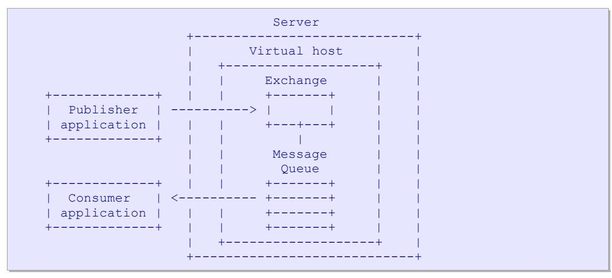
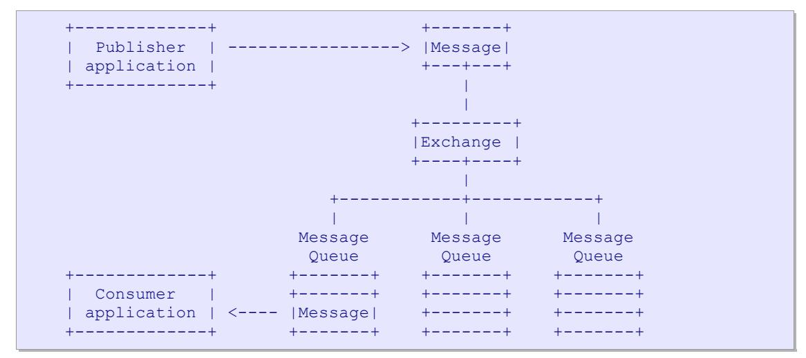
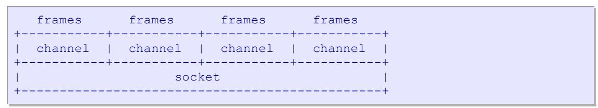

# **AMQP Advanced Message Queuing Protocol**

# **Protocol Specification**

Version 0-9-1, 13 November 2008 A General-Purpose Messaging Standard

# Technical Contributors

| Sanjay Aiyagari    | Cisco Systems             | Alexis Richardson | Rabbit Technologies |
|--------------------|---------------------------|-------------------|---------------------|
| Matthew Arrott     | Twist Process Innovations | Martin Ritchie    | JPMorgan Chase      |
| Mark Atwell        | JPMorgan Chase            | Shahrokh Sadjadi  | Cisco Systems       |
| Jason Brome        | Envoy Technologies        | Rafael Schloming  | Red Hat             |
| Alan Conway        | Red Hat                   | Steven Shaw       | JPMorgan Chase      |
| Robert Godfrey     | JPMorgan Chase            | Martin Sustrik    | iMatix Corporation  |
| Robert Greig       | JPMorgan Chase            | Carl Trieloff     | Red Hat             |
| Pieter Hintjens    | iMatix Corporation        | Kim van der Riet  | Red Hat             |
| John O'Hara        | JPMorgan Chase            | Steve Vinoski     | IONA Technologies   |
| Matthias Radestock | Rabbit Technologies       |                   |                     |

# **Copyright Notice**

Copyright © 2006-2008 Cisco Systems, Credit Suisse, Deutsche Börse Systems, Envoy Technologies, Inc., Goldman Sachs, IONA Technologies PLC, iMatix Corporation, JPMorgan Chase Bank Inc. N.A, Novell, Rabbit Technologies Ltd., Red Hat, Inc., TWIST Process Innovations Ltd, WS02, Inc. and 29West Inc. All rights reserved.

# **License**

Cisco Systems, Credit Suisse, Deutsche Börse Systems, Envoy Technologies, Inc., Goldman Sachs, IONA Technologies PLC, iMatix Corporation, JPMorgan Chase Bank Inc. N.A, Novell, Rabbit Technologies Ltd., Red Hat, Inc., TWIST Process Innovations Ltd, WS02, Inc. and 29West Inc. (collectively, the "Authors") each hereby grants to you a worldwide, perpetual, royalty-free, nontransferable, nonexclusive license to (i) copy, display, distribute and implement the Advanced Messaging Queue Protocol ("AMQP") Specification and (ii) the Licensed Claims that are held by the Authors, all for the purpose of implementing the Advanced Messaging Queue Protocol Specification. Your license and any rights under this Agreement will terminate immediately without notice from any Author if you bring any claim, suit, demand, or action related to the Advanced Messaging Queue Protocol Specification against any Author. Upon termination, you shall destroy all copies of the Advanced Messaging Queue Protocol Specification in your possession or control.

As used hereunder, "Licensed Claims" means those claims of a patent or patent application, throughout the world, excluding design patents and design registrations, owned or controlled, or that can be sublicensed without fee and in compliance with the requirements of this Agreement, by an Author or its affiliates now or at any future time and which would necessarily be infringed by implementation of the Advanced Messaging Queue Protocol Specification. A claim is necessarily infringed hereunder only when it is not possible to avoid infringing it because there is no plausible non-infringing alternative for implementing the required portions of the Advanced Messaging Queue Protocol Specification. Notwithstanding the foregoing, Licensed Claims shall not include any claims other than as set forth above even if contained in the same patent as Licensed Claims; or that read solely on any implementations of any portion of the Advanced Messaging Queue Protocol Specification that are not required by the Advanced Messaging Queue Protocol Specification, or that, if licensed, would require a payment of royalties by the licensor to unaffiliated third parties. Moreover, Licensed Claims shall not include (i) any enabling technologies that may be necessary to make or use any Licensed Product but are not themselves expressly set forth in the Advanced Messaging Queue Protocol Specification (e.g., semiconductor manufacturing technology, compiler technology, object oriented technology, networking technology, operating system technology, and the like); or (ii) the implementation of other published standards developed elsewhere and merely referred to in the body of the Advanced Messaging Queue Protocol Specification, or (iii) any Licensed Product and any combinations thereof the purpose or function of which is not required for compliance with the Advanced Messaging Queue Protocol Specification. For purposes of this definition, the Advanced Messaging Queue Protocol Specification shall be deemed to include both architectural and interconnection requirements essential for interoperability and may also include supporting source code artifacts where such architectural, interconnection requirements and source code artifacts are expressly identified as being required or documentation to achieve compliance with the Advanced Messaging Queue Protocol Specification.

As used hereunder, "Licensed Products" means only those specific portions of products (hardware, software or combinations thereof) that implement and are compliant with all relevant portions of the Advanced Messaging Queue Protocol Specification.

The following disclaimers, which you hereby also acknowledge as to any use you may make of the Advanced Messaging Queue Protocol Specification:

THE ADVANCED MESSAGING QUEUE PROTOCOL SPECIFICATION IS PROVIDED "AS IS," AND THE AUTHORS MAKE NO REPRESENTATIONS OR WARRANTIES, EXPRESS OR IMPLIED, INCLUDING, BUT NOT LIMITED TO, WARRANTIES OF MERCHANTABILITY, FITNESS FOR A PARTICULAR PURPOSE, NON-INFRINGEMENT, OR TITLE; THAT THE CONTENTS OF THE ADVANCED MESSAGING QUEUE PROTOCOL SPECIFICATION ARE SUITABLE FOR ANY PURPOSE; NOR THAT THE IMPLEMENTATION OF THE ADVANCED MESSAGING QUEUE PROTOCOL SPECIFICATION WILL NOT INFRINGE ANY THIRD PARTY PATENTS, COPYRIGHTS, TRADEMARKS OR OTHER RIGHTS.

THE AUTHORS WILL NOT BE LIABLE FOR ANY DIRECT, INDIRECT, SPECIAL, INCIDENTAL OR CONSEQUENTIAL DAMAGES ARISING OUT OF OR RELATING TO ANY USE, IMPLEMENTATION OR DISTRIBUTION OF THE ADVANCED MESSAGING QUEUE PROTOCOL SPECIFICATION.

The name and trademarks of the Authors may NOT be used in any manner, including advertising or publicity pertaining to the Advanced Messaging Queue Protocol Specification or its contents without specific, written prior permission. Title to copyright in the Advanced Messaging Queue Protocol Specification will at all times remain with the Authors.

No other rights are granted by implication, estoppel or otherwise.

Upon termination of your license or rights under this Agreement, you shall destroy all copies of the Advanced Messaging Queue Protocol Specification in your possession or control.

# **Trademarks**

"JPMorgan", "JPMorgan Chase", "Chase", the JPMorgan Chase logo and the Octagon Symbol are trademarks of JPMorgan Chase & Co.

IMATIX and the iMatix logo are trademarks of iMatix Corporation sprl.

IONA, IONA Technologies, and the IONA logos are trademarks of IONA Technologies PLC and/or its subsidiaries.

LINUX is a trademark of Linus Torvalds. RED HAT and JBOSS are registered trademarks of Red Hat, Inc. in the US and other countries.

Java, all Java-based trademarks and OpenOffice.org are trademarks of Sun Microsystems, Inc. in the United States, other countries, or both.

Other company, product, or service names may be trademarks or service marks of others.

# **Table of Contents**

| 1 Overview                                                      | 6  |
|-----------------------------------------------------------------|----|
| 1.1 Goals of This Document                                      | 6  |
| 1.2 Summary                                                     | 6  |
| 1.2.1 Why AMQP?                                                 | 6  |
| 1.2.2 Scope of AMQP                                             |    |
| 1.2.3 The Advanced Message Queuing Model (AMQ model)            |    |
| 1.2.4 The Advanced Message Queuing Protocol (AMQP)              |    |
| 1.2.5 Scales of Deployment                                      |    |
| 1.2.6 Functional Scope.                                         |    |
| 1.3 Organisation of This Document                               |    |
| 1.4 Conventions.                                                |    |
| 1.4.1 Guidelines for Implementers.                              |    |
| 1.4.2 Version Numbering                                         |    |
| 1.4.5 Technical Terminology                                     | 9  |
| 2 General Architecture                                          |    |
| 2.1 AMQ Model Architecture                                      |    |
| 2.1.1 Main Entities.                                            |    |
| 2.1.2 Message Flow                                              |    |
| 2.1.3 Exchanges                                                 |    |
| 2.1.4 Message Queues                                            |    |
| 2.1.5 Bindings.                                                 |    |
| 2.2 AMQP Command Architecture                                   |    |
| 2.2.1 Protocol Commands (Classes & Methods)                     |    |
| 2.2.2 Mapping AMQF to a middleware AFT.  2.2.3 No Confirmations |    |
| 2.2.4 The Connection Class.                                     |    |
| 2.2.5 The Channel Class.                                        |    |
| 2.2.6 The Exchange Class                                        |    |
| 2.2.7 The Queue Class                                           | 20 |
| 2.2.8 The Basic Class.                                          |    |
| 2.2.9 The Transaction Class                                     |    |
| 2.3 AMQP Transport Architecture                                 |    |
| 2.3.1 General Description.                                      |    |
| 2.3.2 Data Types                                                |    |
| 2.3.3 Protocol Negotiation                                      |    |
| 2.3.5 Frame Details                                             |    |
| 2.3.6 Error Handling                                            | 23 |
| 2.3.7 Closing Channels and Connections.                         |    |
| 2.4 AMQP Client Architecture                                    |    |
|                                                                 |    |
| 3 Functional Specification                                      |    |
| 3.1 Server Functional Specification.                            |    |
| 3.1.1 Messages and Content.                                     |    |
| 3.1.2 Virtual Hosts.                                            |    |
| 3.1.3 Exchanges                                                 |    |
| 3.1.5 Bindings                                                  |    |
| 3.1.6 Consumers.                                                |    |
| 3.1.7 Quality of Sarvice                                        | 20 |
| 3.1.8 Acknowledgements                                          | 29 |
| 3.1.9 Flow Control.                                             | 29 |
| 3.1.10 Naming Conventions                                       | 29 |
| 3.2 AMQP Command Specification (Classes & Methods)              | 30 |
| 3.2.1 Explanatory Notes                                         | 30 |
| 3.2.2 Class and Method Details                                  | 30 |
| 4 Technical Specifications                                      | 31 |
| 4.1 IANA Assigned Port Number                                   | 31 |
| 4.2 AMQP Wire-Level Format.                                     | 31 |
| 4.2.1 Formal Protocol Grammar                                   | 32 |
| 4.2.2 Protocol Header                                           | 32 |
| 4.2.3 General Frame Format.                                     | 33 |
| 4.2.4 Method Payloads                                           | 34 |
| 4.2.5 AMQP Data Fields                                          | 36 |
| 4.2.6 Content Framing                                           | 36 |
| 4.2.7 Heartbeat Frames                                          | 37 |
| 4.3 Channel Multiplexing.                                       | 37 |
| 4.4 Visibility Guarantee                                        | 38 |
| 4.5 Channel Closure                                             | 38 |
| 4.6 Content Synchronisation.                                    | 38 |
| 4.7 Content Ordering Guarantees                                 | 38 |
| 4.8 Error Handling                                              | 38 |
| 4.8.1 Exceptions                                                | 39 |
| 4.8.2 Reply Code Format                                         | 39 |
| 4.9 Limitations                                                 | 39 |
| 4.10 Security.                                                  | 39 |
| 4.10.1 Goals and Principles.                                    | 39 |
| 4.10.2 Denial of Service Attacks.                               | 39 |

# <span id="page-5-0"></span>1 Overview

## <span id="page-5-5"></span>**1.1 Goals of This Document**

This document defines a networking protocol, the Advanced Message Queuing Protocol (AMQP), which enables conforming client applications to communicate with conforming messaging middleware servers. We address a technical audience with some experience in the domain, and we provide sufficient specifications and guidelines that a suitably skilled engineer can construct conforming solutions in any modern programming language or hardware platform.

## <span id="page-5-4"></span>**1.2 Summary**

### <span id="page-5-3"></span>1.2.1 Why AMQP?

AMQP creates full functional interoperability between conforming clients and messaging middleware servers (also called "brokers").

Our goal is to enable the development and industry-wide use of standardised messaging middleware technology that will lower the cost of enterprise and systems integration and provide industrial-grade integration services to a broad audience. It is our aim that through AMQP messaging middleware capabilities may ultimately be driven into the network itself, and that through the pervasive availability of messaging middleware new kinds of useful applications may be developed.

### <span id="page-5-2"></span>1.2.2 Scope of AMQP

To enable complete interoperability for messaging middleware requires that both the networking protocol and the semantics of the server-side services are sufficiently specified. AMQP, therefore, defines both the network protocol and the server-side services through:

- A **defined set of messaging capabilities** called the "Advanced Message Queuing Protocol Model" (AMQ model). The AMQ model consists of a set of components that route and store messages within the broker service, plus a set of rules for wiring these components together.
- A **network wire-level protocol,** AMQP, that lets client applications talk to the server and interact with the AMQ model it implements.

One can partially imply the semantics of the server from the AMQP protocol specifications but we believe that an explicit description of these semantics helps the understanding of the protocol.

### <span id="page-5-1"></span>1.2.3 The Advanced Message Queuing Model (AMQ model)

We define the server's semantics explicitly, since interoperability demands that these be the same in any given server implementation. The AMQ model thus specifies a modular set of components and standard rules for connecting these. There are three main types of component, which are connected into processing chains in the server to create the desired functionality:

- The "**exchange**" receives messages from publisher applications and routes these to "message queues", based on arbitrary criteria, usually message properties or content.
- The "**message queue**" stores messages until they can be safely processed by a consuming client application (or multiple applications).
- The "**binding**" defines the relationship between a message queue and an exchange and provides the message routing criteria.

Using this model we can emulate the classic message-oriented middleware concepts of store-and-forward queues and topic subscriptions trivially. We can also expresses less trivial concepts such as content-based routing, workload distribution, and on-demand message queues.

In very gross terms, an AMQP server is analogous to an email server, with each exchange acting as a message transfer agent, and each message queue as a mailbox. The bindings define the routing tables in each transfer agent. Publishers send messages to individual transfer agents, which then route the messages into mailboxes. Consumers take messages from mailboxes. In many pre-AMQP middleware system, by contrast, publishers send messages directly to individual mailboxes (in the case of store-and-forward queues), or to mailing lists (in the case of topic subscriptions).

The difference is that when the rules connecting message queues to exchanges are under control of the architect (rather than embedded in code), it becomes possible to do interesting things, such as define a rule that says, "place a copy of all messages containing such-and-such a header into this message queue".

The design of the AMQ model was driven by these main requirements:

- To support semantics comparable with major messaging products.
- To provide levels of performance comparable with major messaging products.
- To permit the server's specific semantics to be programmed by the application, via the protocol.
- To be flexible and extensible, yet simple.

### <span id="page-6-0"></span>1.2.4 The Advanced Message Queuing Protocol (AMQP)

The AMQP protocol is a binary protocol with modern features: it is multi-channel, negotiated, asynchronous, secure, portable, neutral, and efficient. AMQP is usefully split into two layers:

```
 +------------------Functional Layer----------------+
 | |
 | Basic Transactions Exchanges Message queues |
 | |
 +--------------------------------------------------+
 +------------------Transport Layer-----------------+
 | |
 | Framing Content Data representation |
 | |
 | Error handling Heart-beating Channels |
 | |
 +--------------------------------------------------+
```

The functional layer defines a set of commands (grouped into logical classes of functionality) that do useful work on behalf of the application.

The transport layer that carries these methods from application to server, and back, and which handles channel multiplexing, framing, content encoding, heart-beating, data representation, and error handling.

One could replace the transport layer with arbitrary transports without changing the application-visible functionality of the protocol. One could also use the same transport layer for different high-level protocols.

The design of AMQ model was driven by these requirements:

- To guarantee interoperability between conforming implementations.
- To provide explicit control over the quality of service.
- To be consistent and explicit in naming.
- To allow complete configuration of server wiring via the protocol.
- To use a command notation that maps easily into application-level API's.
- To be clear, so each operation does exactly one thing.

The design of AMQP transport layer was driven by these main requirements, in no particular order:

- To be compact, using a binary encoding that packs and unpacks rapidly.
- To handle messages of any size without significant limit.
- To carry multiple channels across a single connection.
- To be long-lived, with no significant in-built limitations.
- To allow asynchronous command pipe-lining.

- To be easily extended to handle new and changed needs.
- To be forward compatible with future versions.
- To be repairable, using a strong assertion model.
- To be neutral with respect to programming languages.
- To fit a code generation process.

### <span id="page-7-2"></span>1.2.5 Scales of Deployment

The scope of AMQP covers different levels of scale, roughly as follows:

- Developer/casual use: 1 server, 1 user, 10 message queues, 1 message per second.
- Production application: 2 servers, 10-100 users, 10-50 message queues, 10 messages per second (36K messages/hour).
- Departmental mission critical application: 4 servers, 100-500 users, 50-100 message queues, 100 messages per second (360K/hour).
- Regional mission critical application: 16 servers, 500-2,000 users, 100-500 message queues and topics, 1000 messages per second(3.6M/hour).
- Global mission critical application: 64 servers, 2K-10K users, 500-1000 message queues and topics, 10,000 messages per second(36M/hour).
- Market data (trading): 200 servers, 5K users, 10K topics, 100K messages per second (360M/hour).

As well as volume, the latency of message transfer can be highly important. For instance, market data becomes worthless very rapidly. Implementations may differentiate themselves by providing differing Quality of Service or Manageability Capabilities whilst remaining fully compliant with this specification.

### 1.2.6 Functional Scope

<span id="page-7-1"></span>We want to support a variety of messaging architectures:

- Store-and-forward with many writers and one reader.
- Workload distribution with many writers and many readers.
- Publish-subscribe with many writers and many readers.
- Content-based routing with many writers and many readers.
- Queued file transfer with many writers and many readers.
- Point-to-point connection between two peers.
- Market data distribution with many sources and many readers.

## <span id="page-7-0"></span>**1.3 Organisation of This Document**

The document is divided into five chapters, most of which are designed to be read independently according to your level of interest:

- 1. "**Overview**" (this chapter). Read this chapter for an introduction.
- 2. "**General Architecture**", in which we describe the architecture and overall design of AMQP. This chapter is intended to help systems architects understand how AMQP works.
- 3. "**Functional Specifications**", in which we define how applications work with AMQP. This chapter consists of a readable discussion, followed by a detailed specification of each protocol command, intended as a reference for implementers. Before reading this chapter you should read the General Architecture.
- 4. "**Technical Specifications**", in which we define how the AMQP transport layer works. This chapter consists of a short discussion, followed by a detailed specification of the wire-level constructs, intended as a reference for implementers. You can read this chapter by itself if you want to understand how the wire-level protocol works (but not what it is used for).

## <span id="page-8-3"></span>**1.4 Conventions**

### <span id="page-8-2"></span>1.4.1 Guidelines for Implementers

- We use the terms MUST, MUST NOT, SHOULD, SHOULD NOT, and MAY as defined by IETF RFC 2119.
- We use the term "the server" when discussing the specific behaviour required of a conforming AMQP server.
- We use the term "the client" when discussing the specific behaviour required of a conforming AMQP client.
- We use the term "the peer" to mean "the server or the client".
- All numeric values are decimal unless otherwise indicated.
- Protocol constants are shown as upper-case names. AMQP implementations SHOULD use these names when defining and using constants in source code and documentation.
- Property names, method arguments, and frame fields are shown as lower-case names. AMQP implementations SHOULD use these names consistently in source code and documentation.
- Strings in AMQP are case-sensitive. For example, "amq.Direct" specifies a different exchange from "amq.direct".

### <span id="page-8-1"></span>1.4.2 Version Numbering

The AMQP version is expressed using two or three digits – the major number, the minor number and an optional revision number. By convention, the version is expressed as *major-minor*[*-revision*] or *major.minor[.revision]*:

- The major, minor, and revision numbers can take any value from 0 to 99 for official specifications.
- Major, minor, and revision numbers of 100 and above are reserved for internal testing and development purposes.
- Version numbers indicate syntactic and semantic interoperability.
- Version 0-9-1 is represented as major = 0, minor = 9, revision = 1.
- Version 1.1 would be represented as major = 1, minor = 1, revision = 0. Writing "AMQP/1.1" is equivalent to writing "AMQP/1.1.0" or AMQP/1-1-0.

### <span id="page-8-0"></span>1.4.3 Technical Terminology

These terms have special significance within the context of this document:

- **AMQP command architecture:** An encoded wire-level protocol command which executes actions on the state of the AMQ model Architecture.
- **AMQ model architecture:** A logical framework representing the key entities and semantics which must be made available by an AMQP compliant server implementation, such that the server state can be manipulated by a client in order to achieve the semantics defined in this specification.
- **Connection**: A network connection, e.g. a TCP/IP socket connection.
- **Channel**: A bi-directional stream of communications between two AMQP peers. Channels are multiplexed so that a single network connection can carry multiple channels.
- **Client**: The initiator of an AMQP connection or channel. AMQP is not symmetrical. Clients produce and consume messages while servers queue and route messages.
- **Server**: The process that accepts client connections and implements the AMQP message queueing and routing functions. Also known as "broker".
- **Peer**: Either party in an AMQP connection. An AMQP connection involves exactly two peers (one is the client, one is the server).
- **Frame**: A formally-defined package of connection data. Frames are always written and read contiguously - as a single unit - on the connection.
- **Protocol class**: A collection of AMQP commands (also known as Methods) that deal with a specific type of functionality.

- **Method**: A specific type of AMQP command frame that passes instructions from one peer to the other.
- **Content**: Application data passed from client to server and from server to client. The term is synonymous with "message".
- **Content header**: A specific type of frame that describes a content's properties.
- **Content body**: A specific type of frame that contains raw application data. Content body frames are entirely opaque - the server does not examine or modify these in any way.
- **Message**: Synonymous with "content".
- **Exchange**: The entity within the server which receives messages from producer applications and optionally routes these to message queues within the server.
- **Exchange type**: The algorithm and implementation of a particular model of exchange. In contrast to the "exchange instance", which is the entity that receives and routes messages within the server.
- **Message queue**: A named entity that holds messages and forwards them to consumer applications.
- **Binding**: An entity that creates a relationship between a message queue and an exchange.
- **Routing key**: A virtual address that an exchange may use to decide how to route a specific message.
- **Durable**: A server resource that survives a server restart.
- **Transient**: A server resource or message that is wiped or reset after a server restart.
- **Persistent**: A message that the server holds on reliable disk storage and MUST NOT lose after a server restart.
- **Consumer**: A client application that requests messages from a message queue.
- **Producer**: A client application that publishes messages to an exchange.
- **Virtual host**: A collection of exchanges, message queues and associated objects. Virtual hosts are independent server domains that share a common authentication and encryption environment.
- **Assertion**: A condition that must be true for processing to continue.
- **Exception**: A failed assertion, handled by closing either the Channel or the Connection.

These terms have no special significance within the context of AMQP:

- **Topic**: Usually a means of distributing messages; AMQP implements topics using one or more types of exchange.
- **Subscription**: Usually a request to receive data from topics; AMQP implements subscriptions as message queues and bindings.
- **Service**: Usually synonymous with server. AMQP uses "server" to conform with IETF standard nomenclature.
- **Broker:** synonymous with server. AMQP uses the terms "client" and "server" to conform with IETF standard nomenclature.
- **Router**: Sometimes used to describe the actions of an exchange. Exchanges can also act as message end-points, and "router" has special significance in the network domain, so AMQP does not use it.

# <span id="page-10-2"></span>2 General Architecture

## <span id="page-10-1"></span>**2.1 AMQ Model Architecture**

This section explains the server semantics that must be standardised in order to guarantee interoperability between AMQP implementations.

### <span id="page-10-0"></span>2.1.1 Main Entities

This diagram shows the overall AMQ model:



We can summarise what a middleware server is: it is a data server that accepts messages and does two main things with them, it routes them to different consumers depending on arbitrary criteria, and it buffers them in memory or on disk when consumers are not able to accept them fast enough.

In a pre-AMQP server these tasks are done by monolithic engines that implement specific types of routing and buffering. The AMQ model takes the approach of smaller, modular pieces that can be combined in more diverse and robust ways. It starts by dividing these tasks into two distinct roles:

- The exchange, which accepts messages from producers and routes them message queues.
- The message queue, which stores messages and forwards them to consumer applications.

There is a clear interface between exchange and message queue, called a "binding", which we will come to later. AMQP provides runtime-programmable semantics, through two main aspects:

- 1. The ability at runtime via the protocol to create arbitrary exchange and message queue types (some are defined in the standard, but others can be added as server extensions).
- 2. The ability at runtime via the protocol to wire exchanges and message queues together to create any required message-processing system.

#### 2.1.1.1 The Message Queue

A message queue stores messages in memory or on disk, and delivers these in sequence to one or more consumer applications. Message queues are message storage and distribution entities. Each message queue is entirely independent and is a reasonably clever object.

A message queue has various properties: private or shared, durable or temporary, client-named or servernamed, etc. By selecting the desired properties we can use a message queue to implement conventional middleware entities such as:

- A shared **store-and-forward queue**, which holds messages and distributes these between consumers on a round-robin basis. Store and forward queues are typically durable and shared between multiple consumers.
- A **private reply queue**, which holds messages and forwards these to a single consumer. Reply queues are typically temporary, server-named, and private to one consumer.
- A **private subscription queue**, which holds messages collected from various "subscribed" sources, and forwards these to a single consumer.

Subscription queues are typically temporary, server-named, and private to one consumer. These categories are not formally defined in AMQP: they are examples of how message queues can be used. It is trivial to create new entities such as durable, shared subscription queues.

#### 2.1.1.2 The Exchange

An exchange accepts messages from a producer application and routes these to message queues according to pre-arranged criteria. These criteria are called "bindings". Exchanges are matching and routing engines. That is, they inspect messages and using their binding tables, decide how to forward these messages to message queues or other exchanges. Exchanges never store messages.

The term "exchange" is used to mean both a class of algorithm, and the instances of such an algorithm. More properly, we speak of the "exchange type" and the "exchange instance".

AMQP defines a number of standard exchange types, which cover the fundamental types of routing needed to do common message delivery. AMQP servers will provide default instances of these exchanges. Applications that use AMQP can additionally create their own exchange instances. Exchange types are named so that applications which create their own exchanges can tell the server what exchange type to use. Exchange instances are also named so that applications can specify how to bind queues and publish messages.

Exchanges can do more than route messages. They can act as intelligent agents that work from within the server, accepting messages and producing messages as needed. The exchange concept is intended to define a model for adding extensibility to AMQP servers in a reasonably standard way, since extensibility has some impact on interoperability.

#### 2.1.1.3 The Routing Key

In the general case an exchange examines a message's properties, its header fields, and its body content, and using this and possibly data from other sources, decides how to route the message.

In the majority of simple cases the exchange examines a single key field, which we call the "routing key". The routing key is a virtual address that the exchange may use to decide how to route the message.

For point-to-point routing, the routing key is usually the name of a message queue.

For topic pub-sub routing, the routing key is usually the topic hierarchy value.

In more complex cases the routing key may be combined with routing on message header fields and/or its content.

#### 2.1.1.4 Analogy to Email

If we make an analogy with an email system we see that the AMQP concepts are not radical:

- an AMQP message is analogous to an email message;
- a message queue is like a mailbox;
- a consumer is like a mail client that fetches and deletes email;

- a exchange is like a MTA (mail transfer agent) that inspects email and decides, on the basis of routing keys and tables, how to send the email to one or more mailboxes;
- a routing key corresponds to an email To: or Cc: or Bcc: address, without the server information (routing is entirely internal to an AMQP server);
- each exchange instance is like a separate MTA process, handling some email sub-domain, or particular type of email traffic;
- a binding is like an entry in a MTA routing table.

The power of AMQP comes from our ability to create queues (mailboxes), exchanges (MTA processes), and bindings (routing entries), at runtime, and to chain these together in ways that go far beyond a simple mapping from "to" address to mailbox name.

We should not take the email-AMQP analogy too far: there are fundamental differences. The challenge in AMQP is to route and store messages within a server, or SMTP (IETF RFC 821) parlance calls them "autonomous systems". By contrast, the challenge in email is to route messages between autonomous systems.

Routing within a server and between servers are distinct problems and have distinct solutions, if only for banal reasons such as maintaining transparent performance.

To route between AMQP servers owned by different entities, one sets up explicit bridges, where one AMQP server acts and the client of another server for the purpose of transferring messages between those separate entities. This way of working tends to suit the types of businesses where AMQP is expected to be used, because these bridges are likely to be underpinned by business processes, contractual obligations and security concerns.

### <span id="page-12-0"></span>2.1.2 Message Flow

This diagram shows the flow of messages through the AMQ model server:



#### 2.1.2.1 Message Life-cycle

An AMQP message consists of a set of properties plus opaque content.

A new "message" is created by a producer application using an AMQP client API. The producer places "content" in the message and perhaps sets some message "properties". The producer labels the message with "routing information", which is superficially similar to an address, but almost any scheme can be created. The producer then sends the message to an "exchange" on the server.

When the message arrives at the server, the exchange (usually) routes the message to a set of message "queues" which also exist on the server. If the message is unroutable, the exchange may drop it silently or return it to the producer. The producer chooses how unroutable messages are treated.

A single message can exist on many message queues. The server can handle this in different ways, by copying the message, by using reference counting, etc. This does not affect interoperability. However, when a message is routed to multiple message queues, it is identical on each message queue. There is no unique identifier that distinguishes the various copies.

When a message arrives in a message queue, the message queue tries immediately to pass it to a consumer application via AMQP. If this is not possible, the message queue stores the message (in memory or on disk as requested by the producer) and waits for a consumer to be ready. If there are no consumers, the message queue may return the message to the producer via AMQP (again, if the producer asked for this).

When the message queue can deliver the message to a consumer, it removes the message from its internal buffers. This can happen immediately, or after the consumer has acknowledged that it has successfully processed the message. The consumer chooses how and when messages are "acknowledged". The consumer can also reject a message (a negative acknowledgement).

Producer messages and consumer acknowledgements are grouped into "transactions". When an application plays both roles, which is often, it does a mix of work: sending messages and sending acknowledgements, and then committing or rolling back the transaction.

Message deliveries from the server to the consumer are not transacted; it is sufficient to transact the acknowledgements to these messages

#### 2.1.2.2 What The Producer Sees

By analogy with the email system, we can see that a producer does not send messages directly to a message queue. Allowing this would break the abstraction in the AMQ model. It would be like allowing email to bypass the MTA's routing tables and arrive directly in a mailbox. This would make it impossible to insert intermediate filtering and processing, spam detection, for instance.

The AMQ model uses the same principle as an email system: all messages are sent to a single point, the exchange or MTA, which inspects the messages based on rules and information that are hidden from the sender, and routes them to drop-off points that are also hidden from the sender.

#### 2.1.2.3 What The Consumer Sees

Our analogy with email starts to break down when we look at consumers. Email clients are passive - they can read their mailboxes, but they do not have any influence on how these mailboxes are filled. An AMQP consumer can also be passive, just like email clients. That is, we can write an application that expects a particular message queue to be ready and bound, and which will simply process messages off that message queue.

However, we also allow AMQP client applications to:

- create or destroy message queues;
- define the way these message queues are filled, by making bindings;
- select different exchanges which can completely change the routing semantics.

This is like having an email system where one can, via the protocol:

- create a new mailbox;
- tell the MTA that all messages with a specific header field should be copied into this mailbox;
- completely change how the mail system interprets addresses and other message headers.

We see that AMQP is more like a language for wiring pieces together than a system. This is part of our objective, to make the server behaviour programmable via the protocol.

#### 2.1.2.4 Automatic Mode

Most integration architectures do not need this level of sophistication. Like the amateur photographer, a majority of AMQP users need a "point and shoot" mode. AMQP provides this through the use of two simplifying concepts:

- a default exchange for message producers;
- a default binding for message queues that selects messages based on a match between routing key and message queue name.

In effect, the default binding lets a producer send messages directly to a message queue, given suitable authority – it emulates the simplest "send to destination" addressing scheme people have come to expect of traditional middleware.

The default binding does not prevent the message queue from being used in more sophisticated ways. It does, however, let one use AMQP without needing to understand how exchanges and bindings work.

### <span id="page-14-1"></span>2.1.3 Exchanges

#### 2.1.3.1 Types of Exchange

Each exchange type implements a specific routing algorithm. There are a number of standard exchange types, explained in the "Functional Specifications" chapter, but there are two that are particularly important:

- The **direct** exchange type, which routes on a routing key. The default exchange is a direct exchange.
- the **topic** exchange type, which routes on a routing pattern.

The server will create a set of exchanges, including a direct and a topic exchange at start-up with wellknown names and client applications may depend on this.

#### 2.1.3.2 Exchange Life-cycle

Each AMQP server pre-creates a number of exchanges (instances). These exchanges exist when the server starts and cannot be destroyed. AMQP applications can also create their own exchanges. AMQP does not use a "create" method as such, it uses an assertive "declare" method which means, "create if not present, otherwise continue". It is plausible that applications will create exchanges for private use and destroy them when their work is finished. AMQP provides a method to destroy exchanges but in general applications do not do this. In our examples in this chapter we will assume that the exchanges are all created by the server at start-up. We will not show the application declaring its exchanges.

### <span id="page-14-0"></span>2.1.4 Message Queues

#### 2.1.4.1 Message Queue Properties

When a client application creates a message queue, it can select some important properties:

- **name** if left unspecified, the server chooses a name and provides this to the client. Generally, when applications share a message queue they agree on a message queue name beforehand, and when an application needs a message queue for its own purposes, it lets the server provide a name.
- **exclusive**  if set, the queue belongs to the current connection only, and is deleted when the connection closes.
- **durable** if set, the message queue remains present and active when the server restarts. It may lose transient messages if the server restarts.

#### 2.1.4.2 Queue Life-cycles

There are two main message queue life-cycles:

- **Durable message queues** that are shared by many consumers and have an independent existence i.e. they will continue to exist and collect messages whether or not there are consumers to receive them.
- **Temporary message queues** that are private to one consumer and are tied to that consumer. When the consumer disconnects, the message queue is deleted.

There are some variations on these, such as **shared message queues** that are deleted when the last of many consumers disconnects. This diagram shows the way temporary message queues are created and deleted:

```
 Message
 Queue
 +-------+
 Declare +-------+ Message queue is created
 --------> +-------+
 +-------------+ +-------+
 | Consumer | Consume
 | application | -------->
 +-------------+ \ /
 Cancel +\\----/*
 --------> +--\\//-+ Message queue is deleted
 +--//\\-+
 +//----\*
 / \
```

### <span id="page-15-0"></span>2.1.5 Bindings

A binding is the relationship between an exchange and a message queue that tells the exchange how to route messages. Bindings are constructed from commands from the client application (the one owning and using the message queue) to an exchange. We can express a binding command in pseudo-code as follows:

```
Queue.Bind <queue> TO <exchange> WHERE <condition>
```

Let's look at three typical use cases: shared queues, private reply queues, and pub-sub subscriptions.

#### 2.1.5.1 Constructing a Shared Queue

Shared queues are the classic middleware "point-to-point queue". In AMQP we can use the default exchange and default binding. Let's assume our message queue is called "app.svc01". Here is the pseudocode for creating the shared queue:

```
Queue.Declare
 queue=app.svc01
```

We may have many consumers on this shared queue. To consume from the shared queue, each consumer does this:

```
Basic.Consume
 queue=app.svc01
```

To publish to the shared queue, each producer sends a message to the default exchange:

```
Basic.Publish
 routing-key=app.svc01
```

#### 2.1.5.2 Constructing a Reply Queue

Reply queues are usually temporary, with server-assigned names. They are also usually private, i.e. read by a single consumer. Apart from these particularities, reply queues use the same matching criteria as standard queues, so we can also use default exchange.

Here is the pseudo-code for creating a reply queue, where S: indicates a server reply:

```
Queue.Declare
 queue=<empty>
 exclusive=TRUE
S:Queue.Declare-Ok
 queue=tmp.1
```

To publish to the reply queue, a producer sends a message to the default exchange:

```
Basic.Publish
 exchange=<empty>
 routing-key=tmp.1
```

One of the standard message properties is Reply-To, which is designed specifically for carrying the name of reply queues.

#### 2.1.5.3 Constructing a Pub-Sub Subscription Queue

In classic middleware the term "subscription" is vague and refers to at least two different concepts: the set of criteria that match messages and the temporary queue that holds matched messages. AMQP separates the work into into bindings and message queues. There is no AMQP entity called "subscription".

Let us agree that a pub-sub subscription:

- holds messages for a single consumer (or in some cases for multiple consumers);
- collects messages from multiple sources, through a set of bindings that match topics, message fields, or content in different ways.

The key difference between a subscription queue and a named or reply queue is that the subscription queue name is irrelevant for the purposes of routing, and routing is done on abstracted matching criteria rather than a 1-to-1 matching of the routing key field.

Let's take the common pub-sub model of "topic trees" and implement this. We need an exchange type capable of matching on a topic tree. In AMQP this is the "topic" exchange type. The topic exchange matches wild-cards like "STOCK.USD.\*" against routing key values like "STOCK.USD.NYSE".

We cannot use the default exchange or binding because these do not do topic-style routing. So we have to create a binding explicitly. Here is the pseudo-code for creating and binding the pub-sub subscription queue:

```
Queue.Declare
 queue=<empty>
 exclusive=TRUE
S:Queue.Declare-Ok
 queue=tmp.2
Queue.Bind
 queue=tmp.2
 TO exchange=amq.topic
 WHERE routing-key=STOCK.USD.*
```

To consume from the subscription queue, the consumer does this:

```
Basic.Consume
 queue=tmp.2
```

When publishing a message, the producer does something like this:

```
Basic.Publish
 exchange=amq.topic
 routing-key=STOCK.USD.ACME
```

The topic exchange processes the incoming routing key ("STOCK.USD.ACME") with its binding table, and finds one match, for tmp.2. It then routes the message to that subscription queue.

## <span id="page-17-2"></span>**2.2 AMQP Command Architecture**

This section explains how the application talks to the server.

### <span id="page-17-1"></span>2.2.1 Protocol Commands (Classes & Methods)

Middleware is complex, and our challenge in designing the protocol structure was to tame that complexity. Our approach has been to model a traditional API based on classes which contain methods, and to define methods to do exactly one thing, and do it well. This results in a large command set but one that is relatively easy to understand.

The AMQP commands are grouped into classes. Each class covers a specific functional domain. Some classes are optional - each peer implements the classes it needs to support.

There are two distinct method dialogues:

- Synchronous request-response, in which one peer sends a request and the other peer sends a reply. Synchronous request and response methods are used for functionality that is not performance critical.
- Asynchronous notification, in which one peer sends a method but expects no reply. Asynchronous methods are used where performance is critical.

To make method processing simple, we define distinct replies for each synchronous request. That is, no method is used as the reply for two different requests. This means that a peer, sending a synchronous request, can accept and process incoming methods until getting one of the valid synchronous replies. This differentiates AMQP from more traditional RPC protocols.

A method is formally defined as a synchronous request, a synchronous reply (to a specific request), or asynchronous. Lastly, each method is formally defined as being client-side (i.e. server to client), or serverside (client to server).

### <span id="page-17-0"></span>2.2.2 Mapping AMQP to a middleware API

We have designed AMQP to be mappable to a middleware API. This mapping has some intelligence (not all methods, and not all arguments make sense to an application) but it is also mechanical (given some rules, all methods can be mapped without manual intervention).

The advantages of this are that having learnt the AMQP semantics (the classes that are described in this section), developers will find the same semantics provided in whatever environment they use.

For example, here is a Queue.Declare method example:

```
Queue.Declare
 queue=my.queue
 auto-delete=TRUE
 exclusive=FALSE
```

This can be cast as a wire-level frame:

```
 +--------+---------+----------+-----------+-----------+
 | Queue | Declare | my.queue | 1 | 0 |
 +--------+---------+----------+-----------+-----------+
 class method name auto-delete exclusive
```

Or as a higher-level API:

```
queue_declare (session, "my.queue", TRUE, FALSE);
```

The pseudo-code logic for mapping an asynchronous method is:

```
send method to server
```

The pseudo-code logic for mapping a synchronous method is:

```
send request method to server
repeat
 wait for response from server
 if response is an asynchronous method
 process method (usually, delivered or returned content)
 else
 assert that method is a valid response for request
 exit repeat
 end-if
end-repeat
```

It is worth commenting that for most applications, middleware can be completely hidden in technical layers, and that the actual API used matters less than the fact that the middleware is robust and capable.

### <span id="page-18-1"></span>2.2.3 No Confirmations

A chatty protocol is slow. We use asynchronism heavily in those cases where performance is an issue. This is generally where we send content from one peer to another. We send off methods as fast as possible, without waiting for confirmations. Where necessary, we implement windowing and throttling at a higher level, e.g. at the consumer level.

We can dispense with confirmations because we adopt an assertion model for all actions. Either they succeed, or we have an exception that closes the channel or connection.

There are no confirmations in AMQP. Success is silent, and failure is noisy. When applications need explicit tracking of success and failure, they should use transactions.

### <span id="page-18-0"></span>2.2.4 The Connection Class

AMQP is a connected protocol. The connection is designed to be long-lasting, and can carry multiple channels. The connection life-cycle is this:

- The client opens a TCP/IP connection to the server and sends a protocol header. This is the only data the client sends that is not formatted as a method.
- The server responds with its protocol version and other properties, including a list of the security mechanisms that it supports (the Start method).
- The client selects a security mechanism (Start-Ok).
- The server starts the authentication process, which uses the SASL challenge-response model. It sends the client a challenge (Secure).
- The client sends an authentication response (Secure-Ok). For example using the "plain" mechanism, the response consist of a login name and password.

- The server repeats the challenge (Secure) or moves to negotiation, sending a set of parameters such as maximum frame size (Tune).
- The client accepts or lowers these parameters (Tune-Ok).
- The client formally opens the connection and selects a virtual host (Open).
- The server confirms that the virtual host is a valid choice (Open-Ok).
- The client now uses the connection as desired.
- One peer (client or server) ends the connection (Close).
- The other peer hand-shakes the connection end (Close-Ok).
- The server and the client close their socket connection.

There is no hand-shaking for errors on connections that are not fully open. Following successful protocol header negotiation, which is defined in detail later, and prior to sending or receiving Open or Open-Ok, a peer that detects an error MUST close the socket without sending any further data.

### <span id="page-19-2"></span>2.2.5 The Channel Class

AMQP is a multi-channelled protocol. Channels provide a way to multiplex a heavyweight TCP/IP connection into several light weight connections. This makes the protocol more "firewall friendly" since port usage is predictable. It also means that traffic shaping and other network QoS features can be easily employed.

Channels are independent of each other and can perform different functions simultaneously with other channels, the available bandwidth being shared between the concurrent activities.

It is expected and encouraged that multi-threaded client applications may often use a "channel-per-thread" model as a programming convenience. However, opening several connections to one or more AMQP servers from a single client is also entirely acceptable. The channel life-cycle is this:

- 1. The client opens a new channel (Open).
- 2. The server confirms that the new channel is ready (Open-Ok).
- 3. The client and server use the channel as desired.
- 4. One peer (client or server) closes the channel (Close).
- 5. The other peer hand-shakes the channel close (Close-Ok).

### <span id="page-19-1"></span>2.2.6 The Exchange Class

The exchange class lets an application manage exchanges on the server. This class lets the application script its own wiring (rather than relying on some configuration interface). Note: Most applications do not need this level of sophistication, and legacy middleware is unlikely to be able to support this semantic. The exchange life-cycle is:

- 1. The client asks the server to make sure the exchange exists (Declare). The client can refine this into, "create the exchange if it does not exist", or "warn me but do not create it, if it does not exist".
- 2. The client publishes messages to the exchange.
- 3. The client may choose to delete the exchange (Delete).

### <span id="page-19-0"></span>2.2.7 The Queue Class

The queue class lets an application manage message queues on the server. This is a basic step in almost all applications that consume messages, at least to verify that an expected message queue is actually present.

The life-cycle for a durable message queue is fairly simple:

- 1. The client asserts that the message queue exists (Declare, with the "passive" argument).
- 2. The server confirms that the message queue exists (Declare-Ok).
- 3. The client reads messages off the message queue.

The life-cycle for a temporary message queue is more interesting:

- 1. The client creates the message queue (Declare, often with no message queue name so the server will assign a name). The server confirms (Declare-Ok).
- 2. The client starts a consumer on the message queue. The precise functionality of a consumer is defined by the Basic class.
- 3. The client cancels the consumer, either explicitly or by closing the channel and/or connection.
- 4. When the last consumer disappears from the message queue, and after a polite time-out, the server deletes the message queue.

AMQP implements the delivery mechanism for topic subscriptions as message queues. This enables interesting structures where a subscription can be load balanced among a pool of co-operating subscriber applications.

The life-cycle for a subscription involves an extra bind stage:

- 1. The client creates the message queue (Declare), and the server confirms (Declare-Ok).
- 2. The client binds the message queue to a topic exchange (Bind) and the server confirms (Bind-Ok).
- 3. The client uses the message queue as in the previous examples.

### <span id="page-20-3"></span>2.2.8 The Basic Class

The Basic class implements the messaging capabilities described in this specification. It supports these main semantics:

- Sending messages from client to server, which happens asynchronously (Publish)
- Starting and stopping consumers (Consume, Cancel)
- Sending messages from server to client, which happens asynchronously (Deliver, Return)
- Acknowledging messages (Ack, Reject)
- Taking messages off the message queue synchronously (Get).

### <span id="page-20-2"></span>2.2.9 The Transaction Class

AMQP supports two kinds of transactions:

- 1. Automatic transactions, in which every published message and acknowledgement is processed as a stand-alone transaction.
- 2. Server local transactions, in which the server will buffer published messages and acknowledgements and commit them on demand from the client.

The Transaction class ("tx") gives applications access to the second type, namely server transactions. The semantics of this class are:

- 1. The application asks for server transactions in each channel where it wants these transactions (Select).
- 2. The application does work (Publish, Ack).
- 3. The application commits or rolls-back the work (Commit, Roll-back).
- 4. The application does work, ad infinitum.

Transactions cover published contents and acknowledgements, *not* deliveries. Thus, a rollback does not requeue or redeliver any messages, and a client is entitled to acknowledge these messages in a following transaction.

## <span id="page-20-1"></span>**2.3 AMQP Transport Architecture**

This section explains how commands are mapped to the wire-level protocol.

### <span id="page-20-0"></span>2.3.1 General Description

AMQP is a binary protocol. Information is organised into "frames", of various types. Frames carry protocol methods and other information. All frames have the same general format: frame header, payload, and frame end. The frame payload format depends on the frame type.

We assume a reliable stream-oriented network transport layer (TCP/IP or equivalent).

Within a single socket connection, there can be multiple independent threads of control, called "channels". Each frame is numbered with a channel number. By interleaving their frames, different channels share the connection. For any given channel, frames run in a strict sequence that can be used to drive a protocol parser (typically a state machine).

We construct frames using a small set of data types such as bits, integers, strings, and field tables. Frame fields are packed tightly without making them slow or complex to parse. It is relatively simple to generate framing layer mechanically from the protocol specifications.

The wire-level formatting is designed to be scalable and generic enough to be used for arbitrary high-level protocols (not just AMQP). We assume that AMQP will be extended, improved and otherwise varied over time and the wire-level format will support this.

### <span id="page-21-2"></span>2.3.2 Data Types

The AMQP data types are used in method framing, and are:

- Integers (from 1 to 8 octets), used to represent sizes, quantities, limits, etc. Integers are always unsigned and may be unaligned within the frame.
- Bits, used to represent on/off values. Bits are packed into octets.
- Short strings, used to hold short text properties. Short strings are limited to 255 octets and can be parsed with no risk of buffer overflows.
- Long strings, used to hold chunks of binary data.
- Field tables, which hold name-value pairs. The field values are typed as strings, integers, etc.

### <span id="page-21-1"></span>2.3.3 Protocol Negotiation

The AMQP client and server negotiate the protocol. This means that when the client connects, the server proposes certain options that the client can accept, or modify. When both peers agree on the outcome, the connection goes ahead. Negotiation is a useful technique because it lets us assert assumptions and preconditions.

In AMQP, we negotiate a number of specific aspects of the protocol:

- The actual protocol and version. The server MAY host multiple protocols on the same port.
- Encryption arguments and the authentication of both parties. This is part of the functional layer, explained previously.
- Maximum frame size, number of channels, and other operational limits.

Agreed limits MAY enable both parties to pre-allocate key buffers, avoiding deadlocks. Every incoming frame either obeys the agreed limits, and so is "safe", or exceeds them, in which case the other party IS faulty and MUST be disconnected. This is very much in keeping with the "it either works properly or it doesn't work at all" philosophy of AMQP.

Both peers negotiate the limits to the lowest agreed value as follows:

- The server MUST tell the client what limits it proposes.
- The client responds and MAY reduce those limits for its connection.

### <span id="page-21-0"></span>2.3.4 Delimiting Frames

TCP/IP is a stream protocol, i.e. there is no in-built mechanism for delimiting frames. Existing protocols solve this in several different ways:

- Sending a single frame per connection. This is simple but slow.
- Adding frame delimiters to the stream. This is simple but slow to parse.
- Counting the size of frames and sending the size in front of each frame. This is simple and fast, and our choice.

### <span id="page-22-0"></span>2.3.5 Frame Details

All frames consist of a header (7 octets), a payload of arbitrary size, and a 'frame-end' octet that detects malformed frames:

```
 0 1 3 7 size+7 size+8
 +------+---------+-------------+ +------------+ +-----------+
 | type | channel | size | | payload | | frame-end |
 +------+---------+-------------+ +------------+ +-----------+
 octet short long size octets octet
```

To read a frame, we:

- 1. Read the header and check the frame type and channel.
- 2. Depending on the frame type, we read the payload and process it.
- 3. Read the frame end octet.

In realistic implementations where performance is a concern, we would use "read-ahead buffering" or "gathering reads" to avoid doing three separate system calls to read a frame.

#### 2.3.5.1 Method Frames

Method frames carry the high-level protocol commands (which we call "methods"). One method frame carries one command. The method frame payload has this format:

```
0 2 4
+----------+-----------+-------------- - -
| class-id | method-id | arguments...
+----------+-----------+-------------- - -
 short short ...
```

To process a method frame, we:

- 1. Read the method frame payload.
- 2. Unpack it into a structure. A given method always has the same structure, so we can unpack the method rapidly.
- 3. Check that the method is allowed in the current context.
- 4. Check that the method arguments are valid.
- 5. Execute the method.

Method frame bodies are constructed as a list of AMQP data fields (bits, integers, strings and string tables). The marshalling code is trivially generated directly from the protocol specifications, and can be very rapid.

#### 2.3.5.2 Content Frames

Content is the application data we carry from client-to-client via the AMQP server. Content is, roughly speaking, a set of properties plus a binary data part. The set of allowed properties are defined by the Basic class, and these form the "content header frame". The data can be any size, and MAY be broken into several (or many) chunks, each forming a "content body frame".

Looking at the frames for a specific channel, as they pass on the wire, we might see something like this:

```
[method]
[method] [header] [body] [body
[method]
...
```

Certain methods (such as Basic.Publish, Basic.Deliver, etc.) are formally defined as carrying content. When a peer sends such a method frame, it always follows it with a content header and zero or more content body frames.

A content header frame has this format:

```
0 2 4 12 14
+----------+--------+-----------+----------------+------------- - -
| class-id | weight | body size | property flags | property list...
+----------+--------+-----------+----------------+------------- - -
 short short long long short remainder...
```

We place content body in distinct frames (rather than including it in the method) so that AMQP may support "zero copy" techniques in which content is never marshalled or encoded. We place the content properties in their own frame so that recipients can selectively discard contents they do not want to process.

#### 2.3.5.3 Heartbeat Frames

Heartbeating is a technique designed to undo one of TCP/IP's features, namely its ability to recover from a broken physical connection by closing only after a quite long time-out. In some scenarios we need to know very rapidly if a peer is disconnected or not responding for other reasons (e.g. it is looping). Since heartbeating can be done at a low level, we implement this as a special type of frame that peers exchange at the transport level, rather than as a class method.

### <span id="page-23-2"></span>2.3.6 Error Handling

AMQP uses exceptions to handle errors. Any operational error (message queue not found, insufficient access rights, etc.) results in a channel exception. Any structural error (invalid argument, bad sequence of methods, etc.) results in a connection exception. An exception closes the channel or connection, and returns a reply code and reply text to the client application. We use the 3-digit reply code plus textual reply text scheme that is used in HTTP and many other protocols.

### <span id="page-23-1"></span>2.3.7 Closing Channels and Connections

A connection or channel is considered "open" for the client when it has sent Open, and for the server when it has sent Open-Ok. From this point onwards a peer that wishes to close the channel or connection MUST do so using a hand-shake protocol that is described here.

Closing a channel or connection for any reason - normal or exceptional - must be done carefully. Abrupt closure is not always detected rapidly, and following an exception, we could lose the error reply codes. The correct design is to hand-shake all closure so that we close only after we are sure the other party is aware of the situation.

When a peer decides to close a channel or connection, it sends a Close method. The receiving peer MUST respond to a Close with a Close-Ok, and then both parties can close their channel or connection. Note that if peers ignore Close, deadlock can happen when both peers send Close at the same time.

## <span id="page-23-0"></span>**2.4 AMQP Client Architecture**

It is possible to read and write AMQP frames directly from an application but this would be bad design. Even the simplest AMQP dialogue is rather more complex than, say HTTP, and application developers should not need to understand such things as binary framing formats in order to send a message to a message queue. The recommended AMQP client architecture consists of several layers of abstraction:

- 1. A **framing layer**. This layer takes AMQP protocol methods, in some language-specific format (structures, classes, etc.) and serialises them as wire-level frames. The framing layer can be mechanically generated from the AMQP specifications (which are defined in a protocol modelling language, implemented in XML and specifically designed for AMQP).
- 2. A **connection manager layer**. This layer reads and writes AMQP frames and manages the overall connection and session logic. In this layer we can encapsulate the full logic of opening a connection

and session, error handling, content transmission and reception, and so on. Large parts of this layer can be produced automatically from the AMQP specifications. For instance, the specifications define which methods carry content, so the logic "send method and then optionally send content" can be produced mechanically.

 3. An **API layer**. This layer exposes a specific API for applications to work with. The API layer may reflect some existing standard, or may expose the high-level AMQP methods, making a mapping as described earlier in this section. The AMQP methods are designed to make this mapping both simple and useful. The API layer may itself be composed of several layers, e.g. a higher-level API constructed on top of the AMQP method API.

Additionally, there is usually some kind of I/O layer, which can be very simple (synchronous socket reads and writes) or sophisticated (fully asynchronous multi-threaded i/o). This diagram shows the overall recommended architecture:

```
 +------------------------+
 | Application |
 +-----------+------------+
 |
 +------------------------+
 +---| API Layer |----Client API Layer-----+
 | +-----------+------------+ |
 | | |
 | +------------------------+ +---------------+ |
 | | Connection Manager +----+ Framing Layer | |
 | +-----------+------------+ +---------------+ |
 | | |
 | +------------------------+ |
 +---| Asynchronous I/O Layer |-------------------------+
 +-----------+------------+
 |
 -------
 - - - - Network - - - -
 -------
```

In this document, when we speak of the "client API", we mean all the layers below the application (i/o, framing, connection manager, and API layers. We will usually speak of "the client API" and "the application" as two separate things, where the application uses the client API to talk to the middleware server.

# <span id="page-25-4"></span>3 Functional Specification

## <span id="page-25-3"></span>**3.1 Server Functional Specification**

### <span id="page-25-2"></span>3.1.1 Messages and Content

A message is the atomic unit of processing of the middleware routing and queuing system. Messages carry a content, which consists of a content header, holding a set of properties, and a content body, holding an opaque block of binary data.

A message can correspond to many different application entities:

- An application-level message
- A file to transfer
- One frame of a data stream, etc.

Messages may be persistent. A persistent message is held securely on disk and guaranteed to be delivered even if there is a serious network failure, server crash, overflow etc.

Messages may have a priority level. A high priority message is sent ahead of lower priority messages waiting in the same message queue. When messages must be discarded in order to maintain a specific service quality level the server will first discard low-priority messages.

The server MUST NOT modify message content bodies that it receives and passes to consumer applications. The server MAY add information to content headers but it MUST NOT remove or modify existing information.

### <span id="page-25-1"></span>3.1.2 Virtual Hosts

A virtual host is a data partition within the server, it is an administrative convenience which will prove useful to those wishing to provide AMQP as a service on a shared infrastructure.

A virtual host comprises its own name space, a set of exchanges, message queues, and all associated objects. Each connection MUST BE associated with a single virtual host.

The client selects the virtual host in the Connection.Open method, after authentication. This implies that the authentication scheme of the server is shared between all virtual hosts on that server. However, the authorization scheme used MAY be unique to each virtual host. This is intended to be useful for shared hosting infrastructures. Administrators who need different authentication schemes for each virtual host should use separate servers.

All channels within the connection work with the same virtual host. There is no way to communicate with a different virtual host on the same connection, nor is there any way to switch to a different virtual host without tearing down the connection and beginning afresh.

The protocol offers no mechanisms for creating or configuring virtual hosts - this is done in an undefined manner within the server and is entirely implementation-dependent.

### <span id="page-25-0"></span>3.1.3 Exchanges

An exchange is a message routing agent within a virtual host. An exchange instance (which we commonly call "an exchange") accepts messages and routing information - principally a routing key - and either passes the messages to message queues, or to internal services. Exchanges are named on a per-virtual host basis.

Applications can freely create, share, use, and destroy exchange instances, within the limits of their authority.

Exchanges may be durable, temporary, or auto-deleted. Durable exchanges last until they are deleted. Temporary exchanges last until the server shuts-down. Auto-deleted exchanges last until they are no longer used.

The server provides a specific set of exchange types. Each exchange type implements a specific matching and algorithm, as defined in the next section. AMQP mandates a small number of exchange types, and recommends some more. Further, each server implementation may add its own exchange types.

An exchange can route a single message to many message queues in parallel. This creates multiple instances of the message that are consumed independently.

#### 3.1.3.1 The Direct Exchange Type

The direct exchange type works as follows:

- 1. A message queue binds to the exchange using a routing key, K.
- 2. A publisher sends the exchange a message with the routing key R.
- 3. The message is passed to the message queue if K = R.

The server MUST implement the direct exchange type and MUST pre-declare within each virtual host at least two direct exchanges: one named **amq.direct**, and one with **no public name** that serves as the default exchange for Publish methods.

Note that message queues can bind using any valid routing key value, but most often message queues will bind using their own name as routing key.

In particular, all message queues MUST BE automatically bound to the nameless exchange using the message queue's name as routing key.

#### 3.1.3.2 The Fanout Exchange Type

The fanout exchange type works as follows:

- 1. A message queue binds to the exchange with no arguments.
- 2. A publisher sends the exchange a message.
- 3. The message is passed to the message queue unconditionally.

The fanout exchange is trivial to design and implement. This exchange type, and a pre-declared exchange called **amq.fanout**, are mandatory.

#### 3.1.3.3 The Topic Exchange Type

The topic exchange type works as follows:

- 1. A message queue binds to the exchange using a routing pattern, P.
- 2. A publisher sends the exchange a message with the routing key R.
- 3. The message is passed to the message queue if R matches P.

The routing key used for a topic exchange MUST consist of zero or more words delimited by dots. Each word may contain the letters A-Z and a-z and digits 0-9.

The routing pattern follows the same rules as the routing key with the addition that \* matches a single word, and # matches zero or more words. Thus the routing pattern \*.stock.# matches the routing keys usd.stock and eur.stock.db but not stock.nasdaq.

One suggested design for the topic exchange is to hold the set of all known routing keys, and update this when publishers use new routing keys. It is possible to determine all bindings for a given routing key, and so to rapidly find the message queues for a message. This exchange type is optional.

The server SHOULD implement the topic exchange type and in that case, the server MUST pre-declare within each virtual host at least one topic exchange, named **amq.topic**.

#### 3.1.3.4 The Headers Exchange Type

The headers exchange type works as follows:

- 1. A message queue is bound to the exchange with a table of arguments containing the headers to be matched for that binding and optionally the values they should hold. The routing key is not used.
- 2. A publisher sends a message to the exchange where the 'headers' property contains a table of names and values.
- 3. The message is passed to the queue if the headers property matches the arguments with which the queue was bound.

The matching algorithm is controlled by a special bind argument passed as a name value pair in the arguments table. The name of this argument is 'x-match'. It can take one of two values, dictating how the rest of the name value pairs in the table are treated during matching:

- 'all' implies that all the other pairs must match the headers property of a message for that message to be routed (i.e. and AND match)
- 'any' implies that the message should be routed if any of the fields in the headers property match one of the fields in the arguments table (i.e. an OR match)

A field in the bind arguments matches a field in the message if either the field in the bind arguments has no value and a field of the same name is present in the message headers or if the field in the bind arguments has a value and a field of the same name exists in the message headers and has that same value.

Any field starting with 'x-' other than 'x-match' is reserved for future use and will be ignored.

The server SHOULD implement the headers exchange type and in that case, the server MUST pre-declare within each virtual host at least one headers exchange, named **amq.match**.

#### 3.1.3.5 The System Exchange Type

The system exchange type works as follows:

- 1. A publisher sends the exchange a message with the routing key S.
- 2. The system exchange passes this to a system service S.

System services starting with "amq." are reserved for AMQP usage. All other names may be used freely on by server implementations. This exchange type is optional.

#### 3.1.3.6 Implementation-defined Exchange Types

All non-normative exchange types MUST be named starting with "x-". Exchange types that do not start with "x-" are reserved for future use in the AMQP standard.

### <span id="page-27-0"></span>3.1.4 Message Queues

A message queue is a named FIFO buffer that holds message on behalf of a set of consumer applications. Applications can freely create, share, use, and destroy message queues, within the limits of their authority.

Note that in the presence of multiple readers from a queue, or client transactions, or use of priority fields, or use of message selectors, or implementation-specific delivery optimisations the queue MAY NOT exhibit true FIFO characteristics. The only way to guarantee FIFO is to have just one consumer connected to a queue. The queue may be described as "weak-FIFO" in these cases.

Message queues may be durable, temporary, or auto-deleted. Durable message queues last until they are deleted. Temporary message queues last until the server shuts-down. Auto-deleted message queues last until they are no longer used.

Message queues hold their messages in memory, on disk, or some combination of these. Message queues are named on a per-virtual host basis.

Message queues hold messages and distribute them between one or more consumer clients. A message routed to a message queue is never sent to more than one client unless it is is being resent after a failure or rejection.

A single message queue can hold different types of content at the same time and independently. That is, if Basic and File contents are sent to the same message queue, these will be delivered to consuming applications independently as requested.

### <span id="page-28-2"></span>3.1.5 Bindings

A binding is a relationship between a message queue and an exchange. The binding specifies routing arguments that tell the exchange which messages the queue should get. Applications create and destroy bindings as needed to drive the flow of messages into their message queues. The lifespan of bindings depend on the message queues they are defined for - when a message queue is destroyed, its bindings are also destroyed. The specific semantics of the Queue.Bind method depends on the exchange type.

### <span id="page-28-1"></span>3.1.6 Consumers

We use the term "consumer" to mean both the client application and the entity that controls how a specific client application receives messages off a message queue. When the client "starts a consumer" it creates a consumer entity in the server. When the client "cancels a consumer" it destroys a consumer entity in the server. Consumers belong to a single client channel and cause the message queue to send messages asynchronously to the client.

### <span id="page-28-0"></span>3.1.7 Quality of Service

The quality of service controls how fast messages are sent. The quality of service depends on the type of content being distributed. In general the quality of service uses the concept of "pre-fetch" to specify how many messages or how many octets of data will be sent before the client acknowledges a message. The goal is to send message data in advance, to reduce latency.

<span id="page-28-5"></span>

### 3.1.8 Acknowledgements

An acknowledgement is a formal signal from the client application to a message queue that it has successfully processed a message. There are two possible acknowledgement models:

- 1. *Automatic*, in which the server removes a content from a message queue as soon as it delivers it to an application (via the Deliver or Get-Ok methods).
- 2. *Explicit*, in which the client application must send an Ack method for each message, or batch of messages, that it has processed.

The client layers can themselves implement explicit acknowledgements in different ways, e.g. as soon as a message is received, or when the application indicates that it has processed it. These differences do not affect AMQP or interoperability.

### <span id="page-28-4"></span>3.1.9 Flow Control

Flow control is an emergency procedure used to halt the flow of messages from a peer. It works in the same way between client and server and is implemented by the Channel.Flow command. Flow control is the only mechanism that can stop an over-producing publisher. A consumer can use the more elegant mechanism of pre-fetch windowing, if it uses message acknowledgements (which usually means using transactions).

### <span id="page-28-3"></span>3.1.10 Naming Conventions

These conventions govern the naming of AMQP entities. The server and client MUST respect these conventions:

- User defined exchange types MUST be prefixed by "x-"
- Standard exchange instances are prefixed by "amq."
- Standard system services are prefixed by "amq."

- Standard message queues are prefixed by "amq."
- All other exchange, system service, and message queue names are in application space.

## <span id="page-29-2"></span>**3.2 AMQP Command Specification (Classes & Methods)**

### <span id="page-29-1"></span>3.2.1 Explanatory Notes

The AMQP methods may define specific minimal values (such as numbers of consumers per message queue) for interoperability reasons. These minima are defined in the description of each class.

Conforming AMQP implementations SHOULD implement reasonably generous values for such fields, the minima is only intended for use on the least capable platforms.

The grammars use this notation:

- 'S:' indicates data or a method sent from the server to the client;
- 'C:' indicates data or a method sent from the client to the server;
- +term or +(...) expression means '1 or more instances';
- \*term or \*(...) expression means 'zero or more instances'.

We define methods as being either:

- a synchronous request ("syn request"). The sending peer SHOULD wait for the specific reply method, but MAY implement this asynchronously;
- a synchronous reply ("syn reply for XYZ");
- an asynchronous request or reply ("async").

### <span id="page-29-0"></span>3.2.2 Class and Method Details

This section is provided by the generated document *amqp-xml-spec.odt*.

# <span id="page-30-3"></span>4 Technical Specifications

## <span id="page-30-2"></span>**4.1 IANA Assigned Port Number**

The standard AMQP port number has been assigned by IANA as **5672** for both TCP and UDP. The UDP port is reserved for used in a future multi-cast implementations.

## <span id="page-30-1"></span>**4.2 AMQP Wire-Level Format**

### <span id="page-30-0"></span>4.2.1 Formal Protocol Grammar

We provide a complete grammar for AMQP (this is provided for reference, and you may find it more interesting to skip through to the next sections that detail the different frame types and their formats):

```
amqp = protocol-header *amqp-unit 
protocol-header = literal-AMQP protocol-id protocol-version 
literal-AMQP = %d65.77.81.80 ; "AMQP" 
protocol-id = %d0 ; Must be 0 
protocol-version = %d0.9.1 ; 0-9-1 
method = method-frame [ content ] 
method-frame = %d1 frame-properties method-payload frame-end 
frame-properties = channel payload-size 
channel = short-uint ; Non-zero 
payload-size = long-uint 
method-payload = class-id method-id *amqp-field 
class-id = %x00.01-%xFF.FF 
method-id = %x00.01-%xFF.FF 
amqp-field = BIT / OCTET 
 / short-uint / long-uint / long-long-uint 
 / short-string / long-string 
 / timestamp 
 / field-table 
short-uint = 2*OCTET 
long-uint = 4*OCTET 
long-long-uint = 8*OCTET 
short-string = OCTET *string-char ; length + content 
string-char = %x01 .. %xFF 
long-string = long-uint *OCTET ; length + content 
timestamp = long-long-uint ; 64-bit POSIX 
field-table = long-uint *field-value-pair 
field-value-pair = field-name field-value 
field-name = short-string
field-value = 't' boolean
 / 'b' short-short-int
 / 'B' short-short-uint
 / 'U' short-int
 / 'u' short-uint
 / 'I' long-int
 / 'i' long-uint
 / 'L' long-long-int
 / 'l' long-long-uint
 / 'f' float
 / 'd' double
 / 'D' decimal-value
 / 's' short-string
```

```
 / 'S' long-string
 / 'A' field-array
 / 'T' timestamp
 / 'F' field-table
 / 'V' ; no field 
boolean = OCTET ; 0 = FALSE, else TRUE 
short-short-int = OCTET 
short-short-uint = OCTET 
short-int = 2*OCTET 
long-int = 4*OCTET 
long-long-int = 8*OCTET 
float = 4*OCTET ; IEEE-754 
double = 8*OCTET ; rfc1832 XDR double
decimal-value = scale long-uint
scale = OCTET ; number of decimal digits
field-array = long-int *field-value ; array of values
frame-end = %xCE 
content = %d2 content-header *content-body 
content-header = frame-properties header-payload frame-end 
header-payload = content-class content-weight content-body-size 
 property-flags property-list 
content-class = OCTET 
content-weight = %x00 
content-body-size = long-long-uint 
property-flags = 15*BIT %b0 / 15*BIT %b1 property-flags 
property-list = *amqp-field 
content-body = %d3 frame-properties body-payload frame-end 
body-payload = *OCTET 
heartbeat = %d8 %d0 %d0 frame-end
```

We use the Augmented BNF syntax defined in IETF RFC 2234. In summary,

- The name of a rule is simply the name itself.
- Terminals are specified by one or more numeric characters with the base interpretation of those characters indicated as 'd' or 'x'.
- A rule can define a simple, ordered string of values by listing a sequence of rule names.
- A range of alternative numeric values can be specified compactly, using dash ("-") to indicate the range of alternative values.
- Elements enclosed in parentheses are treated as a single element, whose contents are strictly ordered.
- Elements separated by forward slash ("/") are alternatives.
- The operator "\*" preceding an element indicates repetition. The full form is: "<a>\*<b>element", where <a> and <b> are optional decimal values, indicating at least <a> and at most <b> occurrences of element.
- A rule of the form: "<n>element" is equivalent to <n>\*<n>element.
- Square brackets enclose an optional element sequence.

### <span id="page-31-0"></span>4.2.2 Protocol Header

The client MUST start a new connection by sending a protocol header. This is an 8-octet sequence:

```
+---+---+---+---+---+---+---+---+
|'A'|'M'|'Q'|'P'| 0 | 0 | 9 | 1 |
+---+---+---+---+---+---+---+---+
 8 octets
```

The protocol header consists of the upper case letters "AMQP" followed by the constant %d0 then:

- 1. The protocol major version, used in accordance with section [1.4.2.](#page-8-1)
- 2. The protocol minor version, used in accordance with section [1.4.2.](#page-8-1)
- 3. The protocol revision, used in accordance with section [1.4.2.](#page-8-1)

The protocol negotiation model is compatible with existing protocols such as HTTP that initiate a connection with an constant text string, and with firewalls that sniff the start of a protocol in order to decide what rules to apply to it.

The client and server agree on a protocol and version as follows:

- The client opens a new socket connection to the AMQP server and sends the protocol header.
- The server either accepts or rejects the protocol header. If it rejects the protocol header writes a valid protocol header to the socket and then closes the socket.
- Otherwise it leaves the socket open and implements the protocol accordingly.

# Examples:

```
Client sends: Server responds:
AMQP%d0.0.9.1 Connection.Start method
AMQP%d0.1.0.0 AMQP%d0.0.9.1<Close connection>
HTTP AMQP%d0.0.9.1<Close connection>
```

Guidelines for implementers:

- The server MAY accept non-AMQP protocols such as HTTP.
- If the server does not recognise the first 5 octets of data on the socket, or does not support the specific protocol version that the client requests, it MUST write a valid protocol header to the socket, then flush the socket (to ensure the client application will receive the data) and then close the socket connection. The server MAY print a diagnostic message to assist debugging.
- The client MAY detect the server protocol version by attempting to connect with its highest supported version and reconnecting with a lower version if it receives such information back from the server.
- Clients and servers that implement multiple versions of AMQP should use all eight octets of the protocol header to identify the protocol.

### <span id="page-32-0"></span>4.2.3 General Frame Format

All frames start with a 7-octet header composed of a type field (octet), a channel field (short integer) and a size field (long integer):

```
0 1 3 7 size+7 size+8
+------+---------+---------+ +-------------+ +-----------+
| type | channel | size | | payload | | frame-end |
+------+---------+---------+ +-------------+ +-----------+
 octet short long 'size' octets octet
```

AMQP defines these frame types:

- Type = 1, "METHOD": method frame.
- Type = 2, "HEADER": content header frame.
- Type = 3, "BODY": content body frame.
- Type = 4, "HEARTBEAT": heartbeat frame.

The channel number is 0 for all frames which are global to the connection and 1-65535 for frames that refer to specific channels.

The size field is the size of the payload, excluding the frame-end octet. While AMQP assumes a reliable connected protocol, we use the frame end to detect framing errors caused by incorrect client or server implementations.

Guidelines for implementers:

- The frame-end octet MUST always be the hexadecimal value %xCE.
- If a peer receives a frame with a type that is not one of these defined types, it MUST treat this as a fatal protocol error and close the connection without sending any further data on it
- When a peer reads a frame it MUST check that the frame-end is valid before attempting to decode the frame. If the frame-end is not valid it MUST treat this as a fatal protocol error and close the connection without sending any further data on it. It SHOULD log information about the problem, since this indicates an error in either the server or client framing code implementation.
- A peer MUST NOT send frames larger than the agreed-upon size. A peer that receives an oversized frame MUST signal a connection exception with reply code 501 (frame error).
- The channel number MUST be zero for all heartbeat frames, and for method, header and body frames that refer to the Connection class. A peer that receives a non-zero channel number for one of these frames MUST signal a connection exception with reply code 503 (command invalid).

### <span id="page-33-1"></span>4.2.4 Method Payloads

Method frame bodies consist of an invariant list of data fields, called "arguments". All method bodies start with identifier numbers for the class and method:

```
0 2 4
+----------+-----------+-------------- - -
| class-id | method-id | arguments...
+----------+-----------+-------------- - -
 short short ...
```

Guidelines for implementers:

- The class-id and method-id are constants that are defined in the AMQP class and method specifications.
- The arguments are a set of AMQP fields that specific to each method.
- Class id values from %x00.01-%xEF.FF are reserved for AMQP standard classes.
- Class id values from %xF0.00-%xFF.FF (%d61440-%d65535) may be used by implementations for non-standard extension classes.

### <span id="page-33-0"></span>4.2.5 AMQP Data Fields

AMQP has two levels of data field specification: the native data fields used for method arguments, and the data fields passed between applications in field tables. Fields tables hold a superset of the native data fields.

#### 4.2.5.1 Integers

AMQP defines these native integer types:

- Unsigned octet (8 bits).
- Unsigned short integers (16 bits).
- Unsigned long integers (32 bits).
- Unsigned long long integers (64 bits).

Integers and string lengths are always unsigned and held in network byte order. We make no attempt to optimise the case when two low-high systems (e.g. two Intel CPUs) talk to each other.

Guidelines for implementers:

 Implementers MUST NOT assume that integers encoded in a frame are aligned on memory word boundaries.

#### 4.2.5.2 Bits

AMQP defines a native bit field type. Bits are accumulated into whole octets. When two or more bits are contiguous in a frame these will be packed into one or more octets, starting from the low bit in each octet. There is no requirement that all the bit values in a frame be contiguous, but this is generally done to minimise frame sizes.

#### 4.2.5.3 Strings

AMQP strings are variable length and represented by an integer length followed by zero or more octets of data. AMQP defines two native string types:

- Short strings, stored as an 8-bit unsigned integer length followed by zero or more octets of data. Short strings can carry up to 255 octets of UTF-8 data, but may not contain binary zero octets.
- Long strings, stored as a 32-bit unsigned integer length followed by zero or more octets of data. Long strings can contain any data.

#### 4.2.5.4 Timestamps

Time stamps are held in the 64-bit POSIX time\_t format with an accuracy of one second. By using 64 bits we avoid future wraparound issues associated with 31-bit and 32-bit time\_t values.

#### 4.2.5.5 Field Tables

Field tables are long strings that contain packed name-value pairs. The name-value pairs are encoded as short string defining the name, and octet defining the values type and then the value itself. The valid field types for tables are an extension of the native integer, bit, string, and timestamp types, and are shown in the grammar. Multi-octet integer fields are always held in network byte order.

Guidelines for implementers:

- Field names MUST start with a letter, '\$' or '#' and may continue with letters, '\$' or '#', digits, or underlines, to a maximum length of 128 characters.
- The server SHOULD validate field names and upon receiving an invalid field name, it SHOULD signal a connection exception with reply code 503 (syntax error).
- Decimal values are not intended to support floating point values, but rather fixed-point business values such as currency rates and amounts. They are encoded as an octet representing the number of places followed by a long signed integer. The 'decimals' octet is not signed.
- Duplicate fields are illegal. The behaviour of a peer with respect to a table containing duplicate fields is undefined.

### <span id="page-34-0"></span>4.2.6 Content Framing

Certain specific methods (Publish, Deliver, etc.) carry content. Please refer to the chapter "Functional Specifications" for specifications of each method, and whether or not the method carries content. Methods that carry content do so unconditionally.

Content consists of a list of 1 or more frames as follows:

- 1. Exactly one content header frame that provides properties for the content.
- 2. Optionally, one or more content body frames.

Content frames on a specific channel are strictly sequential. That is, they may be mixed with frames for other channels, but no two content frames from the same channel may be mixed or overlapped, nor may content frames for a single content be mixed with method frames on the same channel.

Note that any non-content frame explicitly marks the end of the content. Although the size of the content is well-known from the content header (and thus also the number of content frames), this allows for a sender to abort the sending of content without the need to close the channel.

# Guidelines for implementers:

 A peer that receives an incomplete or badly-formatted content MUST raise a connection exception with reply code 505 (unexpected frame). This includes missing content headers, wrong class IDs in content headers, missing content body frames, etc.

#### 4.2.6.1 The Content Header

A content header payload has this format:

```
0 2 4 12 14
+----------+--------+-----------+----------------+------------- - -
| class-id | weight | body size | property flags | property list...
+----------+--------+-----------+----------------+------------- - -
 short short long long short remainder...
```

# Guidelines for implementers:

- The class-id MUST match the method frame class id. The peer MUST respond to an invalid class-id by raising a connection exception with reply code 501 (frame error).
- The weight field is unused and must be zero.
- The body size is a 64-bit value that defines the total size of the content body, that is, the sum of the body sizes for the following content body frames. Zero indicates that there are no content body frames.
- The property flags are an array of bits that indicate the presence or absence of each property value in sequence. The bits are ordered from most high to low - bit 15 indicates the first property.
- The property flags can specify more than 16 properties. If the last bit (0) is set, this indicates that a further property flags field follows. There are many property flags fields as needed.
- The property values are class-specific AMQP data fields.
- Bit properties are indicated ONLY by their respective property flag (1 or 0) and are never present in the property list.
- The channel number in content frames MUST NOT be zero. A peer that receives a zero channel number in a content frame MUST signal a connection exception with reply code 504 (channel error).

#### 4.2.6.2 The Content Body

The content body payload is an opaque binary block followed by a frame end octet:

```
+-----------------------+ +-----------+
| Opaque binary payload | | frame-end |
+-----------------------+ +-----------+
```

The content body can be split into as many frames as needed. The maximum size of the frame payload is agreed upon by both peers during connection negotiation.

# Guidelines for implementers:

 A peer MUST handle a content body that is split into multiple frames by storing these frames as a single set, and either retransmitting them as-is, broken into smaller frames, or concatenated into a single block for delivery to an application.

### <span id="page-35-0"></span>4.2.7 Heartbeat Frames

Heartbeat frames tell the recipient that the sender is still alive. The rate and timing of heartbeat frames is negotiated during connection tuning.

# Guidelines for implementers:

 Heartbeat frames MUST have a channel number of zero. A peer that receives an invalid heartbeat frame MUST raise a connection exception with reply code 501 (frame error).

- If the peer does not support heartbeating it MUST discard the heartbeat frame without signalling any error or fault.
- The client should start sending heartbeats after receiving a Connection.Tune method, and start monitoring heartbeats after receiving Connection.Open. The server should start sending and monitoring heartbeats after receiving Connection.Tune-Ok.
- The peer should make a best effort to send heartbeats at specified intervals. Heartbeats can be sent at any time. Any sent octet is a valid substitute for a heartbeat, thus heartbeats only have to be sent if no non-heartbeat AMQP traffic is sent for longer than one heartbeat interval. If a peer detects no incoming traffic (i.e. received octets) for two heartbeat intervals or longer, it should close the connection without following the Connection.Close/Close-Ok handshaking, and log an error.
- Heartbeating should continue until the connection socket is closed, including during and after Connection.Close/Close-Ok handshaking.

## <span id="page-36-2"></span>**4.3 Channel Multiplexing**

AMQP permits peers to create multiple independent threads of control. Each channel acts as a virtual connection that share a single socket:



Guidelines for implementers:

- An AMQP peer MAY support multiple channels. The maximum number of channels is defined at connection negotiation, and a peer MAY negotiate this down to 1.
- Each peer SHOULD balance the traffic on all open channels in a fair fashion. This balancing can be done on a per-frame basis, or on the basis of amount of traffic per channel. A peer SHOULD NOT allow one very busy channel to starve the progress of a less busy channel.

## <span id="page-36-1"></span>**4.4 Visibility Guarantee**

The server must ensure that client observations about the server state are consistent.

The following example illustrates what a client observation means in this context:

- Client 1 and Client 2 are connected to the same vhost
- Client 1 declares a queue
- Client 1 gets Declare.Ok (an example of an 'observation')
- Client 1 tells Client 2 about it
- Client 2 does a passive declare of the same queue

The visibility guarantee ensures that Client 2 is sees the queue (in the absence of deletions)

## <span id="page-36-0"></span>**4.5 Channel Closure**

The server will consider a channel closed when any of these happen:

- 1. Either peer closes the channel or the parent connection using a Close/Close-Ok handshake.
- 2. Either peer raises an exception on the channel or the parent connection.

3. Either peer closes the parent connection socket without Close/Close-Ok handshaking.

When the server closes a channel, any unacknowledged messages on the channel are marked for redelivery. When the server closes a connection, it deletes any auto-delete owned by that connection.

## <span id="page-37-4"></span>**4.6 Content Synchronisation**

In certain cases synchronous request-response methods have an impact on asynchronous content delivery on the same channel, including:

- The Basic.Consume and Basic.Cancel methods, which start and stop the flow of messages from a message queue.
- The Basic.Recover method, which asks the server to redeliver messages to a channel.
- The Queue.Bind, Queue.Unbind, and Queue.Purge methods, which affect the flow of messages into a message queue.

Guidelines for implementers:

 The effects of the request-response MUST NOT be visible on the channel before the response method, and MUST be visible thereafter.

## <span id="page-37-3"></span>**4.7 Content Ordering Guarantees**

The order of methods flowing across a channel is stable: methods are received in the same order as they are sent. This is guaranteed by the TCP/IP transport used by AMQP. Further, contents are processed in a stable manner by the server. Specifically, contents flowing through a single path within the server will remain ordered. For contents of a given priority flowing through a single path, we define a content processing path as consisting of one incoming channel, one exchange, one queue, and one outgoing channel.

Guidelines for implementors:

 The server MUST preserve the order of contents flowing through a single content processing path, unless the redelivered field is set on the Basic.Deliver or Basic.Get-Ok methods, and according to the rules governing the conditions under which that field can be set.

## <span id="page-37-2"></span>**4.8 Error Handling**

### <span id="page-37-1"></span>4.8.1 Exceptions

Using the standard 'exception' programming model, AMQP does not signal success, only failure. AMQP defines two exception levels[1](#page-37-5) :

- 1. **Channel exceptions**. These close the channel that caused the error. Channel exceptions are usually due to 'soft' errors that do not affect the rest of the application.
- 2. **Connection exceptions**. These close the socket connection and are usually due to 'hard' errors that indicate a programming fault, a bad configuration, or other case that needs intervention.

We document the assertions formally in the definition of each class and method.

### <span id="page-37-0"></span>4.8.2 Reply Code Format

AMQP reply codes conform to the definition "Reply Code Severities and Theory" from IETF RFC 2821.

<span id="page-37-5"></span><sup>1</sup> The severity of these exceptions may surprise the reader, however AMQP aims for systems that either work predictably, or not at all, using the ASSERT pattern common from software best practice.

## <span id="page-38-3"></span>**4.9 Limitations**

The AMQP specifications impose these limits on future extensions of AMQP or protocols from the same wire-level format:

- Number of channels per connection: 16-bit channel number.
- Number of protocol classes: 16-bit class id.
- Number of methods per protocol class: 16-bit method id.

The AMQP specifications impose these limits on data:

- Maximum size of a short string: 255 octets.
- Maximum size of a long string or field table: 32-bit size.
- Maximum size of a frame payload: 32-bit size.
- Maximum size of a content: 64-bit size.

The server or client may also impose its own limits on resources such as number of simultaneous connections, number of consumers per channel, number of queues, etc. These do not affect interoperability and are not specified.

## <span id="page-38-2"></span>**4.10 Security**

### <span id="page-38-1"></span>4.10.1 Goals and Principles

We guard against buffer-overflow exploits by using length-specified buffers in all places. All externallyprovided data can be verified against maximum allowed lengths whenever any data is read. Invalid data can be handled unambiguously, by closing the channel or the connection.

### <span id="page-38-0"></span>4.10.2 Denial of Service Attacks

AMQP handles errors by returning a reply code and then closing the channel or connection. This avoids ambiguous states after errors. The server should assumed that exceptional conditions during connection negotiation stage are due to an hostile attempt to gain access to the server. The general response to any exceptional condition in the connection negotiation is to pause that connection (presumably a thread) for a period of several seconds and then to close the network connection. This includes syntax errors, over-sized data, and failed attempts to authenticate. The server SHOULD log all such exceptions and flag or block clients provoking multiple failures.